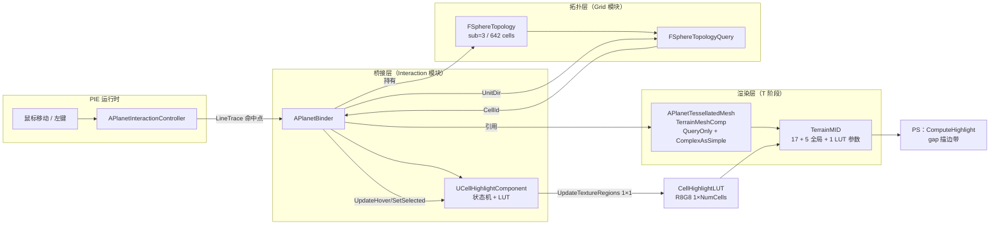
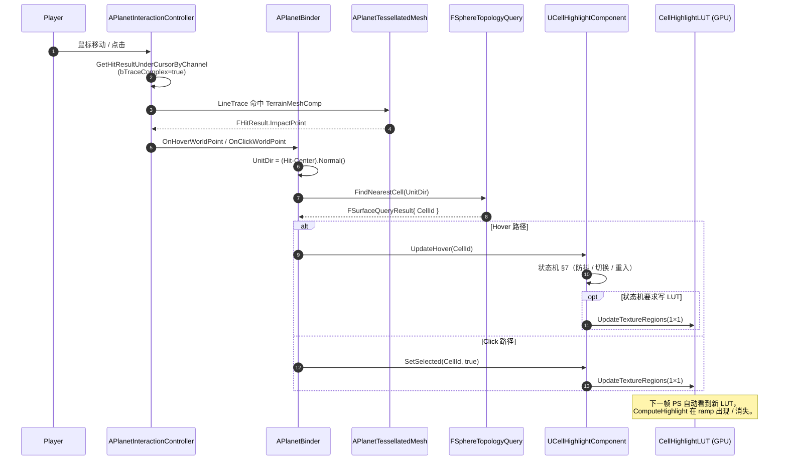
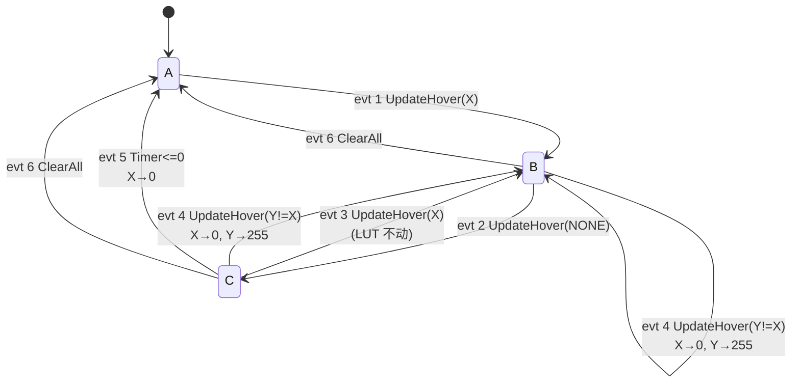

# 球面 Hex/Pent 区域点选高亮 —— R11 交互流统稿

> **目标**：在 PIE 中给 [`APlanetTessellatedMesh`](../Source/TerraCivilization/Public/Render/PlanetTessellatedMesh.h)（T 阶段自研球面网格，默认 `CellSubdivisionLevel=3` 逻辑 / `MeshSubdivisionLevel=4` 渲染）加上**鼠标 hover + 点击 select** 的格子高亮交互。视觉表现：被 hover 或 selected 的 hex/pent 沿 cell 边沿出现一条**贴合 mesh 真实地表**的发光描边带——hover 与 select 两路共享同一套描边管线，仅靠 LUT 通道与全局颜色参数区分。
>
> **本稿定位**：
> - 与 [SphericalSDFTerrainDesign.md §15](SphericalSDFTerrainDesign.md#15-cell-高亮算法描边带)（描边算法核心数学）+ §14.7（球面重心坐标）共同构成 R11 验收闭环的两半——本稿覆盖**交互层 + cpp + LUT 状态机 + 几何源对接 + 设计稿增量**，§15/§14.7 覆盖 HLSL 数学。
> - **2026-06-30 拍板**：废弃旧版"LineBatch + 测地线 Slerp + LineTrace"方案——视觉折线感太重、与材质链路解耦不彻底、几何源还绑死在已废弃的 PTG 插件上。新方案 hover 和 select 完全统一为"材质 gap 描边"，cpp 端只剩"LUT 状态机 + 鼠标射线"两件事。
>
> **关联**：
> - 数学核心：[SphericalSDFTerrainDesign.md §15](SphericalSDFTerrainDesign.md#15-cell-高亮算法描边带) / §14.7
> - 几何源：[PlanetTessellatedMesh.h/cpp](../Source/TerraCivilization/Public/Render/PlanetTessellatedMesh.h) / [TessellatedMeshDesign.md](TessellatedMeshDesign.md)
> - 拓扑查询：[FSphereTopology.h](../Source/Grid/Public/FSphereTopology.h) / [FSphereTopologyQuery.cpp](../Source/Grid/Private/FSphereTopologyQuery.cpp)
> - 材质 HLSL 增量挂载点：[R8.2_SphericalHeightFieldRaymarching.md §5.6](R8.2_SphericalHeightFieldRaymarching.md) 主 HLSL Step 8 末尾（R8.2/R8.3 综合体现行主 HLSL；R8 主稿 §4.4.2.1.R8.1 已过时，仅作 R8.1 baseline 历史参考）

---

## 目录

- [1. 设计原则与拍板决策](#1-设计原则与拍板决策)
- [2. 总体架构](#2-总体架构)
- [3. 数据流时序](#3-数据流时序)
- [4. 文件清单](#4-文件清单)
- [5. 描边带共享数学（链回 §15）](#5-描边带共享数学链回-15)
- [6. CellHighlightLUT 通道分配与全局颜色参数](#6-cellhighlightlut-通道分配与全局颜色参数)
- [7. Hover 状态机（4 状态 / 6 事件）](#7-hover-状态机4-状态--6-事件)
- [8. 几何源切换：APtgManager → APlanetTessellatedMesh](#8-几何源切换aptgmanager--aplanettessellatedmesh)
- [9. HLSL 注入点：ComputeHighlight](#9-hlsl-注入点computehighlight)
- [10. cpp 实现规范](#10-cpp-实现规范)
- [11. 模块依赖与编译配置](#11-模块依赖与编译配置)
- [12. 关卡接线与 EnhancedInput](#12-关卡接线与-enhancedinput)
- [13. 实施步骤（Checklist）](#13-实施步骤checklist)
- [14. 性能预算](#14-性能预算)
- [15. 已知边界与未来扩展](#15-已知边界与未来扩展)
- [附录 A：旧 LineBatch 方案存档（不再使用）](#附录-a旧-linebatch-方案存档不再使用)

---

## 1. 设计原则与拍板决策

| 原则 / 决策 | 含义 |
| --- | --- |
| **几何与拓扑解耦** | 渲染 mesh 由 `APlanetTessellatedMesh` 负责（T 阶段自研球面网格 sub=4），逻辑 cell 拓扑由 `FSphereTopology(sub=3)` 负责。两者**不共享顶点缓冲**，仅共享"球心 + 球半径 GlobeRadiusCM"两个标量。 |
| **hover 与 select 统一管线** | 两者都走"§15 材质 gap 描边带"——共用同一组 (c0,c1,c2,w0,w1,w2)、同一个 `CellHighlightLUT`、同一段 `ComputeHighlight` HLSL；区别仅在 LUT R/G 两个通道（hover 写 R、select 写 G）和两个全局颜色参数（`HoverColor` / `SelectColor`）。**不再为 hover 单独走 LineBatch**——避免视觉风格分裂。 |
| **LUT 写入只发生在状态切换** | hover 不在每帧抖动写 LUT。只有 cell 进入 / 真切换 / 防抖到期才写 1 像素。最坏情况 < 5 次/秒、4 byte/次，可忽略。 |
| **Hover 防抖 0.5s** | 鼠标移出整个球（或离开当前 cell 后再无新 cell 立刻命中）后，hover 描边再保留 0.5s 才清。同 0.5s 内若鼠标重新指回原 cell，描边视觉上**完全无变化**（LUT 不写、状态机走快路径）。 |
| **几何源切到 TessellatedMesh** | 旧 PTG 路线（[SDF §14](SphericalSDFTerrainDesign.md#14-ptg-几何层集成生产环境路线)）已废弃；R11 直接对接 `APlanetTessellatedMesh`，由它的 `TerrainMeshComp` 提供 `QueryOnly` 复杂碰撞。`PlanetBinder` / `PlanetInteractionController` 的鼠标射线全部走 Tess actor。 |
| **不修改 PTG 插件源码** | 旧方案对接 PTG 的反射工具仍保留（`EnsureSphereShape` / 反射读 `Radius`），但执行路径改为"如果 Tess actor 已挂则优先 Tess，PTG 仅作 fallback"。新关卡建议直接用 Tess。 |
| **运行时单帧零分配** | LUT 在 `BeginPlay` 一次性创建（PF_R8G8、1×NumCells、`TF_Nearest`、`SRGB=false`、`NeverStream=true`、`TC_VectorDisplacementmap`）；CPU 镜像 `TArray<uint16> LUTCpuMirror` 持有完整内容；`UpdateTextureRegions` 只更新 1 像素。 |
| **状态机 6 事件 / 4 状态显式枚举** | 见 §7。所有 hover 状态转移都有显式分支处理；防抖、即时切换、重入快路径、强制清空 4 类语义解耦。 |
| **多选预留** | `SelectedCells: TSet<int32>` 已就位，但本期 R11 仅做单选。多选 / 路径高亮 / 板块边界等留给后续里程碑。 |
| **颜色不进 LUT** | `HoverColor` / `SelectColor` 通过 MID 全局 `SetVectorParameterValue` 注入，节省 1.9KB LUT 容量、并支持运行时换色而无需重写 LUT。 |

---

## 2. 总体架构



四个角色清晰分离：

- **几何层 (T 阶段)**：`APlanetTessellatedMesh`，提供"看得见、能撞到、贴 LUT 取材质"的球面 mesh。
- **拓扑层 (Grid)**：`FSphereTopology(sub=3)` 提供 642 cells 的 `O(log N)` 球面方向查询。
- **桥接层 (新建)**：`APlanetBinder` 把 Tess + Topology 钉在同一个球心 / 同一半径上；`UCellHighlightComponent` 持有 LUT + hover 状态机。
- **输入层**：`APlanetInteractionController` 每帧射线，命中 Tess 时把 ImpactPoint 给 Binder。

---

## 3. 数据流时序



---

## 4. 文件清单

新增 / 修改文件全部位于主模块 `Source/TerraCivilization/`。

| 文件 | 角色 | 关键 API |
| --- | --- | --- |
| **修改** [`Public/Interaction/PlanetBinder.h/cpp`](../Source/TerraCivilization/Public/Interaction/PlanetBinder.h) | 桥接层；新增 `TessellatedMeshRef` UPROPERTY 与 `GetTessellatedMesh()` API；旧 `PtgManagerRef` 保留为 fallback；`OnClickWorldPoint` 切到调用 `HighlightComp->ToggleSelected` | `OnHoverWorldPoint` / `OnClickWorldPoint` / `GetTessellatedMesh` / `GetHostActor` / `GetRadius` |
| **重写** [`Public/Interaction/CellHighlightComponent.h/cpp`](../Source/TerraCivilization/Public/Interaction/CellHighlightComponent.h) | 高亮渲染组件（LUT 状态机）；删除 LineBatch / Slerp / DrawLine | `UpdateHover(int32)` / `SetSelected(int32, bool)` / `ToggleSelected(int32)` / `ClearAll` / `EnsureLUTCreated` / `WriteLUTPixel` / `BindToMID(UMaterialInstanceDynamic*)` |
| **修改** [`Private/Interaction/PlanetInteractionController.cpp`](../Source/TerraCivilization/Private/Interaction/PlanetInteractionController.cpp) | LineTrace 目标切到 Tess actor；新增 `OnClickPlanet` 事件 | `PlayerTick` / `InputComponent` 绑定左键 |
| **修改** [`Public/Render/PlanetTessellatedMesh.h/cpp`](../Source/TerraCivilization/Public/Render/PlanetTessellatedMesh.h) | 1) `TerrainMeshComp` 改 `QueryOnly` + `bUseComplexAsSimpleCollision=true` + `bCreateCollision=true`；2) 新增 `SetHighlightLUT(UTexture2D*)` API；3) `ApplyTerrainMaterial_` 注入 `HoverColor` / `SelectColor` / `HighlightPadding` / `HighlightStrength` 4 个全局 MID 参数（默认值见 §6.3）。**注意**：cpp 端 SetVectorParameter / SetScalarParameter 只是把值写进 MID Parameter Collection——要让 Custom 节点 HLSL 能引用到，还必须在材质编辑器手动把这 4 个参数**加进 Custom 节点 Inputs**（详见 §9.1）。 | `SetHighlightLUT` |
| **修改** SDF 主稿 §15 | LUT 通道改 R8G8（hover/select）；删 `bSelected` 单字段；改注入颜色全局参数；select 优先公式 | — |
| **新增锚点** [R8.2 §5.6 主 HLSL](R8.2_SphericalHeightFieldRaymarching.md) 末尾 | Step 8 末尾追加 `// ---- Step 9: ComputeHighlight ----`（手动粘贴到 Custom 节点 Code 字段，HLSL 块见 §9） | — |

---

## 5. 描边带共享数学（链回 §15）

R11 完全沿用 [SDF §15.4 GPU 实现](SphericalSDFTerrainDesign.md#154-gpu-实现) 的核心公式，**仅做两点修订**（详见本稿 §6 / §9）：

1. LUT 从 `RGBA8_UNORM (Color, bSelected)` → `R8G8_UNORM (HoverIntensity, SelectIntensity)`，颜色改为 MID 全局参数；
2. `select 优先`保护：`hoverSum *= (1.0 - saturate(selSum))`，避免同 cell 同时 hover + select 时亮度过曝。

`gap_i = w_i - max(w_others)` 的几何性质（中心 = 1、共边 = 0、共角 = 0、跨三角形连续）完全不变；权重 (w0, w1, w2) 已经在 R5 软边路径里算过（详见 [R5_SharpenSoftEdge.md](R5_SharpenSoftEdge.md) Step 6），R11 **零新增**球面重心坐标计算。

---

## 6. CellHighlightLUT 通道分配与全局颜色参数

### 6.1 LUT 资源规格

| 字段 | 取值 |
| --- | --- |
| 名称 | `CellHighlightLUT` |
| 像素格式 | `PF_R8G8`（每 cell 2 byte） |
| 尺寸 | `NumCells × 1`（默认 642 × 1）|
| 容量 | 642 × 2 byte = **1.25 KB** |
| Filter | `TF_Nearest` |
| SRGB | `false` |
| Address X/Y | `TA_Clamp` |
| `NeverStream` | `true` |
| `LODGroup` | `TEXTUREGROUP_ColorLookupTable` |
| `MipGenSettings` | `TMGS_NoMipmaps` |
| `CompressionSettings` | `TC_VectorDisplacementmap`（与 `CellAttrLUT` 一致，强制裸像素不压缩）|
| 创建方式 | `UTexture2D::CreateTransient` |
| 预填充 | 全 0（表示 642 cells 都未 hover、未 selected） |

### 6.2 通道分配

| 通道 | 字段 | 含义 | 取值 |
| --- | --- | --- | --- |
| **R** | `HoverIntensity` | 当前 cell 的 hover 强度 | `0` 或 `255`（R11 二值切换；不做渐变 fade） |
| **G** | `SelectIntensity` | 当前 cell 的 select 强度 | `0` 或 `255`（toggle） |

未来扩展（B / A 通道，本期不实现）：B 可承载"path 高亮组编号"、A 可承载 hover 渐变 alpha。

### 6.3 全局颜色与描边参数（MID Scalar / Vector）

由 `APlanetTessellatedMesh::ApplyTerrainMaterial_` 在每次 Rebuild 时注入 MID。运行时可由 cpp 任意改色：

| 参数名 | 类型 | 默认值 | 含义 |
| --- | --- | --- | --- |
| `HoverColor` | Vector(RGB) | `(1.00, 0.85, 0.10)` 暖金 | hover 描边色 |
| `SelectColor` | Vector(RGB) | `(0.20, 0.90, 1.00)` 青蓝 | select 描边色 |
| `HighlightPadding` | Scalar | `0.15` | gap 描边带宽（cell 张角的 15%；§15.4 推荐值） |
| `HighlightStrength` | Scalar | `1.50` | 全局描边强度倍率（>1 = 加性叠加到 albedo 时更醒目） |

> **Editor 暴露**：以上 4 个参数都做成 `APlanetTessellatedMesh` 的 `UPROPERTY(EditAnywhere, Category="PlanetTopology|Tess|R11 Highlight")`，运行期可直接拖动调试。

---

## 7. Hover 状态机（4 状态 / 6 事件）

### 7.1 状态定义

| 状态 | `CurrentHoverCell` | `PendingHoverCell` | `HoverFadeTimer` | LUT.R 状态 |
| --- | --- | --- | --- | --- |
| **A. 无 hover** | `INDEX_NONE` | `INDEX_NONE` | 0 | 全 0 |
| **B. 稳定 hover X** | `X` | `X` | 0 | `LUT[X].R = 255` |
| **C. X 在 fade-out** | `X` | `INDEX_NONE` | (0, 0.5] | `LUT[X].R = 255` |
| **D. X→Y 即时切换瞬态** | `Y` | `Y` | 0 | `LUT[Y].R = 255`（X 已被同帧清零） |

> 说明：状态 D 与 B 在数据上完全一致——D 只是 B 的特例（瞬态从某状态迁入），保留为单独状态仅出于状态机推演清晰。实现时 D 与 B 合并为同一行为分支。

### 7.2 事件枚举（鼠标位置 → cell 解算结果）

`UpdateHover(NewCellId)` 每帧由 `PlanetInteractionController::PlayerTick` 调用（即使鼠标没动也调）。`NewCellId == INDEX_NONE` 表示鼠标当前不在球上。

| # | 事件 | 当前状态 | 操作 | 转移到 |
| --- | --- | --- | --- | --- |
| 1 | `UpdateHover(X)` | A | `WriteLUTPixel(X, R=255)`；`Current = Pending = X`；`Timer = 0` | B |
| 2 | `UpdateHover(INDEX_NONE)` | B | `Pending = INDEX_NONE`；`Timer = 0.5s`；**LUT 不动** | C |
| 3 | `UpdateHover(X)` | C（`Current==X`）| `Pending = X`；`Timer = 0`；**LUT 不动**（最快路径，重入同 cell） | B |
| 4 | `UpdateHover(Y, Y!=X)` | B 或 C | `WriteLUTPixel(Current, R=0)`；`WriteLUTPixel(Y, R=255)`；`Current = Pending = Y`；`Timer = 0`（**即时切换，无淡出**） | B |
| 5 | `TickComponent` 每帧倒计时 | C | `Timer -= DeltaTime`；当 `Timer <= 0` 时 `WriteLUTPixel(Current, R=0)`；`Current = INDEX_NONE` | A |
| 6 | `ClearAll()` 强制清空 | 任意 | 清 hover 与所有 select；`WriteLUTPixel` 把所有非零行写 0 | A |

事件 4 同时覆盖了"B→D"（B 状态接到新 cell）与"C→D"（fade-out 期间接到新 cell）两条线，行为完全一致：旧 cell 立刻清零、新 cell 立刻 = 255。这是状态机最关键的"即时切换"性能优化——用户在 cells 之间快速划动时，描边随鼠标即时跟随、防抖只在"鼠标真离开整个球"时生效。

### 7.3 状态机流程图



### 7.4 Select 状态（独立于 hover 状态机）

Select 不走状态机——左键点击直接 `SetSelected(CellId, true/false)`：

```cpp
void UCellHighlightComponent::SetSelected(int32 CellId, bool bSelected)
{
    if (!CellTopology->Cells.IsValidIndex(CellId)) return;
    const bool bWas = SelectedCells.Contains(CellId);
    if (bSelected == bWas) return;
    if (bSelected) SelectedCells.Add(CellId); else SelectedCells.Remove(CellId);
    WriteLUTPixel(CellId);  // 重写 R8G8——R 取自 hover 状态、G = bSelected ? 255 : 0
}

void UCellHighlightComponent::ToggleSelected(int32 CellId)
{
    SetSelected(CellId, !SelectedCells.Contains(CellId));
}
```

---

## 8. 几何源切换：`APtgManager` → `APlanetTessellatedMesh`

### 8.1 必须的 cpp 改动

`APlanetTessellatedMesh` 当前两个 mesh 子组件都是 `NoCollision`——R11 必须启用 `TerrainMeshComp` 的复杂碰撞，否则鼠标射线打不到任何东西：

```cpp
// 构造函数中：
TerrainMeshComp->SetCollisionEnabled(ECollisionEnabled::QueryOnly);
TerrainMeshComp->SetCollisionObjectType(ECC_WorldStatic);
TerrainMeshComp->SetCollisionResponseToAllChannels(ECR_Block);
TerrainMeshComp->bUseComplexAsSimpleCollision = true;
TerrainMeshComp->SetCanEverAffectNavigation(false);

// RebuildTerrainMesh_ 中提交 mesh 时：
TerrainMeshComp->CreateMeshSection_LinearColor(
    /*SectionIndex*/ 0, ..., /*bCreateCollision*/ true);  // ← 改 true
```

水面 `WaterMeshComp` 保持 `NoCollision`（射线穿过水面命中地表是预期行为）。

### 8.2 PlanetBinder 切换策略

`APlanetBinder` 新增 `TObjectPtr<APlanetTessellatedMesh> TessellatedMeshRef` UPROPERTY。`GetHostActor()` 返回**优先 Tess、次选 PTG**：

```cpp
AActor* APlanetBinder::GetHostActor() const
{
    if (TessellatedMeshRef) return TessellatedMeshRef.Get();
    return PtgManagerRef.Get();
}

float APlanetBinder::GetRadius() const
{
    if (TessellatedMeshRef) return TessellatedMeshRef->GlobeRadiusCM;
    // 旧 PTG 反射路径保留作 fallback
    if (PtgManagerRef)
    {
        if (const FFloatProperty* Prop = FindFProperty<FFloatProperty>(PtgManagerRef->GetClass(), TEXT("Radius")))
            return Prop->GetPropertyValue_InContainer(PtgManagerRef);
    }
    return 15000.0f;
}
```

`OnHoverWorldPoint` 取 `GetHostActor()->GetActorLocation()` 作为球心；与 `APtgManager` 的具体类型解耦。

### 8.3 Controller 切换策略

`APlanetInteractionController::PlayerTick` 中 trace 命中目标判断改为：

```cpp
AActor* HostActor = CachedBinder->GetHostActor();
const bool bHitHost = bHit && Hit.GetActor() == HostActor;
```

PTG / Tess 两种 actor 都能 work。`bTraceComplex = true` 必须保留——`UProceduralMeshComponent` 与 `URuntimeMeshComponent` 默认走复杂碰撞。

### 8.4 LUT 与 Tess MID 的绑定路径

`UCellHighlightComponent::BeginPlay`：
1. 读取 `Binder->GetTessellatedMesh()`，取拿 `CellTopology` 的 `Cells.Num()`（用于 LUT 大小）。
2. `EnsureLUTCreated()` 创建 1×NumCells 的 R8G8 transient texture，CPU 镜像 `LUTCpuMirror.SetNumZeroed(NumCells)`。
3. 调 `TessellatedMeshRef->SetHighlightLUT(HighlightLUT)`——后者把 LUT 注入到 `TerrainMID` 的 `CellHighlightLUT` Texture Parameter，并把 `HoverColor` / `SelectColor` / `HighlightPadding` / `HighlightStrength` 4 个 MID 参数也设上。
4. 当 `APlanetTessellatedMesh::Rebuild()` 重建 MID 时（OnConstruction / PIE 退出钩子），它会先重建 MID，再在 `ApplyTerrainMaterial_` 末尾调 `BindHighlightLUTIfReady_()`——后者从 `Binder->GetHighlightComp()->GetHighlightLUT()` 拿当前 LUT 资源指针重新塞回新 MID（避免 MID 重建后 LUT 参数丢失）。

---

## 9. HLSL 注入点：`ComputeHighlight`

### 9.1 输入约定

R11 复用 R8.2 主材质 Custom HLSL 节点中**已有**的局部变量，并在 Custom 节点 Inputs 数组末尾追加 **5 项**新 Input（把 4 个 MID 全局参数 + 1 张 LUT 都通过 Inputs 送进 Custom 节点作用域）：

| 局部变量 | 类型 | 来源 |
| --- | --- | --- |
| `c0`, `c1`, `c2` | int | R8.2 §5.6 Step 1（8-bit 拆分还原，Custom 节点内部）|
| `wA`, `wB`, `wC` | float | R8.2 §5.6 Step 6（R5 软边权重，Custom 节点内部）|
| `albA`, `albB`, `albC` | float3 | R8.2 §5.6 Step 7（详见 [R8.2 §5.6 SAMPLE_PARAM_PBR](R8.2_SphericalHeightFieldRaymarching.md) 宏输出的三层已灰度化后 albedo；R8.3 灰度 patch 已在宏内完成）|
| `wsum` | float | R8.2 §5.6 Step 6.5（`wA + wB + wC + 1e-6`，Custom 节点内部）|
| `CellHighlightLUT` | Texture2D | **R11 新增第 25 项 Input**（Texture Object，材质图接 Texture Object Parameter 节点，参数名 `CellHighlightLUT`）|
| `HoverColor` | float3 | **R11 新增第 26 项 Input**（`CMOT_Float3`，材质图接 Vector Parameter 节点、参数名 `HoverColor`）|
| `SelectColor` | float3 | **R11 新增第 27 项 Input**（`CMOT_Float3`，材质图接 Vector Parameter 节点、参数名 `SelectColor`）|
| `HighlightPadding` | float | **R11 新增第 28 项 Input**（`CMOT_Float1`，材质图接 Scalar Parameter 节点、参数名 `HighlightPadding`）|
| `HighlightStrength` | float | **R11 新增第 29 项 Input**（`CMOT_Float1`，材质图接 Scalar Parameter 节点、参数名 `HighlightStrength`）|

> ⚠ **重要**：UE Custom 节点是一个**函数体块**——HLSL 只能看到显式列在 Custom 节点 **Inputs** 数组里的变量。**光在材质图上放 Scalar/Vector Parameter 节点、光在 cpp 端 SetScalarParameter 都不够**——必须让这 4 个参数**进 Custom 节点的 Inputs**，成为函数入参。这与 R8.2 已有 `EdgeWidth` / `TileScale` / `MaxRaymarchDepthCM` 等 Scalar 参数的做法完全一致（详见 [R8 §4.4.1](R8_ParametricTint.md) Inputs 表 9~13 项、[R8.2 §5.2](R8.2_SphericalHeightFieldRaymarching.md) 表 20~24 项）。
>
> **常见错误**：只加了 `CellHighlightLUT` 一项 Input、其余 4 个 MID 全局参数没进 Inputs——编译期会报 `HighlightPadding undeclared` / `HighlightStrength undeclared` / `HoverColor undeclared` / `SelectColor undeclared`。补齐第 26~29 项即可。

> ⚠ **与旧版不同**：上一版本本节劣贴的版本是在 R8.0 baseline `colA/colB/colC` + `return float4(..., roughOut)` 上动手脚的。现行 R8.2/R8.3 综合体中：
>
> 1. 三层颜色变量名从 `colA/B/C` 改为 `albA/B/C`（SAMPLE_PARAM_PBR 三输出中的 albedo）；
> 2. R8.2 Custom 节点 **主出口是 Float3**（连 BaseColor），roughness 走 `OutRoughness`（Additional Output 1）、法线走 `OutNormalTS`（Additional Output 0）、PixelDepthOffset 走 `OutPixelDepthOffset`（Additional Output 2）——**不在主 return 里拼第 4 通道**；
> 3. R8.3 灰度化部分在 `SAMPLE_PARAM_PBR` 宏内部完成（详见 [R8.2 §5.6](R8.2_SphericalHeightFieldRaymarching.md) 宏内 `_LUMA_REC601 = float3(0.299, 0.587, 0.114); _aMix = dot(_aMix, _LUMA_REC601).xxx;` 三行），R11 highlight 加色位于宏外、Step 8 加权之后、主 return 之前。

### 9.2 完整 HLSL 块（粘贴到 R8.2 主材质 Custom 节点 Code 字段 Step 8 末尾）

> ⚠ **R11.1 修订（2026-07-01）**：初版本节 HLSL 使用 `gap_i = w_i - max(w_others)` 公式——但 R8.2 主 HLSL 里的 `wA/wB/wC` 是 R5 软边**归属权重**（`smoothstep(halfEW, -halfEW, deltaI)`，二值 0/1 的软化版本），不是 §15 假设的球面重心坐标。用它算 gap 会导致：cell 领地内部整片 gap ≈ 1（因为 wA=1、wB=wC=0），R5 软边过渡带内 gap 从 1 平滑降到 0——**外边界完全由 R5 `EdgeWidth` 决定，与 `HighlightPadding` 无关**——最终视觉是"整个 cell 领地都发光，仅 padding 影响内边界"，形成巨大嵌套六边形（bug 现象截图见 [问题记录](https://assets.with.tencent.com/default/5e60a64f-6186-4e09-81fa-299cd8758c4e/image-4204579b30644a198e5a035da7055057.png)）。
>
> **修法**：直接使用 R8.2 §5.6 Step 6 已算好的 `deltaA/B/C = thetaI - min(thetaOthers)`——这才是"到 hex 边的角距离（弧度）"。`-deltaI > 0` 表示在 I 领地内、值就是"离边多深"。`HighlightPadding` 从"gap 阈值（无量纲）"改为"到边角距离（弧度）"——对 sub=3 的 642 cells，cell 张角约 0.2 rad ≈ 12°，推荐默认 **0.03 rad ≈ 1.7°**（cell 半径的 ~15%），cpp 默认值已同步调整。
>
> 只改 HLSL 与默认值，Custom Inputs 数量与名字都不变（`HighlightPadding` 仍是第 28 项 Scalar Input）；MID 端 cpp 端注入路径都不动。

```hlsl
// ============================================================
//  Step 9 (R11.1): Hex/Pent 高亮描边带（hover + select 统一管线）
//
//  详见 Docs/HexHighlightInteractionPlan.md §9 与
//      Docs/SphericalSDFTerrainDesign.md §15.4。
//
//  · LUT[c].r = HoverIntensity (0..1)
//  · LUT[c].g = SelectIntensity (0..1)
//  · deltaA/B/C 是 R8.2 §5.6 Step 6 已算好的量：thetaI - min(thetaOthers)
//    - deltaI < 0：dir 更靠近 I（在 I 领地内），|deltaI| = 到 hex 边的弧度距离
//    - deltaI = 0：正在 I 与最近邻居的 hex 边上
//    - deltaI > 0：dir 不属于 I 领地
//  · edge_i = 只在 depth_i ∈ (0, HighlightPadding) 弧度带内 从 1 平滑降到 0
//  · select 优先：hover 在已 selected cell 上不叠加（避免过曝）
//
//  插入位置：在 R8.2 现行 HLSL 的
//      `return (albA * wA + albB * wB + albC * wC) / wsum;`
//  这一行之前，把该行拆成下面三行：
// ============================================================
float2 hL0 = CellHighlightLUT.Load(int3(c0, 0, 0)).rg;
float2 hL1 = CellHighlightLUT.Load(int3(c1, 0, 0)).rg;
float2 hL2 = CellHighlightLUT.Load(int3(c2, 0, 0)).rg;

// depth_i = 到 i 六边形边的角距离（弧度）；> 0 表示在 i 领地内。
float depthA = -deltaA;
float depthB = -deltaB;
float depthC = -deltaC;

// 只在 (0, HighlightPadding) 弧度带内发光；深入超过 padding 或不在该 cell 领地都不发光。
// step(0, depth) 显式门控"只在 i 领地内"（depth <= 0 时输出 0）。
float edge0 = (1.0 - smoothstep(0.0, HighlightPadding, depthA)) * step(0.0, depthA);
float edge1 = (1.0 - smoothstep(0.0, HighlightPadding, depthB)) * step(0.0, depthB);
float edge2 = (1.0 - smoothstep(0.0, HighlightPadding, depthC)) * step(0.0, depthC);

// 双通道叠加
float hoverSum  = edge0 * hL0.r + edge1 * hL1.r + edge2 * hL2.r;
float selectSum = edge0 * hL0.g + edge1 * hL1.g + edge2 * hL2.g;

// select 优先：当 cell 已 select 时，hover 不再叠加
hoverSum *= saturate(1.0 - selectSum);

float3 highlightRGB = (HoverColor * hoverSum + SelectColor * selectSum) * HighlightStrength;

// 把 highlight 加到主输出（Float3 主 return，BaseColor pin）。
// R8.2 原行：   return (albA * wA + albB * wB + albC * wC) / wsum;
// R11 拆为：
float3 baseRGB = (albA * wA + albB * wB + albC * wC) / wsum;
return baseRGB + highlightRGB;
```

> ⚠ **不要动以下 Additional Outputs**：R8.2 主材质 Custom 节点的 `OutNormalTS` / `OutRoughness` / `OutPixelDepthOffset` 是在 Step 8 中间已赋值的（line 1622~1630）——R11 只接手主出口 albedo，不动法线 / 粗糙 / PDO。描边带**只加到 albedo** 是设计初衷（避免在 hover cell 上额外产生法线扣坍或 PDO 错位）。

### 9.3 R8 主稿增量描述

R8.2 现行主稿 [R8.2_SphericalHeightFieldRaymarching.md §5.6](R8.2_SphericalHeightFieldRaymarching.md)（R8.2/R8.3 综合体主 HLSL）末尾增加一段：

> **R11 增量**：在 Step 8 末尾、主 `return (albA * wA + albB * wB + albC * wC) / wsum;` **之前** 追加上述 Step 9 高亮块（将原 “return 计算” 拆为 `baseRGB` + `highlightRGB` 两行）。Custom 节点 Inputs 列表在 R8.2 24 项之后**追加 5 项 Inputs**：`CellHighlightLUT`（Texture Object）+ `HoverColor` (`CMOT_Float3`) + `SelectColor` (`CMOT_Float3`) + `HighlightPadding` (`CMOT_Float1`) + `HighlightStrength` (`CMOT_Float1`)。材质图配套添加 1 个 Texture Object Parameter（`CellHighlightLUT`，位置 A 留空 = Transient） + 2 个 Vector Parameter（`HoverColor`/`SelectColor`）+ 2 个 Scalar Parameter（`HighlightPadding`/`HighlightStrength`），各自 output 连到 Custom 节点对应 Input 上。Additional Outputs（`OutNormalTS` / `OutRoughness` / `OutPixelDepthOffset`）不动。其余字段不变。

`APlanetTessellatedMesh::DiagnoseR8Material_()` 与 `APlanetTopologyDebugMesh` 内的同名诊断函数中，`ExpectedR8Inputs` 数组**追加 5 项**：`"cellhighlightlut"` / `"hovercolor"` / `"selectcolor"` / `"highlightpadding"` / `"highlightstrength"`（小写比较），共 **29 inputs**（R8.2 24 项 + R11 5 项）。

---

## 10. cpp 实现规范

### 10.1 `UCellHighlightComponent`

```cpp
UCLASS(ClassGroup=(Planet), meta=(BlueprintSpawnableComponent))
class TERRACIVILIZATION_API UCellHighlightComponent : public UActorComponent
{
    GENERATED_BODY()

public:
    UCellHighlightComponent();

    //~ UActorComponent
    virtual void BeginPlay() override;
    virtual void EndPlay(const EEndPlayReason::Type Reason) override;
    virtual void TickComponent(float DeltaTime, ELevelTick TickType,
                               FActorComponentTickFunction* ThisTickFunction) override;

    /** 防抖时长（秒）。鼠标移出后保留 hover 描边的时间。 */
    UPROPERTY(EditAnywhere, BlueprintReadWrite, Category="Highlight",
              meta=(ClampMin="0.0", ClampMax="5.0"))
    float HoverFadeDuration = 0.5f;

    /** 由 PlanetInteractionController::PlayerTick 每帧调用。 */
    void UpdateHover(int32 NewCellId);

    /** 左键点击时切换 select 状态。 */
    void ToggleSelected(int32 CellId);

    /** 显式设 / 清 select 状态。 */
    void SetSelected(int32 CellId, bool bSelected);

    /** 强制清空 hover + 全部 select。 */
    void ClearAll();

    /** 清空 hover（用于鼠标离开球的瞬间，等价于 UpdateHover(INDEX_NONE)）。 */
    void ClearHover();

    /** 给 APlanetTessellatedMesh 调用，从外部读取 LUT 指针注入 MID。 */
    UTexture2D* GetHighlightLUT() const { return HighlightLUT; }

private:
    /** 创建 1×NumCells R8G8 LUT + CPU 镜像。 */
    void EnsureLUTCreated_();

    /** 把 CPU 镜像中第 CellId 行的 (R, G) 重新算出来并 UpdateTextureRegions(1×1)。 */
    void WriteLUTPixel_(int32 CellId);

    /** 从 Binder 拿 Tess actor 与 NumCells；Binder 缺失时返回 false。 */
    bool ResolveDeps_(int32& OutNumCells);

    UPROPERTY(Transient)
    TObjectPtr<UTexture2D> HighlightLUT;

    /** CPU 镜像，每 cell 一个 uint16：低 8 位 = HoverIntensity，高 8 位 = SelectIntensity。 */
    TArray<uint16> LUTCpuMirror;

    /** Hover 状态机字段（详见 §7）。 */
    int32 CurrentHoverCell = INDEX_NONE;
    int32 PendingHoverCell = INDEX_NONE;
    float HoverFadeTimer   = 0.0f;

    /** 多选集合（R11 仅做单选交互，但接口上保留 Set）。 */
    TSet<int32> SelectedCells;
};
```

`WriteLUTPixel_` 的 RHI 上传走 `FTexture2DRHIRef::UpdateTexture2D` 不直接可用——UE 推荐用 `UTexture2D::UpdateTextureRegions`（见 `Engine/Source/Runtime/Engine/Public/Engine/Texture2D.h`）。最简单的做法是分配一个 `FUpdateTextureRegion2D{X, 0, 0, 0, 1, 1}` 然后传 1 字节 stride、2 byte/pixel 的 buffer。

### 10.2 `APlanetTessellatedMesh::SetHighlightLUT` 与全局参数注入

```cpp
void APlanetTessellatedMesh::SetHighlightLUT(UTexture2D* InLUT)
{
    if (TerrainMID && InLUT)
    {
        TerrainMID->SetTextureParameterValue(TEXT("CellHighlightLUT"), InLUT);
    }
}

// ApplyTerrainMaterial_ 末尾追加：
NewMID->SetVectorParameterValue(TEXT("HoverColor"),
    FLinearColor(HighlightHoverColor.R, HighlightHoverColor.G, HighlightHoverColor.B, 0.0f));
NewMID->SetVectorParameterValue(TEXT("SelectColor"),
    FLinearColor(HighlightSelectColor.R, HighlightSelectColor.G, HighlightSelectColor.B, 0.0f));
NewMID->SetScalarParameterValue(TEXT("HighlightPadding"),  HighlightPadding);
NewMID->SetScalarParameterValue(TEXT("HighlightStrength"), HighlightStrength);
```

新增 4 个 UPROPERTY：

```cpp
UPROPERTY(EditAnywhere, BlueprintReadWrite, Category="PlanetTopology|Tess|R11 Highlight")
FLinearColor HighlightHoverColor = FLinearColor(1.0f, 0.85f, 0.10f);

UPROPERTY(EditAnywhere, BlueprintReadWrite, Category="PlanetTopology|Tess|R11 Highlight")
FLinearColor HighlightSelectColor = FLinearColor(0.20f, 0.90f, 1.00f);

UPROPERTY(EditAnywhere, BlueprintReadWrite, Category="PlanetTopology|Tess|R11 Highlight",
          meta=(ClampMin="0.01", ClampMax="0.5"))
float HighlightPadding = 0.15f;

UPROPERTY(EditAnywhere, BlueprintReadWrite, Category="PlanetTopology|Tess|R11 Highlight",
          meta=(ClampMin="0.0", ClampMax="5.0"))
float HighlightStrength = 1.50f;
```

### 10.3 `APlanetBinder` 增量

```cpp
UPROPERTY(EditAnywhere, BlueprintReadOnly, Category="Planet")
TObjectPtr<APlanetTessellatedMesh> TessellatedMeshRef;

AActor* GetHostActor() const;            // 优先 Tess、次选 PTG
APlanetTessellatedMesh* GetTessellatedMesh() const { return TessellatedMeshRef; }
UCellHighlightComponent* GetHighlightComp() const { return HighlightComp; }

// OnHoverWorldPoint：球心改取 GetHostActor()->GetActorLocation()
// OnClickWorldPoint：保留旧函数签名，转调 HighlightComp->ToggleSelected(R.CellId)
```

### 10.4 `APlanetInteractionController` 增量

```cpp
// PlayerTick 末尾改为：
AActor* HostActor = CachedBinder->GetHostActor();
const bool bHitHost = bHit && Hit.GetActor() == HostActor;
if (bHitHost)
{
    CachedBinder->OnHoverWorldPoint(Hit.ImpactPoint);
    bWasHovering = true;
    // 左键点击瞬时落在 Tess 表面时，转调 OnClick
    if (WasInputKeyJustPressed(EKeys::LeftMouseButton))
    {
        CachedBinder->OnClickWorldPoint(Hit.ImpactPoint);
    }
}
else if (bWasHovering)
{
    CachedBinder->OnLeavePlanet();
    bWasHovering = false;
}
```

---

## 11. 模块依赖与编译配置

`Source/TerraCivilization/TerraCivilization.Build.cs` 已经添加 `Grid`、`ProceduralTerrainGenerator`、`ProceduralMeshComponent`——R11 不需要新增模块。

`Engine` 的 `RHI` / `RenderCore` 由主模块默认依赖（`UpdateTextureRegions` 走 `FRHICommandList`）。

---

## 12. 关卡接线与 EnhancedInput

1. **关卡布置**：
   - 拖入 `BP_PlanetTessellatedMesh`（继承自 `APlanetTessellatedMesh`），设置好 `GlobeRadiusCM=15000`、`CellSubdivisionLevel=3`、`MeshSubdivisionLevel=4`、材质 / LUT 全套就位。
   - 拖入 `BP_PlanetBinder`，**`TessellatedMeshRef` 指向上一步**；旧 `PtgManagerRef` 留空（除非要回归 PTG）；`SubdivisionLevel = 3`。
   - `World Settings → Game Mode → PlayerControllerClass = BP_PlanetInteractionController`。
2. **EnhancedInput（可选）**：本期 cpp 直接走 `WasInputKeyJustPressed(EKeys::LeftMouseButton)` 检测左键，无需 Mapping Context。如要换成 BP 接线，可以：
   - 创建 `IA_ClickPlanet`（Bool，Mouse Left Button，Triggers = `Pressed`）；
   - 在 Controller `BeginPlay` 中 `AddMappingContext(IMC_Planet, 0)`；
   - 绑 `BindAction(IA_ClickPlanet, ETriggerEvent::Triggered, this, &APlanetInteractionController::OnClickPlanet)`。
3. **Cursor 显示**：`bShowMouseCursor = true; bEnableClickEvents = true;`（Controller 构造函数已就位）。

---

## 13. 实施步骤（Checklist）

逐项推进，每步可独立 PR / commit，与旧 LineBatch 路线对齐。

- [ ] **Step 1**：`APlanetTessellatedMesh::TerrainMeshComp` 改 `QueryOnly + ComplexAsSimple + bCreateCollision=true`；用 `DrawDebugLine` 验证鼠标射线能命中 mesh 表面（暂不接 `PlanetBinder`）。
- [ ] **Step 2**：`APlanetTessellatedMesh` 新增 `HighlightHoverColor` / `SelectColor` / `Padding` / `Strength` UPROPERTY 与 `SetHighlightLUT` API；`ApplyTerrainMaterial_` 末尾注入 4 个全局参数。运行后用 RenderDoc / Frame Debugger 确认 MID 上 `HoverColor` 等参数已设。
- [ ] **Step 3**：在 R8.2 主材质 Custom 节点上手动**追加 5 项 Inputs**（`CellHighlightLUT` + `HoverColor` + `SelectColor` + `HighlightPadding` + `HighlightStrength`，详见 §9.1 表末尾），并在材质图上添加对应的 1×Texture Object Parameter + 2×Vector Parameter + 2×Scalar Parameter 节点、逐一连到 Custom 节点；再粘贴 §9.2 HLSL 块；编辑器编译通过 → MID 反射诊断输出 29 inputs PASS（R8.2 24 项 + R11 5 项）。
- [ ] **Step 4**：重写 `CellHighlightComponent`（删 LineBatch，加 LUT 状态机）。`BeginPlay` 创建 LUT、调 `SetHighlightLUT`；用 cpp `Tick` 假装写一个 cell 的 hover=255 看是否出现描边。
- [ ] **Step 5**：`PlanetBinder` 加 `TessellatedMeshRef` 与 `GetHostActor`；`OnHoverWorldPoint` 球心改取 host actor location。`PlanetInteractionController` 命中目标改 `GetHostActor()`。
- [ ] **Step 6**：把 hover 状态机 6 事件全部接通（`UpdateHover` + `Tick` 倒计时 + `ClearHover` + `ClearAll`）。验收：鼠标在球上滑动时 hover 即时切换；移出球后 0.5s 才消失；移出又移回原 cell 时无任何 LUT 写入（在 `WriteLUTPixel_` 加 `UE_LOG` 计数验证）。
- [ ] **Step 7**：`OnClickWorldPoint` 转调 `ToggleSelected`，验证 click 持久化、再次 click 取消、与 hover 颜色独立。同 cell 同时 hover + select 时 hover 不叠加（select 优先）。
- [ ] **Step 8**：五边形 cell 回归测试（12 个特殊点：lat = ±26.565° 各 5 个 + 极点 2 个）；用 SelectColor=红色截图对照。
- [ ] **Step 9**：性能验证：连续 60 帧鼠标快速划过 60 cells，`UpdateTextureRegions` 调用次数 < 120（每个 cell 进入 + 离开各 1 次），不超过 1.5 ms / 帧。
- [ ] **Step 10**：把旧 `RebuildLines` / `SlerpUnit` / `OrderCellCorners` 等死代码全部删除，`ULineBatchComponent` include 清空。

---

## 14. 性能预算

| 阶段 | 单次成本（sub=3, 642 cells） | 频率 |
| --- | --- | --- |
| `EnsureLUTCreated_`（创建 R8G8 1×642 + CPU mirror） | ~50 µs | BeginPlay 仅 1 次 |
| 鼠标 LineTrace（cursor → Tess） | ~30 µs（5120 三角形复杂碰撞） | 每帧 |
| `FindNearestCell` | ~2 µs（35 次 dot） | 每帧 |
| `UpdateHover` 状态机决策（不写 LUT 的快路径） | < 0.5 µs | 每帧 |
| `WriteLUTPixel_` + `UpdateTextureRegions(1×1)` | ~5 µs（含 RHI 任务投递） | 仅状态切换时（< 5 次/秒）|
| PS 端 `ComputeHighlight`（3× LUT.Load + 6× madd + 3× smoothstep） | ~6 ops / fragment | 每像素 |
| **总计每帧最坏** | **< 0.05 ms** CPU + **+0.05 ms** GPU（1080p）| 远低于 16.6 ms |

→ 与旧 LineBatch 方案相比，CPU 端从 ~200 µs / 切换 缩到 ~5 µs / 切换；GPU 端代价微乎其微。**完全可承担**。

---

## 15. 已知边界与未来扩展

### 边界条件

1. **必须保留 `bTraceComplex = true`**：`UProceduralMeshComponent::SetCollisionEnabled(QueryOnly)` 默认走复杂碰撞；`bUseComplexAsSimpleCollision = true` 让简单射线也走复杂网格。
2. **Tess Rebuild 时 LUT 重新绑定**：`APlanetTessellatedMesh::Rebuild()` 会重建 MID，旧 MID 上的 `CellHighlightLUT` 参数会丢；解决路径：`ApplyTerrainMaterial_` 末尾调 `BindHighlightLUTIfReady_()`，从绑在同关卡的 `APlanetBinder->GetHighlightComp()->GetHighlightLUT()` 反向查询 LUT 重新塞入新 MID。
3. **NumCells 必须与 Tess 的 `CellSubdivisionLevel` 严格一致**：`UCellHighlightComponent::EnsureLUTCreated_` 直接读 `Binder->GetTessellatedMesh()->CellSubdivisionLevel` 计算 NumCells，禁止从其他来源（例如 Binder 自己的 SubdivisionLevel UPROPERTY）取值——否则 LUT 行数不对、PS 端 `c0/c1/c2` 越界。
4. **PIE 退出后状态保持**：`APlanetTessellatedMesh::OnPostWorldCleanup_` 已经会强制 Rebuild，配合 §15 D2 的 LUT 重绑定一并恢复。`UCellHighlightComponent` 的 hover 状态在 EndPlay 时 ClearAll，保证下次 PIE 启动 = 干净状态。
5. **退化情况**：射线打不中 → `OnLeavePlanet` → `UpdateHover(INDEX_NONE)` → 状态机走 evt 2（B→C）；0.5s 后描边消失。
6. **多 PlanetBinder 关卡**：当前 controller 用 `UGameplayStatics::GetActorOfClass` 取第一个 binder——多球关卡需要扩展为按"鼠标命中的 actor 反查 binder"。本期不做。

### 自然扩展点

| 扩展 | 改动 |
| --- | --- |
| 多选（按住 Shift 加选） | `SelectedCells` 已是 `TSet`；Controller `OnClickPlanet` 处加 `IsInputKeyDown(EKeys::LeftShift)` 判断 |
| 高亮邻居（"展示移动力 = 2 的可达范围"） | 直接调 `Query->CollectCellDisk(CenterCellId, 2, OutCellIds)`，对每个 Cell 也 `SetSelected(true)` |
| 五边形特殊地标颜色 | 给 `LUTCpuMirror` 写入时区分 `Cell.bIsPentagon`，对应 cell 设独立 SelectColor |
| 板块边界可视化 | 新增 LUT.B 通道存"板块编号"；shader 端在 cell-cell 边界检测两侧 cell 的板块编号差异，差异时点亮额外通道 |
| Hover 渐变（C 状态淡出动画） | 把 `WriteLUTPixel_` 在状态 C 中改为每帧 `R = 255 * (Timer / HoverFadeDuration)`（写入频率从 < 5/s 升到 60/s × N hover-cells，仍 < 60/s 总写入，仍可承担） |
| 可达范围地形位移 | 共享同一套 `gap_i`，把 highlight 从 albedo 加性改为 `PixelDepthOffset` 的脉冲位移 |

---

## 附录 A：旧 LineBatch 方案存档（不再使用）

> ⚠ 2026-06-30 弃用。本附录仅作历史参照，方便对照阅读旧 cpp 注释。新 cpp 落地不再使用 `ULineBatchComponent`。

旧方案核心：
- 把 hex 边的 5/6 个 corner 通过 `FCorner.NeighborCornerIds` 闭环排序；
- 对每条边在球面做测地线 Slerp 采样 8~12 段；
- 每个采样点向球心方向做 `LineTraceSingleByChannel` 取 PTG 真实表面高度；
- `ULineBatchComponent::DrawLine` 屏幕空间画折线（`SDPG_Foreground` 不被遮挡）。

弃用原因：
1. 几何源绑死 PTG 插件，与 T 阶段切换路线冲突；
2. 折线视觉风格与材质化 SDF 渲染不协调；
3. hover 每次切换都要 60+ 次 LineTrace，CPU 比新方案高一个数量级；
4. `LiftOffset` 永远存在 Z 偏离感，远距离锯齿明显；
5. 多选 / 板块边界 / hover-select 颜色叠加等扩展能力与材质 LUT 路径相比有数量级差距。

旧 cpp 的 `SlerpUnit` / `OrderCellCorners` / `ProjectToTerrain` / `RebuildLines` 函数已在 R11 重写中删除。如需查阅完整旧实现，参见 git 历史中 `CellHighlightComponent.cpp@v0.r11-pre`。

---

## 结语

R11 的精髓是一句话：

> **"把 hover 与 select 都翻译成 `CellHighlightLUT[c]` 的两个 byte；剩下的所有事——描边带形状、消失淡出、多 cell 同时高亮、共享 corner 自动汇合——都由材质 §15 的 `gap_i` 数学一次性解决。"**

cpp 端的工作量被压缩到极致：1.25 KB LUT + 4 状态 6 事件的状态机 + 1 个 `WriteLUTPixel_` RHI 调用。视觉效果直接达到 Civ 6 / Old World 的工业水准，并自然兼容 R8 / T 阶段所有材质改动。
