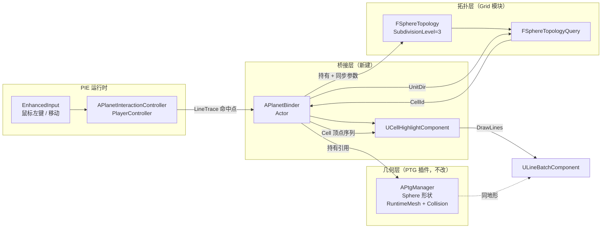
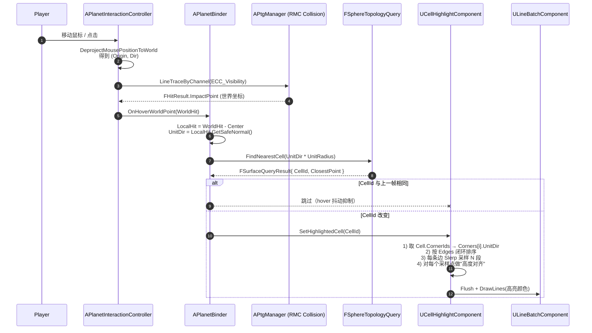

# 球面 Hex/Pent 区域点选高亮 —— 交互流实现方案

> 目标：在 PIE 中，将 [`Plugins/ProceduralTerrainGenerator`](../Plugins/ProceduralTerrainGenerator) 的 `Sphere` 形态与 [`Source/Grid`](../Source/Grid) 的 `FSphereTopology`（细分 `SubdivisionLevel = 3`）逻辑层绑定。鼠标点选地表上的任意位置，立即在 PTG 球面上高亮鼠标命中的那个**六边形 / 五边形 Cell**——即沿该 Cell 所有 `Edges` 的 `Corner` 之间画**贴合 PTG 真实地形高度**的测地线轮廓。
>
> 文档定位：第一阶段交互验证 Demo。重点是**走通"几何分离 + 拓扑共享"的最小闭环**，为后续板块、玩法系统铺路。
>
> 关联：[USAGE_zh.md](../Plugins/ProceduralTerrainGenerator/USAGE_zh.md)、[FSphereTopology.h](../Source/Grid/Public/FSphereTopology.h)、[FSphereTopologyQuery.cpp](../Source/Grid/Private/FSphereTopologyQuery.cpp)

---

## 目录

- [1. 设计原则](#1-设计原则)
- [2. 总体架构](#2-总体架构)
- [3. 数据流时序](#3-数据流时序)
- [4. 类与文件清单](#4-类与文件清单)
- [5. 关键算法](#5-关键算法)
  - [5.1 PIE 鼠标射线 → PTG 命中点](#51-pie-鼠标射线--ptg-命中点)
  - [5.2 PTG 命中点 → Iso Sphere CellId](#52-ptg-命中点--iso-sphere-cellid)
  - [5.3 Cell 边界提取（按 Corner 顺序闭环）](#53-cell-边界提取按-corner-顺序闭环)
  - [5.4 测地线插值（Slerp）](#54-测地线插值slerp)
  - [5.5 投影到 PTG 真实表面（高度对齐）](#55-投影到-ptg-真实表面高度对齐)
  - [5.6 高亮渲染（LineBatch）](#56-高亮渲染linebatch)
- [6. 模块依赖与编译配置](#6-模块依赖与编译配置)
- [7. 蓝图层接线（关卡/输入）](#7-蓝图层接线关卡输入)
- [8. 实施步骤（Checklist）](#8-实施步骤checklist)
- [9. 性能预算](#9-性能预算)
- [10. 已知边界条件 & 后续扩展](#10-已知边界条件--后续扩展)
- [11. 附：核心代码骨架](#11-附核心代码骨架)

---

## 1. 设计原则

| 原则 | 含义 |
| --- | --- |
| **几何与拓扑解耦** | PTG 只负责"看得见的地形 Mesh"，`FSphereTopology` 只负责"逻辑格子"。两者**不共享顶点缓冲**，仅共享"球心位置 + 半径"两个标量。 |
| **不修改 PTG 插件源码** | 所有逻辑用 Actor / Component 包一层，避免污染商城插件，便于未来插件升级。 |
| **复用 RMC 物理碰撞** | PTG 默认 `bEnableTerrainCollision = true`，地形 `URuntimeMeshComponent` 已经带物理碰撞。直接走 `LineTraceByChannel` 命中即可，无需自行做"球面射线 vs 程序网格"。 |
| **拓扑查询走球面 4 叉树** | `FSphereTopology::TriTreeRoots` 已经是 20 棵球面 4 叉树，[`FSphereTopologyQuery::FindNearestCell`](../Source/Grid/Private/FSphereTopologyQuery.cpp) 提供 `O(log N)` 的 "球面方向 → CellId"。 |
| **高亮做最小可视化** | 不为高亮单独建 RuntimeMesh / DecalActor，**先用 `ULineBatchComponent` 画测地线折线**（一行 `DrawLine` 调用），开发期成本最小；后续可替换为 RMC 带状几何 + 自发光材质。 |
| **运行时单帧重算 OK** | sub=3 时 Cells = `10·4³+2 = 642` 个，每个 Cell 边数 ≤ 6，每条边 Slerp 8~12 段已经非常细腻。整个高亮重算 ~100 个 LineTrace + ~100 段 Slerp，远在帧预算内，不需要预烘焙。 |

---

## 2. 总体架构



三个角色清晰分离：

- **几何层 (PTG)**：拖入关卡的 `BP_PTG_Manager`，负责"看得见、能撞到"的球形地形。
- **拓扑层 (Grid)**：`FSphereTopology` 在 `APlanetBinder::BeginPlay` 时构造一次（sub=3），仅 642 Cells，毫秒级。
- **桥接层 (新建)**：`APlanetBinder` 把两者钉在同一个球心、同一半径上；`UCellHighlightComponent` 接收 CellId，拉数据画线。

---

## 3. 数据流时序



---

## 4. 类与文件清单

新增文件全部放在主模块 `Source/TerraCivilization/Interaction/` 下（如目录不存在则新建）。

| 文件 | 角色 | 关键 API |
| --- | --- | --- |
| `Public/PlanetBinder.h` / `Private/PlanetBinder.cpp` | 桥接 PTG 与 Topology 的 Actor | `BeginPlay` 构建拓扑；`OnHoverWorldPoint(FVector)`；`UFUNCTION GetTopology()`、`GetPtgManager()` |
| `Public/CellHighlightComponent.h` / `Private/CellHighlightComponent.cpp` | 高亮渲染组件 | `SetHighlightedCell(int32)`；`ClearHighlight()`；`TickComponent` 重画 |
| `Public/PlanetInteractionController.h` / `Private/PlanetInteractionController.cpp` | 输入与射线 | EnhancedInput 绑定；`Tick` 做 hover；`OnClick` 做 select |
| `Public/PlanetInteractionTypes.h` | 共享枚举/结构（如 `EHighlightStyle`） | - |

> **不需要改 PTG 插件**。`APtgManager` 已经暴露了：
> - `GetActorLocation()` —— 球心（Manager 自己的 Transform）
> - `GetProcMeshTerrainComp()` —— 用来排除/筛选 LineTrace 命中目标
> - 对外 RMC 默认带碰撞

---

## 5. 关键算法

### 5.1 PIE 鼠标射线 → PTG 命中点

直接复用 UE 内建的 `APlayerController::GetHitResultUnderCursorByChannel`：

```cpp
// APlanetInteractionController::Tick
FHitResult Hit;
if (GetHitResultUnderCursorByChannel(
        UEngineTypes::ConvertToTraceType(ECC_Visibility),
        /*bTraceComplex=*/true,   // 必须 true，命中 RMC 复杂碰撞
        Hit))
{
    if (Hit.GetActor() == Binder->GetPtgManager())
    {
        Binder->OnHoverWorldPoint(Hit.ImpactPoint);
    }
}
```

要点：
- `bTraceComplex = true`：RMC 默认是 `CTF_UseComplexAsSimple`，PTG 转 StaticMesh 也用复杂碰撞。
- 过滤 `Hit.GetActor()` 必须是 PTG Manager，避免命中海面、植被。
- 对鼠标 hover 做"上一帧 CellId 缓存"，仅 CellId 变化才触发重画。

### 5.2 PTG 命中点 → Iso Sphere CellId

> ⚠️ PTG 的 `Sphere` 是 spherified cube，地表带噪声起伏；`FSphereTopology` 是单位球。两者**只能在"球面方向"上对齐**——也就是把命中点投影回单位球：

```cpp
const FVector Center  = PtgManager->GetActorLocation();
const FVector Local   = WorldHit - Center;
const FVector UnitDir = Local.GetSafeNormal();

// FindNearestCell 内部会再次 normalize，传 UnitDir 直接即可
const FSurfaceQueryResult R = Query->FindNearestCell(UnitDir);
if (R.CellId != INDEX_NONE) { ... }
```

`FindNearestCell` 的复杂度：`20 + 4·SubdivisionLevel + 3 = 35 次点积`（sub=3）—— **常数级**。

### 5.3 Cell 边界提取（按 Corner 顺序闭环）

[`FCell`](../Source/Grid/Public/FCell.h) 的 `CornerIds[6]` 是**没有按邻接关系排序**的（它是在 `BuildDualFromPrimal` 中按"遍历到 PrimalTri 顺序"填的）。直接连出来是星形而不是闭合多边形。需要按 Edges 重新排序，方法如下：

```text
输入: Cell C 的 CornerIds、EdgeIds
1. 把 C.EdgeIds 中每条边对应的两个 Corner 收集起来 -> 构成"角邻接表" Map<CornerId, TArray<CornerId,2>>
2. 任取一个起点 startCorner = CornerIds[0]，prev = INDEX_NONE
3. 沿邻接表走一圈：
       cur = startCorner
       while (true):
           记录 cur
           next = AdjMap[cur] 中 != prev 的那个
           if (next == startCorner) break
           prev = cur; cur = next
4. 输出顺序数组 OrderedCorners (length 5 or 6)
```

也可以利用拓扑里已经有的 [`FCorner.NeighborCornerIds`](../Source/Grid/Public/FCorner.h) 简化：起点固定后，挨个跳到"也属于本 Cell 的邻居"即可。

### 5.4 测地线插值（Slerp）

测地线 = 单位球面大圆弧。两单位向量 `A`、`B` 之间分 N 段：

```cpp
inline FVector Slerp(const FVector& A, const FVector& B, float T)
{
    const float Dot = FMath::Clamp(FVector::DotProduct(A, B), -1.f, 1.f);
    const float Theta = FMath::Acos(Dot);
    if (Theta < KINDA_SMALL_NUMBER) return A;
    const float SinTheta = FMath::Sin(Theta);
    const float W1 = FMath::Sin((1.f - T) * Theta) / SinTheta;
    const float W2 = FMath::Sin(T        * Theta) / SinTheta;
    return (A * W1 + B * W2);  // 仍在单位球面上
}
```

每条边采 8~12 段足够视觉光滑（Cell 平均张角 ~3.5°，远小于 90°）。

### 5.5 投影到 PTG 真实表面（高度对齐）

这是**整个方案的灵魂**——直接把单位球面线 × Radius 画出来，会"埋进山里 / 浮在山上"。两种方案：

**方案 A（推荐 Demo 级）：每个采样点向球心方向 LineTrace**

```cpp
const FVector OuterPoint = Center + UnitDir * (Radius * 1.5f);  // 球外足够远
const FVector InnerPoint = Center + UnitDir * (Radius * 0.5f);  // 球内足够深
FHitResult Hit;
World->LineTraceSingleByChannel(Hit, OuterPoint, InnerPoint,
        ECC_Visibility, Params);
if (Hit.bBlockingHit && Hit.GetActor() == PtgManager)
{
    OutPoints.Add(Hit.ImpactPoint + UnitDir * LiftOffset);  // 抬起 5cm 防 Z-Fighting
}
else
{
    OutPoints.Add(Center + UnitDir * Radius);  // 兜底用名义半径
}
```

- 优点：**完全不依赖 PTG 内部数据结构**，只用引擎物理。
- 成本：sub=3 时单 Cell 最多 6 边 × 10 段 ≈ 60 次 LineTrace。Hover 时只在 CellId 变化时重算，单次 < 1ms。

**方案 B（生产级，未来再做）：用 PTG 的 `FastNoiseLite` 直接采样**

`UPtgFastNoiseLiteWrapper::GetNoise3D(UnitDir × someScale)` 可以重现 PTG 的位移函数。但需要把 PTG 的 `noiseInputScale / noiseOutputScale / Radius` 完整对齐，且 PTG 的球面在内部还做了 `tileSize` 归一化（见 `BuildSphereFace`），匹配复杂；建议**Demo 阶段不做**。

**LiftOffset**：建议 = `max(2.0, Radius * 0.0005)`，以避免 Z-Fighting；后续替换为带描边的材质后可去掉。

### 5.6 高亮渲染（LineBatch）

```cpp
ULineBatchComponent* LineBatcher = GetWorld()->GetLineBatcher(UWorld::ELineBatcherType::WorldPersistent);
LineBatcher->Flush();  // 清掉上一次
for (int32 i = 0; i + 1 < OutPoints.Num(); ++i)
{
    LineBatcher->DrawLine(
        OutPoints[i], OutPoints[i + 1],
        HighlightColor,        // 例：FLinearColor(1.0f, 0.85f, 0.1f)
        SDPG_Foreground,       // 不被地形遮挡
        Thickness,             // 例：3.0f
        /*Lifetime=*/0.0f);    // 0 表示持久，由我们手动 Flush
}
```

> 想要"屏幕空间发光描边"？后期把它替换为：用 `URuntimeMeshComponent` 画一条**有宽度的带状**几何（双三角形 strip 沿测地线挤出 N cm 宽），材质 `Unlit + Emissive + Translucent + DepthTest=Off`。Demo 不必。

---

## 6. 模块依赖与编译配置

`Source/TerraCivilization/TerraCivilization.Build.cs` 需添加 **Grid** 与 **PTG**：

```csharp
PublicDependencyModuleNames.AddRange(new string[] {
    "Core", "CoreUObject", "Engine", "InputCore", "EnhancedInput",
    "Grid",                            // 新增：拓扑层
    "ProceduralTerrainGenerator"       // 新增：访问 APtgManager 类型
});
```

`Source/Grid/Grid.Build.cs` 暂无需改动；它已经导出 `GRID_API`。

---

## 7. 蓝图层接线（关卡/输入）

1. **关卡布置**：
   - 拖入 `BP_PTG_Manager`（PTG 插件自带），`Shape = Sphere`，`Radius = 600000`（6 km，方便观察），`Resolution = 80`，`bEnableTerrainCollision = true`。
   - 拖入新建的 `BP_PlanetBinder`（继承自 `APlanetBinder`），把它的 `PtgManagerRef` 指向上一步的 Manager；`SubdivisionLevel = 3`。
   - `World Settings` 把默认 `PlayerController` 改为 `BP_PlanetInteractionController`。
2. **EnhancedInput**：
   - 创建 `IA_HoverPlanet`（Vector2D，Mouse XY，Triggers = `Tick`）和 `IA_ClickPlanet`（Bool，Mouse Left Button，Triggers = `Pressed`）。
   - 在 `IMC_Planet` 中绑定。
   - `BP_PlanetInteractionController.BeginPlay` 中 `AddMappingContext(IMC_Planet, 0)`，并 `BindAction(IA_HoverPlanet, ETriggerEvent::Triggered, ...)`、`BindAction(IA_ClickPlanet, ETriggerEvent::Triggered, ...)`。
   - 当然，`hover` 完全可以走 C++ `Tick`+`GetHitResultUnderCursorByChannel`，不必绑 `IA_HoverPlanet`，看个人偏好。
3. **Cursor 显示**：在 `APlanetInteractionController` 构造里 `bShowMouseCursor = true; bEnableClickEvents = true;`。

---

## 8. 实施步骤（Checklist）

实施时逐项推进，每步可独立 PR / commit：

- [ ] **Step 1**：`TerraCivilization.Build.cs` 添加 `Grid`、`ProceduralTerrainGenerator` 依赖，编译通过。
- [ ] **Step 2**：新建 `APlanetBinder` 骨架，`BeginPlay` 中 `Topology = MakeUnique<FSphereTopology>(3)`，`Query = MakeUnique<FSphereTopologyQuery>(Topology.Get())`；用 `UE_LOG` 打印 `Cells.Num()` 验证 = 642。
- [ ] **Step 3**：在 `APlanetBinder::OnHoverWorldPoint` 中调 `Query->FindNearestCell`，把 `CellId` 用 `GEngine->AddOnScreenDebugMessage` 打到屏幕；先用 `K2_DrawDebugSphere` 在 `Cells[CellId].UnitCenter * Radius + Center` 处画个球，肉眼校准。
- [ ] **Step 4**：实现 `Cell 边界排序 + Slerp` 算法，得到 N 个单位向量序列；先**直接乘 Radius** 用 `LineBatcher->DrawLine` 画出来，验证拓扑边界正确（此时会"穿模"，正常）。
- [ ] **Step 5**：加入"向球心方向 LineTrace 取真实高度"，再次确认线条贴合 PTG 表面。
- [ ] **Step 6**：加 hover 防抖（缓存上一次 CellId，仅变化时重画）；加点击高亮持久化（与 hover 不同色）。
- [ ] **Step 7**：极地/五边形 Cell（`bIsPentagon == true`）回归测试 —— 12 个五边形 Corner 数为 5，闭环算法必须兼容。
- [ ] **Step 8（可选）**：把 LineBatch 换成 RMC 带状几何 + 自发光材质，作为正式渲染方案。

---

## 9. 性能预算

| 阶段 | 单次成本（sub=3, Resolution=80） | 频率 |
| --- | --- | --- |
| `FSphereTopology::Build()` | ~5 ms（一次性） | BeginPlay 仅 1 次 |
| 鼠标 LineTrace（Cursor → PTG） | ~20 µs | 每帧 |
| `FindNearestCell` | ~2 µs（35 次点积） | 每帧 |
| 边界排序 + Slerp（10 段 × 6 边 = 60 点） | ~10 µs | 仅 CellId 变化时 |
| 60 次 LineTrace（高度对齐） | ~200 µs | 仅 CellId 变化时 |
| `LineBatcher->DrawLines` | < 100 µs | 仅 CellId 变化时 |
| **总计每帧最坏** | **< 0.5 ms** | 远低于 16.6 ms |

→ **完全可以承担**；甚至 sub=4 (2562 Cells) 也轻松。

---

## 10. 已知边界条件 & 后续扩展

### 边界条件 / 注意事项

1. **PTG 的 Sphere 是 spherified cube**：它的 8 个立方体角畸变最大，配合 `FSphereTopology` 的 12 个五边形 → 有的五边形可能恰好骑在 cube 角上，外观会比平均 cell 略显歪斜，**但拓扑无误**。
2. **球心非原点**：始终先 `Local = WorldHit - PtgManager->GetActorLocation()` 再 normalize。
3. **PTG `Resolution / LODIndex` 的 LOD**：远处 LOD 几何与 LOD 0 不一致。LineTrace 默认走 LOD 0 物理碰撞，**不影响**。
4. **`bTraceComplex = true` 是必须的**：`RuntimeMeshComponent` 默认开 `bUseComplexAsSimpleCollision`，简单 trace 会落到 BoundingBox。
5. **海面**：PTG 的水面 RMC 默认 `bEnableWaterCollision = false`，鼠标射线会自动穿过水面命中海床——这是**期望**行为；如果要"点海面也算选海域 Cell"，把 `bEnableWaterCollision` 改为 `true`，或者 hover 时多做一次水面 trace 取较远的命中点。
6. **退化情况**：射线打不中（划过球外）→ `FindNearestCell` 不调用、`HighlightComponent->ClearHighlight()`。
7. **`FCell.CornerIds` 顺序问题**：源代码中通过 `AddElement` 顺序填入 `TStaticArray<int32, 6>`，**不保证按 ring 顺序**。务必走 [5.3](#53-cell-边界提取按-corner-顺序闭环) 重排。

### 自然扩展点

| 扩展 | 改动 |
| --- | --- |
| 多选（按住 Shift 加选） | `UCellHighlightComponent` 内部 `TSet<int32> Selected`；分别用主色/次色 |
| 高亮邻居（"展示移动力 = 2 的可达范围"） | 直接调 `Query->CollectCellDisk(CenterCellId, 2, OutCellIds)`，对每个 Cell 也做边界画线 |
| 五边形特殊地标 | `FCell::bIsPentagon` 已经有；hover 命中时直接显示不同 UI |
| 板块边界可视化 | `FCellEdge::bIsPlateBoundary` 已预留；后续板块模块写入；高亮组件做 `if (Edge.bIsPlateBoundary) DrawLine(...)` |
| 后端走 RMC 描边材质 | 见 [5.6](#56-高亮渲染linebatch) 末尾说明 |
| 把 hover 替换成手柄/触屏 | 输入层换 EnhancedInput 即可，桥接层完全不动 |

---

## 11. 附：核心代码骨架

> 仅作为实现骨架，类型/include 省略；正式落地请按 UE 命名规范补全。

### 11.1 `APlanetBinder`

```cpp
// Public/PlanetBinder.h
UCLASS()
class TERRACIVILIZATION_API APlanetBinder : public AActor
{
    GENERATED_BODY()
public:
    APlanetBinder();

    UPROPERTY(EditAnywhere, Category="Planet")
    TObjectPtr<APtgManager> PtgManagerRef;

    UPROPERTY(EditAnywhere, Category="Planet", meta=(ClampMin=1, ClampMax=6))
    int32 SubdivisionLevel = 3;

    UPROPERTY(VisibleAnywhere, Category="Planet")
    TObjectPtr<UCellHighlightComponent> HighlightComp;

    virtual void BeginPlay() override;

    // 由 Controller 调用
    void OnHoverWorldPoint(const FVector& WorldHit);
    void OnClickWorldPoint(const FVector& WorldHit);
    void OnLeavePlanet();   // 没命中时调用

    APtgManager*               GetPtgManager() const { return PtgManagerRef; }
    const FSphereTopology*     GetTopology()   const { return Topology.Get(); }
    const FSphereTopologyQuery* GetQuery()     const { return Query.Get(); }
    float                       GetRadius()    const;

private:
    TUniquePtr<FSphereTopology>      Topology;
    TUniquePtr<FSphereTopologyQuery> Query;
    int32 LastHoveredCellId = INDEX_NONE;
};
```

```cpp
// Private/PlanetBinder.cpp
void APlanetBinder::BeginPlay()
{
    Super::BeginPlay();
    Topology = MakeUnique<FSphereTopology>(SubdivisionLevel);
    Query    = MakeUnique<FSphereTopologyQuery>(Topology.Get());
    UE_LOG(LogTemp, Log, TEXT("Planet topology built: %d cells"), Topology->Cells.Num());
}

void APlanetBinder::OnHoverWorldPoint(const FVector& WorldHit)
{
    if (!PtgManagerRef || !Query) return;

    const FVector Local   = WorldHit - PtgManagerRef->GetActorLocation();
    const FVector UnitDir = Local.GetSafeNormal();
    if (UnitDir.IsNearlyZero()) return;

    const FSurfaceQueryResult R = Query->FindNearestCell(UnitDir);
    if (R.CellId == INDEX_NONE)             { OnLeavePlanet(); return; }
    if (R.CellId == LastHoveredCellId)      { return; }

    LastHoveredCellId = R.CellId;
    HighlightComp->SetHighlightedCell(R.CellId);
}
```

### 11.2 `UCellHighlightComponent`

```cpp
// Public/CellHighlightComponent.h
UCLASS(ClassGroup=(Planet), meta=(BlueprintSpawnableComponent))
class TERRACIVILIZATION_API UCellHighlightComponent : public USceneComponent
{
    GENERATED_BODY()
public:
    UPROPERTY(EditAnywhere, Category="Highlight")
    FLinearColor HighlightColor = FLinearColor(1.0f, 0.85f, 0.1f, 1.0f);

    UPROPERTY(EditAnywhere, Category="Highlight", meta=(ClampMin=1, ClampMax=64))
    int32 SegmentsPerEdge = 10;

    UPROPERTY(EditAnywhere, Category="Highlight")
    float Thickness   = 3.0f;
    UPROPERTY(EditAnywhere, Category="Highlight")
    float LiftOffset  = 5.0f;

    void SetHighlightedCell(int32 CellId);
    void ClearHighlight();

private:
    void RebuildLines(int32 CellId);
    bool ProjectToTerrain(const FVector& UnitDir, FVector& OutWorld) const;
    void OrderCellCorners(int32 CellId, TArray<int32>& OutCornerIds) const;

    int32 CurrentCellId = INDEX_NONE;
    APlanetBinder* GetBinder() const;
};
```

`OrderCellCorners` 的核心实现：

```cpp
void UCellHighlightComponent::OrderCellCorners(int32 CellId, TArray<int32>& Out) const
{
    const FSphereTopology* T = GetBinder()->GetTopology();
    const FCell& C = T->Cells[CellId];

    // 1) 列出本 Cell 的 corners
    TArray<int32> Mine;
    for (int32 I = 0; I < 6; ++I)
        if (C.CornerIds[I] != INDEX_NONE) Mine.Add(C.CornerIds[I]);

    // 2) 邻接：若 corner X 与 corner Y 都在 Mine 里，且它们是 NeighborCornerIds，就连边
    TMap<int32, TArray<int32>> Adj;
    for (int32 X : Mine)
    {
        const FCorner& Cn = T->Corners[X];
        for (int32 N : Cn.NeighborCornerIds)
        {
            if (N != INDEX_NONE && Mine.Contains(N))
                Adj.FindOrAdd(X).Add(N);
        }
    }

    // 3) 从 Mine[0] 起步，沿邻接表绕一圈
    Out.Reset();
    int32 Cur = Mine[0], Prev = INDEX_NONE;
    for (int32 Step = 0; Step < Mine.Num(); ++Step)
    {
        Out.Add(Cur);
        const TArray<int32>& Nb = Adj[Cur];
        const int32 Next = (Nb[0] != Prev) ? Nb[0] : Nb[1];
        Prev = Cur; Cur = Next;
    }
}
```

`RebuildLines` 主体：

```cpp
void UCellHighlightComponent::RebuildLines(int32 CellId)
{
    if (CellId == INDEX_NONE) return;

    APlanetBinder* B = GetBinder();
    const FSphereTopology* T = B->GetTopology();

    TArray<int32> Ordered;
    OrderCellCorners(CellId, Ordered);
    if (Ordered.Num() < 3) return;

    TArray<FVector> Pts;
    Pts.Reserve(Ordered.Num() * SegmentsPerEdge);
    const int32 N = Ordered.Num();
    for (int32 i = 0; i < N; ++i)
    {
        const FVector A = T->Corners[Ordered[i]].UnitDir;
        const FVector Bv= T->Corners[Ordered[(i + 1) % N]].UnitDir;
        for (int32 s = 0; s < SegmentsPerEdge; ++s)
        {
            const float t = float(s) / SegmentsPerEdge;
            const FVector Unit = SlerpUnit(A, Bv, t);
            FVector World;
            if (ProjectToTerrain(Unit, World)) Pts.Add(World);
        }
    }

    // Flush 上一次
    ULineBatchComponent* LB = GetWorld()->GetLineBatcher(UWorld::ELineBatcherType::WorldPersistent);
    LB->Flush();
    for (int32 i = 0; i < Pts.Num(); ++i)
        LB->DrawLine(Pts[i], Pts[(i + 1) % Pts.Num()],
                     HighlightColor, SDPG_Foreground, Thickness, 0.f);
}
```

### 11.3 `APlanetInteractionController`

```cpp
// Private/PlanetInteractionController.cpp
void APlanetInteractionController::BeginPlay()
{
    Super::BeginPlay();
    bShowMouseCursor   = true;
    bEnableClickEvents = true;
    bEnableMouseOverEvents = true;
    Binder = Cast<APlanetBinder>(UGameplayStatics::GetActorOfClass(this, APlanetBinder::StaticClass()));
}

void APlanetInteractionController::PlayerTick(float DeltaTime)
{
    Super::PlayerTick(DeltaTime);
    if (!Binder) return;

    FHitResult Hit;
    const bool bHit = GetHitResultUnderCursorByChannel(
        UEngineTypes::ConvertToTraceType(ECC_Visibility),
        /*bTraceComplex=*/true, Hit);

    if (bHit && Hit.GetActor() == Binder->GetPtgManager())
        Binder->OnHoverWorldPoint(Hit.ImpactPoint);
    else
        Binder->OnLeavePlanet();
}
```

---

## 结语

整套方案的精髓只有一句话：

> **"球心 + 半径"是 PTG 与 `FSphereTopology` 唯一的契约；其余信息都通过 `WorldHit → UnitDir → CellId → UnitCorners → SlerpedUnitPath → LineTraced WorldPath` 这条无状态管道流过。**

按本方案实施，预计编码工作量 **≤ 1 天**；后续要替换为正式描边材质、对接板块/玩法、扩展为多选/范围选，都只需在桥接层增量演进，不会触动 PTG 插件，也不会冲击 Grid 拓扑层。

