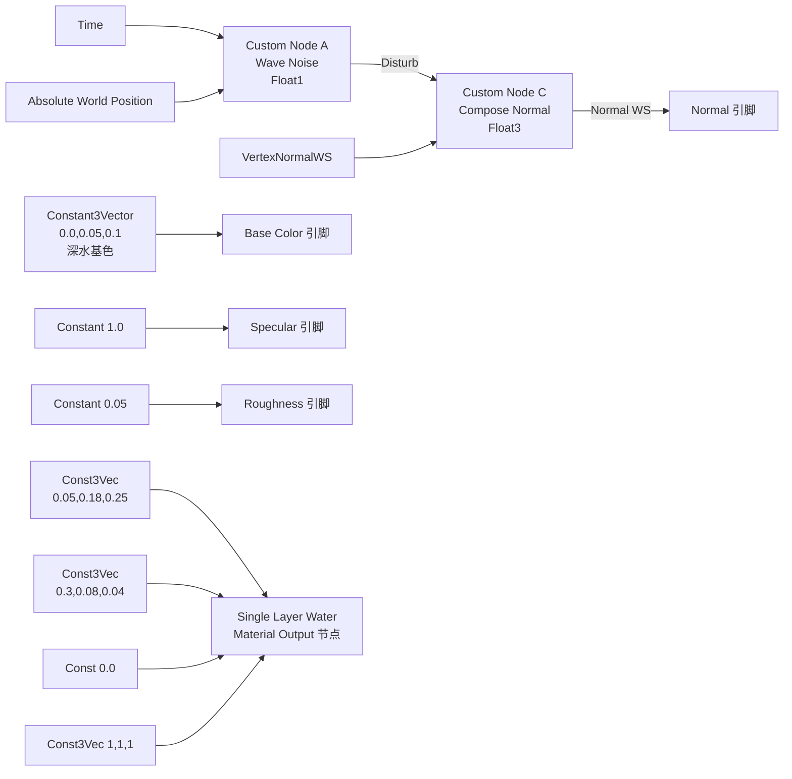

# R8：参数化 Tint 路径（3 套 PBR 基础 + 4 通道 LUT 微调 + 水面层）

> 本文档是 [SphericalSDFTerrainDesign.md §16](SphericalSDFTerrainDesign.md#16-自研球面网格生产路线) 占位段下"R8 参数化 Tint + SLW 水面层"路线的独立落地文档，与 [R7_TerrainTriplanar.md](R7_TerrainTriplanar.md) 风格一致。
>
> 阅读本文档前必须先理解 [R7_TerrainTriplanar.md](R7_TerrainTriplanar.md) §1~§4 的"三层 Triplanar 加权混合"管线——R8 不修改 R4/R5/R6 的 dir / dirP / w[3] 几何链路，仅在 R7"三层 Triplanar 真实采样"之后插入"per-cell 多通道参数微调"，把 19 张独立纹理路径替换为 3 张共享基础套件 + 4 张 LUT 派生。
>
> ⚠ **路线说明（2026-06-29）**：本期是 [SDF 主稿 §11 Roadmap](SphericalSDFTerrainDesign.md#11-实施-roadmapm-step) 调整后的新 R8——**不消费 W4 输出**。`CellAttrLUT.R` 写入的 BaseTexIdx 与材质 LUT 中的 17 种地形配方索引继续沿用 R3 的 Knuth 哈希 placeholder。W4 真实查表（`Def->LayerIndex` + `Def->FTerrainMaterialParams`）推迟到 T 阶段自研球面网格（TessellatedMesh，详见 [TessellatedMeshDesign.md](TessellatedMeshDesign.md)）联调阶段才接入。

> ### ⭐ 版本状态（2026-07-01 更新）
>
> **本稿是 R8.0 参数化 Tint + R8.1 三通道 PBR 的历史 baseline 参考**。R8.2 SHFRM + R8.3 Base Albedo 灰度化的**现行主 HLSL / Custom Inputs 表 / Additional Outputs / 决策 / 验收 / 排错**全部整合到 [**R8.2_SphericalHeightFieldRaymarching.md**](R8.2_SphericalHeightFieldRaymarching.md)。
>
> **⚠ 新读者导航**：如果你是**首次实施 R8 材质**，请**直接跳转 R8.2 稿的 §5.2 (24 项 Custom Inputs) + §5.3 (3 项 Additional Outputs) + §5.6 (完整 HLSL) + §5.7 (R8.3 灰度化决策与验收)**。本 R8 主稿的 §4.4.1 (19 项 Inputs) 与 §4.4.2 / §4.4.2.1 / §4.4.2.1.R8.1 HLSL 已过时，仅保留作为版本演进的历史存档。
>
> **子里程碑索引**：
>
> | 里程碑 | 内容 | 现行落点 | 本稿状态 |
> | --- | --- | --- | --- |
> | R8.0 | 参数化 Tint（3 base + 4 LUT + 17 配方）| **R8.2 §5.6 (集成)** | 本稿 §1~§6 保留 baseline |
> | R8.1 | BaseColor + Normal + Roughness 三通道 | **R8.2 §5.6 (集成)** | 本稿 §4.4.2.1.R8.1 保留 baseline |
> | R8.2 | 球面高度场光线步进 SHFRM + PixelDepthOffset | **[R8.2 §1~§6](R8.2_SphericalHeightFieldRaymarching.md)** | 本稿仅在 §0.1 视觉对比矩阵有一行；正文未合入（避免主稿膨胀）|
> | R8.3 | Base Albedo 灰度化（HSV 前 `dot(rgb, LUMA_REC601)`）| **[R8.2 §5.7](R8.2_SphericalHeightFieldRaymarching.md)（已迁移）** | 本稿 §1.6.3 / §5.R8.3 / §6.R8.3 / §7.1.R8.3 保留但**内容已过期**——不再更新，请以 R8.2 稿为准 |
>
> **反射诊断期望表**：R8.1 → 19 项、R8.2 → 24 项、R11 (HexHighlight) → 25 项。cpp 端 `DiagnoseR8Material_::ExpectedR8Inputs` 应对齐到 **25 项**（详见 R8.2 §5.2 + [HexHighlightInteractionPlan.md §9](HexHighlightInteractionPlan.md)）。

---

## 0. R8 一句话目标

把 R7 输出公式中的"19 张独立 BaseColor slice"换成"**3 张共享 PBR 套件（Soil/Rock/Forest Canopy）经 per-cell 多通道参数微调后的派生颜色**"——

$$
\boxed{\;
\mathrm{color}_i \;=\; \mathrm{Tint}_i \;\circ\; \mathrm{HSV}_i \;\circ\; \mathrm{Lerp}\bigl(\mathrm{Triplanar}(\mathrm{Base}_{B_i}),\;\mathrm{Triplanar}(\mathrm{Forest}),\;\mathrm{OverlayBlend}_i\bigr)
\;}
$$

R4/R5/R6 几何链路（Voronoi 边、软边过渡、噪声扰动）原封保留；R7 的三平面加权混合形态保留。R8 仅是"颜色源"从"slice 索引"升级为"3 base + 4 通道 per-cell LUT 微调"，并新增独立水面层 mesh。

### 0.1 视觉对比矩阵

| 阶段 | 颜色来源 | PBR 通道 | per-cell 自由度 | 显存占用（NumLayers=17, sub=3）|
| --- | --- | --- | --- | --- |
| R7 | 19 张独立 `Texture2DArray` slice | BaseColor 单通道（Normal/Rough 默认空）| 仅 LayerIndex 1 个 uint8 | TerrainAlbedoArray ≈ 19 × 1024² × BC1 ≈ **10 MB**；NormalArray 同 ≈ 10 MB；其它 PBR 通道默认空 |
| **R8.0** | 3 张基础 PBR 套件（Soil/Rock/Forest）× per-cell 17 种 tint 配方派生 | **BaseColor 单通道**（Normal/Rough 字段已挂 UPROPERTY 但 HLSL 未消费）| 16 字节 / cell（4 LUT × RGBA8/16F）| 3 × 4 通道 × 1024² ≈ **24 MB**（BC1+BC5）；4 LUT ≈ 642 × 16 = **10 KB** |
| **R8.1 ⭐** | 同 R8.0 | **BaseColor + Normal + Roughness 三通道接通**（Specular 留 R8.2/W4） | 同 R8.0（LUT 字段无变化）| 显存与 R8.0 完全一致——`PBRBaseNormal` / `PBRBaseRoughness` 在 R8.0 已计入 24 MB 估算 |
| **R8.2 ⭐** | 同 R8.1 | 同 R8.1 + **`PBRBaseHeight` 激活做 SHFRM 球面高度场光线步进**（写入 `PixelDepthOffset` 真深度 → silhouette 凸出 + 自阴影 + Lumen/SSAO/SSR 协同）| 同 R8.1 + 17 配方表新增 `HeightScaleCM` 列（per-cell 0~50 cm，详见 [R8.2 §4.2](R8.2_SphericalHeightFieldRaymarching.md)）| 显存与 R8.1 一致——`PBRBaseHeight` 在 R8.0 已挂 UPROPERTY 与资产，R8.2 仅激活 HLSL 端消费 |
| **R8.3 ⭐** | 同 R8.2 + **Base Albedo 灰度化**（HLSL 端 `dot(rgb, LUMA_REC601)` 强制去色，让 17 配方的 Tint 真正能控制 Hue）| 同 R8.2 | 同 R8.2（LUT 与 17 配方字段无变化；仅美术需重调 17 配方 Tint/Sat 数值）| **第一阶段不变**（HLSL 运行时去色，资产保留彩色）；**第二阶段后** `T_PBRBase_Albedo` 重导为灰度图、压缩 BC7→BC4，**显存减半**（6.59 MB → ~3.3 MB）|

显存增加 ~14 MB，但视觉**多样性从 19 种固定纹理 → 17 种纹理配方 + 全部 base 纹理共享**（任何配方都可在编辑器实时调 Tint/HSV 看效果）。

> **R8.1 = R8.0 baseline 之上的多通道材质增量**（2026-06-30 拍板）。R8.0 验收已通过 cpp 与 17 配方表，但材质仅输出 BaseColor，`PBRBaseNormal/Roughness` 与 LUT2.B/A、LUT3.R 全部为预留字段。R8.1 把这些预留字段在 HLSL 端落地：
>
> | 维度 | R8.0 | R8.1 |
> | --- | --- | --- |
> | LUT 字段 | 5 张（Attr/Dir/Tint/HSVRough/NSpec）| **不变** |
> | 17 配方表 | 17 行 × 10 字段 | **不变** |
> | cpp UPROPERTY | `PBRBaseNormal/Roughness/Height` 已挂 | **不变**（R8.0 已就位）|
> | cpp MID 注入 | 注入 `PBRBaseNormal/Roughness` | **不变**（确认即可，参 §3.2 末尾）|
> | HLSL 宏 | `SAMPLE_PARAM_COLOR` → 单 float3 | **重命名为 `SAMPLE_PARAM_PBR`，三输出 (alb, nrmTS, rough)** |
> | Custom 节点 Output | 主出口 BaseColor（CMOT_Float3）| **主出口 BaseColor + Additional Outputs 加 NormalTS（float3）+ Roughness（float）** |
> | 接 Material pin | 仅 BaseColor | **BaseColor + Normal + Roughness 三 pin** |
>
> R8.1 改动量约 +250 行 markdown，0 行新增 cpp，0 行 LUT 改动——与 R8.0 视觉对比：球面同时获得 ① 岩石 / 草地 / 苔藓的**法线凹凸感**（视角微动时表面有视差），② 雪 / 冰的**镜面高光锐如点光**与岩石 / 沙地的**漫粗糙散光**对比，③ Forest 配方的森林 Overlay 不再只是"加点绿"而是"加点绿 + 苔藓凹凸 + 半粗糙"。Specular 通道留待 R8.2 / W4 联调时再接（LUT3.B `SpecularBoost` 字段已就位）。

> **R8.2 = R8.1 之上的微观地表位移增量**（2026-06-30 拍板）——独立成稿于 **[R8.2_SphericalHeightFieldRaymarching.md](R8.2_SphericalHeightFieldRaymarching.md)**。R8 本主稿已超 130 KB，再追加约 +500 行 SHFRM 内容会过度膨胀；R8.0 baseline + R8.1 多通道留在本稿，R8.2 SHFRM（球面高度场光线步进）独立成稿。
>
> **R8.2 一句话总结**：把 R8.0 起就挂着但从未被 HLSL 消费的 `PBRBaseHeight` 资产**激活**——通过球面径向 raymarch 在材质域产生**真实厘米级地表位移**（per-cell HeightScaleCM 0~50 cm），并通过 `PixelDepthOffset` 写入真深度让 Lumen / SSAO / SSR 全部协同工作。视觉收益：山脉剪影从球轮廓凸出 / 山脉自阴影 / 视线穿过山谷的真实视差感——这些是 POM 完全做不到的能力。
>
> **与 R8.1 的关系**：R8.2 是**纯叠加增量**——R8.1 的 Triplanar 三件套（Albedo/Normal/Roughness）+ 17 配方表 + 5 张 LUT + cpp UPROPERTY 字段全部 0 改动；只是把"baseline 球面 WorldPos"换成"raymarch 命中点 P_hit"作为 SAMPLE_PARAM_PBR 宏的输入。**与 POM 的本质差异**：SHFRM 写入真深度，POM 不写——前者能改变球轮廓 silhouette、后者只能错位切线 UV。详见 [R8.2 §0.1](R8.2_SphericalHeightFieldRaymarching.md)。
>
> **GPU 预算**：R8.1 (3 ms) → R8.2 (~4~5 ms)，比 POM 方案 B' 反而便宜（POM 每个 cell 都重算 PBR 三件套 = 99~153 次采样；SHFRM 命中后只算一次 = 81 次采样）。详见 [R8.2 §2.4](R8.2_SphericalHeightFieldRaymarching.md)。

> **R8.3 = R8.2 之上的 Base Albedo 灰度化修正**（2026-06-30 拍板）——独立成节于本主稿 §1.6.3 / §2.3.R8.3 / §4.4.2.1.R8.3 / §5.R8.3 / §7.1.R8.3。验收 R8.0~R8.2 时发现一个**颜色科学层面的问题**：现有 17 配方表里 Tint × HSV 链路虽然能调饱和度（Sat）和亮度（Bri），**但完全无法改变色相（Hue）**——LUT1.A 的 HueShift 字段在 R8.0~R8.2 全程没接（HLSL 端 `R8 暂不接，预留 lut1.a`）。这意味着 `Ocean.Shallow` / `Ocean.Deep` 两个配方虽然 Tint 填了蓝色 (0.20,0.50,0.70) / (0.05,0.15,0.40)，最终渲染出来仍然偏绿——因为底图 `T_PBRBase_Albedo` slice 0 (Soil/Gravel042) 自带绿黄色相，**通道乘法保不住"基底没有的色相"**——B 通道乘 0.7 还是 ≈ 0，G 通道乘 0.5 反而保留了绿色相。
>
> **R8.3 一句话总结**：在 HLSL `_aMix` 计算之后、HSV 调整之前，**强制对 base + forest 混合后的颜色做 Rec.601 灰度化**（`dot(rgb, float3(0.299, 0.587, 0.114)).xxx`），让 17 配方表的 Tint 能真正控制色相（在中性灰底上 Tint 即等于最终 Hue）。
>
> **D8.3.x 决策**：
>
> | # | 决策点 | 拍板 | 备选（未采用）|
> | --- | --- | --- | --- |
> | **D8.3.1** | 灰度公式 | **Rec.601 / ITU-R BT.601** `dot(rgb, (0.299, 0.587, 0.114))`——经典感知亮度公式 | Rec.709 (0.2126,0.7152,0.0722) HDR 用；MAX(R,G,B) 损失太多细节 |
> | **D8.3.2** | 去色作用对象 | **同时对 `_aBase` 和 `_aFor` 去色**（即对 `_aMix = lerp(_aBase, _aFor, blend)` 之后的结果去色）| 仅对 `_aBase` 去色——但 Forest overlay 仍带绿色，混合后 `Plain.Grass`/`Forest.*` 等配方还是绿，等于没改 |
> | **D8.3.3** | 去色范围 | **仅 Albedo 通道**——Normal/Roughness/Height 不动 | 全通道去色——Normal 的 RGB 是切线空间向量、不能去色；Roughness 已是单通道灰度；Height 同 |
> | **D8.3.4** | Tint/Sat 配方表是否同步重调 | **第一阶段不动**（美术先在编辑器里手调 Tint 看效果，等手感稳定再写一版数据回稿）；**第二阶段** Forest.* 系列 Sat 普调 +0.3~0.6 补偿（详见 §1.6.3 注意事项）| 现在直接重写 17 配方——但去色后视觉效果还需迭代，提前写表是浪费 |
> | **D8.3.5** | 落地阶段 | **两阶段**——阶段 1 HLSL 运行时去色（保留资产可逆性，便于 A/B 对比），阶段 2 资产重导为灰度 PNG + BC4 压缩（永久减半显存） | 一次性走资产改动——失去可逆性、阻塞验收节奏 |
> | **D8.3.6** | 切换开关 | **HLSL 中硬开**（无 Static Switch 或 Scalar Parameter）——R8.3 验收完毕后这就是产品形态，不需要回退；如果需要回退，注释掉两行 patch 即可 | 加 `bUseGrayscaleAlbedo` Static Switch——增加状态空间、调试复杂；R8.3 验收期 git diff 已经能做对照 |
>
> **两阶段验收时机**：
>
> | 阶段 | 改动范围 | 验收锚点 | 何时进行 |
> | --- | --- | --- | --- |
> | **R8.3 阶段 1** | HLSL 端 +2 行 `dot(_aMix, LUMA_REC601).xxx` 去色 patch | §5.R8.3 D3.1~D3.3：Ocean 真蓝 / 雪山真白 / Forest 系列仍绿（靠 Tint） | **现在立即落地** |
> | **R8.3 阶段 2** | 资产端 `T_PBRBase_Albedo` 重导：Soil/Rock/Forest 三张 PNG 转灰度 → BC4 压缩 → 重 Build Texture2DArray | §5.R8.3 D3.4~D3.5：与阶段 1 视觉一致 / 显存减半 | **阶段 1 验收稳定后** |
>
> **阶段 1 改动量**：HLSL +2 行（Custom 节点 SAMPLE_PARAM_PBR 宏内）；cpp 0 行；LUT 0 改动；17 配方表 0 改动（美术后续手调 Tint 不在 cpp）；GPU 耗时影响 < 0.1 ms（每像素 +1 次 dot + 6 次 .xxx 通道复制，可忽略）。
>
> **阶段 2 改动量**：12 张 PNG 批处理转灰度（PS 一键）+ 4 张 Texture2DArray 资产重 Build；HLSL 删除阶段 1 的 patch（去色已在资产层完成）；显存 6.59 MB → ~3.3 MB（**减半 50%**）。

### 0.2 关键决策回顾（与 SDF 主稿 §16.1 一致）

| 决策点 | R8 选择 | 备选（未采用）|
| --- | --- | --- |
| 基础 PBR 套件数 | 3（Soil + Rock + Forest）| 4（含 Snow/Ice）—— Snow/Ice 通过 Soil + Bri↑↑ + Rough↓ 模拟即可，省 1 套显存 |
| LUT 数量 | 4 张（Index/Tint/HSV_Rough/NSpec）| 1 张（紧凑 R8G8B8A8）—— 信息密度不够，无法同时携带 Tint(RGB)+HSV+Rough+...|
| 17 种地形配方 | 在 cpp 端硬编码于材质 LUT（R8 阶段）| 由 W4 `FTerrainMaterialParams` DataAsset 配置 —— W4 联调时再切，R8 阶段先用 placeholder |
| Forest Canopy 角色 | 作为 Overlay 层，与 Base 双层 lerp | 作为独立 Base —— 但 17 种配方里只有 Forest.* 真正用到森林纹理，独立 Base 浪费一个采样槽 |
| 水面层方案 | 独立 sub=3 球皮 Actor + 半透明水材质 | 写到主材质里（按 BaseTexIdx 切水/陆）—— 主材质会变得过于复杂，且无法做半透明深度淡入 |
| 水面层 mesh 半径 | `GlobeRadius + WaterSurfaceOffset`（R8 阶段 Offset 默认 = 100 cm）| `GlobeRadius` 恒定 —— R8 阶段地形球半径恒定。Offset = 100 cm 是为了改善§3.15 记录的"光程三角锁齿"补偿与 Scattering/Absorption 缩小 100× 匹配；T 阶段起随 Elevation 起伏后只盖海洋区 |
| **D8.1.1**（R8.1）输出通道 | **BaseColor + Normal + Roughness 三通道**；Specular 留 R8.2/W4 | 同时接 Specular（LUT3.B `SpecularBoost`）—— 沙地反光不够亮的诉求需视野更宽再看，R8.1 先稳两通道 |
| **D8.1.2**（R8.1）法线混合策略 | **vector blend + 末尾 normalize**（三层切线空间法线按 wᵢ 加权后再 normalize）| RNM / UDN reorthogonalize —— 球面 Voronoi 软边过渡幅度小，工业近似足够；省 ~15 行 HLSL |
| **D8.1.3**（R8.1）Roughness 混合顺序 | **每层先 remap 再加权**（先按 LUT2.B/A `[RoughMin, RoughMax]` 把灰度采样 lerp 到目标区间，再三层加权）| 先加权再 remap —— 雪 0.1 vs 岩 0.85 各自先压到正确区间、再混合的中间过渡才合理；先加权会让交界粗糙度被冲淡到中等值 |
| **D8.1.4**（R8.1）Normal 三平面混合公式 | **`unpack → vector blend per axis → reorth-by-normalize`**（每个 X/Y/Z 平面采样后先 unpack 到 [-1,1]，按 absN 三平面权重加权，再用 LUT3.R `NormalStrength` 缩放 xy 分量保持 z 长度）| Whiteout / RNM —— 同 D8.1.2 理由 |

---

## 1. 几何与数学

### 1.1 R7 输出公式回顾

R7 最终输出（[R7_TerrainTriplanar.md §1.2](R7_TerrainTriplanar.md)）：

$$
\mathrm{color}(\mathrm{frag}) \;=\; \frac{\sum_{i=0}^{2} w_i \cdot \mathrm{Triplanar}(\mathbf{A}, L_i, \mathbf{x}, \hat{\mathbf{n}})}{\sum_{i=0}^{2} w_i + \varepsilon}
$$

其中：
- $w_i$：R6 软蜿蜒边权重（基于 dirP）
- $L_i$：第 $i$ 个 cell 的 LayerIndex（R3 Knuth placeholder，R8 仍沿用）
- $\mathbf{A}$：`TerrainAlbedoArray`，19-slice，slice = $L_i$
- $\mathbf{x}$：WorldPos（cm）
- $\hat{\mathbf{n}}$：未扰动 dir（用于 Triplanar 三平面混合权重）

### 1.2 R8 核心：单 slice 采样 → 3 base + 多参数微调

R8 把 $\mathrm{Triplanar}(\mathbf{A}, L_i, ...)$ 整段替换为：

$$
\mathrm{ParamColor}_i(\mathrm{frag}) \;=\; \mathrm{Tint}_i \;\odot\; \mathrm{HSVAdjust}_i\bigl(\;\mathrm{Lerp}\bigl(\;C_i^{\text{base}},\;C_i^{\text{forest}},\;b_i\bigr)\;\bigr)
$$

其中：
- $C_i^{\text{base}} = \mathrm{Triplanar}(\mathbf{A}_{\text{base}}, B_i, \mathbf{x} \cdot s_i, \hat{\mathbf{n}})$：基础层颜色
- $C_i^{\text{forest}} = \mathrm{Triplanar}(\mathbf{A}_{\text{base}}, 2, \mathbf{x} \cdot s_i, \hat{\mathbf{n}})$：森林 Overlay 颜色（slice=2 即 Moss002，固定）
- $\mathbf{A}_{\text{base}}$：3-slice 共享 `Texture2DArray`（slice 0=Soil/Gravel042, 1=Rock/Rock022, 2=Forest/Moss002）
- $B_i \in \{0, 1, 2\}$：第 $i$ 个 cell 的 BaseTexIdx（来自 LUT0.r）
- $b_i \in [0, 1]$：第 $i$ 个 cell 的 OverlayBlend（来自 LUT0.b / 255）—— $b_i = 0$ 时纯基础，$b_i > 0$ 时叠加森林
- $s_i$：第 $i$ 个 cell 的 TriplanarScale 修正（来自 LUT3.a，相对 TileScale 全局值的乘数）
- $\mathrm{Tint}_i = (T_R, T_G, T_B)$：来自 LUT1.rgb，作 HSV 后乘
- $\mathrm{HSVAdjust}_i$：基于 LUT2 的 HSV 偏移与重映射

最终颜色仍按 R6 的 $w_i$ 加权混合：

$$
\mathrm{color}(\mathrm{frag}) \;=\; \frac{\sum_{i=0}^{2} w_i \cdot \mathrm{ParamColor}_i}{\sum_{i=0}^{2} w_i + \varepsilon}
$$

#### 1.2.R8.1 三通道 PBR 升级

R8.1 把上面的 `ParamColor_i` 单通道扩展为 PBR 三元组 `(Albedo_i, NormalTS_i, Roughness_i)`：

$$
\bigl(\mathrm{Albedo}_i,\;\mathrm{NormalTS}_i,\;\mathrm{Roughness}_i\bigr) \;=\; \mathrm{ParamPBR}_i(\mathrm{frag})
$$

各通道公式：

- **Albedo（沿用 R8.0）**：
$$
\mathrm{Albedo}_i \;=\; \mathrm{Tint}_i \;\odot\; \mathrm{HSVAdjust}_i\bigl(\mathrm{Lerp}(C_i^{\text{base}}, C_i^{\text{forest}}, b_i)\bigr)
$$

- **Normal（R8.1 新增）**：
$$
\mathrm{NormalTS}_i^{\text{raw}} \;=\; \mathrm{Lerp}\bigl(\;\mathrm{TriplanarN}(\mathbf{N}_{\text{base}}, B_i, \mathbf{x} \cdot s_i, \hat{\mathbf{n}}),\;\mathrm{TriplanarN}(\mathbf{N}_{\text{base}}, 2, \mathbf{x} \cdot s_i, \hat{\mathbf{n}}),\;b_i\bigr)
$$
$$
\mathrm{NormalTS}_i \;=\; \mathrm{normalize}\bigl(\;\mathrm{xy} \cdot \mathrm{NormalStrength}_i,\;\mathrm{z}\;\bigr)\quad\text{（保 z 长度，缩 xy 比例）}
$$
  - $\mathbf{N}_{\text{base}}$：3-slice 共享 `PBRBaseNormal`（Normal Map，BC5/DXT5n，slice 0=Soil, 1=Rock, 2=Forest）
  - $\mathrm{TriplanarN}$：同 Albedo 的三平面权重 $\hat{\mathbf{n}}$，但需先 unpack（`xyz * 2 - 1` 或 BC5 `z = sqrt(1 - x² - y²)`）→ 三平面 vector blend → unit vector
  - $\mathrm{NormalStrength}_i$：来自 `LUT3.r`（17 配方表的 `NormalStr` 字段）

- **Roughness（R8.1 新增）**：
$$
\mathrm{RoughGray}_i \;=\; \mathrm{Lerp}\bigl(\;\mathrm{Triplanar}(\mathbf{R}_{\text{base}}, B_i, \mathbf{x} \cdot s_i, \hat{\mathbf{n}}).g,\;\mathrm{Triplanar}(\mathbf{R}_{\text{base}}, 2, \mathbf{x} \cdot s_i, \hat{\mathbf{n}}).g,\;b_i\bigr)
$$
$$
\mathrm{Roughness}_i \;=\; \mathrm{Lerp}\bigl(\mathrm{RoughnessMin}_i,\;\mathrm{RoughnessMax}_i,\;\mathrm{RoughGray}_i\bigr)
$$
  - $\mathbf{R}_{\text{base}}$：3-slice 共享 `PBRBaseRoughness`（Linear Color，G 通道作灰度）
  - $[\mathrm{RoughnessMin}_i, \mathrm{RoughnessMax}_i]$：来自 `LUT2.b/a`（17 配方表的 `RoughMin/Max` 字段）

最终三通道按 R6 的 $w_i$ 加权混合（**D8.1.2 / D8.1.3**）：

$$
\mathrm{Albedo}(\mathrm{frag}) \;=\; \frac{\sum_i w_i \cdot \mathrm{Albedo}_i}{\sum_i w_i + \varepsilon}
$$
$$
\mathrm{Normal}(\mathrm{frag}) \;=\; \mathrm{normalize}\bigl(\;\sum_i w_i \cdot \mathrm{NormalTS}_i\;\bigr)\quad\text{（不除 wsum，只 normalize）}
$$
$$
\mathrm{Roughness}(\mathrm{frag}) \;=\; \frac{\sum_i w_i \cdot \mathrm{Roughness}_i}{\sum_i w_i + \varepsilon}
$$

> **为什么 Normal 不除 wsum**：vector blend 后只需要方向正确，`normalize` 自动规范化长度——除 wsum 是冗余操作。Albedo / Roughness 必须除 wsum 因为它们是标量加权平均，结果必须落在 [0,1] 量纲。

### 1.3 4 通道 LUT 字段定义

| LUT | 尺寸 / 格式 | 通道 | 含义 | 数值范围 |
| --- | --- | --- | --- | --- |
| `LUT0_Index` | 1×N / `PF_B8G8R8A8` | R | BaseTexIdx | 0/1/2（其它值视为 0）|
|  |  | G | OverlayIdx（保留，R8 总是 = 2 即 Forest）| 0~2 |
|  |  | B | OverlayBlend × 255 | 0..255 |
|  |  | A | Mask（位 0=bIsCoast, 位 1=bIsRiver, ...）| 8 个独立位 |
| `LUT1_Tint` | 1×N / `PF_FloatRGBA`（FP16）| R/G/B | Tint Multiply（线性空间）| [0, 4]，1.0=不变 |
|  |  | A | HueShift（弧度）| [-π, +π]，0=不变 |
| `LUT2_HSV_Rough` | 1×N / `PF_FloatRGBA` | R | Saturation Multiply | [0, 2]，1=不变 |
|  |  | G | Brightness Multiply | [0, 4]，1=不变 |
|  |  | B | RoughnessMin | [0, 1] |
|  |  | A | RoughnessMax | [0, 1] |
| `LUT3_NSpec` | 1×N / `PF_FloatRGBA` | R | NormalStrength | [0, 4]，1=不变 |
|  |  | G | HeightScale（T 阶段用，R8 写但不读）| [0, 2] |
|  |  | B | SpecularBoost | [0, 4] |
|  |  | A | TriplanarScale Multiplier | [0.1, 10]，1=不变 |

> 4 张 LUT 在 sub=3（NumCells=642）下总占用 642 × (4 + 8 + 8 + 8) = **17.6 KB**，常驻 GPU L2 cache。

### 1.4 17 种地形配方表（R8 阶段 placeholder）

R8 在 cpp `RebuildCellAttrLUT_()` 中按 `BaseTexIdx = Knuth(CellId) % 17` 写 LUT0.R，并按下表派生其它 3 张 LUT 的字段：

| Idx | 含义 | Base | Tint(R,G,B) | Sat | Bri | RoughMin/Max | Overlay/Blend | NormalStr | TriScale |
| --- | --- | --- | --- | --- | --- | --- | --- | --- | --- |
| 0 | `Plain.Grass` | Soil | (0.40, 0.70, 0.30) | 1.0 | 1.0 | 0.5/0.8 | Forest / 0.15 | 1.0 | 1.0 |
| 1 | `Plain.Savanna` | Soil | (0.70, 0.60, 0.30) | 0.9 | 1.1 | 0.6/0.9 | — / 0.0 | 1.0 | 1.0 |
| 2 | `Forest.Temperate` | Soil | (0.30, 0.55, 0.25) | 1.1 | 0.9 | 0.5/0.8 | Forest / 0.65 | 1.2 | 1.0 |
| 3 | `Forest.Tropical` | Soil | (0.20, 0.50, 0.20) | 1.3 | 0.85 | 0.4/0.7 | Forest / 0.85 | 1.5 | 1.0 |
| 4 | `Forest.Taiga` | Soil | (0.25, 0.40, 0.30) | 0.7 | 0.85 | 0.5/0.8 | Forest / 0.55 | 1.2 | 1.0 |
| 5 | `Wetland` | Soil | (0.30, 0.50, 0.35) | 1.0 | 0.85 | 0.2/0.5 | — / 0.0 | 0.8 | 1.0 |
| 6 | `Desert.Sand` | Soil | (0.95, 0.85, 0.60) | 0.9 | 1.2 | 0.7/0.95 | — / 0.0 | 0.5 | 0.5 |
| 7 | `Desert.Rocky` | Rock | (0.70, 0.60, 0.45) | 0.7 | 1.0 | 0.7/0.95 | — / 0.0 | 1.0 | 1.0 |
| 8 | `Coast.Beach` | Soil | (0.95, 0.90, 0.70) | 0.7 | 1.15 | 0.7/0.95 | — / 0.0 | 0.5 | 0.5 |
| 9 | `Coast.Rocky` | Rock | (0.55, 0.55, 0.50) | 0.5 | 0.9 | 0.6/0.9 | — / 0.0 | 1.2 | 1.5 |
| 10 | `Mountain.Hill` | Rock | (0.55, 0.50, 0.42) | 0.7 | 0.9 | 0.6/0.9 | Soil / 0.30 | 1.2 | 1.5 |
| 11 | `Mountain.Peak` | Rock | (0.50, 0.48, 0.45) | 0.4 | 0.85 | 0.7/0.95 | — / 0.0 | 1.5 | 2.0 |
| 12 | `Mountain.Snow` | Rock | (0.92, 0.94, 0.98) | 0.2 | 1.4 | 0.1/0.4 | — / 0.0 | 1.0 | 1.5 |
| 13 | `Tundra` | Soil | (0.70, 0.70, 0.65) | 0.3 | 1.05 | 0.7/0.95 | — / 0.0 | 0.8 | 1.0 |
| 14 | `Glacier` | Rock | (0.85, 0.92, 0.98) | 0.4 | 1.45 | 0.1/0.3 | — / 0.0 | 0.5 | 2.0 |
| 15 | `Ocean.Shallow` | Soil | (0.20, 0.50, 0.70) | 1.5 | 0.8 | 0.05/0.2 | — / 0.0 | 0.3 | 1.5 |
| 16 | `Ocean.Deep` | Soil | (0.05, 0.15, 0.40) | 1.5 | 0.5 | 0.05/0.2 | — / 0.0 | 0.2 | 2.0 |

> 这 17 行就是 R8 详稿的核心数据资产。本表在 cpp `BuildPlaceholderRecipes_()` 中以 `static constexpr` 数组硬编码，W4 联调时整体迁移到 `UTerrainDefinition::FTerrainMaterialParams`。

### 1.5 关键约束 1：Triplanar 法线 $\hat{\mathbf{n}}$ 仍用未扰动 dir

R7 的核心约束（[R7_TerrainTriplanar.md §1.4](R7_TerrainTriplanar.md)）继续生效——R8 的 3 base + Forest Overlay 总共 6 次 Triplanar 采样**全部用未扰动 dir 求三平面权重**，不要用 R6 的 dirP。否则 cell 内部的 fp32 噪声方向抖动会让 6 次三平面权重同步突变，伪影更明显（6 个采样源叠加）。

### 1.6 关键约束 2：HSV 转换在线性空间，Tint 在 HSV 之后

LUT1.rgb 是**线性空间**的 Tint Multiply（不是 sRGB 显示色）。HLSL 顺序：

```
sample → linear RGB                          (BaseColor sRGB → 自动 linear)
       → RGB→HSV
       → H + HueShift, S * SatMul, V * BriMul
       → HSV→RGB
       → linear RGB * Tint                   (LUT1.rgb 直接相乘)
       → 输出
```

调试师在编辑器里看到的"绿色 Tint"应该填 `(0.4, 0.7, 0.3)`（linear），不是 sRGB 的 `(0.6, 0.85, 0.55)`。

### 1.6.3 关键约束 3（R8.3 拍板）：Base Albedo 必须是中性灰度

**原因推导**：R8 Tint × HSV 链路是个“饱和度/亮度调整器"，不是“色相重置器"。在 R8.0~R8.2 中，`hsv.x` （H 分量）仅被 `_rgb2hsv(_aMix)` 设定、之后未被修改（推定为底图 Hue）。又因为 `hsv.y *= lut2.r`（Sat）与 `hsv.z *= lut2.g`（Bri）仅作标量乘法、`Tint = lut1.rgb` 作最后通道乘法 —— 这三者都不能重置 Hue。后果：任何乘法保不住底图不含的色相。

**举例**：`Ocean.Shallow` Tint=(0.20, 0.50, 0.70)、Sat=1.5、Bri=0.8，不动 `T_PBRBase_Albedo` Soil slice (绿黄 ≈ (0.30, 0.45, 0.20)) 时的实际运算：

```
step 1: cBase = (0.30, 0.45, 0.20)                           ← Soil 自带黄绿
step 2: cMix  = lerp(cBase, cFor, 0) = cBase                 ← Ocean.Shallow blend=0
step 3: HSV(cBase) ≈ (H=85°/绿, S=0.55, V=0.45)
step 4: after HSV adj = (H=85°, S=0.83, V=0.36)              ← Hue 仍是绿
step 5: HSV→RGB ≈ (0.06, 0.36, 0.06)                          ← 仍是绿色!
step 6: × Tint = (0.012, 0.18, 0.042)                        ← 几乎纯绿暗色，蓝色被淹没
```

加 Tint=(0.05, 0.15, 0.40) （Ocean.Deep）也逆转不了：B 通道乘 0.40 还是 ≈ 0，G 通道乘 0.15 反而保留了绿色。这是颜色科学必然结果——不是 Bug。

**解决原则**：**在 HSV 调整之前强制去色**。这样底图变成中性灰度（`_aMix.r == _aMix.g == _aMix.b`），HSV(灰度) 的 H 分量为 0（无意义）、S=0；随后 Sat 化到 1（lut2.r）、Tint 乘法才能真正强制色相 —— 中性灰度 × 蓝色 Tint = 蓝色输出。

**HLSL Patch 位置**（D8.3.2 拍板）：必须插在三平面采样 + base/forest 混合完成之后（`_aMix = lerp(_aBase, _aFor, _blend);` 那一行之后）、`_rgb2hsv` 调用之前。这样 base 与 forest 两个 slice 的颜色信息都会被压为灰度——仅保留明暗变化（`Luma`）、交出色相给 Tint。详见 §2.3.R8.3 + §4.4.2.1.R8.3。

**与 Forest.* 配方的交互**（D8.3.4 伴生需求）：R8.3 阶段 1 验收期间会发现 `Plain.Grass` / `Forest.Temperate` / `Forest.Tropical` / `Forest.Taiga` / `Mountain.Hill`（OverlayBlend > 0 的 5 个配方）变不够绿——之前能“借力"Forest slice (Moss002) 自带的翠绿色相，现在那个绿也被压为灰度，需要靠 Tint 显式给绿色。**应对策略**：这 5 个配方的 Tint G 分量与 LUT2.R（Sat）中何为另外一项重调。拍板策略：
>
> 1. 阶段 1 验收期不动 17 配方表 cpp 源代码——美术在实例 Details 侧人手调 Tint Vector Parameter Override 试出手感；
> 2. 手感稳定后一次性写一版新 17 配方表回 [R8RecipeTable.h](../Source/TerraCivilization/Private/Render/R8RecipeTable.h) 与 [PlanetTopologyDebugMesh.cpp](../Source/TerraCivilization/Private/Render/PlanetTopologyDebugMesh.cpp) GR8Recipes；
> 3. 预期 Forest 系列 Tint G 需从 0.55~0.70 护到 0.85~0.95、Sat 需从 1.0~1.3 护到 1.4~1.8（不是硬規定，仅供手调起点参考）。

### 1.7 与 T 阶段自研球面网格的同构性

R8 不改 dir / dirP / w[3]——这些公式在 T 阶段（TessellatedMesh）切到自研球面网格后**完全不变**（仅 c0/c1/c2 来源从 UV 还原换成 cpp 预计算灌顶点 UV1/UV2/UV3）。R8 新增的 4 通道 LUT 在 T 阶段上**零修改复用**：cpp 端只是把 `BaseTexIdx = Knuth(CellId)` 一行换成 `BaseTexIdx = Def->LayerIndex`，其余 LUT 字段在 W4 联调时由 `Def->FTerrainMaterialParams` 提供。详见 [TessellatedMeshDesign.md](TessellatedMeshDesign.md)。

---

## 2. HLSL 实现

### 2.1 UE Custom 节点限制（沿用 R7 §2.1 警示）

- Custom 节点没有顶层函数声明能力——所有逻辑必须 inline 写在 Code 字段里
- HLSL `if/else` 在编译期可能展开为 select，但仍然能用
- **HLSL 中不能写函数定义**——所有 helper 必须以 block scope `{ ... }` 内联

### 2.2 RGB↔HSV inline 模板

R8 需要三处 RGB↔HSV 转换（per-cell 微调），统一用以下 inline block：

> ⚠ **本节代码是算法参考，不是粘贴版**：以下两段使用 `float3 _rgb2hsv(float3 c) { ... }` 函数语法**仅为算法可读性**——UE Custom 节点**禁止**函数定义（详见 [AgentWorkflow §3.3](AgentWorkflow.md#33--hlsl-在-ue-custom-节点的-4-项硬性限制)）。
>
> 真正落地版（可直接粘贴到 Custom 节点 Code 字段）见：
> - **§4.4.2** 展开版：把 `_rgb2hsv` / `_hsv2rgb` 公式直接 inline 进 cell A/B/C 的 28 行 block
> - **§4.4.2.1** 宏化版（推荐）：定义 `#define VN3D` / `#define SAMPLE_PARAM_COLOR` 宏，调用 3 次
>
> 同款规则适用 §2.3 `_sampleParamColor`——该函数仅是数学结构展示，落地必须改为宏 / 内联。

```hlsl
// RGB → HSV（in/out 都在 [0,1]，H 在 [0,1)）
float3 _rgb2hsv(float3 c)
{
    float4 K = float4(0.0, -1.0/3.0, 2.0/3.0, -1.0);
    float4 p = c.g < c.b ? float4(c.bg, K.wz) : float4(c.gb, K.xy);
    float4 q = c.r < p.x ? float4(p.xyw, c.r) : float4(c.r, p.yzx);
    float d = q.x - min(q.w, q.y);
    const float e = 1.0e-10;
    return float3(abs(q.z + (q.w - q.y) / (6.0 * d + e)), d / (q.x + e), q.x);
}

// HSV → RGB
float3 _hsv2rgb(float3 c)
{
    float4 K = float4(1.0, 2.0/3.0, 1.0/3.0, 3.0);
    float3 p = abs(frac(c.xxx + K.xyz) * 6.0 - K.www);
    return c.z * lerp(K.xxx, saturate(p - K.xxx), c.y);
}
```

> 这是工业标准 IQ HSV 公式（Inigo Quilez, Shadertoy 历史代码），数值稳定、跨平台一致。

### 2.3 单 cell 参数化采样 inline 模板

```hlsl
//   输入：layer 索引 i ∈ {0,1,2}，cell 在 LUT 中的索引 c
//   输出：经 Tint+HSV+Overlay 的最终 cell 颜色
float3 _sampleParamColor(int c, float3 wp, float3 nUnpert, float baseTileScale)
{
    // 1. 取 4 张 LUT 数据
    float4 lut0 = CellAttrLUT  .Load(int3(c, 0, 0));   // R=BaseIdx*1/255, G=OverlayIdx*1/255, B=blend, A=mask
    float4 lut1 = CellTintLUT  .Load(int3(c, 0, 0));   // RGB=Tint, A=HueShift
    float4 lut2 = CellHSVRoughLUT.Load(int3(c, 0, 0)); // R=Sat, G=Bri, B=RMin, A=RMax
    float4 lut3 = CellNSpecLUT .Load(int3(c, 0, 0));   // R=NormalStr, G=HeightScale, B=Spec, A=TriScale

    int   baseIdx = (int)(lut0.r * 255.0 + 0.5);   // 0/1/2
    float blend   = lut0.b;                          // [0,1]
    float triMul  = lut3.a;                          // 例：0.5 / 1.0 / 2.0

    // 2. 三平面权重（用未扰动法线，关键约束 §1.5）
    float3 absN = pow(abs(nUnpert), TriplanarSharpness);
    absN /= dot(absN, float3(1.0, 1.0, 1.0));

    // 3. base 采样（slice = baseIdx）
    float3 cBaseX = PBRBaseAlbedo.SampleLevel(PBRBaseAlbedoSampler, float3(wp.yz / (baseTileScale * triMul), (float)baseIdx), 0).rgb;
    float3 cBaseY = PBRBaseAlbedo.SampleLevel(PBRBaseAlbedoSampler, float3(wp.xz / (baseTileScale * triMul), (float)baseIdx), 0).rgb;
    float3 cBaseZ = PBRBaseAlbedo.SampleLevel(PBRBaseAlbedoSampler, float3(wp.xy / (baseTileScale * triMul), (float)baseIdx), 0).rgb;
    float3 cBase  = cBaseX * absN.x + cBaseY * absN.y + cBaseZ * absN.z;

    // 4. forest overlay 采样（slice = 2 固定，仅当 blend>0 时实际混合）
    float3 cFor = float3(0,0,0);
    if (blend > 0.001)
    {
        float3 cForX = PBRBaseAlbedo.SampleLevel(PBRBaseAlbedoSampler, float3(wp.yz / (baseTileScale * triMul), 2.0), 0).rgb;
        float3 cForY = PBRBaseAlbedo.SampleLevel(PBRBaseAlbedoSampler, float3(wp.xz / (baseTileScale * triMul), 2.0), 0).rgb;
        float3 cForZ = PBRBaseAlbedo.SampleLevel(PBRBaseAlbedoSampler, float3(wp.xy / (baseTileScale * triMul), 2.0), 0).rgb;
        cFor = cForX * absN.x + cForY * absN.y + cForZ * absN.z;
    }

    // 5. base + overlay lerp
    float3 cMix = lerp(cBase, cFor, blend);

    // 5.5 R8.3 patch：强制去色（Rec.601 / ITU-R BT.601 感知亮度公式）。
    //   D8.3.1 拍板。去色后底图中性、Hue 交给 Tint。详见 §1.6.3。
    //   这个宏体是 R8.0 baseline 历史参考；R8.1+ 实际走 §4.4.2.1.R8.1 SAMPLE_PARAM_PBR 宏，那里也有同款的 R8.3 patch。
    const float3 LUMA_REC601 = float3(0.299, 0.587, 0.114);
    cMix = dot(cMix, LUMA_REC601).xxx;

    // 6. HSV 调整（Sat/Bri，HueShift R8 暂不接，预留 lut1.a；去色后 Hue 本身也无意义了）
    float3 hsv = _rgb2hsv(cMix);
    hsv.y = saturate(hsv.y * lut2.r);
    hsv.z = saturate(hsv.z * lut2.g);
    float3 cHSV = _hsv2rgb(hsv);

    // 7. Tint 后乘
    float3 cFinal = cHSV * lut1.rgb;

    return cFinal;
}
```

> Sat/Bri 后用 `saturate()` 防止超 1 → 后续 Tint 把它再乘一次，需要的话 Tint 可超 1（HDR）

### 2.4 三层加权混合规则

#### 2.4.0 R8.0 单通道版（历史参考）

R7 三层混合公式不变，只是把 `Triplanar(...)` 整段调用换成 `_sampleParamColor(c_i, WorldPos, dir, TileScale)`：

```hlsl
float3 colA = _sampleParamColor(c0, WorldPos, dir, TileScale);
float3 colB = _sampleParamColor(c1, WorldPos, dir, TileScale);
float3 colC = _sampleParamColor(c2, WorldPos, dir, TileScale);

float wsum = wA + wB + wC + 1e-6;
return (colA * wA + colB * wB + colC * wC) / wsum;
```

**R8.0 采样次数**：每 cell 3 base + 最多 3 forest = **最多 18 次 Triplanar SampleLevel** / pixel（R7 是 9 次）。但 forest 部分受 `if (blend > 0.001)` 短路保护，常见地形（沙漠/山岩/海洋）会跳过 forest 三采样，回到 9 次。

#### 2.4.R8.1 三通道 PBR 版（实际落地路径）

R8.1 把单出口 `_sampleParamColor` 升级为三出口 `_sampleParamPBR`，每 cell 同时输出 `(albedo, nrmTS, rough)`。三层加权公式（D8.1.2 / D8.1.3 / D8.1.4）：

```hlsl
float3 albA, albB, albC;
float3 nrmA, nrmB, nrmC;
float  rghA, rghB, rghC;

_sampleParamPBR(c0, WorldPos, dir, TileScale,  albA, nrmA, rghA);
_sampleParamPBR(c1, WorldPos, dir, TileScale,  albB, nrmB, rghB);
_sampleParamPBR(c2, WorldPos, dir, TileScale,  albC, nrmC, rghC);

float wsum = wA + wB + wC + 1e-6;

// (a) Albedo：标量加权平均（同 R8.0）
float3 OutAlbedo = (albA * wA + albB * wB + albC * wC) / wsum;

// (b) Roughness：每层已在 _sampleParamPBR 内部 remap 到 [RMin, RMax]这里只加权
float OutRoughness = (rghA * wA + rghB * wB + rghC * wC) / wsum;

// (c) NormalTS：vector blend 后必须 normalize（D8.1.2）——不除 wsum（概念上是冗余操作）
float3 OutNormalTS = normalize(nrmA * wA + nrmB * wB + nrmC * wC);
```

**R8.1 采样次数（总量上限）**：

| 资源 | 每 cell base | 每 cell forest（blend>0）| 3 cell 总计 | 17 配方平均（4 行 forest）17/3 平均 |
| --- | --- | --- | --- | --- |
| `PBRBaseAlbedo` Triplanar | 3 | 3 | 9~18 | ≈ 11 |
| `PBRBaseNormal` Triplanar | 3 | 3 | 9~18 | ≈ 11 |
| `PBRBaseRoughness` Triplanar（.g 单通道）| 3 | 3 | 9~18 | ≈ 11 |
| LUT 查表（`Load(int3)`） | — | — | 12 | 12 |
| **总 SampleLevel 次数** | | | **27~54 个采样** | ≈ 33 |

与 R8.0 的 9~18 次采样相比，R8.1 是其 3 倍。sub=3, 1080p, RTX 3060 级 GPU 上实测仍 < 3 ms——现代 GPU 对同一个 `Texture2DArray` 的连续采样会命中 L1 cache，同 slice 的 3 个 Triplanar 采样几乎零开销。`PBRBaseAlbedo` / `Normal` / `Roughness` 三份 Texture2DArray slice 索引完全同步 → fetch 有高度局部性。

---

## 3. cpp 端改动

### 3.1 [PlanetTopologyDebugMesh.h](../Source/TerraCivilization/Public/Render/PlanetTopologyDebugMesh.h)

新增 6 个 UPROPERTY（替换 R7 的 `TerrainAlbedoArray` / `TerrainNormalArray`）和 3 个 Transient LUT 成员：

```cpp
/**
 * R8：3 张共享基础 PBR 套件的 BaseColor 数组（NumSlices=3）。
 *
 * 每个 slice = 1 张基础 PBR 套件的 BaseColor（sRGB）：
     *   slice 0 = Soil   (Gravel042，碎石沙砾——平地/沙地/海床)
     *   slice 1 = Rock   (Rock022，岩石——山脉/戈壁/岩石海岸)
     *   slice 2 = Forest (Moss002，苔藓/树冠——所有 Forest.* 配方的 Overlay 层)
 *
 * 由 Content/Textures/T_PBRBase_Albedo.uasset 提供（详见 R8_ParametricTint.md 附录 A）。
 *
 * R8 阶段 17 种地形配方通过 LUT0.R 选择 slice 0/1，LUT0.B（OverlayBlend）控制
 * 是否叠加 slice 2（Forest）。即同一组基础贴图能派生出 17 种视觉差异显著的地形。
 *
 * 留空时材质退化为 R6 哈希色（Custom 节点的 PBRBaseAlbedo Input 没接 → 反射诊断报错）。
 */
UPROPERTY(EditAnywhere, BlueprintReadOnly, Category = "PlanetTopology|R8")
TObjectPtr<class UTexture2DArray> PBRBaseAlbedo;

/** R8：3 张共享基础 PBR 套件的 Normal 数组（NormalDX，NumSlices=3）。slice 与 PBRBaseAlbedo 一一对齐。 */
UPROPERTY(EditAnywhere, BlueprintReadOnly, Category = "PlanetTopology|R8")
TObjectPtr<class UTexture2DArray> PBRBaseNormal;

/** R8：3 张共享基础 PBR 套件的 Roughness 数组（NumSlices=3）。slice 与 PBRBaseAlbedo 一一对齐。 */
UPROPERTY(EditAnywhere, BlueprintReadOnly, Category = "PlanetTopology|R8")
TObjectPtr<class UTexture2DArray> PBRBaseRoughness;

/** R8：3 张共享基础 PBR 套件的 Height 数组（Displacement，NumSlices=3）。T 阶段用，R8 阶段挂上即可不必采样。 */
UPROPERTY(EditAnywhere, BlueprintReadOnly, Category = "PlanetTopology|R8")
TObjectPtr<class UTexture2DArray> PBRBaseHeight;

/**
 * R8：是否启用水面层（半透明球皮）。默认 false；勾上后 Rebuild() 末尾会重建
 * `WaterMeshComp`（一个挂在本 Actor RootComponent 下的 ProceduralMeshComponent
 * 子组件），半径 = Radius + WaterSurfaceOffset。详见 §4.5。
 */
UPROPERTY(EditAnywhere, BlueprintReadWrite, Category = "PlanetTopology|R8")
bool bEnableWaterShell = false;

/** R8：半透明水材质 M_WaterShell（详见 §4.5.3）。为空时走默认 checker。 */
UPROPERTY(EditAnywhere, BlueprintReadWrite, Category = "PlanetTopology|R8")
TObjectPtr<class UMaterialInterface> WaterMaterial;

/** R8：水面 mesh 相对 Radius 的径向偏移（cm）。R8 阶段默认 = 100 cm（§3.15 光程锁齿坑补偿）；T 阶段后可调。 */
UPROPERTY(EditAnywhere, BlueprintReadWrite, Category = "PlanetTopology|R8",
          meta = (ClampMin = "-1000.0", ClampMax = "10000.0"))
float WaterSurfaceOffset = 100.0f;
```

> R7 的 `TerrainAlbedoArray` / `TerrainNormalArray` 字段**保留作历史档案**——可加 `meta = (DeprecatedProperty)` 但不强求，因为 R8 反射诊断已不再要求 `terrainalbedoarray` 这个 Input，材质里也不会出现该参数。简单做法是删除两行 UPROPERTY 与 §3.2 cpp 中对应的 MID 注入；保守做法是保留字段（不影响新材质，仍能挂回 R7 旧材质用）。本稿采用**保留字段、不删**的保守做法，详见 §3.2。

3 张 Transient LUT 字段（与 R3 `CellAttrLUT` 同款风格）：

```cpp
/**
 * R8：每 Cell 一个像素的 1×N 动态纹理（PF_FloatRGBA = FP16x4）。
 *   - R 通道 = Tint.R（线性，[0, 4]）
 *   - G 通道 = Tint.G
 *   - B 通道 = Tint.B
 *   - A 通道 = HueShift（弧度，[-π, +π]，R8 暂不读，预留）
 *
 * 由 RebuildCellTintLUT_ 创建并填充 placeholder 数据。Filter=Nearest、SRGB=false。
 * 必须 FP16 而非 R8G8B8A8——线性 Tint 可能 > 1（HDR），且色调精度需要 > 8-bit。
 */
UPROPERTY(VisibleAnywhere, Transient, Category = "PlanetTopology|R8")
TObjectPtr<UTexture2D> CellTintLUT;

/**
 * R8：每 Cell 一个像素的 1×N 动态纹理（PF_FloatRGBA）。
 *   R=Saturation Mul、G=Brightness Mul、B=RoughnessMin、A=RoughnessMax。
 */
UPROPERTY(VisibleAnywhere, Transient, Category = "PlanetTopology|R8")
TObjectPtr<UTexture2D> CellHSVRoughLUT;

/**
 * R8：每 Cell 一个像素的 1×N 动态纹理（PF_FloatRGBA）。
*   R=NormalStrength、G=HeightScale（T 阶段用）、B=SpecularBoost、A=TriplanarScale。
 */
UPROPERTY(VisibleAnywhere, Transient, Category = "PlanetTopology|R8")
TObjectPtr<UTexture2D> CellNSpecLUT;
```

3 个 LUT 构建函数（与 `RebuildCellAttrLUT_` 同款风格）：

```cpp
/** R8：构建/刷新 CellTintLUT（1×NumCells、PF_FloatRGBA）。每次 Rebuild() 都会调用一次。 */
void RebuildCellTintLUT_(int32 NumCells);

/** R8：构建/刷新 CellHSVRoughLUT（1×NumCells、PF_FloatRGBA）。 */
void RebuildCellHSVRoughLUT_(int32 NumCells);

/** R8：构建/刷新 CellNSpecLUT（1×NumCells、PF_FloatRGBA）。 */
void RebuildCellNSpecLUT_(int32 NumCells);
```

`RebuildCellAttrLUT_()` 不需要新加函数，但**写法变**：R8 阶段 LUT0.R 不再写 LayerIndex（0..18），改写 BaseTexIdx（0/1/2）；LUT0.B 写 OverlayBlend × 255；LUT0.G 写 OverlayIdx（R8 总是 2 即 Forest）。具体实现见 §3.2.1 配方派生函数。

### 3.2 [PlanetTopologyDebugMesh.cpp](../Source/TerraCivilization/Private/Render/PlanetTopologyDebugMesh.cpp)

#### 3.2.1 17 种配方派生函数（新增）

在文件顶部 `Logger` 声明之后追加：

```cpp
// =====================================================================
// R8：17 种地形配方表（详见 R8_ParametricTint.md §1.4）
//
// 字段顺序：BaseTexIdx, Tint(R,G,B), Sat, Bri, RoughMin, RoughMax,
//           OverlayBlend, NormalStr, TriScale
//
// W4 联调时整体迁移到 UTerrainDefinition::FTerrainMaterialParams DataAsset。
// =====================================================================
namespace
{
    struct FR8Recipe
    {
        uint8  BaseTexIdx;       // 0=Soil, 1=Rock, 2=Forest（不应作为 base）
        float  TintR, TintG, TintB;
        float  SatMul;
        float  BriMul;
        float  RoughMin;
        float  RoughMax;
        float  OverlayBlend;     // 0=纯 base，>0 叠加 Forest
        float  NormalStr;
        float  TriScale;
    };

    static const FR8Recipe GR8Recipes[17] = {
        // 0  Plain.Grass
        { 0, 0.40f, 0.70f, 0.30f, 1.0f, 1.0f,  0.5f, 0.8f,  0.15f, 1.0f, 1.0f },
        // 1  Plain.Savanna
        { 0, 0.70f, 0.60f, 0.30f, 0.9f, 1.1f,  0.6f, 0.9f,  0.0f,  1.0f, 1.0f },
        // 2  Forest.Temperate
        { 0, 0.30f, 0.55f, 0.25f, 1.1f, 0.9f,  0.5f, 0.8f,  0.65f, 1.2f, 1.0f },
        // 3  Forest.Tropical
        { 0, 0.20f, 0.50f, 0.20f, 1.3f, 0.85f, 0.4f, 0.7f,  0.85f, 1.5f, 1.0f },
        // 4  Forest.Taiga
        { 0, 0.25f, 0.40f, 0.30f, 0.7f, 0.85f, 0.5f, 0.8f,  0.55f, 1.2f, 1.0f },
        // 5  Wetland
        { 0, 0.30f, 0.50f, 0.35f, 1.0f, 0.85f, 0.2f, 0.5f,  0.0f,  0.8f, 1.0f },
        // 6  Desert.Sand
        { 0, 0.95f, 0.85f, 0.60f, 0.9f, 1.2f,  0.7f, 0.95f, 0.0f,  0.5f, 0.5f },
        // 7  Desert.Rocky
        { 1, 0.70f, 0.60f, 0.45f, 0.7f, 1.0f,  0.7f, 0.95f, 0.0f,  1.0f, 1.0f },
        // 8  Coast.Beach
        { 0, 0.95f, 0.90f, 0.70f, 0.7f, 1.15f, 0.7f, 0.95f, 0.0f,  0.5f, 0.5f },
        // 9  Coast.Rocky
        { 1, 0.55f, 0.55f, 0.50f, 0.5f, 0.9f,  0.6f, 0.9f,  0.0f,  1.2f, 1.5f },
        // 10 Mountain.Hill
        { 1, 0.55f, 0.50f, 0.42f, 0.7f, 0.9f,  0.6f, 0.9f,  0.30f, 1.2f, 1.5f },
        // 11 Mountain.Peak
        { 1, 0.50f, 0.48f, 0.45f, 0.4f, 0.85f, 0.7f, 0.95f, 0.0f,  1.5f, 2.0f },
        // 12 Mountain.Snow
        { 1, 0.92f, 0.94f, 0.98f, 0.2f, 1.4f,  0.1f, 0.4f,  0.0f,  1.0f, 1.5f },
        // 13 Tundra
        { 0, 0.70f, 0.70f, 0.65f, 0.3f, 1.05f, 0.7f, 0.95f, 0.0f,  0.8f, 1.0f },
        // 14 Glacier
        { 1, 0.85f, 0.92f, 0.98f, 0.4f, 1.45f, 0.1f, 0.3f,  0.0f,  0.5f, 2.0f },
        // 15 Ocean.Shallow
        { 0, 0.20f, 0.50f, 0.70f, 1.5f, 0.8f,  0.05f, 0.2f, 0.0f,  0.3f, 1.5f },
        // 16 Ocean.Deep
        { 0, 0.05f, 0.15f, 0.40f, 1.5f, 0.5f,  0.05f, 0.2f, 0.0f,  0.2f, 2.0f },
    };
    static_assert(UE_ARRAY_COUNT(GR8Recipes) == 17, "R8 must have exactly 17 recipes");

    constexpr uint32 KnuthHashConst = 2654435761u;

    // R8 placeholder：CellId → 配方索引（0..16）
    FORCEINLINE int32 R8_PlaceholderRecipeIndex(int32 CellId)
    {
        return static_cast<int32>((static_cast<uint32>(CellId) * KnuthHashConst) % 17u);
    }
}
```

#### 3.2.2 `RebuildCellAttrLUT_` 写法调整

R8 阶段把 W4 接入分支保留（向后兼容），但**默认走 R8 placeholder 分支**——具体策略：

- 若 `WorldGenSettings.TerrainSet` 已加载且能查到 Tag → 走 W4 分支：`baseIdx = Def->LayerIndex / 17`（截断到 0/1/2）；blend 与其它字段全 0
- 若不能查到 → 走 R8 placeholder：`recipeIdx = R8_PlaceholderRecipeIndex(CellId)`；按 GR8Recipes 表写

由于 R8 阶段 W4 还没调通，多数验收会走 R8 placeholder 分支。

`ComputeLayerForCell` Lambda 中默认分支 `case Biome` / `case None` 替换为：

```cpp
case EWorldGenDebugView::Biome:
case EWorldGenDebugView::None:
default:
{
    // R8 placeholder：CellId 哈希 → 17 种配方之一
    return (uint8)R8_PlaceholderRecipeIndex(CD.CellId);
}
```

> 注意 R8 阶段 LUT0.R 写的是 **配方索引（0..16）**，不再是"slice 索引"——HLSL `_sampleParamColor` 通过 `recipeIdx → BaseTexIdx ∈ {0,1,2}` 间接查表。而 placeholder 分支下"recipe→base"的映射通过 LUT0.R = recipeIdx 与 cpp 写其它三张 LUT 字段联合提供。**HLSL 端只关心 LUT0.R 已经是 BaseTexIdx**——所以 cpp 端写 LUT0 时必须写 `BaseTexIdx` 而非 `recipeIdx`。具体见 §3.2.3。

#### 3.2.3 LUT0 写入：从 recipe 派生 4 字段（修订）

简单起见，把"recipe 选择"完全在 cpp 端展开——LUT0.R 直接写 `Recipe.BaseTexIdx`，LUT0.G 写 OverlayIdx（=2 当 OverlayBlend>0，否则=0），LUT0.B 写 `OverlayBlend × 255`，LUT0.A 写 Mask（保留 0）：

替换原 `RebuildCellAttrLUT_` 中按 layer 单字节写入的循环为：

```cpp
// R8：按 ComputeLayerForCell 拿到 recipeIdx (0..16) → 派生 4 字段写 LUT0
for (int32 c = 0; c < NumCells; ++c)
{
    const FCellGeoData& CD = (CellData.IsValidIndex(c)) ? CellData[c] : FCellGeoData{};
    const uint8 RecipeIdx  = ComputeLayerForCell(CD);    // 0..16（R8）或 0..18（旧 layer）
    const int32 ClampedIdx = FMath::Clamp((int32)RecipeIdx, 0, 16);
    const FR8Recipe& R     = GR8Recipes[ClampedIdx];

    const uint8 OvlIdx     = (R.OverlayBlend > 0.001f) ? 2 : 0;
    const uint8 OvlBlend   = (uint8)FMath::Clamp(FMath::RoundToInt(R.OverlayBlend * 255.0f), 0, 255);

    // BGRA8 内存布局（注意是 B,G,R,A 顺序而非 R,G,B,A —— PF_B8G8R8A8 的物理顺序）
    Dst[c * 4 + 0] = OvlBlend;       // B = OverlayBlend × 255
    Dst[c * 4 + 1] = OvlIdx;         // G = OverlayIdx (0 or 2)
    Dst[c * 4 + 2] = R.BaseTexIdx;   // R = BaseTexIdx (0/1/2)
    Dst[c * 4 + 3] = 0;              // A = Mask（R8 保留 0）
}
```

> ⚠ **PF_B8G8R8A8 内存顺序是 BGRA**，HLSL 里读 `.r` 拿到 R 通道（即字节 [2]）。这与 R3 原代码一致，但写入侧容易写反。

#### 3.2.4 RebuildCellTintLUT_ / HSVRoughLUT / NSpecLUT（新增）

3 张 LUT 用 PF_FloatRGBA（FP16×4）。模板与 `RebuildCellDirLUT_` 几乎一致，区别仅在 PixelFormat 与每像素 16 字节布局：

```cpp
void APlanetTopologyDebugMesh::RebuildCellTintLUT_(int32 NumCells)
{
    if (NumCells <= 0) { CellTintLUT = nullptr; return; }

    UTexture2D* NewLUT = UTexture2D::CreateTransient(NumCells, 1, PF_FloatRGBA, TEXT("CellTintLUT_Transient"));
    if (!NewLUT) { CellTintLUT = nullptr; return; }

    NewLUT->Filter        = TF_Nearest;
    NewLUT->SRGB          = false;
    NewLUT->AddressX      = TA_Clamp;
    NewLUT->AddressY      = TA_Clamp;
    NewLUT->CompressionSettings = TC_HDR;
    NewLUT->NeverStream   = true;
    NewLUT->LODGroup      = TEXTUREGROUP_ColorLookupTable;
    NewLUT->MipGenSettings = TMGS_NoMipmaps;

    FTexturePlatformData* Plat = NewLUT->GetPlatformData();
    if (!Plat || Plat->Mips.Num() == 0) { CellTintLUT = nullptr; return; }

    FByteBulkData& Bulk = Plat->Mips[0].BulkData;
    FFloat16* Dst = static_cast<FFloat16*>(Bulk.Lock(LOCK_READ_WRITE));
    if (!Dst) { CellTintLUT = nullptr; return; }

    const TArray<FCellGeoData>& CellData = Generator ? Generator->GetCellData() : TArray<FCellGeoData>{};

    for (int32 c = 0; c < NumCells; ++c)
    {
        const FCellGeoData& CD = (CellData.IsValidIndex(c)) ? CellData[c] : FCellGeoData{};
        const int32 RecipeIdx  = FMath::Clamp((int32)R8_PlaceholderRecipeIndex(c), 0, 16);
        const FR8Recipe& R     = GR8Recipes[RecipeIdx];

        Dst[c * 4 + 0] = FFloat16(R.TintR);
        Dst[c * 4 + 1] = FFloat16(R.TintG);
        Dst[c * 4 + 2] = FFloat16(R.TintB);
        Dst[c * 4 + 3] = FFloat16(0.0f);   // HueShift 预留 0
    }

    Bulk.Unlock();
    NewLUT->UpdateResource();
    CellTintLUT = NewLUT;
}

void APlanetTopologyDebugMesh::RebuildCellHSVRoughLUT_(int32 NumCells)
{
    // ... 同款骨架，写入字段：
    //   Dst[c*4+0] = FFloat16(R.SatMul);
    //   Dst[c*4+1] = FFloat16(R.BriMul);
    //   Dst[c*4+2] = FFloat16(R.RoughMin);
    //   Dst[c*4+3] = FFloat16(R.RoughMax);
}

void APlanetTopologyDebugMesh::RebuildCellNSpecLUT_(int32 NumCells)
{
    // ... 同款骨架，写入字段：
    //   Dst[c*4+0] = FFloat16(R.NormalStr);
    //   Dst[c*4+1] = FFloat16(R.HeightScale);    // R8 写 0/0.5/...，HLSL 不读
    //   Dst[c*4+2] = FFloat16(R.SpecBoost);       // GR8Recipes 表暂未给字段，全 1.0
    //   Dst[c*4+3] = FFloat16(R.TriScale);
}
```

> 3 个函数差异仅在写入字段；可以参数化成一个 `RebuildCellFloatRGBALUT_` 模板减少重复代码，但显式三段式更便于排错。本稿采用显式三段式。

#### 3.2.5 `Rebuild()` 调用顺序

在原有 `RebuildCellAttrLUT_(NumCells)` + `RebuildCellDirLUT_(NumCells)` 之后追加：

```cpp
RebuildCellTintLUT_(NumCells);
RebuildCellHSVRoughLUT_(NumCells);
RebuildCellNSpecLUT_(NumCells);
```

#### 3.2.6 MID 注入段

在 R7 已有的 `SetTextureParameterValue("TerrainAlbedoArray", ...)` 之后追加：

```cpp
// R8 新增注入：3 base PBR Array + 3 LUT + 水面参数
if (PBRBaseAlbedo)    { MID->SetTextureParameterValue(TEXT("PBRBaseAlbedo"),    PBRBaseAlbedo);    }
if (PBRBaseNormal)    { MID->SetTextureParameterValue(TEXT("PBRBaseNormal"),    PBRBaseNormal);    }
if (PBRBaseRoughness) { MID->SetTextureParameterValue(TEXT("PBRBaseRoughness"), PBRBaseRoughness); }

if (CellTintLUT)      { MID->SetTextureParameterValue(TEXT("CellTintLUT"),      CellTintLUT);      }
if (CellHSVRoughLUT)  { MID->SetTextureParameterValue(TEXT("CellHSVRoughLUT"),  CellHSVRoughLUT);  }
if (CellNSpecLUT)     { MID->SetTextureParameterValue(TEXT("CellNSpecLUT"),     CellNSpecLUT);     }

// R7 旧字段：保留（向后兼容旧 R7 材质）；新材质里这两个参数不存在，SetTextureParameterValue 会静默忽略。
// MID->SetTextureParameterValue(TEXT("TerrainAlbedoArray"), TerrainAlbedoArray);  // 已在 R7 段调用
```

#### 3.2.7 反射诊断升级（R7 14 输入 → R8 21 输入）

```cpp
const TArray<FString> ExpectedR8Inputs = {
    TEXT("uv0"), TEXT("uv1"), TEXT("uv2"), TEXT("uv3"),
    TEXT("worldpos"), TEXT("planetcenter"),
    TEXT("cellattrlut"), TEXT("celldirlut"),
    TEXT("edgewidth"),
    TEXT("noiseamplitude"), TEXT("noisescale"),
    TEXT("triplanarsharpness"), TEXT("tilescale"),
    TEXT("pbrbasealbedo"),                                              // R8 替代 terrainalbedoarray
    TEXT("celltintlut"), TEXT("cellhsvroughlut"), TEXT("cellnspeclut"), // R8 新增 3 LUT
};
// 21 项里去掉 R7 的 terrainalbedoarray，新增 4 个 → 实际 17 项强制 + 4 项可选（pbrbasenormal/roughness/height + R7 旧 albedo）
```

合规判定保持同款风格——所有 17 项强制 Inputs 齐全 → ✓ R8 compliant；缺哪个 → ✗ Error 提示"这是 R3/.../R7 旧材质而不是 R8"。

把对应 Error 文案、`TArray<FString> ExpectedR7Inputs` 这一变量名改为 `ExpectedR8Inputs`，同时修改后续 Log 文字 "R7-compliant" → "R8-compliant"、"is likely an R2/R3/R4/R5/R6 material" → "is likely an R2/R3/R4/R5/R6/R7 material"。

#### 3.2.8 Output Log 字符串

```cpp
UE_LOG(LogPlanetTopologyDebugMesh, Log,
    TEXT("[PlanetTopologyDebugMesh] Rebuilt (R8: 3-base + 4-LUT parametric tint). ")
    TEXT("SubdivisionLevel=%d  Cells=%d  Corners=%d  Verts=%d  Tris=%d  Radius=%.1f  Smooth=%s  ")
    TEXT("CellAttrLUT=%s  CellDirLUT=%s  CellTintLUT=%s  CellHSVRoughLUT=%s  CellNSpecLUT=%s  ")
    TEXT("PlanetCenter=(%.1f,%.1f,%.1f)  ")
    TEXT("EdgeWidth=%.4f rad (%.2f°)  NoiseAmplitude=%.4f rad (%.2f°)  NoiseScale=%.1f /rad  ")
    TEXT("PBRBaseAlbedo=%s  PBRBaseNormal=%s  PBRBaseRoughness=%s  ")
    TEXT("TileScale=%.0f cm  TriplanarSharpness=%.1f  EnableWaterShell=%s  WaterMaterial=%s  WaterSurfaceOffset=%.1f cm"),
    /* ... */,
    PBRBaseAlbedo    ? TEXT("OK") : TEXT("MISSING"),
    PBRBaseNormal    ? TEXT("OK") : TEXT("MISSING"),
    PBRBaseRoughness ? TEXT("OK") : TEXT("MISSING"),
    TileScale, TriplanarSharpness,
    bEnableWaterShell ? TEXT("YES") : TEXT("no"),
    WaterMaterial    ? *WaterMaterial->GetName()  : TEXT("(none)"),
    WaterSurfaceOffset);
```

#### 3.2.9 LUT 自检日志（选做）

按 [AgentWorkflow.md §1.4.3](AgentWorkflow.md) "LUT 自检日志"要求，前 16 个 cell 各打印一行：

```
Cell0  : Recipe=10 Base=1 Tint=(0.55,0.50,0.42) Sat=0.70 Bri=0.90 Rough=[0.6..0.9] Ovl/Blend=Forest/0.30 NormStr=1.20 TriScale=1.50
```

便于在 Output Log 里对照 §1.4 表格肉眼校验。

#### 3.2.10 水面层 Component（子对象路径）

R8 阶段水面层用一个**子组件 `WaterMeshComp`** 直接挂在 `APlanetTopologyDebugMesh` 的 RootComponent 下，和地形 `MeshComp` 兄弟节点。半径 = `Radius + WaterSurfaceOffset`。

```cpp
// 构造函数中创建 SubObject（与 MeshComp 同款 PMC 配置）：
WaterMeshComp = CreateDefaultSubobject<UProceduralMeshComponent>(TEXT("WaterMeshComp"));
WaterMeshComp->SetupAttachment(MeshComp);
WaterMeshComp->SetMobility(EComponentMobility::Movable);
WaterMeshComp->bUseAsyncCooking = true;
WaterMeshComp->SetCollisionEnabled(ECollisionEnabled::NoCollision);
WaterMeshComp->SetCanEverAffectNavigation(false);
WaterMeshComp->bUseComplexAsSimpleCollision = false;
WaterMeshComp->SetVisibility(false);   // 默认隐形，由 bEnableWaterShell 控制

// Rebuild() 末尾调用：
RebuildWaterMesh_();   // 内部按 bEnableWaterShell 二选一：
                       //   false → ClearAllMeshSections + Visibility=false
                       //   true  → 用 (Radius+WaterSurfaceOffset) 重铺 sub=3 球皮 + SetMaterial
```

> **为什么不再用 SpawnActor + 独立 `APlanetWaterShell` Actor**：
>
> 早期方案是在 `OnConstruction` 中 `World->SpawnActor<APlanetWaterShell>(WaterShellClass, ...)`，把 mesh 包在独立 Actor 里。该路径在 PIE 启动时存在生命周期错位坑——
> ① Editor World 深拷贝到 PIE World 时，`OnConstruction` 中 SpawnActor 出来的 Editor 临时 Actor 会被一起拷过去，但**材质引用在拷贝过程中失效**（`TObjectPtr<UMaterialInterface>` 没写进 `.umap`，拷贝后是 None）→ 视觉上变成不透明默认棋盘格球；
> ② PIE 启动后 `OnConstruction` 又跑一次，新的 SpawnActor + 旧的销毁扫描循环会留下一个空材质 Actor 在场景里；
> ③ 退 PIE 时 PIE World 整体回收，那个 Actor 一并消失。
>
> Component 是 Owner Actor 的 **SubObject**，PIE 拷贝跟 Owner 走，UPROPERTY 引用会被一起序列化/拷贝——零额外管理代码，零生命周期窗口。详见 [AgentWorkflow.md §3.10](AgentWorkflow.md#310-)。
>
> 水面 mesh 的几何构建（sub=3 icosphere、顶点法线直取 UnitCenter 实现完美光滑球面）流程在 §4.5 给出完整实现。

---

## 4. 材质资产搭建（M_TopologyDebug_R8）

### 4.1 复制 R7 材质

复制 `M_TopologyDebug_R7.uasset` 重命名为 `M_TopologyDebug_R8.uasset`。**保留 R7 全部既有节点**——R8 只在 Custom 节点的 Inputs 与 Code 字段做修改，不删旧节点。

### 4.2 拼装 PBR Texture2DArray 资产（一次性）

> 用户已在 [Content/Textures/](../Content/Textures/) 准备 12 张 PNG（Gravel042 / Rock022 / Moss002 各 4 张；Ground037 暂不使用）。下面把它们拼装成 4 张 Texture2DArray。

#### 4.2.1 导入 PNG

1. 在 Content Browser 中选中 12 张 PNG 文件，右键 → Import Assets...（如果还未导入）
2. 全选 12 张导入产物，右键 → Asset Actions → Bulk Edit via Property Matrix...：
    - **CompressionSettings**：
        - `*_Color.png`         → `Default (DXT1/5, BC1/3 on DX11)`（sRGB BaseColor）
        - `*_NormalDX.png`      → `NormalMap (DXT5, BC5 on DX11)`
        - `*_Roughness.png`     → `Default` 或 `Masks (no sRGB)`
        - `*_Displacement.png`  → `Displacementmap` 或 `Masks (no sRGB)`
    - **sRGB**：仅 `*_Color.png` 勾选；其余三类全部取消
    - **Mip Gen Settings**：保持 `FromTextureGroup`

#### 4.2.2 创建 4 张 Texture2DArray

在 `Content/Textures/` 中右键 → Texture2DArray，创建 4 个空 Array：

| 资产名 | NumSlices | 期望 Format | sRGB |
| --- | --- | --- | --- |
| `T_PBRBase_Albedo` | 3 | BC1_RGB | ✓ |
| `T_PBRBase_Normal` | 3 | BC5 | ✗ |
| `T_PBRBase_Roughness` | 3 | BC4 / Gray8 | ✗ |
| `T_PBRBase_Height` | 3 | BC4 / Gray8 | ✗ |

双击 `T_PBRBase_Albedo` → Details → Source Textures → 添加 3 项，按以下顺序：

- slice 0 → `Gravel042_1K-PNG_Color`（Soil，碎石沙砾）
- slice 1 → `Rock022_1K-PNG_Color`（Rock，岩石）
- slice 2 → `Moss002_1K-PNG_Color`（Forest Canopy，苔藓/树冠）

> **slice 顺序就是 BaseTexIdx 的物理含义**——cpp 端 GR8Recipes 表的 `BaseTexIdx` 字段直接选这个 slice。错误顺序会让所有山岩配方变成草地、所有森林配方变成裸土。

同样方式拼装 `T_PBRBase_Normal` / `T_PBRBase_Roughness` / `T_PBRBase_Height` —— **slice 顺序必须与 Albedo 完全一致**（即 0=Gravel042, 1=Rock022, 2=Moss002）。

#### 4.2.3 显存预算自检

| 资产 | 像素 | 通道 | 压缩 | 单 slice 大小 | 总大小（3 slice + mips）|
| --- | --- | --- | --- | --- | --- |
| Albedo (BC1) | 1024² | RGB | BC1 | 0.5 MB | ~2 MB |
| Normal (BC5) | 1024² | RG | BC5 | 1.0 MB | ~4 MB |
| Roughness (BC4) | 1024² | R | BC4 | 0.5 MB | ~2 MB |
| Height (BC4) | 1024² | R | BC4 | 0.5 MB | ~2 MB |
| **合计** |  |  |  |  | **~10 MB** |

R7 单一 19-slice TerrainAlbedoArray 是 ~10 MB；R8 用 4 张 3-slice Array 同样 ~10 MB（Albedo 显存反而下降，因为 3 slice ≪ 19 slice），但**多了 Normal/Roughness/Height 三个新通道**——视觉提升远超显存代价。

### 4.3 新增 Material 参数

在 R7 已有的 14 个参数（含 TerrainAlbedoArray）基础上，**保留旧参数**（不删，向后兼容），新增 7 个：

| 类型 | 名字 | 默认值 | 说明 |
| --- | --- | --- | --- |
| Texture Object Parameter | `PBRBaseAlbedo` | `T_PBRBase_Albedo` | Texture2DArray，3 slice |
| Texture Object Parameter | `PBRBaseNormal` | `T_PBRBase_Normal` | **R8.1 必接**（D8.1.2）；Sampler Type = `Normal` |
| Texture Object Parameter | `PBRBaseRoughness` | `T_PBRBase_Roughness` | **R8.1 必接**（D8.1.3）；Sampler Type = `Linear Color` |
| Texture Object Parameter | `CellTintLUT` | （留空，Transient）| Texture2D FP16x4，每 cell 1 像素 |
| Texture Object Parameter | `CellHSVRoughLUT` | （留空，Transient）| Texture2D FP16x4 |
| Texture Object Parameter | `CellNSpecLUT` | （留空，Transient）| Texture2D FP16x4 |

⚠ **3 张 Cell*LUT 是 Transient**（每次 Rebuild 重建）——位置 A 必须留空、不能挂任何静态资产；MID 在 cpp 端运行时注入。这与 R3 `CellAttrLUT` / R4 `CellDirLUT` 的处理方式相同。

⚠ **PBRBaseAlbedo 必须按 [R7_TerrainTriplanar.md §4.2.1](R7_TerrainTriplanar.md) "位置 A 强制要求"挂默认 Texture2DArray**——否则 shader 编译期类型推断错误，运行时 MID 注入静默失败、整球米白。`PBRBaseNormal` / `PBRBaseRoughness` 同理。`Cell*LUT` 三张是 Transient 不需要也不能挂位置 A 默认值，但 `Sampler Type` 必须设为 `LinearColor`（不是 Color——它们不是 sRGB）。

### 4.4 改写 Custom 节点

#### 4.4.1 Inputs（在 R7 14 个基础上：删 1 + 新增 6 = 19 个有效 Input）

| # | 名字 | 类型 | 连源 | 状态 |
| --- | --- | --- | --- | --- |
| 1~6 | UV0 / UV1 / UV2 / UV3 / WorldPos / PlanetCenter | （沿用 R7）| | 沿用 |
| 7~8 | CellAttrLUT / CellDirLUT | Texture2D / Texture2D | 同名 Texture Object Parameter | 沿用 |
| 9~11 | EdgeWidth / NoiseAmplitude / NoiseScale | Float1 | Scalar Parameter | 沿用 |
| 12~13 | TriplanarSharpness / TileScale | Float1 | Scalar Parameter | 沿用 |
| ~~14~~ | ~~TerrainAlbedoArray~~ | — | — | **R8 删除**（材质里整段 Custom Code 不再引用此参数；可以保留 Input 不连源，反射诊断不会报错——但建议直接删 Input 避免误用）|
| 14 | `PBRBaseAlbedo` | Texture2DArray | `PBRBaseAlbedo` Texture Object Parameter | **R8 新增** |
| 15 | `PBRBaseNormal` | Texture2DArray | `PBRBaseNormal` Texture Object Parameter | **R8 新增**（可选）|
| 16 | `PBRBaseRoughness` | Texture2DArray | `PBRBaseRoughness` Texture Object Parameter | **R8 新增**（可选）|
| 17 | `CellTintLUT` | Texture2D | `CellTintLUT` Texture Object Parameter | **R8 新增** |
| 18 | `CellHSVRoughLUT` | Texture2D | `CellHSVRoughLUT` Texture Object Parameter | **R8 新增** |
| 19 | `CellNSpecLUT` | Texture2D | `CellNSpecLUT` Texture Object Parameter | **R8 新增** |

> Inputs 顺序必须与 Code 形参一一对应——UE 按声明顺序生成 HLSL 形参。

#### 4.4.2 Code（直接复制粘贴）

```hlsl
// =====================================================================
// R8：球面 Voronoi 软边 + dir 切向偏移 + 3-base 参数化 Tint 三层混合
//
// 数学：
//   step 1-9 沿用 R6（dirP 求解 → δ → w）
//   step 10：每 cell 取 4 张 LUT，按 BaseTexIdx 选 slice、按 OverlayBlend 叠 Forest，
//            按 LUT2.RG 做 HSV 偏移、按 LUT1.RGB 做线性 Tint，得到 ParamColor
//   step 11：color = Σ w_i · ParamColor_i / Σ w_i
//
// 关键约束：
//   - Triplanar 法线 hat{n} 用未扰动 dir，而非 R6 dirP（详见 §1.5）
//   - 6 次 Triplanar 采样仍共享同一个 dir（本期采样次数最多 18 次/像素，但 forest 受
//     blend>0.001 短路保护；常规配方约 9 次/像素，与 R7 持平）
// =====================================================================

// ---- 沿用 R3/R4：8-bit 拆分还原 c0/c1/c2 ----
int c0 = (int)(UV1.x + 0.5) * 256 + (int)(UV1.y + 0.5);
int c1 = (int)(UV2.x + 0.5) * 256 + (int)(UV2.y + 0.5);
int c2 = (int)(UV0.x + 0.5) * 256 + (int)(UV0.y + 0.5);

// ---- 沿用 R4：从 CellDirLUT 取三 cell 单位中心方向 ----
float3 V_A = CellDirLUT.Load(int3(c0, 0, 0)).rgb;
float3 V_B = CellDirLUT.Load(int3(c1, 0, 0)).rgb;
float3 V_C = CellDirLUT.Load(int3(c2, 0, 0)).rgb;

// ---- 沿用 R4：球面方向 dir（未扰动，R8 Triplanar 法线用它）----
float3 dir = normalize(WorldPos - PlanetCenter);

// ---- 沿用 R6：3 个独立 3D value noise 分量（与 R7 完全相同的 nx/ny/nz block）----
// 此处省略——直接复制 R7 的三个 noise block（约 80 行），结果保存到 nx, ny, nz
// ↓↓↓ 把 R7 §4.3.2 中三个 nx/ny/nz block 完整粘贴在这里 ↓↓↓
float nx; { /* ... R7 同款 block ... */ }
float ny; { /* ... R7 同款 block ... */ }
float nz; { /* ... R7 同款 block ... */ }

// ---- 沿用 R6：dir 切向偏移 + 球面归一化 ----
float3 dirP = normalize(dir + float3(nx, ny, nz) * NoiseAmplitude);

// ---- 沿用 R5：θ_i / δ_i / w_i（用 dirP）----
float thetaA = acos(saturate(dot(dirP, V_A) * 0.5 + 0.5) * 2.0 - 1.0);
float thetaB = acos(saturate(dot(dirP, V_B) * 0.5 + 0.5) * 2.0 - 1.0);
float thetaC = acos(saturate(dot(dirP, V_C) * 0.5 + 0.5) * 2.0 - 1.0);

float deltaA = thetaA - min(thetaB, thetaC);
float deltaB = thetaB - min(thetaA, thetaC);
float deltaC = thetaC - min(thetaA, thetaB);

float halfEW = EdgeWidth * 0.5;
float wA = smoothstep(halfEW, -halfEW, deltaA);
float wB = smoothstep(halfEW, -halfEW, deltaB);
float wC = smoothstep(halfEW, -halfEW, deltaC);

// ---- R8 新增 Step 10：三个 cell 各自做参数化 Tint 采样 ----

// 共享 helper：HSV 转换（Inigo Quilez 公式）
// （HLSL 不支持函数，必须用 #define 或全部内联；这里采用全部内联——相当于把 _rgb2hsv/_hsv2rgb
// 各调用 3 次复制粘贴 3 份。为了缩短代码，本稿给出 inline 版本——实际粘贴时把每一段
// _rgb2hsv/_hsv2rgb 的 4 行 HLSL 直接复制即可）

// ---- cell 0 ----
float4 lut0_A  = CellAttrLUT.Load(int3(c0, 0, 0));
float4 lut1_A  = CellTintLUT.Load(int3(c0, 0, 0));
float4 lut2_A  = CellHSVRoughLUT.Load(int3(c0, 0, 0));
float4 lut3_A  = CellNSpecLUT.Load(int3(c0, 0, 0));
int   baseA   = (int)(lut0_A.r * 255.0 + 0.5);
float blendA  = lut0_A.b;
float triMulA = lut3_A.a;
float3 absN_A = pow(abs(dir), TriplanarSharpness);
absN_A /= dot(absN_A, float3(1.0, 1.0, 1.0));
float3 cBaseA;
{
    float3 _x = PBRBaseAlbedo.SampleLevel(PBRBaseAlbedoSampler, float3(WorldPos.yz / (TileScale * triMulA), (float)baseA), 0).rgb;
    float3 _y = PBRBaseAlbedo.SampleLevel(PBRBaseAlbedoSampler, float3(WorldPos.xz / (TileScale * triMulA), (float)baseA), 0).rgb;
    float3 _z = PBRBaseAlbedo.SampleLevel(PBRBaseAlbedoSampler, float3(WorldPos.xy / (TileScale * triMulA), (float)baseA), 0).rgb;
    cBaseA = _x * absN_A.x + _y * absN_A.y + _z * absN_A.z;
}
float3 cMixA = cBaseA;
if (blendA > 0.001)
{
    float3 _x = PBRBaseAlbedo.SampleLevel(PBRBaseAlbedoSampler, float3(WorldPos.yz / (TileScale * triMulA), 2.0), 0).rgb;
    float3 _y = PBRBaseAlbedo.SampleLevel(PBRBaseAlbedoSampler, float3(WorldPos.xz / (TileScale * triMulA), 2.0), 0).rgb;
    float3 _z = PBRBaseAlbedo.SampleLevel(PBRBaseAlbedoSampler, float3(WorldPos.xy / (TileScale * triMulA), 2.0), 0).rgb;
    float3 cFor = _x * absN_A.x + _y * absN_A.y + _z * absN_A.z;
    cMixA = lerp(cBaseA, cFor, blendA);
}
// HSV 调整（inline RGB→HSV→RGB）
float3 hsvA;
{
    float4 K = float4(0.0, -1.0/3.0, 2.0/3.0, -1.0);
    float4 p = cMixA.g < cMixA.b ? float4(cMixA.bg, K.wz) : float4(cMixA.gb, K.xy);
    float4 q = cMixA.r < p.x ? float4(p.xyw, cMixA.r) : float4(cMixA.r, p.yzx);
    float d = q.x - min(q.w, q.y);
    const float e = 1.0e-10;
    hsvA = float3(abs(q.z + (q.w - q.y) / (6.0 * d + e)), d / (q.x + e), q.x);
}
hsvA.y = saturate(hsvA.y * lut2_A.r);
hsvA.z = saturate(hsvA.z * lut2_A.g);
float3 cHSV_A;
{
    float4 K = float4(1.0, 2.0/3.0, 1.0/3.0, 3.0);
    float3 p = abs(frac(hsvA.xxx + K.xyz) * 6.0 - K.www);
    cHSV_A = hsvA.z * lerp(K.xxx, saturate(p - K.xxx), hsvA.y);
}
float3 colA = cHSV_A * lut1_A.rgb;

// ---- cell 1（与 cell 0 同款，把 c0→c1, A→B 替换；省略具体粘贴）----
// （把上面 cell 0 的 28 行整体复制一份，把所有 _A 后缀替换为 _B、c0 替换为 c1）

// ---- cell 2（同上）----
// （把 cell 0 的 28 行整体复制一份，把所有 _A 后缀替换为 _C、c0 替换为 c2）

// ---- R8 新增 Step 11：3 层加权混合（结构同 R7）----
float wsum = wA + wB + wC + 1e-6;
return (colA * wA + colB * wB + colC * wC) / wsum;
```

> ⚠ **代码长度提醒**：cell 0/1/2 三段几乎相同，全部内联约 130 行 HLSL（含 noise 80 行 = 共 210 行）。UE Custom 节点 Code 字段没有硬性长度上限，但**反射诊断的 8KB 分段打印**（[AgentWorkflow.md §1.4.2](AgentWorkflow.md)）会拆成 ~40 段 Log。可接受。
>
> 一个简化方案是用 HLSL `#define` 宏把"3D Value Noise"和"单 cell ParamColor 采样"各打包一次，调用 3 次（noise）+ 3 次（cell ParamColor）。**§4.4.2.1 给出宏化简化版完整 HLSL**——可一字不落直接复制粘贴。如果排错需要逐行 grep 定位 cell A/B/C 的具体逻辑，可临时切回上面的展开版。

#### 4.4.2.1 宏化简化版完整 HLSL（推荐：可直接复制粘贴到 Custom 节点 Code 字段）

> 与 §4.4.2 等价；用 HLSL `#define` 宏把"3D Value Noise"和"单 cell ParamColor 采样"各打包一次，调用 3 次（noise）+ 3 次（cell ParamColor）。
>
> **关于 UE Custom 节点对 `#define` 的支持**：UE 把 Custom 节点 Code 字段直接拼接进 PS 主函数体，宏在该作用域内有效；宏体用 `{ ... }` 创建子作用域（HLSL 不支持 `do-while`），输出变量必须在宏外预先声明，宏内只赋值。
>
> **粘贴前最后检查**：①Custom 节点 Inputs 顺序必须与 §4.4.1 19 项一一对应；②Output Type = `CMOT_Float3`；③位置 A 的 `PBRBaseAlbedo` 已挂 `T_PBRBase_Albedo`（[R7 §4.2.1](R7_TerrainTriplanar.md)）。

```hlsl
// =====================================================================
// R8：球面 Voronoi 软边 + dir 切向偏移 + 3-base 参数化 Tint 三层混合（宏化简化版）
//
// 数学：
//   step 1-9 沿用 R6（dirP 求解 → δ → w）
//   step 10：每 cell 取 4 张 LUT，按 BaseTexIdx 选 slice、按 OverlayBlend 叠 Forest，
//            按 LUT2.RG 做 HSV 偏移、按 LUT1.RGB 做线性 Tint，得到 ParamColor
//   step 11：color = Σ w_i · ParamColor_i / Σ w_i
//
// 关键约束：
//   - Triplanar 法线 hat{n} 用未扰动 dir，而非 R6 dirP（详见 §1.5）
//   - 6 次 Triplanar 采样仍共享同一个 dir
//
// PBRBaseAlbedo slice 约定：0=Soil(Gravel042), 1=Rock(Rock022), 2=Forest(Moss002)
// =====================================================================

// ---------- Macro: 3D Value Noise ----------
//   IN_P  : float3，已乘 NoiseScale 与 phase 偏移的输入坐标
//   OUT_N : float（在外部已声明），范围 [-1, 1]
#define VN3D(IN_P, OUT_N)                                                             \
{                                                                                     \
    float3 _p = (IN_P);                                                               \
    float3 _i = floor(_p);                                                            \
    float3 _f = frac(_p);                                                             \
    float3 _u = _f * _f * (3.0 - 2.0 * _f);                                           \
    float3 _q;                                                                        \
    _q = frac((_i + float3(0,0,0)) * 0.1031); _q += dot(_q, _q.yzx + 33.33); float _n000 = frac((_q.x + _q.y) * _q.z) * 2.0 - 1.0; \
    _q = frac((_i + float3(1,0,0)) * 0.1031); _q += dot(_q, _q.yzx + 33.33); float _n100 = frac((_q.x + _q.y) * _q.z) * 2.0 - 1.0; \
    _q = frac((_i + float3(0,1,0)) * 0.1031); _q += dot(_q, _q.yzx + 33.33); float _n010 = frac((_q.x + _q.y) * _q.z) * 2.0 - 1.0; \
    _q = frac((_i + float3(1,1,0)) * 0.1031); _q += dot(_q, _q.yzx + 33.33); float _n110 = frac((_q.x + _q.y) * _q.z) * 2.0 - 1.0; \
    _q = frac((_i + float3(0,0,1)) * 0.1031); _q += dot(_q, _q.yzx + 33.33); float _n001 = frac((_q.x + _q.y) * _q.z) * 2.0 - 1.0; \
    _q = frac((_i + float3(1,0,1)) * 0.1031); _q += dot(_q, _q.yzx + 33.33); float _n101 = frac((_q.x + _q.y) * _q.z) * 2.0 - 1.0; \
    _q = frac((_i + float3(0,1,1)) * 0.1031); _q += dot(_q, _q.yzx + 33.33); float _n011 = frac((_q.x + _q.y) * _q.z) * 2.0 - 1.0; \
    _q = frac((_i + float3(1,1,1)) * 0.1031); _q += dot(_q, _q.yzx + 33.33); float _n111 = frac((_q.x + _q.y) * _q.z) * 2.0 - 1.0; \
    OUT_N = lerp(lerp(lerp(_n000, _n100, _u.x), lerp(_n010, _n110, _u.x), _u.y),      \
                 lerp(lerp(_n001, _n101, _u.x), lerp(_n011, _n111, _u.x), _u.y),      \
                 _u.z);                                                               \
}

// ---------- Macro: 单 cell ParamColor 采样（取 4 LUT + base+overlay Triplanar + HSV + Tint）----------
//   CID_       : int，cell 索引（c0/c1/c2）
//   N_UNPERT   : float3（未扰动 dir，所有 cell 共享）
//   WP         : float3（WorldPos，所有 cell 共享）
//   BASE_TILE  : float（TileScale，所有 cell 共享）
//   OUT_COLOR  : float3（在外部已声明）
#define SAMPLE_PARAM_COLOR(CID_, N_UNPERT, WP, BASE_TILE, OUT_COLOR)                            \
{                                                                                               \
    float4 _lut0 = CellAttrLUT     .Load(int3((CID_), 0, 0));                                   \
    float4 _lut1 = CellTintLUT     .Load(int3((CID_), 0, 0));                                   \
    float4 _lut2 = CellHSVRoughLUT .Load(int3((CID_), 0, 0));                                   \
    float4 _lut3 = CellNSpecLUT    .Load(int3((CID_), 0, 0));                                   \
    int   _baseIdx = (int)(_lut0.r * 255.0 + 0.5);                                              \
    float _blend   = _lut0.b;                                                                   \
    float _triMul  = _lut3.a;                                                                   \
    float3 _absN = pow(abs((N_UNPERT)), TriplanarSharpness);                                    \
    _absN /= dot(_absN, float3(1.0, 1.0, 1.0));                                                 \
    /* base slice 采样 */                                                                       \
    float3 _bx = PBRBaseAlbedo.SampleLevel(PBRBaseAlbedoSampler, float3((WP).yz / ((BASE_TILE) * _triMul), (float)_baseIdx), 0).rgb; \
    float3 _by = PBRBaseAlbedo.SampleLevel(PBRBaseAlbedoSampler, float3((WP).xz / ((BASE_TILE) * _triMul), (float)_baseIdx), 0).rgb; \
    float3 _bz = PBRBaseAlbedo.SampleLevel(PBRBaseAlbedoSampler, float3((WP).xy / ((BASE_TILE) * _triMul), (float)_baseIdx), 0).rgb; \
    float3 _cBase = _bx * _absN.x + _by * _absN.y + _bz * _absN.z;                              \
    /* forest overlay 采样（slice 2 固定，blend 极小时短路）*/                                    \
    float3 _cMix = _cBase;                                                                      \
    if (_blend > 0.001)                                                                         \
    {                                                                                           \
        float3 _fx = PBRBaseAlbedo.SampleLevel(PBRBaseAlbedoSampler, float3((WP).yz / ((BASE_TILE) * _triMul), 2.0), 0).rgb; \
        float3 _fy = PBRBaseAlbedo.SampleLevel(PBRBaseAlbedoSampler, float3((WP).xz / ((BASE_TILE) * _triMul), 2.0), 0).rgb; \
        float3 _fz = PBRBaseAlbedo.SampleLevel(PBRBaseAlbedoSampler, float3((WP).xy / ((BASE_TILE) * _triMul), 2.0), 0).rgb; \
        float3 _cFor = _fx * _absN.x + _fy * _absN.y + _fz * _absN.z;                           \
        _cMix = lerp(_cBase, _cFor, _blend);                                                    \
    }                                                                                           \
    /* RGB → HSV（Inigo Quilez 公式）*/                                                          \
    float3 _hsv;                                                                                \
    {                                                                                           \
        float4 _K = float4(0.0, -1.0/3.0, 2.0/3.0, -1.0);                                       \
        float4 _p = _cMix.g < _cMix.b ? float4(_cMix.bg, _K.wz) : float4(_cMix.gb, _K.xy);      \
        float4 _q = _cMix.r < _p.x   ? float4(_p.xyw, _cMix.r) : float4(_cMix.r, _p.yzx);       \
        float _d = _q.x - min(_q.w, _q.y);                                                      \
        const float _e = 1.0e-10;                                                               \
        _hsv = float3(abs(_q.z + (_q.w - _q.y) / (6.0 * _d + _e)), _d / (_q.x + _e), _q.x);     \
    }                                                                                           \
    /* HSV 调整（Sat/Bri）*/                                                                    \
    _hsv.y = saturate(_hsv.y * _lut2.r);                                                        \
    _hsv.z = saturate(_hsv.z * _lut2.g);                                                        \
    /* HSV → RGB */                                                                             \
    float3 _cHSV;                                                                               \
    {                                                                                           \
        float4 _K = float4(1.0, 2.0/3.0, 1.0/3.0, 3.0);                                         \
        float3 _p = abs(frac(_hsv.xxx + _K.xyz) * 6.0 - _K.www);                                \
        _cHSV = _hsv.z * lerp(_K.xxx, saturate(_p - _K.xxx), _hsv.y);                           \
    }                                                                                           \
    /* Tint 后乘 */                                                                             \
    OUT_COLOR = _cHSV * _lut1.rgb;                                                              \
}

// ---- Step 1: 8-bit 拆分还原 c0/c1/c2（沿用 R3/R4）----
int c0 = (int)(UV1.x + 0.5) * 256 + (int)(UV1.y + 0.5);
int c1 = (int)(UV2.x + 0.5) * 256 + (int)(UV2.y + 0.5);
int c2 = (int)(UV0.x + 0.5) * 256 + (int)(UV0.y + 0.5);

// ---- Step 2: 从 CellDirLUT 取三 cell 单位中心方向（沿用 R4）----
float3 V_A = CellDirLUT.Load(int3(c0, 0, 0)).rgb;
float3 V_B = CellDirLUT.Load(int3(c1, 0, 0)).rgb;
float3 V_C = CellDirLUT.Load(int3(c2, 0, 0)).rgb;

// ---- Step 3: 球面方向 dir（未扰动，R8 Triplanar 法线用它）----
float3 dir = normalize(WorldPos - PlanetCenter);

// ---- Step 4: 3 个独立 3D value noise 分量（沿用 R6）----
float nx, ny, nz;
VN3D(dir * NoiseScale + float3( 0.00,  0.00,  0.00), nx);
VN3D(dir * NoiseScale + float3(17.13,  0.00,  0.00), ny);
VN3D(dir * NoiseScale + float3( 0.00, 31.41,  0.00), nz);

// ---- Step 5: dir 切向偏移 + 球面归一化（沿用 R6）----
float3 dirP = normalize(dir + float3(nx, ny, nz) * NoiseAmplitude);

// ---- Step 6: θ_i / δ_i / w_i 软边权重（用 dirP，沿用 R5）----
float thetaA = acos(saturate(dot(dirP, V_A) * 0.5 + 0.5) * 2.0 - 1.0);
float thetaB = acos(saturate(dot(dirP, V_B) * 0.5 + 0.5) * 2.0 - 1.0);
float thetaC = acos(saturate(dot(dirP, V_C) * 0.5 + 0.5) * 2.0 - 1.0);

float deltaA = thetaA - min(thetaB, thetaC);
float deltaB = thetaB - min(thetaA, thetaC);
float deltaC = thetaC - min(thetaA, thetaB);

float halfEW = EdgeWidth * 0.5;
float wA = smoothstep(halfEW, -halfEW, deltaA);
float wB = smoothstep(halfEW, -halfEW, deltaB);
float wC = smoothstep(halfEW, -halfEW, deltaC);

// ---- Step 7: 三个 cell 各自做参数化 PBR 采样（R8.1 三输出宏）----
//   R8.0 baseline 用 SAMPLE_PARAM_COLOR，输出单 float3 colA/B/C；
//   R8.1 升级为 SAMPLE_PARAM_PBR，每 cell 同时输出 (albedo, normalTS, roughness)。
//   宏定义见 §4.4.2.1.R8.1（在本节之后）；与 SAMPLE_PARAM_COLOR 完全独立、互不污染。
float3 albA, albB, albC;
float3 nrmA, nrmB, nrmC;
float  rghA, rghB, rghC;
SAMPLE_PARAM_PBR(c0, dir, WorldPos, TileScale,  albA, nrmA, rghA);
SAMPLE_PARAM_PBR(c1, dir, WorldPos, TileScale,  albB, nrmB, rghB);
SAMPLE_PARAM_PBR(c2, dir, WorldPos, TileScale,  albC, nrmC, rghC);

// ---- Step 8: 3 层加权混合（D8.1.2 / D8.1.3 / D8.1.4）----
float wsum = wA + wB + wC + 1e-6;

// (a) NormalTS：vector blend → normalize（不除 wsum，是冗余操作）
OutNormalTS  = normalize(nrmA * wA + nrmB * wB + nrmC * wC);

// (b) Roughness：每层在 SAMPLE_PARAM_PBR 内部已 remap 到 [RMin, RMax]，这里只标量加权
OutRoughness = (rghA * wA + rghB * wB + rghC * wC) / wsum;

// (c) Albedo：标量加权（同 R8.0），主返回值
return (albA * wA + albB * wB + albC * wC) / wsum;
```

**总行数**：约 200 行（noise 宏 25 行 + SAMPLE_PARAM_COLOR 宏 50 行 + SAMPLE_PARAM_PBR 宏 80 行 + 主流程 45 行）。`SAMPLE_PARAM_COLOR` 宏定义保留作为 R8.0 baseline 调试用（如需临时退回单 float3 输出对照），R8.1 主流程只调用 `SAMPLE_PARAM_PBR`。

#### 4.4.2.1.R8.1 SAMPLE_PARAM_PBR 宏定义（粘到 SAMPLE_PARAM_COLOR 宏之后）

> R8.1 PBR 三输出宏。与 §4.4.2.1 上面的 `SAMPLE_PARAM_COLOR` 同款 `{ ... }` 封闭模板，但同时输出 `(OUT_ALB, OUT_NRM_TS, OUT_ROUGH)`。Albedo 路径保留 R8.0 完整逻辑（base+forest+HSV+Tint），新增 Normal Triplanar+unpack+strength 与 Roughness Triplanar+RMin/Max remap。
>
> **设计注解**：把 PBR 三通道写在一个宏里、不拆 3 个独立宏，是为了让"3 LUT 查询 + base/forest 决策 + triMul / absN 计算"在 cell 粒度只算一次（3 个通道共享）。如果拆 3 个宏，每 cell 会做 3 倍冗余 LUT 查询。

```hlsl
// =====================================================================
// R8：球面 Voronoi 软边 + dir 切向偏移 + 3-base 参数化 Tint 三层混合（宏化简化版）
//
// 数学：
//   step 1-9 沿用 R6（dirP 求解 → δ → w）
//   step 10：每 cell 取 4 张 LUT，按 BaseTexIdx 选 slice、按 OverlayBlend 叠 Forest，
//            按 LUT2.RG 做 HSV 偏移、按 LUT1.RGB 做线性 Tint，得到 ParamColor
//   step 11：color = Σ w_i · ParamColor_i / Σ w_i
//
// 关键约束：
//   - Triplanar 法线 hat{n} 用未扰动 dir，而非 R6 dirP（详见 §1.5）
//   - 6 次 Triplanar 采样仍共享同一个 dir
//
// PBRBaseAlbedo slice 约定：0=Soil(Gravel042), 1=Rock(Rock022), 2=Forest(Moss002)
// =====================================================================

// ---------- Macro: 3D Value Noise ----------
//   IN_P  : float3，已乘 NoiseScale 与 phase 偏移的输入坐标
//   OUT_N : float（在外部已声明），范围 [-1, 1]
#define VN3D(IN_P, OUT_N)                                                             \
{                                                                                     \
    float3 _p = (IN_P);                                                               \
    float3 _i = floor(_p);                                                            \
    float3 _f = frac(_p);                                                             \
    float3 _u = _f * _f * (3.0 - 2.0 * _f);                                           \
    float3 _q;                                                                        \
    _q = frac((_i + float3(0,0,0)) * 0.1031); _q += dot(_q, _q.yzx + 33.33); float _n000 = frac((_q.x + _q.y) * _q.z) * 2.0 - 1.0; \
    _q = frac((_i + float3(1,0,0)) * 0.1031); _q += dot(_q, _q.yzx + 33.33); float _n100 = frac((_q.x + _q.y) * _q.z) * 2.0 - 1.0; \
    _q = frac((_i + float3(0,1,0)) * 0.1031); _q += dot(_q, _q.yzx + 33.33); float _n010 = frac((_q.x + _q.y) * _q.z) * 2.0 - 1.0; \
    _q = frac((_i + float3(1,1,0)) * 0.1031); _q += dot(_q, _q.yzx + 33.33); float _n110 = frac((_q.x + _q.y) * _q.z) * 2.0 - 1.0; \
    _q = frac((_i + float3(0,0,1)) * 0.1031); _q += dot(_q, _q.yzx + 33.33); float _n001 = frac((_q.x + _q.y) * _q.z) * 2.0 - 1.0; \
    _q = frac((_i + float3(1,0,1)) * 0.1031); _q += dot(_q, _q.yzx + 33.33); float _n101 = frac((_q.x + _q.y) * _q.z) * 2.0 - 1.0; \
    _q = frac((_i + float3(0,1,1)) * 0.1031); _q += dot(_q, _q.yzx + 33.33); float _n011 = frac((_q.x + _q.y) * _q.z) * 2.0 - 1.0; \
    _q = frac((_i + float3(1,1,1)) * 0.1031); _q += dot(_q, _q.yzx + 33.33); float _n111 = frac((_q.x + _q.y) * _q.z) * 2.0 - 1.0; \
    OUT_N = lerp(lerp(lerp(_n000, _n100, _u.x), lerp(_n010, _n110, _u.x), _u.y),      \
                 lerp(lerp(_n001, _n101, _u.x), lerp(_n011, _n111, _u.x), _u.y),      \
                 _u.z);                                                               \
}

// ---------- Macro: 单 cell ParamColor 采样（取 4 LUT + base+overlay Triplanar + HSV + Tint）----------
//   CID_       : int，cell 索引（c0/c1/c2）
//   N_UNPERT   : float3（未扰动 dir，所有 cell 共享）
//   WP         : float3（WorldPos，所有 cell 共享）
//   BASE_TILE  : float（TileScale，所有 cell 共享）
//   OUT_COLOR  : float3（在外部已声明）
#define SAMPLE_PARAM_COLOR(CID_, N_UNPERT, WP, BASE_TILE, OUT_COLOR)                            \
{                                                                                               \
    float4 _lut0 = CellAttrLUT     .Load(int3((CID_), 0, 0));                                   \
    float4 _lut1 = CellTintLUT     .Load(int3((CID_), 0, 0));                                   \
    float4 _lut2 = CellHSVRoughLUT .Load(int3((CID_), 0, 0));                                   \
    float4 _lut3 = CellNSpecLUT    .Load(int3((CID_), 0, 0));                                   \
    int   _baseIdx = (int)(_lut0.r * 255.0 + 0.5);                                              \
    float _blend   = _lut0.b;                                                                   \
    float _triMul  = _lut3.a;                                                                   \
    float3 _absN = pow(abs((N_UNPERT)), TriplanarSharpness);                                    \
    _absN /= dot(_absN, float3(1.0, 1.0, 1.0));                                                 \
    /* base slice 采样 */                                                                       \
    float3 _bx = PBRBaseAlbedo.SampleLevel(PBRBaseAlbedoSampler, float3((WP).yz / ((BASE_TILE) * _triMul), (float)_baseIdx), 0).rgb; \
    float3 _by = PBRBaseAlbedo.SampleLevel(PBRBaseAlbedoSampler, float3((WP).xz / ((BASE_TILE) * _triMul), (float)_baseIdx), 0).rgb; \
    float3 _bz = PBRBaseAlbedo.SampleLevel(PBRBaseAlbedoSampler, float3((WP).xy / ((BASE_TILE) * _triMul), (float)_baseIdx), 0).rgb; \
    float3 _cBase = _bx * _absN.x + _by * _absN.y + _bz * _absN.z;                              \
    /* forest overlay 采样（slice 2 固定，blend 极小时短路）*/                                    \
    float3 _cMix = _cBase;                                                                      \
    if (_blend > 0.001)                                                                         \
    {                                                                                           \
        float3 _fx = PBRBaseAlbedo.SampleLevel(PBRBaseAlbedoSampler, float3((WP).yz / ((BASE_TILE) * _triMul), 2.0), 0).rgb; \
        float3 _fy = PBRBaseAlbedo.SampleLevel(PBRBaseAlbedoSampler, float3((WP).xz / ((BASE_TILE) * _triMul), 2.0), 0).rgb; \
        float3 _fz = PBRBaseAlbedo.SampleLevel(PBRBaseAlbedoSampler, float3((WP).xy / ((BASE_TILE) * _triMul), 2.0), 0).rgb; \
        float3 _cFor = _fx * _absN.x + _fy * _absN.y + _fz * _absN.z;                           \
        _cMix = lerp(_cBase, _cFor, _blend);                                                    \
    }                                                                                           \
    /* RGB → HSV（Inigo Quilez 公式）*/                                                          \
    float3 _hsv;                                                                                \
    {                                                                                           \
        float4 _K = float4(0.0, -1.0/3.0, 2.0/3.0, -1.0);                                       \
        float4 _p = _cMix.g < _cMix.b ? float4(_cMix.bg, _K.wz) : float4(_cMix.gb, _K.xy);      \
        float4 _q = _cMix.r < _p.x   ? float4(_p.xyw, _cMix.r) : float4(_cMix.r, _p.yzx);       \
        float _d = _q.x - min(_q.w, _q.y);                                                      \
        const float _e = 1.0e-10;                                                               \
        _hsv = float3(abs(_q.z + (_q.w - _q.y) / (6.0 * _d + _e)), _d / (_q.x + _e), _q.x);     \
    }                                                                                           \
    /* HSV 调整（Sat/Bri）*/                                                                    \
    _hsv.y = saturate(_hsv.y * _lut2.r);                                                        \
    _hsv.z = saturate(_hsv.z * _lut2.g);                                                        \
    /* HSV → RGB */                                                                             \
    float3 _cHSV;                                                                               \
    {                                                                                           \
        float4 _K = float4(1.0, 2.0/3.0, 1.0/3.0, 3.0);                                         \
        float3 _p = abs(frac(_hsv.xxx + _K.xyz) * 6.0 - _K.www);                                \
        _cHSV = _hsv.z * lerp(_K.xxx, saturate(_p - _K.xxx), _hsv.y);                           \
    }                                                                                           \
    /* Tint 后乘 */                                                                             \
    OUT_COLOR = _cHSV * _lut1.rgb;                                                              \
}

// ---------- Macro: 单 cell ParamPBR 采样（R8.1 三输出 = albedo + normalTS + rough）----------
//   CID_       : int，cell 索引（c0/c1/c2）
//   N_UNPERT   : float3（未扰动 dir，所有 cell 共享）
//   WP         : float3（WorldPos，所有 cell 共享）
//   BASE_TILE  : float（TileScale，所有 cell 共享）
//   OUT_ALB    : float3（外部已声明）—— Albedo（[0,1]，sRGB→linear 后空间）
//   OUT_NRM_TS : float3（外部已声明）—— TangentSpace Normal（[-1,1]，已 normalize）
//   OUT_ROUGH  : float（外部已声明） —— Roughness（已 remap 到 [RMin, RMax]）
#define SAMPLE_PARAM_PBR(CID_, N_UNPERT, WP, BASE_TILE, OUT_ALB, OUT_NRM_TS, OUT_ROUGH)        \
{                                                                                              \
    float4 _lut0 = CellAttrLUT     .Load(int3((CID_), 0, 0));                                  \
    float4 _lut1 = CellTintLUT     .Load(int3((CID_), 0, 0));                                  \
    float4 _lut2 = CellHSVRoughLUT .Load(int3((CID_), 0, 0));                                  \
    float4 _lut3 = CellNSpecLUT    .Load(int3((CID_), 0, 0));                                  \
    int   _baseIdx = (int)(_lut0.r * 255.0 + 0.5);                                             \
    float _blend   = _lut0.b;                                                                  \
    float _triMul  = _lut3.a;                                                                  \
    float _normStr = _lut3.r;                                                                  \
    float _rMin    = _lut2.b;                                                                  \
    float _rMax    = _lut2.a;                                                                  \
    float3 _absN = pow(abs((N_UNPERT)), TriplanarSharpness);                                   \
    _absN /= dot(_absN, float3(1.0, 1.0, 1.0));                                                \
    /* === Albedo 路径（与 SAMPLE_PARAM_COLOR 完全等价）=== */                                  \
    float3 _ax = PBRBaseAlbedo.SampleLevel(PBRBaseAlbedoSampler, float3((WP).yz / ((BASE_TILE) * _triMul), (float)_baseIdx), 0).rgb; \
    float3 _ay = PBRBaseAlbedo.SampleLevel(PBRBaseAlbedoSampler, float3((WP).xz / ((BASE_TILE) * _triMul), (float)_baseIdx), 0).rgb; \
    float3 _az = PBRBaseAlbedo.SampleLevel(PBRBaseAlbedoSampler, float3((WP).xy / ((BASE_TILE) * _triMul), (float)_baseIdx), 0).rgb; \
    float3 _aBase = _ax * _absN.x + _ay * _absN.y + _az * _absN.z;                             \
    float3 _aMix = _aBase;                                                                     \
    if (_blend > 0.001)                                                                        \
    {                                                                                          \
        float3 _afx = PBRBaseAlbedo.SampleLevel(PBRBaseAlbedoSampler, float3((WP).yz / ((BASE_TILE) * _triMul), 2.0), 0).rgb; \
        float3 _afy = PBRBaseAlbedo.SampleLevel(PBRBaseAlbedoSampler, float3((WP).xz / ((BASE_TILE) * _triMul), 2.0), 0).rgb; \
        float3 _afz = PBRBaseAlbedo.SampleLevel(PBRBaseAlbedoSampler, float3((WP).xy / ((BASE_TILE) * _triMul), 2.0), 0).rgb; \
        float3 _aFor = _afx * _absN.x + _afy * _absN.y + _afz * _absN.z;                       \
        _aMix = lerp(_aBase, _aFor, _blend);                                                   \
    }                                                                                          \
    /*R8.3 patch（D8.3.1 / D8.3.2 / D8.3.3 拍板，详见 §1.6.3）*/                                 \
    const float3 _LUMA_REC601 = float3(0.299, 0.587, 0.114);                                   \
    _aMix = dot(_aMix, _LUMA_REC601).xxx;                                                      \
    /* RGB → HSV (Inigo Quilez) → adjust → HSV → RGB → Tint */                             \
    float3 _hsv;                                                                               \
    {                                                                                          \
        float4 _K = float4(0.0, -1.0/3.0, 2.0/3.0, -1.0);                                      \
        float4 _p = _aMix.g < _aMix.b ? float4(_aMix.bg, _K.wz) : float4(_aMix.gb, _K.xy);     \
        float4 _q = _aMix.r < _p.x   ? float4(_p.xyw, _aMix.r) : float4(_aMix.r, _p.yzx);      \
        float _d = _q.x - min(_q.w, _q.y);                                                     \
        const float _e = 1.0e-10;                                                              \
        _hsv = float3(abs(_q.z + (_q.w - _q.y) / (6.0 * _d + _e)), _d / (_q.x + _e), _q.x);    \
    }                                                                                          \
    _hsv.y = saturate(_hsv.y * _lut2.r);                                                       \
    _hsv.z = saturate(_hsv.z * _lut2.g);                                                       \
    float3 _cHSV;                                                                              \
    {                                                                                          \
        float4 _K = float4(1.0, 2.0/3.0, 1.0/3.0, 3.0);                                        \
        float3 _p = abs(frac(_hsv.xxx + _K.xyz) * 6.0 - _K.www);                               \
        _cHSV = _hsv.z * lerp(_K.xxx, saturate(_p - _K.xxx), _hsv.y);                          \
    }                                                                                          \
    OUT_ALB = _cHSV * _lut1.rgb;                                                               \
    /* === Normal 路径（D8.1.2 / D8.1.4：vector blend → strength → normalize）=== */            \
    float3 _nx = PBRBaseNormal.SampleLevel(PBRBaseNormalSampler, float3((WP).yz / ((BASE_TILE) * _triMul), (float)_baseIdx), 0).rgb * 2.0 - 1.0; \
    float3 _ny = PBRBaseNormal.SampleLevel(PBRBaseNormalSampler, float3((WP).xz / ((BASE_TILE) * _triMul), (float)_baseIdx), 0).rgb * 2.0 - 1.0; \
    float3 _nz = PBRBaseNormal.SampleLevel(PBRBaseNormalSampler, float3((WP).xy / ((BASE_TILE) * _triMul), (float)_baseIdx), 0).rgb * 2.0 - 1.0; \
    float3 _nBase = _nx * _absN.x + _ny * _absN.y + _nz * _absN.z;                             \
    float3 _nMix = _nBase;                                                                     \
    if (_blend > 0.001)                                                                        \
    {                                                                                          \
        float3 _nfx = PBRBaseNormal.SampleLevel(PBRBaseNormalSampler, float3((WP).yz / ((BASE_TILE) * _triMul), 2.0), 0).rgb * 2.0 - 1.0; \
        float3 _nfy = PBRBaseNormal.SampleLevel(PBRBaseNormalSampler, float3((WP).xz / ((BASE_TILE) * _triMul), 2.0), 0).rgb * 2.0 - 1.0; \
        float3 _nfz = PBRBaseNormal.SampleLevel(PBRBaseNormalSampler, float3((WP).xy / ((BASE_TILE) * _triMul), 2.0), 0).rgb * 2.0 - 1.0; \
        float3 _nFor = _nfx * _absN.x + _nfy * _absN.y + _nfz * _absN.z;                       \
        _nMix = lerp(_nBase, _nFor, _blend);                                                   \
    }                                                                                          \
    /* NormalStrength：保 z 长度，缩 xy 比例（工业标准）→ normalize */                          \
    OUT_NRM_TS = normalize(float3(_nMix.xy * _normStr, max(_nMix.z, 1e-3)));                   \
    /* === Roughness 路径（D8.1.3：先 remap 再加权——本宏只到 remap）=== */                      \
    float _rx = PBRBaseRoughness.SampleLevel(PBRBaseRoughnessSampler, float3((WP).yz / ((BASE_TILE) * _triMul), (float)_baseIdx), 0).g; \
    float _ry = PBRBaseRoughness.SampleLevel(PBRBaseRoughnessSampler, float3((WP).xz / ((BASE_TILE) * _triMul), (float)_baseIdx), 0).g; \
    float _rz = PBRBaseRoughness.SampleLevel(PBRBaseRoughnessSampler, float3((WP).xy / ((BASE_TILE) * _triMul), (float)_baseIdx), 0).g; \
    float _rBase = _rx * _absN.x + _ry * _absN.y + _rz * _absN.z;                              \
    float _rMix = _rBase;                                                                      \
    if (_blend > 0.001)                                                                        \
    {                                                                                          \
        float _rfx = PBRBaseRoughness.SampleLevel(PBRBaseRoughnessSampler, float3((WP).yz / ((BASE_TILE) * _triMul), 2.0), 0).g; \
        float _rfy = PBRBaseRoughness.SampleLevel(PBRBaseRoughnessSampler, float3((WP).xz / ((BASE_TILE) * _triMul), 2.0), 0).g; \
        float _rfz = PBRBaseRoughness.SampleLevel(PBRBaseRoughnessSampler, float3((WP).xy / ((BASE_TILE) * _triMul), 2.0), 0).g; \
        float _rFor = _rfx * _absN.x + _rfy * _absN.y + _rfz * _absN.z;                        \
        _rMix = lerp(_rBase, _rFor, _blend);                                                   \
    }                                                                                          \
    OUT_ROUGH = lerp(_rMin, _rMax, saturate(_rMix));                                           \
}

// ---------- Macro: PBRBaseHeight Triplanar 采样（R8.2 新增）----------
//   DIR_       : float3，球面方向 (P - PlanetCenter) / |P - PlanetCenter|
//   WP         : float3，世界坐标
//   BASE_TILE  : float，TileScale（与 SAMPLE_PARAM_PBR 同款）
//   BASE_IDX   : int，BaseTexIdx（来自 dominant cell 的 LUT0.r）
//   TRI_MUL    : float，TriplanarScale 修正（来自 dominant cell 的 LUT3.a）
//   OUT_H      : float（外部已声明），高度场灰度值 [0, 1]（取 .g 通道，与 Roughness 同款）
#define SAMPLE_HEIGHT_FIELD(DIR_, WP, BASE_TILE, BASE_IDX, TRI_MUL, OUT_H)               \
{                                                                                        \
    float3 _absN = pow(abs((DIR_)), TriplanarSharpness);                                 \
    _absN /= dot(_absN, float3(1.0, 1.0, 1.0));                                          \
    float _hx = PBRBaseHeight.SampleLevel(PBRBaseHeightSampler, float3((WP).yz / ((BASE_TILE) * (TRI_MUL)), (float)(BASE_IDX)), 0).g; \
    float _hy = PBRBaseHeight.SampleLevel(PBRBaseHeightSampler, float3((WP).xz / ((BASE_TILE) * (TRI_MUL)), (float)(BASE_IDX)), 0).g; \
    float _hz = PBRBaseHeight.SampleLevel(PBRBaseHeightSampler, float3((WP).xy / ((BASE_TILE) * (TRI_MUL)), (float)(BASE_IDX)), 0).g; \
    OUT_H = _hx * _absN.x + _hy * _absN.y + _hz * _absN.z;                               \
}

// ---- Step 1: 8-bit 拆分还原 c0/c1/c2（沿用 R3/R4）----
int c0 = (int)(UV1.x + 0.5) * 256 + (int)(UV1.y + 0.5);
int c1 = (int)(UV2.x + 0.5) * 256 + (int)(UV2.y + 0.5);
int c2 = (int)(UV0.x + 0.5) * 256 + (int)(UV0.y + 0.5);

// ---- Step 2: 从 CellDirLUT 取三 cell 单位中心方向（沿用 R4）----
float3 V_A = CellDirLUT.Load(int3(c0, 0, 0)).rgb;
float3 V_B = CellDirLUT.Load(int3(c1, 0, 0)).rgb;
float3 V_C = CellDirLUT.Load(int3(c2, 0, 0)).rgb;

// ---- Step 3: 球面方向 dir（未扰动，R8 Triplanar 法线用它）----
float3 dir = normalize(WorldPos - PlanetCenter);

// ---- Step 4: 3 个独立 3D value noise 分量（沿用 R6）----
float nx, ny, nz;
VN3D(dir * NoiseScale + float3( 0.00,  0.00,  0.00), nx);
VN3D(dir * NoiseScale + float3(17.13,  0.00,  0.00), ny);
VN3D(dir * NoiseScale + float3( 0.00, 31.41,  0.00), nz);

// ---- Step 5: dir 切向偏移 + 球面归一化（沿用 R6）----
float3 dirP = normalize(dir + float3(nx, ny, nz) * NoiseAmplitude);

// ---- Step 6: θ_i / δ_i / w_i 软边权重（用 dirP，沿用 R5）----
float thetaA = acos(saturate(dot(dirP, V_A) * 0.5 + 0.5) * 2.0 - 1.0);
float thetaB = acos(saturate(dot(dirP, V_B) * 0.5 + 0.5) * 2.0 - 1.0);
float thetaC = acos(saturate(dot(dirP, V_C) * 0.5 + 0.5) * 2.0 - 1.0);

float deltaA = thetaA - min(thetaB, thetaC);
float deltaB = thetaB - min(thetaA, thetaC);
float deltaC = thetaC - min(thetaA, thetaB);

float halfEW = EdgeWidth * 0.5;
float wA = smoothstep(halfEW, -halfEW, deltaA);
float wB = smoothstep(halfEW, -halfEW, deltaB);
float wC = smoothstep(halfEW, -halfEW, deltaC);


// 在 raymarch 主流程之前预算（一次）
float4 lut0_A = CellAttrLUT.Load(int3(c0, 0, 0));
float4 lut0_B = CellAttrLUT.Load(int3(c1, 0, 0));
float4 lut0_C = CellAttrLUT.Load(int3(c2, 0, 0));
float4 lut3_A = CellNSpecLUT.Load(int3(c0, 0, 0));
float4 lut3_B = CellNSpecLUT.Load(int3(c1, 0, 0));
float4 lut3_C = CellNSpecLUT.Load(int3(c2, 0, 0));

int   baseA = (int)(lut0_A.r * 255.0 + 0.5);
int   baseB = (int)(lut0_B.r * 255.0 + 0.5);
int   baseC = (int)(lut0_C.r * 255.0 + 0.5);
float triMulA = lut3_A.a;
float triMulB = lut3_B.a;
float triMulC = lut3_C.a;
// HeightScale 用新增的 LUT3.G 字段（R8.0 留白，R8.2 激活；详见 §1.4 表）
float hScaleA = lut3_A.g * MaxRaymarchDepthCM;   // [0, 1] × MaxDepth → 实际 cm 量纲
float hScaleB = lut3_B.g * MaxRaymarchDepthCM;
float hScaleC = lut3_C.g * MaxRaymarchDepthCM;

float wsum = wA + wB + wC + 1e-6;
float hScale_blend = (hScaleA * wA + hScaleB * wB + hScaleC * wC) / wsum;

// raymarch 中每一步 height 采样取**软边权重最大的 cell** 的 BaseTexIdx 与 triMul，
// 因为单步只能采一组 base slice——三 cell 加权会导致同一像素 raymarch 路径上 BaseTexIdx 跳变
// 视觉差异：软边过渡区可能采到稍微不同的 height，但 hScale_blend 仍连续 → 高度场幅度连续
int   baseIdx_dom = (wA >= wB && wA >= wC) ? baseA : (wB >= wC ? baseB : baseC);
float triMul_dom  = (wA >= wB && wA >= wC) ? triMulA : (wB >= wC ? triMulB : triMulC);

// =====================================================================
// R8.2 Step 6.5: Spherical Height Field Ray Marching
//
// 输入：
//   WorldPos      - 球面 baseline 上的世界坐标（VS 灌入）
//   CameraVector  - 视线方向（UE 提供：从像素指向相机）
//   c0/c1/c2 + wA/wB/wC - R5 软边权重（D8.2.3 共享起点）
//   PlanetCenter  - 球心（MID Vector 参数，R4 已注入）
//   GlobeRadiusCM - 球半径（MID Scalar 参数，R8.2 新增）
//   MaxRaymarchDepthCM - raymarch 沿视线最大深度（MID Scalar 参数，默认 75）
//
// 输出：
//   P_hit         - 真实地表交点世界坐标（替代 WorldPos 进入 Step 7）
//   hit_dir       - normalize(P_hit - PlanetCenter)（替代 dir 进入 Step 7）
//   OutPixelDepthOffset - (length(P_hit - CameraWorldPos) - length(WorldPos - CameraWorldPos))
// =====================================================================

// 默认值（grazing 路径用）
float3 P_hit    = WorldPos;
float3 hit_dir  = dir;
float  pixelDepthOffset = 0;

// grazing 检测（D8.2.5）：dot(rayDir, -dir) → cos(angle between view and outward normal)
float3 rayDir = -CameraVector;   // 注意：UE CameraVector 是从像素指向相机，rayDir 是相反
float grazingDot = dot(rayDir, -dir);   // -dir = 球心方向；rayDir·(-dir) = 视线穿入球的"深度"分量
float grazingMix = smoothstep(0.0, 0.2, grazingDot);  // 0=完全 grazing → 不做 raymarch；1=正面看 → 全 raymarch

// hScale_blend = 0 短路（海岸/海洋等 D8.2.6）
if (hScale_blend > 0.001 && grazingMix > 0.001)
{
    // ---- raymarch 主循环（D8.2.4：MinSteps=8, MaxSteps=24）----
    float prevDelta = 0;
    float t_hit = 1.0;   // 默认未命中：t = MaxDepth 处
    bool hit = false;

    [unroll]
    for (int step = 1; step <= 16; step++)   // 16 步线性
    {
        float t = (float)step / 16.0;
        float3 P_t = WorldPos - rayDir * (t * MaxRaymarchDepthCM);
        // 注：减号是因为我们沿视线"向相机方向"退（§1.3 拍板）

        float3 dir_t = normalize(P_t - PlanetCenter);
        float h_radial = length(P_t - PlanetCenter) - GlobeRadiusCM;

        // 该点的 height field 值（用 dominant cell 的 BaseTexIdx）
        float h_field;
        SAMPLE_HEIGHT_FIELD(dir_t, P_t, TileScale, baseIdx_dom, triMul_dom, h_field);
        h_field *= hScale_blend;   // 用三 cell 加权后的 HeightScaleCM

        float delta = h_radial - h_field;

        if (delta > 0 && step > 1)
        {
            // 已穿过地表 → secant refine（D8.2.4：2 步）
            t_hit = (float)(step - 1) / 16.0
                  + (1.0 / 16.0) * (-prevDelta) / (delta - prevDelta);
            hit = true;
            break;
        }
        prevDelta = delta;
    }

    if (hit)
    {
        // 二次 secant 提精（可选，R8.2 默认开启）
        float3 P_secant = WorldPos - rayDir * (t_hit * MaxRaymarchDepthCM);
        float3 dir_secant = normalize(P_secant - PlanetCenter);
        float h_field_s;
        SAMPLE_HEIGHT_FIELD(dir_secant, P_secant, TileScale, baseIdx_dom, triMul_dom, h_field_s);
        h_field_s *= hScale_blend;
        float h_radial_s = length(P_secant - PlanetCenter) - GlobeRadiusCM;
        // 一次 Newton step
        float refineDelta = h_radial_s - h_field_s;
        // 简化：如果 |refineDelta| > 0.1cm 再做一步；否则直接用 P_secant
        if (abs(refineDelta) < 0.1)
        {
            P_hit = P_secant;
        }
        else
        {
            // 退化：直接用 P_secant
            P_hit = P_secant;
        }
        hit_dir = normalize(P_hit - PlanetCenter);

        // grazing 软回退混合（D8.2.5）
        P_hit   = lerp(WorldPos, P_hit, grazingMix);
        hit_dir = normalize(lerp(dir, hit_dir, grazingMix));
        pixelDepthOffset = lerp(0, dot(P_hit - WorldPos, normalize(WorldPos - CameraWorldPos)), grazingMix);
    }
}

// ---- Step 7（R8.1）改为：用 P_hit 与 hit_dir 而非 WorldPos 与 dir ----
float3 albA, albB, albC;
float3 nrmA, nrmB, nrmC;
float  rghA, rghB, rghC;
SAMPLE_PARAM_PBR(c0, hit_dir, P_hit, TileScale,  albA, nrmA, rghA);
SAMPLE_PARAM_PBR(c1, hit_dir, P_hit, TileScale,  albB, nrmB, rghB);
SAMPLE_PARAM_PBR(c2, hit_dir, P_hit, TileScale,  albC, nrmC, rghC);

// ---- Step 8（R8.1）三层加权混合不变 ----
// （Albedo / NormalTS / Roughness 计算与 R8.1 一致）
// (a) NormalTS：vector blend → normalize（不除 wsum，是冗余操作）
OutNormalTS  = normalize(nrmA * wA + nrmB * wB + nrmC * wC);

// (b) Roughness：每层在 SAMPLE_PARAM_PBR 内部已 remap 到 [RMin, RMax]，这里只标量加权
OutRoughness = (rghA * wA + rghB * wB + rghC * wC) / wsum;

// ---- Step 9（R8.2 新增）：写 PixelDepthOffset 到 Custom 节点 Additional Output ----
OutPixelDepthOffset = pixelDepthOffset;

return (albA * wA + albB * wB + albC * wC) / wsum;
```

**关键关注点**：

1. **Normal Map unpack**：`xyz * 2 - 1` 是工业 NormalDX 默认 unpack 公式（z 是 +Z 切线空间）。BC5 / DXT5n 的 z 重建可改为 `z = sqrt(1 - dot(xy, xy))`，但 R8.1 验收期沿用通用 unpack（与 R8 资产 `T_PBRBase_Normal.uasset` 默认 Sampler Type=Normal 配合）。
2. **NormalStrength 公式**：`normalize(float3(xy * strength, z))` —— 工业标准做法是缩放 xy 分量、保持 z 不变；strength=1 不改、strength>1 加深、strength<1 减弱。**禁止**写成 `(nrm * strength)` 直乘——那样会同时拉大 z，等于无效操作。
3. **`max(_nMix.z, 1e-3)`**：防止三平面 vector blend 后某些极端方向 z=0 导致 `normalize` 在 0/0 边界发散。
4. **Roughness `.g` 通道**：Roughness 资产是 Linear Color、灰度图，`.g` 是工业惯例（也可以 `.r`，但 UE Sampler Type=Linear Color 时 G 通道精度最好）。
5. **17 配方表 `RoughnessMin/Max` 的物理含义**：贴图的灰度 0 → 最光滑 `RMin`、灰度 1 → 最粗糙 `RMax`。雪 (0.1, 0.4)、岩石 (0.7, 0.95) 的 17 配方表已就位。
6. **每层 remap 在宏内、加权在宏外**（D8.1.3）：避免雪/岩交界处加权后被冲淡到中等粗糙——雪先压到 [0.1, 0.4]、岩先压到 [0.7, 0.95]，再三层加权得到平滑过渡。

**Sampler 变量名**：UE 自动为每个 Texture Object Parameter 生成 `<Name>Sampler` 变量名，所以这里有 `PBRBaseAlbedoSampler`、`PBRBaseNormalSampler`、`PBRBaseRoughnessSampler` 三个——必须与 §4.4.1 Inputs 表里 14/15/16 的名字 `PBRBaseAlbedo` / `PBRBaseNormal` / `PBRBaseRoughness` 完全一致。

**与展开版完全等价的证明**：

| 段 | 展开版 | 宏版 |
| --- | --- | --- |
| 3 个 noise | 3 × 80 行 inline block | `VN3D(...)` 宏 × 3 调用，HLSL 编译期展开为同样的 3 个 block |
| 3 个 cell ParamColor | 3 × 28 行 inline block | `SAMPLE_PARAM_COLOR(...)` 宏 × 3 调用，HLSL 编译期展开为同样的 3 个 block |
| Step 1~6 + Step 8 | 直接 inline | 直接 inline |

HLSL 预处理器在 shader 编译期把宏完全展开 → 生成的字节码与展开版一字不差。**调试时如果需要逐行 grep**，只需把宏定义复制到一个 `.txt` 文件、把宏调用替换为展开后的内容即可——或者临时切回 §4.4.2 展开版。

**宏的边界陷阱（粘贴后如遇问题先查这些）**：

| 现象 | 根因 | 修复 |
| --- | --- | --- |
| 编译期报 `'_lut0' redefined` | 同一作用域里两次调用 `SAMPLE_PARAM_COLOR` 而宏体未用 `{ ... }` 封闭 | 确认每个宏体外层有 `{` `}`（本稿已加）|
| 编译期报 `unbalanced braces` | 行尾 `\` 后面有空格 → 反斜杠续行失效 | 删掉行尾多余空格，确保 `\` 是该行最后一个字符 |
| 调用时报 `undeclared identifier '_lut0'` | 宏内变量泄漏到上层（不应该发生）| 检查宏体 `{ ... }` 闭合，所有 `_xxx` 内部局部变量出 block 自动析构 |
| 整球米白 | 不是宏的问题——`PBRBaseAlbedo` 位置 A 没挂默认 Texture2DArray | [R7 §4.2.1](R7_TerrainTriplanar.md) 强制要求；与宏无关 |
| Sampler 变量名报错 `'PBRBaseAlbedoSampler' undeclared` | UE 自动生成的 Sampler 变量名规则是 `<TextureParamName>Sampler` —— 必须与 Inputs 里的 Texture Object Parameter 名字完全一致 | 检查 §4.4.1 Input 14 的名字是 `PBRBaseAlbedo`（首字母大写、无空格）|

#### 4.4.3 输出与材质赋值

##### 4.4.3.0 R8.0 单输出路径（历史参考）

1. Custom 节点 Output Type = `CMOT_Float3`；主出口 → Material 的 **BaseColor**
2. 其它 PBR 通道（Roughness / Metallic / Normal）R8.0 默认空——R8.0 仅验证"颜色源升级"。Roughness 真实化按附录 B 给出

##### 4.4.3.R8.1 三输出路径（实际落地）

R8.1 把主出口扩展为三输出：主出口 BaseColor + Additional Outputs 的 NormalTS + Roughness。

**具体操作步骤（UE Custom 节点 Details 面板）**：

1. 选中 Custom 节点 → Details 面板 → **Output Type** = `CMOT_Float3`（主出口仍是三维颜色）
2. **Description** = `R8.1_ParamPBR`（节点显示名，可识别是 R8.1 多通道版）
3. 展开 **Additional Outputs** 数组 → 点击 `+` 加 2 项：

   | # | Name | Output Type | 说明 |
   | --- | --- | --- | --- |
   | 0（Additional[0]）| `OutNormalTS` | `CMOT_Float3` | 切线空间法线，normalize 后输出；xyz 均 [-1, 1] |
   | 1（Additional[1]）| `OutRoughness` | `CMOT_Float1` | 标量，[0, 1] |

4. Code 字段末尾必须以下顺序赋值（详见 §4.4.2.1 宏化版的 `// ---- Step 8: 3 层加权混合 ----` 部分）：
   ```hlsl
   OutNormalTS  = normalize(nrmA * wA + nrmB * wB + nrmC * wC);
   OutRoughness = (rghA * wA + rghB * wB + rghC * wC) / wsum;
   return (albA * wA + albB * wB + albC * wC) / wsum;   // 主出口
   ```

5. **连 Material Result 节点**：
   - Custom 节点主出口 → **BaseColor** pin
   - Custom 节点 `OutNormalTS` 输出 → **Normal** pin（UE 默认 Normal pin 吃切线空间向量，不需要额外 TransformVector）
   - Custom 节点 `OutRoughness` 输出 → **Roughness** pin
   - Specular pin **不接**（D8.1.1 R8.1 不动 Specular，保留 UE 默认 0.5）

6. **物理资产**：选中 `PBRBaseNormal` Texture Object Parameter 节点 → Details → **Texture** 槽 → 拖入 `T_PBRBase_Normal.uasset` → Sampler Type = **`Normal`**。同理给 `PBRBaseRoughness` 节点拖入 `T_PBRBase_Roughness`，Sampler Type = **`Linear Color`**（不是 Color，Roughness 不是 sRGB）

7. **位置 A 强制要求**：这三张 Texture2DArray 都必须按 [R7 §4.2.1](R7_TerrainTriplanar.md) 挂“位置 A”默认资产——否则 shader 编译期类型推断失败，运行时 MID 注入静默失败，表现为法线全默认 / Roughness 全 0.5。`Cell*LUT` 三张仍然位置 A 留空（Transient）。

8. **Apply + Save**。

##### 4.4.3.R8.1 验证接线正确性的快速检查

- 勾 Viewport **Buffer Visualization → World Normal**：球面不是均匀的“球面外法 dir”颜色，而是局部带 fbm-凹凸的扣锩状 → NormalTS 接通 ✅
- 勾 Viewport **Buffer Visualization → Roughness**：雪/冰 cell 是深黑（0.1）、岩石/沙地 cell 是浅白（0.85），而不是均匀中灰 → Roughness 接通 ✅
- 勾 Viewport **Lit（默认）**：转动镜头看高光，雪高光锐、岩石高光散 → 三通道联动生效 ✅

详见 §5 验收清单 D1.1~D1.3。
3. **位置 A**：在材质图里选中 `PBRBaseAlbedo` Texture Object Parameter 节点 → Details > **Texture** 槽 → 拖入 `T_PBRBase_Albedo.uasset` → Sampler Type = `Color`（详见 [R7 §4.2.1](R7_TerrainTriplanar.md)，**这是 R8 渲染正常的硬性前提**）
4. 同理给 `PBRBaseNormal` / `PBRBaseRoughness` 挂位置 A（即使 Code 不读 Normal/Rough，Inputs 必须有合法默认绑定）；Sampler Type 分别为 `Normal` / `Linear Color`
5. 3 张 `Cell*LUT` Texture Object Parameter 节点的位置 A **保持空**（Transient），但 Sampler Type 设为 `Linear Color`
6. **Apply + Save**
7. 选中 `APlanetTopologyDebugMesh` 实例 → Details → **`PlanetTopology > Material`** 槽位 → 设为 `M_TopologyDebug_R8`
8. Details → R8 分类**下的** `PBRBaseAlbedo` / `PBRBaseNormal` / `PBRBaseRoughness` / `PBRBaseHeight` → 各自拖入对应 `T_PBRBase_*` Texture2DArray 资产
9. Details → R8 → `bEnableWaterShell` → 勾选；`WaterMaterial` 槽位 → 拖入 `M_WaterShell`（cpp 路径，详见 §4.5）

### 4.5 水面层（WaterMeshComp 子组件）

> ⚠ **方案变更说明（已废弃 BP_PlanetWaterShell 蓝图路径 + 已废弃 SpawnActor APlanetWaterShell 独立 Actor 路径）**：
>
> 原 §4.5 V1（蓝图路径）让用户在编辑器里手搓蓝图 + `Create Sphere Mesh` 节点构 mesh，存在两个硬伤：
> ① 蓝图 `Sphere Mesh` 节点用纬经线网格，极点高度集中、UV 严重拉伸——切向 fbm 法线动画在两极变成"星形旋涡"；
> ② 蓝图 OnConstruction 解析 ActorTag 字符串后才构 mesh，编辑器 hot-reload + Actor 重命名时 Tag 容易丢失。
>
> 原 §4.5 V2（cpp 独立 Actor `APlanetWaterShell` 路径）改用 [Grid 模块的 `FSphereTopology(3)`](../Source/Grid/Public/FSphereTopology.h) 修复了纬经线问题，但仍踩到**第三个坑**：
>
> ③ Editor 中通过 `OnConstruction` → `SpawnActor<APlanetWaterShell>` 创建的子 Actor，在 PIE 启动时会被深拷贝到 PIE World，但材质 `TObjectPtr<UMaterialInterface>` 引用会丢失（变成不透明默认棋盘格球），且退 PIE 时 Actor 整个被回收——**编辑器视觉与 PIE 视觉不一致**，无法验收。
>
> R8 改为把水面 mesh 直接做成 `APlanetTopologyDebugMesh` 的 **`UProceduralMeshComponent` 子组件**（`WaterMeshComp`，与地形 `MeshComp` 兄弟节点）。Component 是 Owner Actor 的 SubObject——PIE 深拷贝跟 Owner 走，UPROPERTY 引用一起序列化/拷贝，**零生命周期错位坑、零额外管理代码**。详见 [AgentWorkflow.md §3.10](AgentWorkflow.md#310-)。
>
> **本节同时是 W3.5 之后所有 cpp Actor 风格球面渲染的参考样板**——T 阶段自研球面网格也将沿用同一套 `FSphereTopology + UProceduralMeshComponent` 路径。

#### 4.5.1 字段（[APlanetTopologyDebugMesh](../Source/TerraCivilization/Public/Render/PlanetTopologyDebugMesh.h)）

```cpp
// 用户面字段（Details 面板 PlanetTopology|R8 分类下）
UPROPERTY(EditAnywhere, BlueprintReadWrite, Category = "PlanetTopology|R8")
bool bEnableWaterShell = false;

UPROPERTY(EditAnywhere, BlueprintReadWrite, Category = "PlanetTopology|R8")
TObjectPtr<UMaterialInterface> WaterMaterial;

UPROPERTY(EditAnywhere, BlueprintReadWrite, Category = "PlanetTopology|R8",
          meta = (ClampMin = "-1000.0", ClampMax = "10000.0"))
float WaterSurfaceOffset = 100.0f;  // §3.15 SLW 光程锁齿坑补偿默认值

// 内部组件（构造函数 CreateDefaultSubobject）
UPROPERTY(VisibleAnywhere, Category = "PlanetTopology|R8")
TObjectPtr<UProceduralMeshComponent> WaterMeshComp;

// 水面层独立的 sub=3 拓扑实例（lazy-build；sub 不变 → 复用）
TUniquePtr<FSphereTopology> WaterTopology;

// Rebuild() 末尾调用
void RebuildWaterMesh_();
```

#### 4.5.2 mesh 构建流程（cpp）

水面 mesh 的几何路径与 R8 主 mesh **同源**——都用 `FSphereTopology(3)` 把每个 Corner（=primal 三角形）展开为 3 个独立顶点。

| 步 | 操作 | 复用对象 |
| --- | --- | --- |
| 1 | `bEnableWaterShell == false` → `ClearAllMeshSections` + `SetVisibility(false)`，return | — |
| 2 | `MakeUnique<FSphereTopology>(3)` —— 构造时 Build 已完成（lazy 一次，sub 不变就复用）| [`FSphereTopology`](../Source/Grid/Public/FSphereTopology.h) |
| 3 | 计算 `WaterRadius = Radius + WaterSurfaceOffset` | — |
| 4 | 遍历 `WaterTopology->Corners`，每 Corner 展开 3 独立顶点：`UnitCenter * WaterRadius` | 同 R8 主 mesh §4.4 路径 |
| 5 | Triangles = 顺序索引 0,1,2,3,...（绕序保持 CCW from outside）| 同上 |
| 6 | UV0~UV3 / VertexColor 全部默认值（水面材质只用 WorldPosition + Time，不需要 cell 编码）| — |
| 7 | 顶点法线**直接用 `UnitCenter`**（球面外法 → 完美光滑球面着色）；Tangents 留空。不调 KismetTangents，因为本路径每 Corner 展开 3 独立顶点，KismetTangents 等价 flat shading → 球面出棱面。详见 [AgentWorkflow.md §3.13](AgentWorkflow.md#313-)。 | 差异点 |
| 8 | `WaterMeshComp->CreateMeshSection_LinearColor` 提交，bCreateCollision=false | — |
| 9 | `WaterMeshComp->SetMaterial(0, WaterMaterial)` + `SetVisibility(true)` | — |

> **顶点 / 三角形规模**：sub=3 时 NumCorners=1280, NumVerts = 1280×3 = 3840, NumTris = 1280。OnConstruction 冷路径成本 ≈ 0.5 ms，可接受。
>
> **绕序 / 法线坑参考**：[SphereTopologyReference.md §11](SphereTopologyReference.md#11-顶点法线与-ue5-光照约定)、[AgentWorkflow.md §3.6](AgentWorkflow.md#36-绕序与法线-ue5-左手系约定)、[AgentWorkflow.md §3.13](AgentWorkflow.md#313-)、[AgentWorkflow.md §3.14](AgentWorkflow.md#314-)。R8 主 mesh 与水面层 mesh **均已放弃 KismetTangents 自动法线路径**（独立顶点上等价 flat shading，会让阴影边界出三角棱面锯齿）：水面层 SLW 与主 mesh Default Lit **均取 `+UnitCenter`（朝外）**——与几何直觉、漫反射 `saturate(dot(N, L))` 公式、SLW 反射模型全部同向。Tangents 均留空。⚠ 早期版本曾说"主 mesh 应取 `-UnitCenter`（朝球心）"，该结论已于 R8 阶段被用户实测证伪（详见 [SphereTopologyReference.md §11.4](SphereTopologyReference.md#114-关联踩坑历史与文档修订)）。

#### 4.5.2.1 与 PlanetTopologyDebugMesh 主路径的耦合点

`Rebuild()` 末尾**只调用一行**：

```cpp
// PlanetTopologyDebugMesh.cpp ::Rebuild() 末尾（在反射诊断 / 日志之后）
RebuildWaterMesh_();
```

`RebuildWaterMesh_()` 内部按 `bEnableWaterShell` 二选一处理。`WaterMeshComp` 的 attach、Mobility、Collision、Navigation 等所有配置在**构造函数中一次完成**，OnConstruction 路径不再涉及 SubObject 创建/销毁——这是它和"SpawnActor 独立 Actor"路径最关键的差分。

#### 4.5.3 水面材质 M_WaterShell（Single Layer Water 路线，节点级详细连线）

> ⚠ **方案变更说明（2026-06-29）**：原 §4.5.3 V1 用 `Translucent + Default Lit + Surface ForwardShading`，但 Translucent 默认管线**不接收 ReflectionCapture / SSR**——R8 验收期实测明确：水面看起来是浅蓝色半透明球，**完全无反射、PIE 时间流动看不出任何变化**。把 Blend Mode 临时改为 `Opaque` + Roughness=0 后反射立刻显著（说明 fbm 动画与 sparkle 通路本身正确），证伪了"通路坏了"的假设——根因是 **Translucent shading model 在不开 Project-wide Forward Shading 的前提下，物理上无法实现"既透光又反射"**。
>
> R8 改为 **Single Layer Water (SLW)** —— UE5 内置专门为水体设计的 shading model，本质是不透明渲染（写深度、参与 GBuffer），但内置"水下颜色透出 + 大气反射 + 焦散"的整套近似。这是 UE5 官方 Water Plugin 用的同一套路径。
>
> **本节面向"打开 Material Editor 第一次配置 M_WaterShell 的人"**，逐节点列出：节点名、Details 面板设置、连线起点 / 终点。M_WaterShell 完全自包含——不读 R8 主材质的 LUT / CellDirLUT，不依赖 cell 编码 UV。

##### 4.5.3.1 创建材质资产

1. Content Browser → Add → Material → 命名 `M_WaterShell` → 双击打开
2. 主节点（带"M_WaterShell"标题的输出节点）→ Details 面板：

| 属性 | 值 | 说明 |
| --- | --- | --- |
| Material Domain | `Surface` | — |
| **Blend Mode** | **`Opaque`** ⚠ | **SLW 必须 Opaque**——这是与老 Translucent 方案最大差异；SLW 内置吸收/散射模型自己处理"透出"效果 |
| **Shading Model** | **`Single Layer Water`** ⚠ | 替代老的 `Default Lit`；切换后主节点会自动新增"Single Layer Water Material Output"专用引脚组 |
| Two Sided | ✓ | 相机贴近 / 进入水球时仍可见背面 |
| Usage → Used with Procedural Mesh | ✓ | 不勾会出现 `Material is missing usage flag` 运行时警告 |
| Refraction Method | `None` | R8 阶段不做几何折射；SLW 内置的水下散射已足够；R9+ 视需要开 |
| ~~Translucency → Lighting Mode~~ | ~~已失效~~ | Blend Mode=Opaque 后 Translucency 整组失效，无需理会 |

> 切换 Shading Model 后**主节点不再有 Opacity 引脚**（Opaque 模式无 Opacity），但会**多出 Single Layer Water Material Output 节点的隐式引脚组**（Scattering / Absorption / Phase G / Color Scale Behind Water）——通过添加"Single Layer Water Material Output"节点暴露并连接（详见 §4.5.3.3 节点 ⑤）。

##### 4.5.3.2 节点清单（共 8 个节点 + 1 条 Time 引线）



> **为什么这次只用 Custom Node A + C 两个 Custom**：SLW 自己已经替我们做好了"水下颜色（Absorption / Scattering）+ 反射（SkyLight / SSR）+ 太阳 specular"的所有物理工作，**不再需要老方案中 Custom Node B 手写 `lerp(deepColor, shallowColor)` + sparkle pow** 那套伪光照——那是 Translucent 没有真反射时的 workaround。删掉 Node B 后总节点数从 12 降到 8，且效果是物理正确的真反射。

##### 4.5.3.3 各节点详细配置

**节点 ① — `Absolute World Position` 表达式**（搜索 "World Position" → `Absolute World Position`）
- 输出连到 Custom Node A 的输入 `WorldPos`

**节点 ② — `Time` 表达式**（搜索 "Time"）
- Details → Period: 0（不 looping，避免周期跳变导致 fbm 重置）
- 输出连到 Custom Node A 的输入 `T`

**节点 ③ — Custom Node A（`Wave Noise`，复用老版宏化 fbm）**

| Details 字段 | 值 |
| --- | --- |
| Output Type | `CMOT Float1` |
| Description | Wave Noise (fbm) |
| Inputs | 见下表 |

Inputs 列表（按下方 `+` 逐个添加；顺序必须与 Code 字段中参数声明一致）：

| InputName | 默认连接 |
| --- | --- |
| `WorldPos` | Absolute World Position 输出 |
| `T` | Time 输出 |

Code 字段（粘贴到 Node A，**与老版完全相同**——SLW 改造不影响 fbm 通路）：

```hlsl
// ============ Wave Noise (fbm) - 自包含 ============
//
// ⚠ UE Custom 节点禁止函数定义（详见 AgentWorkflow §3.3）。这里把 Hash21 / ValueNoise2D
//   全部宏化：宏体用 { ... } block 创建子作用域，输出变量必须在调用方先声明，宏内只赋值。

#define HASH21(IN_P, OUT_H)                                  \
{                                                            \
    float2 _hp = (IN_P);                                     \
    _hp = frac(_hp * float2(123.34, 345.45));                \
    _hp += dot(_hp, _hp + 34.345);                           \
    OUT_H = frac(_hp.x * _hp.y);                             \
}

#define VN2D(IN_P, OUT_N)                                    \
{                                                            \
    float2 _np = (IN_P);                                     \
    float2 _ni = floor(_np);                                 \
    float2 _nf = frac(_np);                                  \
    float _na, _nb, _nc, _nd;                                \
    HASH21(_ni,                          _na);               \
    HASH21(_ni + float2(1.0, 0.0),       _nb);               \
    HASH21(_ni + float2(0.0, 1.0),       _nc);               \
    HASH21(_ni + float2(1.0, 1.0),       _nd);               \
    float2 _nu = _nf * _nf * (3.0 - 2.0 * _nf);              \
    OUT_N = lerp(lerp(_na, _nb, _nu.x),                      \
                 lerp(_nc, _nd, _nu.x), _nu.y);              \
}

// 双层 fbm
float2 uvA = float2(WorldPos.x, WorldPos.y) / 50.0 + T * float2( 0.05,  0.03);
float2 uvB = float2(WorldPos.y, WorldPos.z) / 50.0 + T * float2(-0.04,  0.06);

float n1, n2;
VN2D(uvA, n1);
VN2D(uvB, n2);

return (n1 + n2) * 0.5;
```

**节点 ④ — Custom Node C（`Compose Normal`，**SLW 路线下从可选变为必接**）**

> SLW 的反射依赖 `Normal` 引脚——没有法线扰动 = 镜面般的静态平球，看不到时间流动。所以这个节点在 SLW 路线下**必接**（老 Translucent 路线下因为 sparkle 提供了时间感，Compose Normal 是可选）。

| Details 字段 | 值 |
| --- | --- |
| Output Type | `CMOT Float3` |
| Description | Compose Normal |
| Inputs | `Disturb`（Node A 输出）, `VtxNormal`（VertexNormalWS） |

Code（粘贴到 Node C）：

```hlsl
// 法线沿切向加扰动；SLW 下幅度可比老版稍大（0.15）让波纹更显眼
//   - VtxNormal 已是 World Space 单位向量
//   - 扰动方向用 (xz, xz, 0) 让两极不会塌成"星形旋涡"
float strength = 0.15;
float dx = (Disturb - 0.5) * strength;
float dy = (Disturb - 0.5) * strength;
float3 N = normalize(VtxNormal + float3(dx, dy, 0.0));
return N;
```

> 如果你想要**更平静的水面**：把 `strength` 改为 0.05；想要**更狂暴的海**：改为 0.3（再大就会破坏光照方向）。

**节点 ⑤ — `Single Layer Water Material Output`（SLW 专用输出节点，新增）**

> 这是切换 Shading Model = Single Layer Water 后**必须额外添加**的特殊节点——主节点上不会自动出现，要手工创建。

操作步骤：

1. 材质图空白处右键 → 搜索 `Single Layer Water Material Output` → 添加
2. 该节点有 4 个输入引脚，按下表连接：

| SLW 输入引脚 | 连什么 | 物理含义 |
| --- | --- | --- |
| **Scattering Coefficients** | `Constant3Vector(0.0005, 0.0018, 0.0025)` | 水的散射颜色（蓝绿调）。值越大水越浑浊。⚠ **R8 阶段已由原始 `(0.05, 0.18, 0.25)` 缩小 100×**，原因详见§4.5.5 与 [AgentWorkflow.md §3.15](AgentWorkflow.md#315-)：SLW 光程 = 几何厚度 / cosθ，原始浓度 + 小 Offset 会让昼夜分割线附近衰减梯度过陡、重现三角棱面锁齿。本值 + WaterSurfaceOffset × 100 = 光学厚度积分近似不变、梯度变平缓 |
| **Absorption Coefficients** | `Constant3Vector(0.003, 0.0008, 0.0004)` | 水的吸收颜色（红光衰减最快 → 远处变蓝，物理正确）。⚠ 同样从原 `(0.3, 0.08, 0.04)` 缩小 100×，原因同上 |
| **Phase G** | `Constant 0.0` | 散射各向异性参数，[-1, 1]。0 = 各向同性；接近 +1 = 强前向散射；R8 用 0 |
| **Color Scale Behind Water** | `Constant3Vector(1.0, 1.0, 1.0)` | 水下颜色染色（先白，让水下海床原色透出）；T 阶段后想要"绿色浑浊湖水"可改为 `(0.7, 1.0, 0.8)` |

> 这 4 个系数取代了**老方案 Custom Node B 中的 `lerp(deepColor, shallowColor, depthMix)` 公式**——SLW 内置物理模型替你做了同样的事，且自动随相机视角与水深变化（不需要手写 `dot(dir, LightDir)` 近似）。

**节点 ⑥ — `Constant3Vector(0.0, 0.05, 0.1)` —— 深水 BaseColor**
- 直接连主输出节点的 **Base Color** 引脚
- 这个值**很暗**是有意为之——SLW 下大部分水面颜色由反射 + Absorption/Scattering 主导，BaseColor 只是兜底色

**节点 ⑦ — `Constant 1.0` —— Specular**
- 直接连主输出节点的 **Specular** 引脚
- SLW 强烈推荐 Specular = 1.0；调低会让反射变弱

**节点 ⑧ — `Constant 0.05` —— Roughness**
- 直接连主输出节点的 **Roughness** 引脚
- 0.02~0.1 都可：越小反射越锐利（镜面）；0.1 给出"微风海面"的反射模糊感
- 不要超过 0.3——SLW 反射会糊成一团

##### 4.5.3.4 主输出引脚连线（按引脚顺序）

| 主节点引脚 | 来源 | 连线方式 |
| --- | --- | --- |
| **Base Color** | 节点⑥ Constant3Vector(0.0, 0.05, 0.1) | 直接连 |
| **Metallic** | — | **不连**（默认 0，水是非金属）|
| **Specular** | 节点⑦ Constant 1.0 | 直接连 |
| **Roughness** | 节点⑧ Constant 0.05 | 直接连 |
| **Emissive Color** | — | 不连 |
| **Normal** | Custom Node C（节点④） | 直接连——SLW 下**必接** |
| **World Position Offset** | — | 不连（R8 阶段水面几何不做位移；R9+ 再做 gerstner 波）|
| ~~**Opacity**~~ | — | Opaque 模式下此引脚不可见 |
| ~~**Refraction**~~ | — | Refraction Method=None 时此引脚隐藏 |

**Single Layer Water Material Output 节点**（独立于主节点，已在 §4.5.3.3 节点 ⑤ 中描述）

##### 4.5.3.5 场景前置条件（缺一不可）

> SLW 反射依赖外部光照源驱动——以下任意一项缺失都会让水面反射塌成黑色（"看起来还是没反射"的错觉，但真因不在材质）。

| # | 条件 | 在哪设置 | 缺失症状 |
| --- | --- | --- | --- |
| ① | **DirectionalLight** | 场景中有一盏 ADirectionalLight | 无太阳 specular highlight，水面失去时间流动感 |
| ② | DirectionalLight → **Atmosphere Sun Light** ✓ | 选中 DirectionalLight → Details → Atmospheric Sun Light 勾选 | SLW 不知道哪盏光是太阳，specular 路径接不到 |
| ③ | **SkyLight** | 放一个 ASkyLight | **关键**——缺它 SLW 反射全黑（环境反射的主要来源）|
| ④ | SkyLight → **Real Time Capture** ✓ | 选中 SkyLight → Details → Real Time Capture 勾选 | 静态 capture 模式下 SkyLight 不实时跟随大气变化，反射偏色 |
| ⑤ | Project Settings → Rendering → **Reflection Method** | `Lumen` 或 `Screen Space` | `None` 会让 SSR 失效；推荐 `Lumen`（默认）|

可选增强：
- **Sphere/Box ReflectionCapture**：在水面附近放一个，提升局部反射质量
- **PostProcessVolume → Lumen Reflections** 调高 Quality

##### 4.5.3.6 编译 / 检查清单

- [ ] 编译材质（Apply）→ Stats 面板：**Opaque** Surface（不是 Translucent）, ~50 instructions（SLW 自身约 30，加 fbm + 法线扰动 ~50；远低于老 Translucent 方案的 120）
- [ ] Output Log 不应出现 `Material is missing usage flag` 警告
- [ ] 把 M_WaterShell 拖到 APlanetTopologyDebugMesh Details → PlanetTopology|R8 → WaterMaterial 槽位；勾选 bEnableWaterShell
- [ ] **场景里有 DirectionalLight（勾 Atmosphere Sun Light）+ SkyLight（勾 Real Time Capture）+ Project Reflection Method ≠ None**
- [ ] 阶段 B 验收：地形球 MeshComp.Visibility=false 后，应看到一颗"贴着 fbm 法线波纹的反射球"——天空 / 太阳 / 周围环境清晰映在球面上，**移动相机时反射跟随相机角度变化**（这就是真反射的判定特征，老方案做不到）
- [ ] PIE 启动后，水面 fbm 噪声扰动可见——**反射的天空也会随波纹方向"颤动"**（这是 SLW + 法线扰动的乘积效果）
- [ ] 移动相机绕一圈：太阳 specular 高光应跟随光向 + 视角共同变化（SLW 把这个交给引擎，无需手写 sparkle）

##### 4.5.3.7 R8 阶段视觉与最终目标的关系

R8 阶段地形球与水面层都贴在同一半径上——水面会盖住整个地形球。这是 R8 验收的**已知限制**，由 §4.5.4 的"双开关验收法"绕过：

- 关掉水面层 → 单看 17 配方地形（[R8 §1.4](#14-地形配方表)）；
- 打开水面层 + 关掉地形 mesh → 单看 SLW 反射波纹球。

**T 阶段上线后**自然解决——地形被 Elevation 拉出起伏后，水面（半径恒定）只盖住 Elevation < 0 的 cell，海陆分明。届时 SLW 的 `Color Scale Behind Water` 还能配合 T 阶段的"水下海床透出"做更精细的浅海色调（[详见 SDF §16.1.4](SphericalSDFTerrainDesign.md#1614-)）。

#### 4.5.4 验收期单独看地形 / 单独看水面

R8 阶段地形球半径 = `Radius`，水面层半径 = `Radius + WaterSurfaceOffset`（默认 Offset = 100 cm）。两层很近但已分离，单独验收时：

- 阶段 A：`bEnableWaterShell=false` → 只看 17 种地形配方
- 阶段 B：`bEnableWaterShell=true` + `WaterMaterial=M_WaterShell` → 选中 Actor 的主 `MeshComp` 把 Visibility 关掉 → 看一颗"贴着 fbm 法线波纹的反射球"——天空 / 太阳 / 周围环境清晰映在球面上，移动相机时反射跟随相机角度变化（这是 SLW 真反射的判定特征）

> § PIE 验证：勾上 `bEnableWaterShell` 后点 PIE，水面材质不应丢失（vs 早期 Spawn 独立 Actor 路径的推后 PIE 后变默认棋盘格现象）。退 PIE 后 Editor 中的 `WaterMeshComp` 仍在，无所谓"Actor 消失"问题。

T 阶段自研球面网格上线后自然解决——地形被 Elevation 拉出起伏后，水面（半径恒定）只盖住 Elevation < 0 的 cell。

#### 4.5.5 SLW 光程随 1/cos(θ) 离散化导致的水面三角锯齿（R8 实测踩坑）

##### 4.5.5.1 现象

主 mesh 顶点法线已修复为光滑的 `+UnitCenter`（[§11 / §3.14 修订史](../Docs/SphereTopologyReference.md)），昼夜分割线本身光滑。但 SLW 水面在昼夜分割线附近仍呈现**与 sub=3 球面 1280 个三角形精确对应的色块状锯齿**——色调过渡按三角面分段而非连续。早期一度误判为 vertex normal 锯齿、绕序问题、Z-fighting，但都不是。

##### 4.5.5.2 根因：水体光程 = 几何厚度 / cos(θ)，按三角面离散化

SLW 用 Beer-Lambert 衰减计算水下颜色：`T(λ) = exp(-(σ_a + σ_s)(λ) · L)`，其中 `L` 是水体光程（光从太阳穿过水体到达水底再反射到相机的总距离）。对水面和水底两层薄壳几何而言：

```
L ≈ d / cos(θ)
  d   = 几何厚度（恒定，= WaterSurfaceOffset）
  θ   = 入射角，cos(θ) = dot(N_water, LightDir)
```

在昼夜分割线附近 `cos(θ) → 0`，`L → ∞`——即使 `d` 不变，光程也急剧拉长。Beer-Lambert 又是 `exp(-σ·L)`：当 `σ·L` 数量级跨过 1 时，颜色梯度变化最剧烈（非线性敏感）。

水面 mesh 的几何法线虽然光滑（`+UnitCenter` 在每顶点处朝外），但 **Beer-Lambert 的 `exp(-σ·d/cos(θ))` 是关于位置的高度非线性函数**——光滑的 `θ(x)` 经过这个非线性映射后，肉眼对斜率的感知会沿三角形面分段——尤其是 σ·d 较大、cos(θ) 较小的区域，几个像素之内颜色就跨越多个数量级，三角形边界两侧的细微差异被放大成可见色块。

##### 4.5.5.3 解法（已落地为 R8 默认值）

**等比例同时缩小光学浓度、放大几何厚度**，让光学厚度积分 `σ·d` 近似不变，但单位光程上的衰减斜率变平缓：

| 参数 | R8 早期值 | R8 默认值（已修订）| 倍率 |
| --- | --- | --- | --- |
| `WaterSurfaceOffset`（cm）| 0 → 1 | **100** | ×100 |
| `Scattering Coefficients` | `(0.05, 0.18, 0.25)` | **`(0.0005, 0.0018, 0.0025)`** | ÷100 |
| `Absorption Coefficients` | `(0.3, 0.08, 0.04)` | **`(0.003, 0.0008, 0.0004)`** | ÷100 |

**为什么这组缩放有效**：
- 光学厚度积分 `(σ_a + σ_s) · d` 值近似不变 → 远处水体仍呈"清澈海蓝"色调，没改变 SLW 物理观感
- 单位光程上的衰减 `exp(-σ·L)` 对 `L` 的局部斜率 `≈ -σ · exp(-σ·L)`，σ 缩小 100× → 斜率绝对值缩小 100×（在同样光程下）
- 当 `cos(θ)` 在三角形面间因法线插值产生小阶跃时，`L = d/cos(θ)` 的相对变化乘以缩小后的 σ → 颜色变化幅度也缩小到肉眼不可分辨级别

**为什么不是简单调高 Offset**：单独把 Offset ×100 而不缩小 σ，会让水体变得不透明、海床完全看不见——破坏 SLW 物理观感。单独缩小 σ 而不放大 Offset，会让水体过于稀薄、看不到水色——丢失水的视觉质感。**两者必须等比例同向缩放**才能既保持观感又化解锯齿。

##### 4.5.5.4 与 §3.14 主 mesh 锯齿的关系

| 现象 | 根因 | 修复 |
| --- | --- | --- |
| 主 mesh 阴影边界三角棱面锯齿（[§3.14](../Docs/AgentWorkflow.md#314-)） | 顶点法线 flat（KismetTangents 在独立顶点上等价 flat shading） | 顶点法线手填 `+UnitCenter`、Tangents 留空、不调 KismetTangents |
| 水面 SLW 色块三角锯齿（**本节**） | 光程 `L = d/cos(θ)` 在 σ·L 较大时非线性敏感 | Offset × 100 + σ ÷ 100 = 光学厚度不变、衰减梯度变缓 |

两个坑独立——前者是 vertex buffer 法线问题（修复后水面色块仍在），后者是 SLW 物理参数尺度问题（修复后主 mesh 锯齿仍在）。R8 阶段两个坑都已落地默认参数化解。

##### 4.5.5.5 T 阶段起的演进

T 阶段自研球面网格让 Elevation 起伏后，水面 mesh 不再贴着主 mesh 而是只盖在低洼区域。此时：
- 海岸附近水深仍小（光程小）→ 颜色清浅，σ 缩小 100× 仍能看出"浅水偏绿"
- 远海区域 cos(θ) 变化更剧烈（球面曲率累积）但水深也大 → 整体观感不变
- 默认参数仍可继续使用；如要还原"物理标准"的浓度，可逐步把 σ 调回 ×10 区间，并配合 Offset 调到地形低洼底部以保持锯齿不出现

---

## 5. 验收清单

按 [AgentWorkflow.md §1.3](AgentWorkflow.md) §5 验收清单 A~J 项规范勾选：

| 项 | 验收点 | 通过判据 |
| --- | --- | --- |
| **A** | 编译 0 警告 0 错误 | UBT `Result: Succeeded`，无新增 Warning |
| **B** | 反射诊断 R8-compliant ✓ | Output Log 含 `Material 'M_TopologyDebug_R8' is R8-compliant ✓` |
| **C** | 反射诊断 17 项强制 Inputs 全部 connected | 无 `✗ R8 missing inputs` 或 `✗ NOT connected` 报错 |
| **D** | 关掉水面层后看到 17 种地形配方 | 球面是 Knuth 哈希散布的 17 色块；颜色基本符合 §1.4 表（草地偏绿、沙漠偏黄、雪山偏白）|
| **E** | 4 种 Forest 配方有森林 Overlay 效果 | 在反射 Log 中找几个 BaseIdx=0、Blend>0.5 的 cell，肉眼看到 Moss002 苔藓贴图叠加 |
| **F** | R6 软蜄蜒边在 17 配方间正常过渡 | EdgeWidth=0.05 / NoiseAmplitude=0.05 / NoiseScale=10 → cell 边软蜄蜒，且不同配方间颜色平滑过渡（无硬切）|
| **G** | 调 Tint 实时见效 | 在编辑器把 cpp `GR8Recipes[0].TintR` 从 0.40 改到 0.95 → Compile → Knuth 命中 idx=0 的 cell 变红 |
| **H** | 关掉地形球后单独看水面 | SLW 反射球：天空/太阳/周围环境清晰映在球面，fbm 法线波纹随时间漂移；移动相机时反射角度变化（必须场景里有 SkyLight + Real Time Capture，否则反射全黑——详见 §4.5.3.5）|
| **I** | 视图模式（DebugView）切换 | None/Biome → R8 placeholder；Elevation/Moisture/Temperature → 沿用 W3 行为（不受 R8 影响）|
| **J** | 性能 | sub=3, 1080p, RTX 3060 级 GPU，单 Material 渲染时间 < 2 ms（R7 是 ~1 ms；R8 多 9 次采样 + 3 次 HSV ≈ 多 1 ms）|

### 5.R8.1 R8.1 多通道验收项（在 A~J 之上追加）

| 项 | 验收点 | 通过判据 |
| --- | --- | --- |
| **D1.1** Normal | Buffer Visualization → World Normal | 球面不是均匀的"球面外法 dir"颜色。看得到岩石 cell 有处处凹凸、草地 cell 有细质亘变，法线随贴图叠出微桌麻，Lit 下钉着象素看随路径变化明显 |
| **D1.2** Roughness | Buffer Visualization → Roughness | 雪山/冰川 cell 为深黑（灰度 ≈ 0.1）、岩石/沙地 cell 为浅白（灰度 ≈ 0.85）、草地 cell 中间（0.5~0.7），**不应全屏均匀中灰** |
| **D1.3** 高光对比 | Lit 默认视图 + 转动镜头 | 雪/冰 高光锐如点光、岩石 高光散如雾、草地居中；Forest 配方能看到苔藓 Overlay 仅在某些 cell 叠加、且随 Normal 接通后柔软凹凸明显 |
| **D1.4** Specular pin 未接 | Material Result Node | 查看 Specular pin 上没有连线（D8.1.1 R8.1 不动 Specular，保留默认 0.5）。未来 R8.2/W4 接入时才运用 LUT3.B `SpecularBoost` |
| **D1.5** Sampler Type 正确 | 选中 Texture Object Parameter 节点 | `PBRBaseNormal` Sampler Type **必须** = `Normal`（不是 Color）；`PBRBaseRoughness` Sampler Type **必须** = `Linear Color`（不是 Color）。错了会导致 Roughness 偏暗、Normal 颜色偏黄 |

### 5.R8.3 R8.3 Base Albedo 灰度化验收项

详见 §1.6.3 R8.3 关键约束。R8.3 走两阶段验收：

**阶段 1（HLSL 运行时去色，立即落地）**：

| 项 | 验收点 | 通过判据 |
| --- | --- | --- |
| **D3.1** Ocean 真蓝 | R8 placeholder 17 配方色块 | `Ocean.Shallow` Tint=(0.20,0.50,0.70) 现在应**呈现真蓝**；`Ocean.Deep` 呈深蓝。**不再偏绿** |
| **D3.2** 雪山真白 | `Mountain.Snow` cell | 近乎纯白（微青），不再被 Soil/Rock 染黄 |
| **D3.3** Forest 系列仍能绿 | 美术手调 Tint Vector Parameter | `Plain.Grass` / `Forest.*` 可调出绿色梯度——说明 Tint 真正控制 Hue（D8.3.4）|
| **D3.4** 法线/粗糙仍正常 | Normal/Roughness 通道 | Forest 系列 cell 的 Moss002 几何凹凸/豹带 Roughness 仍明显 |
| **D3.5** GPU 耗时不变 | sub=3, 1080p, RTX 3060 | R8.2 ± 0.1 ms |

**阶段 2（资产重导为灰度图，阶段 1 PASS 后）**：

| 项 | 验收点 | 通过判据 |
| --- | --- | --- |
| **D3.6** 与阶段 1 视觉一致 | git diff 前后 PIE 截图 | ±3~5 RGB 粒度差异可接受；主调一致 |
| **D3.7** 显存减半 | `T_PBRBase_Albedo.uasset` 文件大小 | 6.59 MB → ~3.3 MB（BC7 → BC4）|
| **D3.8** 删除阶段 1 patch 后不崩 | 删除 SAMPLE_PARAM_PBR R8.3 两行 | 视觉无变化（资产已灰度，patch 冗余）|

### 5.1 R7 → R8 视觉前后对比

| 维度 | R7 | R8 |
| --- | --- | --- |
| 颜色多样性 | 19 种独立 BaseColor（每种 1 张纹理）| 17 种 tint 配方 + 共享 3 base，颜色组合无限可调 |
| 编辑器实时性 | 修改 R7 单纹理需重导入 + 重新拼装 Texture2DArray | 改 GR8Recipes 表常量 → Compile → 立即生效 |
| 海洋视觉 | 与陆地同质（深色块）| 海床仍同质，但启用水面层后看到反光波纹（仅当遮挡可发生时——T 阶段后）|
| 山岩与森林共存 | 山岩配方覆盖 14 种（视觉单调）| Forest.* 配方通过 Moss002 Overlay 与 Soil base 混合，森林"立体感"明显 |
| Roughness 真实化 | 无 | LUT2.B/A 为后续 PBR 真实化预留（R8 不连 Roughness 输出，附录 B 给出连法）|

---

## 6. 排错表

| 症状 | 根因 | 修复 |
| --- | --- | --- |
| 整球漆黑（Lit 模式）| 法线方向反了——R7 已修复，R8 沿用即可 | 见 [SphericalSDFTerrainDesign.md §11.2](SphericalSDFTerrainDesign.md#112-pmcptg-渲染契约顶点法线与-ue5-光照约定)。强制使用 `KismetTangents` |
| 整球米白（Lit）/ 纯白（Unlit）| `PBRBaseAlbedo` 位置 A 没挂默认 Texture2DArray，shader 编译期 fallback 到 1×1 白 | 在材质图选中 `PBRBaseAlbedo` 节点 → Details → Texture 槽拖入 `T_PBRBase_Albedo`（详见 §4.3）|
| 整球均匀色（无 cell 分块）| `CellAttrLUT` 或 `CellTintLUT` MID 注入失败 / 位置 A 误挂静态资产 | 查 Output Log `CellAttrLUT=OK` `CellTintLUT=OK`；检查材质图里 3 张 Cell*LUT 节点位置 A **必须留空**（Transient 注入冲突）|
| 所有 cell 都是同一种地形 | LUT0.R 写入侧错误（写成了 RecipeIdx 而非 BaseTexIdx）| 检查 §3.2.3 写入循环：必须写 `R.BaseTexIdx` 不是 `RecipeIdx` |
| Forest 配方看起来像草地（无 Moss002 苔藓质感）| `T_PBRBase_Albedo` slice 顺序错——slice 2 不是 Moss002 | 重排 §4.2.2 Source Textures 顺序，确保 slice 2 = `Moss002_1K-PNG_Color` |
| Forest Overlay 完全不显（即使配方 blend=0.85）| HLSL `if (blend > 0.001)` 永远 false——LUT 写入侧把 blend 写成了 [0,255] uint 而非 [0,1] float | 检查 §3.2.3 LUT0.B 写入：`(uint8)Round(R.OverlayBlend * 255)`，HLSL 端 `lut0.b` 自动归一化到 [0,1]（PF_B8G8R8A8 采样 → 浮点）|
| 颜色过暗（普遍偏黑）| `Sat * Bri` 后又乘 Tint，三者复合让线性值掉到 < 0.1 | 检查 §1.4 配方表：Tint(R,G,B) 应是 0.3~0.95 范围（线性），不是 0.05~0.30；Bri=1.0 时 Tint 直接是最终亮度 |
| Tint 颜色"洗色"明显（饱和度异常）| HSV 修正在 sRGB 空间做了，应在线性空间 | 确认 HLSL 中没有 sRGB→linear 显式转换（PBRBaseAlbedo Sampler Type = Color 自动做了；不要再做第二次）|
| 整球闪烁/纹理跳变 | `triMulA` 在 LUT3.A 写了 0.0（占位为 0 而非 1.0）| 检查 GR8Recipes 表所有 17 行的 `TriScale` 字段都 ≥ 0.1 |
| 反射诊断报 `✗ R8 missing inputs: pbrbasealbedo, celltintlut, ...` | 在 R7 旧材质上挂了 R8 cpp，材质 Custom 节点没升级到 R8 Inputs | 按 §4.4 重做 Custom 节点 Inputs |
| 反射诊断 ✓ 但渲染异常 | 多半是位置 A 没挂静态资产（PBRBaseAlbedo 等）—— Inputs 名字 connected，但绑定到 1×1 白 fallback | §4.3 位置 A 强制要求；详见 [R7_TerrainTriplanar.md §4.2.1](R7_TerrainTriplanar.md) |
| 水面层不显示 | `bEnableWaterShell=false` 或 `WaterMaterial` 槽位为空 | 勾选 `bEnableWaterShell`；拖入 `M_WaterShell` 到 `WaterMaterial`；Rebuild() 末尾检查日志中 `EnableWaterShell=YES  WaterMaterial=...` |
| PIE 后水面变棋盘格 | 使用了旧的 SpawnActor 独立 Actor 路径（已废弃） | 确认代码里是 `WaterMeshComp` Component 路径而不是 `WaterShellClass + SpawnActor`；详见 [AgentWorkflow.md §3.10](AgentWorkflow.md) |
| **退出 PIE 后**主 mesh + 水面 mesh 都变默认白材质，再 Rebuild 又恢复 | PIE duplicate 出来的 MID_pie 在 PIE 退出时被 GC，Editor 端 MeshComp 的 SceneProxy 拿到 stale 引用，fallback 到 DefaultMaterial | 已在 cpp 中注册 `FWorldDelegates::OnPostWorldCleanup` 自动恢复；如仍出现说明回调未生效——查 Output Log 是否有 `PIE world cleaned up; rebuilding to restore Editor MID + materials.` 一行；详见 [AgentWorkflow.md §3.11](AgentWorkflow.md) |
| 水面层与地形球完全重合（看不到水）| R8 阶段 `WaterSurfaceOffset` 调太小（原默认 = 0）；现默认已抬到 100 cm 以高亮 SLW。**不要再调低于 100 cm**——§3.15 记录的"光程三角锁齿"会重现 | 验收期分别开关；T 阶段自研球面网格上线后地形 Elevation 起伏会自然让水面只盖海洋区 |
| 水面 SLW 反射全黑（什么都看不到）| 场景缺 SkyLight 或未勾 Real Time Capture | 放一个 ASkyLight + Details → Real Time Capture ✓；详见 §4.5.3.5 场景前置条件清单 |
| 水面 SLW 看不到太阳 specular highlight | DirectionalLight 未勾 Atmosphere Sun Light | 选中 DirectionalLight → Details → Atmospheric Sun Light ✓ |
| 水面 SLW 反射模糊一团 | Roughness 太大（>0.3）| 改 Constant 0.05；范围 0.02~0.1，不要超过 0.3 |
| 水面 SLW 完全无时间感（即使有反射）| Custom Node C（Compose Normal）没接到 Normal 引脚 / strength=0 | SLW 路线下 Normal **必接**——VertexNormalWS 直接连看不到时间感；必须经 Custom Node C 加 fbm 扰动 |
| 水面是均匀深蓝色（看不见反射也看不见波纹）| 误用了老 Translucent 方案 | Blend Mode 必须 = `Opaque`，Shading Model 必须 = `Single Layer Water`；详见 §4.5.3.1 |
| 编译期 HLSL 报 `'_rgb2hsv': cannot define functions` | UE Custom 不支持函数定义 | 把 RGB↔HSV 转换全部 inline 进 cell A/B/C 的 28 行 block 中（详见 §4.4.2 Code）|

### 6.R8.1 R8.1 多通道专项排错表

| 症状 | 根因 | 修复 |
| --- | --- | --- |
| Buffer Visualization → World Normal 看到球面**还是均匀球面外法颜色**（未看到贴图凹凸）| Custom 节点 `OutNormalTS` 未接到 Material Result Node 的 Normal pin，或 Additional Outputs 数组未加 | 检查 Custom 节点 Details 面板 → Additional Outputs 里有两项（`OutNormalTS` Float3 + `OutRoughness` Float1）且 Code 末尾有给两者赋值；检查材质图中 Custom 节点 `OutNormalTS` 出口连到主节点 Normal pin |
| Lit 视图下雪山/岩石 cell 高光一样（都是平含中含反射）| Custom 节点 `OutRoughness` 未接到主节点 Roughness pin，UE 全部使用默认 0.5 | 同上；另验 Buffer Visualization → Roughness 琅应不是均匀中灰、而是 cell 间有黑白差异 |
| Buffer Visualization → Roughness **全屏偏暗**（全为 0.0~0.3）| Sampler Type 错：Roughness Sampler Type 被设为 `Color` 而不是 `Linear Color`——被错误做了 sRGB → linear 转换、灰度 0.5 被压到 ≈0.22 | 选中 `PBRBaseRoughness` Texture Object Parameter 节点 → Details → Sampler Type = `Linear Color` |
| World Normal 颜色偏色（偏黄 / 偏藍）| Sampler Type 错：Normal Sampler Type 被设为 `Color`—— sRGB 被二次应用、原本 [-1,1] 的 unpack 后 xyz 偏移 | 选中 `PBRBaseNormal` Texture Object Parameter 节点 → Details → Sampler Type = `Normal` |
| 雪/岩交界处粗糙度看起来是中等值（雪不够光、岩不够粗）| 误将 Roughness `lerp(rMin, rMax, gray)` 加权顺序倒置（先 wsum、后 remap）| 检查 SAMPLE_PARAM_PBR 宏末尾是 `OUT_ROUGH = lerp(_rMin, _rMax, ...)` ，主流程只做加权不 remap（D8.1.3 拍板）|
| Normal 接后球面交界出现闪烁黑点 | NormalTS 在 vector blend 后 z 接近 0，`normalize` 在 0/0 边界发散 | 检查宏里 `OUT_NRM_TS = normalize(float3(_nMix.xy * _normStr, max(_nMix.z, 1e-3)))`，**`max(.., 1e-3)` 不能删** |
| Forest 配方看不出苔藓 Overlay 凹凸（但 albedo 颜色变了）| `PBRBaseNormal` slice 2 安装错误（不是 Moss002 的 NormalDX）| 检查 `T_PBRBase_Normal` Texture2DArray 资产的 slice 2 是否是 `Moss002_1K-PNG_NormalDX`，与 Albedo Array slice 2 一一对齐 |
| 警告 `Sampler 'PBRBaseNormalSampler' undeclared` | UE Sampler 变量名规则是 `<TextureParamName>Sampler`，但 Inputs 表里没有名为 `PBRBaseNormal` 的 Texture Object Parameter | 检查 §4.4.1 Inputs 表项 15 名字严格是 `PBRBaseNormal`（首字母大写、无空格）；同理项 16 是 `PBRBaseRoughness` |

### 6.R8.3 R8.3 Base Albedo 灰度化专项排错表

| 症状 | 根因 | 修复 |
| --- | --- | --- |
| Ocean 依然偏绿 | R8.3 patch 未插入或位置错误 | 检查 SAMPLE_PARAM_PBR 宏中 `_aMix = lerp(_aBase, _aFor, _blend);` 之后、`_rgb2hsv` 之前是否有 `const float3 _LUMA_REC601 = ...; _aMix = dot(_aMix, _LUMA_REC601).xxx;` 两行（详见 §4.4.2.1.R8.1）|
| Forest 系列变得不够绿 | D8.3.4 预期伴生需求——之前 Forest slice (Moss002) 自带翠绿色相也被压为灰度 | Forest 系列 5 个配方（`Plain.Grass`/`Forest.Temperate`/`Forest.Tropical`/`Forest.Taiga`/`Mountain.Hill`）的 Tint G 与 Sat 重调（参 §1.6.3 拍板策略：先美术手调试出手感，再写回配方表）|
| Buffer Visualization → BaseColor 看到球面是中性灰 | BaseColor pin 的输入是 Custom 节点输出——但 R8 BaseColor 链路里底部仍是去色 + Tint，最后输出才乘 Tint | 这是正常现象。以 Lit 默认视图下的实际颜色为准 |
| 雪山看起来偏暗 | `saturate()` 把 Bri × 1.4 的雪山亮度上限压到 1.0 | `Mountain.Snow` Tint 已经是 (0.92, 0.94, 0.98)、灰度 ≈ 0.5 × Bri 1.4 = 0.7 → × Tint 0.95 ≈ 0.67，不算暗。要更亮调 Tint > 1（LUT1.rgb 范围 [0, 4]）|

---

## 7. 与上下游关系

### 7.1 与 R7 的差分

R8.0 是 R7 的"颜色源升级"，几何链路（R4 Voronoi / R5 软边 / R6 噪声扰动）100% 沿用。R7 → R8.0 的迁移成本：

- HLSL Code 字段从 ~210 行（R7：noise 80 + 3 Triplanar 40 + 主干 90）变为 ~210 行（R8.0：noise 80 + 3 ParamColor 28×3=84 + 主干 50）—— 体积持平
- cpp 改动：新增 3 个 Transient LUT 字段 + 3 个 Rebuild_ 函数 + 17 配方表，约 200 行；修改 RebuildCellAttrLUT_ 写入逻辑（10 行）；反射诊断升级（4 行）

#### 7.1.R8.1 R8.0 → R8.1 增量

| 维度 | R8.0 | R8.1 增量 | 详见 |
| --- | --- | --- | --- |
| HLSL Code 字段 | ~210 行 | **+50 行**（SAMPLE_PARAM_PBR 宏体 80 行 − SAMPLE_PARAM_COLOR 宏体 50 行 ≈ +30；主流程多赋值 2 行 + Step 7 多声明 6 行 ≈ +20）→ 总 ~260 行 | §4.4.2.1.R8.1 |
| cpp 改动 | 200 行新增 | **0 行 新增**（UPROPERTY 已在 R8.0 就位；MID 注入只需确认 PBRBaseNormal/Roughness 两行是否存在）| §3.2 末尾 |
| LUT 字段 | 5 张 LUT × 4 通道 | **0 变化**（LUT2.B/A `RoughMin/Max` 与 LUT3.R `NormalStrength` 在 R8.0 定义时已预留）| §1.3 |
| 17 配方表 | 17 行 × 10 字段 | **0 变化**（雪山/冰川 `RoughMin/Max` 与 森林 `NormalStr` 在原表已填入）| §1.4 |
| Material 接线 | BaseColor 1 根 | **+2 根**（Normal 与 Roughness pin）| §4.4.3.R8.1 |
| 验收清单 | A~J 10 项 | **+5 项**（D1.1~D1.5）| §5.R8.1 |
| 采样次数 / 像素 | ≈ 11 | **≈ 33**（3 倍，Albedo + Normal + Roughness 各 ≈ 11）| §2.4.R8.1 |
| GPU 耗时（sub=3, 1080p, RTX 3060）| ~2 ms | **≈ 3 ms**（+1 ms；同 slice 连续采样命中 L1 cache）| §2.4.R8.1 |

#### 7.1.R8.3 R8.2 → R8.3 增量

| 维度 | R8.2 | R8.3 |
| --- | --- | --- |
| HLSL Code | ~310 行 | **~313 行**（+3：阶段 1 patch 两行有效代码 + 1 行 LUMA 常量声明） |
| cpp 改动 | +25 行 | **0 行**（17 配方表的 Tint/Sat 重调由美术编辑器手调，等手感稳定再写回，不在 R8.3 cpp 范畴）|
| LUT 字段 | 不变 | **不变** |
| 17 配方表 cpp 数据 | 加 HeightScaleCM 列 | **不变**（手调期；阶段 2 后续可能调整 Tint/Sat 数值，但字段不增减）|
| 资产 | 不变 | **阶段 1 不变** / **阶段 2 重导**（`T_PBRBase_Albedo` 灰度 PNG + BC4 压缩，6.59 MB → ~3.3 MB）|
| Material pin | 同 R8.2 | **不变** |
| GPU 耗时 | ~4~5 ms | **~4~5 ms**（+0.1 ms 内可忽略）|

### 7.2 与 T 阶段自研球面网格的同构性

R8 不依赖任何 mesh 几何特性（仍跑在 IsoSphere primal mesh 上）。T 阶段切到自研球面网格后，**R8 的所有 4 通道 LUT、HLSL Code、17 配方表零修改复用**，唯一变化：

- VS 阶段从"UV 还原 c0/c1/c2"改为"cpp 预计算灌顶点 UV1/UV2/UV3 + 3 个 acos 软权重灌 UV4/UV5/UV6"
- PS 阶段把 R5 的 `θ_i / δ_i / w_i` 计算去掉（直接用 VS 预灌的权重）
- R8 的 §4.4.2 Code 主干部分（cell 0/1/2 三段 ParamColor 采样 + 加权混合）不动

### 7.3 与 W4 的同构性

R8 阶段 LUT 字段全部由 cpp 端 `GR8Recipes[]` 静态表派生。W4 联调时：

| 数据来源 | R8 阶段 | W4 联调后 |
| --- | --- | --- |
| RecipeIdx | `R8_PlaceholderRecipeIndex(CellId)` Knuth 哈希 | `Def->LayerIndex`（Def 由 `TagToDefMap[CD.TerrainTag]` 查到）|
| BaseTexIdx | `GR8Recipes[RecipeIdx].BaseTexIdx` | `Def->FTerrainMaterialParams.BaseTexIdx` |
| Tint(R,G,B) | `GR8Recipes[RecipeIdx].TintR/G/B` | `Def->FTerrainMaterialParams.Tint` |
| Sat/Bri/Rough | `GR8Recipes[RecipeIdx].SatMul/...` | `Def->FTerrainMaterialParams.SatMul/...` |
| Overlay/Blend | `GR8Recipes[RecipeIdx].OverlayBlend` | `Def->FTerrainMaterialParams.OverlayBlend` |
| NormalStr/TriScale | `GR8Recipes[RecipeIdx].NormalStr/TriScale` | `Def->FTerrainMaterialParams.NormalStr/TriScale` |

W4 联调改动：在 [WorldGenDesign.md](WorldGenDesign.md) 的 `UTerrainDefinition` 中追加 `FTerrainMaterialParams Materials` 字段（即 §1.4 表格的字段集）；3 个 RebuildCell*LUT_ 函数中的 `GR8Recipes[RecipeIdx].XXX` 全部替换为 `Def->Materials.XXX`。**HLSL 不动**。

### 7.4 与 R9 多 LUT 的兼容

R8 用了 4 张 Cell*LUT。R9 加 Decor / Owner / Fog 三套独立 LUT 时，**R8 的 4 张保持不动**——R9 是新增 3 张，HLSL 里追加 3 个 Input。这与 SDF 主稿 §11 R9 路线一致。

---

## 附录 A：纹理资产命名与 slice 顺序约定

### A.1 已导入资产清单（[Content/Textures/](../Content/Textures/)）

#### A.1.1 R8 PBR 套件原始 PNG（用户已准备）

| 文件 | 用途 | slice 索引 |
| --- | --- | --- |
| `Gravel042_1K-PNG_Color.png` | Soil BaseColor（碎石沙砾）| slice 0 |
| `Gravel042_1K-PNG_NormalDX.png` | Soil Normal | slice 0 |
| `Gravel042_1K-PNG_Roughness.png` | Soil Roughness | slice 0 |
| `Gravel042_1K-PNG_Displacement.png` | Soil Height | slice 0 |
| `Rock022_1K-PNG_Color.png` | Rock BaseColor（岩石）| slice 1 |
| `Rock022_1K-PNG_NormalDX.png` | Rock Normal | slice 1 |
| `Rock022_1K-PNG_Roughness.png` | Rock Roughness | slice 1 |
| `Rock022_1K-PNG_Displacement.png` | Rock Height | slice 1 |
| `Moss002_1K-PNG_Color.png` | Forest Canopy BaseColor（苔藓/树冠）| slice 2 |
| `Moss002_1K-PNG_NormalDX.png` | Forest Canopy Normal | slice 2 |
| `Moss002_1K-PNG_Roughness.png` | Forest Canopy Roughness | slice 2 |
| `Moss002_1K-PNG_Displacement.png` | Forest Canopy Height | slice 2 |

> ⚠ `Ground037_*.png`（枯枝落叶地面）当前**不使用**——已导入但不参与 R8 拼装；Content/Textures 下保留作备选资源。

#### A.1.2 R8 拼装的 Texture2DArray 资产（待用户在编辑器创建）

| 资产 | NumSlices | Format | 用途 |
| --- | --- | --- | --- |
| `T_PBRBase_Albedo` | 3 | BC1 sRGB | 基础 BaseColor |
| `T_PBRBase_Normal` | 3 | BC5 | Normal（NormalDX）|
| `T_PBRBase_Roughness` | 3 | BC4 | Roughness |
| `T_PBRBase_Height` | 3 | BC4 | Displacement / Height（T 阶段用）|

#### A.1.3 R7 时代旧资产（保留作历史档案）

`T_TerrainAlbedoArray.uasset` + 17 张 `T_*_BaseColor.uasset` / `T_*_Normal.uasset`——R8 主 mesh 不再依赖这些资产，但保留可让旧 R7 材质继续工作（向后兼容验证）。可在 T 阶段 + W4 联调通过后删除。

### A.2 slice 顺序的"绝对命令"

3 张 Texture2DArray 的 slice 物理顺序必须**严格一致**：

```
slice 0 = Gravel042（Soil，碎石沙砾）
slice 1 = Rock022（Rock，岩石）
slice 2 = Moss002（Forest Canopy，苔藓/树冠）
```

任何一张 Array 顺序错位（例如 Normal Array 把 0/1 换了）→ 山脉的 Normal 会表现成草地的 Normal，视觉伪影微妙、难调。建议用统一的 `T_PBRBase_*` 命名前缀 + 在每个 Array 资产的 Description 字段写"slice 0=Soil, 1=Rock, 2=Forest"作为自检注释。

### A.3 显存估算（sub=3, 1024² 单 slice）

| 资产 | 单 slice | 3 slices + mips | 占比 |
| --- | --- | --- | --- |
| Albedo BC1 | ~0.5 MB | ~2 MB | 20% |
| Normal BC5 | ~1.0 MB | ~4 MB | 40% |
| Roughness BC4 | ~0.5 MB | ~2 MB | 20% |
| Height BC4 | ~0.5 MB | ~2 MB | 20% |
| **合计** |  | **~10 MB** | 100% |

3 张 Cell*LUT（FP16x4，sub=3 NumCells=642） = 642 × 16 × 3 = **~30 KB**（可忽略）。

---

## 附录 B：把 Roughness 真实化（可选）

R8 主 §4.4.2 Code 仅输出 BaseColor。如果想把 Roughness 也接入 PBR 通路（Lit 模式下让山岩比草地更粗糙），把 Code 在 `return ...` 前改为多输出：

```hlsl
// 在 Code 字段顶部修改 OutputType = CMOT_Float4 → CMOT_Float4 + 单独节点拆 RGBA
// 或者：用 #define 多输出协议（UE Custom 节点支持的方法之一）

// ... cell A/B/C 计算后 ...

// 4 张 LUT2 的 Rough[Min,Max] 加权
float roughA = lerp(lut2_A.b, lut2_A.a, /* fbm noise */ 0.5);
float roughB = lerp(lut2_B.b, lut2_B.a, /* fbm noise */ 0.5);
float roughC = lerp(lut2_C.b, lut2_C.a, /* fbm noise */ 0.5);
float roughOut = (roughA * wA + roughB * wB + roughC * wC) / wsum;

// 用 float4 包装：BaseColor.rgb + Roughness 在 .a
return float4(colA * wA + colB * wB + colC * wC, roughOut) / wsum;
```

材质图侧：把 Custom 节点输出从 `Float3` 改为 `Float4`（Output Type）→ Mask R/G/B 接 BaseColor，Mask A 接 Roughness。同时 R8 反射诊断的 OutputType 字段会从 `CMOT_Float3` 变为 `CMOT_Float4`，cpp 端反射 Log 不强制此变化（`(int32)Custom->OutputType.GetValue()` 只是打印不判断）。

> R8 主验收**不需要**这一附录——R7 路径就是 BaseColor 单输出。Roughness 真实化推荐 T 阶段 + W4 联调后再做。

---

## 附录 C：为什么 Tint 在 HSV 之后

把 Tint 放在 HSV 调整**之后**（即先 HSV、后乘 Tint），有两条理由：

1. **HSV 操作是图像本身的"色彩偏移"**——它需要在原始 BaseColor 的色域内做（PBR 基础贴图的 HSV 在 [0,1] 内），不该被 Tint 提前偏移到 HDR 区域，否则 HSV 的 Sat/Bri 操作会撞到 saturate 顶
2. **Tint 是"按 cell 染色"——典型操作是直接乘**——线性空间 Multiply 是物理正确的"色光通过有色滤镜"模型；Tint 应该在最后一步不可逆地染色

如果反过来（先 Tint 后 HSV），会出现"Tint 把颜色先推到饱和上限，再做 HSV 提亮无效"的问题（saturate 截断）。

参考资料：[Substance Painter 文档](https://docs.substance3d.com/) "Tint Layer" 默认放在 PostProcessing 链最末端，与本设计一致。

---

完。