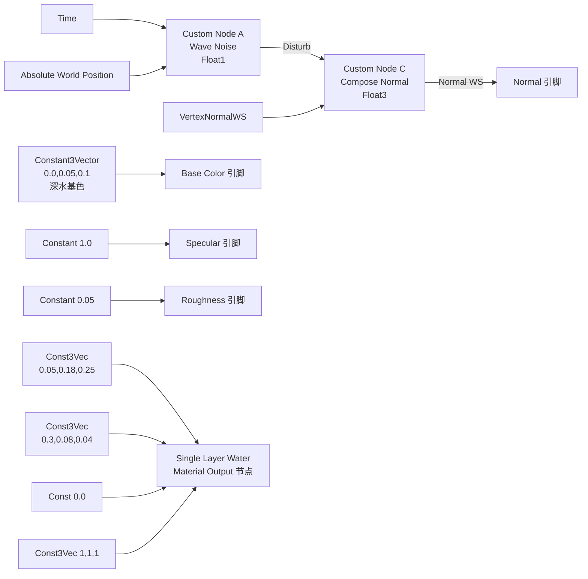

# R8：参数化 Tint 路径（3 套 PBR 基础 + 4 通道 LUT 微调 + 水面层）

> 本文档是 [SphericalSDFTerrainDesign.md §16.1](SphericalSDFTerrainDesign.md#161-r8-参数化-tint--水面层mesh-不变只改材质) 的独立落地文档，与 [R7_TerrainTriplanar.md](R7_TerrainTriplanar.md) 风格一致。
>
> 阅读本文档前必须先理解 [R7_TerrainTriplanar.md](R7_TerrainTriplanar.md) §1~§4 的"三层 Triplanar 加权混合"管线——R8 不修改 R4/R5/R6 的 dir / dirP / w[3] 几何链路，仅在 R7"三层 Triplanar 真实采样"之后插入"per-cell 多通道参数微调"，把 19 张独立纹理路径替换为 3 张共享基础套件 + 4 张 LUT 派生。
>
> ⚠ **路线说明（2026-06-29）**：本期是 [SDF 主稿 §11 Roadmap](SphericalSDFTerrainDesign.md#11-实施-roadmapm-step) 调整后的新 R8——**不消费 W4 输出**。`CellAttrLUT.R` 写入的 BaseTexIdx 与材质 LUT 中的 17 种地形配方索引继续沿用 R3 的 Knuth 哈希 placeholder。W4 真实查表（`Def->LayerIndex` + `Def->FTerrainMaterialParams`）推迟到 R8.5 自研球面网格联调阶段才接入。

---

## 0. R8 一句话目标

把 R7 输出公式中的"19 张独立 BaseColor slice"换成"**3 张共享 PBR 套件（Soil/Rock/Forest Canopy）经 per-cell 多通道参数微调后的派生颜色**"——

$$
\boxed{\;
\mathrm{color}_i \;=\; \mathrm{Tint}_i \;\circ\; \mathrm{HSV}_i \;\circ\; \mathrm{Lerp}\bigl(\mathrm{Triplanar}(\mathrm{Base}_{B_i}),\;\mathrm{Triplanar}(\mathrm{Forest}),\;\mathrm{OverlayBlend}_i\bigr)
\;}
$$

R4/R5/R6 几何链路（Voronoi 边、软边过渡、噪声扰动）原封保留；R7 的三平面加权混合形态保留。R8 仅是"颜色源"从"slice 索引"升级为"3 base + 4 通道 per-cell LUT 微调"，并新增独立水面层 mesh。

### 0.1 视觉对比矩阵

| 阶段 | 颜色来源 | per-cell 自由度 | 显存占用（NumLayers=17, sub=3）|
| --- | --- | --- | --- |
| R7 | 19 张独立 `Texture2DArray` slice | 仅 LayerIndex 1 个 uint8 | TerrainAlbedoArray ≈ 19 × 1024² × BC1 ≈ **10 MB**；NormalArray 同 ≈ 10 MB；其它 PBR 通道默认空 |
| **R8 ⭐** | 3 张基础 PBR 套件（Soil/Rock/Forest）× per-cell 17 种 tint 配方派生 | 16 字节 / cell（4 LUT × RGBA8/16F）| 3 × 4 通道 × 1024² ≈ **24 MB**（BC1+BC5）；4 LUT ≈ 642 × 16 = **10 KB** |

显存增加 ~14 MB，但视觉**多样性从 19 种固定纹理 → 17 种纹理配方 + 全部 base 纹理共享**（任何配方都可在编辑器实时调 Tint/HSV 看效果）。

### 0.2 关键决策回顾（与 SDF 主稿 §16.1 一致）

| 决策点 | R8 选择 | 备选（未采用）|
| --- | --- | --- |
| 基础 PBR 套件数 | 3（Soil + Rock + Forest）| 4（含 Snow/Ice）—— Snow/Ice 通过 Soil + Bri↑↑ + Rough↓ 模拟即可，省 1 套显存 |
| LUT 数量 | 4 张（Index/Tint/HSV_Rough/NSpec）| 1 张（紧凑 R8G8B8A8）—— 信息密度不够，无法同时携带 Tint(RGB)+HSV+Rough+...|
| 17 种地形配方 | 在 cpp 端硬编码于材质 LUT（R8 阶段）| 由 W4 `FTerrainMaterialParams` DataAsset 配置 —— W4 联调时再切，R8 阶段先用 placeholder |
| Forest Canopy 角色 | 作为 Overlay 层，与 Base 双层 lerp | 作为独立 Base —— 但 17 种配方里只有 Forest.* 真正用到森林纹理，独立 Base 浪费一个采样槽 |
| 水面层方案 | 独立 sub=3 球皮 Actor + 半透明水材质 | 写到主材质里（按 BaseTexIdx 切水/陆）—— 主材质会变得过于复杂，且无法做半透明深度淡入 |
| 水面层 mesh 半径 | `GlobeRadius + WaterSurfaceOffset`（R8 阶段 Offset=0）| `GlobeRadius` 恒定 —— R8 阶段地形球半径恒定，水面与地形重合，必须分开验收（关掉水面看地形 / 关掉地形看水面）|

---

## 1. 几何与数学

### 1.1 R7 输出公式回顾

R7 最终输出（[R7_TerrainTriplanar.md §1.2](R7_TerrainTriplanar.md)）：

$$
\mathrm{color}(\mathrm{frag}) \;=\; \frac{\sum_{i=0}^{2} w_i \cdot \mathrm{Triplanar}(\mathbf{A}, L_i, \mathbf{x}, \hat{\mathbf{n}})}{\sum_{i=0}^{2} w_i + \varepsilon}
$$

其中：
- $w_i$：R6 软蜿蜒边权重（基于 dirP）
- $L_i$：第 $i$ 个 cell 的 LayerIndex（R3 Knuth placeholder，R8 仍沿用）
- $\mathbf{A}$：`TerrainAlbedoArray`，19-slice，slice = $L_i$
- $\mathbf{x}$：WorldPos（cm）
- $\hat{\mathbf{n}}$：未扰动 dir（用于 Triplanar 三平面混合权重）

### 1.2 R8 核心：单 slice 采样 → 3 base + 多参数微调

R8 把 $\mathrm{Triplanar}(\mathbf{A}, L_i, ...)$ 整段替换为：

$$
\mathrm{ParamColor}_i(\mathrm{frag}) \;=\; \mathrm{Tint}_i \;\odot\; \mathrm{HSVAdjust}_i\bigl(\;\mathrm{Lerp}\bigl(\;C_i^{\text{base}},\;C_i^{\text{forest}},\;b_i\bigr)\;\bigr)
$$

其中：
- $C_i^{\text{base}} = \mathrm{Triplanar}(\mathbf{A}_{\text{base}}, B_i, \mathbf{x} \cdot s_i, \hat{\mathbf{n}})$：基础层颜色
- $C_i^{\text{forest}} = \mathrm{Triplanar}(\mathbf{A}_{\text{base}}, 2, \mathbf{x} \cdot s_i, \hat{\mathbf{n}})$：森林 Overlay 颜色（slice=2 即 Moss002，固定）
- $\mathbf{A}_{\text{base}}$：3-slice 共享 `Texture2DArray`（slice 0=Soil/Gravel042, 1=Rock/Rock022, 2=Forest/Moss002）
- $B_i \in \{0, 1, 2\}$：第 $i$ 个 cell 的 BaseTexIdx（来自 LUT0.r）
- $b_i \in [0, 1]$：第 $i$ 个 cell 的 OverlayBlend（来自 LUT0.b / 255）—— $b_i = 0$ 时纯基础，$b_i > 0$ 时叠加森林
- $s_i$：第 $i$ 个 cell 的 TriplanarScale 修正（来自 LUT3.a，相对 TileScale 全局值的乘数）
- $\mathrm{Tint}_i = (T_R, T_G, T_B)$：来自 LUT1.rgb，作 HSV 后乘
- $\mathrm{HSVAdjust}_i$：基于 LUT2 的 HSV 偏移与重映射

最终颜色仍按 R6 的 $w_i$ 加权混合：

$$
\mathrm{color}(\mathrm{frag}) \;=\; \frac{\sum_{i=0}^{2} w_i \cdot \mathrm{ParamColor}_i}{\sum_{i=0}^{2} w_i + \varepsilon}
$$

### 1.3 4 通道 LUT 字段定义

| LUT | 尺寸 / 格式 | 通道 | 含义 | 数值范围 |
| --- | --- | --- | --- | --- |
| `LUT0_Index` | 1×N / `PF_B8G8R8A8` | R | BaseTexIdx | 0/1/2（其它值视为 0）|
|  |  | G | OverlayIdx（保留，R8 总是 = 2 即 Forest）| 0~2 |
|  |  | B | OverlayBlend × 255 | 0..255 |
|  |  | A | Mask（位 0=bIsCoast, 位 1=bIsRiver, ...）| 8 个独立位 |
| `LUT1_Tint` | 1×N / `PF_FloatRGBA`（FP16）| R/G/B | Tint Multiply（线性空间）| [0, 4]，1.0=不变 |
|  |  | A | HueShift（弧度）| [-π, +π]，0=不变 |
| `LUT2_HSV_Rough` | 1×N / `PF_FloatRGBA` | R | Saturation Multiply | [0, 2]，1=不变 |
|  |  | G | Brightness Multiply | [0, 4]，1=不变 |
|  |  | B | RoughnessMin | [0, 1] |
|  |  | A | RoughnessMax | [0, 1] |
| `LUT3_NSpec` | 1×N / `PF_FloatRGBA` | R | NormalStrength | [0, 4]，1=不变 |
|  |  | G | HeightScale（R8.5 用，R8 写但不读）| [0, 2] |
|  |  | B | SpecularBoost | [0, 4] |
|  |  | A | TriplanarScale Multiplier | [0.1, 10]，1=不变 |

> 4 张 LUT 在 sub=3（NumCells=642）下总占用 642 × (4 + 8 + 8 + 8) = **17.6 KB**，常驻 GPU L2 cache。

### 1.4 17 种地形配方表（R8 阶段 placeholder）

R8 在 cpp `RebuildCellAttrLUT_()` 中按 `BaseTexIdx = Knuth(CellId) % 17` 写 LUT0.R，并按下表派生其它 3 张 LUT 的字段：

| Idx | 含义 | Base | Tint(R,G,B) | Sat | Bri | RoughMin/Max | Overlay/Blend | NormalStr | TriScale |
| --- | --- | --- | --- | --- | --- | --- | --- | --- | --- |
| 0 | `Plain.Grass` | Soil | (0.40, 0.70, 0.30) | 1.0 | 1.0 | 0.5/0.8 | Forest / 0.15 | 1.0 | 1.0 |
| 1 | `Plain.Savanna` | Soil | (0.70, 0.60, 0.30) | 0.9 | 1.1 | 0.6/0.9 | — / 0.0 | 1.0 | 1.0 |
| 2 | `Forest.Temperate` | Soil | (0.30, 0.55, 0.25) | 1.1 | 0.9 | 0.5/0.8 | Forest / 0.65 | 1.2 | 1.0 |
| 3 | `Forest.Tropical` | Soil | (0.20, 0.50, 0.20) | 1.3 | 0.85 | 0.4/0.7 | Forest / 0.85 | 1.5 | 1.0 |
| 4 | `Forest.Taiga` | Soil | (0.25, 0.40, 0.30) | 0.7 | 0.85 | 0.5/0.8 | Forest / 0.55 | 1.2 | 1.0 |
| 5 | `Wetland` | Soil | (0.30, 0.50, 0.35) | 1.0 | 0.85 | 0.2/0.5 | — / 0.0 | 0.8 | 1.0 |
| 6 | `Desert.Sand` | Soil | (0.95, 0.85, 0.60) | 0.9 | 1.2 | 0.7/0.95 | — / 0.0 | 0.5 | 0.5 |
| 7 | `Desert.Rocky` | Rock | (0.70, 0.60, 0.45) | 0.7 | 1.0 | 0.7/0.95 | — / 0.0 | 1.0 | 1.0 |
| 8 | `Coast.Beach` | Soil | (0.95, 0.90, 0.70) | 0.7 | 1.15 | 0.7/0.95 | — / 0.0 | 0.5 | 0.5 |
| 9 | `Coast.Rocky` | Rock | (0.55, 0.55, 0.50) | 0.5 | 0.9 | 0.6/0.9 | — / 0.0 | 1.2 | 1.5 |
| 10 | `Mountain.Hill` | Rock | (0.55, 0.50, 0.42) | 0.7 | 0.9 | 0.6/0.9 | Soil / 0.30 | 1.2 | 1.5 |
| 11 | `Mountain.Peak` | Rock | (0.50, 0.48, 0.45) | 0.4 | 0.85 | 0.7/0.95 | — / 0.0 | 1.5 | 2.0 |
| 12 | `Mountain.Snow` | Rock | (0.92, 0.94, 0.98) | 0.2 | 1.4 | 0.1/0.4 | — / 0.0 | 1.0 | 1.5 |
| 13 | `Tundra` | Soil | (0.70, 0.70, 0.65) | 0.3 | 1.05 | 0.7/0.95 | — / 0.0 | 0.8 | 1.0 |
| 14 | `Glacier` | Rock | (0.85, 0.92, 0.98) | 0.4 | 1.45 | 0.1/0.3 | — / 0.0 | 0.5 | 2.0 |
| 15 | `Ocean.Shallow` | Soil | (0.20, 0.50, 0.70) | 1.5 | 0.8 | 0.05/0.2 | — / 0.0 | 0.3 | 1.5 |
| 16 | `Ocean.Deep` | Soil | (0.05, 0.15, 0.40) | 1.5 | 0.5 | 0.05/0.2 | — / 0.0 | 0.2 | 2.0 |

> 这 17 行就是 R8 详稿的核心数据资产。本表在 cpp `BuildPlaceholderRecipes_()` 中以 `static constexpr` 数组硬编码，W4 联调时整体迁移到 `UTerrainDefinition::FTerrainMaterialParams`。

### 1.5 关键约束 1：Triplanar 法线 $\hat{\mathbf{n}}$ 仍用未扰动 dir

R7 的核心约束（[R7_TerrainTriplanar.md §1.4](R7_TerrainTriplanar.md)）继续生效——R8 的 3 base + Forest Overlay 总共 6 次 Triplanar 采样**全部用未扰动 dir 求三平面权重**，不要用 R6 的 dirP。否则 cell 内部的 fp32 噪声方向抖动会让 6 次三平面权重同步突变，伪影更明显（6 个采样源叠加）。

### 1.6 关键约束 2：HSV 转换在线性空间，Tint 在 HSV 之后

LUT1.rgb 是**线性空间**的 Tint Multiply（不是 sRGB 显示色）。HLSL 顺序：

```
sample → linear RGB                          (BaseColor sRGB → 自动 linear)
       → RGB→HSV
       → H + HueShift, S * SatMul, V * BriMul
       → HSV→RGB
       → linear RGB * Tint                   (LUT1.rgb 直接相乘)
       → 输出
```

调试师在编辑器里看到的"绿色 Tint"应该填 `(0.4, 0.7, 0.3)`（linear），不是 sRGB 的 `(0.6, 0.85, 0.55)`。

### 1.7 与 R8.5 自研球面网格的同构性

R8 不改 dir / dirP / w[3]——这些公式在 R8.5 切到自研球面网格后**完全不变**（仅 c0/c1/c2 来源从 UV 还原换成 cpp 预计算灌顶点 UV1/UV2/UV3）。R8 新增的 4 通道 LUT 在 R8.5 上**零修改复用**：cpp 端只是把 `BaseTexIdx = Knuth(CellId)` 一行换成 `BaseTexIdx = Def->LayerIndex`，其余 LUT 字段在 W4 联调时由 `Def->FTerrainMaterialParams` 提供。

---

## 2. HLSL 实现

### 2.1 UE Custom 节点限制（沿用 R7 §2.1 警示）

- Custom 节点没有顶层函数声明能力——所有逻辑必须 inline 写在 Code 字段里
- HLSL `if/else` 在编译期可能展开为 select，但仍然能用
- **HLSL 中不能写函数定义**——所有 helper 必须以 block scope `{ ... }` 内联

### 2.2 RGB↔HSV inline 模板

R8 需要三处 RGB↔HSV 转换（per-cell 微调），统一用以下 inline block：

> ⚠ **本节代码是算法参考，不是粘贴版**：以下两段使用 `float3 _rgb2hsv(float3 c) { ... }` 函数语法**仅为算法可读性**——UE Custom 节点**禁止**函数定义（详见 [AgentWorkflow §3.3](AgentWorkflow.md#33--hlsl-在-ue-custom-节点的-4-项硬性限制)）。
>
> 真正落地版（可直接粘贴到 Custom 节点 Code 字段）见：
> - **§4.4.2** 展开版：把 `_rgb2hsv` / `_hsv2rgb` 公式直接 inline 进 cell A/B/C 的 28 行 block
> - **§4.4.2.1** 宏化版（推荐）：定义 `#define VN3D` / `#define SAMPLE_PARAM_COLOR` 宏，调用 3 次
>
> 同款规则适用 §2.3 `_sampleParamColor`——该函数仅是数学结构展示，落地必须改为宏 / 内联。

```hlsl
// RGB → HSV（in/out 都在 [0,1]，H 在 [0,1)）
float3 _rgb2hsv(float3 c)
{
    float4 K = float4(0.0, -1.0/3.0, 2.0/3.0, -1.0);
    float4 p = c.g < c.b ? float4(c.bg, K.wz) : float4(c.gb, K.xy);
    float4 q = c.r < p.x ? float4(p.xyw, c.r) : float4(c.r, p.yzx);
    float d = q.x - min(q.w, q.y);
    const float e = 1.0e-10;
    return float3(abs(q.z + (q.w - q.y) / (6.0 * d + e)), d / (q.x + e), q.x);
}

// HSV → RGB
float3 _hsv2rgb(float3 c)
{
    float4 K = float4(1.0, 2.0/3.0, 1.0/3.0, 3.0);
    float3 p = abs(frac(c.xxx + K.xyz) * 6.0 - K.www);
    return c.z * lerp(K.xxx, saturate(p - K.xxx), c.y);
}
```

> 这是工业标准 IQ HSV 公式（Inigo Quilez, Shadertoy 历史代码），数值稳定、跨平台一致。

### 2.3 单 cell 参数化采样 inline 模板

```hlsl
//   输入：layer 索引 i ∈ {0,1,2}，cell 在 LUT 中的索引 c
//   输出：经 Tint+HSV+Overlay 的最终 cell 颜色
float3 _sampleParamColor(int c, float3 wp, float3 nUnpert, float baseTileScale)
{
    // 1. 取 4 张 LUT 数据
    float4 lut0 = CellAttrLUT  .Load(int3(c, 0, 0));   // R=BaseIdx*1/255, G=OverlayIdx*1/255, B=blend, A=mask
    float4 lut1 = CellTintLUT  .Load(int3(c, 0, 0));   // RGB=Tint, A=HueShift
    float4 lut2 = CellHSVRoughLUT.Load(int3(c, 0, 0)); // R=Sat, G=Bri, B=RMin, A=RMax
    float4 lut3 = CellNSpecLUT .Load(int3(c, 0, 0));   // R=NormalStr, G=HeightScale, B=Spec, A=TriScale

    int   baseIdx = (int)(lut0.r * 255.0 + 0.5);   // 0/1/2
    float blend   = lut0.b;                          // [0,1]
    float triMul  = lut3.a;                          // 例：0.5 / 1.0 / 2.0

    // 2. 三平面权重（用未扰动法线，关键约束 §1.5）
    float3 absN = pow(abs(nUnpert), TriplanarSharpness);
    absN /= dot(absN, float3(1.0, 1.0, 1.0));

    // 3. base 采样（slice = baseIdx）
    float3 cBaseX = PBRBaseAlbedo.SampleLevel(PBRBaseAlbedoSampler, float3(wp.yz / (baseTileScale * triMul), (float)baseIdx), 0).rgb;
    float3 cBaseY = PBRBaseAlbedo.SampleLevel(PBRBaseAlbedoSampler, float3(wp.xz / (baseTileScale * triMul), (float)baseIdx), 0).rgb;
    float3 cBaseZ = PBRBaseAlbedo.SampleLevel(PBRBaseAlbedoSampler, float3(wp.xy / (baseTileScale * triMul), (float)baseIdx), 0).rgb;
    float3 cBase  = cBaseX * absN.x + cBaseY * absN.y + cBaseZ * absN.z;

    // 4. forest overlay 采样（slice = 2 固定，仅当 blend>0 时实际混合）
    float3 cFor = float3(0,0,0);
    if (blend > 0.001)
    {
        float3 cForX = PBRBaseAlbedo.SampleLevel(PBRBaseAlbedoSampler, float3(wp.yz / (baseTileScale * triMul), 2.0), 0).rgb;
        float3 cForY = PBRBaseAlbedo.SampleLevel(PBRBaseAlbedoSampler, float3(wp.xz / (baseTileScale * triMul), 2.0), 0).rgb;
        float3 cForZ = PBRBaseAlbedo.SampleLevel(PBRBaseAlbedoSampler, float3(wp.xy / (baseTileScale * triMul), 2.0), 0).rgb;
        cFor = cForX * absN.x + cForY * absN.y + cForZ * absN.z;
    }

    // 5. base + overlay lerp
    float3 cMix = lerp(cBase, cFor, blend);

    // 6. HSV 调整（Sat/Bri，HueShift R8 暂不接，预留 lut1.a）
    float3 hsv = _rgb2hsv(cMix);
    hsv.y = saturate(hsv.y * lut2.r);
    hsv.z = saturate(hsv.z * lut2.g);
    float3 cHSV = _hsv2rgb(hsv);

    // 7. Tint 后乘
    float3 cFinal = cHSV * lut1.rgb;

    return cFinal;
}
```

> Sat/Bri 后用 `saturate()` 防止超 1 → 后续 Tint 把它再乘一次，需要的话 Tint 可超 1（HDR）

### 2.4 三层加权混合规则

R7 三层混合公式不变，只是把 `Triplanar(...)` 整段调用换成 `_sampleParamColor(c_i, WorldPos, dir, TileScale)`：

```hlsl
float3 colA = _sampleParamColor(c0, WorldPos, dir, TileScale);
float3 colB = _sampleParamColor(c1, WorldPos, dir, TileScale);
float3 colC = _sampleParamColor(c2, WorldPos, dir, TileScale);

float wsum = wA + wB + wC + 1e-6;
return (colA * wA + colB * wB + colC * wC) / wsum;
```

**采样次数**：每 cell 3 base + 最多 3 forest = **最多 18 次 Triplanar SampleLevel** / pixel（R7 是 9 次）。但 forest 部分受 `if (blend > 0.001)` 短路保护，常见地形（沙漠/山岩/海洋）会跳过 forest 三采样，回到 9 次。即使全部命中 forest（17 行配方里只有 4 行 blend>0），也只是 18 次 SampleLevel，对现代 GPU 仍然 < 1 ms / 1080p。

---

## 3. cpp 端改动

### 3.1 [PlanetTopologyDebugMesh.h](../Source/TerraCivilization/Public/Render/PlanetTopologyDebugMesh.h)

新增 6 个 UPROPERTY（替换 R7 的 `TerrainAlbedoArray` / `TerrainNormalArray`）和 3 个 Transient LUT 成员：

```cpp
/**
 * R8：3 张共享基础 PBR 套件的 BaseColor 数组（NumSlices=3）。
 *
 * 每个 slice = 1 张基础 PBR 套件的 BaseColor（sRGB）：
     *   slice 0 = Soil   (Gravel042，碎石沙砾——平地/沙地/海床)
     *   slice 1 = Rock   (Rock022，岩石——山脉/戈壁/岩石海岸)
     *   slice 2 = Forest (Moss002，苔藓/树冠——所有 Forest.* 配方的 Overlay 层)
 *
 * 由 Content/Textures/T_PBRBase_Albedo.uasset 提供（详见 R8_ParametricTint.md 附录 A）。
 *
 * R8 阶段 17 种地形配方通过 LUT0.R 选择 slice 0/1，LUT0.B（OverlayBlend）控制
 * 是否叠加 slice 2（Forest）。即同一组基础贴图能派生出 17 种视觉差异显著的地形。
 *
 * 留空时材质退化为 R6 哈希色（Custom 节点的 PBRBaseAlbedo Input 没接 → 反射诊断报错）。
 */
UPROPERTY(EditAnywhere, BlueprintReadOnly, Category = "PlanetTopology|R8")
TObjectPtr<class UTexture2DArray> PBRBaseAlbedo;

/** R8：3 张共享基础 PBR 套件的 Normal 数组（NormalDX，NumSlices=3）。slice 与 PBRBaseAlbedo 一一对齐。 */
UPROPERTY(EditAnywhere, BlueprintReadOnly, Category = "PlanetTopology|R8")
TObjectPtr<class UTexture2DArray> PBRBaseNormal;

/** R8：3 张共享基础 PBR 套件的 Roughness 数组（NumSlices=3）。slice 与 PBRBaseAlbedo 一一对齐。 */
UPROPERTY(EditAnywhere, BlueprintReadOnly, Category = "PlanetTopology|R8")
TObjectPtr<class UTexture2DArray> PBRBaseRoughness;

/** R8：3 张共享基础 PBR 套件的 Height 数组（Displacement，NumSlices=3）。R8.5 用，R8 阶段挂上即可不必采样。 */
UPROPERTY(EditAnywhere, BlueprintReadOnly, Category = "PlanetTopology|R8")
TObjectPtr<class UTexture2DArray> PBRBaseHeight;

/**
 * R8：是否启用水面层（半透明球皮）。默认 false；勾上后 Rebuild() 末尾会重建
 * `WaterMeshComp`（一个挂在本 Actor RootComponent 下的 ProceduralMeshComponent
 * 子组件），半径 = Radius + WaterSurfaceOffset。详见 §4.5。
 */
UPROPERTY(EditAnywhere, BlueprintReadWrite, Category = "PlanetTopology|R8")
bool bEnableWaterShell = false;

/** R8：半透明水材质 M_WaterShell（详见 §4.5.3）。为空时走默认 checker。 */
UPROPERTY(EditAnywhere, BlueprintReadWrite, Category = "PlanetTopology|R8")
TObjectPtr<class UMaterialInterface> WaterMaterial;

/** R8：水面 mesh 相对 Radius 的径向偏移（cm）。R8 阶段建议 0.0；R8.5 后可调。 */
UPROPERTY(EditAnywhere, BlueprintReadWrite, Category = "PlanetTopology|R8",
          meta = (ClampMin = "-1000.0", ClampMax = "1000.0"))
float WaterSurfaceOffset = 0.0f;
```

> R7 的 `TerrainAlbedoArray` / `TerrainNormalArray` 字段**保留作历史档案**——可加 `meta = (DeprecatedProperty)` 但不强求，因为 R8 反射诊断已不再要求 `terrainalbedoarray` 这个 Input，材质里也不会出现该参数。简单做法是删除两行 UPROPERTY 与 §3.2 cpp 中对应的 MID 注入；保守做法是保留字段（不影响新材质，仍能挂回 R7 旧材质用）。本稿采用**保留字段、不删**的保守做法，详见 §3.2。

3 张 Transient LUT 字段（与 R3 `CellAttrLUT` 同款风格）：

```cpp
/**
 * R8：每 Cell 一个像素的 1×N 动态纹理（PF_FloatRGBA = FP16x4）。
 *   - R 通道 = Tint.R（线性，[0, 4]）
 *   - G 通道 = Tint.G
 *   - B 通道 = Tint.B
 *   - A 通道 = HueShift（弧度，[-π, +π]，R8 暂不读，预留）
 *
 * 由 RebuildCellTintLUT_ 创建并填充 placeholder 数据。Filter=Nearest、SRGB=false。
 * 必须 FP16 而非 R8G8B8A8——线性 Tint 可能 > 1（HDR），且色调精度需要 > 8-bit。
 */
UPROPERTY(VisibleAnywhere, Transient, Category = "PlanetTopology|R8")
TObjectPtr<UTexture2D> CellTintLUT;

/**
 * R8：每 Cell 一个像素的 1×N 动态纹理（PF_FloatRGBA）。
 *   R=Saturation Mul、G=Brightness Mul、B=RoughnessMin、A=RoughnessMax。
 */
UPROPERTY(VisibleAnywhere, Transient, Category = "PlanetTopology|R8")
TObjectPtr<UTexture2D> CellHSVRoughLUT;

/**
 * R8：每 Cell 一个像素的 1×N 动态纹理（PF_FloatRGBA）。
 *   R=NormalStrength、G=HeightScale（R8.5 用）、B=SpecularBoost、A=TriplanarScale。
 */
UPROPERTY(VisibleAnywhere, Transient, Category = "PlanetTopology|R8")
TObjectPtr<UTexture2D> CellNSpecLUT;
```

3 个 LUT 构建函数（与 `RebuildCellAttrLUT_` 同款风格）：

```cpp
/** R8：构建/刷新 CellTintLUT（1×NumCells、PF_FloatRGBA）。每次 Rebuild() 都会调用一次。 */
void RebuildCellTintLUT_(int32 NumCells);

/** R8：构建/刷新 CellHSVRoughLUT（1×NumCells、PF_FloatRGBA）。 */
void RebuildCellHSVRoughLUT_(int32 NumCells);

/** R8：构建/刷新 CellNSpecLUT（1×NumCells、PF_FloatRGBA）。 */
void RebuildCellNSpecLUT_(int32 NumCells);
```

`RebuildCellAttrLUT_()` 不需要新加函数，但**写法变**：R8 阶段 LUT0.R 不再写 LayerIndex（0..18），改写 BaseTexIdx（0/1/2）；LUT0.B 写 OverlayBlend × 255；LUT0.G 写 OverlayIdx（R8 总是 2 即 Forest）。具体实现见 §3.2.1 配方派生函数。

### 3.2 [PlanetTopologyDebugMesh.cpp](../Source/TerraCivilization/Private/Render/PlanetTopologyDebugMesh.cpp)

#### 3.2.1 17 种配方派生函数（新增）

在文件顶部 `Logger` 声明之后追加：

```cpp
// =====================================================================
// R8：17 种地形配方表（详见 R8_ParametricTint.md §1.4）
//
// 字段顺序：BaseTexIdx, Tint(R,G,B), Sat, Bri, RoughMin, RoughMax,
//           OverlayBlend, NormalStr, TriScale
//
// W4 联调时整体迁移到 UTerrainDefinition::FTerrainMaterialParams DataAsset。
// =====================================================================
namespace
{
    struct FR8Recipe
    {
        uint8  BaseTexIdx;       // 0=Soil, 1=Rock, 2=Forest（不应作为 base）
        float  TintR, TintG, TintB;
        float  SatMul;
        float  BriMul;
        float  RoughMin;
        float  RoughMax;
        float  OverlayBlend;     // 0=纯 base，>0 叠加 Forest
        float  NormalStr;
        float  TriScale;
    };

    static const FR8Recipe GR8Recipes[17] = {
        // 0  Plain.Grass
        { 0, 0.40f, 0.70f, 0.30f, 1.0f, 1.0f,  0.5f, 0.8f,  0.15f, 1.0f, 1.0f },
        // 1  Plain.Savanna
        { 0, 0.70f, 0.60f, 0.30f, 0.9f, 1.1f,  0.6f, 0.9f,  0.0f,  1.0f, 1.0f },
        // 2  Forest.Temperate
        { 0, 0.30f, 0.55f, 0.25f, 1.1f, 0.9f,  0.5f, 0.8f,  0.65f, 1.2f, 1.0f },
        // 3  Forest.Tropical
        { 0, 0.20f, 0.50f, 0.20f, 1.3f, 0.85f, 0.4f, 0.7f,  0.85f, 1.5f, 1.0f },
        // 4  Forest.Taiga
        { 0, 0.25f, 0.40f, 0.30f, 0.7f, 0.85f, 0.5f, 0.8f,  0.55f, 1.2f, 1.0f },
        // 5  Wetland
        { 0, 0.30f, 0.50f, 0.35f, 1.0f, 0.85f, 0.2f, 0.5f,  0.0f,  0.8f, 1.0f },
        // 6  Desert.Sand
        { 0, 0.95f, 0.85f, 0.60f, 0.9f, 1.2f,  0.7f, 0.95f, 0.0f,  0.5f, 0.5f },
        // 7  Desert.Rocky
        { 1, 0.70f, 0.60f, 0.45f, 0.7f, 1.0f,  0.7f, 0.95f, 0.0f,  1.0f, 1.0f },
        // 8  Coast.Beach
        { 0, 0.95f, 0.90f, 0.70f, 0.7f, 1.15f, 0.7f, 0.95f, 0.0f,  0.5f, 0.5f },
        // 9  Coast.Rocky
        { 1, 0.55f, 0.55f, 0.50f, 0.5f, 0.9f,  0.6f, 0.9f,  0.0f,  1.2f, 1.5f },
        // 10 Mountain.Hill
        { 1, 0.55f, 0.50f, 0.42f, 0.7f, 0.9f,  0.6f, 0.9f,  0.30f, 1.2f, 1.5f },
        // 11 Mountain.Peak
        { 1, 0.50f, 0.48f, 0.45f, 0.4f, 0.85f, 0.7f, 0.95f, 0.0f,  1.5f, 2.0f },
        // 12 Mountain.Snow
        { 1, 0.92f, 0.94f, 0.98f, 0.2f, 1.4f,  0.1f, 0.4f,  0.0f,  1.0f, 1.5f },
        // 13 Tundra
        { 0, 0.70f, 0.70f, 0.65f, 0.3f, 1.05f, 0.7f, 0.95f, 0.0f,  0.8f, 1.0f },
        // 14 Glacier
        { 1, 0.85f, 0.92f, 0.98f, 0.4f, 1.45f, 0.1f, 0.3f,  0.0f,  0.5f, 2.0f },
        // 15 Ocean.Shallow
        { 0, 0.20f, 0.50f, 0.70f, 1.5f, 0.8f,  0.05f, 0.2f, 0.0f,  0.3f, 1.5f },
        // 16 Ocean.Deep
        { 0, 0.05f, 0.15f, 0.40f, 1.5f, 0.5f,  0.05f, 0.2f, 0.0f,  0.2f, 2.0f },
    };
    static_assert(UE_ARRAY_COUNT(GR8Recipes) == 17, "R8 must have exactly 17 recipes");

    constexpr uint32 KnuthHashConst = 2654435761u;

    // R8 placeholder：CellId → 配方索引（0..16）
    FORCEINLINE int32 R8_PlaceholderRecipeIndex(int32 CellId)
    {
        return static_cast<int32>((static_cast<uint32>(CellId) * KnuthHashConst) % 17u);
    }
}
```

#### 3.2.2 `RebuildCellAttrLUT_` 写法调整

R8 阶段把 W4 接入分支保留（向后兼容），但**默认走 R8 placeholder 分支**——具体策略：

- 若 `WorldGenSettings.TerrainSet` 已加载且能查到 Tag → 走 W4 分支：`baseIdx = Def->LayerIndex / 17`（截断到 0/1/2）；blend 与其它字段全 0
- 若不能查到 → 走 R8 placeholder：`recipeIdx = R8_PlaceholderRecipeIndex(CellId)`；按 GR8Recipes 表写

由于 R8 阶段 W4 还没调通，多数验收会走 R8 placeholder 分支。

`ComputeLayerForCell` Lambda 中默认分支 `case Biome` / `case None` 替换为：

```cpp
case EWorldGenDebugView::Biome:
case EWorldGenDebugView::None:
default:
{
    // R8 placeholder：CellId 哈希 → 17 种配方之一
    return (uint8)R8_PlaceholderRecipeIndex(CD.CellId);
}
```

> 注意 R8 阶段 LUT0.R 写的是 **配方索引（0..16）**，不再是"slice 索引"——HLSL `_sampleParamColor` 通过 `recipeIdx → BaseTexIdx ∈ {0,1,2}` 间接查表。而 placeholder 分支下"recipe→base"的映射通过 LUT0.R = recipeIdx 与 cpp 写其它三张 LUT 字段联合提供。**HLSL 端只关心 LUT0.R 已经是 BaseTexIdx**——所以 cpp 端写 LUT0 时必须写 `BaseTexIdx` 而非 `recipeIdx`。具体见 §3.2.3。

#### 3.2.3 LUT0 写入：从 recipe 派生 4 字段（修订）

简单起见，把"recipe 选择"完全在 cpp 端展开——LUT0.R 直接写 `Recipe.BaseTexIdx`，LUT0.G 写 OverlayIdx（=2 当 OverlayBlend>0，否则=0），LUT0.B 写 `OverlayBlend × 255`，LUT0.A 写 Mask（保留 0）：

替换原 `RebuildCellAttrLUT_` 中按 layer 单字节写入的循环为：

```cpp
// R8：按 ComputeLayerForCell 拿到 recipeIdx (0..16) → 派生 4 字段写 LUT0
for (int32 c = 0; c < NumCells; ++c)
{
    const FCellGeoData& CD = (CellData.IsValidIndex(c)) ? CellData[c] : FCellGeoData{};
    const uint8 RecipeIdx  = ComputeLayerForCell(CD);    // 0..16（R8）或 0..18（旧 layer）
    const int32 ClampedIdx = FMath::Clamp((int32)RecipeIdx, 0, 16);
    const FR8Recipe& R     = GR8Recipes[ClampedIdx];

    const uint8 OvlIdx     = (R.OverlayBlend > 0.001f) ? 2 : 0;
    const uint8 OvlBlend   = (uint8)FMath::Clamp(FMath::RoundToInt(R.OverlayBlend * 255.0f), 0, 255);

    // BGRA8 内存布局（注意是 B,G,R,A 顺序而非 R,G,B,A —— PF_B8G8R8A8 的物理顺序）
    Dst[c * 4 + 0] = OvlBlend;       // B = OverlayBlend × 255
    Dst[c * 4 + 1] = OvlIdx;         // G = OverlayIdx (0 or 2)
    Dst[c * 4 + 2] = R.BaseTexIdx;   // R = BaseTexIdx (0/1/2)
    Dst[c * 4 + 3] = 0;              // A = Mask（R8 保留 0）
}
```

> ⚠ **PF_B8G8R8A8 内存顺序是 BGRA**，HLSL 里读 `.r` 拿到 R 通道（即字节 [2]）。这与 R3 原代码一致，但写入侧容易写反。

#### 3.2.4 RebuildCellTintLUT_ / HSVRoughLUT / NSpecLUT（新增）

3 张 LUT 用 PF_FloatRGBA（FP16×4）。模板与 `RebuildCellDirLUT_` 几乎一致，区别仅在 PixelFormat 与每像素 16 字节布局：

```cpp
void APlanetTopologyDebugMesh::RebuildCellTintLUT_(int32 NumCells)
{
    if (NumCells <= 0) { CellTintLUT = nullptr; return; }

    UTexture2D* NewLUT = UTexture2D::CreateTransient(NumCells, 1, PF_FloatRGBA, TEXT("CellTintLUT_Transient"));
    if (!NewLUT) { CellTintLUT = nullptr; return; }

    NewLUT->Filter        = TF_Nearest;
    NewLUT->SRGB          = false;
    NewLUT->AddressX      = TA_Clamp;
    NewLUT->AddressY      = TA_Clamp;
    NewLUT->CompressionSettings = TC_HDR;
    NewLUT->NeverStream   = true;
    NewLUT->LODGroup      = TEXTUREGROUP_ColorLookupTable;
    NewLUT->MipGenSettings = TMGS_NoMipmaps;

    FTexturePlatformData* Plat = NewLUT->GetPlatformData();
    if (!Plat || Plat->Mips.Num() == 0) { CellTintLUT = nullptr; return; }

    FByteBulkData& Bulk = Plat->Mips[0].BulkData;
    FFloat16* Dst = static_cast<FFloat16*>(Bulk.Lock(LOCK_READ_WRITE));
    if (!Dst) { CellTintLUT = nullptr; return; }

    const TArray<FCellGeoData>& CellData = Generator ? Generator->GetCellData() : TArray<FCellGeoData>{};

    for (int32 c = 0; c < NumCells; ++c)
    {
        const FCellGeoData& CD = (CellData.IsValidIndex(c)) ? CellData[c] : FCellGeoData{};
        const int32 RecipeIdx  = FMath::Clamp((int32)R8_PlaceholderRecipeIndex(c), 0, 16);
        const FR8Recipe& R     = GR8Recipes[RecipeIdx];

        Dst[c * 4 + 0] = FFloat16(R.TintR);
        Dst[c * 4 + 1] = FFloat16(R.TintG);
        Dst[c * 4 + 2] = FFloat16(R.TintB);
        Dst[c * 4 + 3] = FFloat16(0.0f);   // HueShift 预留 0
    }

    Bulk.Unlock();
    NewLUT->UpdateResource();
    CellTintLUT = NewLUT;
}

void APlanetTopologyDebugMesh::RebuildCellHSVRoughLUT_(int32 NumCells)
{
    // ... 同款骨架，写入字段：
    //   Dst[c*4+0] = FFloat16(R.SatMul);
    //   Dst[c*4+1] = FFloat16(R.BriMul);
    //   Dst[c*4+2] = FFloat16(R.RoughMin);
    //   Dst[c*4+3] = FFloat16(R.RoughMax);
}

void APlanetTopologyDebugMesh::RebuildCellNSpecLUT_(int32 NumCells)
{
    // ... 同款骨架，写入字段：
    //   Dst[c*4+0] = FFloat16(R.NormalStr);
    //   Dst[c*4+1] = FFloat16(R.HeightScale);    // R8 写 0/0.5/...，HLSL 不读
    //   Dst[c*4+2] = FFloat16(R.SpecBoost);       // GR8Recipes 表暂未给字段，全 1.0
    //   Dst[c*4+3] = FFloat16(R.TriScale);
}
```

> 3 个函数差异仅在写入字段；可以参数化成一个 `RebuildCellFloatRGBALUT_` 模板减少重复代码，但显式三段式更便于排错。本稿采用显式三段式。

#### 3.2.5 `Rebuild()` 调用顺序

在原有 `RebuildCellAttrLUT_(NumCells)` + `RebuildCellDirLUT_(NumCells)` 之后追加：

```cpp
RebuildCellTintLUT_(NumCells);
RebuildCellHSVRoughLUT_(NumCells);
RebuildCellNSpecLUT_(NumCells);
```

#### 3.2.6 MID 注入段

在 R7 已有的 `SetTextureParameterValue("TerrainAlbedoArray", ...)` 之后追加：

```cpp
// R8 新增注入：3 base PBR Array + 3 LUT + 水面参数
if (PBRBaseAlbedo)    { MID->SetTextureParameterValue(TEXT("PBRBaseAlbedo"),    PBRBaseAlbedo);    }
if (PBRBaseNormal)    { MID->SetTextureParameterValue(TEXT("PBRBaseNormal"),    PBRBaseNormal);    }
if (PBRBaseRoughness) { MID->SetTextureParameterValue(TEXT("PBRBaseRoughness"), PBRBaseRoughness); }

if (CellTintLUT)      { MID->SetTextureParameterValue(TEXT("CellTintLUT"),      CellTintLUT);      }
if (CellHSVRoughLUT)  { MID->SetTextureParameterValue(TEXT("CellHSVRoughLUT"),  CellHSVRoughLUT);  }
if (CellNSpecLUT)     { MID->SetTextureParameterValue(TEXT("CellNSpecLUT"),     CellNSpecLUT);     }

// R7 旧字段：保留（向后兼容旧 R7 材质）；新材质里这两个参数不存在，SetTextureParameterValue 会静默忽略。
// MID->SetTextureParameterValue(TEXT("TerrainAlbedoArray"), TerrainAlbedoArray);  // 已在 R7 段调用
```

#### 3.2.7 反射诊断升级（R7 14 输入 → R8 21 输入）

```cpp
const TArray<FString> ExpectedR8Inputs = {
    TEXT("uv0"), TEXT("uv1"), TEXT("uv2"), TEXT("uv3"),
    TEXT("worldpos"), TEXT("planetcenter"),
    TEXT("cellattrlut"), TEXT("celldirlut"),
    TEXT("edgewidth"),
    TEXT("noiseamplitude"), TEXT("noisescale"),
    TEXT("triplanarsharpness"), TEXT("tilescale"),
    TEXT("pbrbasealbedo"),                                              // R8 替代 terrainalbedoarray
    TEXT("celltintlut"), TEXT("cellhsvroughlut"), TEXT("cellnspeclut"), // R8 新增 3 LUT
};
// 21 项里去掉 R7 的 terrainalbedoarray，新增 4 个 → 实际 17 项强制 + 4 项可选（pbrbasenormal/roughness/height + R7 旧 albedo）
```

合规判定保持同款风格——所有 17 项强制 Inputs 齐全 → ✓ R8 compliant；缺哪个 → ✗ Error 提示"这是 R3/.../R7 旧材质而不是 R8"。

把对应 Error 文案、`TArray<FString> ExpectedR7Inputs` 这一变量名改为 `ExpectedR8Inputs`，同时修改后续 Log 文字 "R7-compliant" → "R8-compliant"、"is likely an R2/R3/R4/R5/R6 material" → "is likely an R2/R3/R4/R5/R6/R7 material"。

#### 3.2.8 Output Log 字符串

```cpp
UE_LOG(LogPlanetTopologyDebugMesh, Log,
    TEXT("[PlanetTopologyDebugMesh] Rebuilt (R8: 3-base + 4-LUT parametric tint). ")
    TEXT("SubdivisionLevel=%d  Cells=%d  Corners=%d  Verts=%d  Tris=%d  Radius=%.1f  Smooth=%s  ")
    TEXT("CellAttrLUT=%s  CellDirLUT=%s  CellTintLUT=%s  CellHSVRoughLUT=%s  CellNSpecLUT=%s  ")
    TEXT("PlanetCenter=(%.1f,%.1f,%.1f)  ")
    TEXT("EdgeWidth=%.4f rad (%.2f°)  NoiseAmplitude=%.4f rad (%.2f°)  NoiseScale=%.1f /rad  ")
    TEXT("PBRBaseAlbedo=%s  PBRBaseNormal=%s  PBRBaseRoughness=%s  ")
    TEXT("TileScale=%.0f cm  TriplanarSharpness=%.1f  EnableWaterShell=%s  WaterMaterial=%s  WaterSurfaceOffset=%.1f cm"),
    /* ... */,
    PBRBaseAlbedo    ? TEXT("OK") : TEXT("MISSING"),
    PBRBaseNormal    ? TEXT("OK") : TEXT("MISSING"),
    PBRBaseRoughness ? TEXT("OK") : TEXT("MISSING"),
    TileScale, TriplanarSharpness,
    bEnableWaterShell ? TEXT("YES") : TEXT("no"),
    WaterMaterial    ? *WaterMaterial->GetName()  : TEXT("(none)"),
    WaterSurfaceOffset);
```

#### 3.2.9 LUT 自检日志（选做）

按 [AgentWorkflow.md §1.4.3](AgentWorkflow.md) "LUT 自检日志"要求，前 16 个 cell 各打印一行：

```
Cell0  : Recipe=10 Base=1 Tint=(0.55,0.50,0.42) Sat=0.70 Bri=0.90 Rough=[0.6..0.9] Ovl/Blend=Forest/0.30 NormStr=1.20 TriScale=1.50
```

便于在 Output Log 里对照 §1.4 表格肉眼校验。

#### 3.2.10 水面层 Component（子对象路径）

R8 阶段水面层用一个**子组件 `WaterMeshComp`** 直接挂在 `APlanetTopologyDebugMesh` 的 RootComponent 下，和地形 `MeshComp` 兄弟节点。半径 = `Radius + WaterSurfaceOffset`。

```cpp
// 构造函数中创建 SubObject（与 MeshComp 同款 PMC 配置）：
WaterMeshComp = CreateDefaultSubobject<UProceduralMeshComponent>(TEXT("WaterMeshComp"));
WaterMeshComp->SetupAttachment(MeshComp);
WaterMeshComp->SetMobility(EComponentMobility::Movable);
WaterMeshComp->bUseAsyncCooking = true;
WaterMeshComp->SetCollisionEnabled(ECollisionEnabled::NoCollision);
WaterMeshComp->SetCanEverAffectNavigation(false);
WaterMeshComp->bUseComplexAsSimpleCollision = false;
WaterMeshComp->SetVisibility(false);   // 默认隐形，由 bEnableWaterShell 控制

// Rebuild() 末尾调用：
RebuildWaterMesh_();   // 内部按 bEnableWaterShell 二选一：
                       //   false → ClearAllMeshSections + Visibility=false
                       //   true  → 用 (Radius+WaterSurfaceOffset) 重铺 sub=3 球皮 + SetMaterial
```

> **为什么不再用 SpawnActor + 独立 `APlanetWaterShell` Actor**：
>
> 早期方案是在 `OnConstruction` 中 `World->SpawnActor<APlanetWaterShell>(WaterShellClass, ...)`，把 mesh 包在独立 Actor 里。该路径在 PIE 启动时存在生命周期错位坑——
> ① Editor World 深拷贝到 PIE World 时，`OnConstruction` 中 SpawnActor 出来的 Editor 临时 Actor 会被一起拷过去，但**材质引用在拷贝过程中失效**（`TObjectPtr<UMaterialInterface>` 没写进 `.umap`，拷贝后是 None）→ 视觉上变成不透明默认棋盘格球；
> ② PIE 启动后 `OnConstruction` 又跑一次，新的 SpawnActor + 旧的销毁扫描循环会留下一个空材质 Actor 在场景里；
> ③ 退 PIE 时 PIE World 整体回收，那个 Actor 一并消失。
>
> Component 是 Owner Actor 的 **SubObject**，PIE 拷贝跟 Owner 走，UPROPERTY 引用会被一起序列化/拷贝——零额外管理代码，零生命周期窗口。详见 [AgentWorkflow.md §3.10](AgentWorkflow.md#310-)。
>
> 水面 mesh 的几何构建（sub=3 icosphere、顶点法线直取 UnitCenter 实现完美光滑球面）流程在 §4.5 给出完整实现。

---

## 4. 材质资产搭建（M_TopologyDebug_R8）

### 4.1 复制 R7 材质

复制 `M_TopologyDebug_R7.uasset` 重命名为 `M_TopologyDebug_R8.uasset`。**保留 R7 全部既有节点**——R8 只在 Custom 节点的 Inputs 与 Code 字段做修改，不删旧节点。

### 4.2 拼装 PBR Texture2DArray 资产（一次性）

> 用户已在 [Content/Textures/](../Content/Textures/) 准备 12 张 PNG（Gravel042 / Rock022 / Moss002 各 4 张；Ground037 暂不使用）。下面把它们拼装成 4 张 Texture2DArray。

#### 4.2.1 导入 PNG

1. 在 Content Browser 中选中 12 张 PNG 文件，右键 → Import Assets...（如果还未导入）
2. 全选 12 张导入产物，右键 → Asset Actions → Bulk Edit via Property Matrix...：
    - **CompressionSettings**：
        - `*_Color.png`         → `Default (DXT1/5, BC1/3 on DX11)`（sRGB BaseColor）
        - `*_NormalDX.png`      → `NormalMap (DXT5, BC5 on DX11)`
        - `*_Roughness.png`     → `Default` 或 `Masks (no sRGB)`
        - `*_Displacement.png`  → `Displacementmap` 或 `Masks (no sRGB)`
    - **sRGB**：仅 `*_Color.png` 勾选；其余三类全部取消
    - **Mip Gen Settings**：保持 `FromTextureGroup`

#### 4.2.2 创建 4 张 Texture2DArray

在 `Content/Textures/` 中右键 → Texture2DArray，创建 4 个空 Array：

| 资产名 | NumSlices | 期望 Format | sRGB |
| --- | --- | --- | --- |
| `T_PBRBase_Albedo` | 3 | BC1_RGB | ✓ |
| `T_PBRBase_Normal` | 3 | BC5 | ✗ |
| `T_PBRBase_Roughness` | 3 | BC4 / Gray8 | ✗ |
| `T_PBRBase_Height` | 3 | BC4 / Gray8 | ✗ |

双击 `T_PBRBase_Albedo` → Details → Source Textures → 添加 3 项，按以下顺序：

- slice 0 → `Gravel042_1K-PNG_Color`（Soil，碎石沙砾）
- slice 1 → `Rock022_1K-PNG_Color`（Rock，岩石）
- slice 2 → `Moss002_1K-PNG_Color`（Forest Canopy，苔藓/树冠）

> **slice 顺序就是 BaseTexIdx 的物理含义**——cpp 端 GR8Recipes 表的 `BaseTexIdx` 字段直接选这个 slice。错误顺序会让所有山岩配方变成草地、所有森林配方变成裸土。

同样方式拼装 `T_PBRBase_Normal` / `T_PBRBase_Roughness` / `T_PBRBase_Height` —— **slice 顺序必须与 Albedo 完全一致**（即 0=Gravel042, 1=Rock022, 2=Moss002）。

#### 4.2.3 显存预算自检

| 资产 | 像素 | 通道 | 压缩 | 单 slice 大小 | 总大小（3 slice + mips）|
| --- | --- | --- | --- | --- | --- |
| Albedo (BC1) | 1024² | RGB | BC1 | 0.5 MB | ~2 MB |
| Normal (BC5) | 1024² | RG | BC5 | 1.0 MB | ~4 MB |
| Roughness (BC4) | 1024² | R | BC4 | 0.5 MB | ~2 MB |
| Height (BC4) | 1024² | R | BC4 | 0.5 MB | ~2 MB |
| **合计** |  |  |  |  | **~10 MB** |

R7 单一 19-slice TerrainAlbedoArray 是 ~10 MB；R8 用 4 张 3-slice Array 同样 ~10 MB（Albedo 显存反而下降，因为 3 slice ≪ 19 slice），但**多了 Normal/Roughness/Height 三个新通道**——视觉提升远超显存代价。

### 4.3 新增 Material 参数

在 R7 已有的 14 个参数（含 TerrainAlbedoArray）基础上，**保留旧参数**（不删，向后兼容），新增 7 个：

| 类型 | 名字 | 默认值 | 说明 |
| --- | --- | --- | --- |
| Texture Object Parameter | `PBRBaseAlbedo` | `T_PBRBase_Albedo` | Texture2DArray，3 slice |
| Texture Object Parameter | `PBRBaseNormal` | `T_PBRBase_Normal` | 可选；R8 验收期可不接 |
| Texture Object Parameter | `PBRBaseRoughness` | `T_PBRBase_Roughness` | 可选 |
| Texture Object Parameter | `CellTintLUT` | （留空，Transient）| Texture2D FP16x4，每 cell 1 像素 |
| Texture Object Parameter | `CellHSVRoughLUT` | （留空，Transient）| Texture2D FP16x4 |
| Texture Object Parameter | `CellNSpecLUT` | （留空，Transient）| Texture2D FP16x4 |

⚠ **3 张 Cell*LUT 是 Transient**（每次 Rebuild 重建）——位置 A 必须留空、不能挂任何静态资产；MID 在 cpp 端运行时注入。这与 R3 `CellAttrLUT` / R4 `CellDirLUT` 的处理方式相同。

⚠ **PBRBaseAlbedo 必须按 [R7_TerrainTriplanar.md §4.2.1](R7_TerrainTriplanar.md) "位置 A 强制要求"挂默认 Texture2DArray**——否则 shader 编译期类型推断错误，运行时 MID 注入静默失败、整球米白。`PBRBaseNormal` / `PBRBaseRoughness` 同理。`Cell*LUT` 三张是 Transient 不需要也不能挂位置 A 默认值，但 `Sampler Type` 必须设为 `LinearColor`（不是 Color——它们不是 sRGB）。

### 4.4 改写 Custom 节点

#### 4.4.1 Inputs（在 R7 14 个基础上：删 1 + 新增 6 = 19 个有效 Input）

| # | 名字 | 类型 | 连源 | 状态 |
| --- | --- | --- | --- | --- |
| 1~6 | UV0 / UV1 / UV2 / UV3 / WorldPos / PlanetCenter | （沿用 R7）| | 沿用 |
| 7~8 | CellAttrLUT / CellDirLUT | Texture2D / Texture2D | 同名 Texture Object Parameter | 沿用 |
| 9~11 | EdgeWidth / NoiseAmplitude / NoiseScale | Float1 | Scalar Parameter | 沿用 |
| 12~13 | TriplanarSharpness / TileScale | Float1 | Scalar Parameter | 沿用 |
| ~~14~~ | ~~TerrainAlbedoArray~~ | — | — | **R8 删除**（材质里整段 Custom Code 不再引用此参数；可以保留 Input 不连源，反射诊断不会报错——但建议直接删 Input 避免误用）|
| 14 | `PBRBaseAlbedo` | Texture2DArray | `PBRBaseAlbedo` Texture Object Parameter | **R8 新增** |
| 15 | `PBRBaseNormal` | Texture2DArray | `PBRBaseNormal` Texture Object Parameter | **R8 新增**（可选）|
| 16 | `PBRBaseRoughness` | Texture2DArray | `PBRBaseRoughness` Texture Object Parameter | **R8 新增**（可选）|
| 17 | `CellTintLUT` | Texture2D | `CellTintLUT` Texture Object Parameter | **R8 新增** |
| 18 | `CellHSVRoughLUT` | Texture2D | `CellHSVRoughLUT` Texture Object Parameter | **R8 新增** |
| 19 | `CellNSpecLUT` | Texture2D | `CellNSpecLUT` Texture Object Parameter | **R8 新增** |

> Inputs 顺序必须与 Code 形参一一对应——UE 按声明顺序生成 HLSL 形参。

#### 4.4.2 Code（直接复制粘贴）

```hlsl
// =====================================================================
// R8：球面 Voronoi 软边 + dir 切向偏移 + 3-base 参数化 Tint 三层混合
//
// 数学：
//   step 1-9 沿用 R6（dirP 求解 → δ → w）
//   step 10：每 cell 取 4 张 LUT，按 BaseTexIdx 选 slice、按 OverlayBlend 叠 Forest，
//            按 LUT2.RG 做 HSV 偏移、按 LUT1.RGB 做线性 Tint，得到 ParamColor
//   step 11：color = Σ w_i · ParamColor_i / Σ w_i
//
// 关键约束：
//   - Triplanar 法线 hat{n} 用未扰动 dir，而非 R6 dirP（详见 §1.5）
//   - 6 次 Triplanar 采样仍共享同一个 dir（本期采样次数最多 18 次/像素，但 forest 受
//     blend>0.001 短路保护；常规配方约 9 次/像素，与 R7 持平）
// =====================================================================

// ---- 沿用 R3/R4：8-bit 拆分还原 c0/c1/c2 ----
int c0 = (int)(UV1.x + 0.5) * 256 + (int)(UV1.y + 0.5);
int c1 = (int)(UV2.x + 0.5) * 256 + (int)(UV2.y + 0.5);
int c2 = (int)(UV0.x + 0.5) * 256 + (int)(UV0.y + 0.5);

// ---- 沿用 R4：从 CellDirLUT 取三 cell 单位中心方向 ----
float3 V_A = CellDirLUT.Load(int3(c0, 0, 0)).rgb;
float3 V_B = CellDirLUT.Load(int3(c1, 0, 0)).rgb;
float3 V_C = CellDirLUT.Load(int3(c2, 0, 0)).rgb;

// ---- 沿用 R4：球面方向 dir（未扰动，R8 Triplanar 法线用它）----
float3 dir = normalize(WorldPos - PlanetCenter);

// ---- 沿用 R6：3 个独立 3D value noise 分量（与 R7 完全相同的 nx/ny/nz block）----
// 此处省略——直接复制 R7 的三个 noise block（约 80 行），结果保存到 nx, ny, nz
// ↓↓↓ 把 R7 §4.3.2 中三个 nx/ny/nz block 完整粘贴在这里 ↓↓↓
float nx; { /* ... R7 同款 block ... */ }
float ny; { /* ... R7 同款 block ... */ }
float nz; { /* ... R7 同款 block ... */ }

// ---- 沿用 R6：dir 切向偏移 + 球面归一化 ----
float3 dirP = normalize(dir + float3(nx, ny, nz) * NoiseAmplitude);

// ---- 沿用 R5：θ_i / δ_i / w_i（用 dirP）----
float thetaA = acos(saturate(dot(dirP, V_A) * 0.5 + 0.5) * 2.0 - 1.0);
float thetaB = acos(saturate(dot(dirP, V_B) * 0.5 + 0.5) * 2.0 - 1.0);
float thetaC = acos(saturate(dot(dirP, V_C) * 0.5 + 0.5) * 2.0 - 1.0);

float deltaA = thetaA - min(thetaB, thetaC);
float deltaB = thetaB - min(thetaA, thetaC);
float deltaC = thetaC - min(thetaA, thetaB);

float halfEW = EdgeWidth * 0.5;
float wA = smoothstep(halfEW, -halfEW, deltaA);
float wB = smoothstep(halfEW, -halfEW, deltaB);
float wC = smoothstep(halfEW, -halfEW, deltaC);

// ---- R8 新增 Step 10：三个 cell 各自做参数化 Tint 采样 ----

// 共享 helper：HSV 转换（Inigo Quilez 公式）
// （HLSL 不支持函数，必须用 #define 或全部内联；这里采用全部内联——相当于把 _rgb2hsv/_hsv2rgb
// 各调用 3 次复制粘贴 3 份。为了缩短代码，本稿给出 inline 版本——实际粘贴时把每一段
// _rgb2hsv/_hsv2rgb 的 4 行 HLSL 直接复制即可）

// ---- cell 0 ----
float4 lut0_A  = CellAttrLUT.Load(int3(c0, 0, 0));
float4 lut1_A  = CellTintLUT.Load(int3(c0, 0, 0));
float4 lut2_A  = CellHSVRoughLUT.Load(int3(c0, 0, 0));
float4 lut3_A  = CellNSpecLUT.Load(int3(c0, 0, 0));
int   baseA   = (int)(lut0_A.r * 255.0 + 0.5);
float blendA  = lut0_A.b;
float triMulA = lut3_A.a;
float3 absN_A = pow(abs(dir), TriplanarSharpness);
absN_A /= dot(absN_A, float3(1.0, 1.0, 1.0));
float3 cBaseA;
{
    float3 _x = PBRBaseAlbedo.SampleLevel(PBRBaseAlbedoSampler, float3(WorldPos.yz / (TileScale * triMulA), (float)baseA), 0).rgb;
    float3 _y = PBRBaseAlbedo.SampleLevel(PBRBaseAlbedoSampler, float3(WorldPos.xz / (TileScale * triMulA), (float)baseA), 0).rgb;
    float3 _z = PBRBaseAlbedo.SampleLevel(PBRBaseAlbedoSampler, float3(WorldPos.xy / (TileScale * triMulA), (float)baseA), 0).rgb;
    cBaseA = _x * absN_A.x + _y * absN_A.y + _z * absN_A.z;
}
float3 cMixA = cBaseA;
if (blendA > 0.001)
{
    float3 _x = PBRBaseAlbedo.SampleLevel(PBRBaseAlbedoSampler, float3(WorldPos.yz / (TileScale * triMulA), 2.0), 0).rgb;
    float3 _y = PBRBaseAlbedo.SampleLevel(PBRBaseAlbedoSampler, float3(WorldPos.xz / (TileScale * triMulA), 2.0), 0).rgb;
    float3 _z = PBRBaseAlbedo.SampleLevel(PBRBaseAlbedoSampler, float3(WorldPos.xy / (TileScale * triMulA), 2.0), 0).rgb;
    float3 cFor = _x * absN_A.x + _y * absN_A.y + _z * absN_A.z;
    cMixA = lerp(cBaseA, cFor, blendA);
}
// HSV 调整（inline RGB→HSV→RGB）
float3 hsvA;
{
    float4 K = float4(0.0, -1.0/3.0, 2.0/3.0, -1.0);
    float4 p = cMixA.g < cMixA.b ? float4(cMixA.bg, K.wz) : float4(cMixA.gb, K.xy);
    float4 q = cMixA.r < p.x ? float4(p.xyw, cMixA.r) : float4(cMixA.r, p.yzx);
    float d = q.x - min(q.w, q.y);
    const float e = 1.0e-10;
    hsvA = float3(abs(q.z + (q.w - q.y) / (6.0 * d + e)), d / (q.x + e), q.x);
}
hsvA.y = saturate(hsvA.y * lut2_A.r);
hsvA.z = saturate(hsvA.z * lut2_A.g);
float3 cHSV_A;
{
    float4 K = float4(1.0, 2.0/3.0, 1.0/3.0, 3.0);
    float3 p = abs(frac(hsvA.xxx + K.xyz) * 6.0 - K.www);
    cHSV_A = hsvA.z * lerp(K.xxx, saturate(p - K.xxx), hsvA.y);
}
float3 colA = cHSV_A * lut1_A.rgb;

// ---- cell 1（与 cell 0 同款，把 c0→c1, A→B 替换；省略具体粘贴）----
// （把上面 cell 0 的 28 行整体复制一份，把所有 _A 后缀替换为 _B、c0 替换为 c1）

// ---- cell 2（同上）----
// （把 cell 0 的 28 行整体复制一份，把所有 _A 后缀替换为 _C、c0 替换为 c2）

// ---- R8 新增 Step 11：3 层加权混合（结构同 R7）----
float wsum = wA + wB + wC + 1e-6;
return (colA * wA + colB * wB + colC * wC) / wsum;
```

> ⚠ **代码长度提醒**：cell 0/1/2 三段几乎相同，全部内联约 130 行 HLSL（含 noise 80 行 = 共 210 行）。UE Custom 节点 Code 字段没有硬性长度上限，但**反射诊断的 8KB 分段打印**（[AgentWorkflow.md §1.4.2](AgentWorkflow.md)）会拆成 ~40 段 Log。可接受。
>
> 一个简化方案是用 HLSL `#define` 宏把"3D Value Noise"和"单 cell ParamColor 采样"各打包一次，调用 3 次（noise）+ 3 次（cell ParamColor）。**§4.4.2.1 给出宏化简化版完整 HLSL**——可一字不落直接复制粘贴。如果排错需要逐行 grep 定位 cell A/B/C 的具体逻辑，可临时切回上面的展开版。

#### 4.4.2.1 宏化简化版完整 HLSL（推荐：可直接复制粘贴到 Custom 节点 Code 字段）

> 与 §4.4.2 等价；用 HLSL `#define` 宏把"3D Value Noise"和"单 cell ParamColor 采样"各打包一次，调用 3 次（noise）+ 3 次（cell ParamColor）。
>
> **关于 UE Custom 节点对 `#define` 的支持**：UE 把 Custom 节点 Code 字段直接拼接进 PS 主函数体，宏在该作用域内有效；宏体用 `{ ... }` 创建子作用域（HLSL 不支持 `do-while`），输出变量必须在宏外预先声明，宏内只赋值。
>
> **粘贴前最后检查**：①Custom 节点 Inputs 顺序必须与 §4.4.1 19 项一一对应；②Output Type = `CMOT_Float3`；③位置 A 的 `PBRBaseAlbedo` 已挂 `T_PBRBase_Albedo`（[R7 §4.2.1](R7_TerrainTriplanar.md)）。

```hlsl
// =====================================================================
// R8：球面 Voronoi 软边 + dir 切向偏移 + 3-base 参数化 Tint 三层混合（宏化简化版）
//
// 数学：
//   step 1-9 沿用 R6（dirP 求解 → δ → w）
//   step 10：每 cell 取 4 张 LUT，按 BaseTexIdx 选 slice、按 OverlayBlend 叠 Forest，
//            按 LUT2.RG 做 HSV 偏移、按 LUT1.RGB 做线性 Tint，得到 ParamColor
//   step 11：color = Σ w_i · ParamColor_i / Σ w_i
//
// 关键约束：
//   - Triplanar 法线 hat{n} 用未扰动 dir，而非 R6 dirP（详见 §1.5）
//   - 6 次 Triplanar 采样仍共享同一个 dir
//
// PBRBaseAlbedo slice 约定：0=Soil(Gravel042), 1=Rock(Rock022), 2=Forest(Moss002)
// =====================================================================

// ---------- Macro: 3D Value Noise ----------
//   IN_P  : float3，已乘 NoiseScale 与 phase 偏移的输入坐标
//   OUT_N : float（在外部已声明），范围 [-1, 1]
#define VN3D(IN_P, OUT_N)                                                             \
{                                                                                     \
    float3 _p = (IN_P);                                                               \
    float3 _i = floor(_p);                                                            \
    float3 _f = frac(_p);                                                             \
    float3 _u = _f * _f * (3.0 - 2.0 * _f);                                           \
    float3 _q;                                                                        \
    _q = frac((_i + float3(0,0,0)) * 0.1031); _q += dot(_q, _q.yzx + 33.33); float _n000 = frac((_q.x + _q.y) * _q.z) * 2.0 - 1.0; \
    _q = frac((_i + float3(1,0,0)) * 0.1031); _q += dot(_q, _q.yzx + 33.33); float _n100 = frac((_q.x + _q.y) * _q.z) * 2.0 - 1.0; \
    _q = frac((_i + float3(0,1,0)) * 0.1031); _q += dot(_q, _q.yzx + 33.33); float _n010 = frac((_q.x + _q.y) * _q.z) * 2.0 - 1.0; \
    _q = frac((_i + float3(1,1,0)) * 0.1031); _q += dot(_q, _q.yzx + 33.33); float _n110 = frac((_q.x + _q.y) * _q.z) * 2.0 - 1.0; \
    _q = frac((_i + float3(0,0,1)) * 0.1031); _q += dot(_q, _q.yzx + 33.33); float _n001 = frac((_q.x + _q.y) * _q.z) * 2.0 - 1.0; \
    _q = frac((_i + float3(1,0,1)) * 0.1031); _q += dot(_q, _q.yzx + 33.33); float _n101 = frac((_q.x + _q.y) * _q.z) * 2.0 - 1.0; \
    _q = frac((_i + float3(0,1,1)) * 0.1031); _q += dot(_q, _q.yzx + 33.33); float _n011 = frac((_q.x + _q.y) * _q.z) * 2.0 - 1.0; \
    _q = frac((_i + float3(1,1,1)) * 0.1031); _q += dot(_q, _q.yzx + 33.33); float _n111 = frac((_q.x + _q.y) * _q.z) * 2.0 - 1.0; \
    OUT_N = lerp(lerp(lerp(_n000, _n100, _u.x), lerp(_n010, _n110, _u.x), _u.y),      \
                 lerp(lerp(_n001, _n101, _u.x), lerp(_n011, _n111, _u.x), _u.y),      \
                 _u.z);                                                               \
}

// ---------- Macro: 单 cell ParamColor 采样（取 4 LUT + base+overlay Triplanar + HSV + Tint）----------
//   CID_       : int，cell 索引（c0/c1/c2）
//   N_UNPERT   : float3（未扰动 dir，所有 cell 共享）
//   WP         : float3（WorldPos，所有 cell 共享）
//   BASE_TILE  : float（TileScale，所有 cell 共享）
//   OUT_COLOR  : float3（在外部已声明）
#define SAMPLE_PARAM_COLOR(CID_, N_UNPERT, WP, BASE_TILE, OUT_COLOR)                            \
{                                                                                               \
    float4 _lut0 = CellAttrLUT     .Load(int3((CID_), 0, 0));                                   \
    float4 _lut1 = CellTintLUT     .Load(int3((CID_), 0, 0));                                   \
    float4 _lut2 = CellHSVRoughLUT .Load(int3((CID_), 0, 0));                                   \
    float4 _lut3 = CellNSpecLUT    .Load(int3((CID_), 0, 0));                                   \
    int   _baseIdx = (int)(_lut0.r * 255.0 + 0.5);                                              \
    float _blend   = _lut0.b;                                                                   \
    float _triMul  = _lut3.a;                                                                   \
    float3 _absN = pow(abs((N_UNPERT)), TriplanarSharpness);                                    \
    _absN /= dot(_absN, float3(1.0, 1.0, 1.0));                                                 \
    /* base slice 采样 */                                                                       \
    float3 _bx = PBRBaseAlbedo.SampleLevel(PBRBaseAlbedoSampler, float3((WP).yz / ((BASE_TILE) * _triMul), (float)_baseIdx), 0).rgb; \
    float3 _by = PBRBaseAlbedo.SampleLevel(PBRBaseAlbedoSampler, float3((WP).xz / ((BASE_TILE) * _triMul), (float)_baseIdx), 0).rgb; \
    float3 _bz = PBRBaseAlbedo.SampleLevel(PBRBaseAlbedoSampler, float3((WP).xy / ((BASE_TILE) * _triMul), (float)_baseIdx), 0).rgb; \
    float3 _cBase = _bx * _absN.x + _by * _absN.y + _bz * _absN.z;                              \
    /* forest overlay 采样（slice 2 固定，blend 极小时短路）*/                                    \
    float3 _cMix = _cBase;                                                                      \
    if (_blend > 0.001)                                                                         \
    {                                                                                           \
        float3 _fx = PBRBaseAlbedo.SampleLevel(PBRBaseAlbedoSampler, float3((WP).yz / ((BASE_TILE) * _triMul), 2.0), 0).rgb; \
        float3 _fy = PBRBaseAlbedo.SampleLevel(PBRBaseAlbedoSampler, float3((WP).xz / ((BASE_TILE) * _triMul), 2.0), 0).rgb; \
        float3 _fz = PBRBaseAlbedo.SampleLevel(PBRBaseAlbedoSampler, float3((WP).xy / ((BASE_TILE) * _triMul), 2.0), 0).rgb; \
        float3 _cFor = _fx * _absN.x + _fy * _absN.y + _fz * _absN.z;                           \
        _cMix = lerp(_cBase, _cFor, _blend);                                                    \
    }                                                                                           \
    /* RGB → HSV（Inigo Quilez 公式）*/                                                          \
    float3 _hsv;                                                                                \
    {                                                                                           \
        float4 _K = float4(0.0, -1.0/3.0, 2.0/3.0, -1.0);                                       \
        float4 _p = _cMix.g < _cMix.b ? float4(_cMix.bg, _K.wz) : float4(_cMix.gb, _K.xy);      \
        float4 _q = _cMix.r < _p.x   ? float4(_p.xyw, _cMix.r) : float4(_cMix.r, _p.yzx);       \
        float _d = _q.x - min(_q.w, _q.y);                                                      \
        const float _e = 1.0e-10;                                                               \
        _hsv = float3(abs(_q.z + (_q.w - _q.y) / (6.0 * _d + _e)), _d / (_q.x + _e), _q.x);     \
    }                                                                                           \
    /* HSV 调整（Sat/Bri）*/                                                                    \
    _hsv.y = saturate(_hsv.y * _lut2.r);                                                        \
    _hsv.z = saturate(_hsv.z * _lut2.g);                                                        \
    /* HSV → RGB */                                                                             \
    float3 _cHSV;                                                                               \
    {                                                                                           \
        float4 _K = float4(1.0, 2.0/3.0, 1.0/3.0, 3.0);                                         \
        float3 _p = abs(frac(_hsv.xxx + _K.xyz) * 6.0 - _K.www);                                \
        _cHSV = _hsv.z * lerp(_K.xxx, saturate(_p - _K.xxx), _hsv.y);                           \
    }                                                                                           \
    /* Tint 后乘 */                                                                             \
    OUT_COLOR = _cHSV * _lut1.rgb;                                                              \
}

// ---- Step 1: 8-bit 拆分还原 c0/c1/c2（沿用 R3/R4）----
int c0 = (int)(UV1.x + 0.5) * 256 + (int)(UV1.y + 0.5);
int c1 = (int)(UV2.x + 0.5) * 256 + (int)(UV2.y + 0.5);
int c2 = (int)(UV0.x + 0.5) * 256 + (int)(UV0.y + 0.5);

// ---- Step 2: 从 CellDirLUT 取三 cell 单位中心方向（沿用 R4）----
float3 V_A = CellDirLUT.Load(int3(c0, 0, 0)).rgb;
float3 V_B = CellDirLUT.Load(int3(c1, 0, 0)).rgb;
float3 V_C = CellDirLUT.Load(int3(c2, 0, 0)).rgb;

// ---- Step 3: 球面方向 dir（未扰动，R8 Triplanar 法线用它）----
float3 dir = normalize(WorldPos - PlanetCenter);

// ---- Step 4: 3 个独立 3D value noise 分量（沿用 R6）----
float nx, ny, nz;
VN3D(dir * NoiseScale + float3( 0.00,  0.00,  0.00), nx);
VN3D(dir * NoiseScale + float3(17.13,  0.00,  0.00), ny);
VN3D(dir * NoiseScale + float3( 0.00, 31.41,  0.00), nz);

// ---- Step 5: dir 切向偏移 + 球面归一化（沿用 R6）----
float3 dirP = normalize(dir + float3(nx, ny, nz) * NoiseAmplitude);

// ---- Step 6: θ_i / δ_i / w_i 软边权重（用 dirP，沿用 R5）----
float thetaA = acos(saturate(dot(dirP, V_A) * 0.5 + 0.5) * 2.0 - 1.0);
float thetaB = acos(saturate(dot(dirP, V_B) * 0.5 + 0.5) * 2.0 - 1.0);
float thetaC = acos(saturate(dot(dirP, V_C) * 0.5 + 0.5) * 2.0 - 1.0);

float deltaA = thetaA - min(thetaB, thetaC);
float deltaB = thetaB - min(thetaA, thetaC);
float deltaC = thetaC - min(thetaA, thetaB);

float halfEW = EdgeWidth * 0.5;
float wA = smoothstep(halfEW, -halfEW, deltaA);
float wB = smoothstep(halfEW, -halfEW, deltaB);
float wC = smoothstep(halfEW, -halfEW, deltaC);

// ---- Step 7: 三个 cell 各自做参数化 Tint 采样 ----
float3 colA, colB, colC;
SAMPLE_PARAM_COLOR(c0, dir, WorldPos, TileScale, colA);
SAMPLE_PARAM_COLOR(c1, dir, WorldPos, TileScale, colB);
SAMPLE_PARAM_COLOR(c2, dir, WorldPos, TileScale, colC);

// ---- Step 8: 3 层加权混合（沿用 R7 结构）----
float wsum = wA + wB + wC + 1e-6;
return (colA * wA + colB * wB + colC * wC) / wsum;
```

**总行数**：约 130 行（noise 宏 25 行 + ParamColor 宏 50 行 + 主流程 35 行 + 注释/空行）。比 §4.4.2 展开版少约 80 行。

**与展开版完全等价的证明**：

| 段 | 展开版 | 宏版 |
| --- | --- | --- |
| 3 个 noise | 3 × 80 行 inline block | `VN3D(...)` 宏 × 3 调用，HLSL 编译期展开为同样的 3 个 block |
| 3 个 cell ParamColor | 3 × 28 行 inline block | `SAMPLE_PARAM_COLOR(...)` 宏 × 3 调用，HLSL 编译期展开为同样的 3 个 block |
| Step 1~6 + Step 8 | 直接 inline | 直接 inline |

HLSL 预处理器在 shader 编译期把宏完全展开 → 生成的字节码与展开版一字不差。**调试时如果需要逐行 grep**，只需把宏定义复制到一个 `.txt` 文件、把宏调用替换为展开后的内容即可——或者临时切回 §4.4.2 展开版。

**宏的边界陷阱（粘贴后如遇问题先查这些）**：

| 现象 | 根因 | 修复 |
| --- | --- | --- |
| 编译期报 `'_lut0' redefined` | 同一作用域里两次调用 `SAMPLE_PARAM_COLOR` 而宏体未用 `{ ... }` 封闭 | 确认每个宏体外层有 `{` `}`（本稿已加）|
| 编译期报 `unbalanced braces` | 行尾 `\` 后面有空格 → 反斜杠续行失效 | 删掉行尾多余空格，确保 `\` 是该行最后一个字符 |
| 调用时报 `undeclared identifier '_lut0'` | 宏内变量泄漏到上层（不应该发生）| 检查宏体 `{ ... }` 闭合，所有 `_xxx` 内部局部变量出 block 自动析构 |
| 整球米白 | 不是宏的问题——`PBRBaseAlbedo` 位置 A 没挂默认 Texture2DArray | [R7 §4.2.1](R7_TerrainTriplanar.md) 强制要求；与宏无关 |
| Sampler 变量名报错 `'PBRBaseAlbedoSampler' undeclared` | UE 自动生成的 Sampler 变量名规则是 `<TextureParamName>Sampler` —— 必须与 Inputs 里的 Texture Object Parameter 名字完全一致 | 检查 §4.4.1 Input 14 的名字是 `PBRBaseAlbedo`（首字母大写、无空格）|

#### 4.4.3 输出与材质赋值

1. Custom 节点输出 → Material 的 **BaseColor**
2. 其它 PBR 通道（Roughness / Metallic / Normal）R8 默认空——R8 仅验证"颜色源升级"。Roughness 真实化按附录 B 给出
3. **位置 A**：在材质图里选中 `PBRBaseAlbedo` Texture Object Parameter 节点 → Details > **Texture** 槽 → 拖入 `T_PBRBase_Albedo.uasset` → Sampler Type = `Color`（详见 [R7 §4.2.1](R7_TerrainTriplanar.md)，**这是 R8 渲染正常的硬性前提**）
4. 同理给 `PBRBaseNormal` / `PBRBaseRoughness` 挂位置 A（即使 Code 不读 Normal/Rough，Inputs 必须有合法默认绑定）；Sampler Type 分别为 `Normal` / `Linear Color`
5. 3 张 `Cell*LUT` Texture Object Parameter 节点的位置 A **保持空**（Transient），但 Sampler Type 设为 `Linear Color`
6. **Apply + Save**
7. 选中 `APlanetTopologyDebugMesh` 实例 → Details → **`PlanetTopology > Material`** 槽位 → 设为 `M_TopologyDebug_R8`
8. **Details → R8 分类** 下的 `PBRBaseAlbedo` / `PBRBaseNormal` / `PBRBaseRoughness` / `PBRBaseHeight` → 各自拖入对应 `T_PBRBase_*` Texture2DArray 资产
9. Details → R8 → `bEnableWaterShell` → 勾选；`WaterMaterial` 槽位 → 拖入 `M_WaterShell`（cpp 路径，详见 §4.5）

### 4.5 水面层（WaterMeshComp 子组件）

> ⚠ **方案变更说明（已废弃 BP_PlanetWaterShell 蓝图路径 + 已废弃 SpawnActor APlanetWaterShell 独立 Actor 路径）**：
>
> 原 §4.5 V1（蓝图路径）让用户在编辑器里手搓蓝图 + `Create Sphere Mesh` 节点构 mesh，存在两个硬伤：
> ① 蓝图 `Sphere Mesh` 节点用纬经线网格，极点高度集中、UV 严重拉伸——切向 fbm 法线动画在两极变成"星形旋涡"；
> ② 蓝图 OnConstruction 解析 ActorTag 字符串后才构 mesh，编辑器 hot-reload + Actor 重命名时 Tag 容易丢失。
>
> 原 §4.5 V2（cpp 独立 Actor `APlanetWaterShell` 路径）改用 [Grid 模块的 `FSphereTopology(3)`](../Source/Grid/Public/FSphereTopology.h) 修复了纬经线问题，但仍踩到**第三个坑**：
>
> ③ Editor 中通过 `OnConstruction` → `SpawnActor<APlanetWaterShell>` 创建的子 Actor，在 PIE 启动时会被深拷贝到 PIE World，但材质 `TObjectPtr<UMaterialInterface>` 引用会丢失（变成不透明默认棋盘格球），且退 PIE 时 Actor 整个被回收——**编辑器视觉与 PIE 视觉不一致**，无法验收。
>
> R8 改为把水面 mesh 直接做成 `APlanetTopologyDebugMesh` 的 **`UProceduralMeshComponent` 子组件**（`WaterMeshComp`，与地形 `MeshComp` 兄弟节点）。Component 是 Owner Actor 的 SubObject——PIE 深拷贝跟 Owner 走，UPROPERTY 引用一起序列化/拷贝，**零生命周期错位坑、零额外管理代码**。详见 [AgentWorkflow.md §3.10](AgentWorkflow.md#310-)。
>
> **本节同时是 W3.5 之后所有 cpp Actor 风格球面渲染的参考样板**——R8.5 自研球面网格也将沿用同一套 `FSphereTopology + UProceduralMeshComponent` 路径。

#### 4.5.1 字段（[APlanetTopologyDebugMesh](../Source/TerraCivilization/Public/Render/PlanetTopologyDebugMesh.h)）

```cpp
// 用户面字段（Details 面板 PlanetTopology|R8 分类下）
UPROPERTY(EditAnywhere, BlueprintReadWrite, Category = "PlanetTopology|R8")
bool bEnableWaterShell = false;

UPROPERTY(EditAnywhere, BlueprintReadWrite, Category = "PlanetTopology|R8")
TObjectPtr<UMaterialInterface> WaterMaterial;

UPROPERTY(EditAnywhere, BlueprintReadWrite, Category = "PlanetTopology|R8",
          meta = (ClampMin = "-1000.0", ClampMax = "1000.0"))
float WaterSurfaceOffset = 0.0f;

// 内部组件（构造函数 CreateDefaultSubobject）
UPROPERTY(VisibleAnywhere, Category = "PlanetTopology|R8")
TObjectPtr<UProceduralMeshComponent> WaterMeshComp;

// 水面层独立的 sub=3 拓扑实例（lazy-build；sub 不变 → 复用）
TUniquePtr<FSphereTopology> WaterTopology;

// Rebuild() 末尾调用
void RebuildWaterMesh_();
```

#### 4.5.2 mesh 构建流程（cpp）

水面 mesh 的几何路径与 R8 主 mesh **同源**——都用 `FSphereTopology(3)` 把每个 Corner（=primal 三角形）展开为 3 个独立顶点。

| 步 | 操作 | 复用对象 |
| --- | --- | --- |
| 1 | `bEnableWaterShell == false` → `ClearAllMeshSections` + `SetVisibility(false)`，return | — |
| 2 | `MakeUnique<FSphereTopology>(3)` —— 构造时 Build 已完成（lazy 一次，sub 不变就复用）| [`FSphereTopology`](../Source/Grid/Public/FSphereTopology.h) |
| 3 | 计算 `WaterRadius = Radius + WaterSurfaceOffset` | — |
| 4 | 遍历 `WaterTopology->Corners`，每 Corner 展开 3 独立顶点：`UnitCenter * WaterRadius` | 同 R8 主 mesh §4.4 路径 |
| 5 | Triangles = 顺序索引 0,1,2,3,...（绕序保持 CCW from outside）| 同上 |
| 6 | UV0~UV3 / VertexColor 全部默认值（水面材质只用 WorldPosition + Time，不需要 cell 编码）| — |
| 7 | 顶点法线**直接用 `UnitCenter`**（球面外法 → 完美光滑球面着色）；Tangents 留空。不调 KismetTangents，因为本路径每 Corner 展开 3 独立顶点，KismetTangents 等价 flat shading → 球面出棱面。详见 [AgentWorkflow.md §3.13](AgentWorkflow.md#313-)。 | 差异点 |
| 8 | `WaterMeshComp->CreateMeshSection_LinearColor` 提交，bCreateCollision=false | — |
| 9 | `WaterMeshComp->SetMaterial(0, WaterMaterial)` + `SetVisibility(true)` | — |

> **顶点 / 三角形规模**：sub=3 时 NumCorners=1280, NumVerts = 1280×3 = 3840, NumTris = 1280。OnConstruction 冷路径成本 ≈ 0.5 ms，可接受。
>
> **绕序 / 法线坑参考**：[SphereTopologyReference.md §11](SphereTopologyReference.md#11-顶点法线与-ue5-光照约定)、[AgentWorkflow.md §3.6](AgentWorkflow.md#36-绕序与法线-ue5-左手系约定)、[AgentWorkflow.md §3.13](AgentWorkflow.md#313-)、[AgentWorkflow.md §3.14](AgentWorkflow.md#314-)。R8 主 mesh 与水面层 mesh **均已放弃 KismetTangents 自动法线路径**（独立顶点上等价 flat shading，会让阴影边界出三角棱面锯齿）：水面层 SLW 与主 mesh Default Lit **均取 `+UnitCenter`（朝外）**——与几何直觉、漫反射 `saturate(dot(N, L))` 公式、SLW 反射模型全部同向。Tangents 均留空。⚠ 早期版本曾说"主 mesh 应取 `-UnitCenter`（朝球心）"，该结论已于 R8 阶段被用户实测证伪（详见 [SphereTopologyReference.md §11.4](SphereTopologyReference.md#114-关联踩坑历史与文档修订)）。

#### 4.5.2.1 与 PlanetTopologyDebugMesh 主路径的耦合点

`Rebuild()` 末尾**只调用一行**：

```cpp
// PlanetTopologyDebugMesh.cpp ::Rebuild() 末尾（在反射诊断 / 日志之后）
RebuildWaterMesh_();
```

`RebuildWaterMesh_()` 内部按 `bEnableWaterShell` 二选一处理。`WaterMeshComp` 的 attach、Mobility、Collision、Navigation 等所有配置在**构造函数中一次完成**，OnConstruction 路径不再涉及 SubObject 创建/销毁——这是它和"SpawnActor 独立 Actor"路径最关键的差分。

#### 4.5.3 水面材质 M_WaterShell（Single Layer Water 路线，节点级详细连线）

> ⚠ **方案变更说明（2026-06-29）**：原 §4.5.3 V1 用 `Translucent + Default Lit + Surface ForwardShading`，但 Translucent 默认管线**不接收 ReflectionCapture / SSR**——R8 验收期实测明确：水面看起来是浅蓝色半透明球，**完全无反射、PIE 时间流动看不出任何变化**。把 Blend Mode 临时改为 `Opaque` + Roughness=0 后反射立刻显著（说明 fbm 动画与 sparkle 通路本身正确），证伪了"通路坏了"的假设——根因是 **Translucent shading model 在不开 Project-wide Forward Shading 的前提下，物理上无法实现"既透光又反射"**。
>
> R8 改为 **Single Layer Water (SLW)** —— UE5 内置专门为水体设计的 shading model，本质是不透明渲染（写深度、参与 GBuffer），但内置"水下颜色透出 + 大气反射 + 焦散"的整套近似。这是 UE5 官方 Water Plugin 用的同一套路径。
>
> **本节面向"打开 Material Editor 第一次配置 M_WaterShell 的人"**，逐节点列出：节点名、Details 面板设置、连线起点 / 终点。M_WaterShell 完全自包含——不读 R8 主材质的 LUT / CellDirLUT，不依赖 cell 编码 UV。

##### 4.5.3.1 创建材质资产

1. Content Browser → Add → Material → 命名 `M_WaterShell` → 双击打开
2. 主节点（带"M_WaterShell"标题的输出节点）→ Details 面板：

| 属性 | 值 | 说明 |
| --- | --- | --- |
| Material Domain | `Surface` | — |
| **Blend Mode** | **`Opaque`** ⚠ | **SLW 必须 Opaque**——这是与老 Translucent 方案最大差异；SLW 内置吸收/散射模型自己处理"透出"效果 |
| **Shading Model** | **`Single Layer Water`** ⚠ | 替代老的 `Default Lit`；切换后主节点会自动新增"Single Layer Water Material Output"专用引脚组 |
| Two Sided | ✓ | 相机贴近 / 进入水球时仍可见背面 |
| Usage → Used with Procedural Mesh | ✓ | 不勾会出现 `Material is missing usage flag` 运行时警告 |
| Refraction Method | `None` | R8 阶段不做几何折射；SLW 内置的水下散射已足够；R9+ 视需要开 |
| ~~Translucency → Lighting Mode~~ | ~~已失效~~ | Blend Mode=Opaque 后 Translucency 整组失效，无需理会 |

> 切换 Shading Model 后**主节点不再有 Opacity 引脚**（Opaque 模式无 Opacity），但会**多出 Single Layer Water Material Output 节点的隐式引脚组**（Scattering / Absorption / Phase G / Color Scale Behind Water）——通过添加"Single Layer Water Material Output"节点暴露并连接（详见 §4.5.3.3 节点 ⑤）。

##### 4.5.3.2 节点清单（共 8 个节点 + 1 条 Time 引线）



> **为什么这次只用 Custom Node A + C 两个 Custom**：SLW 自己已经替我们做好了"水下颜色（Absorption / Scattering）+ 反射（SkyLight / SSR）+ 太阳 specular"的所有物理工作，**不再需要老方案中 Custom Node B 手写 `lerp(deepColor, shallowColor)` + sparkle pow** 那套伪光照——那是 Translucent 没有真反射时的 workaround。删掉 Node B 后总节点数从 12 降到 8，且效果是物理正确的真反射。

##### 4.5.3.3 各节点详细配置

**节点 ① — `Absolute World Position` 表达式**（搜索 "World Position" → `Absolute World Position`）
- 输出连到 Custom Node A 的输入 `WorldPos`

**节点 ② — `Time` 表达式**（搜索 "Time"）
- Details → Period: 0（不 looping，避免周期跳变导致 fbm 重置）
- 输出连到 Custom Node A 的输入 `T`

**节点 ③ — Custom Node A（`Wave Noise`，复用老版宏化 fbm）**

| Details 字段 | 值 |
| --- | --- |
| Output Type | `CMOT Float1` |
| Description | Wave Noise (fbm) |
| Inputs | 见下表 |

Inputs 列表（按下方 `+` 逐个添加；顺序必须与 Code 字段中参数声明一致）：

| InputName | 默认连接 |
| --- | --- |
| `WorldPos` | Absolute World Position 输出 |
| `T` | Time 输出 |

Code 字段（粘贴到 Node A，**与老版完全相同**——SLW 改造不影响 fbm 通路）：

```hlsl
// ============ Wave Noise (fbm) - 自包含 ============
//
// ⚠ UE Custom 节点禁止函数定义（详见 AgentWorkflow §3.3）。这里把 Hash21 / ValueNoise2D
//   全部宏化：宏体用 { ... } block 创建子作用域，输出变量必须在调用方先声明，宏内只赋值。

#define HASH21(IN_P, OUT_H)                                  \
{                                                            \
    float2 _hp = (IN_P);                                     \
    _hp = frac(_hp * float2(123.34, 345.45));                \
    _hp += dot(_hp, _hp + 34.345);                           \
    OUT_H = frac(_hp.x * _hp.y);                             \
}

#define VN2D(IN_P, OUT_N)                                    \
{                                                            \
    float2 _np = (IN_P);                                     \
    float2 _ni = floor(_np);                                 \
    float2 _nf = frac(_np);                                  \
    float _na, _nb, _nc, _nd;                                \
    HASH21(_ni,                          _na);               \
    HASH21(_ni + float2(1.0, 0.0),       _nb);               \
    HASH21(_ni + float2(0.0, 1.0),       _nc);               \
    HASH21(_ni + float2(1.0, 1.0),       _nd);               \
    float2 _nu = _nf * _nf * (3.0 - 2.0 * _nf);              \
    OUT_N = lerp(lerp(_na, _nb, _nu.x),                      \
                 lerp(_nc, _nd, _nu.x), _nu.y);              \
}

// 双层 fbm
float2 uvA = float2(WorldPos.x, WorldPos.y) / 50.0 + T * float2( 0.05,  0.03);
float2 uvB = float2(WorldPos.y, WorldPos.z) / 50.0 + T * float2(-0.04,  0.06);

float n1, n2;
VN2D(uvA, n1);
VN2D(uvB, n2);

return (n1 + n2) * 0.5;
```

**节点 ④ — Custom Node C（`Compose Normal`，**SLW 路线下从可选变为必接**）**

> SLW 的反射依赖 `Normal` 引脚——没有法线扰动 = 镜面般的静态平球，看不到时间流动。所以这个节点在 SLW 路线下**必接**（老 Translucent 路线下因为 sparkle 提供了时间感，Compose Normal 是可选）。

| Details 字段 | 值 |
| --- | --- |
| Output Type | `CMOT Float3` |
| Description | Compose Normal |
| Inputs | `Disturb`（Node A 输出）, `VtxNormal`（VertexNormalWS） |

Code（粘贴到 Node C）：

```hlsl
// 法线沿切向加扰动；SLW 下幅度可比老版稍大（0.15）让波纹更显眼
//   - VtxNormal 已是 World Space 单位向量
//   - 扰动方向用 (xz, xz, 0) 让两极不会塌成"星形旋涡"
float strength = 0.15;
float dx = (Disturb - 0.5) * strength;
float dy = (Disturb - 0.5) * strength;
float3 N = normalize(VtxNormal + float3(dx, dy, 0.0));
return N;
```

> 如果你想要**更平静的水面**：把 `strength` 改为 0.05；想要**更狂暴的海**：改为 0.3（再大就会破坏光照方向）。

**节点 ⑤ — `Single Layer Water Material Output`（SLW 专用输出节点，新增）**

> 这是切换 Shading Model = Single Layer Water 后**必须额外添加**的特殊节点——主节点上不会自动出现，要手工创建。

操作步骤：

1. 材质图空白处右键 → 搜索 `Single Layer Water Material Output` → 添加
2. 该节点有 4 个输入引脚，按下表连接：

| SLW 输入引脚 | 连什么 | 物理含义 |
| --- | --- | --- |
| **Scattering Coefficients** | `Constant3Vector(0.05, 0.18, 0.25)` | 水的散射颜色（蓝绿调）。值越大水越浑浊；R8 默认值为清澈海水 |
| **Absorption Coefficients** | `Constant3Vector(0.3, 0.08, 0.04)` | 水的吸收颜色（红光衰减最快 → 远处变蓝，物理正确） |
| **Phase G** | `Constant 0.0` | 散射各向异性参数，[-1, 1]。0 = 各向同性；接近 +1 = 强前向散射；R8 用 0 |
| **Color Scale Behind Water** | `Constant3Vector(1.0, 1.0, 1.0)` | 水下颜色染色（先白，让水下海床原色透出）；R8.5 后想要"绿色浑浊湖水"可改为 `(0.7, 1.0, 0.8)` |

> 这 4 个系数取代了**老方案 Custom Node B 中的 `lerp(deepColor, shallowColor, depthMix)` 公式**——SLW 内置物理模型替你做了同样的事，且自动随相机视角与水深变化（不需要手写 `dot(dir, LightDir)` 近似）。

**节点 ⑥ — `Constant3Vector(0.0, 0.05, 0.1)` —— 深水 BaseColor**
- 直接连主输出节点的 **Base Color** 引脚
- 这个值**很暗**是有意为之——SLW 下大部分水面颜色由反射 + Absorption/Scattering 主导，BaseColor 只是兜底色

**节点 ⑦ — `Constant 1.0` —— Specular**
- 直接连主输出节点的 **Specular** 引脚
- SLW 强烈推荐 Specular = 1.0；调低会让反射变弱

**节点 ⑧ — `Constant 0.05` —— Roughness**
- 直接连主输出节点的 **Roughness** 引脚
- 0.02~0.1 都可：越小反射越锐利（镜面）；0.1 给出"微风海面"的反射模糊感
- 不要超过 0.3——SLW 反射会糊成一团

##### 4.5.3.4 主输出引脚连线（按引脚顺序）

| 主节点引脚 | 来源 | 连线方式 |
| --- | --- | --- |
| **Base Color** | 节点⑥ Constant3Vector(0.0, 0.05, 0.1) | 直接连 |
| **Metallic** | — | **不连**（默认 0，水是非金属）|
| **Specular** | 节点⑦ Constant 1.0 | 直接连 |
| **Roughness** | 节点⑧ Constant 0.05 | 直接连 |
| **Emissive Color** | — | 不连 |
| **Normal** | Custom Node C（节点④） | 直接连——SLW 下**必接** |
| **World Position Offset** | — | 不连（R8 阶段水面几何不做位移；R9+ 再做 gerstner 波）|
| ~~**Opacity**~~ | — | Opaque 模式下此引脚不可见 |
| ~~**Refraction**~~ | — | Refraction Method=None 时此引脚隐藏 |

**Single Layer Water Material Output 节点**（独立于主节点，已在 §4.5.3.3 节点 ⑤ 中描述）

##### 4.5.3.5 场景前置条件（缺一不可）

> SLW 反射依赖外部光照源驱动——以下任意一项缺失都会让水面反射塌成黑色（"看起来还是没反射"的错觉，但真因不在材质）。

| # | 条件 | 在哪设置 | 缺失症状 |
| --- | --- | --- | --- |
| ① | **DirectionalLight** | 场景中有一盏 ADirectionalLight | 无太阳 specular highlight，水面失去时间流动感 |
| ② | DirectionalLight → **Atmosphere Sun Light** ✓ | 选中 DirectionalLight → Details → Atmospheric Sun Light 勾选 | SLW 不知道哪盏光是太阳，specular 路径接不到 |
| ③ | **SkyLight** | 放一个 ASkyLight | **关键**——缺它 SLW 反射全黑（环境反射的主要来源）|
| ④ | SkyLight → **Real Time Capture** ✓ | 选中 SkyLight → Details → Real Time Capture 勾选 | 静态 capture 模式下 SkyLight 不实时跟随大气变化，反射偏色 |
| ⑤ | Project Settings → Rendering → **Reflection Method** | `Lumen` 或 `Screen Space` | `None` 会让 SSR 失效；推荐 `Lumen`（默认）|

可选增强：
- **Sphere/Box ReflectionCapture**：在水面附近放一个，提升局部反射质量
- **PostProcessVolume → Lumen Reflections** 调高 Quality

##### 4.5.3.6 编译 / 检查清单

- [ ] 编译材质（Apply）→ Stats 面板：**Opaque** Surface（不是 Translucent）, ~50 instructions（SLW 自身约 30，加 fbm + 法线扰动 ~50；远低于老 Translucent 方案的 120）
- [ ] Output Log 不应出现 `Material is missing usage flag` 警告
- [ ] 把 M_WaterShell 拖到 APlanetTopologyDebugMesh Details → PlanetTopology|R8 → WaterMaterial 槽位；勾选 bEnableWaterShell
- [ ] **场景里有 DirectionalLight（勾 Atmosphere Sun Light）+ SkyLight（勾 Real Time Capture）+ Project Reflection Method ≠ None**
- [ ] 阶段 B 验收：地形球 MeshComp.Visibility=false 后，应看到一颗"贴着 fbm 法线波纹的反射球"——天空 / 太阳 / 周围环境清晰映在球面上，**移动相机时反射跟随相机角度变化**（这就是真反射的判定特征，老方案做不到）
- [ ] PIE 启动后，水面 fbm 噪声扰动可见——**反射的天空也会随波纹方向"颤动"**（这是 SLW + 法线扰动的乘积效果）
- [ ] 移动相机绕一圈：太阳 specular 高光应跟随光向 + 视角共同变化（SLW 把这个交给引擎，无需手写 sparkle）

##### 4.5.3.7 R8 阶段视觉与最终目标的关系

R8 阶段地形球与水面层都贴在同一半径上——水面会盖住整个地形球。这是 R8 验收的**已知限制**，由 §4.5.4 的"双开关验收法"绕过：

- 关掉水面层 → 单看 17 配方地形（[R8 §1.4](#14-地形配方表)）；
- 打开水面层 + 关掉地形 mesh → 单看 SLW 反射波纹球。

**R8.5 上线后**自然解决——地形被 Elevation 拉出起伏后，水面（半径恒定）只盖住 Elevation < 0 的 cell，海陆分明。届时 SLW 的 `Color Scale Behind Water` 还能配合 R8.5 的"水下海床透出"做更精细的浅海色调（[详见 SDF §16.1.4](SphericalSDFTerrainDesign.md#1614-)）。

#### 4.5.4 验收期单独看地形 / 单独看水面

R8 阶段地形球与水面层重合（都贴在 Radius=15000 的球面上），无法同时观察。验收时：

- 阶段 A：`bEnableWaterShell=false` → 只看 17 种地形配方
- 阶段 B：`bEnableWaterShell=true` + `WaterMaterial=M_WaterShell` → 选中 Actor 的主 `MeshComp` 把 Visibility 关掉 → 看一颗"贴着 fbm 法线波纹的反射球"——天空 / 太阳 / 周围环境清晰映在球面上，移动相机时反射跟随相机角度变化（这是 SLW 真反射的判定特征）

> § PIE 验证：勾上 `bEnableWaterShell` 后点 PIE，水面材质不应丢失（vs 早期 Spawn 独立 Actor 路径的推后 PIE 后变默认棋盘格现象）。退 PIE 后 Editor 中的 `WaterMeshComp` 仍在，无所谓"Actor 消失"问题。

R8.5 自研球面网格上线后自然解决——地形被 Elevation 拉出起伏后，水面（半径恒定）只盖住 Elevation < 0 的 cell。

---

## 5. 验收清单

按 [AgentWorkflow.md §1.3](AgentWorkflow.md) §5 验收清单 A~J 项规范勾选：

| 项 | 验收点 | 通过判据 |
| --- | --- | --- |
| **A** | 编译 0 警告 0 错误 | UBT `Result: Succeeded`，无新增 Warning |
| **B** | 反射诊断 R8-compliant ✓ | Output Log 含 `Material 'M_TopologyDebug_R8' is R8-compliant ✓` |
| **C** | 反射诊断 17 项强制 Inputs 全部 connected | 无 `✗ R8 missing inputs` 或 `✗ NOT connected` 报错 |
| **D** | 关掉水面层后看到 17 种地形配方 | 球面是 Knuth 哈希散布的 17 色块；颜色基本符合 §1.4 表（草地偏绿、沙漠偏黄、雪山偏白）|
| **E** | 4 种 Forest 配方有森林 Overlay 效果 | 在反射 Log 中找几个 BaseIdx=0、Blend>0.5 的 cell，肉眼看到 Moss002 苔藓贴图叠加 |
| **F** | R6 软蜿蜒边在 17 配方间正常过渡 | EdgeWidth=0.05 / NoiseAmplitude=0.05 / NoiseScale=10 → cell 边软蜿蜒，且不同配方间颜色平滑过渡（无硬切）|
| **G** | 调 Tint 实时见效 | 在编辑器把 cpp `GR8Recipes[0].TintR` 从 0.40 改到 0.95 → Compile → Knuth 命中 idx=0 的 cell 变红 |
| **H** | 关掉地形球后单独看水面 | SLW 反射球：天空/太阳/周围环境清晰映在球面，fbm 法线波纹随时间漂移；移动相机时反射角度变化（必须场景里有 SkyLight + Real Time Capture，否则反射全黑——详见 §4.5.3.5）|
| **I** | 视图模式（DebugView）切换 | None/Biome → R8 placeholder；Elevation/Moisture/Temperature → 沿用 W3 行为（不受 R8 影响）|
| **J** | 性能 | sub=3, 1080p, RTX 3060 级 GPU，单 Material 渲染时间 < 2 ms（R7 是 ~1 ms；R8 多 9 次采样 + 3 次 HSV ≈ 多 1 ms）|

### 5.1 R7 → R8 视觉前后对比

| 维度 | R7 | R8 |
| --- | --- | --- |
| 颜色多样性 | 19 种独立 BaseColor（每种 1 张纹理）| 17 种 tint 配方 + 共享 3 base，颜色组合无限可调 |
| 编辑器实时性 | 修改 R7 单纹理需重导入 + 重新拼装 Texture2DArray | 改 GR8Recipes 表常量 → Compile → 立即生效 |
| 海洋视觉 | 与陆地同质（深色块）| 海床仍同质，但启用水面层后看到反光波纹（仅当遮挡可发生时——R8.5 后）|
| 山岩与森林共存 | 山岩配方覆盖 14 种（视觉单调）| Forest.* 配方通过 Moss002 Overlay 与 Soil base 混合，森林"立体感"明显 |
| Roughness 真实化 | 无 | LUT2.B/A 为后续 PBR 真实化预留（R8 不连 Roughness 输出，附录 B 给出连法）|

---

## 6. 排错表

| 症状 | 根因 | 修复 |
| --- | --- | --- |
| 整球漆黑（Lit 模式）| 法线方向反了——R7 已修复，R8 沿用即可 | 见 [SphericalSDFTerrainDesign.md §11.2](SphericalSDFTerrainDesign.md#112-pmcptg-渲染契约顶点法线与-ue5-光照约定)。强制使用 `KismetTangents` |
| 整球米白（Lit）/ 纯白（Unlit）| `PBRBaseAlbedo` 位置 A 没挂默认 Texture2DArray，shader 编译期 fallback 到 1×1 白 | 在材质图选中 `PBRBaseAlbedo` 节点 → Details → Texture 槽拖入 `T_PBRBase_Albedo`（详见 §4.3）|
| 整球均匀色（无 cell 分块）| `CellAttrLUT` 或 `CellTintLUT` MID 注入失败 / 位置 A 误挂静态资产 | 查 Output Log `CellAttrLUT=OK` `CellTintLUT=OK`；检查材质图里 3 张 Cell*LUT 节点位置 A **必须留空**（Transient 注入冲突）|
| 所有 cell 都是同一种地形 | LUT0.R 写入侧错误（写成了 RecipeIdx 而非 BaseTexIdx）| 检查 §3.2.3 写入循环：必须写 `R.BaseTexIdx` 不是 `RecipeIdx` |
| Forest 配方看起来像草地（无 Moss002 苔藓质感）| `T_PBRBase_Albedo` slice 顺序错——slice 2 不是 Moss002 | 重排 §4.2.2 Source Textures 顺序，确保 slice 2 = `Moss002_1K-PNG_Color` |
| Forest Overlay 完全不显（即使配方 blend=0.85）| HLSL `if (blend > 0.001)` 永远 false——LUT 写入侧把 blend 写成了 [0,255] uint 而非 [0,1] float | 检查 §3.2.3 LUT0.B 写入：`(uint8)Round(R.OverlayBlend * 255)`，HLSL 端 `lut0.b` 自动归一化到 [0,1]（PF_B8G8R8A8 采样 → 浮点）|
| 颜色过暗（普遍偏黑）| `Sat * Bri` 后又乘 Tint，三者复合让线性值掉到 < 0.1 | 检查 §1.4 配方表：Tint(R,G,B) 应是 0.3~0.95 范围（线性），不是 0.05~0.30；Bri=1.0 时 Tint 直接是最终亮度 |
| Tint 颜色"洗色"明显（饱和度异常）| HSV 修正在 sRGB 空间做了，应在线性空间 | 确认 HLSL 中没有 sRGB→linear 显式转换（PBRBaseAlbedo Sampler Type = Color 自动做了；不要再做第二次）|
| 整球闪烁/纹理跳变 | `triMulA` 在 LUT3.A 写了 0.0（占位为 0 而非 1.0）| 检查 GR8Recipes 表所有 17 行的 `TriScale` 字段都 ≥ 0.1 |
| 反射诊断报 `✗ R8 missing inputs: pbrbasealbedo, celltintlut, ...` | 在 R7 旧材质上挂了 R8 cpp，材质 Custom 节点没升级到 R8 Inputs | 按 §4.4 重做 Custom 节点 Inputs |
| 反射诊断 ✓ 但渲染异常 | 多半是位置 A 没挂静态资产（PBRBaseAlbedo 等）—— Inputs 名字 connected，但绑定到 1×1 白 fallback | §4.3 位置 A 强制要求；详见 [R7_TerrainTriplanar.md §4.2.1](R7_TerrainTriplanar.md) |
| 水面层不显示 | `bEnableWaterShell=false` 或 `WaterMaterial` 槽位为空 | 勾选 `bEnableWaterShell`；拖入 `M_WaterShell` 到 `WaterMaterial`；Rebuild() 末尾检查日志中 `EnableWaterShell=YES  WaterMaterial=...` |
| PIE 后水面变棋盘格 | 使用了旧的 SpawnActor 独立 Actor 路径（已废弃） | 确认代码里是 `WaterMeshComp` Component 路径而不是 `WaterShellClass + SpawnActor`；详见 [AgentWorkflow.md §3.10](AgentWorkflow.md) |
| **退出 PIE 后**主 mesh + 水面 mesh 都变默认白材质，再 Rebuild 又恢复 | PIE duplicate 出来的 MID_pie 在 PIE 退出时被 GC，Editor 端 MeshComp 的 SceneProxy 拿到 stale 引用，fallback 到 DefaultMaterial | 已在 cpp 中注册 `FWorldDelegates::OnPostWorldCleanup` 自动恢复；如仍出现说明回调未生效——查 Output Log 是否有 `PIE world cleaned up; rebuilding to restore Editor MID + materials.` 一行；详见 [AgentWorkflow.md §3.11](AgentWorkflow.md) |
| 水面层与地形球完全重合（看不到水）| R8 阶段正常现象——`WaterSurfaceOffset = 0` 时两者贴在同一 Radius | 验收期分别开关；R8.5 自研球面网格上线后地形 Elevation 起伏会自然让水面只盖海洋区域 |
| 水面 SLW 反射全黑（什么都看不到）| 场景缺 SkyLight 或未勾 Real Time Capture | 放一个 ASkyLight + Details → Real Time Capture ✓；详见 §4.5.3.5 场景前置条件清单 |
| 水面 SLW 看不到太阳 specular highlight | DirectionalLight 未勾 Atmosphere Sun Light | 选中 DirectionalLight → Details → Atmospheric Sun Light ✓ |
| 水面 SLW 反射模糊一团 | Roughness 太大（>0.3）| 改 Constant 0.05；范围 0.02~0.1，不要超过 0.3 |
| 水面 SLW 完全无时间感（即使有反射）| Custom Node C（Compose Normal）没接到 Normal 引脚 / strength=0 | SLW 路线下 Normal **必接**——VertexNormalWS 直接连看不到时间感；必须经 Custom Node C 加 fbm 扰动 |
| 水面是均匀深蓝色（看不见反射也看不见波纹）| 误用了老 Translucent 方案 | Blend Mode 必须 = `Opaque`，Shading Model 必须 = `Single Layer Water`；详见 §4.5.3.1 |
| 编译期 HLSL 报 `'_rgb2hsv': cannot define functions` | UE Custom 不支持函数定义 | 把 RGB↔HSV 转换全部 inline 进 cell A/B/C 的 28 行 block 中（详见 §4.4.2 Code）|

---

## 7. 与上下游关系

### 7.1 与 R7 的差分

R8 是 R7 的"颜色源升级"，几何链路（R4 Voronoi / R5 软边 / R6 噪声扰动）100% 沿用。R7 → R8 的迁移成本：

- HLSL Code 字段从 ~210 行（R7：noise 80 + 3 Triplanar 40 + 主干 90）变为 ~210 行（R8：noise 80 + 3 ParamColor 28×3=84 + 主干 50）—— 体积持平
- cpp 改动：新增 3 个 Transient LUT 字段 + 3 个 Rebuild_ 函数 + 17 配方表，约 200 行；修改 RebuildCellAttrLUT_ 写入逻辑（10 行）；反射诊断升级（4 行）

### 7.2 与 R8.5 自研球面网格的同构性

R8 不依赖任何 mesh 几何特性（仍跑在 IsoSphere primal mesh 上）。R8.5 切到自研球面网格后，**R8 的所有 4 通道 LUT、HLSL Code、17 配方表零修改复用**，唯一变化：

- VS 阶段从"UV 还原 c0/c1/c2"改为"cpp 预计算灌顶点 UV1/UV2/UV3 + 3 个 acos 软权重灌 UV4/UV5/UV6"
- PS 阶段把 R5 的 `θ_i / δ_i / w_i` 计算去掉（直接用 VS 预灌的权重）
- R8 的 §4.4.2 Code 主干部分（cell 0/1/2 三段 ParamColor 采样 + 加权混合）不动

### 7.3 与 W4 的同构性

R8 阶段 LUT 字段全部由 cpp 端 `GR8Recipes[]` 静态表派生。W4 联调时：

| 数据来源 | R8 阶段 | W4 联调后 |
| --- | --- | --- |
| RecipeIdx | `R8_PlaceholderRecipeIndex(CellId)` Knuth 哈希 | `Def->LayerIndex`（Def 由 `TagToDefMap[CD.TerrainTag]` 查到）|
| BaseTexIdx | `GR8Recipes[RecipeIdx].BaseTexIdx` | `Def->FTerrainMaterialParams.BaseTexIdx` |
| Tint(R,G,B) | `GR8Recipes[RecipeIdx].TintR/G/B` | `Def->FTerrainMaterialParams.Tint` |
| Sat/Bri/Rough | `GR8Recipes[RecipeIdx].SatMul/...` | `Def->FTerrainMaterialParams.SatMul/...` |
| Overlay/Blend | `GR8Recipes[RecipeIdx].OverlayBlend` | `Def->FTerrainMaterialParams.OverlayBlend` |
| NormalStr/TriScale | `GR8Recipes[RecipeIdx].NormalStr/TriScale` | `Def->FTerrainMaterialParams.NormalStr/TriScale` |

W4 联调改动：在 [WorldGenDesign.md](WorldGenDesign.md) 的 `UTerrainDefinition` 中追加 `FTerrainMaterialParams Materials` 字段（即 §1.4 表格的字段集）；3 个 RebuildCell*LUT_ 函数中的 `GR8Recipes[RecipeIdx].XXX` 全部替换为 `Def->Materials.XXX`。**HLSL 不动**。

### 7.4 与 R9 多 LUT 的兼容

R8 用了 4 张 Cell*LUT。R9 加 Decor / Owner / Fog 三套独立 LUT 时，**R8 的 4 张保持不动**——R9 是新增 3 张，HLSL 里追加 3 个 Input。这与 SDF 主稿 §11 R9 路线一致。

---

## 附录 A：纹理资产命名与 slice 顺序约定

### A.1 已导入资产清单（[Content/Textures/](../Content/Textures/)）

#### A.1.1 R8 PBR 套件原始 PNG（用户已准备）

| 文件 | 用途 | slice 索引 |
| --- | --- | --- |
| `Gravel042_1K-PNG_Color.png` | Soil BaseColor（碎石沙砾）| slice 0 |
| `Gravel042_1K-PNG_NormalDX.png` | Soil Normal | slice 0 |
| `Gravel042_1K-PNG_Roughness.png` | Soil Roughness | slice 0 |
| `Gravel042_1K-PNG_Displacement.png` | Soil Height | slice 0 |
| `Rock022_1K-PNG_Color.png` | Rock BaseColor（岩石）| slice 1 |
| `Rock022_1K-PNG_NormalDX.png` | Rock Normal | slice 1 |
| `Rock022_1K-PNG_Roughness.png` | Rock Roughness | slice 1 |
| `Rock022_1K-PNG_Displacement.png` | Rock Height | slice 1 |
| `Moss002_1K-PNG_Color.png` | Forest Canopy BaseColor（苔藓/树冠）| slice 2 |
| `Moss002_1K-PNG_NormalDX.png` | Forest Canopy Normal | slice 2 |
| `Moss002_1K-PNG_Roughness.png` | Forest Canopy Roughness | slice 2 |
| `Moss002_1K-PNG_Displacement.png` | Forest Canopy Height | slice 2 |

> ⚠ `Ground037_*.png`（枯枝落叶地面）当前**不使用**——已导入但不参与 R8 拼装；Content/Textures 下保留作备选资源。

#### A.1.2 R8 拼装的 Texture2DArray 资产（待用户在编辑器创建）

| 资产 | NumSlices | Format | 用途 |
| --- | --- | --- | --- |
| `T_PBRBase_Albedo` | 3 | BC1 sRGB | 基础 BaseColor |
| `T_PBRBase_Normal` | 3 | BC5 | Normal（NormalDX）|
| `T_PBRBase_Roughness` | 3 | BC4 | Roughness |
| `T_PBRBase_Height` | 3 | BC4 | Displacement / Height（R8.5 用）|

#### A.1.3 R7 时代旧资产（保留作历史档案）

`T_TerrainAlbedoArray.uasset` + 17 张 `T_*_BaseColor.uasset` / `T_*_Normal.uasset`——R8 主 mesh 不再依赖这些资产，但保留可让旧 R7 材质继续工作（向后兼容验证）。可在 R8.5 + W4 联调通过后删除。

### A.2 slice 顺序的"绝对命令"

3 张 Texture2DArray 的 slice 物理顺序必须**严格一致**：

```
slice 0 = Gravel042（Soil，碎石沙砾）
slice 1 = Rock022（Rock，岩石）
slice 2 = Moss002（Forest Canopy，苔藓/树冠）
```

任何一张 Array 顺序错位（例如 Normal Array 把 0/1 换了）→ 山脉的 Normal 会表现成草地的 Normal，视觉伪影微妙、难调。建议用统一的 `T_PBRBase_*` 命名前缀 + 在每个 Array 资产的 Description 字段写"slice 0=Soil, 1=Rock, 2=Forest"作为自检注释。

### A.3 显存估算（sub=3, 1024² 单 slice）

| 资产 | 单 slice | 3 slices + mips | 占比 |
| --- | --- | --- | --- |
| Albedo BC1 | ~0.5 MB | ~2 MB | 20% |
| Normal BC5 | ~1.0 MB | ~4 MB | 40% |
| Roughness BC4 | ~0.5 MB | ~2 MB | 20% |
| Height BC4 | ~0.5 MB | ~2 MB | 20% |
| **合计** |  | **~10 MB** | 100% |

3 张 Cell*LUT（FP16x4，sub=3 NumCells=642） = 642 × 16 × 3 = **~30 KB**（可忽略）。

---

## 附录 B：把 Roughness 真实化（可选）

R8 主 §4.4.2 Code 仅输出 BaseColor。如果想把 Roughness 也接入 PBR 通路（Lit 模式下让山岩比草地更粗糙），把 Code 在 `return ...` 前改为多输出：

```hlsl
// 在 Code 字段顶部修改 OutputType = CMOT_Float4 → CMOT_Float4 + 单独节点拆 RGBA
// 或者：用 #define 多输出协议（UE Custom 节点支持的方法之一）

// ... cell A/B/C 计算后 ...

// 4 张 LUT2 的 Rough[Min,Max] 加权
float roughA = lerp(lut2_A.b, lut2_A.a, /* fbm noise */ 0.5);
float roughB = lerp(lut2_B.b, lut2_B.a, /* fbm noise */ 0.5);
float roughC = lerp(lut2_C.b, lut2_C.a, /* fbm noise */ 0.5);
float roughOut = (roughA * wA + roughB * wB + roughC * wC) / wsum;

// 用 float4 包装：BaseColor.rgb + Roughness 在 .a
return float4(colA * wA + colB * wB + colC * wC, roughOut) / wsum;
```

材质图侧：把 Custom 节点输出从 `Float3` 改为 `Float4`（Output Type）→ Mask R/G/B 接 BaseColor，Mask A 接 Roughness。同时 R8 反射诊断的 OutputType 字段会从 `CMOT_Float3` 变为 `CMOT_Float4`，cpp 端反射 Log 不强制此变化（`(int32)Custom->OutputType.GetValue()` 只是打印不判断）。

> R8 主验收**不需要**这一附录——R7 路径就是 BaseColor 单输出。Roughness 真实化推荐 R8.5 + W4 联调后再做。

---

## 附录 C：为什么 Tint 在 HSV 之后

把 Tint 放在 HSV 调整**之后**（即先 HSV、后乘 Tint），有两条理由：

1. **HSV 操作是图像本身的"色彩偏移"**——它需要在原始 BaseColor 的色域内做（PBR 基础贴图的 HSV 在 [0,1] 内），不该被 Tint 提前偏移到 HDR 区域，否则 HSV 的 Sat/Bri 操作会撞到 saturate 顶
2. **Tint 是"按 cell 染色"——典型操作是直接乘**——线性空间 Multiply 是物理正确的"色光通过有色滤镜"模型；Tint 应该在最后一步不可逆地染色

如果反过来（先 Tint 后 HSV），会出现"Tint 把颜色先推到饱和上限，再做 HSV 提亮无效"的问题（saturate 截断）。

参考资料：[Substance Painter 文档](https://docs.substance3d.com/) "Tint Layer" 默认放在 PostProcessing 链最末端，与本设计一致。

---

完。