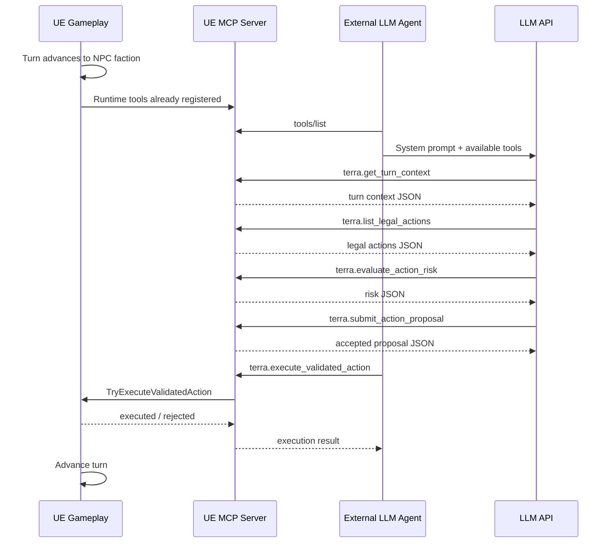

# A3 外部 LLM Agent 驱动 NPC 执行闭环设计稿

日期：2026-07-08

## 目标

A1 已经验证 UE Runtime 能启动 MCP server，并注册 `terra.ping_gameplay`。

A2 已经验证外部 MCP client 可以查询 Gameplay 的确定性信息：

- 当前回合上下文
- 当前阵营合法行动
- 候选行动风险
- 行动 proposal 校验

A3 的目标是把这些只读查询推进到一个可验证的 NPC 行动闭环：

```text
UE Gameplay 轮到 NPC
  -> 外部 LLM agent 连接 UE MCP server
  -> agent 调 MCP tools 查询局势和合法行动
  -> agent 选择一个行动 proposal
  -> UE Gameplay 再次校验 proposal
  -> UE 执行行动并推进回合
  -> 记录 AI decision log
  -> 超时/非法时 fallback
```

本阶段的重点不是让 AI 很聪明，而是让“LLM 通过 MCP 工具驱动一个 NPC 合法行动”这件事可运行、可复盘、可失败恢复。

## 先解释几个概念

### MCP Server

MCP server 是 UE 游戏进程里开的一个本地 HTTP 服务。

在本项目中，UE 启动后会监听类似：

```text
http://127.0.0.1:8765/terra-npc-mcp
```

它提供一组工具，例如：

```text
terra.get_turn_context
terra.list_legal_actions
terra.evaluate_action_risk
terra.submit_action_proposal
```

外部程序不能直接改 UE 内存，只能通过这些工具请求 UE 返回结构化 JSON 或提交 proposal。

### MCP Client

MCP client 是连接 MCP server 的程序。

MCP Inspector 就是一个人工调试用 client。你在 Inspector 里点按钮调用 tool，本质上就是一个 MCP client 在发请求。

A3 里需要一个自动化 client，也就是外部 LLM agent。

### 外部 LLM Agent

外部 LLM agent 是一个单独进程，负责：

1. 连接 UE MCP server。
2. 把可用 tools 暴露给大语言模型。
3. 让模型按提示词调用 tools。
4. 收集 tool 结果。
5. 最后输出一个行动 proposal。

它可以是：

- 一个 Python 脚本。
- 一个 Node.js 脚本。
- 一个桌面 companion app。
- 一个以后集成 OpenAI / Claude / 本地模型的后台服务。

A3 建议先做最简单的 Node.js 或 Python companion 进程，不要一开始嵌进 UE。

### 为什么 LLM Agent 放在 UE 外部

原因：

- UE Runtime 只负责权威规则和执行。
- LLM SDK、API key、网络请求、重试、模型版本都放在外部进程，更容易迭代。
- UE 只暴露安全白名单 tools。
- 后续换模型不需要改 Gameplay。

## A3 最小闭环

A3 不追求完整外交、长期记忆、多 NPC 并行。只做一个 NPC 回合：

```text
当前 faction 是 NPC
  -> agent 查询当前局势
  -> agent 查询所有合法行动
  -> agent 评估少量候选风险
  -> agent 提交一个 proposal
  -> UE 校验并执行
```

如果 agent 超时或返回非法 proposal：

```text
UE 使用 deterministic fallback 行动
```

## 总体架构



注意：上图里 `terra.execute_validated_action` 是 A3 新增工具。A2 的 `submit_action_proposal` 只校验不执行。

## A3 新增 UE 能力

### 1. Gameplay 执行 API

A3 需要在 `FTerraGameplayContainer` 增加 public 执行 API：

```cpp
struct FValidatedActionExecutionResult
{
    bool bAccepted = false;
    bool bExecuted = false;
    FString RejectReason;
    int32 TurnIndexBefore = INDEX_NONE;
    int32 TurnIndexAfter = INDEX_NONE;
    int32 FactionIdBefore = INDEX_NONE;
    int32 FactionIdAfter = INDEX_NONE;
    int32 PieceId = INDEX_NONE;
    int32 FromCellId = INDEX_NONE;
    int32 ToCellId = INDEX_NONE;
    bool bWasJump = false;
    TArray<FTerraGameplayCaptureEntry> CaptureEntries;
    TArray<int32> DirtyCellIds;
};

bool TryExecuteValidatedAction(
    int32 ExpectedTurnIndex,
    int32 ExpectedFactionId,
    int32 PieceId,
    int32 ToCellId,
    FValidatedActionExecutionResult& OutResult);
```

参数中必须带：

- `ExpectedTurnIndex`
- `ExpectedFactionId`
- `PieceId`
- `ToCellId`

原因：LLM agent 决策是异步的。它看到 snapshot 时是第 10 回合，不代表执行时仍然是第 10 回合。UE 执行前必须确认 snapshot 没过期。

### 2. 执行方式

第一版可以复用现有点击状态机：

```text
TryExecuteValidatedAction
  -> IsCurrentFactionLegalAction(PieceId, ToCellId)
  -> TryGetPieceCellId(PieceId, FromCellId)
  -> HandleCellClick(FromCellId)
  -> HandleCellClick(ToCellId)
  -> HandleCellClick(ToCellId)  // 结束当前行动
```

这样实现最快，因为已有逻辑会处理：

- 选择棋子
- 普通移动
- 跳跃移动
- 吃子锁定
- 结束回合
- 胜负判断
- action log
- dirty cell

限制：

- A3 只执行单段行动。
- 如果后续要让骑兵连续跳多段，需要扩展 proposal schema，支持 path。

中期可以改成纯规则执行 API，避免依赖 UI click 状态机。但 A3 为了闭环验证，可以先复用。

### 3. 新增 MCP Tool：`terra.execute_validated_action`

输入：

```json
{
  "expected_turn_index": 10,
  "expected_faction_id": 7,
  "piece_id": 31,
  "to_cell_id": 428
}
```

输出：

```json
{
  "ok": true,
  "accepted": true,
  "executed": true,
  "turn_index_before": 10,
  "turn_index_after": 11,
  "faction_id_before": 7,
  "faction_id_after": 8,
  "piece_id": 31,
  "from_cell_id": 421,
  "to_cell_id": 428,
  "was_jump": false,
  "capture_count": 0,
  "captures": []
}
```

非法或过期：

```json
{
  "ok": true,
  "accepted": false,
  "executed": false,
  "reject_reason": "snapshot_mismatch"
}
```

常见 reject reason：

- `gameplay_unavailable`
- `match_ended`
- `not_idle`
- `snapshot_mismatch`
- `not_current_faction_action`
- `select_failed`
- `move_failed`
- `end_turn_failed`

### 4. A2 的 `submit_action_proposal` 是否保留

保留。

A3 建议流程是：

```text
submit_action_proposal: 只校验，适合 LLM 最终确认
execute_validated_action: 执行，适合 agent 或 UE orchestration 调用
```

也就是说，不建议让模型随便直接执行。更稳的是：

1. 模型先 submit proposal。
2. agent 看到 `accepted=true`。
3. agent 再调用 execute。

以后如果需要更强安全边界，可以让 `execute_validated_action` 只由非 LLM orchestration 调用，不暴露给模型自由选择。

## 外部 Agent 的实现方式

### 方案 A：手写脚本驱动，暂时不用 LLM

这是 A3 推荐的第一步。

先写一个脚本模拟 agent：

```text
connect MCP
call get_turn_context
call list_legal_actions
choose actions[0]
call evaluate_action_risk
call submit_action_proposal
call execute_validated_action
```

优点：

- 不需要 API key。
- 不需要模型。
- 可以先验证 UE MCP 执行闭环。
- 排查问题简单。

这个脚本就是“假 LLM agent”，用来证明 MCP tool 和 UE 执行没问题。

### 方案 B：LLM 只做选择，不直接执行

第二步再接 LLM：

```text
agent 查询 tools
agent 把工具结果给 LLM
LLM 输出 { piece_id, to_cell_id, reason }
agent 调 submit_action_proposal
agent 调 execute_validated_action
```

这个方式更安全，因为执行调用在 agent 程序里，不是模型随意调用。

### 方案 C：LLM 使用 MCP tool calling

第三步再让 LLM 自己通过 MCP tools 思考：

```text
LLM -> get_turn_context
LLM -> list_legal_actions
LLM -> evaluate_action_risk
LLM -> submit_action_proposal
agent -> execute_validated_action
```

这最接近最终设想，但调试复杂度也最高。

A3 建议按 A -> B -> C 分步实现。

## Agent 提示词模板

第一版可以非常短：

```text
你是一个战棋 NPC 决策器。

规则：
1. 不要自己推导合法走法，只能使用工具返回的合法行动。
2. 先调用 terra.get_turn_context。
3. 再调用 terra.list_legal_actions。
4. 选择最多 3 个候选行动调用 terra.evaluate_action_risk。
5. 优先选择能吃子且目的地不受威胁的行动。
6. 如果没有安全吃子，选择不受威胁的普通行动。
7. 最后调用 terra.submit_action_proposal。
8. 只输出一个 proposal，不要输出多个行动。
```

模型最终应该给 agent 一个结构化结果：

```json
{
  "piece_id": 31,
  "to_cell_id": 428,
  "reason": "capture_count=1 and destination_threatened=false"
}
```

## Agent 与 UE 的两种触发方式

### 方式 1：外部 agent 轮询 UE

agent 每隔一段时间调用：

```text
terra.get_turn_context
```

如果发现当前 faction 是 NPC，就开始决策。

优点：

- UE 端改动少。
- 实现快。

缺点：

- 需要外部进程一直跑。
- 可能重复触发同一回合，需要用 `turn_index + faction_id` 去重。

### 方式 2：UE 触发外部 agent

UE 回合切到 NPC 后，通知外部 agent。

可选方式：

- 本地 HTTP 请求。
- WebSocket。
- 启动子进程。
- 写入本地队列文件。

优点：

- 触发准确。

缺点：

- UE 端要多做一套 outbound 通信。

A3 推荐先用方式 1：agent 轮询。等闭环稳定后再考虑 UE 主动触发。

## 超时与 fallback

A3 必须有 fallback。不要让玩家等待 LLM 无限思考。

建议预算：

```text
单个 NPC 决策总预算：5 秒
单个 tool call 超时：1 秒
LLM 调用超时：3 秒
非法 proposal 重试：最多 1 次
```

fallback 规则：

```text
1. 调 terra.list_legal_actions
2. 优先选择 capture_count 最大的行动
3. 如果并列，选 destination_threatened=false 的行动
4. 如果仍并列，按 piece_id、to_cell_id 排序取第一个
5. 调 terra.execute_validated_action
```

fallback 可以放在外部 agent，也可以后续放在 UE 内部。A3 推荐先放 agent，UE 端只提供工具和 validator。

## Decision Log

A3 需要记录每次 NPC 决策，否则很难复盘。

建议记录 JSONL，每个 NPC 行动一行：

```json
{
  "timestamp": "2026-07-08T12:00:00Z",
  "turn_index": 10,
  "faction_id": 7,
  "agent_version": "a3-node-agent-001",
  "prompt_version": "a3-basic-001",
  "tool_calls": [
    "terra.get_turn_context",
    "terra.list_legal_actions",
    "terra.evaluate_action_risk",
    "terra.submit_action_proposal",
    "terra.execute_validated_action"
  ],
  "proposal": {
    "piece_id": 31,
    "to_cell_id": 428
  },
  "accepted": true,
  "executed": true,
  "fallback": false,
  "reject_reason": ""
}
```

日志可以先由外部 agent 写。UE 端后续也可以写权威执行日志。

## A3 实现步骤

### 第 1 步：UE 增加执行 API

在 `FTerraGameplayContainer` 增加：

```cpp
TryExecuteValidatedAction(...)
```

要求：

- 校验 `ExpectedTurnIndex`。
- 校验 `ExpectedFactionId`。
- 校验当前 `InteractionPhase == Idle`。
- 校验 `PieceId + ToCellId` 是当前阵营合法行动。
- 执行后返回详细 result。

### 第 2 步：MCP 增加执行工具

在 `NpcMcp` 增加：

```text
terra.execute_validated_action
```

要求：

- 严格 input schema。
- 二次参数校验。
- 调 Gameplay 执行 API。
- structuredContent 返回执行结果。

### 第 3 步：写无 LLM 的 agent 脚本

先做 deterministic agent：

```text
list actions
choose first or best capture
execute
```

目标是验证 UE 端执行闭环。

### 第 4 步：接入 LLM 选择

agent 调 tools 获取 JSON，然后让 LLM 只选择：

```json
{
  "piece_id": 31,
  "to_cell_id": 428
}
```

agent 负责执行。

### 第 5 步：加入 fallback 和日志

任何失败都必须落到 fallback：

- MCP 连接失败
- tool 超时
- LLM 超时
- proposal 非法
- 执行失败

## A3 验收

### 手工验收

1. 启动 UE MCP server。
2. MCP Inspector 里调用 `terra.list_legal_actions`。
3. 复制一个合法 action。
4. 调 `terra.execute_validated_action`。
5. 观察棋子移动、回合推进。

### 脚本验收

1. 启动外部 deterministic agent。
2. agent 自动连接 UE MCP server。
3. agent 自动执行一个 NPC 行动。
4. UE 日志显示回合推进。
5. agent 写一条 decision log。

### LLM 验收

1. agent 使用 LLM 选择行动。
2. LLM 至少调用或消费以下信息：
   - turn context
   - legal actions
   - risk result
3. 最终 action 被 UE 接受并执行。
4. 如果 LLM 输出非法 action，agent fallback 成功执行。

## A3 不做什么

A3 不做：

- 长期阵营记忆。
- 多 NPC 并行决策。
- 外交对话。
- 连续跳跃完整路径规划。
- 复杂战略评分。
- 把 API key 放进 UE。
- 让 LLM 绕过 Gameplay validator。

这些放到后续阶段。

## 风险点

### 1. Snapshot 过期

解决：

- execute 输入必须带 `expected_turn_index` 和 `expected_faction_id`。
- UE 执行前再次校验。

### 2. LLM 输出非法行动

解决：

- proposal 必须走 `submit_action_proposal`。
- execute 再次调用 Gameplay validator。
- 失败 fallback。

### 3. 重复执行同一回合

解决：

- agent 记录最近处理过的 `(turn_index, faction_id)`。
- execute 后确认 `turn_index_after` 已变化。

### 4. UE 正在玩家交互中

解决：

- `InteractionPhase != Idle` 时拒绝执行。
- NPC agent 只在 NPC 回合启用。

### 5. Tool 暴露过多

解决：

- 只注册白名单工具。
- 不暴露文件系统、console command、任意 UObject 操作。
- tool 输入 schema 严格。

## 推荐 A3 最小交付

最小交付只需要：

1. `TryExecuteValidatedAction`。
2. `terra.execute_validated_action`。
3. 一个 deterministic 外部 agent 脚本。
4. decision log。
5. 文档化 Inspector 和脚本验收步骤。

LLM 接入可以作为 A3 的第二小步，但设计上先把接口留好。
