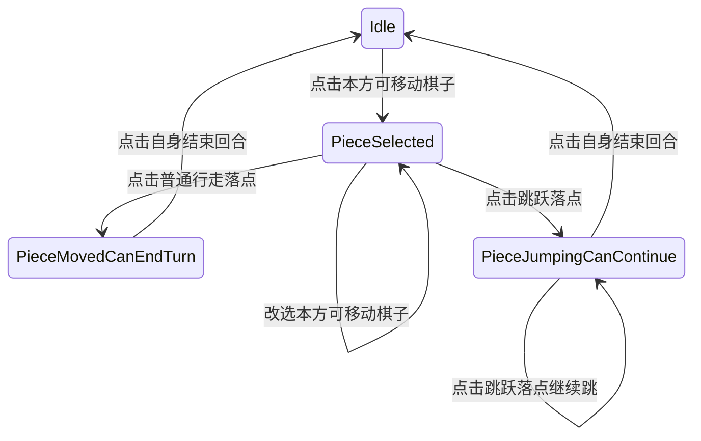

# TerraCivilization SimpleGameplay G3 跳跃与连跳设计稿

> 本稿承接 G2 / G2.5：`Gameplay` 模块已经负责棋子、Cell 逻辑、普通移动、回合结束、当前阵营棋子提示和相机辅助。
>
> G3 目标是在不引入吃子结算的前提下，实现“选择棋子后显示下一步落点”“行走后结束回合”“跳跃后可继续跳跃或主动停下”。

---

## 1. G3 目标

本阶段新增：

1. **回合开始高亮逻辑调整**
   - 回合开始时，当前玩家所有棋子仍显示 G2.5 淡粉色。
   - 一旦玩家选择本方可移动棋子，其余本方棋子立即失去淡粉色高亮。
   - 被选中的棋子脚下 Cell 保持 G2 黄色。

2. **选择后显示下一步落点**
   - 选择本方可移动棋子后，计算它所有可能的下一步落点。
   - 下一步落点包括：
     - 普通行走落点：相邻空 Cell。
     - 跳跃落点：越过相邻棋子后的空 Cell。
     - 骑兵特殊跳跃落点：越过相邻棋子后再多前进 1 格的空 Cell。
   - 所有下一步落点使用淡蓝色高亮。
   - hover 到淡蓝落点时，淡蓝色加深。

3. **行走后只能停下**
   - 点击普通行走落点后，棋子移动到目标 Cell。
   - 移动后的脚下 Cell 使用 G2 蓝色，表示“可以停下”。
   - 行走后不能继续移动，也不能跳跃。
   - 再次点击自身所在蓝色 Cell，结束回合。

4. **跳跃后可继续跳跃**
   - 点击跳跃落点后，棋子跳到目标 Cell。
   - 跳跃后只能继续跳跃，不能再行走。
   - 每次跳跃后重新计算该棋子从新位置出发的所有下一步跳跃落点，并持续用淡蓝色高亮。
   - 连跳时不能往上一跳原路来的方向反跳回去，即下一次跳跃落点不能是上一跳起点 Cell。
   - 玩家点击自身所在黄色 Cell 时，表示放弃继续跳跃并结束回合。
   - 如果没有可继续跳跃落点，仍由玩家点击自身结束回合；本阶段不自动结束回合。

5. **Debug：固定当前玩家回合**
   - 暴露一个编辑器选项。
   - 开启后，回合结束仍会增加 `TurnIndex`，但 `CurrentFactionId` 不前进。
   - 用于反复调试同一玩家的移动 / 跳跃。

---

## 2. 交互阶段状态机

G3 后 `ETerraGameplayInteractionPhase` 扩展为：

| 阶段 | 含义 | 允许点击 |
| --- | --- | --- |
| `Idle` | 当前玩家尚未选择棋子 | 点击本方可移动棋子进行选择 |
| `PieceSelected` | 已选择棋子，尚未行动 | 点击普通行走落点 / 跳跃落点；也允许改选本方可移动棋子 |
| `PieceMovedCanEndTurn` | 已普通行走 1 格 | 只能点击自身所在 Cell 结束回合 |
| `PieceJumpingCanContinue` | 已至少跳跃 1 次 | 点击跳跃落点继续跳；点击自身所在 Cell 结束回合 |

状态流：



---

## 3. 高亮优先级

G3 后同一个 Cell 可能有以下高亮来源：

| 优先级 | 来源 | 颜色 |
| --- | --- | --- |
| 450 | G3 可跳跃 / 可行走落点 hover | 深淡蓝 `(0.08, 0.45, 1.0)` |
| 400 | G2 行走后可停下 | 蓝色 `(0, 0.35, 1)` |
| 350 | G2/G3 选中棋子脚下 | 黄色 `(1, 1, 0)` |
| 300 | G3 可行走 / 可跳跃落点 | 淡蓝色 `(0.35, 0.80, 1.0)` |
| 200 | G2.5 hover 当前阵营棋子 | 红粉色 `(1, 0.22, 0.32)` |
| 150 | G2.5 回合开始当前阵营棋子底色 | 淡粉色 `(1, 0.45, 0.68)` |
| 100 | 普通 hover | 暖金色 |

关键规则：

- `GameplayHighlights` 仍负责 G2/G3 行动高亮：黄色、蓝色、淡蓝落点。
- 当前阵营棋子淡粉色仅在 `Idle` 阶段由渲染桥动态合成。
- 进入 `PieceSelected` 后，`IsCurrentFactionPieceCell` 对渲染桥返回 false，使其余棋子失去淡粉色。
- 淡蓝落点 hover 加深由渲染桥基于 Gameplay 的 `IsCurrentActionTargetCell(CellId)` 判断。

---

## 4. 移动与跳跃判定

### 4.1 普通行走

普通行走落点要求：

- 目标 Cell 是当前 Cell 的邻居。
- 目标 Cell 为空。
- 目标地形允许该棋子进入。
- 当前阶段必须是 `PieceSelected`。

地形限制：

- 步兵 / 弓兵可进入平原、森林、山脉。
- 骑兵不可进入山脉。
- 主将不可移动。

### 4.2 标准跳跃

从起点 `From` 出发，遍历每个相邻 Cell `Middle`：

- `Middle` 必须有棋子，友方 / 敌方均可。
- 沿 `From -> Middle` 的方向继续前进。
- 后方第 1 个 Cell 必须为空，且地形允许进入。
- 该后方第 1 个 Cell 是标准跳跃落点。

跳跃本身不吃子，被跳过的棋子不会移除。

### 4.3 骑兵特殊跳跃

骑兵除标准跳跃外，还可以落到后方第 2 个空 Cell：

- `Middle` 必须有棋子。
- 后方第 1 个 Cell 必须为空。
- 后方第 2 个 Cell 必须为空。
- 后方第 1 个 Cell 与第 2 个 Cell 都不能是山脉。
- 后方第 2 个 Cell 是骑兵特殊跳跃落点。

同时，骑兵不可跳跃跨过山脉：

- `Middle` 所在 Cell 如果是山脉，则本方向的骑兵跳跃无效。

### 4.4 五边形分叉直线

G3 使用 `SimpleGameplayDesign.md` 中的分叉射线定义。

给定相邻两个 Cell：

```text
Prev -> Cur
```

继续向前：

- 如果 `Cur` 是六边形：取 `Prev` 的对向邻居 `(Index + 3) % 6`。
- 如果 `Cur` 是五边形：取两个对向候选 `(Index + 2) % 5` 和 `(Index + 3) % 5`。

因此跳跃经过五边形时，可能产生多个合法落点。

---

## 5. Gameplay 容器新增数据

`FTerraGameplayContainer` 新增：

```cpp
TSet<int32> OrdinaryMoveTargetCellIds;
TSet<int32> JumpTargetCellIds;
int32 LastJumpStartCellId = INDEX_NONE;
bool bDebugKeepSameFactionOnEndTurn = false;
```

新增只读接口：

```cpp
bool IsCurrentActionTargetCell(int32 CellId) const;
```

新增控制接口：

```cpp
void SetDebugKeepSameFactionOnEndTurn(bool bInKeepSameFaction);
```

---

## 6. Gameplay 容器内部服务

新增内部 helper：

| Helper | 职责 |
| --- | --- |
| `CanEnterTerrain_` | 判断棋子能否进入目标地形 |
| `StepForwardBranches_` | 实现六边形唯一前进 / 五边形二分叉 |
| `CollectOrdinaryMoveTargets_` | 收集普通行走落点 |
| `CollectJumpTargets_` | 收集标准跳跃与骑兵特殊跳跃落点 |
| `RefreshSelectedPieceHighlights_` | 写黄色选中 Cell + 淡蓝落点 Cell |
| `TryMoveSelectedPieceToOrdinaryTarget_` | 执行普通行走并进入 `PieceMovedCanEndTurn` |
| `TryJumpSelectedPieceTo_` | 执行跳跃并进入 / 保持 `PieceJumpingCanContinue` |
| `EndTurnFromSelectedPiece_` | 点击自身结束回合 |

---

## 7. 渲染桥调整

`APlanetTessellatedMesh` 新增编辑器选项：

```cpp
UPROPERTY(EditAnywhere, BlueprintReadWrite, Category="PlanetTopology|Tess|SimpleGameplay G3|Debug")
bool bG3DebugKeepSameFactionOnEndTurn = false;
```

每次点击前同步给 Gameplay 容器：

```cpp
GameplayContainer->SetDebugKeepSameFactionOnEndTurn(bG3DebugKeepSameFactionOnEndTurn);
```

高亮合成调整：

- 如果 `GameplayHighlights` 有淡蓝落点，且当前 Cell 是 hover Cell，则改用深淡蓝色显示。
- 如果处于非 `Idle` 阶段，当前阵营棋子淡粉色不显示。

---

## 8. 验收清单

### 8.1 回合开始

- 当前玩家所有棋子显示淡粉色。
- 摄像机仍按 G2.5 切到当前阵营大本营上方。

### 8.2 选择

- 点击本方可移动棋子：
  - 被选棋子脚下显示黄色。
  - 其余本方棋子的淡粉色消失。
  - 所有可行走 / 可跳跃下一步落点显示淡蓝色。
- hover 淡蓝落点时，淡蓝色加深。

### 8.3 行走

- 点击淡蓝色普通行走落点后，棋子移动 1 格。
- 新脚下 Cell 显示蓝色。
- 不能继续行走或跳跃。
- 点击自身蓝色 Cell 后结束回合。

### 8.4 跳跃 / 连跳

- 点击淡蓝色跳跃落点后，棋子跳跃过去。
- 新脚下 Cell 显示黄色。
- 只显示后续可跳跃落点，不显示普通行走落点。
- 上一跳的起点不会作为后续跳跃落点高亮，不能原路反跳回去。
- 可以继续点击跳跃落点连跳。
- 点击自身黄色 Cell 后结束回合。

### 8.5 Debug 固定玩家

- 开启 `bG3DebugKeepSameFactionOnEndTurn` 后，结束回合时 `TurnIndex` 增加，但 `CurrentFactionId` 不变。
- 关闭该选项后，结束回合恢复到下一个存活阵营。


