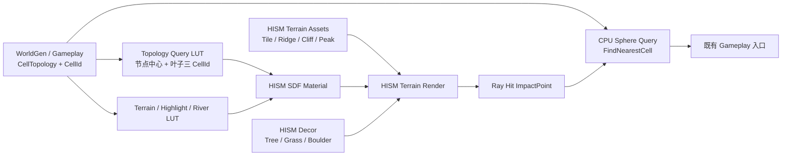

# SimpleGameplay HISM + SDF 地形视觉表现设计稿

> 状态：SV6-B 验证通过后的后续主线设计。编码：UTF-8，简体中文。
>
> 本文独立于 [SimpleGameplayTerrainVisualPresentationDesign.md](SimpleGameplayTerrainVisualPresentationDesign.md)。后者记录连续基础网格路线，保留为已实现的历史方案与对照模式；自本文建立起，新的地形视觉迭代以 HISM + SDF 径向投影为准，不再继续维护连续基础表面网格。

## 1. 定位

本路线的地形几何从网格拓扑上仍是离散的 HISM Static Mesh 实例，但以三个共同规则获得连续的视觉语义：

```text
自然遮挡的高密度 HISM 几何
        +
按球面方向采样的统一 SDF 材质场
        +
按空间位置投影的统一 Cell 查询
        =
视觉、地形类别、水体和高亮连续的球面地形
```

它不试图焊接不同 Static Mesh 的顶点，也不要求运行时 Dynamic Mesh 或连续地表碰撞代理。颜色、纹理相位、水文和 Cell 归属的连续性由“同一球面方向得到同一材质、同一水文、同一 Cell 归属”保证；法线连续性还依赖资产本身的基础法线契约，不能只归因于 SDF 材质。

SV6-B 已证明当前 Plain/Forest/Mountain Tile HISM 可以使用径向投影 SDF 材质获得连续的地貌颜色、纹理相位、粗糙度、河网和高亮。SV7 之后把它从实验模式演进为正式 HISM 地形视觉主线。

### 1.1 法线连续性的资产前置条件

当前 HISM + SDF 方案在接缝处保持法线融合的根本原因，是所有承担地形外壳的 StaticMesh 资产都显式保存了相同的径向顶点法线。它们虽然具有不同的位移轮廓、三角形密度和自然遮挡关系，但在同一球面方向处的基础法线方向一致。

材质的职责是：以径向投影获得连续的 SDF 分类、三平面纹理和法线细节场，并在 `TerrainVisualNormalStrength=0` 时退化到网格保存的基础顶点法线。它不会绕过 Tangent Space Normal 管线，直接把任意 HISM 网格的最终世界法线改写成连续径向法线。

因此，接缝无缝的必要条件是：

1. 相邻或相互遮挡的地形资产在接缝附近必须保存相同的基础法线方向；本项目统一为未位移球面的径向方向。
2. Ridge、Peak、Cliff 和后续所有地形外壳资产必须保留 Primary Normal Overlay，StaticMesh Build 禁止重算几何法线，仅可依据该法线和 UV 重算切线。
3. 各资产以轻微下埋、压边和底裙相互遮挡时，露出的重叠边缘同时具有相同的径向基础法线，SDF 的连续高频法线才能自然延续过去。

这也定义了本路线的适用边界：它不是可直接套用于任意大世界地形的通用方案。若资产接缝两边必须保留彼此不同的真实几何法线，例如陡峭悬崖、洞穴入口、道路模型或任意独立大世界地形块，单靠径向投影 SDF 和简单遮挡无法消除受光、阴影、AO 与法线断裂；需要连续网格、专门的边界法线/切线处理，或额外的材质混合与过渡几何。

## 2. 不变契约

| 项目 | 固定决策 |
| --- | --- |
| Gameplay 身份 | `CellId` 是回合、棋子、选中和规则的唯一身份。 |
| 逻辑拓扑 | 保持 `CellTopology`，默认 `CellSubdivisionLevel=3`、642 个 Cell。 |
| 渲染拓扑 | 由可 Nanite 的 HISM Static Mesh 实例组成；不要求各实例拓扑连续。 |
| 共同空间 | `Dir = normalize(WorldPosition - PlanetCenter)` 是交互、Cell 查询、材质、河网和高亮的共同坐标。 |
| Cell 查询 | 所有地表命中都按 `ImpactPoint -> Dir -> FSphereTopologyQuery::FindNearestCell` 解析，禁止由 HISM InstanceId 直接决定 CellId。 |
| 地面命中 | 承担地形外壳的 HISM 使用 `QueryOnly`；树、草、碎石等独立装饰默认 `NoCollision` 且忽略 `Visibility`。 |
| 材质 | 地形外壳和跨 Cell 山地实例共享 HISM + SDF 地形材质函数；独立装饰可用专用材质。 |
| 基础顶点法线 | 所有地形外壳 StaticMesh 统一保存位移前球面径向法线；不得烘焙各资产的最终几何斜率法线。 |
| 旧连续网格 | 保留 `ContinuousSurface` 作为 Debug/历史对照，不再添加新功能，也不承担新主线运行时职责。 |

棋子的精确高度仍由当前 HISM 地形外壳射线流程得到。后续若地形资产跨 Cell 或增加高峰，射线命中可不再要求“命中实例所属 Cell 等于目标 Cell”，而是以采样方向和命中半径的稳定规则选取地表；这不改变 Gameplay CellId。

## 3. 运行时架构



系统分为两类 HISM：

| 类别 | 例子 | 材质与交互职责 |
| --- | --- | --- |
| 地形外壳 HISM | 平原/森林基础块、山脊、崖壁、尖峰、跨 Cell 山体模块 | 共享 SDF 地形材质；可阻挡地表射线；命中按空间方向查询 Cell。 |
| 独立装饰 HISM | 树、草、石头、木桩、小型碎石 | 独立 PBR 或轻量地表材质；通常无碰撞；不参与地面 Cell 命中。 |

## 4. SV6-B 已实现基线

[SV6B_HISMSDFExperimentDesign.md](SV6B_HISMSDFExperimentDesign.md) 是本路线的起点。它已提供：

- `HISMSDFExperiment` 模式与三种旧 Tile HISM 的共享 MID 注入。
- 径向投影坐标 `Dir`、`ProjectionWorldPos`、`ProjectionNormalWS`。
- `SurfaceCellDirectionLUT`、`SurfaceTerrainLUT`、`SurfaceHighlightLUT`、河网 LUT 和 SV6-A PBR 参数复用。
- Owner Cell + 六邻居的 PICD 候选集合，用于当前“每 Cell 一个 Tile”的局部材质查询。

SV6-B 的 Owner/Neighbor 只是一项实验期局部加速数据；它不能覆盖任意跨越多 Cell 的山脊、崖壁和尖峰，因此 SV8 后不得作为正式地形材质的 Cell 查找依据。

## 5. 子里程碑

### SV7：空间投影交互与高亮迁移

目标：让点击与 hover 的 Cell 归属完全脱离 HISM 实例身份，为任意跨 Cell 地形实例建立正确交互语义。

实现：

1. 新增统一入口 `ResolveTerrainCellFromWorldPosition(WorldPosition)`：

   ```text
   Local = ActorTransform.InverseTransformPosition(WorldPosition)
   Dir   = normalize(Local)
   CellId = FSphereTopologyQuery(CellTopology).FindNearestCell(Dir).CellId
   ```

2. HISM 鼠标命中只提供 `ImpactPoint`；`Hit.Item`、HISM Component 和所属资产类型只用于诊断，不再参与 CellId 判断。
3. hover、点击、行动目标、吃子预览统一写入 `SurfaceHighlightLUT`，并由 HISM SDF 材质基于空间位置绘制边界和状态色。
4. 旧 PICD `0..3` 实例高亮保留为 `LegacyHISMDebug` 对照；正式 HISM + SDF 模式关闭其 Emissive 路径。
5. 地形外壳 HISM 保持 `ECC_Visibility` Query；独立装饰忽略该通道，避免树、草、小岩块抢走地面命中。

验收：跨 Cell 山脊/崖壁上任意可点击位置按其投影方向得到正确 CellId；高亮边界跨不同实例连续；棋子移动、吃子和 UI 行为不变。

### SV8：GPU 球面拓扑查询 LUT

> 状态：C++ 已完成，待 SV8 材质验收。

目标：在材质中精确复现 `FSphereTopologyQuery::FindNearestCell` 的球面三角树决策，去除地形 HISM 对 Owner/Neighbor PICD 的依赖。

CPU 查询的真实算法是：

```text
UnitDirection
  -> 在 20 个 Root Center 中取最大 dot
  -> 每一层在 4 个 Child Center 中取最大 dot
  -> 叶节点的 3 个 CellId 中取最大 dot
```

GPU 资源设计：

| 资源 | 内容 | 格式与更新 |
| --- | --- | --- |
| `SurfaceTopologyNodeCenterLUT` | 按层宽度优先展平的 TriTree Node `Center.xyz` | `PF_A32B32G32R32F`，拓扑重建时创建。 |
| `SurfaceTopologyLeafCellLUT` | 每个叶节点的 `CellIds[0..2]`，存为三个精确整数 float | `PF_A32B32G32R32F`，拓扑重建时创建。 |
| `TopologySubdivisionLevel` | CellTopology 细分层级 | Scalar。 |
| `TopologyRootCount` | 固定 20 | Scalar/常量。 |
| `TopologyNodeLevelOffsetLUT` | 每层首节点偏移；可由 HLSL 公式计算，必要时单独上传 | 可选。 |

节点序列化必须与 `FSphereTopology::TriTreeRoots` 的根顺序和 `Children[0..3]` 顺序完全一致。对于第 `L` 层，本层局部索引为 `LocalIndex`，其四个子节点局部索引为 `LocalIndex * 4 + ChildIndex`；层偏移为：

```text
LevelOffset(L) = 20 * (4^L - 1) / 3
```

材质 Custom 实现同样的 root/child `dot` 比较，并从叶 LUT 得到三个 CellId。该三个 CellId 不仅用于取得最近 Cell，也直接成为 Plain/Forest/Mountain one-hot 混合、高亮边界、河网叠加的统一 SDF 上下文。

性能约束：`CellSubdivisionLevel=3` 时材质只做 `20 + 3*4 + 3` 次 dot/LUT 判断，远低于全量扫描 642 个 Cell。SV8 禁止在像素 shader 中遍历全 Cell 数组。

兼容规则：

- CPU 的点击/hover 始终调用真实 `FSphereTopologyQuery`，不以 GPU LUT 结果回传 CPU。
- GPU LUT 只用于材质；每次拓扑重建后与 CPU 随机方向采样交叉验证，要求 CellId 与叶子三元组一致。
- SV8 完成后，地形外壳 HISM 不再需要 PICD `4..10`；该区间可以留给资产类型、局部材质变体和未来 Decor 数据。

验收：任意跨 Cell HISM 表面按世界方向得到与 CPU `FindNearestCell` 相同的 CellId；材质不读取 Owner/Neighbor；不同资产在同一位置的地形类别和高亮边界一致。

### SV9：多种 HISM 地形资产生成与摆放

> 状态：C++ 与编辑器生成器已完成，待 Ridge/Peak 资产生成后的编辑器视觉验收。

目标：让离散 HISM 几何提供连续山脉、森林与平原的近中景轮廓，而非只把原有三种 Tile 换材质。

资产生产本阶段改由 [SphericalTileAssetGeneratorDesign.md](SphericalTileAssetGeneratorDesign.md) 与 [TerraSphericalTileGenerator使用说明.md](TerraSphericalTileGenerator使用说明.md) 负责。运行时摆放与资产生成必须分离：插件离线生成 Nanite Static Mesh；游戏运行时只选择、变换和实例化资产，不生成 Static Mesh。旧 `TerraTerrainDecorGenerator` Ridge 资产不直接作为 SV9 球面资产使用。

首批资产族：

| 资产族 | 典型形态 | 摆放数据 |
| --- | --- | --- |
| 平原/森林基础块 | 缓起伏、岩土、树冠地表、地表裂隙 | Cell 方向、地形类型、稳定 seed。 |
| Ridge | 沿局部 X 延伸、Y 两侧落地的折起网格片 | MountainRidgeSegment 两端 Cell 的测地线中点与切线。 |
| Cliff/Fault | 层状崖壁、断层、侵蚀台阶 | 山脊侧向、局部坡向、链端或断裂节点。 |
| Peak | 当前为单个尖圆锥，外圈落地 | Mountain Cell 的稳定概率、邻接排斥和 Seed。 |
| 独立 Decor | 岩块、草、树、灌木 | Cell/方向、坡度、遮挡密度和 stable seed。 |

摆放规则：

1. `MountainRidgeSegments` 仍由 WorldGen/Gameplay 权威维护；不得由 Mountain Cell 位置反推。
2. 对每条球面弧按长度、链位置和 seed 选择多个 Ridge/Cliff 实例；实例局部 `+X` 对齐球面切线，`+Z` 对齐径向上方。
3. 资产底部必须具有 `SkirtDepthCM`，并沿径向轻微下埋，以自然遮挡隐藏接缝；禁止依赖碰撞或 Runtime Boolean 补洞。
4. 山脊链端、汇合、转折处分别用短 Ridge、Peak、断层资产处理，避免多个长条资产在同一点堆叠成黑块。
5. 同一稳定 seed、CellTopology、WorldGen 输出和资产表必须得到相同实例选择与 Transform；动态造山时仅重建受影响山脊链及其 Decor。
6. 地形外壳 HISM 可以跨多个 Cell；SV7/8 的空间投影查询与拓扑 LUT 保证交互和材质不依赖实例归属。

资产材质规则：山脊、崖壁、尖峰使用共享 SDF 地形材质函数及统一 Rock/Moss/Gravel 参数；自身 UV/VertexColor 仅用于端部融合、裂隙、积尘、苔藓和积雪遮罩，不能决定地形类别或 Cell 高亮。

SV9 本阶段验收：每条山脊段生成一个 Ridge，部分 Mountain Cell 生成 Peak；两者使用 SV8 LUT 材质；新增 HISM 的 Visibility 查询可驱动原 SV7 Hover/Click 空间投影；Gameplay、UI、棋子高度和旧 Debug 模式不变。尖峰积雪、山脊法线增强和河岸凹陷属于后续 SV10。

### SV10：HISM + SDF 材质细节与法线融合

目标：将“地形本身是什么”和“某件 HISM 几何长成什么样”分层，使 HISM 轮廓差异转化为可信的岩层、积雪、河岸与坡面受光，而不是材质断裂。

材质拆分为共享函数：

| 函数 | 输入 | 输出 |
| --- | --- | --- |
| `MF_SphericalTopologyLookup` | `Dir`、Topology Query LUT | 叶子三 CellId、Cell SDF 权重、Cell 边界距离。 |
| `MF_SphericalTerrainClassification` | 三 CellId、Terrain/Highlight LUT | Plain/Forest/Mountain 权重、高亮。 |
| `MF_RadialTriplanarPBR` | 径向投影坐标、统一纹理参数 | 连续 BaseColor、Roughness、基础法线。 |
| `MF_HISMAssetSurfaceMasks` | VertexColor、UV、实际 WorldNormal、半径 | 资产端部、顶面、裂隙、坡向、局部侵蚀遮罩。 |
| `MF_TerrainWaterAndSnow` | `Dir`、半径、坡度、资产遮罩、水文 LUT | 河流、湿润、河岸凹陷、积雪。 |

重点视觉规则：

- 山脉颜色继续以径向投影 SDF 为基底；真实 Mesh 法线只增强陡坡裸岩、受光和局部法线强度，不能重新定义 Cell 地形类别。
- 积雪基于球面方向、高程半径、朝向、坡度与 Peak/Ridge 顶面遮罩；雪线必须跨实例连续，顶面遮罩只决定局部保留与堆积差异。
- 河流位置由水文 SDF 决定；在地形外壳上通过沿河横向梯度构造切线空间凹陷法线，表现细小河槽和湿润河岸，而不改变实际碰撞高度。
- 通过 `AssetBlendMask` 让 Ridge/Cliff/Peak 的底部逐渐收敛到基础地表的颜色、粗糙度和 SDF 细节法线；所有资产仍先满足径向基础顶点法线契约，`AssetBlendMask` 不能修复基础法线方向不同的网格接缝。
- PBR 材质的三平面采样保持径向投影坐标，防止同一方向上不同高度/不同实例出现纹理相位跳变；最终光照仍响应真实 Mesh 几何法线。

验收：尖峰和崖顶有连续雪线；山脊的陡坡岩层受光更明确但不出现实例色差；河流在不同 Tile 和山体资产上连续，岸边具有可控凹陷感；材质效果不破坏点击、高亮和棋子表现。

## 6. 演进顺序与依赖

```text
SV6-B（已验证径向投影）
  -> SV7（空间投影交互 / LUT 高亮）
  -> SV8（GPU 拓扑树 LUT，移除 Owner+Neighbor）
  -> SV9（跨 Cell 多资产地形外壳）
  -> SV10（积雪、法线、河岸等材质细节）
```

SV7 可以先使用 CPU `FSphereTopologyQuery` 完成交互迁移；SV8 的 GPU LUT 是材质基础，必须在 SV9 跨 Cell 地形资产大规模加入前完成。SV10 依赖 SV8 的全局材质查询，但可与 SV9 后半段的资产扩充交错推进。

## 7. 主要风险与约束

| 风险 | 根因 | 控制方式 |
| --- | --- | --- |
| HISM 接缝仍可见 | 几何法线、深度、AO、阴影不连续，不是 SDF 颜色问题 | 控制资产底裙、重叠、轮廓与材质融合；以远中近景分别验收。 |
| `NormalStrength=0` 时资产仍显现各自坡面 | 新资产重算了最终几何法线，破坏共同基础法线契约 | 生成器显式写入径向 Normal Overlay，并关闭 StaticMesh 的法线重算；旧资产须重新生成。 |
| 装饰阻挡点击 | 树/草/碎石参与 Visibility Query | 独立 Decor 默认 `NoCollision`/Ignore Visibility；只有地形外壳可命中。 |
| 跨 Cell 山体点击错误 | 使用 InstanceId/Owner Cell 映射 | SV7 起只按 ImpactPoint 方向查询 CPU Topology。 |
| 材质跨 Cell 错误 | Owner+Neighbor 候选不覆盖资产 | SV8 使用拓扑树 LUT；禁止全量 Cell 像素循环。 |
| 水体爬上崖壁 | 水文按方向投影，未考虑可见几何姿态 | SV10 以坡度、资产类型和底部遮罩限制水体可见范围。 |
| Nanite 很快但 GPU 仍慢 | 河网循环、三平面纹理和高亮是像素成本 | 为 SDF 函数提供质量开关，统计 GPU Profile；不以增加几何密度解决材质成本。 |
| 动态造山难以保持稳定 | 资产随机、链路重建和旧实例残留 | 用 `CellId/RidgeSegmentId/DecorSlot/Seed` 稳定寻址，只局部重建受影响链路。 |

## 8. 结束条件

当 SV10 验收后，正式地形视觉应满足：

1. 球面由 HISM + Nanite 地形外壳完整覆盖，且可使用多种跨 Cell 山体资产。
2. 点击、hover、高亮、棋子与 UI 始终按空间方向映射到稳定 CellId，不依赖命中实例。
3. 材质从 GPU 拓扑 LUT 得到全局 Cell SDF，上层资产不需要 Owner/Neighbor 才能连续绘制地形类别、水体、积雪和高亮。
4. 离散网格的自然遮挡、资产底部融合和统一 SDF 材质共同将接缝控制在可接受范围。
5. `ContinuousSurface` 只保留为对照/回退模式；新地形视觉不再依赖其网格、碰撞或材质上下文。
