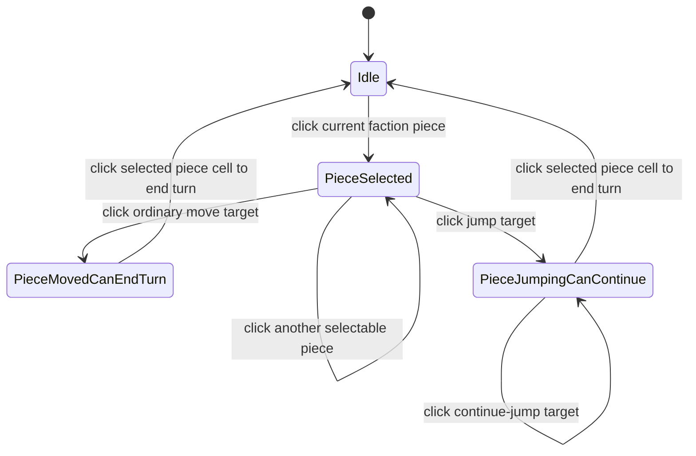

# L1 Interactive Tactical Review Tools 最小闭环设计稿

日期：2026-07-10

## 目标

L1 是 `LlmAgentStrategicInteractiveDesign.md` 中 Interactive Tactical Review Tools 的第一轮落地设计。

本阶段目标不是让 LLM 拥有完整战略能力，也不是直接推进 A3 手册中的 Step C。L1 只验证一个玩家可见的最小闭环：

```text
LLM Agent 像真人玩家一样开始回合观察
  -> 选中一个己方棋子
  -> 查看该棋子的可行动格和局部局势
  -> 点击一个目标格
  -> 查看点击后的局部结果
  -> 取消或确认
  -> 确认时结束当前已经 preview 到位的行动并推进回合
```

L1 的核心价值是把“操作即信息，信息即操作”的交互方式跑通，让后续战略语义工具、两回合战术工具、真正的 tool-calling Agent 有一个可见、可控、可验证的执行面。

## 当前实现约束

当前 UE 侧正在重构 `APlanetTessellatedMesh` 结构，并把各个逻辑部分拆成独立组件。因此本阶段先只实现设计稿，不直接修改 UE C++。

后续实现 C++ 时，需要先查询当时的真实接口位置，再决定落点：

```text
不要假设仍然由 APlanetTessellatedMesh 直接承载所有点击、高亮、同步逻辑。
不要凭记忆写跨组件访问字段。
实现前必须重新读取当前 header/cpp，确认 Gameplay、Selection、Highlight、Presentation、MCP Bridge 的边界。
```

本设计稿只说明实现思路、工具契约、状态机、数据结构和验收方式。

## 当前重构后交互源码位置

经查询，当前交互与 MCP 执行相关源码的真实位置如下：

1. Gameplay 权威交互状态机：
   - [Source/Gameplay/Public/TerraGameplayTypes.h](C:/workspace/TerraCivilization/Source/Gameplay/Public/TerraGameplayTypes.h)
   - [Source/Gameplay/Private/TerraGameplayContainer.cpp](C:/workspace/TerraCivilization/Source/Gameplay/Private/TerraGameplayContainer.cpp)
   - `FTerraGameplayContainer::HandleCellClick`
   - `TrySelectPieceAtCell_`
   - `TryMoveSelectedPieceToOrdinaryTarget_`
   - `TryJumpSelectedPieceTo_`
   - `TryEndTurnOnSelectedCell_`

2. 当前表现层点击入口与点击后同步逻辑：
   - [Source/TerraCivilization/Private/Render/PlanetGameplayComponent.cpp](C:/workspace/TerraCivilization/Source/TerraCivilization/Private/Render/PlanetGameplayComponent.cpp)
   - [Source/TerraCivilization/Public/Render/PlanetGameplayComponent.h](C:/workspace/TerraCivilization/Source/TerraCivilization/Public/Render/PlanetGameplayComponent.h)
   - `UPlanetGameplayComponent::HandleGameplayCellClick`
   - `UPlanetGameplayComponent::RefreshGameplayHighlights`
   - `UPlanetGameplayComponent::RefreshFactionPieceHighlights`
   - `UPlanetGameplayComponent::TryExecuteNpcMcpValidatedAction`

3. `APlanetTessellatedMesh` 当前主要作为转发层保留的入口：
   - [Source/TerraCivilization/Private/Render/PlanetTessellatedMesh.cpp](C:/workspace/TerraCivilization/Source/TerraCivilization/Private/Render/PlanetTessellatedMesh.cpp)
   - `APlanetTessellatedMesh::HandleGameplayCellClick_`
   - `APlanetTessellatedMesh::TryExecuteNpcMcpValidatedAction_`

4. 当前 NpcMcp 与 Gameplay 的桥接层：
   - [Source/NpcMcp/Public/TerraNpcMcpGameplayBridge.h](C:/workspace/TerraCivilization/Source/NpcMcp/Public/TerraNpcMcpGameplayBridge.h)
   - [Source/NpcMcp/Private/TerraNpcMcpGameplayBridge.cpp](C:/workspace/TerraCivilization/Source/NpcMcp/Private/TerraNpcMcpGameplayBridge.cpp)
   - 当前已存在：
     - GameplayContainer 注册
     - `execute_validated_action` delegate 注册

因此，L1 当前最自然的实现层次应为：

```text
Gameplay phase / rules:
  FTerraGameplayContainer

真实点击与表现同步:
  UPlanetGameplayComponent

MCP 窄桥:
  FTerraNpcMcpGameplayBridge

MCP tools:
  NpcMcp 模块中的新 ui tools
```

## 当前 C++ 端实际实现位置

本轮 L1 C++ 已按上述层次落地：

1. `UPlanetGameplayComponent`
   - [PlanetGameplayComponent.h](C:/workspace/TerraCivilization/Source/TerraCivilization/Public/Render/PlanetGameplayComponent.h)
   - [PlanetGameplayComponent.cpp](C:/workspace/TerraCivilization/Source/TerraCivilization/Private/Render/PlanetGameplayComponent.cpp)
   - 新增：
     - `TryNpcMcpUiBeginTurnReview`
     - `TryNpcMcpUiSelectPiece`
     - `TryNpcMcpUiPreviewMove`
     - `TryNpcMcpUiCancelSelection`
     - `TryNpcMcpUiConfirmAction`
     - `BuildNpcMcpInteractionState_`
     - `FillNpcMcpReviewResult_`

2. `FTerraNpcMcpGameplayBridge`
   - [TerraNpcMcpGameplayBridge.h](C:/workspace/TerraCivilization/Source/NpcMcp/Public/TerraNpcMcpGameplayBridge.h)
   - [TerraNpcMcpGameplayBridge.cpp](C:/workspace/TerraCivilization/Source/NpcMcp/Private/TerraNpcMcpGameplayBridge.cpp)
   - 新增：
     - `FInteractionStateSnapshot`
     - `FUiReviewResult`
     - begin/select/preview/cancel/confirm delegates
     - 对应的 `TryUi...` 转发函数

3. `NpcMcp` 模块 tool 注册与 phase 动态暴露
   - [NpcMcp.cpp](C:/workspace/TerraCivilization/Source/NpcMcp/Private/NpcMcp.cpp)
   - 新增：
     - interactive tool 实例表
     - `RefreshInteractiveToolAvailability`
     - 按 `ETerraGameplayInteractionPhase` 动态 AddTool / RemoveTool

4. `NpcMcp` 交互工具实现
   - [TerraNpcMcpGameplayQueryTools.cpp](C:/workspace/TerraCivilization/Source/NpcMcp/Private/TerraNpcMcpGameplayQueryTools.cpp)
   - 新增：
     - `terra.ui_begin_turn_review`
     - `terra.ui_select_piece`
     - `terra.ui_preview_move`
     - `terra.ui_cancel_selection`
     - `terra.ui_confirm_action`
   - 并统一返回：
     - `interaction_state`

## 已有基础

L1 建立在以下已完成阶段之上：

1. [A1 NPC MCP Runtime Server 与 Ping 设计稿](A1NpcMcpRuntimeServerAndPingDesign.md)
   - Runtime MCP server 已能启动。
   - MCP 工具注册链路已验证。

2. [A2 NPC MCP 确定性查询工具设计稿](A2NpcMcpDeterministicQueryToolsDesign.md)
   - 已有确定性查询工具：
     - `terra.get_turn_context`
     - `terra.list_legal_actions`
     - `terra.evaluate_action_risk`
     - `terra.submit_action_proposal`

3. [A3 外部 LLM Agent 驱动 NPC 执行闭环设计稿](A3ExternalLlmAgentNpcExecutionLoopDesign.md)
   - 已有执行工具：
     - `terra.execute_validated_action`
   - MCP Inspector 手动执行已验证。
   - 外部 deterministic Agent 已验证。
   - Step B：LLM 只做选择，Agent 执行，已验证。

4. [LLM Agent 战略思考与交互式战术工具设计稿](LlmAgentStrategicInteractiveDesign.md)
   - 定义了长期方向：
     - 战略语义工具
     - 战术分析工具
     - Interactive Tactical Review Tools
     - Agent 执行网关
     - UE Gameplay validator

L1 是第一个专注 Interactive Tactical Review 的最小阶段。

## 这次修改后的核心原则

L1 不单独发明一套新的 review 表现层逻辑，而是尽量复用当前已经存在且已验证的交互链路：

```text
回合开始时已有的阵营高亮：
  begin_turn_review 不重复做表现层操作，只返回当前阵营摘要。

点击棋子时已有的选择、高亮、镜头移动、局部信息刷新：
  ui_select_piece 在校验合法后，直接复用“点击该棋子”的现有逻辑。

点击目标格时已有的移动、中间状态、高亮、镜头和继续跳提示：
  ui_preview_move 在校验合法后，直接复用“点击该目标格”的现有逻辑。

确认当前行动时已有的结束当前行动逻辑：
  ui_confirm_action 不从零开始重新执行 piece -> to。
  它只确认当前已经 preview 到位的行动，并触发结束当前行动/结束回合的现有逻辑。
```

L1 的本质不是“造一个新的 AI UI”，而是“把现有玩家点击链路拆成 MCP 工具”。

## L1 不做什么

L1 明确不做：

```text
不做完整 Step C tool-calling Agent。
不做长期阵营记忆。
不做 active plan 持久化。
不做两回合战术枚举。
不做战略评分。
不做独立 AI Preview 棋盘。
不做复杂威胁线可视化。
不做任意路径规划。
不改变 Gameplay 权威规则。
```

L1 只需要让外部 MCP client 可以通过工具驱动一套最小可视化交互流程。

## 工具列表

L1 新增五个 MCP 工具：

```text
terra.ui_begin_turn_review
terra.ui_select_piece
terra.ui_preview_move
terra.ui_cancel_selection
terra.ui_confirm_action
```

可选保留接口：

```text
terra.ui_get_review_state
```

`ui_get_review_state` 不参与最小闭环，但调试时很有用。若实现成本低，可以一起做；若会扩大范围，可以后续再加。

## Gameplay 状态机对齐

L1 不应再定义一套和 Gameplay 不一致的 Agent 状态机。

当前项目的权威交互状态机来自 `ETerraGameplayInteractionPhase`：

```text
Idle
PieceSelected
PieceMovedCanEndTurn
PieceJumpingCanContinue
```

L1 的原则是：

```text
Gameplay 状态机是唯一权威。
Agent 不维护一套平行的权威状态，只缓存 Gameplay 返回的当前交互状态。
每次 tool 成功后，都把当前 Gameplay 状态解包并返回给 Agent。
Agent 下一步能调用哪些 tools，也由 Gameplay 当前 phase 决定。
```

当前真实点击转移为：

```text
Idle
  点击当前阵营棋子
  -> PieceSelected

PieceSelected
  点击普通移动目标格
  -> PieceMovedCanEndTurn

PieceSelected
  点击跳跃目标格
  -> PieceJumpingCanContinue

PieceSelected
  点击另一个当前阵营可选棋子
  -> PieceSelected

PieceMovedCanEndTurn
  点击当前选中棋子所在格
  -> Idle

PieceJumpingCanContinue
  点击当前选中棋子所在格
  -> Idle

PieceJumpingCanContinue
  点击新的跳跃目标格
  -> PieceJumpingCanContinue
```

状态转移图：



L1 的 MCP tools 只是把这套真实点击状态机拆成多次工具调用。

## Agent 侧状态原则

Agent 仍然可以缓存状态，但只能缓存 Gameplay 的镜像快照，而不是自己演算一套 phase。

推荐缓存：

```json
{
  "turn_index": 10,
  "current_faction_id": 5,
  "phase": "PieceSelected",
  "selected_piece_id": 12,
  "selected_piece_cell_id": 101,
  "can_select_piece_now": true,
  "can_preview_target_now": true,
  "can_confirm_now": false,
  "can_cancel_now": true,
  "continue_jump_target_cell_ids": []
}
```

一旦 tool 返回了新的 `interaction_state`，Agent 必须以返回值覆盖本地缓存。

## 当前阶段不引入独立 AI Preview State

之前的设想是把 preview 完全做成不影响 Gameplay 的独立临时状态。根据你的修改意见，L1 不这样做。

L1 的边界是：

```text
ui_begin_turn_review
  不修改 Gameplay。
  只读取当前阵营摘要。

ui_select_piece / ui_preview_move / ui_cancel_selection / ui_confirm_action
  直接复用现有点击与交互状态机。
  它们改变的是当前 Gameplay 的真实交互 phase。

正式回合推进和最终落定
  仍由现有 Gameplay validator 和现有交互确认路径控制。
```

这样第一版更贴近现有工程：

```text
不需要复制一份 Gameplay 棋盘。
不需要重做一套高亮和镜头接口。
不需要再模拟一遍玩家点击结果。
```

当前已经确认：

```text
第二次点击不是纯视觉 preview，而是进入 Gameplay 的真实中间行动状态。
confirm_action 也不是从零重新执行，而是对当前 phase 执行“点击当前选中棋子所在格以结束行动”。
```

## 统一返回结构：`interaction_state`

L1 建议所有 ui tools 成功返回时，都附带统一的 `interaction_state`：

```json
{
  "interaction_state": {
    "turn_index": 10,
    "current_faction_id": 5,
    "phase": "PieceSelected",
    "selected_piece_id": 12,
    "selected_piece_cell_id": 101,
    "can_select_piece_now": true,
    "can_preview_target_now": true,
    "can_confirm_now": false,
    "can_cancel_now": true,
    "continue_jump_target_cell_ids": []
  }
}
```

含义：

```text
phase:
  直接使用 ETerraGameplayInteractionPhase 的名字或稳定字符串。

selected_piece_id / selected_piece_cell_id:
  当前 Gameplay 状态机里的真实 selected piece。

can_select_piece_now:
  当前 phase 是否允许再选一个棋子。

can_preview_target_now:
  当前 phase 是否允许点击目标格。

can_confirm_now:
  当前 phase 是否允许结束当前行动。

can_cancel_now:
  当前是否允许复用现有取消/回退逻辑。

continue_jump_target_cell_ids:
  当前如果处于 PieceJumpingCanContinue，可继续跳的目标格。
```

工具可用性也应由 `interaction_state.phase` 推导，而不是由 Agent 自己发明的新状态推导。

## Phase 与工具可用性

推荐规则：

### `Idle`

可用工具：

```text
terra.ui_begin_turn_review
terra.ui_select_piece
```

### `PieceSelected`

可用工具：

```text
terra.ui_select_piece
terra.ui_preview_move
terra.ui_cancel_selection
```

### `PieceMovedCanEndTurn`

可用工具：

```text
terra.ui_confirm_action
terra.ui_cancel_selection
```

### `PieceJumpingCanContinue`

可用工具：

```text
terra.ui_preview_move
terra.ui_confirm_action
terra.ui_cancel_selection
```

这里的 `ui_preview_move` 在 `PieceJumpingCanContinue` 下，语义就是“点击下一跳目标格继续跳”。

## 工具契约

### `terra.ui_begin_turn_review`

#### 目的

开始当前 NPC 回合的观察，但不主动做表现层动作。

表现层行为：

```text
不新增任何表现层操作。
直接复用回合开始时已有的阵营高亮和焦点逻辑。
```

数据返回：

```text
当前 turn/faction。
当前阵营棋子概要。
每个棋子的 cell、类型、是否可行动、合法行动数量、附近敌我数量、附近基础地形摘要。
```

#### 输入

```json
{}
```

第一版不允许指定 faction。只能 review 当前回合阵营。

#### 输出示例

```json
{
  "ok": true,
  "interaction_state": {
    "turn_index": 10,
    "current_faction_id": 5,
    "phase": "Idle",
    "selected_piece_id": -1,
    "selected_piece_cell_id": -1,
    "can_select_piece_now": true,
    "can_preview_target_now": false,
    "can_confirm_now": false,
    "can_cancel_now": false,
    "continue_jump_target_cell_ids": []
  },
  "piece_count": 3,
  "pieces": [
    {
      "piece_id": 12,
      "piece_type": "archer",
      "cell_id": 101,
      "legal_action_count": 4,
      "nearby_friendly_count": 1,
      "nearby_enemy_count": 2,
      "nearby_terrain_tags": ["forest", "hill"],
      "summary_tags": ["ranged_unit", "has_cover_nearby"]
    }
  ]
}
```

#### 失败情况

```json
{
  "ok": false,
  "error": "gameplay_unavailable"
}
```

常见错误：

```text
gameplay_unavailable
not_idle
match_ended
no_current_faction
no_active_pieces
```

### `terra.ui_select_piece`

#### 目的

选择当前阵营的一个棋子，并显示它的行动可能。

表现层行为：

```text
校验该 piece_id 是当前阵营、当前状态下可选中的合法棋子。
通过后直接复用“点击该棋子所在格”的现有逻辑。
由现有逻辑负责：
  选中该棋子
  高亮该棋子当前 cell
  高亮合法目标格
  镜头移动或焦点变化
  局部交互状态刷新
```

数据返回：

```text
棋子当前位置。
合法行动列表。
每个目标格的移动类型、吃子数量、基础风险、周围敌我、地形标签。
以及当前被点击后更准确的本地上下文摘要。
```

#### 输入

```json
{
  "piece_id": 12
}
```

#### 输出示例

```json
{
  "ok": true,
  "interaction_state": {
    "turn_index": 10,
    "current_faction_id": 5,
    "phase": "PieceSelected",
    "selected_piece_id": 12,
    "selected_piece_cell_id": 101,
    "can_select_piece_now": true,
    "can_preview_target_now": true,
    "can_confirm_now": false,
    "can_cancel_now": true,
    "continue_jump_target_cell_ids": []
  },
  "selected_piece_id": 12,
  "from_cell_id": 101,
  "piece_type": "archer",
  "move_options": [
    {
      "to_cell_id": 118,
      "is_jump": false,
      "capture_count": 0,
      "destination_threatened": false,
      "threat_count": 0,
      "terrain_tags": ["forest"],
      "nearby_enemy_piece_ids": [34],
      "nearby_friendly_piece_ids": [7],
      "summary_tags": ["cover", "future_ranged_position"]
    }
  ]
}
```

#### 失败情况

```text
review_not_started
piece_not_found
piece_not_current_faction
piece_has_no_legal_actions
invalid_phase_for_select
select_click_failed
```

失败时不改变当前 selection。

### `terra.ui_preview_move`

#### 目的

点击当前选中棋子的一个目标格，并进入项目现有的中间行动状态。

表现层行为：

```text
校验当前 selected piece 与 to_cell_id 组合合法。
通过后直接复用“点击该目标格”的现有逻辑。
由现有逻辑负责：
  棋子进入当前交互状态机定义的中间位置或待确认状态
  目标格高亮
  继续跳候选显示
  镜头和局部信息刷新
```

数据返回：

```text
目标格是否合法。
是否跳跃。
吃子预览。
目标格风险。
地形标签。
附近敌我。
继续跳候选或下一步可行动作。
当前 confirm 所针对的动作摘要。
```

#### 输入

```json
{
  "piece_id": 12,
  "to_cell_id": 118
}
```

`piece_id` 必须等于当前 selected piece。第一版不允许在 preview 时隐式切换棋子。

#### 输出示例

```json
{
  "ok": true,
  "interaction_state": {
    "turn_index": 10,
    "current_faction_id": 5,
    "phase": "PieceMovedCanEndTurn",
    "selected_piece_id": 12,
    "selected_piece_cell_id": 118,
    "can_select_piece_now": false,
    "can_preview_target_now": false,
    "can_confirm_now": true,
    "can_cancel_now": true,
    "continue_jump_target_cell_ids": []
  },
  "preview": {
    "piece_id": 12,
    "from_cell_id": 101,
    "to_cell_id": 118,
    "is_jump": false,
    "capture_count": 0,
    "captures": [],
    "destination_threatened": false,
    "threat_count": 0,
    "terrain_tags": ["forest"],
    "nearby_enemy_piece_ids": [34],
    "nearby_friendly_piece_ids": [7],
    "summary_tags": ["safe_cover", "supports_next_turn_attack"]
  },
  "can_confirm_now": true,
  "can_continue_jump": false
}
```

#### 失败情况

```text
review_not_started
piece_not_selected
piece_mismatch
not_current_faction_action
invalid_phase_for_preview
preview_click_failed
```

失败时不改变当前 preview。

### `terra.ui_cancel_selection`

#### 目的

取消当前选中和 preview，回到当前回合的可重新选择状态。

表现层行为：

```text
直接复用现有“取消当前选择/返回上一步”的逻辑。
目标效果由当前项目已有取消逻辑决定。
可能回到 Idle，也可能回到当前回合允许重新选择的其他稳定 phase。
高亮和镜头恢复以现有逻辑为准。
```

#### 输入

```json
{}
```

#### 输出示例

```json
{
  "ok": true,
  "interaction_state": {
    "turn_index": 10,
    "current_faction_id": 5,
    "phase": "Idle",
    "selected_piece_id": -1,
    "selected_piece_cell_id": -1,
    "can_select_piece_now": true,
    "can_preview_target_now": false,
    "can_confirm_now": false,
    "can_cancel_now": false,
    "continue_jump_target_cell_ids": []
  },
  "cleared_selected_piece_id": 12,
  "cleared_preview_to_cell_id": 118
}
```

注意：上面只是一个常见示例。真正返回的 `interaction_state.phase` 必须以当前 Gameplay 取消逻辑后的真实 phase 为准。

#### 失败情况

```text
review_not_started
cancel_failed
```

### `terra.ui_confirm_action`

#### 目的

确认当前已经通过 `ui_preview_move` 进入的行动状态，并结束当前行动。

表现层行为：

```text
如果 validator 接受：
  不从零开始重新执行 piece -> to。
  直接复用现有“确认当前行动/结束当前行动/结束回合”的逻辑。
  回合推进后由现有链路同步表现层。

如果 validator 拒绝：
  保留或清空当前中间状态，返回错误。
  不额外重新执行移动。
```

#### 输入

第一版建议无参：

```json
{}
```

原因：`ui_confirm_action` 应确认当前点击状态机中已经形成的唯一 pending action，避免 LLM 绕过 `ui_preview_move` 直接提交任意 piece/to。

如果后续需要幂等保护，可以加入 snapshot：

```json
{
  "expected_turn_index": 10,
  "expected_faction_id": 5
}
```

L1 可以内部复用 begin/select/preview 时保存的 snapshot。

#### 输出示例

```json
{
  "ok": true,
  "accepted": true,
  "executed": true,
  "turn_index_before": 10,
  "turn_index_after": 11,
  "faction_id_before": 5,
  "faction_id_after": 6,
  "piece_id": 12,
  "from_cell_id": 101,
  "to_cell_id": 118,
  "capture_count": 0,
  "interaction_state": {
    "turn_index": 11,
    "current_faction_id": 6,
    "phase": "Idle",
    "selected_piece_id": -1,
    "selected_piece_cell_id": -1,
    "can_select_piece_now": true,
    "can_preview_target_now": false,
    "can_confirm_now": false,
    "can_cancel_now": false,
    "continue_jump_target_cell_ids": []
  }
}
```

#### 失败情况

```text
review_not_started
move_not_previewed
snapshot_mismatch
invalid_phase_for_confirm
proposal_rejected
confirm_click_failed
execute_failed
```

## `terra.ui_confirm_action` 与 `terra.execute_validated_action` 的区别

二者职责不同：

```text
terra.execute_validated_action
  是 A3 的“从零开始执行”工具。
  输入 piece_id/to_cell_id。
  工具内部再去触发整套选择、移动、结束回合的真实点击路径。

terra.ui_confirm_action
  是 L1 的“确认当前已 preview 到位的行动”工具。
  不负责重新从零挑棋子、重新走目标格。
  它只对当前点击状态机中已经形成的 pending action 做确认并结束当前行动。
```

因此二者不能互相替代。

## L1 内部数据结构建议

后续 C++ 可按真实组件边界调整。概念上需要一个 session 结构：

```cpp
struct FTerraNpcMcpReviewSession
{
    int32 TurnIndex = INDEX_NONE;
    int32 FactionId = INDEX_NONE;
    ETerraGameplayInteractionPhase InteractionPhase = ETerraGameplayInteractionPhase::Idle;
    int32 SelectedPieceId = INDEX_NONE;
    int32 SelectedPieceCellId = INDEX_NONE;
    TArray<int32> ContinueJumpTargetCellIds;
    FDateTime StartedAtUtc;
};
```

这个结构应属于“AI review orchestration”边界，而不是 Gameplay 规则容器本身。

原因：

```text
GameplayContainer 应继续负责规则权威。
ReviewSession 是 MCP/交互编排状态缓存。
它只镜像当前 Gameplay 的真实 interaction phase 和当前 selected piece 等摘要。
```

可能落点：

```text
NpcMcp 模块中的 bridge/session manager。
TerraCivilization 交互组件。
重构后的 selection/interaction 组件。
```

具体位置等 C++ 实现时再读取当前代码决定。

## 信息摘要生成

L1 的工具返回需要给 LLM 足够信息，但不能一开始就做复杂战略推理。

推荐复用 A2 的确定性查询：

```text
ui_begin_turn_review:
  复用 get_turn_context。
  复用 list_legal_actions。
  按 piece_id 聚合 legal_action_count。
  不主动驱动表现层。

ui_select_piece:
  复用 list_legal_actions 过滤 selected piece。
  对每个目标调用 evaluate_action_risk。
  校验通过后复用现有“点击 piece 所在 cell”逻辑。

ui_preview_move:
  复用 IsCurrentFactionLegalAction 或 submit_action_proposal。
  复用 evaluate_action_risk。
  校验通过后复用现有“点击 to_cell 所在 cell”逻辑。

ui_confirm_action:
  复用当前交互状态机的“确认/结束当前行动”逻辑。
  必要时做 snapshot 校验。
```

每个工具完成后，都应重新从 Gameplay 解包一次：

```text
TurnIndex
CurrentFactionId
InteractionPhase
SelectedPieceId
SelectedPieceCellId
ContinueJumpTargetCellIds
```

然后构造统一的 `interaction_state` 返回给 Agent。

地形、附近敌我、summary_tags 第一版可以保守：

```text
如果已有地形/邻接查询 API：
  返回真实 terrain_tags、nearby_piece_ids。

如果接口暂未稳定：
  L1 可以先只返回 legal action、capture、risk。
  在输出中保留 terrain_tags: []、summary_tags: []。
```

不要为了 L1 硬写不稳定的地形推断逻辑。

## 表现层接口需求

后续 C++ 优先复用 [PlanetGameplayComponent.cpp](C:/workspace/TerraCivilization/Source/TerraCivilization/Private/Render/PlanetGameplayComponent.cpp) 中的真实点击、高亮、镜头和表现同步逻辑，不以新增表现层接口为前提。

如果重构后没有单一入口，才考虑补窄接口桥：

```text
TryClickGameplayCellForNpcReview(CellId, Reason)
TryCancelGameplaySelectionForNpcReview()
TryConfirmGameplaySelectionForNpcReview()
```

实现原则：

```text
MCP tool 不应直接散落调用一堆渲染细节。
优先走已有点击和状态机。
如果必须补桥，也应是“点击/取消/确认”语义接口，而不是一堆手工高亮接口。
```

## 与现有点击路径的关系

A3 的 `execute_validated_action` 最终改成了走真实点击路径，以保证逻辑层和表现层同步。

L1 与它的关系是：

```text
ui_select_piece
  -> 点击 piece 当前所在格

ui_preview_move
  -> 点击目标格

ui_confirm_action
  -> 对当前已 preview 的行动执行“确认/结束当前行动”
```

也就是说：

```text
execute_validated_action 是从零开始模拟一整套点击。
L1 review tools 是把这整套点击拆成多次 MCP 工具调用。
```

这正是 L1 的玩家体验价值所在：玩家能看到 LLM 在逐步点击和观察，而不是一步瞬移。

## MCP 工具暴露边界

L1 工具可给 LLM 调用：

```text
terra.ui_begin_turn_review
terra.ui_select_piece
terra.ui_preview_move
terra.ui_cancel_selection
```

`terra.ui_confirm_action` 建议先由 Agent 代理调用，或者至少在 Agent 侧二次确认。

推荐权限：

```text
LLM:
  可以观察、选择、预览、取消。

Agent:
  负责确认是否允许提交。
  负责调用 ui_confirm_action。

UE:
  负责最终 validator 和执行。
```

如果为了 Inspector 验收，`ui_confirm_action` 可以作为 MCP tool 暴露，但在真正 LLM Agent 白名单里仍建议作为 Agent-controlled tool。

Agent 不需要发明自己的状态机，只需要保存最近一次 tool 返回的 `interaction_state`。

## Agent 最小流程

L1 的无 LLM 脚本可模拟：

```text
call ui_begin_turn_review
choose first piece with legal_action_count > 0
call ui_select_piece(piece_id)
choose first move option
call ui_preview_move(piece_id, to_cell_id)
call ui_confirm_action
```

每一步调用成功后，都用返回的 `interaction_state` 覆盖本地缓存。

L1 的 LLM 流程可模拟：

```text
LLM call ui_begin_turn_review
LLM choose a piece to inspect
LLM call ui_select_piece
LLM choose a move option to preview
LLM call ui_preview_move
Agent asks LLM for final decision: confirm or cancel
Agent calls ui_confirm_action or ui_cancel_selection
```

注意：L1 不是要求 LLM 多聪明，而是要求工具调用在画面上产生连贯反馈。

## Inspector 验收流程

第一轮可以不用 LLM，只用 MCP Inspector 手动调用：

1. 启动 UE MCP server。
2. 调 `terra.ui_begin_turn_review`。
   - 期望：返回当前阵营摘要。
   - 表现层通常已经因为回合开始而高亮，不要求 begin_turn_review 再次触发。
3. 选择一个 `piece_id`，调 `terra.ui_select_piece`。
   - 期望：复用真实点击逻辑选中棋子，并显示可行动格。
   - 返回：move options。
4. 从 move options 中选择一个 `to_cell_id`，调 `terra.ui_preview_move`。
   - 期望：复用真实点击逻辑进入目标格对应的中间状态。
   - 返回：preview summary。
5. 调 `terra.ui_cancel_selection`。
   - 期望：复用现有取消/返回逻辑，回到可重新选择状态。
6. 再次 select/preview。
7. 调 `terra.ui_confirm_action`。
   - 期望：确认当前已 preview 的行动并推进回合。
   - 返回：executed=true。

## 脚本验收流程

后续实现 C++ 后，可新增一个 Agent 脚本，例如：

```text
Tools/NpcAgent/src/run-interactive-review-once.js
```

最小脚本行为：

```text
connect MCP
call ui_begin_turn_review
pick first actionable piece
call ui_select_piece
pick first move option
call ui_preview_move
sleep 300ms
call ui_confirm_action
print execution result
```

这个脚本可以先不接 LLM。它的目的和 A3 Step 0 一样：先验证工具和表现链路。

## 日志与复盘

L1 应在 Agent 或 UE 侧记录工具调用轨迹：

```json
{
  "mode": "interactive_review_l1",
  "turn_index": 10,
  "faction_id": 5,
  "tool_calls": [
    {
      "name": "terra.ui_begin_turn_review",
      "ok": true
    },
    {
      "name": "terra.ui_select_piece",
      "args": {
        "piece_id": 12
      },
      "ok": true
    },
    {
      "name": "terra.ui_preview_move",
      "args": {
        "piece_id": 12,
        "to_cell_id": 118
      },
      "ok": true
    },
    {
      "name": "terra.ui_confirm_action",
      "ok": true,
      "executed": true
    }
  ]
}
```

后续接 LLM 时，再加入：

```text
LLM 选择该棋子的 reason。
LLM 选择该落点的 reason。
Agent 是否二次确认。
是否 fallback。
```

## 风险与处理

### 1. 与玩家输入状态机冲突

风险：

```text
AI review 复用现有点击逻辑，可能污染玩家当前 UI 状态。
```

处理：

```text
只允许在 NPC 回合启用 L1 工具。
每个工具都先校验当前 Gameplay phase 是否允许该调用。
confirm/cancel 后清理 review session。
```

### 2. Agent 文档状态机与 Gameplay 状态机漂移

风险：

```text
如果 Agent 文档里另写一套 ReviewingTurn/MovePreviewed 之类的 phase，后续很容易和 Gameplay 漂移。
```

处理：

```text
Agent 只缓存 Gameplay 返回的 interaction_state。
文档与实现都直接使用 ETerraGameplayInteractionPhase。
工具可用性也由 Gameplay phase 推导。
```

### 3. Snapshot 过期

风险：

```text
LLM 观察后，回合或阵营已经变化。
```

处理：

```text
ReviewSession 保存 TurnIndex/FactionId。
confirm 前对比当前 Gameplay snapshot。
不一致则拒绝并清理 session。
```

### 4. 重构期间接口漂移

风险：

```text
PlanetTessellatedMesh 重构导致旧函数位置变化。
```

处理：

```text
本阶段不写 C++。
后续实现前重新 rg 相关接口。
只依赖 public/narrow bridge，不跨组件硬访问字段。
```

### 5. 工具调用太多拖慢回合

风险：

```text
11 个 NPC 每个都表演完整 review，会拖慢节奏。
```

处理：

```text
L1 先只验证单 NPC。
后续加可见性和重要性预算：
  玩家附近 NPC 才完整展示。
  远处 NPC 只后台执行。
```

## 后续 C++ 实现前的代码查询清单

实现 C++ 前先查询：

```powershell
rg "TryExecuteNpcMcpValidatedAction|ExecuteValidated|HandleGameplayCellClick|RegisterExecuteValidatedActionDelegate" Source
rg "Highlight|Selection|SelectedPiece|MoveOption|Preview|Confirm|Cancel" Source
rg "CollectCurrentFactionLegalActions|EvaluateCurrentFactionActionRisk|IsCurrentFactionLegalAction" Source
rg "APlanetTessellatedMesh|Component" Source/TerraCivilization
rg "NpcMcp|GameplayBridge" Source
```

需要确认：

```text
当前 Gameplay 查询 API 的真实位置。
当前 MCP bridge 的真实委托机制。
当前点击、取消、确认 API 的真实组件。
当前 execute_validated_action 是否仍走真实点击路径。
当前是否已有可复用的“取消当前选择”或“结束当前行动”接口。
```

## 最小交付

L1 的实现最小交付应包含：

```text
1. 五个 MCP tools。
2. 一个 ReviewSession 缓存。
3. review/select/preview 的点击状态机桥接。
4. begin/select/preview 的查询结果整理。
5. 统一 interaction_state 解包与返回。
6. confirm 复用现有“确认当前行动/结束回合”路径。
7. Inspector 验收步骤。
8. 可选 deterministic review agent 脚本。
```

当前本次只交付设计稿。C++ 等 `PlanetTessellatedMesh` 重构稳定后再按真实接口实现。

## 验收标准

设计稿验收：

```text
1. L1 范围明确，不混入战略语义工具和 Step C。
2. 工具输入输出可供 MCP tool schema 实现。
3. 状态机直接对齐 ETerraGameplayInteractionPhase。
4. 每个 tool 都有统一 interaction_state 返回结构。
5. begin/select/preview/confirm 与现有点击状态机的关系明确。
6. 后续 C++ 实现位置不硬编码，保留重构后的接口查询步骤。
```

实现后验收：

```text
1. Inspector 调 ui_begin_turn_review 后能拿到当前阵营摘要。
2. Inspector 调 ui_select_piece 后能复用真实点击逻辑选中棋子。
3. Inspector 调 ui_preview_move 后能复用真实点击逻辑进入目标格对应的中间状态。
4. Inspector 调 ui_cancel_selection 后能复用现有取消逻辑回到可重新选择状态。
5. Inspector 调 ui_confirm_action 后能确认当前已 preview 的行动并推进回合。
6. 非法 piece_id/to_cell_id 不改变正式 Gameplay。
7. confirm 前 snapshot 过期会拒绝执行。
```
