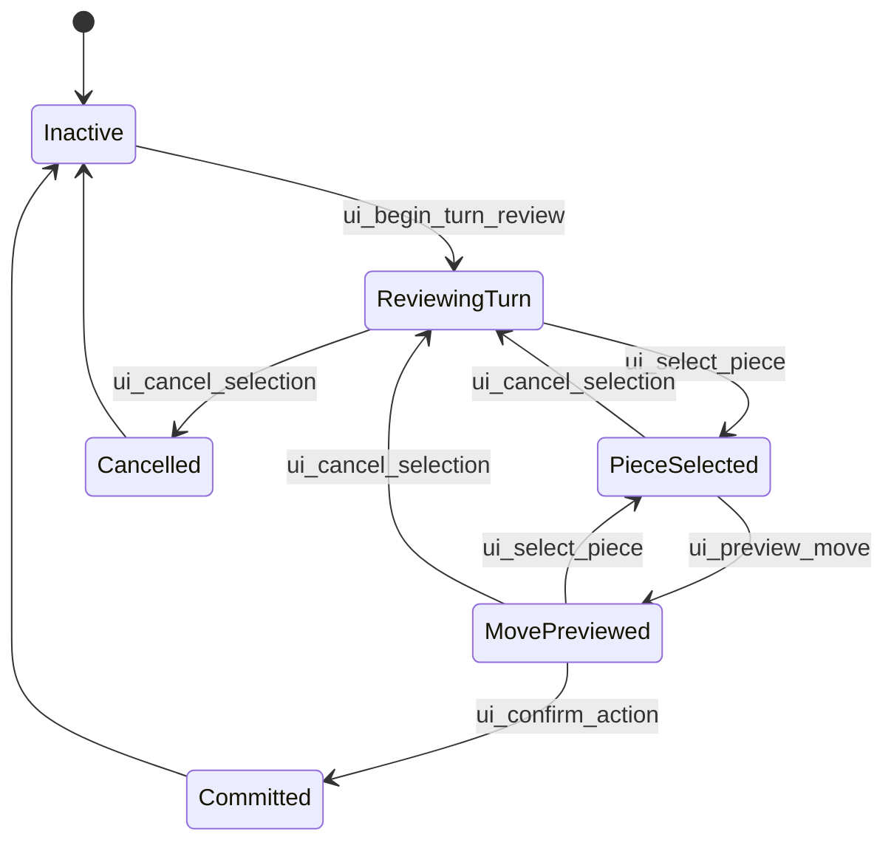

# L1 Interactive Tactical Review Tools 最小闭环设计稿

日期：2026-07-10

## 目标

L1 是 `LlmAgentStrategicInteractiveDesign.md` 中 Interactive Tactical Review Tools 的第一轮落地设计。

本阶段目标不是让 LLM 拥有完整战略能力，也不是直接推进 A3 手册中的 Step C。L1 只验证一个玩家可见的最小闭环：

```text
LLM Agent 像真人玩家一样开始回合观察
  -> 选中一个己方棋子
  -> 查看该棋子的可行动格和局部局势
  -> 预览一个落点
  -> 取消或确认
  -> 确认时仍走 Gameplay validator 和已验证的执行路径
```

L1 的核心价值是把“操作即信息，信息即操作”的交互方式跑通，让后续战略语义工具、两回合战术工具、真正的 tool-calling Agent 有一个可见、可控、可验证的执行面。

## 当前实现约束

当前 UE 侧正在重构 `APlanetTessellatedMesh` 结构，并把各个逻辑部分拆成独立组件。因此本阶段先只实现设计稿，不直接修改 UE C++。

后续实现 C++ 时，需要先查询当时的真实接口位置，再决定落点：

```text
不要假设仍然由 APlanetTessellatedMesh 直接承载所有点击、高亮、同步逻辑。
不要凭记忆写跨组件访问字段。
实现前必须重新读取当前 header/cpp，确认 Gameplay、Selection、Highlight、Presentation、MCP Bridge 的边界。
```

本设计稿只说明实现思路、工具契约、状态机、数据结构和验收方式。

## 已有基础

L1 建立在以下已完成阶段之上：

1. [A1 NPC MCP Runtime Server 与 Ping 设计稿](A1NpcMcpRuntimeServerAndPingDesign.md)
   - Runtime MCP server 已能启动。
   - MCP 工具注册链路已验证。

2. [A2 NPC MCP 确定性查询工具设计稿](A2NpcMcpDeterministicQueryToolsDesign.md)
   - 已有确定性查询工具：
     - `terra.get_turn_context`
     - `terra.list_legal_actions`
     - `terra.evaluate_action_risk`
     - `terra.submit_action_proposal`

3. [A3 外部 LLM Agent 驱动 NPC 执行闭环设计稿](A3ExternalLlmAgentNpcExecutionLoopDesign.md)
   - 已有执行工具：
     - `terra.execute_validated_action`
   - MCP Inspector 手动执行已验证。
   - 外部 deterministic Agent 已验证。
   - Step B：LLM 只做选择，Agent 执行，已验证。

4. [LLM Agent 战略思考与交互式战术工具设计稿](LlmAgentStrategicInteractiveDesign.md)
   - 定义了长期方向：
     - 战略语义工具
     - 战术分析工具
     - Interactive Tactical Review Tools
     - Agent 执行网关
     - UE Gameplay validator

L1 是第一个专注 Interactive Tactical Review 的最小阶段。

## L1 不做什么

L1 明确不做：

```text
不做完整 Step C tool-calling Agent。
不做长期阵营记忆。
不做 active plan 持久化。
不做两回合战术枚举。
不做战略评分。
不做多段 preview undo 栈。
不做复杂威胁线可视化。
不做任意路径规划。
不改变 Gameplay 权威规则。
```

L1 只需要让外部 MCP client 可以通过工具驱动一套最小可视化交互流程。

## 工具列表

L1 新增五个 MCP 工具：

```text
terra.ui_begin_turn_review
terra.ui_select_piece
terra.ui_preview_move
terra.ui_cancel_selection
terra.ui_confirm_action
```

可选保留接口：

```text
terra.ui_get_review_state
```

`ui_get_review_state` 不参与最小闭环，但调试时很有用。若实现成本低，可以一起做；若会扩大范围，可以后续再加。

## 状态模型

L1 需要引入一个轻量的 AI Review Session。它不是正式 Gameplay 状态，而是一次 NPC 可视化观察过程的临时状态。

推荐状态：

```text
Inactive
  没有 AI review。

ReviewingTurn
  已开始观察当前 NPC 回合，当前阵营棋子可高亮。

PieceSelected
  已选中一个当前阵营棋子，可显示该棋子的可行动格。

MovePreviewed
  已预览一个目标格，可显示目标格、风险和确认候选。

Committed
  已确认并尝试执行正式行动。

Cancelled
  已取消本次 review。
```

状态转移：



L1 的 `ui_cancel_selection` 可以简单地清空选择并回到 `ReviewingTurn`。真正多层 undo 栈放到后续阶段。

## Preview State 与正式 Gameplay State

L1 必须保留这个边界：

```text
ui_begin_turn_review / ui_select_piece / ui_preview_move / ui_cancel_selection
  只改变 AI Review Session 和表现层高亮。
  不修改正式 Gameplay。
  不推进回合。
  不写 Gameplay action log。

ui_confirm_action
  调用 A2/A3 已验证的 proposal/execute 边界。
  通过 Gameplay validator 后才修改正式 Gameplay。
```

也就是说，L1 的 preview 是“视觉与信息预览”，不是逻辑层临时移动。

这样第一版会比完整 AI Preview State 简单：

```text
不需要复制一份 Gameplay 棋盘。
不需要回滚棋子位置。
不需要处理 preview 后的真实吃子。
```

如果后续需要让 LLM 连续点击下一跳位置并把棋子临时移动过去，再引入完整 AI Preview State。

## 工具契约

### `terra.ui_begin_turn_review`

#### 目的

开始当前 NPC 回合的可视化观察。

表现层行为：

```text
高亮当前阵营所有棋子。
清空旧的 AI review selection 和 preview。
可选：将相机或焦点切到当前阵营重点区域。
```

数据返回：

```text
当前 turn/faction。
当前阵营棋子概要。
每个棋子的 cell、类型、是否可行动、合法行动数量、附近敌我数量、附近基础地形摘要。
```

#### 输入

```json
{}
```

第一版不允许指定 faction。只能 review 当前回合阵营。

#### 输出示例

```json
{
  "ok": true,
  "state": "reviewing_turn",
  "turn_index": 10,
  "current_faction_id": 5,
  "piece_count": 3,
  "pieces": [
    {
      "piece_id": 12,
      "piece_type": "archer",
      "cell_id": 101,
      "legal_action_count": 4,
      "nearby_friendly_count": 1,
      "nearby_enemy_count": 2,
      "nearby_terrain_tags": ["forest", "hill"],
      "summary_tags": ["ranged_unit", "has_cover_nearby"]
    }
  ]
}
```

#### 失败情况

```json
{
  "ok": false,
  "error": "gameplay_unavailable"
}
```

常见错误：

```text
gameplay_unavailable
not_idle
match_ended
no_current_faction
no_active_pieces
```

### `terra.ui_select_piece`

#### 目的

选择当前阵营的一个棋子，并显示它的行动可能。

表现层行为：

```text
选中该棋子。
高亮该棋子当前 cell。
高亮该棋子的合法目标格。
可选：弱高亮目标格风险或吃子结果。
```

数据返回：

```text
棋子当前位置。
合法行动列表。
每个目标格的移动类型、吃子数量、基础风险、周围敌我、地形标签。
```

#### 输入

```json
{
  "piece_id": 12
}
```

#### 输出示例

```json
{
  "ok": true,
  "state": "piece_selected",
  "selected_piece_id": 12,
  "from_cell_id": 101,
  "piece_type": "archer",
  "move_options": [
    {
      "to_cell_id": 118,
      "is_jump": false,
      "capture_count": 0,
      "destination_threatened": false,
      "threat_count": 0,
      "terrain_tags": ["forest"],
      "nearby_enemy_piece_ids": [34],
      "nearby_friendly_piece_ids": [7],
      "summary_tags": ["cover", "future_ranged_position"]
    }
  ]
}
```

#### 失败情况

```text
review_not_started
piece_not_found
piece_not_current_faction
piece_has_no_legal_actions
not_idle
```

失败时不改变当前 selection。

### `terra.ui_preview_move`

#### 目的

预览当前选中棋子的一个目标格。

表现层行为：

```text
高亮 preview 目标格。
高亮从当前 cell 到目标格的路径或跳跃关系。
可选：显示目标格风险色、吃子目标、附近敌我。
不移动正式棋子。
```

数据返回：

```text
目标格是否合法。
是否跳跃。
吃子预览。
目标格风险。
地形标签。
附近敌我。
确认行动需要的 piece_id/to_cell_id。
```

#### 输入

```json
{
  "piece_id": 12,
  "to_cell_id": 118
}
```

`piece_id` 必须等于当前 selected piece。第一版不允许在 preview 时隐式切换棋子。

#### 输出示例

```json
{
  "ok": true,
  "state": "move_previewed",
  "preview": {
    "piece_id": 12,
    "from_cell_id": 101,
    "to_cell_id": 118,
    "is_jump": false,
    "capture_count": 0,
    "captures": [],
    "destination_threatened": false,
    "threat_count": 0,
    "terrain_tags": ["forest"],
    "nearby_enemy_piece_ids": [34],
    "nearby_friendly_piece_ids": [7],
    "summary_tags": ["safe_cover", "supports_next_turn_attack"]
  },
  "confirm_arguments": {
    "piece_id": 12,
    "to_cell_id": 118
  }
}
```

#### 失败情况

```text
review_not_started
piece_not_selected
piece_mismatch
not_current_faction_action
not_idle
```

失败时不改变 preview。

### `terra.ui_cancel_selection`

#### 目的

取消当前选中和 preview，回到回合观察状态。

表现层行为：

```text
清空 selected piece 高亮。
清空 move option 高亮。
清空 preview 高亮。
保留当前阵营棋子高亮，或回到 begin_turn_review 的视觉状态。
```

#### 输入

```json
{}
```

#### 输出示例

```json
{
  "ok": true,
  "state": "reviewing_turn",
  "cleared_selected_piece_id": 12,
  "cleared_preview_to_cell_id": 118
}
```

#### 失败情况

```text
review_not_started
```

### `terra.ui_confirm_action`

#### 目的

确认当前 preview，并把它提交给 Gameplay 正式执行。

表现层行为：

```text
如果 validator 接受：
  走 A3 已验证的真实执行路径。
  清空 AI Review Session。
  回合推进后同步表现层。

如果 validator 拒绝：
  保留或清空 preview，返回错误。
  不修改正式 Gameplay。
```

#### 输入

第一版建议无参：

```json
{}
```

原因：`ui_confirm_action` 应确认当前 review session 中唯一的 preview，避免 LLM 绕过 `ui_preview_move` 直接提交任意 piece/to。

如果后续需要幂等保护，可以加入 snapshot：

```json
{
  "expected_turn_index": 10,
  "expected_faction_id": 5
}
```

L1 可以内部复用 begin/select/preview 时保存的 snapshot。

#### 输出示例

```json
{
  "ok": true,
  "state": "committed",
  "accepted": true,
  "executed": true,
  "turn_index_before": 10,
  "turn_index_after": 11,
  "faction_id_before": 5,
  "faction_id_after": 6,
  "piece_id": 12,
  "from_cell_id": 101,
  "to_cell_id": 118,
  "capture_count": 0
}
```

#### 失败情况

```text
review_not_started
move_not_previewed
snapshot_mismatch
not_idle
proposal_rejected
execute_failed
```

## L1 内部数据结构建议

后续 C++ 可按真实组件边界调整。概念上需要一个 session 结构：

```cpp
enum class ETerraNpcMcpReviewState : uint8
{
    Inactive,
    ReviewingTurn,
    PieceSelected,
    MovePreviewed,
    Committed,
    Cancelled,
};

struct FTerraNpcMcpReviewSession
{
    ETerraNpcMcpReviewState State = ETerraNpcMcpReviewState::Inactive;
    int32 TurnIndex = INDEX_NONE;
    int32 FactionId = INDEX_NONE;
    int32 SelectedPieceId = INDEX_NONE;
    int32 SelectedFromCellId = INDEX_NONE;
    int32 PreviewToCellId = INDEX_NONE;
    FDateTime StartedAtUtc;
};
```

这个结构应属于“AI review orchestration”边界，而不是 Gameplay 规则容器本身。

原因：

```text
GameplayContainer 应继续负责规则权威。
ReviewSession 是 MCP/表现层交互状态。
它可以引用 Gameplay 查询结果，但不应修改 Gameplay。
```

可能落点：

```text
NpcMcp 模块中的 bridge/session manager。
TerraCivilization 表现层交互组件。
重构后的 selection/highlight 组件。
```

具体位置等 C++ 实现时再读取当前代码决定。

## 信息摘要生成

L1 的工具返回需要给 LLM 足够信息，但不能一开始就做复杂战略推理。

推荐复用 A2 的确定性查询：

```text
ui_begin_turn_review:
  复用 get_turn_context。
  复用 list_legal_actions。
  按 piece_id 聚合 legal_action_count。

ui_select_piece:
  复用 list_legal_actions 过滤 selected piece。
  对每个目标调用 evaluate_action_risk。

ui_preview_move:
  复用 IsCurrentFactionLegalAction 或 submit_action_proposal。
  复用 evaluate_action_risk。

ui_confirm_action:
  复用 submit_action_proposal。
  复用 execute_validated_action。
```

地形、附近敌我、summary_tags 第一版可以保守：

```text
如果已有地形/邻接查询 API：
  返回真实 terrain_tags、nearby_piece_ids。

如果接口暂未稳定：
  L1 可以先只返回 legal action、capture、risk。
  在输出中保留 terrain_tags: []、summary_tags: []。
```

不要为了 L1 硬写不稳定的地形推断逻辑。

## 表现层接口需求

后续 C++ 需要找到或提供这些表现层能力：

```text
ShowNpcReviewFactionPieces(FactionId, PieceIds)
ShowNpcReviewSelectedPiece(PieceId, CellId)
ShowNpcReviewMoveOptions(PieceId, TargetCellIds)
ShowNpcReviewMovePreview(PieceId, FromCellId, ToCellId)
ClearNpcReviewMovePreview()
ClearNpcReviewSelection()
ClearNpcReviewAll()
```

它们的具体实现位置取决于当前重构结果，可能在：

```text
选择组件
高亮组件
棋子表现组件
相机/焦点组件
MCP gameplay bridge
```

实现原则：

```text
MCP tool 不应直接散落调用一堆渲染细节。
最好通过一个窄接口桥接到表现层。
表现层失败不应导致 Gameplay 状态被修改。
```

## 与现有点击路径的关系

A3 的 `execute_validated_action` 最终改成了走真实点击路径，以保证逻辑层和表现层同步。

L1 的 `ui_confirm_action` 应继续复用这个已验证路径：

```text
ui_confirm_action
  -> 当前 review session 取 piece_id/to_cell_id
  -> submit_action_proposal 二次校验
  -> execute_validated_action
  -> 真实点击/交互执行路径
```

但 L1 的 `ui_select_piece` 和 `ui_preview_move` 不必直接复用“真实点击状态机”。

原因：

```text
真实点击状态机可能有玩家输入语义和回合推进语义。
AI review 是观察和预览，不应意外进入正式移动状态。
```

如果重构后已有纯表现层的 select/highlight API，应优先使用纯表现层 API。

## MCP 工具暴露边界

L1 工具可给 LLM 调用：

```text
terra.ui_begin_turn_review
terra.ui_select_piece
terra.ui_preview_move
terra.ui_cancel_selection
```

`terra.ui_confirm_action` 建议先由 Agent 代理调用，或者至少在 Agent 侧二次确认。

推荐权限：

```text
LLM:
  可以观察、选择、预览、取消。

Agent:
  负责确认是否允许提交。
  负责调用 ui_confirm_action。

UE:
  负责最终 validator 和执行。
```

如果为了 Inspector 验收，`ui_confirm_action` 可以作为 MCP tool 暴露，但在真正 LLM Agent 白名单里仍建议作为 Agent-controlled tool。

## Agent 最小流程

L1 的无 LLM 脚本可模拟：

```text
call ui_begin_turn_review
choose first piece with legal_action_count > 0
call ui_select_piece(piece_id)
choose first move option
call ui_preview_move(piece_id, to_cell_id)
call ui_confirm_action
```

L1 的 LLM 流程可模拟：

```text
LLM call ui_begin_turn_review
LLM choose a piece to inspect
LLM call ui_select_piece
LLM choose a move option to preview
LLM call ui_preview_move
Agent asks LLM for final decision: confirm or cancel
Agent calls ui_confirm_action or ui_cancel_selection
```

注意：L1 不是要求 LLM 多聪明，而是要求工具调用在画面上产生连贯反馈。

## Inspector 验收流程

第一轮可以不用 LLM，只用 MCP Inspector 手动调用：

1. 启动 UE MCP server。
2. 调 `terra.ui_begin_turn_review`。
   - 期望：当前阵营棋子高亮。
   - 返回：piece summaries。
3. 选择一个 `piece_id`，调 `terra.ui_select_piece`。
   - 期望：该棋子被选中，可行动格高亮。
   - 返回：move options。
4. 从 move options 中选择一个 `to_cell_id`，调 `terra.ui_preview_move`。
   - 期望：目标格或路径被 preview 高亮。
   - 返回：preview summary 和 confirm arguments。
5. 调 `terra.ui_cancel_selection`。
   - 期望：清除 selection 和 preview，回到阵营棋子高亮。
6. 再次 select/preview。
7. 调 `terra.ui_confirm_action`。
   - 期望：正式执行行动，棋子移动，回合推进。
   - 返回：executed=true。

## 脚本验收流程

后续实现 C++ 后，可新增一个 Agent 脚本，例如：

```text
Tools/NpcAgent/src/run-interactive-review-once.js
```

最小脚本行为：

```text
connect MCP
call ui_begin_turn_review
pick first actionable piece
call ui_select_piece
pick first move option
call ui_preview_move
sleep 300ms
call ui_confirm_action
print execution result
```

这个脚本可以先不接 LLM。它的目的和 A3 Step 0 一样：先验证工具和表现链路。

## 日志与复盘

L1 应在 Agent 或 UE 侧记录工具调用轨迹：

```json
{
  "mode": "interactive_review_l1",
  "turn_index": 10,
  "faction_id": 5,
  "tool_calls": [
    {
      "name": "terra.ui_begin_turn_review",
      "ok": true
    },
    {
      "name": "terra.ui_select_piece",
      "args": {
        "piece_id": 12
      },
      "ok": true
    },
    {
      "name": "terra.ui_preview_move",
      "args": {
        "piece_id": 12,
        "to_cell_id": 118
      },
      "ok": true
    },
    {
      "name": "terra.ui_confirm_action",
      "ok": true,
      "executed": true
    }
  ]
}
```

后续接 LLM 时，再加入：

```text
LLM 选择该棋子的 reason。
LLM 选择该落点的 reason。
Agent 是否二次确认。
是否 fallback。
```

## 风险与处理

### 1. 与玩家输入状态机冲突

风险：

```text
AI review 高亮或选择污染玩家当前 UI 状态。
```

处理：

```text
只允许在 NPC 回合启用 L1 工具。
InteractionPhase 必须是 Idle。
begin_turn_review 前清理旧 AI review 高亮。
confirm/cancel 后清理 AI review 状态。
```

### 2. Preview 被误认为正式移动

风险：

```text
ui_preview_move 如果复用真实点击状态机，可能导致棋子逻辑位置变化。
```

处理：

```text
L1 preview 只做高亮和信息查询。
正式移动只允许 ui_confirm_action。
```

### 3. Snapshot 过期

风险：

```text
LLM 观察后，回合或阵营已经变化。
```

处理：

```text
ReviewSession 保存 TurnIndex/FactionId。
confirm 前对比当前 Gameplay snapshot。
不一致则拒绝并清理 session。
```

### 4. 重构期间接口漂移

风险：

```text
PlanetTessellatedMesh 重构导致旧函数位置变化。
```

处理：

```text
本阶段不写 C++。
后续实现前重新 rg 相关接口。
只依赖 public/narrow bridge，不跨组件硬访问字段。
```

### 5. 工具调用太多拖慢回合

风险：

```text
11 个 NPC 每个都表演完整 review，会拖慢节奏。
```

处理：

```text
L1 先只验证单 NPC。
后续加可见性和重要性预算：
  玩家附近 NPC 才完整展示。
  远处 NPC 只后台执行。
```

## 后续 C++ 实现前的代码查询清单

实现 C++ 前先查询：

```powershell
rg "TryExecuteNpcMcpValidatedAction|ExecuteValidated|HandleGameplayCellClick|RegisterExecuteValidatedActionDelegate" Source
rg "Highlight|Selection|SelectedPiece|MoveOption|Preview" Source
rg "CollectCurrentFactionLegalActions|EvaluateCurrentFactionActionRisk|IsCurrentFactionLegalAction" Source
rg "APlanetTessellatedMesh|Component" Source/TerraCivilization
rg "NpcMcp|GameplayBridge" Source
```

需要确认：

```text
当前 Gameplay 查询 API 的真实位置。
当前 MCP bridge 的真实委托机制。
当前表现层高亮/选择 API 的真实组件。
当前 execute_validated_action 是否仍走真实点击路径。
当前是否已有可复用的清理高亮接口。
```

## 最小交付

L1 的实现最小交付应包含：

```text
1. 五个 MCP tools。
2. 一个 ReviewSession 状态。
3. 只读 review/select/preview 查询。
4. 表现层高亮桥接。
5. confirm 复用 A3 execute path。
6. Inspector 验收步骤。
7. 可选 deterministic review agent 脚本。
```

当前本次只交付设计稿。C++ 等 `PlanetTessellatedMesh` 重构稳定后再按真实接口实现。

## 验收标准

设计稿验收：

```text
1. L1 范围明确，不混入战略语义工具和 Step C。
2. 工具输入输出可供 MCP tool schema 实现。
3. 状态机明确。
4. Preview 与正式 Gameplay 边界明确。
5. 后续 C++ 实现位置不硬编码，保留重构后的接口查询步骤。
```

实现后验收：

```text
1. Inspector 调 ui_begin_turn_review 后能看到当前阵营棋子高亮。
2. Inspector 调 ui_select_piece 后能看到该棋子和目标格高亮。
3. Inspector 调 ui_preview_move 后能看到 preview 高亮。
4. Inspector 调 ui_cancel_selection 后能清理 selection/preview。
5. Inspector 调 ui_confirm_action 后能正式执行行动并推进回合。
6. 非法 piece_id/to_cell_id 不改变正式 Gameplay。
7. confirm 前 snapshot 过期会拒绝执行。
```
