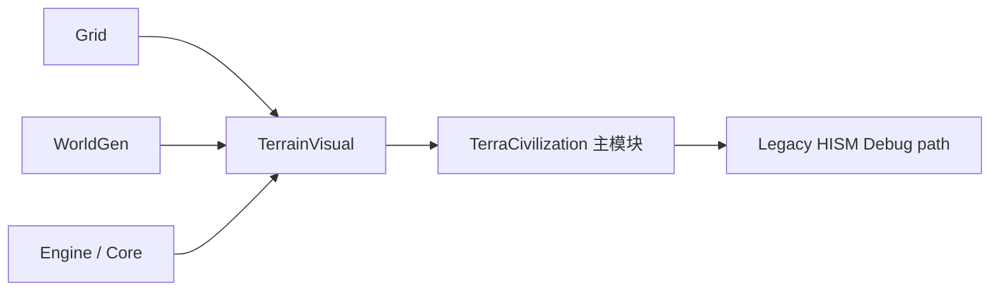

# SV0：TerrainVisual 新模块与迁移地基设计稿

> 状态：待审阅。本稿是 [SimpleGameplayTerrainVisualPresentationDesign.md](SimpleGameplayTerrainVisualPresentationDesign.md) 的第一个可实施子里程碑。
>
> 编码：UTF-8，简体中文。
>
> SV0 只落地模块边界、运行模式、视觉查询接口和诊断契约。**本阶段不得编写连续球面网格、不得迁移点击、不得装配 SDF 材质、不得新增 HISM 装饰、不得修改 Gameplay 逻辑。**

---

## 1. 目标

为新的连续地形视觉系统建立一个完全独立的 Runtime 模块 `TerrainVisual`，避免继续把连续表面、SDF、视觉高度和 Decor 逻辑塞入现有 `TerraCivilization/Render` 下的 HISM 渲染器或交互组件。

SV0 完成后，工程应具备：

```text
TerrainVisual Runtime module
    - 可被当前 planet actor 持有的视觉协调对象
    - TerrainVisualField 的纯数据骨架
    - SurfaceQuery 的不带几何实现接口
    - LegacyHISM / ContinuousSurface 两种视觉模式定义
    - 只读诊断状态

现有 HISM 路径
    - 不修改行为
    - 继续负责当前渲染、点击、高亮与棋子高度
    - 仅被标记为 LegacyHISMDebug 的未来 Debug 回退路径
```

SV0 不让任何玩家可见行为改变。`ContinuousSurface` 模式在本阶段只是不可用的预留模式，不能误导为已实现的功能。

## 2. 模块边界

### 2.1 新模块

模块名固定为 `TerrainVisual`，类型为 `Runtime`，目录结构：

```text
Source/TerrainVisual/
  TerrainVisual.Build.cs
  Public/
    TerrainVisualTypes.h
    TerrainVisualField.h
    TerrainSurfaceQuery.h
    TerrainVisualCoordinator.h
  Private/
    TerrainVisualField.cpp
    TerrainVisualCoordinator.cpp
```

SV0 不新增 `UActorComponent`、`UProceduralMeshComponent`、材质、纹理、蓝图资产或关卡资产。这样可避免在尚未确定 SV1 表面组件命名之前，过早引入 Blueprint 默认子对象兼容性问题。

### 2.2 依赖方向



`TerrainVisual` 允许依赖：

- `Core`、`CoreUObject`、`Engine`；
- `Grid`，读取球面拓扑类型和方向查询所需数据；
- `WorldGen`，读取当前视觉可解释的 Cell 地形数据。

`TerrainVisual` 禁止依赖：

- `TerraCivilization` 主模块；
- `Gameplay` 模块；
- 任何 `PlanetHISM*`、`PlanetPiecePresentation*`、`PlanetCamera*` 或 Interaction 具体类；
- Editor-only GeometryScript、ModelingTools、MaterialEditor；
- 旧 ProceduralTerrainGenerator 或 RuntimeMesh 插件。

这保证新模块可以被主模块使用，而不会形成循环依赖，也不会把旧 HISM 实现变成新连续视觉的基础类。

### 2.3 主模块的允许职责

未来 `APlanetTessellatedMesh` 只作为桥接拥有者：持有 `TerrainVisualCoordinator`，在 `RebuildAll_()` 的既有 WorldGen 完成之后，以只读的 `CellTopology`、`FCellGeoData[]`、球心变换和半径初始化它。

SV0 不修改此 actor，也不修改 `PlanetHISMTileRenderer`、`PlanetHISMInteractionComponent`、`PlanetPiecePresentationComponent` 或 Gameplay 文件。模块可以先独立编译，主模块接线留到 SV1 的第一笔 C++ 改动。

## 3. 类型设计

### 3.1 渲染模式

```cpp
enum class ETerrainVisualMode : uint8
{
    LegacyHISMDebug,
    ContinuousSurface,
};
```

语义：

| 模式 | SV0 行为 | 后续语义 |
| --- | --- | --- |
| `LegacyHISMDebug` | 默认且唯一可用模式。 | 旧 HISM 保持为 Debug/回退路径。 |
| `ContinuousSurface` | coordinator 返回“不支持，尚未创建 Surface”。 | SV1 后才成为可验收模式。 |

禁止复用 `bEnableHISMTileRendering`、`bEnableHISMTileCollision` 等现有开关表达新模式；这些字段只继续描述遗留 HISM 自己的状态。

### 3.2 配置快照

`FTerrainVisualConfig` 仅持有视觉配置，不含 Gameplay 开关：

| 字段语义 | SV0 默认值 | 说明 |
| --- | --- | --- |
| VisualMode | `LegacyHISMDebug` | 防止未经实现的连续模式进入游戏。 |
| SurfaceSubdivisionLevel | `7` | 只记录 SV1 目标，SV0 不建网格。 |
| GlobeRadiusCM | 从宿主传入 | 只读快照。 |
| GlobalVisualSeed | 从 WorldGen seed 派生 | 只用于未来稳定视觉随机。 |
| bEnableDiagnostics | `false` | 控制只读诊断日志。 |

不得在配置中加入地形可通行性、伤害、阵营、回合或棋子字段。

### 3.3 视觉场快照

`FTerrainVisualField` 在 SV0 仅验证输入契约：

```text
Initialize(CellTopology, GeoCells, Config)
    - 校验 GeoCells 数量与 Cell 数量一致
    - 缓存只读拓扑引用或必要的不可变副本
    - 记录全局视觉 seed

QueryBaseSurface(UnitDirection)
    - 返回未位移球面的半径、位置和径向法线
```

SV0 不计算 Mountain 连通组件、不计算高度、不读取不存在的 Elevation 字段、不生成噪声，也不创建 Cell LUT。

### 3.4 SurfaceQuery 契约

`FTerrainSurfaceQueryResult` 预留：

| 输出 | SV0 值 | SV4 后值 |
| --- | --- | --- |
| `WorldPosition` | `PlanetCenter + UnitDirection * GlobeRadiusCM` | 同一方向的真实连续表面位置。 |
| `WorldNormal` | `UnitDirection` | 高度场导出的坡面法线。 |
| `SurfaceRadiusCM` | `GlobeRadiusCM` | 基础半径加视觉高度。 |
| `bHasSurface` | `false` | 只有 SV1 网格/解析查询可用后才为 true。 |
| `CellId` | `INDEX_NONE` | SV1 输入桥接后才填充。 |

这里 `QueryBaseSurface` 与“可被输入/棋子使用的已实现地表查询”必须明确区分。SV0 的结果只用于单元测试和诊断，不能取代现有 HISM 高度与点击路径。

## 4. 协调器与生命周期

`FTerrainVisualCoordinator` 是非 UObject 的纯 C++ 协调器：

```text
Reset()
Initialize(ReadOnlyTerrainVisualInput)
GetMode()
CanActivateContinuousSurface()
GetDiagnostics()
GetBaseSurfaceQuery(UnitDirection)
```

SV0 的 `CanActivateContinuousSurface()` 必须恒为 false，并返回明确原因，例如“SV1 continuous surface component is not implemented”。这避免配置/蓝图在错误阶段切换到一个没有碰撞、没有材质且没有 CellId 桥接的模式。

如果该协调器采用 `TUniquePtr` 被 `APlanetTessellatedMesh` 持有，SV1 接线时必须遵守工程既有规则：在主 actor 头文件显式声明析构函数和 `FVTableHelper` 构造函数，并在 cpp 中定义，避免 UHT 在不完整类型上下文析构。

## 5. SV0 文件改动清单

| 文件 | SV0 操作 |
| --- | --- |
| `TerraCivilization.uproject` | 注册 `TerrainVisual` Runtime 模块。 |
| `Source/TerrainVisual/TerrainVisual.Build.cs` | 建立最小 Runtime 依赖。 |
| `Source/TerrainVisual/Public/...` | 新增类型、视觉场、表面查询与协调器公开接口。 |
| `Source/TerrainVisual/Private/...` | 新增无几何、无材质、无 HISM 调用的实现与日志分类。 |
| `Source/TerraCivilization/...` | **SV0 不改动。** |
| `Content/...` | **SV0 不改动。** |

因此 SV0 的首次编译验收应不产生关卡、蓝图、材质或 Gameplay 回归风险。

## 6. 诊断与验收

### 6.1 编译验收

1. `TerrainVisual` 能作为独立 Runtime 模块参与 `TerraCivilizationEditor` 编译。
2. 不存在 `TerrainVisual -> TerraCivilization` 反向依赖。
3. 不增加 Editor-only 模块依赖。
4. 当前 HISM、Gameplay、棋子表现和关卡资产无需修改即可保持可编译。

### 6.2 逻辑验收

对一个默认 `CellSubdivisionLevel=3` 的拓扑：

1. Field 初始化接受 642 个 `FCellGeoData`，并拒绝数量不一致输入。
2. 任意非零 `UnitDirection` 的 base query 位置到球心距离等于 `GlobeRadiusCM`。
3. base query 法线与单位方向一致且归一化。
4. `CanActivateContinuousSurface()` 为 false，且诊断原因稳定、可读。
5. 不存在写入 `FCellGeoData`、Gameplay 状态或 HISM 实例数据的代码。

### 6.3 回归验收

- SV0 前后的固定 seed 下，当前 HISM hover/click、HISM 高亮、棋子高度射线、相机与回合流程完全不变。
- `git diff` 只包含 `TerrainVisual` 模块文件、`.uproject` 模块登记，以及本设计文档；若出现 `PlanetHISM*`、Gameplay 或 Content 修改，必须在 SV0 review 中说明并默认拒绝。

## 7. 明确延后到 SV1 之后的事项

- `UProceduralMeshComponent` 或其他连续表面组件；
- Surface `QueryOnly` 碰撞；
- 输入射线转 CellId；
- `CellHighlightLUT`、MID、SDF Custom 节点；
- 高度位移、山脊链、法线导数；
- 水材质/水壳；
- HISM Decor、Nanite 资产、实例放置与 HISM 关闭碰撞；
- 棋子高度、相机焦点、光照法线的迁移；
- LOD、局部 stamp 和动态网格重建。

> SV0 的价值是把新旧两条视觉路径隔离开。只有新模块独立存在、连续模式不可误启用、旧 HISM 行为零变化，SV1 才有安全的落点。
