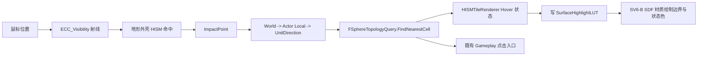

# SV7：HISM + SDF 空间投影交互与高亮设计稿

> 编码：UTF-8，简体中文。前置：SV6-B 已验收；后续总线见 [HISMSDFTerrainVisualPresentationDesign.md](HISMSDFTerrainVisualPresentationDesign.md)。

## 1. 目标与边界

SV7 将 HISM + SDF 模式的 hover、点击和可见高亮从“命中的 HISM 实例属于哪个旧 Tile Cell”迁移为“命中空间位置投影到球面后属于哪个 Gameplay Cell”。它使未来跨越多个 Cell 的 Ridge、Cliff、Peak 等 HISM 地形外壳不再受 InstanceId 语义限制。

本阶段只修改 C++ 输入、Cell 查询和 `SurfaceHighlightLUT` 写入路径；SV6-B 的材质 HLSL、SDF 边界、高亮绘制、三平面 PBR、河网、棋子规则和 UI 均不修改。

## 2. 核心规则

任何可参与地形交互的 HISM 碰撞命中遵守：

```text
FHitResult.ImpactPoint（世界空间）
    -> ActorTransform.InverseTransformPosition
    -> UnitDirection = normalize(LocalPosition)
    -> FSphereTopologyQuery(CellTopology).FindNearestCell(UnitDirection)
    -> Gameplay CellId
```

`Hit.Item`、HISM Component 类型、实例序号和资产的 Owner Cell 都不参与 CellId 判定。它们仍可保留在日志中诊断资产、批次和碰撞，但不再影响 Gameplay 输入。

CPU 端调用现有 `FSphereTopologyQuery::FindNearestCell`，因此与逻辑 CellTopology 使用同一棵球面三角树。GPU 材质仍暂时沿用 SV6-B Owner+Neighbor 候选；SV8 将用拓扑查询 LUT 替换它，二者职责不同：

| 位置 | 查询职责 |
| --- | --- |
| CPU 输入 | 精确决定点击/hover 对应的 Gameplay CellId。 |
| GPU 材质 | 决定该像素的地形 SDF 类别、边界和高亮颜色。 |

## 3. 输入与高亮流程



在 `HISMSDFExperiment` 模式下：

1. `UPlanetHISMInteractionComponent` 检查命中 Actor 是当前 `APlanetTessellatedMesh`、HISM 碰撞启用且命中组件有 Query 碰撞。
2. 通过 `APlanetTessellatedMesh::ResolveTerrainCellFromWorldPosition` 得到 CellId。
3. Hover 调用 Actor 私有的统一更新入口，使 `HISMTileRenderer` 只维护当前 hover Cell 与延迟清除状态。
4. Actor 根据 Gameplay、hover、行动目标与吃子预览合成颜色和强度，写入 `SurfaceHighlightLUT`。
5. SV6-B 已验收材质从 LUT 绘制球面 SDF 高亮，因此同一高亮可跨不同 HISM 实例连续显示。
6. Click 使用同一 CellId 进入既有 `HandleGameplayCellClick_`；诊断 Source 标签为 `HISM Spatial Projection`。

Hover 离开沿用既有延迟清除时间。延迟到期时，状态机从旧 Cell 切换到 `INDEX_NONE` 的同一帧必须重写旧 hover Cell 及其吃子预览 Cell 的 LUT；否则旧 PICD 路径虽已清除，SDF 材质会残留最后一圈高亮。

## 4. 旧 PICD 高亮的处置

`FPlanetHISMTileRenderer` 继续承载 hover 状态、最后点击 Cell 和既有延迟清除逻辑，但在 HISM + SDF 模式下运行时 Highlight Config 强制 `bEnableInstanceHighlight=false`：

- 状态机仍更新 `CurrentHoverCellId`，供 LUT 合成读取。
- 旧 PICD `0..3` 不再获得可见颜色写入。
- `M_TerrainVisual_HISMSDFExperiment` 不读取 PICD 旧高亮输出，只读取 `SurfaceHighlightLUT`。
- `LegacyHISMDebug` 仍按原行为使用 PICD 实例高亮；其开关 `bEnableHISMInstanceHighlight` 语义不变。

输入控制器在 HISM + SDF 模式下不再依赖 `bEnableHISMInstanceHighlight` 才进行 hover/leave 处理，避免关闭旧视觉路径后空间投影交互也被误关闭。

## 5. 碰撞职责

| HISM 类型 | `ECC_Visibility` | SV7 行为 |
| --- | --- | --- |
| 当前三种基础 Tile HISM | Block | 命中后按 ImpactPoint 查询 Cell。 |
| 未来 Ridge/Cliff/Peak 地形外壳 | Block | 同上；允许跨 Cell，禁止实例反查 Cell。 |
| Tree/Grass/Boulder 等独立 Decor | Ignore / NoCollision | 不抢占鼠标地表命中。 |

SV7 不改变当前 P2.5 棋子高度射线使用的旧 HISM 实例反查接口 `TryResolveHISMHitToCellId`，以避免把交互迁移扩大为高度系统重构。SV9 新地形外壳加入后，再独立定义跨 Cell 的棋子地表高度选择规则。

## 6. C++ 改动

### 6.1 新的统一查询入口

`APlanetTessellatedMesh` 新增：

```cpp
bool ResolveTerrainCellFromWorldPosition(const FVector& WorldPosition, int32& OutCellId) const;
```

它执行 actor 局部变换、单位化和 `FSphereTopologyQuery::FindNearestCell`，失败时返回 `false` 并输出 `INDEX_NONE`。

### 6.2 模式判定

`IsHISMSDFTerrainVisualActive()` 仅在以下条件成立：

```text
TerrainVisualMode == HISMSDFExperiment
SurfaceHighlightLUT 已初始化
bEnableHISMTileRendering == true
```

此判定控制空间输入、LUT 高亮、Tick 和 HISM SDF MID 的运行边界；`ContinuousSurface` 与 `LegacyHISMDebug` 不进入 SV7 分支。

### 6.3 兼容分支

| 调用点 | `LegacyHISMDebug` | `ContinuousSurface` | `HISMSDFExperiment` |
| --- | --- | --- | --- |
| HISM hit -> Cell | `Hit.Item -> InstanceToCellId` | 不走 HISM 鼠标路径 | `ImpactPoint -> FindNearestCell` |
| 可见高亮 | PICD `0..3` | `SurfaceHighlightLUT` | `SurfaceHighlightLUT` |
| HISM hover 状态 | 旧状态机 + PICD 写入 | 连续表面入口更新状态 | 旧状态机仅维护状态，PICD 写入禁用 |
| Click 来源日志 | `HISM Click` | `ContinuousSurface` | `HISM Spatial Projection` |

## 7. 验收

1. 在 HISM + SDF 模式中，hover 和点击当前三种 Tile HISM 时，Gameplay 行为与 SV6-B 前一致。
2. 打开高亮后，颜色来自材质的 `SurfaceHighlightLUT`；关闭旧 PICD 高亮开关后，hover/点击和 LUT 高亮仍正常。
3. 构造一个临时跨 Cell 的可碰撞 HISM 地形实例时，命中其不同空间位置可得到不同 CellId，而不是始终返回实例创建时的 Cell。
4. 未来地形外壳的 `Hit.Item` 改变、实例合批顺序变化或资产替换，不改变同一 `ImpactPoint` 的 CellId。
5. Legacy HISM Debug 的实例高亮、点击和棋子高度链路不回归；ContinuousSurface 点击/高亮不回归。
6. `git diff --check` 通过，`TerraCivilizationEditor` 编译成功。

## 8. 排错

| 现象 | 根因 | 修复/检查 |
| --- | --- | --- |
| HISM + SDF 下 hover 不显示 | 材质未读取 `SurfaceHighlightLUT`，或 LUT 未初始化 | 检查 `TerrainVisualHISMSDFMaterial`、SV6-B 参数注入和模式。 |
| 关闭旧高亮开关后 hover 停止 | 输入控制器仍以 `bEnableHISMInstanceHighlight` 作为唯一开关 | 检查是否处于 `IsHISMSDFTerrainVisualActive()` 分支。 |
| 点击跨 Cell 资产仍得到 Owner Cell | 仍走 `TryResolveHISMHitToCellId` | 确认 HISM + SDF handler 使用 `ResolveTerrainCellFromWorldPosition(Hit.ImpactPoint)`。 |
| 树或草抢走点击 | 独立 Decor 阻挡 `ECC_Visibility` | 将独立 Decor 设为 `NoCollision` 或 Ignore Visibility。 |
| 高亮边界正确但旧实例整块发光 | 材质仍读取 PICD `0..3` | 移除旧 PICD Emissive 连线；SV7 只用 LUT。 |
