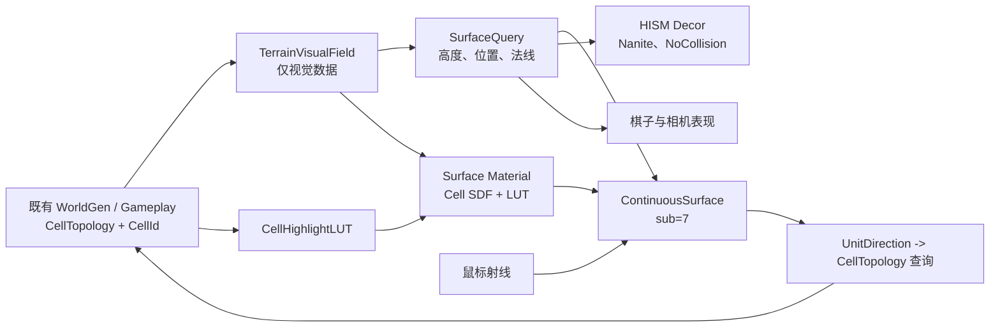

# SimpleGameplay 连续地形视觉表现设计稿

> 状态：总体设计稿。本文规定 SimpleGameplay 的新地形视觉路线；所有正文使用 UTF-8 简体中文。
>
> 定位：本文与 `HISMSphericalTileRenderDesign.md` 相互独立。旧稿只保留为现有 HISM Debug 路径和资产坐标约定的历史参考，不再作为后续地形视觉实现的设计依据。

---

## 1. 目标与边界

新地形视觉系统在**不修改 Gameplay 规则**的前提下，把“地面连续性”与“近景高密度细节”分离：

```text
CellTopology + Gameplay（保持 CellId 契约不变）
        |
        +-- TerrainVisual 新模块
              |
              +-- 连续基础表面：宏观轮廓、地表命中、高亮、材质、低频高度与水文承载
              +-- TerrainVisualField：连续高度、法线、视觉掩码、装饰随机种子
              +-- HISM Decor：Nanite 山脊、岩石、草、树等高频视觉细节
```

连续基础表面是唯一的“地面”权威；HISM 是长在、放在或穿出地表的视觉装饰。完成迁移后，HISM 不得再决定点击 CellId、棋子高度、相机焦点或地表高亮。

本文不包含：

- 玩法地形枚举、移动规则、寻路、回合、战斗或 WorldGen Gameplay 输出的改造；
- 运行时网格布尔、体素补洞、运行时 StaticMesh/Nanite 转换；
- 本阶段的球面自适应 LOD；
- 水体 Gameplay 规则。

## 2. 不变契约

| 项 | 固定决策 |
| --- | --- |
| Gameplay 身份 | `CellId` 始终是地形、棋子、选中和行为的唯一身份。 |
| 逻辑拓扑 | 沿用当前 `CellTopology`，默认 `CellSubdivisionLevel=3`、642 个 Cell。 |
| 渲染拓扑 | 独立连续球面，默认 `SurfaceSubdivisionLevel=7`，约 327,680 个 primal 三角形。 |
| 视觉高度 | 仅由球面方向、全局 seed 和视觉参数确定，不回写 Gameplay。 |
| 坐标 | `UnitDirection = normalize(WorldPosition - PlanetCenterWorld)` 是高度、材质噪声、水体、装饰和 Cell 查询的共同坐标。 |
| 点击桥接 | `Surface Hit/Query -> UnitDirection -> CellTopology Query -> CellId -> 既有 Gameplay`。 |
| HISM | 最终为 `NoCollision` 的 Nanite Decor；可临时保留为 Debug。 |

`sub=7` 只服务宏观山势、谷地、连续轮廓和地表高亮，不追赶当前 HISM 的两千万级微观三角形密度。尖峰、岩层、草、树和碎石继续由静态 Nanite HISM 与材质细节承担。

## 3. 系统架构



### 3.1 `TerrainVisualField`

视觉高度必须是一个共享、确定性的场：

```text
Height(UnitDirection) =
    BaseRadius
  + MacroLandform(UnitDirection)
  + RidgeField(UnitDirection)
  + OptionalVisualStamps(UnitDirection)
```

- `MacroLandform`：由 Plain/Forest/Mountain 的视觉解释连续插值得到。
- `RidgeField`：直接消费 WorldGen 山脉生长过程输出、由 Gameplay 持有的 Mountain Cell 中心测地线弧段；禁止从 Mountain Cell 邻接关系反推山脊链。
- `OptionalVisualStamps`：保留给未来视觉挖坑、筑坝、山崩等；不改变当前玩法通行规则。
- 结构性高度不得依赖 HISM 局部 UV、独立瓦片高度图或实例随机旋转，否则接缝无法连续。

### 3.2 `SurfaceQuery`

所有表现层共享如下概念接口：

```text
QuerySurface(UnitDirection) ->
    WorldPosition
    WorldNormal
    SurfaceRadius
    Optional CellId
```

SV1 时它返回未位移球面；SV4 时它和连续网格使用同一高度场。棋子、相机、装饰和点击禁止继续各自计算 `UnitCenter * GlobeRadiusCM` 或通过 HISM 射线获得地面高度。

### 3.3 材质、高亮与水体

SDF 在本文中是**地表材质**技术，不是体素几何生成器。材质从每个渲染三角形的三个候选 CellId 与球面方向中求出 Hex/Pent 区域归属、地形混合、边界距离与高亮带。

最小数据集：

| 数据 | 用途 |
| --- | --- |
| `CellVisualLUT` | 视觉地形类别、宏观高度/掩码参数、装饰密度 seed。 |
| `CellHighlightLUT` | R=hover，G=selected/action 等状态。 |
| 材质全局参数 | 颜色、描边宽度、海平面、纹理比例、光照响应。 |

高亮复用 `HexHighlightInteractionPlan.md` 的双通道 LUT 状态语义和 `SphericalSDFTerrainDesign.md` 的球面 Hex/Pent 边界数学；渲染目标改为连续表面材质。后处理不是主路径。

水体先以地表材质表现低洼湿润、溪流、浅水、岸边泡沫和波纹；若以后需要反射、独立波面和严格海平面遮挡，再增加无碰撞的连续水壳。水壳不得参与点击、Cell 查询或棋子高度。

### 3.4 HISM Decor

| 类别 | 例子 | 角色 |
| --- | --- | --- |
| 山地细节 | 长条山脊、尖峰、断层岩壁、层状裸岩 | 丰富连续宏观山体，不独自定义地面轮廓。 |
| 地表细节 | 石块、草丛、灌木、倒木 | 高频视觉变化。 |
| 森林细节 | 树干、树冠、林下植被 | 让森林不再只是绿色地面。 |

每个实例都按 `CellId + DecorSlot + GlobalVisualSeed -> UnitDirection -> SurfaceQuery -> Transform` 稳定生成。实例使用 SurfaceQuery 的位置与法线，山脊根据 Mountain 连通组件的链方向布置。最终所有 Decor HISM 都是 `NoCollision`，并让底部轻微埋入基础表面以消除悬浮缝。

## 4. 子里程碑

### SV0：模块与迁移地基

只建设新模块、运行模式、接口和诊断；不写连续网格、不改输入路径、不引入视觉变化。详见 [SV0_TerrainVisualFoundationDesign.md](SV0_TerrainVisualFoundationDesign.md)。

### SV1：sub=7 基础表面与点击桥接

- 构建未高度位移的共享顶点 `sub=7` 球面。
- 只使用简单不透明 Debug 材质；不装配 SDF、无水、无 HISM Decor。
- 连续表面以 `QueryOnly` 碰撞接收地表射线；连续模式下关闭 HISM 地形碰撞。
- `ImpactPoint -> UnitDirection -> CellTopology -> CellId` 后调用当前同一套 Gameplay click/hover 入口。
- 首次验收中旧 HISM 不得可见地遮住基础表面。

> **SV1 实施修订**：为保持现有 P2.5 棋子高度链路，连续模式下旧 HISM 暂不完全关闭碰撞：它隐藏且忽略鼠标 `ECC_Visibility`，但继续阻挡 `ECC_WorldStatic`，供既有棋子高度多射线查询使用。连续基础表面只阻挡 `ECC_Visibility` 并承担鼠标命中。SV4 迁移棋子高度到 `SurfaceQuery` 后，才移除这条 HISM 高度兼容路径。

### SV2：高亮迁移

- 创建并绑定 `CellHighlightLUT`。
- 将 hover、选中、行动目标和吃子预览的状态映射到连续表面材质描边。
- HISM PICD 高亮仅保留为 Debug 对照，正常连续模式中禁用。
- 每个渲染三角形携带固定三 Cell 材质上下文；仅材质属性展开顶点，几何位置/法线在共享边一致。

### SV3：SDF 地表材质

- 以 `CellVisualLUT` 装配 Plain/Forest/Mountain 的连续 SDF 材质。
- 采用世界球面方向/三平面采样和全局 seed，禁止跨 Cell UV 接缝。
- 基础表面仍不做几何高度位移；不做河流、湖泊、湿润度或独立水面。
- 验收昼夜、天光、大气散射、粗糙度、法线方向和高亮叠加。

### SV4：宏观高度与表现层对齐

- 接入 `TerrainVisualField` 的低频高度，重建连续 `sub=7` 表面；不加入高频高度噪声。
- 山地由 WorldGen 输出的 Mountain Cell 中心测地线弧段构成 Ridge SDF，点到短弧段的距离以大圆垂足和端点退化求得，采用大于一次的横向衰减指数制造连续、尖锐的山脊；森林采用端点归一化 sigmoid 中心距离函数形成边缘平缓的丘陵；平原保持零低频偏移。
- 高度显著后必须同步更新查询法线和网格顶点法线；单纯 `+UnitDirection` 会使山坡光照错误。
- 棋子高度从 P2.5 HISM 多射线迁到 `SurfaceQuery`；位置读取高度但旋转和额外偏移保持标准球体径向方向，失败时只允许显式记录的球半径 fallback。
- 相机 Cell 焦点、战争区焦点与轨道计算保持标准球体的径向位置和法线，不读取 `SurfaceQuery` 的高度或坡面法线。
- 光环、脚底选中圈、移动轨迹、吃子/投射物起止位置同步使用同一表面点和法线。

> **SV4.5 实施修订**：在不改变上述低频山脊/丘陵契约的前提下，叠加受山脊权重限制的 OpenSimplex2S 山脊起伏、domain-warped Ridged fBm 山坡沟槽和低地缓起伏。详见 `SV4_5_MacroMediumFrequencyErosionDesign.md`。该噪声只改变视觉连续表面的高度场，不改变 Gameplay。

### SV5：装饰性河网与材质水体

- 河网只服务视觉，不把完整 Cell 解释为水域，也不改变 Gameplay 地形或移动规则。
- 基于 SV4 的确定性高度场选择山地/高地源点，沿局部最陡下降方向生成可汇流的河道 DAG；河道宽度不得超过 Cell 视觉直径的一半。
- 首版作为地表材质内略微下凹的河道 SDF、湿润岸带与水面高光，不增加碰撞或独立水体网格。
- 河道高度、流向、岸边法线和材质参数必须全部来自同一 `TerrainVisualField`，禁止随机横穿山脊。

### SV6：Nanite HISM Decor 与连续山脊

- 恢复高密度山脊、岩石、草和树等装饰，但它们只读取 `SurfaceQuery`，不再接管地表。
- 长条山脊按连通 Mountain 链方向放置；遗留整 Cell 瓦片只允许作为有安静边缘带的过渡资产。
- Decor HISM 统一 `NoCollision`；其阴影、法线、WPO、粗糙度和大气散射需与现有光照联验。

### SV7：可选水壳与局部动态视觉形变

SV6 稳定后再考虑水壳、视觉 stamp 的局部重建和分块更新。球面自适应 LOD 不是前置条件，必须由 profile 驱动。

## 5. 跨系统同步表

| 消费者 | 当前来源 | 新来源 | 迁移阶段 | 未同步风险 |
| --- | --- | --- | --- | --- |
| 鼠标 hover/click | HISM `Hit.Item` | 表面命中 -> 方向 -> CellTopology | SV1 | 点击装饰或无法得到 CellId。 |
| Gameplay 行为 | `CellId` | 同一 `CellId` | SV1 | 违反本设计范围。 |
| 高亮 | HISM PICD | `CellHighlightLUT` | SV2 | 双高亮或关闭 HISM 后无高亮。 |
| 地表视觉 | 瓦片材质 | 连续 SDF 材质 | SV3 | UV/材质边界断裂。 |
| 棋子高度 | HISM 多命中射线 | `SurfaceQuery` | SV4 | 浮空、下沉或站在树石上。 |
| 相机焦点 | 固定球半径 | 固定球半径与径向法线（显式保持） | SV4 | 使用坡面法线会导致轨道镜头乱转。 |
| 光照法线 | 径向/瓦片法线 | 高度感知表面法线 | SV4 | 山体仍像光滑球或出现光照接缝。 |
| 近景细节 | 整 Cell HISM | Decor HISM | SV6 | 重新引入碰撞与视觉接缝。 |

## 6. 验收原则

- 每一阶段均验证 Editor、PIE、PIE 退出回 Editor、重新进入 PIE 与独立运行时初始化。
- 每一阶段均固定一个 WorldGen seed，对比初始棋子、可行动作与回合状态，确认没有 Gameplay 行为差异。
- 任何新 C++ 组件必须在构造函数中以默认子对象方式创建，不能在 `OnConstruction` 动态创建；动态材质和 transient LUT 必须覆盖 PIE 后恢复路径。
- 关闭所有 HISM Decor 后，最终仍必须得到完整、可点击、可高亮的连续星球。

## 7. 参考边界

- `SphereTopologyReference.md`：球面方向、Cell/Corner 拓扑真理来源。
- `SphericalSDFTerrainDesign.md`：Cell SDF、球面权重和材质高亮数学。
- `TessellatedMeshDesign.md`：逻辑/渲染拓扑解耦与连续位移的历史经验；不恢复其已删除接口。
- `HexHighlightInteractionPlan.md`：双通道高亮 LUT 与状态机语义。
- `HISMSphericalTileRenderDesign.md`：仅作遗留 Debug HISM 资产参考。

> 总规则：连续基础表面才是地面；HISM 是附着在地面上的高频视觉细节。
