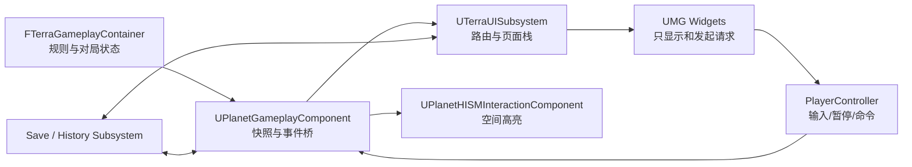

# TerraCivilization UI 系统设计总稿

> 本文定义游戏 UI 的信息架构、页面状态编排、运行时职责、数据契约和分期验收。它是菜单、局内 HUD、暂停、科技选择、教学引导、LLM Agent 可视化、回合日志、结算、存档和历史记录的唯一 UI 设计入口。
>
> 本文不改变棋盘规则。`FTerraGameplayContainer` 及其所属的 `UPlanetGameplayComponent` 仍是对局状态与规则判定的唯一权威；UI 只观察状态、请求已定义的操作，并呈现结果。

---

## 0. 目标与边界

### 0.1 目标

- 建立从启动到退出的完整单人体验：主页面、开局配置、教学入口、历史记录、设置、局内 HUD、暂停、结算和退出确认。
- 让对局的关键状态可见：当前回合、当前阵营、选择与可行动格、科技待选、教学目标、Agent 思考、行动日志和胜负结果。
- 把“继续游戏”“回到上次存档点”“历史回放”统一建立在可版本化的存档快照和确定性行动记录之上。
- 增强而不替代当前 HISM 地块描边：棋盘仍承担空间反馈，UI 补充语义、说明、图例和可访问的信息通道。
- 首期只支持本地单人。页面、数据和路由不预设多人房间、匹配或网络同步。

### 0.2 非目标

- 不在本稿中确定最终卡牌插画、音效、动画、材质或商业化视觉资产。
- 不把每帧棋盘状态复制到 UMG，也不让 Widget 直接修改 Container 内部字段。
- 不将当前 G7 的 `.jsonl` 行动日志误当作完整存档；它缺少初始快照、随机种子、版本和 UI/相机状态。
- 不把教学关或 LLM Agent 做成另一套规则入口；二者继续经既有 Gameplay 校验链路执行。

---

## 1. 总体体验与页面地图

游戏始终处于一个明确的 UI 路由状态。全屏页面负责“去哪里”，局内叠层负责“此刻发生什么”，模态窗口负责“必须先做的选择”。同一时刻最多有一个阻塞模态窗口。

```text
启动
  -> 主页面
       -> 新游戏配置 -> 创建对局 -> 局内 HUD
       -> 继续游戏 -> 读取最近有效存档 -> 局内 HUD
       -> 教学关列表 -> 选择 Scenario -> 局内 HUD + 教学叠层
       -> 历史记录 -> 对局详情 / 回放 -> 局内回放 HUD
       -> 设置
       -> 退出确认 -> 退出进程

局内 HUD
  -> ESC 暂停菜单
  -> 科技三选一（回合结算阻塞）
  -> 对局结算（胜利或失败）
  -> 返回主页面确认
```

### 1.1 路由状态

| 状态 | 页面或叠层 | 是否暂停世界 | 是否阻塞棋盘输入 | 入口 |
| --- | --- | ---: | ---: | --- |
| `MainMenu` | 主页面 | 是/无世界 | 是 | 启动、返回主页 |
| `NewGameSetup` | 新游戏配置 | 是/无世界 | 是 | 主页面“新游戏” |
| `TutorialSelect` | 教学关列表 | 是/无世界 | 是 | 主页面“教学关” |
| `History` | 历史记录 | 是/无世界 | 是 | 主页面“历史记录” |
| `Settings` | 设置 | 取决于来源 | 取决于来源 | 主页面或暂停菜单 |
| `InGame` | HUD | 否 | 否 | 创建/恢复/教学进入 |
| `Paused` | 暂停菜单 | 是 | 是 | ESC |
| `TechnologyChoice` | 科技三选一模态 | 否 | 是 | Gameplay 请求选择 |
| `EndMatch` | 结算页面 | 是 | 是 | Gameplay 宣布终局 |
| `Replay` | 回放 HUD | 否 | 是 | 历史对局“回放” |
| `ConfirmExit` | 退出确认模态 | 继承父状态 | 是 | 任意退出操作 |

`Settings` 必须记住来源路由。关闭设置时，主页面来源返回 `MainMenu`，暂停菜单来源返回 `Paused`，不能意外恢复棋盘输入。

### 1.2 输入与层级

| 层级 | 内容 | 输入模式 |
| --- | --- | --- |
| `Screen` | 主页面、新游戏、教学、历史记录 | `UI Only` |
| `HUD` | 回合、状态、日志、提示、Agent 面板 | `Game and UI` |
| `Overlay` | 教学文字指示牌、选择说明、轻量提示 | `Game and UI`；不抢占棋盘点击 |
| `Modal` | 暂停、科技选择、结算、确认退出 | `UI Only`；焦点锁定在模态内 |

`PlayerController` 负责 ESC、焦点和 `InputMode`；`UTerraUISubsystem` 负责页面栈和 Widget 生命周期；Widget 不自行调用 `SetInputMode` 或 `SetGamePaused`，以避免多层窗口互相覆盖状态。

---

## 2. 运行时架构

### 2.1 推荐职责划分

| 类型 | 职责 |
| --- | --- |
| `UTerraUISubsystem`（建议 `ULocalPlayerSubsystem`） | UI 路由、Widget 栈、统一打开/关闭模态、维护当前对局会话引用。 |
| `ATerraPlayerController` 或现有 PlayerController | ESC、UI/游戏输入模式、鼠标显示、暂停和 UI 命令转发。 |
| `UTerraGameInstanceSubsystem`（存档/历史） | 枚举和读写本地 Profile、设置、对局快照、历史索引；不持有 UMG。 |
| `UPlanetGameplayComponent` | 运行中对局的唯一协调入口；向 UI 发布稳定事件和只读快照。 |
| `FTerraGameplayContainer` | 规则、回合、胜负、科技、行动记录的唯一权威。 |
| `UPlanetHISMInteractionComponent` | 空间命中与棋盘描边渲染；接收由 UI 选择的语义层，但不依赖 Widget。 |
| `UTerraTutorialScenarioData` | 教学关静态配置和显示信息来源。 |
| `UTerraTechnologyDefinitionData`（建议新增） | 科技名称、描述、图标、标签、稀有度与 UI 展示排序；规则 ID 仍来自 Gameplay 枚举。 |

首期可以把 UI C++ 类放在 `TerraCivilization` 模块内，避免过早拆模块；`TerraCivilization.Build.cs` 需要加入 `UMG`、`Slate` 和 `SlateCore`。当导航、手柄焦点或跨平台层叠需求稳定后，再评估启用并迁移到 `CommonUI`，不要求首期一次性引入。

### 2.2 状态流



原则：Widget 发出“请求”，Gameplay 返回“成功、失败或新的状态”。例如科技卡点击只能请求 `ChoosePendingTechnology(FactionId, TechnologyId)`；是否允许选择、候选是否过期、是否要继续生成下一组候选，均由 Gameplay 判断后以事件回推 UI。

### 2.3 对 UI 暴露的事件

不建议让 Widget 高频轮询整个 Container。`UPlanetGameplayComponent` 应在实际状态变化后发布轻量事件，并提供按需读取的只读快照。

| 事件 | 触发时机 | UI 更新 |
| --- | --- | --- |
| `OnMatchInitialized` | 随机局、存档局、教学局初始化完成 | HUD、局内种子、教学叠层、自动存档基线。 |
| `OnTurnStateChanged` | 回合、阵营、阶段或可操作状态变化 | 顶部回合条、阵营状态、行动提示。 |
| `OnSelectionStateChanged` | 选中棋子、预览路径、风险或目标变化 | 右侧信息栏、悬浮说明、棋盘语义高亮。 |
| `OnActionCommitted` | 一次完整行动结束并产生结构化日志 | 回合日志、经历时间线、自动存档。 |
| `OnTechnologyChoiceRequested` | 当前阵营进入待选科技状态 | 打开科技三选一模态。 |
| `OnTechnologyChosen` | 选择成功且规则结算完成 | 科技图标栏、事件提示、历史快照。 |
| `OnTutorialStepChanged` | 教学条件或脚本推进 | 指示牌、目标列表、强调高亮。 |
| `OnAgentThoughtUpdated` | Agent 工具调用、计划、校验或执行结果变化 | Agent 思考面板和棋盘 Agent 高亮。 |
| `OnMatchEnded` | 胜者确定、对局封盘 | 固化最终快照，打开结算页面。 |
| `OnSaveStateChanged` | 存档成功/失败/槽位变化 | 暂停菜单、主页面“继续游戏”可用性。 |

事件只传递稳定 ID、枚举和摘要；长文本、棋子详情、科技详情和行动历史由 UI 通过快照接口读取。所有 Blueprint 可见数据使用 `BlueprintType` 的 DTO，不直接暴露 `TUniquePtr`、内部容器或可写引用。

---

## 3. 页面与交互规格

### 3.1 主页面 `WBP_MainMenu`

主页面应在地图加载前或专用前台地图上可用。背景优先使用真实的星球棋盘/预渲染场景，菜单置于画面安全区域；避免把整个前台设计成无信息的卡片墙。

| 按钮 | 行为 | 可用条件 |
| --- | --- | --- |
| 新游戏 | 进入 `NewGameSetup` | 始终可用。 |
| 继续游戏 | 加载最近一次有效对局快照 | 存在通过版本和完整性校验的最近快照。否则置灰并显示“暂无可继续的对局”。 |
| 教学关 | 进入 `TutorialSelect` | 始终可用。 |
| 历史记录 | 进入 `History` | 始终可用；为空时显示空状态。 |
| 设置 | 打开 `Settings` | 始终可用。 |
| 退出 | 打开 `ConfirmExit` | 始终可用。 |

不展示多人入口、网络状态或匹配按钮。

### 3.2 新游戏 `WBP_NewGameSetup`

该页只收集“创建对局所需且可复现”的参数。点击开始后冻结为 `FTerraMatchStartConfig`，写入初始快照和历史索引。

| 区域 | 字段 | 要求 |
| --- | --- | --- |
| 随机种子 | `WorldSeed` | 数字输入、随机生成图标按钮、复制当前种子；保留用户输入，非法值给出字段级反馈。 |
| 地形生成 | 细分等级、地形预设、山地/森林密度、是否生成中立单位等已有可配置项 | 字段必须映射到真实 WorldGen/Gameplay 配置；未支持的项不在 UI 伪造。 |
| 本阵营 | 阵营颜色、可选名称 | 颜色以色板呈现；需与其他阵营调色板可辨识，禁止选中导致与中立/高亮颜色混淆的颜色。 |
| 操作 | 开始游戏、返回 | 开始前校验全部字段；返回不创建存档。 |

首期“本阵营颜色”是表现配置，不改变阵营 ID、回合顺序和规则归属。若当前游戏固定为 12 阵营循环，应清楚显示玩家控制的阵营，其他阵营仍由既有 NPC/Agent 配置接管。

### 3.3 教学关 `WBP_TutorialSelect`

列表数据来自一个教学关目录 Data Asset，不通过扫描 Content Browser 生成。目录项引用 `UTerraTutorialScenarioData` 的 Soft Object Path，并至少拥有：`ScenarioId`、显示名称、简述、顺序、前置关卡、缩略图、预计时长和完成状态。

每个条目显示主题、已完成/未完成状态和锁定原因。点击已解锁条目后：保存当前前台状态，加载教学外壳地图，并通过既有 `TutorialScenario` 参数或等效会话配置创建固定局面；不复制单独的玩法地图。

教学关退出到主页面前应记录完成结果。重试教学关使用同一 `ScenarioId` 重建初始状态，不使用普通随机“再来一局”。

### 3.4 历史记录 `WBP_History`

左侧为对局列表，右侧为选中对局详情。列表以 `UTerraMatchHistoryIndexSaveGame` 提供的轻量元数据加载，不能为绘制列表而读取每一份完整快照。

| 详情区 | 内容 |
| --- | --- |
| 对局概览 | 开始/结束时间、模式、种子、回合数、最终结果、获胜阵营。 |
| 游戏经历 | 从行动记录和关键事件聚合的时间线，如首次升变、阵营击败、关键科技、终局。 |
| 科技进度 | 各阵营已解锁科技和解锁回合；默认突出玩家阵营。 |
| 操作 | 查看详情、开始回放、删除记录（需单独确认）、返回。 |

回放必须加载“初始快照 + 已提交行动记录”，逐项送入同一个校验/执行入口；不得通过直接改棋盘坐标播放。若当前版本无法重放某条历史，应保留它的详情并标为“仅可查看，版本不兼容”，不能静默展示错误局面。

### 3.5 局内 HUD `WBP_InGameHUD`

HUD 是非阻塞信息层。推荐三区结构：

| 位置 | 内容 | 行为 |
| --- | --- | --- |
| 顶部 | 回合数、当前阵营、阶段、暂停/设置图标 | 始终可见，紧凑。 |
| 左侧 | 阵营概览、玩家科技、当前目标/教学任务 | 可折叠；不遮挡棋盘中心。 |
| 右侧 | 当前选中棋子、行动路径、风险说明、回合日志、Agent 思考 | 使用标签页或可折叠区，避免多个面板同时占用棋盘。 |
| 底部 | 轻量操作反馈、教学文字指示牌、非阻塞事件提示 | 自动淡出；关键教学内容可固定到当前步骤结束。 |

HUD 中的所有棋子、Cell 和日志条目均应可点击“聚焦”。点击后调用既有相机聚焦能力并请求 HISM 语义高亮，不直接移动棋子。

### 3.6 暂停菜单 `WBP_PauseMenu`

ESC 在 `InGame` 状态打开暂停菜单，并将焦点置于“继续”。

| 按钮 | 行为 |
| --- | --- |
| 保存 | 请求创建命名/快速存档；成功后显示时间与槽位，失败显示可恢复错误。 |
| 继续 | 关闭暂停并恢复原输入模式。 |
| 返回主页面 | 先请求保存或放弃确认；确认后卸载对局会话并回到主页面。 |
| 设置 | 打开设置，保留暂停状态作为返回点。 |

对局已结束时不再使用暂停菜单处理“重开/退出”；这些操作归结算页面负责。

### 3.7 胜利/失败结算 `WBP_EndMatchScreen`

终局事件触发后，先以最终状态写入不可变存档和历史索引，成功或明确失败后再展示结算页。结算标题由“玩家是否为获胜阵营”决定，而不是只显示全局胜者。

| 内容 | 数据来源 |
| --- | --- |
| 结果 | `WinnerFactionId`、玩家阵营 ID、终局原因、总回合数。 |
| 本局经历 | G7 行动日志、关键事件、教学步骤、Agent 行动和科技选择形成的时间线。 |
| 达成成就 | `UTerraAchievementSubsystem` 评估本局事件后的只读结果；没有该系统时显示预留区域，不以 UI 临时推断。 |
| 获得科技 | 玩家阵营已拥有科技及其解锁顺序；可切换查看其他阵营。 |
| 操作 | 回到上次存档点、再来一局、回到主页面、退出游戏。 |

“回到上次存档点”只加载该对局最后一个合法检查点快照，默认不覆盖它。“再来一局”对普通局沿用同一 `FTerraMatchStartConfig`（包括种子和地形配置），教学局则重建同一 `ScenarioId`；若未来需要“全新随机一局”，它属于主页面的新游戏入口。

### 3.8 科技三选一 `WBP_TechChoiceModal`

该模态在 `OnTechnologyChoiceRequested` 后立即打开。卡牌数量按真实候选数量展示：通常为三张，候选池不足时可为一至两张；空候选由 Gameplay 自动跳档，不显示无法完成的弹窗。

每张科技卡显示图标、名称、效果描述、受影响单位/地形标签以及已拥有科技的兼容性提示。选择后：

1. 锁定按钮，防止重复提交。
2. 调用规则层选择接口。
3. 成功则关闭或刷新下一组待选候选；失败则恢复按钮并显示规则返回的原因。

在科技选择期间，世界可保持渲染和镜头移动，但棋盘行动、ESC 暂停与其他模态均被阻塞。`UMG` 不自行决定何时推进回合。

---

## 4. 增强系统

### 4.1 地块高亮与 UI 语义层

现有 `UPlanetHISMInteractionComponent` 的 per-instance 高亮是空间真相，UI 不绘制一张与棋盘脱节的二维格子图。增强方式是为每个语义层定义来源、颜色、优先级和辅助文本。

| 语义 | 棋盘高亮 | UI 补充 | 优先级 |
| --- | --- | --- | ---: |
| Hover | 现有白色/指定 hover 边框 | Cell 名称、地形、占用信息的悬浮提示 | 1 |
| 当前阵营可操作棋子 | 现有阵营底色 | 左侧回合提示 | 2 |
| 已选棋子 | 黄色边框 | 右侧棋子详情与可执行动作 | 5 |
| 可移动/跳跃落点 | 蓝色系边框 | 行动路径与风险摘要 | 4 |
| 远程攻击/待捕获 | 红橙色边框 | 目标、主攻、先锋与后果说明 | 6 |
| 教学推荐目标 | 青绿色脉冲边框 + 指向箭头 | 文字指示牌与目标清单 | 7 |
| Agent 正在评估 | 紫灰色低强度边框 | Agent 思考面板中的对应步骤 | 3 |
| 不可执行/风险警告 | 低饱和红色短暂提示 | 错误或风险原因 | 8 |

同一 Cell 只渲染最高优先级的主色；次级语义显示在 HUD 详情中，不把边框混成难以辨认的颜色。色盲模式应允许将颜色替换为图案、线型和图标，不能仅依赖红绿区分。

### 4.2 教学文字指示牌

教学 UI 由 `UTerraTutorialScenarioData` 的静态信息和一个运行时 `UTerraTutorialStepDefinition` 序列驱动。每一步包含：步骤 ID、标题、正文、完成条件、可选关联 Cell/Piece、建议相机焦点、强调高亮语义和是否可跳过。

指示牌默认位于屏幕底部安全区，不跟随 3D Cell 浮动，避免相机旋转时遮挡棋盘。关联 Cell 仅用于高亮与“聚焦”按钮。教学步骤不能通过 Widget 直接放行非法操作；若未来需要限制操作，必须由 Gameplay 定义一个可验证的教程约束策略。

### 4.3 LLM Agent 思考输出

Agent 面板展示“可公开、可复核的操作轨迹”，而不是要求模型输出冗长的内部推理。每条记录由 Agent/工具链提供以下结构化字段：时间、阵营、阶段、工具名、摘要、关联棋子/Cell、校验结果和最终执行结果。

建议状态：`观察中`、`评估候选`、`请求预览`、`确认行动`、`规则拒绝`、`已执行`。点击记录可聚焦关联棋子/Cell，并临时启用 Agent 语义高亮。敏感或过长文本应折叠为“摘要 + 可展开工具结果”，日志中不得以 UI 文案伪造规则结论。

现有 `ui_begin_turn_review`、`ui_select_piece`、`ui_preview_move`、`ui_cancel_selection`、`ui_confirm_action` 可以天然映射为这类面板条目；真正行动仍通过既有 validated action 网关。

### 4.4 回合日志

局内日志是最近事件流，历史详情是可搜索的完整行动记录。二者都以 G7 的结构化日志和后续关键事件为源：移动、连跳、捕获、升变、阵营失败、科技选择、存档、教学推进和 Agent 执行。

日志条目采用一句可本地化的摘要，例如“第 12 回合，阵营 3 的 41 号骑兵完成连跳并捕获 2 枚棋子”。摘要由字段格式化生成，不能只保存不可解析的自由文本。点击条目可聚焦路径最后一个 Cell；回放模式可跳至该行动前后。

---

## 5. 存档、检查点与历史数据

### 5.1 三类本地数据

| 数据 | 建议类型 | 生命周期 | 用途 |
| --- | --- | --- | --- |
| 设置与 Profile | `UTerraProfileSaveGame` | 跨所有对局 | 音视频、输入、无障碍、玩家偏好、最近有效存档 ID、教学完成状态。 |
| 对局快照 | `UTerraMatchSaveGame` | 单局多个检查点 | 继续游戏、暂停保存、返回检查点、恢复对局。 |
| 历史索引 | `UTerraMatchHistoryIndexSaveGame` | 跨对局 | 列表元数据、已归档对局、路径、兼容性状态。 |

### 5.2 对局快照的最小内容

快照必须包含格式版本、对局 ID、保存原因、保存时间、`FTerraMatchStartConfig`、完整 Gameplay 规则状态、科技状态、随机流状态、已提交行动记录、玩家阵营、教学 `ScenarioId`（如适用）和必要的相机/UI 恢复状态。

检查点至少在以下时机写入：对局创建后、每次已提交行动和科技选择完成后、手动保存时、进入终局前后。异步保存失败不能假装成功；保留上一份有效检查点，并向 UI 发布错误。

### 5.3 版本与完整性

每份快照记录 `SaveFormatVersion`、游戏构建版本和 Gameplay 规则版本。读取时执行：文件存在性、反序列化、版本迁移、拓扑/棋子/科技状态校验和随机流一致性校验。失败时标记该存档不可继续，但历史索引仍应保留其可解释信息。

“继续游戏”只指向 Profile 记录的最近有效、未结束对局。已结束对局归档到历史记录，不在主页面作为继续游戏。

---

## 6. 资产与数据清单

### 6.1 首期必需资产

| 分类 | 建议资产 |
| --- | --- |
| 字体 | 一套授权清晰、覆盖简体中文与常用符号的 UI 字体；数字可配等宽备用字体。 |
| Widget Blueprint | `WBP_MainMenu`、`WBP_NewGameSetup`、`WBP_TutorialSelect`、`WBP_History`、`WBP_InGameHUD`、`WBP_PauseMenu`、`WBP_Settings`、`WBP_TechChoiceModal`、`WBP_EndMatchScreen`、`WBP_ConfirmDialog`。 |
| 可复用子 Widget | 按钮、设置行、科技卡、教程条目、历史条目、日志条目、阵营标记、棋子信息、提示气泡。 |
| 图标 | 新建、继续、教学、历史、设置、退出、保存、返回、重试、播放、暂停、随机种子、科技、日志及各兵种/地形。优先统一使用一套线性图标库。 |
| Data Asset | `DA_TerraUIStyle`、教学关目录、科技显示定义、成就定义（可先为空）、阵营颜色调色板。 |
| 存档类 | Profile、Match、History Index 三类 `USaveGame`。 |

`DA_TerraUIStyle` 统一管理颜色、边距、字号层级、描边、动画时长和高亮语义色；Widget 不散落硬编码颜色。游戏状态色需要与现有 HISM 高亮颜色共享同一份语义定义或由同一 Data Asset 派生。

### 6.2 内容命名与目录

```text
Content/UI/
  Widgets/
  Components/
  Icons/
  Fonts/
  Styles/DA_TerraUIStyle
  Tutorial/DA_TutorialCatalog
  Technology/
  Achievements/
```

教学 Scenario 继续置于既有 `/Game/Tutorial/Scenarios/`，UI 目录只持有其目录索引，不复制关卡配置。

---

## 7. 分期落地与验收

### UI0：骨架与前台

- 添加 UMG 依赖，建立 UI Subsystem、路由状态、统一确认对话框和基础 UI Style。
- 落地主页面、新游戏配置、设置和退出确认；新游戏参数能以真实配置创建对局。
- 验收：键鼠可完整进入新局、返回主页面与退出确认；没有无效的多人入口；每个按钮焦点和禁用态正确。

### UI1：局内 HUD 与暂停

- 落地 HUD、ESC 暂停、保存、返回主页确认、回合/阵营/选择信息和基本日志。
- 提供 Gameplay 事件桥和只读快照；接入现有 HISM 高亮语义。
- 验收：打开/关闭暂停不丢失输入模式；HUD 不阻挡棋盘主操作；日志与真实已提交行动一致。

### UI2：科技、教学和 Agent 可视化

- 落地科技三选一、教学关列表和文字指示牌、Agent 面板与语义高亮。
- 验收：科技弹窗准确阻塞回合并可连续处理多次解锁；教学关通过 Scenario 启动；Agent 每次工具调用只显示实际结构化状态。

### UI3：存档、结算与历史

- 落地检查点、继续游戏、终局结算、回到检查点、再来一局、历史详情与回放。
- 验收：中断后恢复对局与保存前状态一致；终局只归档一次；同种子/行动记录回放一致；不兼容存档不会损坏可继续列表。

### UI4：打磨与无障碍

- 手柄导航、可重映射、UI 缩放、色盲模式、屏幕阅读器文本、动态文本溢出检查、音效与动效。
- 验收：1280x720 到 4K、16:9 与超宽屏下文字不遮挡；所有模态能从键盘/手柄返回；高亮语义不只依赖颜色。

---

## 8. 实施约束与风险

- 当前 G6 旧稿中“失败阵营棋子移除”的表述已被主玩法设计中的 G11 阵营转归规则取代。UI 必须以当前源码和 `SimpleGameplayDesign.md` 为准，不能依据旧稿把转归棋子显示为消失。
- UI 的“结束回合”“科技选择”“返回检查点”“回放下一步”必须走明确的 Gameplay/存档入口，禁止 Widget 通过直接写状态模拟结果。
- 快照、历史、回放和教学均依赖稳定 ID。`ScenarioId`、科技枚举值、棋子 ID、CellId、行动日志字段和存档版本不可为了展示随意重命名或重排。
- Agent 面板展示工具轨迹和结果摘要即可；不要把不可验证的长篇自由文本作为“规则解释”或存档权威数据。
- 先用占位图标、统一字体和 Style Data Asset 建立信息层级，再投入卡牌插画与复杂过场。此项目当前最大的 UI 风险是状态边界和恢复一致性，不是装饰资产不足。

---

## 9. 完成定义

当玩家能从主页面开始一局可复现的随机局或教学局，在局内理解回合、选择、高亮、科技、Agent 与日志，通过 ESC 保存和返回，在胜负后查看经历/成就/科技并重试、回档、归档或退出，同时可从历史记录安全查看或回放已完成对局时，本 UI 系统达到本稿定义的完整闭环。
