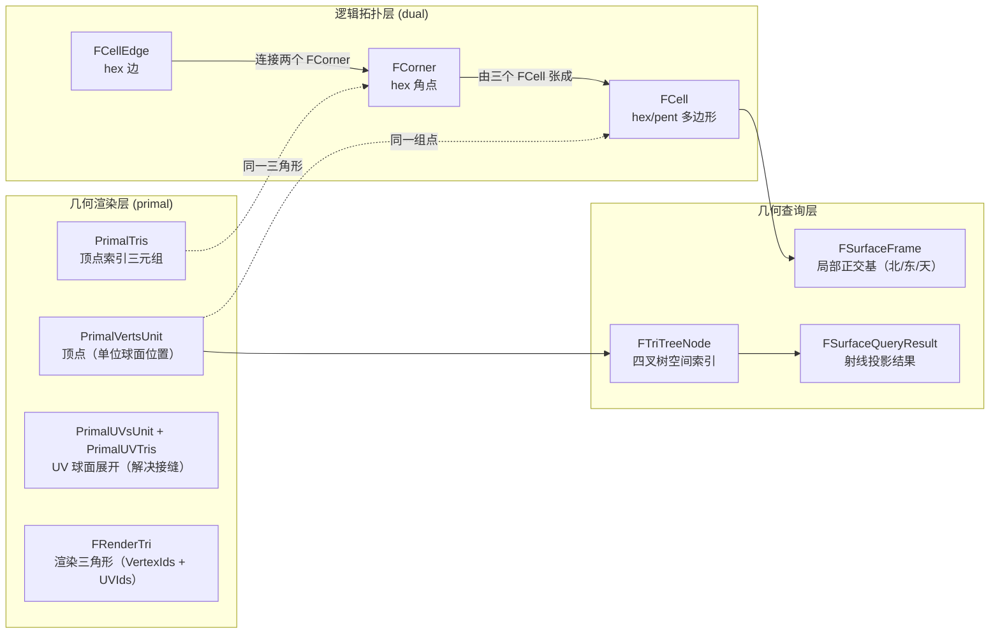
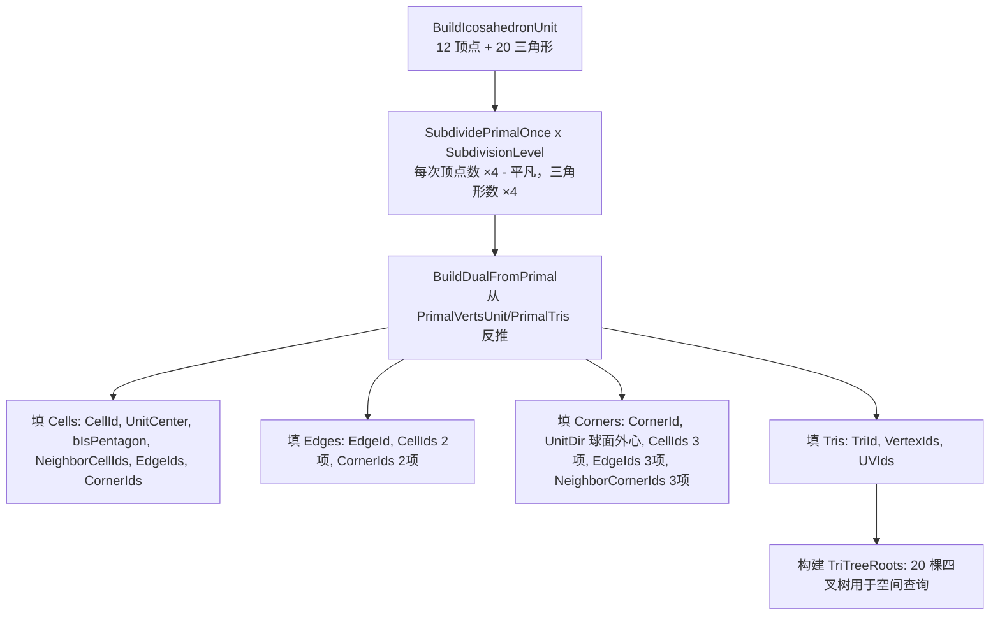

# 球面拓扑结构参考稿（Sphere Topology Reference）

> **本文档定位**：TerraCivilization 球面拓扑（[`FSphereTopology`](../Source/Grid/Public/FSphereTopology.h) 及其字段族）的**几何含义权威参考**。所有下游模块（[WorldGenDesign.md](WorldGenDesign.md) / [SphericalSDFTerrainDesign.md](SphericalSDFTerrainDesign.md) / [TechnicalDesign.md](TechnicalDesign.md) §6 Gameplay）在引用 `FCell` / `FCorner` / `FCellEdge` 等字段时，**必须以本稿为准**——避免凭头文件注释口口相传产生几何理解偏差。
>
> **使用方式**：
> - 写代码时遇到拿不准的几何概念（"FCorner 到底是 hex 角点还是三角形重心？"）→ 查 [§3](#3-数据结构逐字段含义).
> - 设计算法时需要数量公式（"sub=4 时有多少 cell？"）→ 查 [§5](#5-数量公式与索引规约).
> - 遇到"5/6 三角形 = 一个 hex"的视觉错觉 → 查 [§6](#6-视觉错觉防御hex-边并非56-个完整三角形组合).
> - 头文件注释与本稿冲突时 → **以本稿为准**（已确认头文件部分注释滞后实现，详见 [§9](#9-已知不一致点与待澄清项)）.
>
> **关联文件**：
> - 实现：[FSphereTopology.h](../Source/Grid/Public/FSphereTopology.h) / [FSphereTopology.cpp](../Source/Grid/Private/FSphereTopology.cpp)
> - 字段：[FCell.h](../Source/Grid/Public/FCell.h) / [FCorner.h](../Source/Grid/Public/FCorner.h) / [FCellEdge.h](../Source/Grid/Public/FCellEdge.h) / [FRenderTri.h](../Source/Grid/Public/FRenderTri.h) / [FSurfaceFrame.h](../Source/Grid/Public/FSurfaceFrame.h) / [FSurfaceQueryResult.h](../Source/Grid/Public/FSurfaceQueryResult.h)
> - 查询：[FSphereTopologyQuery.h](../Source/Grid/Public/FSphereTopologyQuery.h)
> - 几何不变量论证：[SphericalSDFTerrainDesign.md §14.7](SphericalSDFTerrainDesign.md#147-球面重心坐标与外心折角修正核心几何不变量)

---

## 0. 摘要 + 速查卡

### 0.1 一句话定义

`FSphereTopology` 同时持有**两套互为对偶的球面网格**：

| 视图 | 几何元素 | cpp 字段 | 数量（sub=N） |
| --- | --- | --- | --- |
| **逻辑层（dual = Goldberg 多面体）** | hex / pent 多边形 = `FCell` | `Cells` | `10·4^N + 2` |
| **逻辑层** | hex / pent 边 = `FCellEdge` | `Edges` | `30·4^N` |
| **逻辑层** | hex / pent 角点 = `FCorner` | `Corners` | `20·4^N` |
| **渲染层（primal = 测地线球面 / geodesic icosahedron）** | 三角形 = `FRenderTri` | `Tris` | `20·4^N` |
| **渲染层** | 顶点 = primal vertex（也即 `FCell.UnitCenter`） | `PrimalVertsUnit` | `10·4^N + 2` |

**核心对偶关系**：

```
primal 顶点  ⟷  dual 面（FCell 中心）
primal 面    ⟷  dual 顶点（FCorner）
primal 边    ⟷  dual 边（FCellEdge）
```

**12 五边形不变量**：球面正二十面体的 12 个原始顶点细分后**永远是 5 邻接的 cell**——这是球面 Goldberg 多面体的几何刚性特征，是 Civ 类玩法"12 势力基地"的天然锚点。

### 0.2 速查卡：常见混淆纠正

| 错误直觉 | 正确认知 | 出处 |
| --- | --- | --- |
| "Cell = 三角形" | ❌ Cell = hex/pent 多边形（dual 视图） | §3.2 |
| "Corner = 三角形重心" | ❌ Corner = 球面**外心**（已重构，头文件注释滞后） | §3.4 / §9.1 |
| "一个 hex 由 6 个完整三角形组成" | ❌ 一个 hex 由 6 个三角形**各贡献 1/3 角块**组成 | §6 |
| "primal 三角形分'内部'与'过渡'两类" | ❌ 所有 primal 三角形地位完全等价 | §6 |
| "hex 边 = primal 三角形边" | ❌ hex 边在 primal 三角形**内部**穿过（外心→边中点连线） | §4.3 |
| "Subdivision=N 即递归 N 次" | ✅ 正确——sub=0 是初始正二十面体，每次细分顶点数 ×4 | §2.2 |
| "sub=N 时三角形数 = 20·N²" | ❌ 是 `20·4^N`（每次细分四叉树式扩展） | §5.1 |

---

## 目录

- [1. 几何基础：三套互相绑定的球面网格](#1-几何基础三套互相绑定的球面网格)
- [2. 正二十面体细分流程](#2-正二十面体细分流程)
- [3. 数据结构逐字段含义](#3-数据结构逐字段含义)
- [4. 关键几何不变量](#4-关键几何不变量)
- [5. 数量公式与索引规约](#5-数量公式与索引规约)
- [6. 视觉错觉防御（hex 边并非 5/6 个完整三角形组合）](#6-视觉错觉防御hex-边并非56-个完整三角形组合)
- [7. 查询接口（FSphereTopologyQuery）](#7-查询接口fspheretopologyquery)
- [8. 与下游模块的契约](#8-与下游模块的契约)
- [9. 已知不一致点与待澄清项](#9-已知不一致点与待澄清项)
- [10. 名词索引 + 速查卡](#10-名词索引--速查卡)
- [11. 顶点法线与 UE5 光照约定（重要结论 + 经验沉淀）](#11-顶点法线与-ue5-光照约定重要结论--经验沉淀) ⭐

---

## 1. 几何基础：三套互相绑定的球面网格

### 1.1 测地线球面（geodesic icosahedron / primal mesh）

从一个**正二十面体**（icosahedron, 20 三角形 + 12 顶点 + 30 边）出发，每次"细分"把每个三角形拆成 4 个小三角形（连接三条边的中点），并把所有新顶点投射到单位球面上。这就是**测地线球面**：

- 由若干**全等三角形**密铺而成（细分越多越接近正球）
- 顶点数随细分级数指数增长：`Vsub_N = 10·4^N + 2`
- 三角形数：`Tsub_N = 20·4^N`
- 边数：`Esub_N = 30·4^N`

### 1.2 戈德堡多面体（Goldberg polyhedron / dual mesh）

把测地线球面做**对偶变换**：每个 primal 三角形换成一个 dual 顶点（位于该三角形外心）；每个 primal 顶点换成一个 dual 面（hex 或 pent）；每条 primal 边换成一条 dual 边（连接两个相邻三角形的外心）。

- **绝大多数 dual 面是六边形（hex）**——对应 primal 中"6 邻接顶点"
- **恰好 12 个 dual 面是五边形（pent）**——对应 primal 中原始正二十面体的 12 个顶点（5 邻接）
- 12 个 pent 永远存在、永远 5 邻接——这是球面 Goldberg 多面体的**几何刚性特征**（不可被细分级数改变）

### 1.3 对偶关系一图概览

| 测地线球面（primal，渲染层） | 戈德堡多面体（dual，逻辑层） |
| --- | --- |
| **顶点** = `FCell.UnitCenter`（位于单位球面） | **面** = `FCell`（hex 占 6 个三角形 1/3 区域、pent 占 5 个） |
| **三角形** = `FRenderTri` 或 `FCorner` 的载体 | **顶点** = `FCorner`（hex/pent 的角点；正是 dual 三个面的交点） |
| **边** = 两个 Cell 中心之间的连线 | **边** = `FCellEdge`（两个 Corner 之间的连线，即 hex/pent 的边） |

> **关键澄清**：在 [`FSphereTopology`](../Source/Grid/Public/FSphereTopology.h) 中：
> - `PrimalVertsUnit[i]` 与 `Cells[i].UnitCenter` 是**同一个点**（CellId 即 primal 顶点 id）；
> - `PrimalTris[i]` 与 `Tris[i].VertexIds`、`Corners[i].CellIds` 描述**同一个 primal 三角形**的三个顶点（即三个 Cell）；
> - 一个 `FCorner` 同时承担"primal 三角形的几何代表"与"dual hex/pent 的角点"双重身份——这是对偶变换的精髓。

### 1.4 球面网格的"三层视图"

后续模块在不同上下文下会切换视图，必须明确当前在哪一层：



**视图切换原则**：
- **WorldGen** 主要在 dual 视图下工作（FCell 上写 GeoData、FCellEdge 上判板块边界）
- **GridRender** 同时使用两个视图：mesh 几何走 primal（顶点 = FCell 中心）、着色判别走 dual（hex/pent 区域 SDF）
- **Gameplay** 几乎纯 dual 视图（移动 / 围吃都基于 FCell.NeighborCellIds 的图）

---

## 2. 正二十面体细分流程

### 2.1 起始状态（SubdivisionLevel = 0）

正二十面体的 12 个顶点由 4 组黄金比例点构成（[`FSphereTopology::BuildIcosahedronUnit`](../Source/Grid/Private/FSphereTopology.cpp) 实现）：

```
φ = (1 + √5) / 2 ≈ 1.618
12 顶点（归一化后）：
  (0,  ±1, ±φ),  (±1, ±φ,  0),  (±φ,  0, ±1)
20 三角形：每个三角形的三个顶点都是 5-邻接的
30 边：每条边连接两个相邻三角形
```

**对偶视图（sub=0）**：12 个 pent，恰好对应 12 个 primal 顶点——这是球面上"全 pent"的唯一情形。

### 2.2 细分一次（[`FSphereTopology::SubdividePrimalOnce`](../Source/Grid/Private/FSphereTopology.cpp)）

对每个 primal 三角形 `(A, B, C)`：

1. 取三条边的中点 `M_AB, M_BC, M_CA`（`MidpointCache` 保证两个相邻三角形共享同一个中点）
2. 把每个中点**沿径向投影到单位球面**：`NewPos = (V_A + V_B) / 2; NewPos = NewPos.GetSafeNormal();`
3. 用 4 个小三角形 `(A, M_AB, M_CA), (B, M_BC, M_AB), (C, M_CA, M_BC), (M_AB, M_BC, M_CA)` 替代原三角形
4. 在 `FTriTreeNode::Children` 中记录这 4 个子节点（用于后续四叉树空间查询，详见 §7.1）

**对偶视图（sub=N → sub=N+1）**：每个 hex 在细分后**仍然是 hex**（6 邻接），但内部"裂解"出更多更小的 hex；12 个 pent **永远保持 pent 与位置不变**（继承自正二十面体的 12 个原始顶点）。

### 2.3 完整 Build 流程（[`FSphereTopology::Build`](../Source/Grid/Private/FSphereTopology.cpp)）



> **关键实现细节**：
> - `bIsPentagon` 通过统计每个 primal 顶点的邻接三角形数判定：== 5 则 pent，== 6 则 hex
> - 所有 dual 字段都通过遍历 `PrimalTris` 一次性填充——dual 数据结构是 primal 结构的"反向索引"
> - `Edges` 中每条边的 `CellIds` / `CornerIds` 按"从西往东"排序（详见 §3.3.2）

---

## 3. 数据结构逐字段含义

### 3.1 `FSphereTopology`（顶层容器）

| 字段 | 类型 | 几何含义 |
| --- | --- | --- |
| `SubdivisionLevel` | `int32` | 细分级数，决定网格分辨率（典型值 3~5） |
| `Cells` | `TArray<FCell>` | dual 视图：所有 hex/pent 多边形（含 12 个 pent + 其余 hex） |
| `Edges` | `TArray<FCellEdge>` | dual 视图：所有 hex/pent 边（每条边由两个相邻 Cell 共享） |
| `Corners` | `TArray<FCorner>` | dual 视图：所有 hex/pent 角点（每个角点是三个 Cell 的交汇点） |
| `Tris` | `TArray<FRenderTri>` | primal 视图：渲染用三角形（顶点 + UV 索引） |
| `TriTreeRoots` | `TArray<FTriTreeNode*>` | 20 棵四叉树（继承自正二十面体的 20 个原始三角形），用于 GPU/CPU 的"球面方向 → 所属 Cell"快速查询 |
| `PrimalVertsUnit` | `TArray<FVector>` | primal 顶点位置（单位球面，与 `Cells[i].UnitCenter` 一一对应） |
| `PrimalUVsUnit` | `TArray<FVector2D>` | UV 坐标，已做接缝处理（同一 primal 顶点在接缝处会有多个 UV 副本） |
| `UVToPrimalVert` | `TArray<int32>` | UV 索引 → primal 顶点索引的映射 |
| `PrimalTris` | `TArray<FIntVector>` | 顶点索引版的三角形列表（与 `Tris[i].VertexIds` 一致） |
| `PrimalUVTris` | `TArray<FIntVector>` | UV 索引版的三角形列表（与 `Tris[i].UVIds` 一致；同 id 与 `PrimalTris` 对应同一个三角形） |
| `PrimalTriTreeNodes` | `TArray<FTriTreeNode*>` | 所有 primal 三角形的树节点（叶子 + 中间节点） |
| `MidpointCache` | `TMap<uint64, int32>` | 细分时复用边中点的缓存（key 由两端点 id 编码，避免共享边产生重复点） |
| `UVCache` | `TMap<uint64, int32>` | UV 接缝处理用的缓存 |

> **CellId == 数组下标 == primal 顶点索引**（不变量）。

### 3.2 `FCell`（hex / pent 多边形 = dual 面）

| 字段 | 类型 | 几何含义 |
| --- | --- | --- |
| `CellId` | `int32` | 数组下标，也是 primal 顶点的索引 |
| `UnitCenter` | `FVector` | 单位球面上的位置；既是 dual 面的"中心"，也是 primal 三角形的一个**顶点** |
| `bIsPentagon` | `bool` | true 表示 5 邻接（恰好 12 个），false 表示 6 邻接（hex） |
| `NeighborCellIds` | `TStaticArray<int32, 6>` | 邻接 cell 列表；hex 用满 6 项，pent 仅前 5 项有效（第 6 项 = `INDEX_NONE`） |
| `EdgeIds` | `TStaticArray<int32, 6>` | 围绕本 Cell 的 hex/pent 边，与 `NeighborCellIds[i]` 一一对应（即 `EdgeIds[i]` 是连接到 `NeighborCellIds[i]` 的那条边） |
| `CornerIds` | `TStaticArray<int32, 6>` | 围绕本 Cell 的 hex/pent 角点（hex 6 个、pent 5 个） |

**邻接 / 边 / 角点的对应关系**（重要不变量）：

```
对 hex（6 邻接）：           对 pent（5 邻接）：
                                 
   Corner[0]                        Corner[0]
      ╱╲                              ╱╲
 N[5]  Edge[0]  N[0]            N[4]  Edge[0]  N[0]
   ╲╱      ╲╱                     ╲╱      ╲╱
   Corner[5]   Corner[1]          Corner[4]   Corner[1]
   ...                            ...
```

- `EdgeIds[i]` 的两个端点是 `CornerIds[i]` 与 `CornerIds[i+1]`（mod N）
- `EdgeIds[i]` 连接本 Cell 与 `NeighborCellIds[i]`

> **遍历技巧**：要得到本 Cell 的"边界折线"，按顺序遍历 `CornerIds[0..N-1]`（实现里已通过 `SortIndicesByAngleCW` 在构建时排好序）；要画到邻居的连线，遍历 `NeighborCellIds`。

#### 3.2.1 关键方法

```cpp
int32 FCell::GetEdgeIdWithNeighborCellId(int32 NeighborCellId) const;
// 给定一个邻居 cell id，返回连接它的那条 EdgeId

int32 FCell::GetNeighborCellIdWithEdgeId(int32 EdgeId) const;
// 给定一条边 id，返回另一端的邻居 cell id
```

### 3.3 `FCellEdge`（hex / pent 边 = dual 边）

| 字段 | 类型 | 几何含义 |
| --- | --- | --- |
| `EdgeId` | `int32` | 数组下标 |
| `CellIds` | `TStaticArray<int32, 2>` | 边两侧的两个 Cell；**按"从西往东"排序**（见 §3.3.2） |
| `CornerIds` | `TStaticArray<int32, 2>` | 边两端的两个 Corner；**同样按"从西往东"排序** |
| `bIsPlateBoundary` | `bool` | WorldGen W2 写入：是否板块边界（详见 [WorldGenDesign.md §7.3](WorldGenDesign.md#73-板块边界类型判定汇聚张裂平移)） |
| `BoundaryStrength` | `float` | 板块边界强度（汇聚 / 张裂的相对速度模） |

> **Edge 是 hex/pent 的"边"，而不是 primal 三角形的边！** 注意区分：
> - primal 三角形的边 = 两个 `Cell.UnitCenter` 之间的连线（在 `FRenderTri` 中以 `VertexIds` 隐式表达，没有显式 struct）
> - dual hex 的边 = `FCellEdge`，连接两个相邻 hex 的角点（即外心方向上的两个 Corner）
>
> 这两种"边"在球面上是**相互垂直**的：每条 dual 边垂直于其对应的 primal 边（这是对偶变换的直接结论）。

#### 3.3.1 与三角形的关系

每条 `FCellEdge` 恰好对应**两个 primal 三角形的共享边**：
- 这两个三角形分别由两端的 Corner 代表（`CornerIds[0]` / `CornerIds[1]`）
- dual 边本身在球面上是**两个外心 Corner 之间的测地线**（详见 §4.3）

#### 3.3.2 "从西往东"排序约定

实现里 [FSphereTopology.cpp L497](../Source/Grid/Private/FSphereTopology.cpp) 用 `cross(Corners[A].UnitDir, Corners[B].UnitDir).Z < 0` 判断方向，本质是把"东"定义为 +Y 方向（绕 Z 轴的逆时针）。这个约定影响：
- `Edges[i].CellIds[0]` 永远在西侧、`[1]` 在东侧
- `Edges[i].CornerIds[0]` 永远在西侧、`[1]` 在东侧
- 任何"沿边方向"的算法都可以用这个约定避免方向歧义

> **注意**：在极区附近"东西"语义会退化（北极上方"东"是无定义的），但代码用的是几何 cross.Z 判别，对极区也给出一致结果——只是该结果不再有"地理东西"语义。

### 3.4 `FCorner`（hex / pent 角点 = dual 顶点 = primal 三角形的代表）

| 字段 | 类型 | 几何含义 |
| --- | --- | --- |
| `CornerId` | `int32` | 数组下标，也是对应 primal 三角形的索引（与 `Tris[i].TriId` 一致） |
| `UnitDir` | `FVector` | **球面外心方向**——对应 primal 三角形的外心，也即 dual hex 的角点（**注意**：[FCorner.h](../Source/Grid/Public/FCorner.h) 注释写"重心归一化"是滞后注释，实际实现已重构为外心，详见 §9.1） |
| `CellIds` | `TStaticArray<int32, 3>` | 本 Corner 是这三个 Cell 的共享角点（也即对应 primal 三角形的三个顶点） |
| `EdgeIds` | `TStaticArray<int32, 3>` | 从本 Corner 出发的三条 dual 边（连接到 3 个 NeighborCornerIds） |
| `NeighborCornerIds` | `TStaticArray<int32, 3>` | 通过 dual 边相连的 3 个邻居 Corner（每个邻居共享一条 hex 边） |

#### 3.4.1 关键不变量：Corner = 球面外心

> ⚠ **极其重要**（决定 SDF 渲染是否存在折角）：

`Corners[i].UnitDir` 必须取所属 primal 三角形 (V_A, V_B, V_C) 的**球面外心**：

$$
\hat{O} = \frac{(V_B - V_A) \times (V_C - V_A)}{\|(V_B - V_A) \times (V_C - V_A)\|}, \quad \text{并保证 } \hat{O} \cdot (V_A + V_B + V_C) > 0
$$

对应 [FSphereTopology.cpp L443](../Source/Grid/Private/FSphereTopology.cpp)：

```cpp
FVector Circumcenter = FVector::CrossProduct(VB - VA, VC - VA).GetSafeNormal();
if (FVector::DotProduct(Circumcenter, VA + VB + VC) < 0.0f) Circumcenter = -Circumcenter;
Corners[I].UnitDir = Circumcenter;
```

**为什么不用重心？** 详见 [SphericalSDFTerrainDesign.md §14.7.1](SphericalSDFTerrainDesign.md#1471-折角问题的发现)。简而言之：取重心会导致 dual hex 边在"两个相邻 primal 三角形交界处"出现可见折角；外心则保证 dual 边是平滑的测地线。

#### 3.4.2 三个等价身份

同一个 `FCorner` 同时是：

1. **primal 三角形的几何代表**——`CellIds` 是它的三个顶点
2. **dual hex/pent 的角点**——位于 `CellIds` 三个 Cell 的交汇处
3. **dual 顶点**——3 邻接（永远是 3，因为对偶之后正二十面体的"面"全部变成 3 度顶点）

> **数量一致性**：`Corners.Num() == Tris.Num() == PrimalTris.Num() == 20·4^N`——这是对偶关系的直接结论。

#### 3.4.3 关键方法

```cpp
int32 FCorner::GetEdgeIdWithNeighborCornerId(int32 NeighborCornerId) const;
// 给定一个邻居 corner id，返回连接它的那条 EdgeId

int32 FCorner::GetNeighborCornerIdWithEdgeId(int32 EdgeId) const;
// 给定一条边 id，返回另一端的邻居 corner id
```

### 3.5 `FRenderTri`（渲染三角形）

| 字段 | 类型 | 几何含义 |
| --- | --- | --- |
| `TriId` | `int32` | 数组下标（与 `Corners[i].CornerId` 一一对应） |
| `VertexIds` | `TStaticArray<int32, 3>` | 三个顶点的 primal 顶点索引（即三个 Cell 的 CellId） |
| `UVIds` | `TStaticArray<int32, 3>` | 三个顶点的 UV 索引（用 UVIds 而非 VertexIds 是为了处理球面 UV 接缝） |

> **`FRenderTri` 与 `FCorner` 描述的是同一个 primal 三角形**——区别仅在用途：
> - `FRenderTri` 提供"几何渲染所需的索引"（位置 + UV）
> - `FCorner` 提供"拓扑查询所需的引用"（dual 邻接、外心方向）

#### 3.5.1 UV 接缝处理

球面 UV 投影（如经纬度 / spherified-cube）在某些边上必须复制顶点：
- `PrimalVertsUnit[i]` 数量 = `10·4^N + 2`（无重复）
- `PrimalUVsUnit` 数量 ≥ `PrimalVertsUnit.Num()`（接缝边上的顶点会有 2 个 UV 副本）
- `UVToPrimalVert[uv_id]` 给出 UV 索引到顶点索引的反查

这就是为什么 `FRenderTri` 需要同时维护 `VertexIds`（位置插值用）与 `UVIds`（UV 插值用）两套索引。

### 3.6 `FTriTreeNode`（四叉树空间索引节点）

| 字段 | 类型 | 几何含义 |
| --- | --- | --- |
| `CellIds` | `TStaticArray<int32, 3>` | 本节点对应的三角形的三个顶点（CellId） |
| `Children` | `TStaticArray<FTriTreeNode*, 4>` | 四个子三角形（细分一次后产生）；叶子节点 4 个全 nullptr |
| `Father` | `FTriTreeNode*` | 上级节点；20 个根节点的 Father = nullptr |
| `Center` | `FVector` | 三角形中心（**单位球面**，用作 dot 距离粗筛——这里取重心而非外心，因为只用于"快速排除"，不影响精度） |
| `CornerId` | `int32` | 仅叶子节点有效，对应 `FSphereTopology::Corners` 的索引；非叶子 = `INDEX_NONE` |

#### 3.6.1 用途

CPU / GPU 的"球面方向 → 所属 Cell"查询：

```
1. 在 20 棵根树（TriTreeRoots）中，找 dot(dir, Center) 最大的 1 棵
2. 在该树内层层下降：在 4 个 Children 中找 dot(dir, Center) 最大的 1 个
3. 直到叶子节点 → 取 CornerId → 得到三个 CellIds
4. 再在三个 CellIds 中用更精确的判别（如 §14.7 三重积或 §4 球面 Voronoi）选出 argmax
```

平均查询复杂度 `O(log4(NumTris)) ≈ O(N)`，远快于线性遍历 `O(20·4^N)`。

> **该调用的 GPU 烘焙路径已废弃**（2026-06-29）：原 SDF 主稿 §14.4 描述的"GPU FindNearestCell"是原 R11 PTG 路线产物，现路线是 T 阶段自研球面网格（详见 [SphericalSDFTerrainDesign.md §16](SphericalSDFTerrainDesign.md#16-自研球面网格生产路线) 占位与 [TessellatedMeshDesign.md](TessellatedMeshDesign.md) 主稿）：FindNearestCell 仅在 cpp 端预计算阶段调用（为渲染层 sub+2 网格的每个细顶点找最近 3 个逻辑 Cell），不再需要烘焙为 GPU 纹理。

### 3.7 `FSurfaceFrame`（局部正交基）

| 字段 | 类型 | 几何含义 |
| --- | --- | --- |
| `Origin` | `FVector` | 原点世界坐标 |
| `Up` | `FVector` | 天方向（沿球面径向外） |
| `Right` | `FVector` | 东方向（球面切向） |
| `Forward` | `FVector` | 北方向（球面切向） |

`Up / Right / Forward` 构成**右手系局部正交基**，用于：
- 在某 Cell 上方放置建筑模型（用 `FSurfaceFrame.Origin + Up * Height` 抬升）
- 计算"风向"等地理切向矢量（如 [WorldGenDesign.md §5.4](WorldGenDesign.md#54-step4-湿度场) 风带模拟）
- 局部坐标变换（如 hex 内部的"北面 / 东面"区分）

### 3.8 `FSurfaceQueryResult`（射线投影结果）

| 字段 | 类型 | 几何含义 |
| --- | --- | --- |
| `CellId` | `int32` | 命中的 cell id |
| `ClosestPoint` | `FVector` | 该点在球面（带半径）上的最近点世界坐标 |
| `Distance` | `float` | 查询点到球面的距离（与 `WorldPos` 到球心距离 - `Radius` 的差值） |

由 [FSphereTopologyQuery::FindNearestCell](../Source/Grid/Public/FSphereTopologyQuery.h) 返回；详见 [§7.2](#72-findnearestcell).

---

## 4. 关键几何不变量

### 4.1 重心 vs 外心：Corner 必须是外心（@核心）

详见 [SphericalSDFTerrainDesign.md §14.7](SphericalSDFTerrainDesign.md#147-球面重心坐标与外心折角修正核心几何不变量)。要点：

| 性质 | 重心 $\hat{G}$ | 外心 $\hat{O}$ |
| --- | --- | --- |
| 到三顶点的角距 | 一般不相等 | **三等距**：$\hat{O} \cdot V_A = \hat{O} \cdot V_B = \hat{O} \cdot V_C$ |
| 跨三角形 dual 边连续性 | ❌ 中点处折角 | ✅ 平滑测地线 |
| 球面重心坐标 (1/3, 1/3, 1/3) 取值点 | ❌ 不在重心 | ✅ 在外心 |

[FSphereTopology.cpp](../Source/Grid/Private/FSphereTopology.cpp) 现状：
- L443~L450 `Corners[I].UnitDir` 已使用外心（正确）
- L96 `FTriTreeNode::Center` 仍用重心（正确——粗筛用，不影响精度）

### 4.2 对偶不变量

| primal 元素 | 对偶到 dual | 数量关系（sub=N） |
| --- | --- | --- |
| 顶点 | 面 | `Cells.Num() = PrimalVertsUnit.Num() = 10·4^N + 2` |
| 三角形（面） | 顶点 | `Corners.Num() = Tris.Num() = 20·4^N` |
| 边 | 边 | `Edges.Num() = 30·4^N` |

**欧拉公式自检**：`V - E + F = 2`
- primal: `(10·4^N+2) - 30·4^N + 20·4^N = 2` ✓
- dual:   `20·4^N - 30·4^N + (10·4^N+2) = 2` ✓

### 4.3 hex 边在 primal 三角形内部的几何位置

每个 primal 三角形 `(V_A, V_B, V_C)` 内部，dual 边的几何形态为：
- 从外心 $\hat{O}$ 出发
- 分别指向三条边的中点 $M_{AB}, M_{BC}, M_{CA}$
- 这三段 "外心 → 边中点" 的连线把 primal 三角形分成 **3 个 1/3 角块**
- 每个 1/3 角块归属其对应顶点的 hex/pent

> 即：一个 hex 由围绕它的 6 个 primal 三角形**各贡献 1/3 角块**组成；一个 pent 由围绕它的 5 个 primal 三角形各贡献 1/3 角块组成。

### 4.4 12 五边形的位置不变量

无论 `SubdivisionLevel` 取何值，12 个 pent 的 `UnitCenter` **永远位于正二十面体的 12 个原始顶点**（细分时这 12 点不会被替换、只会有更多新顶点出现在它们周围）。这意味着：

- 12 pent 的 ID 在每次 sub 升级后**保持不变**（取决于 BuildIcosahedronUnit 的填充顺序，sub=N 时它们仍然是 ID `[0..11]`）
- 任何依赖 "12 pent" 的算法（如 [WorldGenDesign.md §5.8](WorldGenDesign.md#58-step8-五边形势力基地分配) 势力基地分配）都可以跨 sub 直接复用

> **注意**：尽管 pent 的 ID 与位置在跨 sub 时保持，但其周围的 hex 邻居 ID 会随 sub 重排——所以 sub 切换后 `NeighborCellIds` 必须重新计算（这是 `FSphereTopology::Build` 自动完成的）。

---

## 5. 数量公式与索引规约

### 5.1 数量公式

设 `N = SubdivisionLevel`，定义 `K = 4^N`：

| 元素 | 公式 | sub=0 | sub=1 | sub=2 | sub=3 | sub=4 | sub=5 |
| --- | --- | --- | --- | --- | --- | --- | --- |
| Cell（顶点） | `10·K + 2` | 12 | 42 | 162 | **642** | 2562 | 10242 |
| Edge | `30·K` | 30 | 120 | 480 | **1920** | 7680 | 30720 |
| Corner / Tri | `20·K` | 20 | 80 | 320 | **1280** | 5120 | 20480 |
| pent | 12（永远） | 12 | 12 | 12 | 12 | 12 | 12 |
| hex | `10·K - 10` | 0 | 30 | 150 | 630 | 2550 | 10230 |

> **典型选择**：
> - **sub=3**（642 cells）—— R1~R7 渲染管线开发主用，单线程 Generate < 10 ms
> - **sub=4**（2562 cells）—— Civ 玩法量级、单线程 Generate < 40 ms
> - **sub=5**（10242 cells）—— 大型战役量级，需开多线程或异步生成

### 5.2 内存占用估算

设 sub=4（2562 cells）：

| 数据 | 单位大小 | 数量 | 总大小 |
| --- | --- | --- | --- |
| `FCell` | ~80 B（含 3 个 `TStaticArray<int32,6>`） | 2562 | 200 KB |
| `FCellEdge` | ~24 B | 7680 | 180 KB |
| `FCorner` | ~64 B | 5120 | 320 KB |
| `FRenderTri` | ~28 B | 5120 | 140 KB |
| `FTriTreeNode` | ~64 B + 子节点 | ~6800 | 430 KB |
| `PrimalVertsUnit` | 12 B | 2562 | 30 KB |
| **总计 Topology** | — | — | **~1.3 MB** |

`FCellGeoData[]` 由 [WorldGenDesign.md §4.2](WorldGenDesign.md#42-fcellgeodata每-cell-输出) 单独管理（约 64 B/cell × 2562 ≈ 160 KB），不在 Topology 内。

### 5.3 索引规约（强制）

| 规约 | 描述 |
| --- | --- |
| `CellId == 数组下标` | `Cells[CellId].CellId == CellId`（不变量） |
| `CornerId == 数组下标` | 同上 |
| `EdgeId == 数组下标` | 同上 |
| `TriId == CornerId` | `FRenderTri` 与 `FCorner` 一一对应 |
| **CellId 与 PrimalVerts 一致** | `Cells[i].UnitCenter == PrimalVertsUnit[i]` |
| **12 pent 的 CellId** | 取决于 `BuildIcosahedronUnit` 顺序；目前 ID `[0..11]` 是 pent（与 sub 无关；下游可直接 `for i in 0..12` 遍历） |
| `INDEX_NONE` 含义 | 表示"该位置无效"（如 pent 的第 6 个邻居、未连接的字段） |

> **下游消费规约**：任何 cpp / shader / 文档在引用上述索引时，**必须假定数组下标 == ID**，不要绕弯做反查（实现已保证一致性）。

---

## 6. 视觉错觉防御（hex 边并非 5/6 个完整三角形组合）

> 本节是项目最重要的"几何认知陷阱"——R2 阶段实测时多次踩坑，必须在所有下游模块开发前固化为常识。

### 6.1 错觉描述

视觉上看到一颗 sub=3 的球，给每个 primal 三角形打不同颜色，会呈现出"由 642 个色块（每个 5 或 6 个三角形围成）拼成"的图案——**这极容易让人误以为：一个 hex 占 6 个完整三角形、一个 pent 占 5 个完整三角形**。

**此理解错误**——它会导致以下下游模块的灾难性 bug：

- WorldGen：以为可以"在 6 个三角形上各写一个 GeoData"
- GridRender：以为可以"按三角形 id 着色就等价于按 hex 着色"
- Gameplay：以为"一个 hex 占据的几何区域 = 6 个 primal 三角形"

### 6.2 正确认知

**所有 primal 三角形地位完全等价**——不存在"hex 内部三角形"与"hex 之间过渡三角形"之分。每个 primal 三角形 `(V_A, V_B, V_C)`：

1. 三个顶点是 3 个**不同**的 Cell 中心；
2. 被外心 → 边中点的 3 段连线分成 **3 个 1/3 角块**；
3. 这 3 个角块分别属于 3 个不同的 hex/pent。

因此：

```
一个 hex (6 邻接) = 围绕它的 6 个 primal 三角形 × 各贡献 1/3 角块 = 等价于 2 个完整三角形面积
一个 pent (5 邻接) = 围绕它的 5 个 primal 三角形 × 各贡献 1/3 角块 = 等价于 5/3 个完整三角形面积
```

### 6.3 1/3 角块的精确判别

**像素 P 属于 Cell C_i** ⟺ $\lambda_i(P) = \max(\lambda_0, \lambda_1, \lambda_2)$

其中 $\lambda$ 是球面重心坐标（详见 [§4.1](#41-重心-vs-外心corner-必须是外心核心) / [SphericalSDFTerrainDesign.md §14.7](SphericalSDFTerrainDesign.md#147-球面重心坐标与外心折角修正核心几何不变量)）。这把 primal 三角形清晰切成 3 个 1/3 角块，**等价于** dual hex 的真实边界。

### 6.4 实操经验：argmax 硬边渲染让错觉消失

R2 验收阶段曾考察两种渲染路径：

| 路径 | 着色公式 | 视觉效果 | 是否消除错觉 |
| --- | --- | --- | --- |
| A 线性插值（VertexColor 直显） | $\sum \lambda_i \cdot \text{hash}(c_i)$ | 三角形 3 色平滑渐变；中心顶点被染成 hash(中心 Cell) 色 → 看起来像"中心明亮的色块" | ❌ 错觉持续 |
| **B argmax 硬边（PS argmax(λ)）** | `albedo = hash(c_argmax(λ))` | 每个三角形被 1/3 角块切清、5/6 个角块拼成 hex/pent | ✅ 完全消除 |

**R2 当时选择路径 B 验收**——因为它把"5/6 个 1/3 角块拼成 hex/pent"的抽象事实做成了**肉眼可见**的清晰图像，从根本上排除了 §6.1 的视觉误读。

详见 [R2_TopologyDebugMaterial.md](R2_TopologyDebugMaterial.md)。

### 6.5 给后续模块开发者的提醒

| 工作类型 | 正确思维 | 错误思维 |
| --- | --- | --- |
| 写 WorldGen | "我要在每个 FCell 上写 GeoData" | ~~"我要在每个三角形上写 GeoData"~~ |
| 写 GridRender 着色 | "屏幕像素 → λ argmax → CellId → LayerIndex" | ~~"屏幕像素 → 三角形 id → LayerIndex"~~ |
| 写 Gameplay 移动 | "玩家点击屏幕 → FindNearestCell → CellId" | ~~"屏幕点击 → 选中三角形"~~ |
| 写高亮算法 | "在 hex 边附近（即 λ 次大值附近）画发光带" | ~~"在三角形边上画线"~~ |

---

## 7. 查询接口（FSphereTopologyQuery）

[`FSphereTopologyQuery`](../Source/Grid/Public/FSphereTopologyQuery.h) 提供球面拓扑的几何查询服务，构造时持有一个 `const FSphereTopology*`。

### 7.1 接口列表

```cpp
class GRID_API FSphereTopologyQuery
{
public:
    explicit FSphereTopologyQuery(const FSphereTopology* InTopology);

    FSurfaceQueryResult FindNearestCell(const FVector& WorldPos) const;
    FSurfaceFrame BuildCellFrame(int32 CellId, float Radius) const;
    void CollectCellRing(int32 CenterCellId, int32 RingCount, TArray<int32>& OutCellIds) const;
    void CollectCellDisk(int32 CenterCellId, int32 RingCount, TArray<int32>& OutCellIds) const;
};
```

### 7.2 FindNearestCell

**输入**：世界坐标 `WorldPos`（任意位置；通常是鼠标射线与球面的交点）。

**输出**：`FSurfaceQueryResult`，含命中 cell id、球面最近点、距离。

**实现路径**：归一化 `dir = WorldPos.GetSafeNormal()` → 走 `TriTreeRoots` 四叉树下降（详见 [§3.6](#36-ftritreenode四叉树空间索引节点)） → 在叶子节点的三个 Cell 中用 dot argmax 选出最近 cell。

**复杂度**：`O(log4(NumTris)) ≈ O(N)`。

### 7.3 BuildCellFrame

为指定 Cell 构建局部正交基（`FSurfaceFrame`）：
- `Origin = Cells[CellId].UnitCenter * Radius`
- `Up = Cells[CellId].UnitCenter`（径向外）
- `Forward` = 投影到切平面的"北方向"（与 `+Z` 轴的切向投影同向）
- `Right = cross(Up, Forward)`（东方向）

用于在 Cell 上方放建筑、画风向、构建局部坐标系。

### 7.4 CollectCellRing / CollectCellDisk

- `CollectCellRing(c, r, Out)`：收集**距 c 恰好 r 跳**的 cell（圆环）
- `CollectCellDisk(c, r, Out)`：收集**距 c ≤ r 跳**的 cell（实心圆盘，含 c 自身）

实现：基于 `FCell.NeighborCellIds` 做 BFS 层数标记。用于：
- WorldGen W6：12 五边形周围 1-ring 缓冲带（[WorldGenDesign.md §5.8](WorldGenDesign.md#58-step8-五边形势力基地分配)）
- Gameplay：移动范围预览、攻击范围、围吃判定（[TechnicalDesign.md §7](TechnicalDesign.md#7-gameplaysystem-模块机制核心)）

### 7.5 待补充接口（建议 W1 / Gameplay 阶段补齐）

| 接口 | 用途 | 出处 |
| --- | --- | --- |
| `GraphDistance(A, B)` | BFS 步数（hex 邻接图） | [TechnicalDesign.md §2.2](TechnicalDesign.md#22-fspheretopologyquery-扩展) |
| `GreatCircleDistance(A, B)` | 球面大圆距离（acos） | 同上 |
| `FindPathAStar(...)` | A\* 寻路 + 边权回调 | 同上 |
| `GetAllPentagonCellIds(Out)` | 12 pent 列表（直接遍历 ID 0..11 也可，但显式接口更清晰） | 同上 |
| `CollectCellsInGreatCircleArc(...)` | 大圆弧上的 cell 序列 | 同上 |

> **注意**：这些接口在 [TechnicalDesign.md §2.2](TechnicalDesign.md#22-fspheretopologyquery-扩展) 中已被列为"建议补充"，但当前 [FSphereTopologyQuery.h](../Source/Grid/Public/FSphereTopologyQuery.h) 尚未实现。下游模块需要时按需添加。

---

## 8. 与下游模块的契约

不同模块对拓扑数据结构的"读写访问面"严格区分，避免越界互相破坏：

### 8.1 WorldGen（[WorldGenDesign.md](WorldGenDesign.md)）

**只读字段**：

| 数据 | 用途 |
| --- | --- |
| `Cells[i].UnitCenter` | 计算纬度（dot Z）做温度场、风带 |
| `Cells[i].bIsPentagon` | 12 势力基地锚定 |
| `Cells[i].NeighborCellIds` | 板块 BFS 扩张、河流 D6/D5 流向、海距 BFS |
| `Cells[i].EdgeIds` | 板块边界判别（与 `Edges[].bIsPlateBoundary` 配对） |
| `Edges[].CellIds` | 板块两侧 cell 查询 |

**写字段**（仅这两个）：

| 字段 | 写入阶段 |
| --- | --- |
| `Edges[].bIsPlateBoundary` | W2 Step1 |
| `Edges[].BoundaryStrength` | W2 Step1 |

> **WorldGen 不创建任何拓扑结构，不修改 Cell/Corner，仅在 Edges 上写 2 个 bool/float 字段**——这是 [WorldGenDesign.md §14.3](WorldGenDesign.md#143-跨模块调用时序) "WorldGen 是上游模块"承诺的具体实现。

### 8.2 GridRender（[SphericalSDFTerrainDesign.md](SphericalSDFTerrainDesign.md)）

**只读字段**：

| 数据 | 用途 |
| --- | --- |
| `Cells[i].UnitCenter` | 顶点位置（mesh 顶点 = `UnitCenter * GlobeRadius`）+ `CellDirLUT.RGB` |
| `Cells[i].bIsPentagon` | `CellDirLUT.A`（PS 端可视化判别） |
| `Corners[i].UnitDir`（外心） | 不直接消费，但通过 `Tris[i].VertexIds` 间接定义三角形朝向 |
| `Corners[i].CellIds` | 顶点属性 UV1/UV2 编码三个 CellId |
| `Tris[i].VertexIds` | 三角形索引缓冲 |
| `Tris[i].UVIds` | UV 索引缓冲（接缝处理） |
| `PrimalUVsUnit` | UV 坐标源 |

**完全不写拓扑** —— GridRender 只在自己的 LUT 纹理上写（详见 SDF 主稿 §4.1）。

### 8.3 Gameplay（[TechnicalDesign.md §6/§7](TechnicalDesign.md#6-gameplay-模块数据模型)）

**只读字段**：

| 数据 | 用途 |
| --- | --- |
| `Cells[i].NeighborCellIds` | 移动 / 围吃判定 / 攻击范围 |
| `Cells[i].EdgeIds` | 边权回调（结合地形 MoveCost） |
| `Cells[i].bIsPentagon` | 基地与势力归属 |

**完全不写拓扑** —— Gameplay 在 `UBoardState` / `UGridPiece` 上写运行时状态，与拓扑解耦。

### 8.4 SaveLoad

**完全不读拓扑** —— 只序列化 `(SubdivisionLevel, RandomSeed, FWorldGenSettings)`；加载时调 `FSphereTopology::Build(SubdivisionLevel)` 重建。详见 [WorldGenDesign.md §10.3](WorldGenDesign.md#103-saveload-只序列化-randomseed--subdivisionlevel)。

### 8.5 契约总览

```
┌─────────────────────────────────────────────────────────────┐
│  FSphereTopology（本稿描述的"真理之源"）                       │
│  ├── 由 Build(N) 一次性构造，无运行时变更                       │
│  └── 所有下游模块只读访问，不修改字段（除了 Edges 的 2 个 bool/float） │
└─────────────────────────────────────────────────────────────┘
        ▲
        │ 只读
        ├──────────────────────────────────┐
        │                                  │
   ┌────┴────┐                       ┌─────┴─────┐
   │ WorldGen │  写 Edges 的         │ GridRender │  零写拓扑
   │          │  bIsPlateBoundary +  │            │  （只在自己的 LUT 写）
   │          │  BoundaryStrength    │            │
   └────┬─────┘                       └────────────┘
        │
        │ 写 FCellGeoData[]（独立数组，不在拓扑内）
        ▼
   ┌─────────┐
   │ Gameplay │  零写拓扑
   │          │  （在 UBoardState 写运行时状态）
   └──────────┘
```

---

## 9. 已知不一致点与待澄清项

> 本节登记当前实现与文档/注释之间的不一致，以及潜在的待澄清项。新接手开发者必读。

### 9.1 ~~FCorner 注释滞后（重心 → 外心）~~ ✅ 已修复

**状态**：✅ 已修复（commit `06d52d8f`）。

**位置**：[FCorner.h L14](../Source/Grid/Public/FCorner.h)

**修复后注释**：

```cpp
FVector UnitDir;  // 本Corner的位置 = 负责的三个Cells所张成primal三角形的"球面外心"（朝外单位向量）；详见 Docs/SphereTopologyReference.md §3.4 / §4.1
```

**修复前注释（历史记录）**：`本Corner的位置，即负责的三个Cells的Center的重心的归一化` —— 该描述与 SDF 主稿 §14.7 重构期（`cross(VB-VA, VC-VA).GetSafeNormal()` 改为外心）以来的实现不一致，已纠正。

**实际实现**：[FSphereTopology.cpp L443~L450](../Source/Grid/Private/FSphereTopology.cpp) 取球面外心并校正朝外。

**附加收益**：修复时同步加入了反向跳转锚 → 本稿 §3.4 / §4.1，强化"基础设施稿 = 真理之源"的引用纪律。

### 9.2 ~~FCell.h CornerIds 注释含混~~ ✅ 已修复

**状态**：✅ 已修复（commit `26a1a37f`）。

**位置**：[FCell.h L20](../Source/Grid/Public/FCell.h)

**修复后注释**：

```cpp
TStaticArray<int32, 6> CornerIds{...};  // 5或6个角，位于围绕本Cell的primal三角形的"球面外心"上（即本Cell对偶hex/pent的角点）；详见 Docs/SphereTopologyReference.md §3.2
```

**修复前注释（历史记录）**：`5或6个角，位于本CellCenter直接连接的Tri的中点上` —— "中点"描述不精确（实际是球面外心，且是周围三角形的外心而非"直接连接"的某种含混拓扑关系），已纠正为与 §3.2 / §3.4 一致的表述。

**附加收益**：同 §9.1，加入反向跳转锚 → 本稿 §3.2。

### 9.2bis FSphereTopology.cpp 大纲注释滞后 ✅ 已修复（额外收益）

**状态**：✅ 已修复（commit `b5db9913`，本次 grep 排查时发现的额外不一致点）。

**位置**：[FSphereTopology.cpp L351](../Source/Grid/Private/FSphereTopology.cpp)（`BuildDualFromPrimal` 头部字段填充指南注释块）

**修复后注释**：

```cpp
// Corners的UnitDir就是当前三角形的"球面外心"（详见循环体内实现 + Docs/SphereTopologyReference.md §3.4 / §4.1）
```

**修复前注释（历史记录）**：`Corners的UnitDir就是当前三角形的重心归一化` —— 与紧接其后的循环体（L437~L450）实际实现矛盾，已纠正。

> 注：[FSphereTopology.cpp L437 / L444](../Source/Grid/Private/FSphereTopology.cpp) 中仍保留"重心方向"措辞，但那是**对比性几何论证**（说明"为什么不用重心""如何用重心方向校正外心叉乘符号"），文意正确，刻意保留。

### 9.3 FCellEdge "从西往东"约定的极区退化

**位置**：[FSphereTopology.cpp L497](../Source/Grid/Private/FSphereTopology.cpp)

判别 `cross(A.UnitDir, B.UnitDir).Z < 0` 在极区（`UnitDir` 接近 ±Z 轴）时几何意义退化——但代码仍给出确定性结果（不会 NaN）。

**影响**：仅在极区 cell 的 Edge.CellIds[0/1] 的"西/东"语义不再贴近地理直觉；但 `bIsPlateBoundary` 等纯标量字段不受影响。

**处理**：暂不修复（不影响算法正确性）；若 W2 板块构造使用风带方向时遇到极区伪影再考虑。

### 9.4 sub=0 的特殊性

sub=0 时所有 12 cell 都是 pent、没有 hex（`hex = 10·K - 10 = 0`）。这种极端情况：

- WorldGen W2 BFS 板块扩张可能产生奇异结果（板块数 ≥ cell 数？）
- GridRender R8 19-Layer 映射是否需要处理纯 pent 球？

**建议**：W1 时把"最低支持 sub ≥ 2"作为运行时 check（sub=0/1 仅用于教学演示）。

### 9.5 已确认无问题的项（避免重复怀疑）

- ✅ `bIsPentagon` 跨 sub 一致：12 个 pent ID 永远是 `[0..11]`
- ✅ `CellId == 数组下标`、`CornerId == TriId == 数组下标`
- ✅ `MidpointCache` 共享边中点：相邻三角形不会产生重复顶点
- ✅ `Corners[].UnitDir` 取外心后自动校正朝向（`if dot<0 then negate`）
- ✅ `NeighborCornerIds` / `NeighborCellIds` 在构建时已通过 `SortIndicesByAngleCW` 按 CW 顺序排好序
- ✅ Grid 模块头文件注释已与本稿同步：[FCorner.h L14](../Source/Grid/Public/FCorner.h) / [FCell.h L20](../Source/Grid/Public/FCell.h) / [FSphereTopology.cpp L351](../Source/Grid/Private/FSphereTopology.cpp) 三处全部明确表述为"球面外心"，且加入反向跳转锚指向本稿（详见 §9.1 / §9.2 / §9.2bis）

---

## 10. 名词索引 + 速查卡

### 10.1 名词索引

| 名词 | cpp 类型 | 几何含义 | 数量（sub=N） | 章节 |
| --- | --- | --- | --- | --- |
| Cell | `FCell` | dual 视图的 hex/pent 多边形 | `10·4^N+2` | §3.2 |
| Corner | `FCorner` | dual 顶点 = primal 三角形外心 | `20·4^N` | §3.4 |
| Edge | `FCellEdge` | dual 边 = hex/pent 的边 | `30·4^N` | §3.3 |
| Tri | `FRenderTri` | primal 三角形（渲染） | `20·4^N` | §3.5 |
| Vert | `PrimalVertsUnit[]` | primal 顶点 = Cell 中心 | `10·4^N+2` | §3.1 |
| TriTree | `FTriTreeNode` | 四叉树空间索引 | ~ | §3.6 |
| Frame | `FSurfaceFrame` | 局部正交基 | per query | §3.7 |
| QueryResult | `FSurfaceQueryResult` | 投影查询结果 | per query | §3.8 |
| primal | — | 测地线球面（顶点 = Cell） | — | §1.1 |
| dual | — | Goldberg 多面体（面 = Cell） | — | §1.2 |
| pent | — | 5 邻接 Cell（恰好 12 个，永远不变） | 12 | §4.4 |
| hex | — | 6 邻接 Cell（其余全部） | `10·4^N - 10` | — |
| 外心 | $\hat{O}$ | 球面三角形等距三顶点的点 | per Tri | §4.1 |
| 重心 | $\hat{G}$ | $\widehat{V_A + V_B + V_C}$（仅四叉树粗筛用） | per Tri | §3.6 |
| 球面重心坐标 | $\lambda_A, \lambda_B, \lambda_C$ | 三重积 / 球面三角形面积比 | per pixel | §4.1 |
| 1/3 角块 | — | 一个 hex 在某个 primal 三角形内占据的 1/3 面积区域 | — | §4.3 / §6 |

### 10.2 数量速查卡

```
sub=0: 12 cell      20 corner/tri    30 edge   ← 全 pent
sub=1: 42 cell      80 corner/tri   120 edge
sub=2: 162 cell    320 corner/tri   480 edge
sub=3: 642 cell   1280 corner/tri  1920 edge   ← R1~R7 主用
sub=4: 2562 cell  5120 corner/tri  7680 edge   ← Civ 玩法量级
sub=5: 10242 cell 20480 corner/tri 30720 edge
```

### 10.3 一句话速记

> **"FCell 是 hex/pent 多边形（dual 面、primal 顶点），FCorner 是 hex 角点（dual 顶点、primal 三角形外心），FCellEdge 是 hex 边，FRenderTri 是 primal 三角形——前三是逻辑视图、后一是渲染视图，互为对偶。12 五边形永恒。"**

---

## 11. 顶点法线与 UE5 光照约定（重要结论 + 经验沉淀）

> 本章是 R7 阶段（Triplanar 真实地表纹理）调试 Lit 模式时挨到的关键事实，**不属于纯几何拓扑但与渲染端的"几何法线方向"强相关**——若不沉淀于本稿（拓扑权威），下游任何模块（PMC 调试 mesh / T 阶段自研球面网格生产 mesh / R8+ WorldGen 法线烘焙）都可能在"顶点法线方向"上踩同一个坑。

### 11.1 UE5 渲染管线的两条硬约定

| # | 约定 | 源码出处 | 含义 |
| --- | --- | --- | --- |
| **C1. CCW frontface（左手系）** | [`D3D12State.cpp` L356](../../../Program%20Files/Epic%20Games/UE_5.8/Engine/Source/Runtime/D3D12RHI/Private/D3D12State.cpp)：`RasterizerDesc.FrontCounterClockwise = true;`（每个 RasterizerState 创建时硬编码、对所有材质生效） | UE5 是**左手坐标系**（X 前 / Y 右 / Z 上），且全局规定**屏幕空间下逆时针的三角形 = 正面**。默认 `CullMode = CM_CW`（[`D3D12State.cpp` L34`](../../../Program%20Files/Epic%20Games/UE_5.8/Engine/Source/Runtime/D3D12RHI/Private/D3D12State.cpp)：`CM_CW → D3D12_CULL_MODE_BACK`），即**剔除 BACK、保留 CCW frontface**——这与 UE 命名习惯反直觉，但源码事实如此。 |
| **C2. 漫反射 N·L 同侧** | [`ForwardLightingCommon.ush` L387-392](../../../Program%20Files/Epic%20Games/UE_5.8/Engine/Shaders/Private/ForwardLightingCommon.ush)：`float NoL = saturate(dot(N, L));` | 顶点法线 `N` 与该路径定义的光向 `L` **同侧**（`dot(N, L) > 0`）才贡献漫反射；反侧（`dot(N, L) ≤ 0`）经 `saturate` clamp 为 0 → 漆黑。**所有 lit 路径**（Forward/Mobile/Lumen/PathTracing/Furnace test 6 处全部命中同一公式）共用此约定，单面材质下没有 two-sided 自动翻转。 |

### 11.2 关键事实：左手系 CCW 三角形的"几何 face normal"指向何处？

数学事实（**经 R8 阶段用户实测修订**）：

```
对一个三角形 (P0, P1, P2)：
  · 叉积 cross(P1-P0, P2-P0) 的代数定义是 (a_y·b_z - a_z·b_y, ...) —— 同一个公式，
    在左 / 右手坐标系下数值结果完全相同（输入坐标分量数值相同 → 输出分量数值相同）。
  · 手性只决定"该数值结果如何被几何解读"——但点的位置不变，所以"叉积指向哪个空间点"
    也不变。**不存在"cross_LH = -cross_RH"这种关系**。

若该三角形从相机视角呈 CCW（即被保留为 frontface）：
  · 叉积方向遵循"CCW 方向的右手定则" —— 拇指方向 = 朝远离相机的反向、即朝向相机
    背后 …… 等等，重新推：从相机看 CCW 排列的三角形，叉积指向**朝向相机**
    （右手定则：四指从 P1-P0 弯向 P2-P0，拇指迎面对相机）。
  · 对**球外渲染的球面 mesh**（相机在球外、面 CCW from outside），叉积指向**朝外**
    （朝相机、即背离球心方向）。
```

**所以**：在 UE5 中，对一个从球外被相机看到的、绕序为 CCW from outside 的球面三角形，**它的"UE 心目中的几何 face normal" = 朝外**（背离球心）。

这与几何直觉**完全一致**（"球面外法线 = 顶点位置归一化朝外"）。`saturate(dot(N, L))` 路径正常工作的前提是顶点法线写朝外——朝光源半球的像素 dot > 0 受光，背光半球 dot ≤ 0 入阴影。

### 11.3 工程指引

球外渲染的球面 mesh，顶点法线**应取 UnitCenter（朝外）**——这是与几何直觉、UE5 漫反射公式、SLW 反射模型**全部同向**的写法。

| 路径 | 实现 | 适用 |
| --- | --- | --- |
| **A. 显式取 UnitCenter（首选，球面 mesh 专属）** | 直接 `Normal = Cell.UnitCenter`（朝外）。Tangents 留空（Lit 默认材质不消费 Tangent；如需法线贴图再单独算 World→Tangent basis） | PMC IsoSphere 调试 mesh（[`PlanetTopologyDebugMesh.cpp`](../Source/TerraCivilization/Private/Render/PlanetTopologyDebugMesh.cpp) `Rebuild` / `RebuildWaterMesh_` 已采用） |
| **B. 自动生成（仅限"顶点共享"几何）** | 把 `Vertices / Triangles / UVs` 喂给 `KismetProceduralMeshLibrary::CalculateTangentsForMesh`。⚠ **仅在 mesh 顶点跨三角形共享**时光滑——本项目"每 Corner 展开 3 独立顶点（不共享）"的拓扑下该工具等价于 flat shading，会让阴影边界沿三角形棱面呈锯齿（[AgentWorkflow §3.13 / §3.14](AgentWorkflow.md)）| StaticMesh 烘焙、共享顶点 PMC |
| **C. 显式叉积计算** | cpp / shader 端用 `cross(P1-P0, P2-P0).GetSafeNormal()` 得到面法线 —— **数值上等价于 +UnitCenter**（朝外） | PTG（R11+ 自定义球皮生成，可作为对照验证）|

**重要**：**不要再相信"球外渲染应该法线朝内（-UnitCenter）"这条** —— 那是早期版本对 UE5 左右手系叉积的误解（详见 §11.4）。**球外渲染就是朝外法线**，与几何直觉一致。

### 11.4 关联踩坑历史与文档修订

#### 11.4.1 早期错误结论的来源（已修订）

R7 阶段把 R6 哈希色换成 Triplanar 真实地表纹理，材质从 Emissive 改为 BaseColor + Default Lit，**首次让顶点法线参与光照**。当时报告"手填 `+UnitCenter` 整球漆黑、改用 KismetTangents 自动法线后正常"，由此推断"UE5 球外渲染需要朝内法线"——并写入早期版本的 §11.2 / §11.3。

**该结论已于 R8 阶段被新证据证伪**：

| 证据 | 来源 | 结论 |
| --- | --- | --- |
| R8 主 mesh 顶点法线填 `+UnitCenter` → Lit 正常受光 | R8 用户实测（PIE + Editor 双确认） | 球外渲染 = 法线朝外 |
| R8 主 mesh 顶点法线填 `-UnitCenter` → 整球漆黑 | R8 用户实测（同一段代码 sign 翻转复现） | 朝内法线 = `dot(N, L) ≤ 0` 全像素阴影 |
| R8 水面 mesh `+UnitCenter` → SLW 反射正常 | R8 §3.13 修复后实测 | SLW 同样要求朝外 |
| 数学复推（§11.2）| 叉积代数公式与坐标系手性无关 | 早期"cross_LH = -cross_RH"推导有误 |

#### 11.4.2 R7 当时为什么"手填 +UnitCenter 漆黑"？

真实根因**不是"UE 要求朝内"**——而是 R7 当时存在**其他被同时修复的问题**，KismetTangents 替换路径凑巧把"法线方向 + 其他问题"一起解决，导致归因偏差。可能候选：

- R7 当时 cpp 写入路径里 `Normals.Add(NA)` 的 `NA` 局部变量类型 / sign 在 build 后被某个序列化路径反转
- R7 当时材质 Default Lit 的 PS 端 Normal 引脚被错误连接（如连了未归一化向量、连了 Tangent Space 而非 World Space）
- R7 当时绕序处于"被 `bFlipWinding` 误用"中间状态（§11.4.1 第 4 步提到"一度修改 Triangles.Add 引入 bFlipWinding 朝外校正"），KismetTangents 接管后根据当时绕序算出朝内 → 凑巧"修复"漆黑

具体哪一条已无法溯源（git history 早期未沉淀），但**结论清楚**：**"球外渲染应朝外"是 UE5 渲染管线的真实约定**，不应再被 §11 早期版本误导。

#### 11.4.3 文档修订记录

| 日期 | 修订条目 | 触发证据 |
| --- | --- | --- |
| R7 期 | §11 初版："球外渲染应朝内、`-UnitCenter` 才对" | R7 漆黑被错误归因 |
| R8 期 | §11.2 / §11.3 / §11.5 / §11.6 全部反转："球外渲染应朝外、`+UnitCenter`" | R8 用户实测 sign 翻转复现 + 数学复推 |

### 11.5 与下游模块的契约

| 下游 | 契约 |
| --- | --- |
| **PMC（IsoSphere 调试 mesh，R1~R10）** | 顶点法线**直接写 `+UnitCenter`（朝外）**，Tangents 留空。不调 KismetTangents——本路径每 Corner 展开 3 独立顶点，KismetTangents 等价 flat shading（[AgentWorkflow §3.13 / §3.14](AgentWorkflow.md)）|
| **PTG（R11+ 生产 mesh）** | 顶点法线 = 朝外（球面外法）。R11 切换前必须显式验证：在 Buffer Visualization → World Normal viewmode 下，球面右半（朝光源一侧）应在 lit 后呈现"亮面"颜色（验证 `dot(N, L) > 0`）|
| **R8+ WorldGen 法线烘焙** | 若 `FCellGeoData` 引入"per-cell 法线"字段（如山地法线扰动），应统一为"几何外法线方向"（朝外），下游材质 / mesh 直接消费，无需 sign flip |
| **T 阶段 cpp 顶点位移** | 任何沿径向的位移（`Pos = Dir·(R + Σ wᵢ · Elevᵢ · HeightScale)`）**不改变** 顶点法线方向（仍朝外）；切向位移会破坏 face_normal 与 vertex_normal 的一致性，必须重新烘焙法线 |

### 11.6 一句话速记

> **"UE5 是左手系 + CCW frontface（[`D3D12State.cpp:356`](../../../Program%20Files/Epic%20Games/UE_5.8/Engine/Source/Runtime/D3D12RHI/Private/D3D12State.cpp)）+ `saturate(dot(N, L))` 同侧光照（[`ForwardLightingCommon.ush:387-392`](../../../Program%20Files/Epic%20Games/UE_5.8/Engine/Shaders/Private/ForwardLightingCommon.ush)）；球外渲染的球面 mesh，顶点法线 = `+UnitCenter`（朝外）—— 与几何直觉、SLW 反射、漫反射公式全部同向。早期版本曾误推为'朝内'，已于 R8 期实测修订。"**

---

## 结语

本稿是 [`FSphereTopology`](../Source/Grid/Public/FSphereTopology.h) 几何含义的"真理之源"。任何下游模块（[WorldGenDesign.md](WorldGenDesign.md) / [SphericalSDFTerrainDesign.md](SphericalSDFTerrainDesign.md) / [TechnicalDesign.md](TechnicalDesign.md) §6/§7）在引用拓扑字段时，**必须以本稿为准**——头文件注释、零散文档、口头讨论中的拓扑表述都次于本稿。

本稿一旦因 Grid 模块重构（如 `FSphereTopology::Build` 增加新字段、对偶定义变更）而需要更新，**必须同步更新所有引用本稿的下游主稿**——这是与 [AgentWorkflow.md §4.1](AgentWorkflow.md#41-跨阶段同步项检查表) 跨阶段同步项检查表平行的"基础设施稿"维护承诺。

> **致后续维护者**：拓扑是几何刚性结构，不应轻易扩展字段。如确需新增（例如未来 T 阶段自研球面网格需要把顶点 Elevation 烘焙进 某个几何缓存结构），先在本稿 §3 / §8 中加一行字段说明 + 写入阶段、再改 cpp。**先文档、后代码**。
