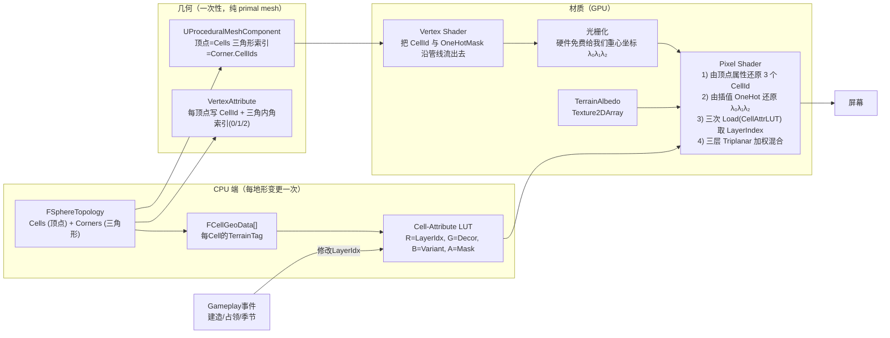
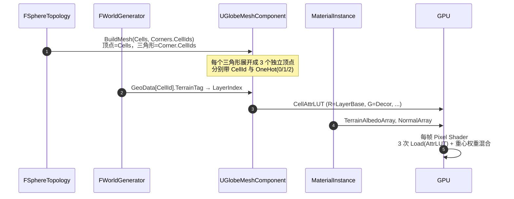

# 球面 SDF 多层地表渲染设计稿

> 目标：在球面拓扑（[`FSphereTopology`](../Source/Grid/Public/FSphereTopology.h)）上实现一种通用、可扩展的**符号距离场（Signed Distance Field, SDF）+ 多层地形材质混合**的渲染方案。
>
> 每个 `FCell` 拥有一个**地形类别**（GameplayTag → LayerIndex）；屏幕每个像素**直接利用三角形重心坐标 `(λ₀, λ₁, λ₂)` 作为它到三个 Cell 中心的归一化距离权重**，对三个 LayerIndex 的纹理做加权混合。Cell 边界因此**天然就是 Goldberg 多面体的真实边界**——既无需任何 acos/Voronoi 查询，也无需手工烘焙的 mask 纹理。
>
> 配合 [TechnicalDesign.md](TechnicalDesign.md) 第 5 章 GridRender 模块的整体定位；本文是其**渲染管线层**的细化设计稿。
>
> 关联：[FSphereTopology.h](../Source/Grid/Public/FSphereTopology.h)、[FCell.h](../Source/Grid/Public/FCell.h)、[FCorner.h](../Source/Grid/Public/FCorner.h)、[HexHighlightInteractionPlan.md](HexHighlightInteractionPlan.md)
>
> ## 拓扑前置约定（极其重要，决定整个方案的简洁度）
>
> 我们渲染的 mesh 是 [`FSphereTopology`](../Source/Grid/Public/FSphereTopology.h) 的 **primal mesh**（测地线球面 = geodesic icosahedron），它与逻辑层（hex/pent 网格 = Goldberg 多面体）互为**对偶多面体**：
>
> | 渲染层（primal）         | 逻辑层（dual / Goldberg） |
> | ---------------------- | ----------------------- |
> | 顶点 = `FCell`         | 面 = `FCell`（hex/pent 区块） |
> | 三角形 = `FCorner`     | 顶点 = `FCorner`（hex/pent 角点） |
> | 边                    | 边 = `FCellEdge`        |
>
> 因此**渲染端不需要任何额外几何重建**：
> - 顶点缓冲 = `FSphereTopology::Cells`（每个 Cell 的 `UnitCenter * Radius` 即顶点世界坐标，共 `10·4^N + 2` 个）
> - 索引缓冲 = `FSphereTopology::Corners`（每个 Corner 的 `CellIds[0..2]` 即一个三角形的三个顶点索引，共 `20·4^N` 个）
> - 旧版 `FRenderTri`（带 0.95 UV padding、边界顶点不复用的设计）**完全废弃**，本方案不再消费它
>
> 这套拓扑还带来一个关键性的**算法简化**：因为渲染三角形的三个顶点恰好是 3 个 Cell 中心，所以光栅化阶段**硬件免费提供**的重心坐标 `(λ₀, λ₁, λ₂)` 就是当前像素到 3 个 Cell 中心的内插权重。我们直接拿它做 SDF/混合权重，**完全不必跑 acos、不必查邻居 LUT、不必做 "最近2个 seed" 的排序**。

---

## 目录

- [1. 设计目标](#1-设计目标)
- [2. 原理：三角形重心坐标即 Cell SDF](#2-原理三角形重心坐标即-cell-sdf)
- [3. 总体架构](#3-总体架构)
- [4. 数据结构与数据流](#4-数据结构与数据流)
- [5. CPU 端：几何与 LUT 构建](#5-cpu-端几何与-lut-构建)
  - [5.1 几何构建：primal mesh 直接落盘](#51-几何构建primal-mesh-直接落盘)
  - [5.2 Cell-Attribute LUT（"哪个 Cell 是什么地形"）](#52-cell-attribute-lut哪个-cell-是什么地形)
  - [5.3 终结：每帧只更新 LUT，不重建几何](#53-终结每帧只更新-lut不重建几何)
- [6. GPU 端：重心坐标驱动的多层混合](#6-gpu-端重心坐标驱动的多层混合)
  - [6.1 顶点阶段：把"3 个 CellId + 重心 OneHot"传给像素阶段](#61-顶点阶段把3-个-cellid--重心-onehot传给像素阶段)
  - [6.2 像素阶段：3 次 Load + 加权混合](#62-像素阶段3-次-load--加权混合)
  - [6.3 软过渡 vs 硬边](#63-软过渡-vs-硬边)
  - [6.4 边界扰动（让边缘自然不规则）](#64-边界扰动让边缘自然不规则)
  - [6.5 Triplanar 解决球面 UV 接缝](#65-triplanar-解决球面-uv-接缝)
- [7. 备选权重方案对比](#7-备选权重方案对比)
- [8. 渲染层多 Pass 与扩展](#8-渲染层多-pass-与扩展)
- [9. 与高亮/选择/路径预览的协同](#9-与高亮选择路径预览的协同)
- [10. 性能预算](#10-性能预算)
- [11. 实施 Roadmap（M-step）](#11-实施-roadmapm-step)
- [12. 已知风险与对策](#12-已知风险与对策)
- [13. 附：核心代码骨架](#13-附核心代码骨架)

---

## 1. 设计目标

| 项 | 目标 |
| --- | --- |
| **每像素归属** | 屏幕每个像素天然得到 3 个 CellId 与 3 个权重 `(λ₀, λ₁, λ₂)`（光栅化器硬件提供），可直接驱动地形纹理混合。 |
| **地形类别完全数据驱动** | 不在材质里硬编码地形枚举；地形 → `Texture2DArray` 层索引完全由 [`UTerrainDefinition::LayerIndex`](TechnicalDesign.md) 供给。 |
| **不依赖球面 UV** | UV 仅用作"细节纹理重复"的 fallback；**主寻址依据是 "三角形顶点 = Cell 中心" 的拓扑**，从根上避开 spherified-cube / equirect 的接缝、极点、镜像问题。 |
| **运行时增量更新** | 玩家行为（建造、破坏、占领、季节）只改变 `Cell.LayerIndex`；**几何零重建**，仅刷新一张 `R8G8B8A8` 的小 LUT 纹理。 |
| **天然兼容板块/河流/海岸** | `Edge.bIsPlateBoundary`、`bIsRiver`、`bIsCoast` 都可以并入边界 SDF 做"宽度/颜色/高度"的特殊处理。 |
| **可扩展到云、迷雾、政治版图** | 同一套 SDF 机制（重心坐标）可服务于"地表 + 云罩 + 控制权 overlay"等多层独立 LUT。 |

---

## 2. 原理：三角形重心坐标即 Cell SDF

### 2.1 拓扑事实

[`FSphereTopology`](../Source/Grid/Public/FSphereTopology.h) 中：
- `Cells[i]` 在球面上的位置由 `UnitCenter` 给出（`PrimalVertsUnit` 之一）。
- `Corners[t]` 是一个 primal triangle 的中心，它的 `CellIds[0..2]` 是这个三角形的三个顶点（即三个 Cell）。

所以**渲染 mesh = primal mesh**：顶点缓冲就是 `Cells`，三角形索引就是每个 `Corner.CellIds[0..2]`。

### 2.2 重心坐标即 SDF

光栅化阶段，对任意像素，硬件天然能给出它在所属三角形 `(C₀, C₁, C₂)` 内的**重心坐标**：

```
(λ₀, λ₁, λ₂),    λ₀ + λ₁ + λ₂ = 1,    λᵢ ∈ [0, 1]
```

这三个 λ 同时是：
- 像素到 Cᵢ 顶点（即 Cᵢ.UnitCenter）的**直接内插权重**——这是定义；
- 一个**完美对偶到 Goldberg 多面体的 SDF**：
  - 在 Cell 中心（三角形顶点 i 处）：`λᵢ = 1`，其它两项 = 0 → **完全属于 Cᵢ**；
  - 在 Corner（三角形几何中心）：`(λ₀, λ₁, λ₂) = (1/3, 1/3, 1/3)` → **三 Cell 各占 1/3，无歧义**；
  - 在 Cell 与 Cell 的共享边（即 hex 边界）上：恰好一项 λ ≈ 0、其余两项 ≈ 0.5 → **两 Cell 50/50 混合**。

> **简洁地说**：硬件免费的重心坐标恰好就是 "像素到三个 Cell 中心的归一化距离权重"——它**就是** Cell SDF 的天然采样。

### 2.3 为什么这等价于 Goldberg 网格的边界？

Goldberg 多面体（hex/pent 网格）的 Cell 边界 ≡ primal triangulation 中两个相邻三角形跨过共享边时、三个顶点里**仅属于该边两端的那两个 Cell 占优势**、**对面顶点占比趋于 0** 的那条线。这恰好就是重心坐标 λ对面 = 0 的轨迹。

换句话说：
- 在 λ₀ = 0 的三角形边上，像素完全是 λ₁ 与 λ₂ 的混合 → 是 Cell₁与Cell₂ 的边界；
- 在三角形顶点 i 上，像素 λᵢ = 1 → 是 Cellᵢ 的中心。

因此**重心坐标仅仅是 "它在什么位置与 Cell 中心何者起 SDF" 的准确表述**。不同于球面 Voronoi、也不同于 指定软边宽度的 smoothstep 带 SDF：这里的边界全部是**几何意义上真实的 hex 网格边**。同时：
- **在 Cell 中心无数值问题**：任意三角形里以 λᵢ = 1 取到的顶点都是同一个 Cell，跨三角形偏移为 0；
- **在 Corner 无歧义**：(1/3, 1/3, 1/3) 是唯一可能、各向同性、与插值路径无关；
- **在 Cell-Cell 边界上连续**：两个相邻三角形在共享边上都表达为"对面顶点 λ = 0，两侧 λ 加起来 = 1"，合并后是同一个直线插值。

### 2.4 与原 Voronoi 方案的对比

| 项 | 原 Voronoi acos 方案 | 本方案（重心坐标） |
| --- | --- | --- |
| 每像素计算 | 1 次顶点插值 多事 + 7 次 acos+dot + 邻居 LUT 查表 + 最近二排序 | 硬件重心坐标（免费） + 3 次 `Load(CellAttrLUT)` |
| Corner 上数值稳定性 | acos 在三 dist 几乎相同时反常敏感 | 多项式完全准确，各向同性 |
| Cell 中心上数值稳定性 | dist=0 需 ε clamp | `λᵢ = 1` 精确，无需保护 |
| GPU 资源 | CenterLUT(fp16×4) + NeighborLUT(uint×6) + AttrLUT | 仅 AttrLUT |
| 边界几何含义 | 球面 Voronoi（仅在 hex 等边时与 Goldberg 重合） | 真正的 Goldberg hex 网格边 |
| 软过渡宽度 | 调 `EdgeSoftnessRad` | 调重心坐标上的 smoothstep（下文详细） |

"**只多一次 tex.Load**" 是你在设计评审中提出的动机表述：acos 方案三 CellId 只负责"选出错估后重查一轮邻居"，本方案三 CellId 都会在混合中贡献 → 从 1×Load 增加到 3×Load，代价几乎可忽略。

---

## 3. 总体架构



相比 Voronoi 查询方案，**没有 `CellNeighborLUT`、没有 `CellCenterLUT`、没有 acos**——三个 CellId 与三个权重全部由顶点属性 + 硬件光栅化器免费提供。

**模块归属**：

| 模块 | 角色 |
| --- | --- |
| `Grid` | 已存在；提供拓扑 + Voronoi 查询；本方案仅消费它 |
| `WorldGen` | 写入每 Cell 的 `TerrainTag`、`LayerIndex` |
| `GridRender`（本方案核心） | 构建 Mesh + LUT 资源 + 材质参数；管理动态更新 |
| `TerrainTags` | 提供 `UTerrainDefinition::LayerIndex` 的来源 |

---

## 4. 数据结构与数据流

### 4.1 Cell 端的"渲染属性"（CPU 主存）

```cpp
struct GRIDRENDER_API FCellRenderAttr
{
    uint8  LayerIndexBase;     // 主层 0..255 → Texture2DArray 切片索引
    uint8  LayerIndexDecor;    // 装饰层（雪覆盖、焦土、政治版图），0 表示无
    uint8  Variant;            // 同地形的随机变体 0..255（沙丘方向、草色微差）
    uint8  Mask;               // bit0=bIsCoast, bit1=bIsRiver, bit2=bIsBaseCity, ...
};
// 长度 = Topology->Cells.Num()
TArray<FCellRenderAttr> CellAttrs;
```

> **每 Cell 4 字节**——10k Cell 时只 40 KB，远低于显存压力。

### 4.2 GPU 资源清单

| 资源 | 维度 | 格式 | 内容 | 更新频率 |
| --- | --- | --- | --- | --- |
| `CellAttrLUT` | 1D（CellId 作 X） | `R8G8B8A8_UNORM` | `(LayerBase, LayerDecor, Variant, Mask)` | 频繁（每次地形改） |
| `TerrainAlbedoArray` | `Texture2DArray` | `BC7` 等 | 每 LayerIndex 对应一张地表 albedo | 资产时 |
| `TerrainNormalArray` | `Texture2DArray` | `BC5` | 法线 | 资产时 |
| `TerrainORMArray` | `Texture2DArray` | `BC1` | Occlusion / Roughness / Metallic 打包 | 资产时 |
| （可选）`TerrainHeightArray` | `Texture2DArray` | `BC4` | 高度，用作 height-blend | 资产时 |

> **唯一动态资源是 `CellAttrLUT`。**原计划中的 `CellCenterLUT` / `CellNeighborLUT` 在重心坐标方案下全部不需要——三个 CellId 从顶点属性进来，三个权重从光栅化器插值进来。
>
> 1D LUT 用 `2D NX×1` 均可；UE 里直接 `UTexture2D::CreateTransient` + `UpdateTextureRegions` 增量刷新即可。

### 4.3 顶点属性

这是本方案最关键的一步。本方案中 **渲染顶点 = `FCell`**（不是 Corner），三角形由 `Corner.CellIds[0..2]` 索引。但一个 Cell 在不同三角形里作不同的"顶点角色"（0/1/2），这个角色决定了重心坐标哪一项为 1。

需要在**运行时生成**一个 one-hot 顶点属性，表示当前顶点是当前三角形的哪一个顶点：

```
Vertex 0 of Tri:  OneHot = (1, 0, 0)
Vertex 1 of Tri:  OneHot = (0, 1, 0)
Vertex 2 of Tri:  OneHot = (0, 0, 1)
```

光栅化器会插值出 `(λ₀, λ₁, λ₂)`，PS 里拿到的就是重心坐标。

但这意味着**同一个 Cell 需要出现 N 次，每次带不同的 OneHot（在所有包含它的三角形里各出一次，作为 0/1/2 三个角色中的某一个）**。这里有两个可选实现路径：

#### 方案 A（推荐）：每个三角形 3 个独立顶点

顶点总数 = `3 × NTri = 3 × 20 · 4^N`。对 sub=4 是 15360、sub=5 是 61440，仍是轻量。
- Position、Normal 可能会被在多个顶点收到同一值（这不会引发接缝，纯重复）；
- 优点：**每个顶点一个明确的角色，代码极简**；OneHot 是静态的、不随三角形变。
- 缺点：额外 60% 左右的顶点存储，以及重复的 vertex shading。

#### 方案 B：顶点复用 + 顶点属性用 InstanceID/SV_VertexID 在 VS 里动态计算 OneHot

顶点总数 = `Cells.Num()`。但需要 PS 能说出"我是当前三角形的第几个顶点"——这需要 GS 或 attribute_no_perspective 拍平变量。复杂度上去，**不推荐除非顶点体积变成瓶颈**。

#### 选定：使用方案 A

顶点格式：

```cpp
struct FGlobeVertex
{
    FVector3f  Position;      // Cells[CellId].UnitCenter * Radius
    FVector3f  Normal;        // = Cells[CellId].UnitCenter
    FVector2f  CellId_AndPad; // .x = CellId (用 float 存 int，<= 16M 精确)
    FVector2f  OneHot01;      // .x = is-vertex-0?  .y = is-vertex-1?
    // is-vertex-2? = 1 - .x - .y，省一个 UV channel
};
```

在材质里：
- `UV0 = (0, 0)`（预留给 fallback UV，不用于主寻址）；
- `UV1.x = CellId`（本顶点对应的 Cell 索引）；
- `UV2.xy = OneHot01`：`(1,0)` 表示该顶点是三角形的顶点 0；`(0,1)` 顶点 1；`(0,0)` 顶点 2。

PS 还原三个 CellId 需要三个顶点的 `UV1.x`，但插值后只能拿到"混合后的 CellId"。这里有一个关键技巧：**把三个顶点的 CellId 都写进同一个顶点属性**。

所以最终顶点格式升级为：

```cpp
struct FGlobeVertex
{
    FVector3f  Position;
    FVector3f  Normal;
    FVector2f  UV0;          // 预留
    // 该顶点所在三角形的三个顶点的 CellId
    FVector2f  UV1_TriCellId01;   // .x=Tri顶点0的CellId, .y=Tri顶点1的CellId
    FVector2f  UV2_TriCellId2;    // .x=Tri顶点2的CellId, .y=本顶点是哪个角色(0/1/2)
    FVector2f  UV3_OneHot01;      // .x = is-vertex-0?  .y = is-vertex-1?
};
```

这样 PS 就能同时拿到三个 CellId 与重心坐标。文档 §13 会给出完整的几何构建代码。

### 4.4 数据流



> **比 Voronoi 方案少 2 张静态 LUT、少 1 次 acos×7 循环、少 1 次邻居采样**；但保持完全一样的 \"运行时只刷 AttrLUT\" 增量更新接口。

---

## 5. CPU 端：几何与 LUT 构建

CPU 端只需两件事：**构建 primal mesh** 与**维护 `CellAttrLUT`**。原方案的 `CellCenterLUT` 和 `CellNeighborLUT` 都已不再需要。

### 5.1 几何构建：primal mesh 直接落盘

核心循环遍历 `Topology.Corners`，每个 Corner 对应一个三角形，三角形的 3 个顶点是 `Corner.CellIds[0..2]`。**每个三角形展开成 3 个独立顶点**（方案 A，§4.3），每个顶点写入：

- `Position = Cells[CellId].UnitCenter * Radius`
- `Normal = Cells[CellId].UnitCenter`（球面外法）
- `UV1.x = CellId`（**本顶点**对应的 Cell）
- `UV1.y, UV2.x = 三角形其它两顶点的 CellId`（PS 通过插值的最大值还原"三角形三个 CellId"，但更简单的做法是**让三个 CellId 都写到同一个不插值通道**——见下文）

> **关键技巧**：要让 PS 拿到三个 CellId 与重心权重，最稳的做法是把三角形的三个 CellId **以同样的值写入这个三角形的三个顶点**（每个顶点的 `UV2/UV3.xy = (cid0, cid1, cid2)` 的同一个值），同时只让 OneHot 通道差异化（0 号顶点 OneHot=(1,0,0)、1 号 (0,1,0)、2 号 (0,0,1)）。这样：
>
> - 三个 CellId 经过插值仍是常量（三个顶点写入相同值），PS 直接 `round` 还原为 int；
> - OneHot 三个通道经过重心插值得到 `(λ₀, λ₁, λ₂)`，**就是重心坐标本身**；
> - 一组顶点属性 = 5 个 float（3 个 CellId + 2 个 OneHot 分量，第 3 个用 `1 - λ₀ - λ₁` 还原），适配 UE 的 UV1+UV2+UV3 共 6 个 float 槽位。

伪代码：

```cpp
void UGlobeMeshComponent::BuildFromTopology(const FSphereTopology& Topo)
{
    CachedTopo = &Topo;

    const int32 NTri = Topo.Corners.Num();
    const int32 NVtx = NTri * 3;

    TArray<FVector>    Pos;     Pos.Reserve(NVtx);
    TArray<FVector>    Nrm;     Nrm.Reserve(NVtx);
    TArray<FVector2D>  UV0;     UV0.Reserve(NVtx);   // 预留
    TArray<FVector2D>  UV1;     UV1.Reserve(NVtx);   // (TriCellId0, TriCellId1)
    TArray<FVector2D>  UV2;     UV2.Reserve(NVtx);   // (TriCellId2, _)
    TArray<FVector2D>  UV3;     UV3.Reserve(NVtx);   // (OneHot.x = λ₀, OneHot.y = λ₁)
    TArray<int32>      Tris;    Tris.Reserve(NVtx);

    for (int32 T = 0; T < NTri; ++T)
    {
        const FCorner& Cn = Topo.Corners[T];
        const int32 ID0 = Cn.CellIds[0];
        const int32 ID1 = Cn.CellIds[1];
        const int32 ID2 = Cn.CellIds[2];

        // 同一三角形的 3 个顶点都写入相同的 (ID0, ID1, ID2)，
        // 这样 PS 经过插值仍能 round 还原成 3 个 int。
        // 三个顶点的差异仅在 OneHot：(1,0)/(0,1)/(0,0)。
        for (int32 Role = 0; Role < 3; ++Role)
        {
            const int32 ThisCellId = Cn.CellIds[Role];
            const FVector C = Topo.Cells[ThisCellId].UnitCenter;
            Pos.Add(C * GlobeRadius);
            Nrm.Add(C);
            UV0.Add(FVector2D::ZeroVector);
            UV1.Add(FVector2D((float)ID0, (float)ID1));
            UV2.Add(FVector2D((float)ID2, 0.f));
            UV3.Add(FVector2D(Role == 0 ? 1.f : 0.f,
                              Role == 1 ? 1.f : 0.f));
            Tris.Add(T * 3 + Role);
        }
    }

    CreateMeshSection_LinearColor(0, Pos, Tris, Nrm, UV0, UV1, UV2, UV3,
        /*VColor*/{}, /*Tan*/{}, /*Coll*/false);

    EnsureCellAttrLUT_(Topo.Cells.Num());

    if (GlobeMaterial)
    {
        MID = UMaterialInstanceDynamic::Create(GlobeMaterial, this);
        MID->SetTextureParameterValue("CellAttrLUT", CellAttrLUT);
        SetMaterial(0, MID);
    }
}
```

> **顶点数**：sub=4 时 `NTri = 20·4^4 = 5120` → 顶点 15360；sub=5 时 NTri=20480、顶点 61440。每顶点 ~64 字节 → 4 MB 内存，完全无压力。
> **去重 vs 不去重**：方案 A 不在三角形之间共享顶点，是为了让 OneHot 与 CellId 在每个三角形里独立。这种"去除共享"在 procedural mesh 上是常规做法，没有额外渲染开销（GPU 层面 vertex cache 的命中率略降，但对球面这种简单几何无所谓）。

### 5.2 Cell-Attribute LUT（"哪个 Cell 是什么地形"）

```cpp
void UGlobeMeshComponent::EnsureCellAttrLUT_(int32 NumCells)
{
    if (!CellAttrLUT || CellAttrLUT->GetSizeX() != NumCells)
    {
        CellAttrLUT = UTexture2D::CreateTransient(NumCells, 1, PF_R8G8B8A8);
        CellAttrLUT->Filter = TF_Nearest;             // 必须最近邻
        CellAttrLUT->AddressX = TA_Clamp;
        CellAttrLUT->SRGB = false;                    // ★ 关键：不要被当作颜色误处理
        CellAttrLUT->NeverStream = true;
        CellAttrLUT->UpdateResource();
    }
    CellAttrs.SetNumZeroed(NumCells);
}

void UGlobeMeshComponent::SetCellLayer(int32 CellId, uint8 LayerBase, uint8 LayerDecor, uint8 Variant, uint8 Mask)
{
    CellAttrs[CellId] = { LayerBase, LayerDecor, Variant, Mask };

    // 局部更新一行像素
    FUpdateTextureRegion2D Region(CellId, 0, 0, 0, 1, 1);
    CellAttrLUT->UpdateTextureRegions(0, 1, &Region, /*SrcPitch=*/4, /*PixelSize=*/4,
        (uint8*)&CellAttrs[CellId]);
}
```

> 注意 [`FCellGeoData`](TechnicalDesign.md) 在 `WorldGen` 里已经计算好 `TerrainTag`；`GridRender` 只取 `Def->LayerIndex` 灌库即可。

### 5.3 终结：每帧只更新 LUT，不重建几何

```mermaid
flowchart LR
    A[玩家建造城市] --> B[CellAttrs[CellId].LayerDecor = LayerIdxOfCity]
    B --> C[UpdateTextureRegions 更新1像素]
    C --> D[下一帧PS采样到新值<br/>自动呈现城市纹理]
```

`primal mesh` 一次性构建后**永不重建**；任何 Cell 的地形、装饰、占领状态变更都仅是一行 `UpdateTextureRegions` 的事。

---

## 6. GPU 端：重心坐标驱动的多层混合

### 6.1 顶点阶段：把"3 个 CellId + 重心 OneHot"传给像素阶段

§5.1 已经把每个三角形的 3 个顶点都设置成了**相同的 (TriCellId0, TriCellId1, TriCellId2)** 与**差异化的 OneHot**。VS 阶段不需要做任何额外工作，只需把这些值原样输出给 PS：

```hlsl
// VS pseudo
output.UV1 = input.UV1; // (TriCellId0, TriCellId1)
output.UV2 = input.UV2; // (TriCellId2, _ )
output.UV3 = input.UV3; // (OneHot.x, OneHot.y)
```

经过光栅化器线性插值后：
- `UV1, UV2.x` 三个分量在三角形内部恒等于顶点写入值（因为三个顶点写入了同样的 CellId）→ PS 用 `round` 还原即可；
- `UV3.x = λ₀`，`UV3.y = λ₁`，`λ₂ = 1 - λ₀ - λ₁`——**这就是重心坐标**。

### 6.2 像素阶段：3 次 Load + 加权混合

伪代码（HLSL Custom Node 风格）：

```hlsl
// === 输入 ===
// float2  TriCellId01  : 由 UV1 插值得到（三个顶点写入相同值，插值后无变化）
// float   TriCellId2   : 由 UV2.x 插值得到
// float2  OneHot01     : 由 UV3 插值得到 → (λ₀, λ₁)
// Texture2D<float4> CellAttrLUT : (LayerBase, LayerDecor, Variant, Mask)
// Texture2DArray<float4> TerrainAlbedoArray, TerrainNormalArray, TerrainORMArray

// --- Step 1: 还原 3 个 CellId 与 3 个权重 ---
int  c0 = (int)(TriCellId01.x + 0.5);
int  c1 = (int)(TriCellId01.y + 0.5);
int  c2 = (int)(TriCellId2    + 0.5);
float l0 = OneHot01.x;
float l1 = OneHot01.y;
float l2 = saturate(1.0 - l0 - l1);

// --- Step 2: 读 3 个 Cell 的属性（这里就是 "比 acos 方案多 1 次 Load" 的全部代价）---
float4 a0 = CellAttrLUT.Load(int3(c0, 0, 0));
float4 a1 = CellAttrLUT.Load(int3(c1, 0, 0));
float4 a2 = CellAttrLUT.Load(int3(c2, 0, 0));
uint   layer0 = (uint)(a0.r * 255.0 + 0.5);
uint   layer1 = (uint)(a1.r * 255.0 + 0.5);
uint   layer2 = (uint)(a2.r * 255.0 + 0.5);

// --- Step 3: 三层 Triplanar 采样并按重心权重混合 ---
float3 alb0 = SampleTriplanar(TerrainAlbedoArray, layer0, WorldPosition, WorldNormal);
float3 alb1 = SampleTriplanar(TerrainAlbedoArray, layer1, WorldPosition, WorldNormal);
float3 alb2 = SampleTriplanar(TerrainAlbedoArray, layer2, WorldPosition, WorldNormal);
float3 albedo = alb0 * l0 + alb1 * l1 + alb2 * l2;

// 法线、ORM 同样的混合公式：
float3 nrm0 = SampleTriplanar(TerrainNormalArray, layer0, WorldPosition, WorldNormal);
float3 nrm1 = SampleTriplanar(TerrainNormalArray, layer1, WorldPosition, WorldNormal);
float3 nrm2 = SampleTriplanar(TerrainNormalArray, layer2, WorldPosition, WorldNormal);
float3 normal = normalize(nrm0 * l0 + nrm1 * l1 + nrm2 * l2);

// --- Step 4: 装饰层（城市/雪盖/政治版图）作为第二次混合 ---
//    把每个 Cell 自己的 decor 也按重心权重叠上去，三个 Cell 的 decor 自然做边界过渡
float3 decor = 0;
float  decorMask = 0;
[unroll] for (int k = 0; k < 3; ++k) {
    uint d = (uint)((k==0?a0:(k==1?a1:a2)).g * 255.0 + 0.5);
    if (d > 0) {
        float3 da = SampleTriplanar(TerrainAlbedoArray, d, WorldPosition, WorldNormal);
        float  lk = (k==0)?l0:((k==1)?l1:l2);
        float  m  = lk * DecorMaskNoise(WorldPosition, d);
        decor    += da * m;
        decorMask += m;
    }
}
albedo = lerp(albedo, decor / max(decorMask, 1e-4), saturate(decorMask));

return albedo;
```

> **正确性的几何说明**：
> - 在 Cell 中心（三角形顶点）上某 `λᵢ = 1` → albedo = `albᵢ`，**完全等于该 Cell 的地形**，无任何与邻居的混合；
> - 在 Corner（三角形几何中心）上 `λ = (1/3, 1/3, 1/3)` → 三个 Cell 平均，**对称、无歧义**——这正是用 `acos` 方案最痛的"三 dist 几乎相等"的奇点；
> - 在 Cell-Cell 共享边上某项 `λ = 0` → 退化为另两项的二元 `lerp`，**自动得到 "两个 Cell 50/50 在边上" 的合理过渡**。

### 6.3 软过渡 vs 硬边

线性混合 `albedo = Σ λᵢ · albᵢ` 已经在三角形内部产生**线性软过渡**：从 Cell A 中心走到 Cell B 中心的路径上，混合权重正好从 (1,0,0) 线性变到 (0,1,0)。一个普通六边形的 \"边界 → 中心\" 距离对应权重从 0 走到 1，**软过渡宽度 = 整个六边形半径**。

要做**更窄的软边**（视觉上接近硬边），用 smoothstep 拉伸权重曲线：

```hlsl
// 在 max(λ) 接近 1 的区间被拉到 1，其它区间也被拉到 0；过渡集中在 max(λ) ∈ [0.5-EdgeWidth, 0.5+EdgeWidth]
float Sharpen(float l) { return smoothstep(0.5 - EdgeWidth, 0.5 + EdgeWidth, l); }
float w0 = Sharpen(l0); float w1 = Sharpen(l1); float w2 = Sharpen(l2);
float wsum = w0 + w1 + w2 + 1e-6;
w0 /= wsum; w1 /= wsum; w2 /= wsum;
```

`EdgeWidth ∈ [0.0, 0.5]` 直接控制软边宽度：
- `EdgeWidth = 0.5` → 退化为原始线性混合（柔软）；
- `EdgeWidth = 0.05` → 接近硬边，仅在 `λ ≈ 0.5` 附近的一小条窄带做过渡（锐利）；
- `EdgeWidth = 0` → 完全硬边（一像素切换）。

> 想要**Civ 风格的硬边棱柱**？`EdgeWidth = 0.0`、关闭噪声扰动；想要**E&D 风格的有机过渡**？`EdgeWidth = 0.4` + 小幅噪声。设计师可以在 `MaterialParameterCollection` 里直接调。

### 6.4 边界扰动（让边缘自然不规则）

直接用重心坐标得到的边界是**直线**（在三角形内部）/**测地线弧**（连成 hex 后的全局边界）——视觉上太"工程"。叠一层 3D 噪声扰动权重：

```hlsl
// 用 WorldPosition（球面表面三维点）作为噪声输入；同一空间点全局一致，避免接缝
float3 n3 = SnoiseGrad3(WorldPosition * NoiseScale).xyz;       // 各分量独立噪声
l0 = saturate(l0 + n3.x * NoiseAmplitude);
l1 = saturate(l1 + n3.y * NoiseAmplitude);
l2 = saturate(l2 + n3.z * NoiseAmplitude);
// 重新归一化
float lsum = l0 + l1 + l2 + 1e-6;
l0 /= lsum; l1 /= lsum; l2 /= lsum;
```

效果：海岸线变成蜿蜒；山脚变成参差不齐；沙漠/草原过渡带变成斑驳。

进一步：**根据三对 (LayerIdxᵢ, LayerIdxⱼ) 决定噪声参数**——海岸用低频大幅、平原-森林用高频小幅、城-野用块状。可以预存一张 `LayerPair → NoiseParams` 的小 LUT，在三对之间各扰一次再综合。

### 6.5 Triplanar 解决球面 UV 接缝

球面没有非奇异的全局 UV 参数化。对于**细节纹理**（草、岩、沙），不要用顶点 UV，改用 Triplanar：

```hlsl
float3 SampleTriplanar(Texture2DArray T, uint layer, float3 WP, float3 N)
{
    float3 absN = abs(N);
    absN = pow(absN, TriplanarSharpness);   // 推荐 4
    absN /= dot(absN, 1);

    float3 cX = T.Sample(samp, float3(WP.yz / TileScale, layer)).rgb;
    float3 cY = T.Sample(samp, float3(WP.xz / TileScale, layer)).rgb;
    float3 cZ = T.Sample(samp, float3(WP.xy / TileScale, layer)).rgb;
    return cX * absN.x + cY * absN.y + cZ * absN.z;
}
```

> 与球心的距离不影响：因为我们传入的 `WorldNormal = WorldDir`（球面外法），Triplanar 三个面的混合权重只看法线方向。这避免了 PTG `spherified-cube` 那种 6 面 UV 重叠的灾难。

---

## 7. 备选权重方案对比

§6 我们用了"重心坐标 + 3 次 Load"的极简方案。这里梳理为何不选其它路径：

| 方案 | 候选数 | 数值稳定性 | 成本 | 适用 |
| --- | --- | --- | --- | --- |
| **A. 重心坐标 3 Cell（本文主方案）** | 3 | ✅ Cell 中心精确、Corner 对称无歧义、边界连续 | **3 次 tex.Load**，无 acos | 默认采用 ✅ |
| **B. 球面 Voronoi acos**（顶点 3 + 邻居 6） | 7 | ⚠ 需要 ε clamp，Corner 处易跳变 | 7 次 acos+dot+Load + 邻居 LUT | 需要"球面真实距离"语义时（罕见） |
| **C. 全 GPU 4 叉树下降** | log N | ✅ | 高（树纹理 + 循环） | 不参与本方案——拓扑层 CPU 端用即可 |
| **D. CPU 每帧预筛 \"屏幕 K 个候选 Cell\"** | 屏幕 K | ✅ | 屏幕复杂度 | 低 cell 高分辨率时 |

> 方案 A 与方案 B 的几何结果**在三角形内部完全等价**（因为三角形顶点恰好就是 3 个 Cell 中心，重心坐标是 \"线性版的 dist 反比\"）。差别仅在三角形外的过渡形态——但本方案下 mesh 已经覆盖整个球面，每个像素都在某个三角形内，没有"三角形外"。
>
> **结论**：方案 A 是几何上最干净、计算上最便宜、没有任何数值病态的解，无需考虑其它备选。

---

## 8. 渲染层多 Pass 与扩展

设计上把"地表"拆成可叠加的若干**SDF Layer**，全部共享同一套**重心坐标 + Cell 拓扑**：

| Layer | LUT 通道 | 作用 |
| --- | --- | --- |
| **Base Terrain** | `CellAttrLUT.r` | 草/林/雪/沙 等地理生物群系（[`UTerrainDefinition`](TechnicalDesign.md)） |
| **Decor / Build** | `CellAttrLUT.g` | 城市、农田、营地、烧毁后的焦土 |
| **Political Overlay** | 独立 `OwnerLUT` | 势力控制颜色（半透明描边） |
| **Fog of War** | 独立 `FogLUT` | 探索状态（黑/灰/全亮三态），用同一个 SDF 做软过渡 |
| **Path Preview** | 临时 `PathLUT` | 玩家选中单位时高亮可达 Cell；和 [HexHighlightInteractionPlan.md](HexHighlightInteractionPlan.md) 的 LineBatch 不同，这里直接覆盖整个 Cell 区域 |

每层都是**1 字节/Cell**，10k Cell × 5 层 = 50KB；动态更新只刷自己那张表的对应像素，互不干扰。

---

## 9. 与高亮/选择/路径预览的协同

[HexHighlightInteractionPlan.md](HexHighlightInteractionPlan.md) 的 hover 高亮基于 `LineBatcher` 画测地线，是**线框描边**；本方案是**面填充**。两套系统**正交**：

- **悬停 hover**：单个 Cell 的轮廓线（线框）→ 沿用 LineBatcher 即可，开销极低；
- **选中 select** 与**移动可达范围**：整面填充 → 写一张 `SelectLUT[CellId] = mask`，材质里直接用重心权重把它和地形混合在一起；
- **多选 / 范围选**：同上，往 LUT 里多写几个 1 即可。

伪代码（沿用 §6 的 3 个 CellId 与重心权重）：

```hlsl
float s0 = SelectLUT.Load(int3(c0, 0, 0)).r;
float s1 = SelectLUT.Load(int3(c1, 0, 0)).r;
float s2 = SelectLUT.Load(int3(c2, 0, 0)).r;
float selMask = s0 * l0 + s1 * l1 + s2 * l2;       // 自动跟随 Cell 区域 + 软边
albedo = lerp(albedo, SelectColor.rgb, selMask * SelectStrength);
```

由于像素归属由重心权重直接决定，**无需在 GPU 重新做 hit test**——CPU 写一个 LUT，下一帧整个屏幕该 Cell 区域就亮起来，**而且边缘会自然贴合三角形重心过渡**。

---

## 10. 性能预算

按 **1080p × 60fps × sub=4 (2562 cells, 5120 三角形)** 估算：

| 阶段 | 单像素成本 | 1080p 总开销 |
| --- | --- | --- |
| 还原 3 CellId + 重心权重（顶点属性插值） | 0 ALU（硬件免费） | **0 ms** |
| 3 次 `Load(CellAttrLUT)` | 3 tex.Load | ~0.05 ms |
| 1 次 3D 噪声边界扰动（snoise grad） | ~30 ALU | ~0.5 ms |
| 3 路 Triplanar 采样 albedo（每路 3 axis） | 9 tex.Sample | ~1.0 ms |
| 法线 + ORM 同步采样 | 18 tex.Sample | ~2.0 ms |
| 加权混合 + 装饰层混合 | ~20 ALU | ~0.2 ms |
| **总计 / 帧 / 1080p** | | **~3.8 ms** |

> 与 acos 方案 \"~3.5 ms\" 相差几乎为零——多花的 1 路 Triplanar 抵消了少花的 acos 循环。**真正胜出的不是性能，而是\"一行 acos 都没有、一处数值奇点都没有、一个 NeighborLUT 都不需要\"的工程简洁性**。
>
> **4K 屏会到 ~14 ms**，到时候要么降软边噪声、要么只对屏幕内可见 Cell 做半屏分辨率（half-res combine）。

CPU 侧：
- 几何构建一次性 ~5 ms（sub=4 时 5120 个三角形 × 3 顶点）；
- 每个 Cell 地形改变只更新 1 像素 → ~1 µs；
- 整张 LUT 重灌（开新 save）~50 µs。

---

## 11. 实施 Roadmap（M-step）

> 与 [TechnicalDesign.md §15](TechnicalDesign.md) 的 M-step 对齐，本方案对应 **M4 球面渲染** 的细化路线。

| 阶段 | 目标 | 验证 |
| --- | --- | --- |
| **R1** | 用 `UProceduralMeshComponent` 把 `FSphereTopology::Cells` + `Corners.CellIds` 渲出来（每个三角形 3 个独立顶点），材质纯白 | 看到一颗光滑球，能旋转 |
| **R2** | 把每个顶点的 `(TriCellId0, TriCellId1, TriCellId2)` 与 OneHot 写到 UV1/UV2/UV3，材质里用 `λ₀` 按 CellId 哈希填色 | 每 Cell 大色块、边界为线性渐变 |
| **R3** | 把着色改为 3 次 `Load(CellAttrLUT)` 取 `LayerIndex`，按 `λᵢ` 混合 | 三色混合，无 acos、无 NeighborLUT |
| **R4** | 加 §6.3 的 `Sharpen(λ)` 软边控制 | `EdgeWidth` 拉到 0 时 Civ 风格硬边、拉到 0.5 时柔软渐变 |
| **R5** | 加边界 3D 噪声扰动（§6.4） | 海岸线/山脚不规则 |
| **R6** | 切到 `Texture2DArray + Triplanar` 真实地表纹理 | 草、沙、雪皮肤 |
| **R7** | 接入 `WorldGen` 的 `FCellGeoData → LayerIndex`，跑出第一张可玩星球 | 12 五边形可见、海陆分布 |
| **R8** | 加 Decor / Owner / Fog 三套独立 LUT | 政治版图 + 战争迷雾上线 |
| **R9** | LOD 优化：远距离用 R3（线性混合）、近距离用 R5（带噪声） | 远景帧时间下降 |

每一阶段单独可验证，不会卡死。

---

## 12. 已知风险与对策

| 风险 | 触发场景 | 对策 |
| --- | --- | --- |
| **顶点数膨胀 3 倍** | sub ≥ 5 时 ~60k 顶点 | 仍远低于 UE 顶点上限；如真有压力可上 §4.3 方案 B（GS / SV_VertexID） |
| **CellId 用 float 存储丢精度** | sub ≥ 7（cells > 16M） | 改用 `int32` Vertex Color 通道存储；目前 sub ≤ 6 完全无忧 |
| **三角形顶点 OneHot 经过插值非线性** | 视口处于 Mip 边界 | 永远在 \"primary mesh 同分辨率\" 渲染，Mip 不影响顶点插值 |
| **重心权重在退化三角形上发散** | 接近极地畸形三角形 | 正二十面体细分天然没有退化三角形，最差宽高比 < 2:1 |
| **边界噪声太强导致 Cell 之间"互锁"伪影** | `NoiseAmplitude > 0.4` | 在材质里限制 `NoiseAmplitude ∈ [0, 0.3]` |
| **更新 LUT 与渲染竞态** | 同一帧内连写 N 次 LUT | 走 `UpdateTextureRegions` 即可（UE 内部 deferred 到 RHI 线程），别用 Map/Unmap |
| **跨 Cell 高度差导致 Z-fighting** | 地形抬升时同侧 Cell 共享顶点 | 渲染顶点已经独立化（每三角形 3 个），Z-fighting 只可能出现在同一 Cell 内的不同三角形之间，无影响 |
| **多 Pass 的依赖**（Base 必须先于 Decor） | 写错 Pass 顺序 | 全部并入一个 PS，用顺序 `lerp` 链；不需要真正多 Pass |
| **设计师改 `LayerIndex` 后 LUT 不刷新** | DataAsset 编辑 | `UTerrainDefinition::PostEditChangeProperty` 里广播 `OnLayerIndexChanged` → `UGlobeMeshComponent::RebuildAttrLUT_` |

---

## 13. 附：核心代码骨架

> 仅展示与本方案直接相关的关键部分；命名空间/include 省略。

### 13.1 `UGlobeMeshComponent` 头文件

```cpp
// Public/GlobeMeshComponent.h
UCLASS(ClassGroup=(Globe), meta=(BlueprintSpawnableComponent))
class GRIDRENDER_API UGlobeMeshComponent : public UProceduralMeshComponent
{
    GENERATED_BODY()
public:
    UPROPERTY(EditAnywhere, Category="Globe") float GlobeRadius = 600000.f;
    UPROPERTY(EditAnywhere, Category="Globe") TObjectPtr<UMaterialInterface> GlobeMaterial;

    /** 从拓扑构建几何（一次性）+ 创建 AttrLUT */
    void BuildFromTopology(const FSphereTopology& Topo);

    /** 从世界生成结果灌库（首帧）*/
    void ApplyGeoData(const TArray<FCellGeoData>& Geo);

    /** 单 Cell 增量更新（运行时事件） */
    void SetCellLayer(int32 CellId, uint8 LayerBase, uint8 LayerDecor = 0, uint8 Variant = 0, uint8 Mask = 0);

    /** 选择 / 路径预览 等独立 LUT 接口 */
    void SetSelectMask(int32 CellId, uint8 Mask);
    void ClearAllSelectMasks();

protected:
    void EnsureCellAttrLUT_(int32 NumCells);
    void RebuildAttrLUT_();   // 全表上传

    UPROPERTY() TObjectPtr<UTexture2D> CellAttrLUT;     // R=LayerBase, G=Decor, B=Variant, A=Mask
    UPROPERTY() TObjectPtr<UTexture2D> SelectLUT;       // 可选，独立 LUT

    UPROPERTY() TObjectPtr<UMaterialInstanceDynamic> MID;

    TArray<FCellRenderAttr> CellAttrs;
    const FSphereTopology* CachedTopo = nullptr;
};
```

> 与原 Voronoi 方案对比：**少了 `CellCenterLUT` / `CellNeighborLUT` 两个成员、少了 `BuildStaticLUTs_()` 方法**。

### 13.2 几何构建（核心循环）

直接消费 [`FSphereTopology::Cells`](../Source/Grid/Public/FCell.h) 与 [`FSphereTopology::Corners`](../Source/Grid/Public/FCorner.h)，**完全不再需要 `FRenderTri`**。每个 Corner 视作一个三角形，三个顶点由 `Corner.CellIds[0..2]` 给出，每个三角形展开成 3 个独立顶点（方案 A，§4.3）以承载差异化的 OneHot：

```cpp
void UGlobeMeshComponent::BuildFromTopology(const FSphereTopology& Topo)
{
    CachedTopo = &Topo;

    const int32 NTri = Topo.Corners.Num();
    const int32 NVtx = NTri * 3;

    TArray<FVector>    Pos;     Pos.Reserve(NVtx);
    TArray<FVector>    Nrm;     Nrm.Reserve(NVtx);
    TArray<FVector2D>  UV0;     UV0.Reserve(NVtx);   // 预留
    TArray<FVector2D>  UV1;     UV1.Reserve(NVtx);   // (TriCellId0, TriCellId1)
    TArray<FVector2D>  UV2;     UV2.Reserve(NVtx);   // (TriCellId2, _)
    TArray<FVector2D>  UV3;     UV3.Reserve(NVtx);   // (OneHot.x = λ₀, OneHot.y = λ₁)
    TArray<int32>      Tris;    Tris.Reserve(NVtx);

    for (int32 T = 0; T < NTri; ++T)
    {
        const FCorner& Cn = Topo.Corners[T];
        const int32 ID0 = Cn.CellIds[0];
        const int32 ID1 = Cn.CellIds[1];
        const int32 ID2 = Cn.CellIds[2];

        // 同一三角形的 3 个顶点都写入相同的 (ID0, ID1, ID2)，
        // 这样 PS 经过插值仍能 round 还原成 3 个 int。
        // 三个顶点的差异仅在 OneHot：(1,0)/(0,1)/(0,0)。
        for (int32 Role = 0; Role < 3; ++Role)
        {
            const int32 ThisCellId = Cn.CellIds[Role];
            const FVector C = Topo.Cells[ThisCellId].UnitCenter;
            Pos.Add(C * GlobeRadius);
            Nrm.Add(C);
            UV0.Add(FVector2D::ZeroVector);
            UV1.Add(FVector2D((float)ID0, (float)ID1));
            UV2.Add(FVector2D((float)ID2, 0.f));
            UV3.Add(FVector2D(Role == 0 ? 1.f : 0.f,
                              Role == 1 ? 1.f : 0.f));
            Tris.Add(T * 3 + Role);
        }
    }

    CreateMeshSection_LinearColor(0, Pos, Tris, Nrm, UV0, UV1, UV2, UV3,
        /*VColor*/{}, /*Tan*/{}, /*Coll*/false);

    EnsureCellAttrLUT_(Topo.Cells.Num());

    if (GlobeMaterial)
    {
        MID = UMaterialInstanceDynamic::Create(GlobeMaterial, this);
        MID->SetTextureParameterValue("CellAttrLUT", CellAttrLUT);
        SetMaterial(0, MID);
    }
}
```

### 13.3 像素阶段 Custom HLSL 节点（精简）

放到 Material 的 `Custom` 节点里，输出 `(layer0, layer1, layer2, l0, l1, l2)` 6 个值再继续在材质图里做 Triplanar：

```hlsl
// Inputs:
//   float2 UV1 : (TriCellId0, TriCellId1)
//   float2 UV2 : (TriCellId2, _)
//   float2 UV3 : (OneHot.x = λ₀, OneHot.y = λ₁)
//   Texture2D AttrLUT
// Outputs (6 floats):
//   float3 layers, float3 lambdas

int  c0 = (int)(UV1.x + 0.5);
int  c1 = (int)(UV1.y + 0.5);
int  c2 = (int)(UV2.x + 0.5);
float l0 = UV3.x;
float l1 = UV3.y;
float l2 = saturate(1.0 - l0 - l1);

float4 a0 = AttrLUT.Load(int3(c0, 0, 0));
float4 a1 = AttrLUT.Load(int3(c1, 0, 0));
float4 a2 = AttrLUT.Load(int3(c2, 0, 0));

layers  = float3(a0.r, a1.r, a2.r) * 255.0;   // 三个 LayerIndex（材质里再 round）
lambdas = float3(l0, l1, l2);
```

后续在材质图（或同一 Custom 节点的下半部分）：

```hlsl
// 三层 Triplanar Albedo 加权
float3 alb0 = SampleTriplanar(TerrainAlbedoArray, (uint)layers.x, WorldPosition, WorldNormal);
float3 alb1 = SampleTriplanar(TerrainAlbedoArray, (uint)layers.y, WorldPosition, WorldNormal);
float3 alb2 = SampleTriplanar(TerrainAlbedoArray, (uint)layers.z, WorldPosition, WorldNormal);
return alb0 * lambdas.x + alb1 * lambdas.y + alb2 * lambdas.z;
```

### 13.4 触发更新（Gameplay 集成示例）

```cpp
// 玩家在某 Cell 建造城市
void AGlobeActor::OnCityBuilt(int32 CellId)
{
    const uint8 CityLayer = (uint8)CityBuildingDef->LayerIndex;
    GlobeMesh->SetCellLayer(CellId,
        /*Base=*/GlobeMesh->GetCellAttr(CellId).LayerIndexBase,    // 保留原地形
        /*Decor=*/CityLayer,                                        // Decor 层为城市
        /*Variant=*/0,
        /*Mask=*/MASK_HAS_CITY);
    // 下一帧整个 Cell 的城市图层就生效了，无需重建 mesh
}
```

---

## 结语

整套方案的核心可以浓缩为一句话：

> **\"Goldberg 网格的渲染 mesh 就是它的对偶 primal mesh；primal 三角形的三个顶点恰好是 3 个 Cell 中心；硬件免费提供的重心坐标就是 Cell SDF 本身。\"**

它的优雅之处在于：
- **无 acos / 无 NeighborLUT / 无 CenterLUT**：3 次 `Load(CellAttrLUT)` 是全部 GPU 数据访问；
- **无数值奇点**：Cell 中心、Corner、Cell-Cell 边界三种几何位置上权重表达式都是精确解析；
- **无 UV 依赖**：彻底绕开 spherified-cube / equirect 的接缝、镜像、极点；
- **无烘焙纹理**：不需要预渲染任何 mask、distance field 大图；
- **无网格重建**：地形演变只改 LUT 一像素；
- **无 `FRenderTri`**：旧版几何容器不再消费，模块进一步清理；
- **天然多层**：Base / Decor / Owner / Fog / Path 五张独立 LUT，全部跑在一套重心坐标之上；
- **天然兼容现有 Grid 数据**：`FCell.UnitCenter` 与 `FCorner.CellIds` 已是构建 mesh 与 AttrLUT 所需的全部材料。

按本设计实施，**最小可看效果**（R1~R3）预计 **2 天**；完整 R1~R8 预计 **1 周**；后续板块、河流、迷雾、政治版图等扩展都只是"增加一张 LUT + 改材质混合链"的增量工作。