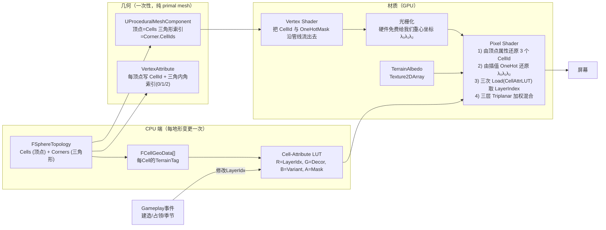
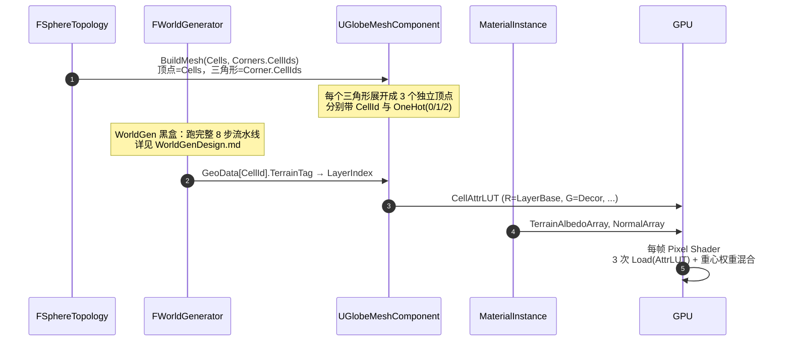
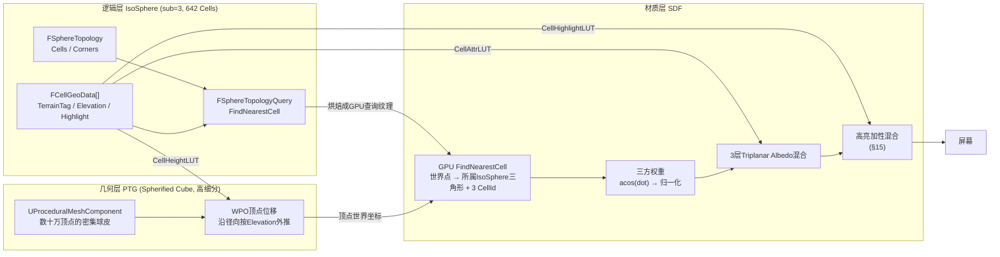
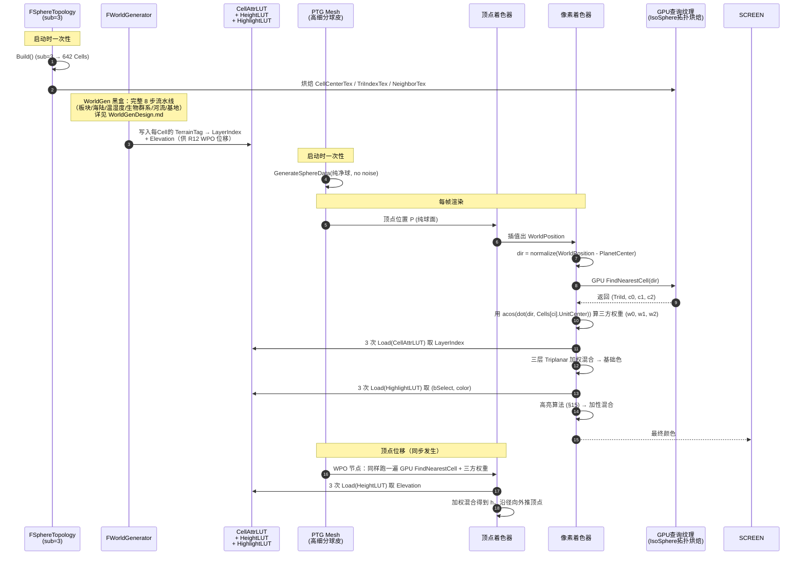

# 球面 SDF 多层地表渲染设计稿

> 目标：在球面拓扑（[`FSphereTopology`](../Source/Grid/Public/FSphereTopology.h)）上实现一种通用、可扩展的**符号距离场（Signed Distance Field, SDF）+ 多层地形材质混合**的渲染方案。
>
> 每个 `FCell` 拥有一个**地形类别**（GameplayTag → LayerIndex）；屏幕每个像素**直接利用三角形重心坐标 `(λ₀, λ₁, λ₂)` 作为它到三个 Cell 中心的归一化距离权重**，对三个 LayerIndex 的纹理做加权混合。Cell 边界因此**天然就是 Goldberg 多面体的真实边界**——既无需任何 acos/Voronoi 查询，也无需手工烘焙的 mask 纹理。
>
> 配合 [TechnicalDesign.md](TechnicalDesign.md) 第 5 章 GridRender 模块的整体定位；本文是其**渲染管线层**的细化设计稿。
>
> 关联：[FSphereTopology.h](../Source/Grid/Public/FSphereTopology.h)、[FCell.h](../Source/Grid/Public/FCell.h)、[FCorner.h](../Source/Grid/Public/FCorner.h)、[HexHighlightInteractionPlan.md](HexHighlightInteractionPlan.md)
>
> 📐 **拓扑几何含义参考**：本稿假设读者已理解 `FSphereTopology` 各字段的几何含义（FCell = hex/pent 多边形、FCorner = 球面外心 / dual 顶点、primal vs dual 对偶关系、12 五边形不变量等）。如对拓扑细节有疑问，请先查阅 [SphereTopologyReference.md](SphereTopologyReference.md)（"真理之源"基础设施稿）。
>
> ⚠ **WorldGen 已独立成稿**：每 Cell 的 `TerrainTag / Elevation / Moisture / PlateId / bIsCoast/...` 由独立的 [WorldGenDesign.md](WorldGenDesign.md) 主稿负责生成。本稿（SDF 渲染层）**从 W4 完成那一刻起**只读消费 `FCellGeoData[]`——通过 `UTerrainDefinition::LayerIndex` 间接拿到 `Texture2DArray` slice 索引，对 WorldGen 内部算法（板块构造、Whittaker 表、河流追踪等）一无所知，亦不依赖。两侧通过 §4.1 / §14.1 的 LUT 字段表锁死契约。
>
> ⚠ **R8/R8.5/W4 顺序拍板（2026-06-29）**：原计划 "W4 → R8 → 球面网格" 改为 **"R8 (Tint 参数化) → R8.5 (自研球面网格无 LOD) → W4 (Biome 分类) → R9+"**。R8 不再前置依赖 W4——验收时继续沿用 R3 Knuth 哈希 placeholder 观察 17 种地形配方的视觉效果；W4 推迟到 R8 + 球面网格联调通过后再调，因为有了真实地形位移与水面遮挡后调 Whittaker 区间反而更直观。详见 §11 Roadmap 表。
>
> ---
>
> ## ⚠ 阅读指引：实施路径
>
> 本文目前锁定的实施路径如下：
>
> | 路径 | 渲染 mesh | 适用阶段 | 核心权重来源 |
> | --- | --- | --- | --- |
> | **§1~§13 IsoSphere 直渲方案** | IsoSphere primal mesh（顶点 = Cell 中心） | **R1~R8（参数化 Tint 验收）** | 硬件免费的重心坐标 |
> | **§16 自研球面网格方案** ⭐ | 正二十面体细分（SubdivisionLevel + 2）primal mesh，自行管控顶点位移与法线 | **R8.5 起的生产路线** | 顶点 → 最近 3 Cell + acos 三方权重（与 §14.7 同公式） |
>
> **生产路线是 §16 的自研球面网格方案**——之前曾考虑的 "PTG（ProceduralTerrainGenerator 插件）几何层集成" 方案（§14 历史章节）已**作废**：自研网格能与 WorldGen 的 `Elevation` 直接对接做径向位移、与 SDF 软边权重共享同一组 `acos / w[3]` 公式、不必绑死 PTG 插件的 spherified-cube 几何与碰撞黑盒。R8 阶段仍跑在 IsoSphere 上验证参数化材质，R8.5 把 mesh 切到自研网格并与 R8 材质联调，之后 W4/R9/R10 全部跑在自研网格上。
>
> §14 文字保留作为"曾考虑的 PTG 路线"历史档案，仅供回看；新工作不要再向 PTG 路线投入。
>
> 如果你只想了解**最终生产架构**，直接跳到 [§16](#16-自研球面网格生产路线) 与 [§15](#15-cell-高亮算法描边带)。
>
> ---
>
> ## 拓扑前置约定（极其重要，决定整个方案的简洁度）
>
> 我们渲染的 mesh 是 [`FSphereTopology`](../Source/Grid/Public/FSphereTopology.h) 的 **primal mesh**（测地线球面 = geodesic icosahedron），它与逻辑层（hex/pent 网格 = Goldberg 多面体）互为**对偶多面体**：
>
> | 渲染层（primal）         | 逻辑层（dual / Goldberg） |
> | ---------------------- | ----------------------- |
> | 顶点 = `FCell`         | 面 = `FCell`（hex/pent 区块） |
> | 三角形 = `FCorner`     | 顶点 = `FCorner`（hex/pent 角点） |
> | 边                    | 边 = `FCellEdge`        |
>
> 因此**渲染端不需要任何额外几何重建**：
> - 顶点缓冲 = `FSphereTopology::Cells`（每个 Cell 的 `UnitCenter * Radius` 即顶点世界坐标，共 `10·4^N + 2` 个）
> - 索引缓冲 = `FSphereTopology::Corners`（每个 Corner 的 `CellIds[0..2]` 即一个三角形的三个顶点索引，共 `20·4^N` 个）
> - 旧版 `FRenderTri`（带 0.95 UV padding、边界顶点不复用的设计）**完全废弃**，本方案不再消费它
>
> 这套拓扑还带来一个关键性的**算法简化**：因为渲染三角形的三个顶点恰好是 3 个 Cell 中心，所以光栅化阶段**硬件免费提供**的重心坐标 `(λ₀, λ₁, λ₂)` 就是当前像素到 3 个 Cell 中心的内插权重。我们直接拿它做 SDF/混合权重，**完全不必跑 acos、不必查邻居 LUT、不必做 "最近2个 seed" 的排序**。

---

## 目录

- [1. 设计目标](#1-设计目标)
- [2. 原理：三角形重心坐标即 Cell SDF](#2-原理三角形重心坐标即-cell-sdf)
- [3. 总体架构](#3-总体架构)
- [4. 数据结构与数据流](#4-数据结构与数据流)
- [5. CPU 端：几何与 LUT 构建](#5-cpu-端几何与-lut-构建)
  - [5.1 几何构建：primal mesh 直接落盘](#51-几何构建primal-mesh-直接落盘)
  - [5.2 Cell-Attribute LUT（"哪个 Cell 是什么地形"）](#52-cell-attribute-lut哪个-cell-是什么地形)
  - [5.3 终结：每帧只更新 LUT，不重建几何](#53-终结每帧只更新-lut不重建几何)
- [6. GPU 端：重心坐标驱动的多层混合](#6-gpu-端重心坐标驱动的多层混合)
  - [6.1 顶点阶段：把"3 个 CellId + 重心 OneHot"传给像素阶段](#61-顶点阶段把3-个-cellid--重心-onehot传给像素阶段)
  - [6.2 像素阶段：3 次 Load + 加权混合](#62-像素阶段3-次-load--加权混合)
  - [6.3 软过渡 vs 硬边](#63-软过渡-vs-硬边)
  - [6.4 边界扰动（让边缘自然不规则）](#64-边界扰动让边缘自然不规则)
  - [6.5 Triplanar 解决球面 UV 接缝](#65-triplanar-解决球面-uv-接缝)
- [7. 备选权重方案对比](#7-备选权重方案对比)
- [8. 渲染层多 Pass 与扩展](#8-渲染层多-pass-与扩展)
- [9. 与高亮/选择/路径预览的协同](#9-与高亮选择路径预览的协同)
- [10. 性能预算](#10-性能预算)
- [11. 实施 Roadmap（M-step）](#11-实施-roadmapm-step)
  - [11.2 PMC↔PTG 渲染契约（顶点法线与 UE5 光照约定）](#112-pmcptg-渲染契约顶点法线与-ue5-光照约定) ⭐
- [12. 已知风险与对策](#12-已知风险与对策)
- [13. 附：核心代码骨架](#13-附核心代码骨架)
- [14. PTG 几何层集成（生产环境路线）](#14-ptg-几何层集成生产环境路线)
  - [14.1 三层架构总览](#141-三层架构总览)
  - [14.2 完整数据流](#142-完整数据流)
  - [14.3 PTG mesh 着色流程（像素级）](#143-ptg-mesh-着色流程像素级)
  - [14.4 GPU 端 FindNearestCell：拓扑下载与查询](#144-gpu-端-findnearestcell拓扑下载与查询)
  - [14.5 PTG 顶点高度位移（WPO）](#145-ptg-顶点高度位移wpo)
  - [14.6 与 §1~§13 \"重心坐标\" 方案的关系](#146-与-1-13-重心坐标-方案的关系)
  - [14.7 球面重心坐标与"外心折角"修正（核心几何不变量）](#147-球面重心坐标与外心折角修正核心几何不变量)
- [15. Cell 高亮算法（描边带）](#15-cell-高亮算法描边带)
  - [15.1 算法直觉](#151-算法直觉)
  - [15.2 数学定义](#152-数学定义)
  - [15.3 多 Cell 同时高亮](#153-多-cell-同时高亮)
  - [15.4 GPU 实现](#154-gpu-实现)
  - [15.5 与既有 SelectLUT 的关系](#155-与既有-selectlut-的关系)
- [16. 自研球面网格（生产路线）⭐](#16-自研球面网格生产路线)
  - [16.1 R8 参数化 Tint + 水面层（mesh 不变，只改材质）](#161-r8-参数化-tint--水面层mesh-不变只改材质)
  - [16.2 R8.5 自研球面网格几何](#162-r85-自研球面网格几何)
  - [16.3 顶点 → 最近 3 Cell + 软高度过渡](#163-顶点--最近-3-cell--软高度过渡)
  - [16.4 法线重算与材质对接](#164-法线重算与材质对接)
  - [16.5 物理碰撞与拾取](#165-物理碰撞与拾取)
  - [16.6 LOD 留白（R10 补做）](#166-lod-留白r10-补做)

---

## 1. 设计目标

| 项 | 目标 |
| --- | --- |
| **每像素归属** | 屏幕每个像素天然得到 3 个 CellId 与 3 个权重 `(λ₀, λ₁, λ₂)`（光栅化器硬件提供），可直接驱动地形纹理混合。 |
| **地形类别完全数据驱动** | 不在材质里硬编码地形枚举；地形 → `Texture2DArray` 层索引完全由 [`UTerrainDefinition::LayerIndex`](TechnicalDesign.md) 供给。 |
| **不依赖球面 UV** | UV 仅用作"细节纹理重复"的 fallback；**主寻址依据是 "三角形顶点 = Cell 中心" 的拓扑**，从根上避开 spherified-cube / equirect 的接缝、极点、镜像问题。 |
| **运行时增量更新** | 玩家行为（建造、破坏、占领、季节）只改变 `Cell.LayerIndex`；**几何零重建**，仅刷新一张 `R8G8B8A8` 的小 LUT 纹理。 |
| **天然兼容板块/河流/海岸** | `Edge.bIsPlateBoundary`、`bIsRiver`、`bIsCoast` 都可以并入边界 SDF 做"宽度/颜色/高度"的特殊处理。 |
| **可扩展到云、迷雾、政治版图** | 同一套 SDF 机制（重心坐标）可服务于"地表 + 云罩 + 控制权 overlay"等多层独立 LUT。 |

---

## 2. 原理：三角形重心坐标即 Cell SDF

### 2.1 拓扑事实

[`FSphereTopology`](../Source/Grid/Public/FSphereTopology.h) 中：
- `Cells[i]` 在球面上的位置由 `UnitCenter` 给出（`PrimalVertsUnit` 之一）。
- `Corners[t]` 是一个 primal triangle 的中心，它的 `CellIds[0..2]` 是这个三角形的三个顶点（即三个 Cell）。

所以**渲染 mesh = primal mesh**：顶点缓冲就是 `Cells`，三角形索引就是每个 `Corner.CellIds[0..2]`。

#### 2.1.1 关键拓扑澄清：所有三角形地位完全等价（极重要）

> ⚠ 这个 mesh 是**测地线球面**（geodesic icosahedron），它和**戈德堡多面体**（hex/pent 网格）互为对偶。**整个球面由且仅由一种几何元素铺成：primal 三角形（即 `FCorner`）**。
>
> **不存在所谓"hex/pent 内部三角形"和"hex/pent 之间的过渡（空隙）三角形"之分**——这是一个常见的视觉误读，必须从一开始就排除掉。所有 `FCorner` 三角形在拓扑上**地位完全等价**：
>
> - 每个 primal 三角形 = 1 个 `FCorner`，它的三个顶点恰好是 3 个 `FCell` 的中心；
> - 每个 primal 三角形被它三个顶点（三个 Cell）的对偶边界（外心-边中点连线，§14.7）划分为 **3 个 1/3 区域**，每个区域归属其对应顶点 Cell 的 hex/pent；
> - 一个 hex（6 邻居 Cell）= 周围 6 个 primal 三角形各贡献 1 个 1/3 区域 = 6 × 1/3，等价于"6 个三角形中各取 1/6 角块"的另一种表述；
> - 一个 pent（5 邻居 Cell）= 周围 5 个 primal 三角形各贡献 1 个 1/3 区域 = 5 × 1/3。

**对偶关系一图概览**：

| 测地线球面（primal，本方案的渲染 mesh） | 戈德堡多面体（dual，逻辑层 hex/pent 网格） |
| --- | --- |
| 顶点 = `FCell`（hex/pent 中心） | 面 = `FCell`（hex 占 6 个三角形 1/3 区域、pent 占 5 个） |
| 三角形 = `FCorner`（每个由 3 个 Cell 中心张成） | 顶点 = `FCorner`（hex/pent 的角点；正是 dual 三个面的交点） |
| 边 = 两个 Cell 中心的连线 | 边 = 两个 Corner 在球面上的连线（即 hex/pent 的边） |

**三角形内部颜色 = 这个三角形 3 个 Cell 顶点的混合**，仅此一条规则。整个球面着色因此是"**对所有 primal 三角形施以同一套三方混合公式**"——SDF 算法**对每个三角形完全无差别地应用**。

> 历史回顾：在 R2 第一次实测时，因为着色公式 `λ₀ × hash(c₀)` 只点亮"Role 0 顶点"那一角的 1/3 区域、其它 2/3 留暗，视觉上看起来像"hex/pent 色块 + 周围三角形空隙的密铺"——但**那只是对称单一三角形铺面被着色函数选择性点亮的视觉假象**，几何上从来没有两类三角形之分。详细解释见 [R2_TopologyDebugMaterial.md §4](R2_TopologyDebugMaterial.md)。

#### 2.1.2 视觉错觉防御：1/3 角块的判别准则（用于 R2/R3 验收）

视觉上**最容易被误读的现象**是："看到一个色块由 5/6 个三角形围绕一个中心顶点拼成，于是认为这个 hex/pent 占据了这 5/6 个完整三角形"。**这种解读是错的**，必须从一开始就排除：

1. **5/6 个三角形的中心顶点 = 该 Cell 的中心**（mesh 顶点 = `Cells[i].UnitCenter`）；
2. **它们当中每一个三角形里，只有"靠近该中心顶点的 1/3 角块"属于这个 Cell**——剩下的 2/3 角块属于另外两个邻居 Cell；
3. **同一个三角形被 3 个 hex/pent 各占 1/3 角块**，三角形并非任何一个 hex/pent 的"专属内部三角形"；
4. **不存在"hex/pent 之间的过渡三角形"** —— 任意两个相邻 hex/pent 的"过渡区域"也是某个 primal 三角形的一部分，但那个三角形的 3 个顶点是 3 个不同的 Cell（构成"3 邻接 hex/pent 共角"的几何点 = 三角形的外心 = `Corner.UnitDir`）。

**1/3 角块边界的判别**（数学定义）：

$$
\text{像素 P 属于 Cell } C_i \quad \iff \quad \lambda_i(P) = \max(\lambda_0, \lambda_1, \lambda_2)
$$

即重心坐标 argmax 域；它由"三角形外心 $\hat{O}$ 到三条边中点 $M_{AB}, M_{BC}, M_{CA}$ 的连线"切开，得到 3 个清晰的 1/3 角块（详见 §14.7）。

**两条 R2 验收路径的视觉差异**：

| 路径 | 着色公式 | 视觉效果 | 是否消除"5/6 三角形错觉" |
| --- | --- | --- | --- |
| **A. 线性插值（VertexColor 直显）** | `Σ λᵢ · hash(cᵢ)` | 三角形是 3 色平滑渐变；mesh 顶点附近的 5/6 个三角形在中心处都是 hash(中心 Cell) 色 → 视觉上聚拢成"中心明亮的 hex/pent 色块" | ❌ 视觉上看起来像"hex 占据 5/6 完整三角形"——这是图像投影的错觉，肉眼难以察觉 1/3 角块的真实分隔 |
| **B. argmax 硬边（PS 端 argmax(λ)）** | `albedo = hash(c_argmax(λ))` | 每个三角形被外心-边中点连线**清晰**分成 3 个 1/3 角块；5/6 个角块拼成纯色 hex/pent 多边形 | ✅ 完全消除——hex/pent 边界肉眼可见、数学精确，三角形边界与 hex 边界完全分离 |

**R2 验收推荐用路径 B（argmax 硬边）**，因为它把抽象的"5/6 个 1/3 角块拼成 hex/pent"做成了**肉眼可见**的事实，从根本上排除路径 A 容易引发的"hex 占 5/6 三角形 + 过渡三角形"误读。详见 [R2_TopologyDebugMaterial.md](R2_TopologyDebugMaterial.md)。

> ⚠ **路径 B 的折线硬边只是 R2/R3 的过渡形态**：`argmax(λ)` 等位线 = 外心-边中点的三段折线，在每条 mesh 边的中点处会出现一次可见折角（详见 [R4_VoronoiBoundary.md §1.2](R4_VoronoiBoundary.md#12-几何根因为什么-147-解决不了它)）。**R4 起判别准则升级为球面 Voronoi `argmax(dot(dir, V_i))`**，等位线变成真正的测地线大圆弧，hex/pent 边在所有位置都光滑无折角（详见 [R4_VoronoiBoundary.md](R4_VoronoiBoundary.md)）。
>
> 所以本节"argmax 硬边"的"边"在 R2/R3 是折线、在 R4+ 是测地线——两者拓扑等价（都是同一组 cell 边界），仅几何路径不同。

### 2.2 重心坐标即 SDF

光栅化阶段，对任意像素，硬件天然能给出它在所属三角形 `(C₀, C₁, C₂)` 内的**重心坐标**：

```
(λ₀, λ₁, λ₂),    λ₀ + λ₁ + λ₂ = 1,    λᵢ ∈ [0, 1]
```

这三个 λ 同时是：
- 像素到 Cᵢ 顶点（即 Cᵢ.UnitCenter）的**直接内插权重**——这是定义；
- 一个**完美对偶到 Goldberg 多面体的 SDF**：
  - 在 Cell 中心（三角形顶点 i 处）：`λᵢ = 1`，其它两项 = 0 → **完全属于 Cᵢ**；
  - 在 Corner（三角形几何中心）：`(λ₀, λ₁, λ₂) = (1/3, 1/3, 1/3)` → **三 Cell 各占 1/3，无歧义**；
  - 在 Cell 与 Cell 的共享边（即 hex 边界）上：恰好一项 λ ≈ 0、其余两项 ≈ 0.5 → **两 Cell 50/50 混合**。

> **简洁地说**：硬件免费的重心坐标恰好就是 "像素到三个 Cell 中心的归一化距离权重"——它**就是** Cell SDF 的天然采样。

### 2.3 为什么这等价于 Goldberg 网格的边界？

Goldberg 多面体（hex/pent 网格）的 Cell 边界，**在每个 primal 三角形内部**，是从外心 $\hat{O}$ 出发、垂直于三条边的中垂面交线（详见 §14.7）。整体上：

- 三角形顶点 $V_A$ 处：$\lambda_A = 1$、$\lambda_B = \lambda_C = 0$ → 像素位于 Cell A 的中心；
- 三角形外心 $\hat{O}$ 处：$\lambda_A = \lambda_B = \lambda_C = 1/3$ → 像素正好位于 hex/pent 的 Corner 上（三个 Cell 在此交汇）；
- 球面边 $V_A V_B$ 上：$\lambda_C = 0$、$\lambda_A + \lambda_B = 1$ → 像素位于 A、B 共享的 hex 边内侧（与对面顶点对应的 Cell C 完全不掺和）；
- 球面边 $V_A V_B$ 的中点 $M_{AB}$：$\lambda_A = \lambda_B = 0.5$、$\lambda_C = 0$ → 像素正好落在 A-B 之间 hex 边的中点。

**跨三角形的连续性**：相邻两个 primal 三角形共享边 $V_A V_B$，两侧三角形上"对面顶点权重 = 0"恒成立，且共享边上 $\lambda_A, \lambda_B$ 只与 dir、$V_A$、$V_B$ 有关、与"另一侧的第三个顶点"无关——所以**两侧给出完全相同的边上权重**。这一点保证了 hex 网格作为对偶几何与 primal 三角形权重之间的几何等价：

- 每个 hex/pent Cell 的范围 = "λ_本Cell 在该 hex/pent 周围所有 primal 三角形里都是最大者"的并集；
- Cell 与 Cell 共享的 hex 边 = 两 Cell 对应的 λ 在某条测地线上恰好相等的轨迹；
- Cell 三方共享的 hex 角点 = primal 三角形的外心。

因此**重心坐标既是 "像素属于哪个 Cell" 的连续 SDF，也是 "Goldberg hex 网格几何边界" 的精确刻画**。同时：
- **在 Cell 中心无数值问题**：任意三角形里以 $\lambda_i = 1$ 取到的顶点都是同一个 Cell；
- **在 Corner 无歧义**：`(1/3, 1/3, 1/3)` 是唯一可能、各向同性、与插值路径无关；
- **在 Cell-Cell 边界上连续**：跨三角形权重无裂缝，dual hex 网格也无折角（前提是 Corner 取在外心而非重心，§14.7）。

### 2.4 与原 Voronoi 方案的对比

| 项 | 原 Voronoi acos 方案 | 本方案（重心坐标） |
| --- | --- | --- |
| 每像素计算 | 1 次顶点插值 多事 + 7 次 acos+dot + 邻居 LUT 查表 + 最近二排序 | 硬件重心坐标（免费） + 3 次 `Load(CellAttrLUT)` |
| Corner 上数值稳定性 | acos 在三 dist 几乎相同时反常敏感 | 多项式完全准确，各向同性 |
| Cell 中心上数值稳定性 | dist=0 需 ε clamp | `λᵢ = 1` 精确，无需保护 |
| GPU 资源 | CenterLUT(fp16×4) + NeighborLUT(uint×6) + AttrLUT | 仅 AttrLUT |
| 边界几何含义 | 球面 Voronoi（仅在 hex 等边时与 Goldberg 重合） | 真正的 Goldberg hex 网格边 |
| 软过渡宽度 | 调 `EdgeSoftnessRad` | 调重心坐标上的 smoothstep（下文详细） |

"**只多一次 tex.Load**" 是你在设计评审中提出的动机表述：acos 方案三 CellId 只负责"选出错估后重查一轮邻居"，本方案三 CellId 都会在混合中贡献 → 从 1×Load 增加到 3×Load，代价几乎可忽略。

---

## 3. 总体架构



相比 Voronoi 查询方案，**没有 `CellNeighborLUT`、没有 `CellCenterLUT`、没有 acos**——三个 CellId 与三个权重全部由顶点属性 + 硬件光栅化器免费提供。

**模块归属**：

| 模块 | 角色 |
| --- | --- |
| `Grid` | 已存在；提供拓扑 + Voronoi 查询；本方案仅消费它 |
| `WorldGen` | **上游模块**（独立设计稿见 [WorldGenDesign.md](WorldGenDesign.md)）；本方案只读消费其输出的 `FCellGeoData[]`，不关心生成算法 |
| `GridRender`（本方案核心） | 构建 Mesh + LUT 资源 + 材质参数；管理动态更新 |
| `TerrainTags` | 提供 `UTerrainDefinition::LayerIndex` 的来源（`TerrainTag → LayerIndex` 映射） |

---

## 4. 数据结构与数据流

### 4.1 Cell 端的"渲染属性"（CPU 主存）

```cpp
struct GRIDRENDER_API FCellRenderAttr
{
    uint8  LayerIndexBase;     // 主层 0..255 → Texture2DArray 切片索引
    uint8  LayerIndexDecor;    // 装饰层（雪覆盖、焦土、政治版图），0 表示无
    uint8  Variant;            // 同地形的随机变体 0..255（沙丘方向、草色微差）
    uint8  Mask;               // bit0=bIsCoast, bit1=bIsRiver, bit2=bIsBaseCity, ...
};
// 长度 = Topology->Cells.Num()
TArray<FCellRenderAttr> CellAttrs;
```

> **每 Cell 4 字节**——10k Cell 时只 40 KB，远低于显存压力。

### 4.2 GPU 资源清单

| 资源 | 维度 | 格式 | 内容 | 更新频率 |
| --- | --- | --- | --- | --- |
| `CellAttrLUT` | 1D（CellId 作 X） | `R8G8B8A8_UNORM` | `(LayerBase, LayerDecor, Variant, Mask)` | 频繁（每次地形改） |
| `TerrainAlbedoArray` | `Texture2DArray` | `BC7` 等 | 每 LayerIndex 对应一张地表 albedo | 资产时 |
| `TerrainNormalArray` | `Texture2DArray` | `BC5` | 法线 | 资产时 |
| `TerrainORMArray` | `Texture2DArray` | `BC1` | Occlusion / Roughness / Metallic 打包 | 资产时 |
| （可选）`TerrainHeightArray` | `Texture2DArray` | `BC4` | 高度，用作 height-blend | 资产时 |

> **唯一动态资源是 `CellAttrLUT`。**原计划中的 `CellCenterLUT` / `CellNeighborLUT` 在重心坐标方案下全部不需要——三个 CellId 从顶点属性进来，三个权重从光栅化器插值进来。
>
> 1D LUT 用 `2D NX×1` 均可；UE 里直接 `UTexture2D::CreateTransient` + `UpdateTextureRegions` 增量刷新即可。

### 4.3 顶点属性

这是本方案最关键的一步。本方案中 **渲染顶点 = `FCell`**（不是 Corner），三角形由 `Corner.CellIds[0..2]` 索引。但一个 Cell 在不同三角形里作不同的"顶点角色"（0/1/2），这个角色决定了重心坐标哪一项为 1。

需要在**运行时生成**一个 one-hot 顶点属性，表示当前顶点是当前三角形的哪一个顶点：

```
Vertex 0 of Tri:  OneHot = (1, 0, 0)
Vertex 1 of Tri:  OneHot = (0, 1, 0)
Vertex 2 of Tri:  OneHot = (0, 0, 1)
```

光栅化器会插值出 `(λ₀, λ₁, λ₂)`，PS 里拿到的就是重心坐标。

但这意味着**同一个 Cell 需要出现 N 次，每次带不同的 OneHot（在所有包含它的三角形里各出一次，作为 0/1/2 三个角色中的某一个）**。这里有两个可选实现路径：

#### 方案 A（推荐）：每个三角形 3 个独立顶点

顶点总数 = `3 × NTri = 3 × 20 · 4^N`。对 sub=4 是 15360、sub=5 是 61440，仍是轻量。
- Position、Normal 可能会被在多个顶点收到同一值（这不会引发接缝，纯重复）；
- 优点：**每个顶点一个明确的角色，代码极简**；OneHot 是静态的、不随三角形变。
- 缺点：额外 60% 左右的顶点存储，以及重复的 vertex shading。

#### 方案 B：顶点复用 + 顶点属性用 InstanceID/SV_VertexID 在 VS 里动态计算 OneHot

顶点总数 = `Cells.Num()`。但需要 PS 能说出"我是当前三角形的第几个顶点"——这需要 GS 或 attribute_no_perspective 拍平变量。复杂度上去，**不推荐除非顶点体积变成瓶颈**。

#### 选定：使用方案 A

顶点格式：

```cpp
struct FGlobeVertex
{
    FVector3f  Position;      // Cells[CellId].UnitCenter * Radius
    FVector3f  Normal;        // = Cells[CellId].UnitCenter
    FVector2f  CellId_AndPad; // .x = CellId (用 float 存 int，<= 16M 精确)
    FVector2f  OneHot01;      // .x = is-vertex-0?  .y = is-vertex-1?
    // is-vertex-2? = 1 - .x - .y，省一个 UV channel
};
```

在材质里：
- `UV0 = (0, 0)`（预留给 fallback UV，不用于主寻址）；
- `UV1.x = CellId`（本顶点对应的 Cell 索引）；
- `UV2.xy = OneHot01`：`(1,0)` 表示该顶点是三角形的顶点 0；`(0,1)` 顶点 1；`(0,0)` 顶点 2。

PS 还原三个 CellId 需要三个顶点的 `UV1.x`，但插值后只能拿到"混合后的 CellId"。这里有一个关键技巧：**把三个顶点的 CellId 都写进同一个顶点属性**。

所以最终顶点格式升级为：

```cpp
struct FGlobeVertex
{
    FVector3f  Position;
    FVector3f  Normal;
    FVector2f  UV0;          // 预留
    // 该顶点所在三角形的三个顶点的 CellId
    FVector2f  UV1_TriCellId01;   // .x=Tri顶点0的CellId, .y=Tri顶点1的CellId
    FVector2f  UV2_TriCellId2;    // .x=Tri顶点2的CellId, .y=本顶点是哪个角色(0/1/2)
    FVector2f  UV3_OneHot01;      // .x = is-vertex-0?  .y = is-vertex-1?
};
```

这样 PS 就能同时拿到三个 CellId 与重心坐标。文档 §13 会给出完整的几何构建代码。

### 4.4 数据流



> **比 Voronoi 方案少 2 张静态 LUT、少 1 次 acos×7 循环、少 1 次邻居采样**；但保持完全一样的 \"运行时只刷 AttrLUT\" 增量更新接口。

---

## 5. CPU 端：几何与 LUT 构建

CPU 端只需两件事：**构建 primal mesh** 与**维护 `CellAttrLUT`**。原方案的 `CellCenterLUT` 和 `CellNeighborLUT` 都已不再需要。

### 5.1 几何构建：primal mesh 直接落盘

核心循环遍历 `Topology.Corners`，每个 Corner 对应一个三角形，三角形的 3 个顶点是 `Corner.CellIds[0..2]`。**每个三角形展开成 3 个独立顶点**（方案 A，§4.3），每个顶点写入：

- `Position = Cells[CellId].UnitCenter * Radius`
- `Normal = Cells[CellId].UnitCenter`（球面外法）
- `UV1.x = CellId`（**本顶点**对应的 Cell）
- `UV1.y, UV2.x = 三角形其它两顶点的 CellId`（PS 通过插值的最大值还原"三角形三个 CellId"，但更简单的做法是**让三个 CellId 都写到同一个不插值通道**——见下文）

> **关键技巧**：要让 PS 拿到三个 CellId 与重心权重，最稳的做法是把三角形的三个 CellId **以同样的值写入这个三角形的三个顶点**（每个顶点的 `UV2/UV3.xy = (cid0, cid1, cid2)` 的同一个值），同时只让 OneHot 通道差异化（0 号顶点 OneHot=(1,0,0)、1 号 (0,1,0)、2 号 (0,0,1)）。这样：
>
> - 三个 CellId 经过插值仍是常量（三个顶点写入相同值），PS 直接 `round` 还原为 int；
> - OneHot 三个通道经过重心插值得到 `(λ₀, λ₁, λ₂)`，**就是重心坐标本身**；
> - 一组顶点属性 = 5 个 float（3 个 CellId + 2 个 OneHot 分量，第 3 个用 `1 - λ₀ - λ₁` 还原），适配 UE 的 UV1+UV2+UV3 共 6 个 float 槽位。

伪代码：

```cpp
void UGlobeMeshComponent::BuildFromTopology(const FSphereTopology& Topo)
{
    CachedTopo = &Topo;

    const int32 NTri = Topo.Corners.Num();
    const int32 NVtx = NTri * 3;

    TArray<FVector>    Pos;     Pos.Reserve(NVtx);
    TArray<FVector>    Nrm;     Nrm.Reserve(NVtx);
    TArray<FVector2D>  UV0;     UV0.Reserve(NVtx);   // 预留
    TArray<FVector2D>  UV1;     UV1.Reserve(NVtx);   // (TriCellId0, TriCellId1)
    TArray<FVector2D>  UV2;     UV2.Reserve(NVtx);   // (TriCellId2, _)
    TArray<FVector2D>  UV3;     UV3.Reserve(NVtx);   // (OneHot.x = λ₀, OneHot.y = λ₁)
    TArray<int32>      Tris;    Tris.Reserve(NVtx);

    for (int32 T = 0; T < NTri; ++T)
    {
        const FCorner& Cn = Topo.Corners[T];
        const int32 ID0 = Cn.CellIds[0];
        const int32 ID1 = Cn.CellIds[1];
        const int32 ID2 = Cn.CellIds[2];

        // 同一三角形的 3 个顶点都写入相同的 (ID0, ID1, ID2)，
        // 这样 PS 经过插值仍能 round 还原成 3 个 int。
        // 三个顶点的差异仅在 OneHot：(1,0)/(0,1)/(0,0)。
        for (int32 Role = 0; Role < 3; ++Role)
        {
            const int32 ThisCellId = Cn.CellIds[Role];
            const FVector C = Topo.Cells[ThisCellId].UnitCenter;
            Pos.Add(C * GlobeRadius);
            Nrm.Add(C);
            UV0.Add(FVector2D::ZeroVector);
            UV1.Add(FVector2D((float)ID0, (float)ID1));
            UV2.Add(FVector2D((float)ID2, 0.f));
            UV3.Add(FVector2D(Role == 0 ? 1.f : 0.f,
                              Role == 1 ? 1.f : 0.f));
            Tris.Add(T * 3 + Role);
        }
    }

    CreateMeshSection_LinearColor(0, Pos, Tris, Nrm, UV0, UV1, UV2, UV3,
        /*VColor*/{}, /*Tan*/{}, /*Coll*/false);

    EnsureCellAttrLUT_(Topo.Cells.Num());

    if (GlobeMaterial)
    {
        MID = UMaterialInstanceDynamic::Create(GlobeMaterial, this);
        MID->SetTextureParameterValue("CellAttrLUT", CellAttrLUT);
        SetMaterial(0, MID);
    }
}
```

> **顶点数**：sub=4 时 `NTri = 20·4^4 = 5120` → 顶点 15360；sub=5 时 NTri=20480、顶点 61440。每顶点 ~64 字节 → 4 MB 内存，完全无压力。
> **去重 vs 不去重**：方案 A 不在三角形之间共享顶点，是为了让 OneHot 与 CellId 在每个三角形里独立。这种"去除共享"在 procedural mesh 上是常规做法，没有额外渲染开销（GPU 层面 vertex cache 的命中率略降，但对球面这种简单几何无所谓）。

### 5.2 Cell-Attribute LUT（"哪个 Cell 是什么地形"）

```cpp
void UGlobeMeshComponent::EnsureCellAttrLUT_(int32 NumCells)
{
    if (!CellAttrLUT || CellAttrLUT->GetSizeX() != NumCells)
    {
        CellAttrLUT = UTexture2D::CreateTransient(NumCells, 1, PF_R8G8B8A8);
        CellAttrLUT->Filter = TF_Nearest;             // 必须最近邻
        CellAttrLUT->AddressX = TA_Clamp;
        CellAttrLUT->SRGB = false;                    // ★ 关键：不要被当作颜色误处理
        CellAttrLUT->NeverStream = true;
        CellAttrLUT->UpdateResource();
    }
    CellAttrs.SetNumZeroed(NumCells);
}

void UGlobeMeshComponent::SetCellLayer(int32 CellId, uint8 LayerBase, uint8 LayerDecor, uint8 Variant, uint8 Mask)
{
    CellAttrs[CellId] = { LayerBase, LayerDecor, Variant, Mask };

    // 局部更新一行像素
    FUpdateTextureRegion2D Region(CellId, 0, 0, 0, 1, 1);
    CellAttrLUT->UpdateTextureRegions(0, 1, &Region, /*SrcPitch=*/4, /*PixelSize=*/4,
        (uint8*)&CellAttrs[CellId]);
}
```

> 注意：`FCellGeoData` 在 `WorldGen` 里已经计算好 `TerrainTag`（详见 [WorldGenDesign.md](WorldGenDesign.md) §3.3 输入/输出契约）；`GridRender` 只取 `Def->LayerIndex` 灌库即可。**SDF 渲染层不关心 WorldGen 内部如何生成**——这是两侧解耦的硬承诺。

### 5.3 终结：每帧只更新 LUT，不重建几何

```mermaid
flowchart LR
    A[玩家建造城市] --> B[CellAttrs[CellId].LayerDecor = LayerIdxOfCity]
    B --> C[UpdateTextureRegions 更新1像素]
    C --> D[下一帧PS采样到新值<br/>自动呈现城市纹理]
```

`primal mesh` 一次性构建后**永不重建**；任何 Cell 的地形、装饰、占领状态变更都仅是一行 `UpdateTextureRegions` 的事。

---

## 6. GPU 端：重心坐标驱动的多层混合

### 6.1 顶点阶段：把"3 个 CellId + 重心 OneHot"传给像素阶段

§5.1 已经把每个三角形的 3 个顶点都设置成了**相同的 (TriCellId0, TriCellId1, TriCellId2)** 与**差异化的 OneHot**。VS 阶段不需要做任何额外工作，只需把这些值原样输出给 PS：

```hlsl
// VS pseudo
output.UV1 = input.UV1; // (TriCellId0, TriCellId1)
output.UV2 = input.UV2; // (TriCellId2, _ )
output.UV3 = input.UV3; // (OneHot.x, OneHot.y)
```

经过光栅化器线性插值后：
- `UV1, UV2.x` 三个分量在三角形内部恒等于顶点写入值（因为三个顶点写入了同样的 CellId）→ PS 用 `round` 还原即可；
- `UV3.x = λ₀`，`UV3.y = λ₁`，`λ₂ = 1 - λ₀ - λ₁`——**这就是重心坐标**。

### 6.2 像素阶段：3 次 Load + 加权混合

伪代码（HLSL Custom Node 风格）：

```hlsl
// === 输入 ===
// float2  TriCellId01  : 由 UV1 插值得到（三个顶点写入相同值，插值后无变化）
// float   TriCellId2   : 由 UV2.x 插值得到
// float2  OneHot01     : 由 UV3 插值得到 → (λ₀, λ₁)
// Texture2D<float4> CellAttrLUT : (LayerBase, LayerDecor, Variant, Mask)
// Texture2DArray<float4> TerrainAlbedoArray, TerrainNormalArray, TerrainORMArray

// --- Step 1: 还原 3 个 CellId 与 3 个权重 ---
int  c0 = (int)(TriCellId01.x + 0.5);
int  c1 = (int)(TriCellId01.y + 0.5);
int  c2 = (int)(TriCellId2    + 0.5);
float l0 = OneHot01.x;
float l1 = OneHot01.y;
float l2 = saturate(1.0 - l0 - l1);

// --- Step 2: 读 3 个 Cell 的属性（这里就是 "比 acos 方案多 1 次 Load" 的全部代价）---
float4 a0 = CellAttrLUT.Load(int3(c0, 0, 0));
float4 a1 = CellAttrLUT.Load(int3(c1, 0, 0));
float4 a2 = CellAttrLUT.Load(int3(c2, 0, 0));
uint   layer0 = (uint)(a0.r * 255.0 + 0.5);
uint   layer1 = (uint)(a1.r * 255.0 + 0.5);
uint   layer2 = (uint)(a2.r * 255.0 + 0.5);

// --- Step 3: 三层 Triplanar 采样并按重心权重混合 ---
float3 alb0 = SampleTriplanar(TerrainAlbedoArray, layer0, WorldPosition, WorldNormal);
float3 alb1 = SampleTriplanar(TerrainAlbedoArray, layer1, WorldPosition, WorldNormal);
float3 alb2 = SampleTriplanar(TerrainAlbedoArray, layer2, WorldPosition, WorldNormal);
float3 albedo = alb0 * l0 + alb1 * l1 + alb2 * l2;

// 法线、ORM 同样的混合公式：
float3 nrm0 = SampleTriplanar(TerrainNormalArray, layer0, WorldPosition, WorldNormal);
float3 nrm1 = SampleTriplanar(TerrainNormalArray, layer1, WorldPosition, WorldNormal);
float3 nrm2 = SampleTriplanar(TerrainNormalArray, layer2, WorldPosition, WorldNormal);
float3 normal = normalize(nrm0 * l0 + nrm1 * l1 + nrm2 * l2);

// --- Step 4: 装饰层（城市/雪盖/政治版图）作为第二次混合 ---
//    把每个 Cell 自己的 decor 也按重心权重叠上去，三个 Cell 的 decor 自然做边界过渡
float3 decor = 0;
float  decorMask = 0;
[unroll] for (int k = 0; k < 3; ++k) {
    uint d = (uint)((k==0?a0:(k==1?a1:a2)).g * 255.0 + 0.5);
    if (d > 0) {
        float3 da = SampleTriplanar(TerrainAlbedoArray, d, WorldPosition, WorldNormal);
        float  lk = (k==0)?l0:((k==1)?l1:l2);
        float  m  = lk * DecorMaskNoise(WorldPosition, d);
        decor    += da * m;
        decorMask += m;
    }
}
albedo = lerp(albedo, decor / max(decorMask, 1e-4), saturate(decorMask));

return albedo;
```

> **正确性的几何说明**：
> - 在 Cell 中心（三角形顶点）上某 `λᵢ = 1` → albedo = `albᵢ`，**完全等于该 Cell 的地形**，无任何与邻居的混合；
> - 在 Corner（三角形几何中心）上 `λ = (1/3, 1/3, 1/3)` → 三个 Cell 平均，**对称、无歧义**——这正是用 `acos` 方案最痛的"三 dist 几乎相等"的奇点；
> - 在 Cell-Cell 共享边上某项 `λ = 0` → 退化为另两项的二元 `lerp`，**自动得到 "两个 Cell 50/50 在边上" 的合理过渡**。

### 6.3 软过渡 vs 硬边

线性混合 `albedo = Σ λᵢ · albᵢ` 已经在三角形内部产生**线性软过渡**：从 Cell A 中心走到 Cell B 中心的路径上，混合权重正好从 (1,0,0) 线性变到 (0,1,0)。一个普通六边形的 \"边界 → 中心\" 距离对应权重从 0 走到 1，**软过渡宽度 = 整个六边形半径**。

要做**更窄的软边**（视觉上接近硬边），用 smoothstep 拉伸权重曲线：

```hlsl
// 在 max(λ) 接近 1 的区间被拉到 1，其它区间也被拉到 0；过渡集中在 max(λ) ∈ [0.5-EdgeWidth, 0.5+EdgeWidth]
float Sharpen(float l) { return smoothstep(0.5 - EdgeWidth, 0.5 + EdgeWidth, l); }
float w0 = Sharpen(l0); float w1 = Sharpen(l1); float w2 = Sharpen(l2);
float wsum = w0 + w1 + w2 + 1e-6;
w0 /= wsum; w1 /= wsum; w2 /= wsum;
```

`EdgeWidth ∈ [0.0, 0.5]` 直接控制软边宽度：
- `EdgeWidth = 0.5` → 退化为原始线性混合（柔软）；
- `EdgeWidth = 0.05` → 接近硬边，仅在 `λ ≈ 0.5` 附近的一小条窄带做过渡（锐利）；
- `EdgeWidth = 0` → 完全硬边（一像素切换）。

> 想要**Civ 风格的硬边棱柱**？`EdgeWidth = 0.0`、关闭噪声扰动；想要**E&D 风格的有机过渡**？`EdgeWidth = 0.4` + 小幅噪声。设计师可以在 `MaterialParameterCollection` 里直接调。

#### 6.3.1 R5 落地方案：基于球面角距离的绝对弧度软边（路径 B）

**注意**：上面的 §6.3 原文是基于"在 λ 空间做 smoothstep"的路径 A（沿用 R3 的 argmax(λ) 折线判别）。R4 已把判别准则切换到"球面 Voronoi `argmax(dot(dir, V_i))`"——λ 空间的 smoothstep 与 R4 测地线大圆硬边**不再几何对齐**：过渡带会在 mesh 边中点处出现相位错位（外面 λ 软渐变沿折线、内核 dot 硬切沿大圆弧）。

**R5 实施方案**：在 R4 球面 Voronoi 距离空间直接做软边，过渡带的几何形状与 R4 硬边严格对齐为**测地线大圆弧两侧的等距带**。

**核心数学**：定义当前像素方向 $\hat{d}$ 与 cell $i$ 的**球面角距离** $\theta_i = \arccos(\hat{d}\cdot V_i)$，则到 cell $i$ 的 Voronoi 边的**有符号弧度距离**为

$$
\delta_i = \theta_i - \min_{j\neq i}\theta_j
$$

- $\delta_i > 0$：cell $i$ 不是最近的（在边外侧），离边 $|\delta_i|$ 弧度
- $\delta_i = 0$：像素正好在 cell $i$ 的 Voronoi 边上
- $\delta_i < 0$：cell $i$ 是最近的（在边内侧），离边 $|\delta_i|$ 弧度

**软边权重**：

$$
w_i = \mathrm{smoothstep}\!\left(\tfrac{\text{EdgeWidth}}{2},\ -\tfrac{\text{EdgeWidth}}{2},\ \delta_i\right)
$$

`EdgeWidth` 单位为**绝对弧度**（不归一化、不依赖三角形大小）：
- `EdgeWidth = 0` → `smoothstep` 退化为 Heaviside 阶跃 → 严格还原 R4 硬边
- `EdgeWidth = 0.05` → 过渡带总宽 0.05 弧度（约 2.86°），每侧延伸 0.025 弧度
- `EdgeWidth = 0.10` → 过渡带总宽 0.10 弧度（约 5.73°）
- 上限：sub=3 时正二十面体三角形最长边 ≈ 1.107 弧度，建议 `EdgeWidth ∈ [0, 0.3]` 远低于此

**颜色三层独立加权**：

$$
\text{color} = \frac{\sum_i w_i \cdot \text{hash}(\text{layer}_i)}{\sum_i w_i + \epsilon}
$$

**为什么用 acos 而非沿用 §14.7.7 的 dot 距离**：§14.7.5 论证了 sub=3 时三重积版 λ 与球面面积版 λ 差 $O(\text{Area}^2) \approx 0.001\%$。但 R5 的 `EdgeWidth` 是**绝对弧度物理量**，需要"跨 sub 语义不变"——用 acos 后 `EdgeWidth=0.05` 在 sub=3 / sub=4 / R8.5 自研球面网格路线上视觉宽度完全相同；如果用裸 dot 差量，需要按三角形大小局部归一化，反而引入额外耦合。HLSL `acos` 在现代 GPU 上 ~2 cycle/op，每像素 3 次 acos 可忽略。

**与生产路线（R8.5+）共用**：本路径在自研球面网格上语义完全相同——cpp 端不变（`CellDirLUT` 沿用），HLSL 不变（`dir = normalize(WorldPos - PlanetCenter)` 起点相同），仅 `c0/c1/c2` 来源从"UV 还原"换成"cpp 预计算灌顶点 UV1/UV2/UV3"（详见 §16.4.2）。因此 R5 的 Custom 节点可在 R8.5 阶段整段直接搬运。

详细落地步骤、HLSL 完整代码、cpp 改动、材质接线、验收清单详见 [R5_SharpenSoftEdge.md](R5_SharpenSoftEdge.md)。

### 6.4 边界扰动（让边缘自然不规则）

直接用重心坐标得到的边界是**直线**（在三角形内部）/**测地线弧**（连成 hex 后的全局边界）——视觉上太"工程"。叠一层 3D 噪声扰动权重：

```hlsl
// 用 WorldPosition（球面表面三维点）作为噪声输入；同一空间点全局一致，避免接缝
float3 n3 = SnoiseGrad3(WorldPosition * NoiseScale).xyz;       // 各分量独立噪声
l0 = saturate(l0 + n3.x * NoiseAmplitude);
l1 = saturate(l1 + n3.y * NoiseAmplitude);
l2 = saturate(l2 + n3.z * NoiseAmplitude);
// 重新归一化
float lsum = l0 + l1 + l2 + 1e-6;
l0 /= lsum; l1 /= lsum; l2 /= lsum;
```

效果：海岸线变成蜿蜒；山脚变成参差不齐；沙漠/草原过渡带变成斑驳。

进一步：**根据三对 (LayerIdxᵢ, LayerIdxⱼ) 决定噪声参数**——海岸用低频大幅、平原-森林用高频小幅、城-野用块状。可以预存一张 `LayerPair → NoiseParams` 的小 LUT，在三对之间各扰一次再综合。

#### 6.4.1 R6 落地方案：在 R5 之前对 dir 做球面切向偏移（全局连续形变）

**设计原则**：R6 不修改 R5 的 δ 公式，而是在调用 R5 之前把 fragment 方向 $\hat{d}$ **整体形变**为另一个单位方向 $\hat{d}'$，然后让 R5 用 $\hat{d}'$ 走完 θ→δ→smoothstep→加权流程。所有 cell 共享同一个形变后的方向，因此 cell 边几何只是"整体被平滑揉过"——边仍然处处闭合，**不会出现接缝或重叠**。

> ⚠ **不要走 per-cell 路径（已废弃）**：早期版本曾尝试 $\tilde\delta_i = \delta_i + n_i(\hat{d}, V_i) \cdot A$，让每个 cell 拥有独立噪声扰动量。该方案在调用 R5 的 $\delta_i = \theta_i - \min_{j\neq i}\theta_j$ 时，A 看 B 用的是未经扰动的 $\theta_B$（而非 $\tilde\theta_B$）—— **A 和 B 各自算出的"边在哪"不重合 → 留缝（两边 w<0.5）或重叠（两边 w>0.5）**。本节描述的全局切向偏移方案彻底规避此病理。

**核心公式**（方案 B：3D 偏移 + normalize）：

$$
\hat{d}' = \mathrm{normalize}\!\left(\hat{d} + \mathbf{n}(\hat{d})\cdot\text{NoiseAmplitude}\right), \quad \mathbf{n}(\hat{d}) \in [-1,1]^3
$$

然后用 $\hat{d}'$ 替换 $\hat{d}$ 走完 R5 的全部计算：

$$
\theta_i = \arccos(\hat{d}'\cdot V_i),\quad \delta_i = \theta_i - \min_{j\neq i}\theta_j,\quad w_i = \mathrm{smoothstep}(\tfrac{\text{EW}}{2},\ -\tfrac{\text{EW}}{2},\ \delta_i)
$$

其中 $\mathbf{n}(\hat{d})$ 是 3 个独立的 3D value noise 分量（用 $\hat{d}\cdot\text{NoiseScale}$ 作采样输入 + 各自 hash offset 错开）。`normalize` 把 $\hat{d}+\mathbf{n}A$ 投回单位球面——3D 偏移中沿 $\hat{d}$ 径向的分量被压缩，留下的实际就是切向偏移。

**三个核心保证**：

1. **零缝零重叠**：所有 cell 共用同一个 $\hat{d}'$，cell 边仍由 $\theta_A(\hat{d}') = \theta_B(\hat{d}')$ 这个**单一等式**定义，处处闭合
2. **跨 mesh 边连续**：$\mathbf{n}(\hat{d})$ 是 $\hat{d}$ 的纯函数，$\hat{d}$ 在 mesh 边两侧（来自同一个 fragment 真实方向）完全一致 → $\hat{d}'$ 跨 mesh 边连续
3. **球面归一化采样**：噪声输入用 $\hat{d}$（单位方向）而非 WorldPos——跨星球半径、跨 sub 等级语义不变

**参数语义**（含单位）：

| 参数 | 单位 | 含义 | 推荐值 |
| --- | --- | --- | --- |
| `NoiseAmplitude` | 绝对弧度（小角近似下） | dir 切向偏移的最大幅度 | 0（关闭）/ 0.02（微妙）/ 0.05（明显蜿蜒）/ 0.10（强变形） |
| `NoiseScale` | 每弧度周期数 | 噪声频率（每弧度多少个起伏） | 5（大尺度海岸）/ 20（中等）/ 50（细密锯齿） |

> 严格上 `normalize` 后切向位移略小于 $A$（径向分量被压缩约 1/3）；视觉上 `NoiseAmplitude=0.05` 对应实际边摆动约 ±2°。如需精确切向控制，可后续升级到方案 D（quaternion 微旋转），R6 阶段方案 B 已够用。

**与 R5 EdgeWidth 的正交性**：

| EdgeWidth | NoiseAmplitude | 视觉效果 |
| --- | --- | --- |
| 0 | 0 | R4 测地线硬直边 |
| 0 | > 0 | 硬边但形状蜿蜒 |
| > 0 | 0 | R5 软直边 |
| > 0 | > 0 | 软边且形状蜿蜒（最丰富） |

**约束上限**：`NoiseAmplitude < TriRadius`（约 0.18 弧度，sub=3 时三角形外接圆半径）。超过该值会让 dir 切向偏移把 fragment 推出当前三角形覆盖的 cell 集合 $\{c_0,c_1,c_2\}$ 的几何域 → 颜色乱跳（"互锁"伪影，见 §12 风险表）。建议 ≤ 0.1。

**HLSL 实现**：3 次嵌入式 inline 3D value noise 采样（每次 ~50 ALU），每个分量用同一坐标 + 不同 hash offset；详细代码、cpp 改动、材质接线见 [R6_BoundaryNoise.md](R6_BoundaryNoise.md)。

### 6.5 Triplanar 解决球面 UV 接缝

球面没有非奇异的全局 UV 参数化。对于**细节纹理**（草、岩、沙），不要用顶点 UV，改用 Triplanar：

```hlsl
float3 SampleTriplanar(Texture2DArray T, uint layer, float3 WP, float3 N)
{
    float3 absN = abs(N);
    absN = pow(absN, TriplanarSharpness);   // 推荐 4
    absN /= dot(absN, 1);

    float3 cX = T.Sample(samp, float3(WP.yz / TileScale, layer)).rgb;
    float3 cY = T.Sample(samp, float3(WP.xz / TileScale, layer)).rgb;
    float3 cZ = T.Sample(samp, float3(WP.xy / TileScale, layer)).rgb;
    return cX * absN.x + cY * absN.y + cZ * absN.z;
}
```

> 与球心的距离不影响：因为我们传入的 `WorldNormal = WorldDir`（球面外法），Triplanar 三个面的混合权重只看法线方向。这避免了 PTG `spherified-cube` 那种 6 面 UV 重叠的灾难。

#### 6.5.1 R7 落地方案：从 R6 哈希色升级为真实 Triplanar 采样

**设计原则**：R7 不修改 R6 的 dirP / θ / δ / w 计算链路，只把最后的"三层颜色加权"从 `hash(layer_i+1)` 哈希色换为 `SampleTriplanar(TerrainAlbedoArray, layer_i, WorldPos, dir)` 真实纹理采样。三层权重 $w_A, w_B, w_C$ 、软边、蜿蜒、球面 Voronoi 边几何全部沿用 R6。

**核心公式**（只变颜色采样路径）：

$$
\text{color} = \frac{\sum_i w_i \cdot \text{Triplanar}(\text{Albedo}, \text{layer}_i, \mathbf{x}, \hat{n})}{\sum_i w_i + \epsilon},\quad \hat{n} = \hat{d}
$$

其中 $\mathbf{x}$ = WorldPosition，$\hat{n}$ = 球面外法（等于未扰动的 `dir`——不能用 R6 的 dirP，否则 Triplanar 权重会随噪声拖拽，在 cell 内部产生伪影）。

**三个关键资产**：

1. **`TerrainAlbedoArray`**：`Texture2DArray<float4>`，每个 slice = 1 张 BaseColor（sRGB）。由已导入的 `T_<Name>_BaseColor` 资产拼合而成。
2. **`TerrainNormalArray`**：同上但为 Normal Map（Linear），与 Albedo Array slice 一一对齐。R7 阶段可选（仅 BaseColor 也能跑）。
3. **`CellAttrLUT.r`**：沿用 R3 定义的每-cell LayerIndex（1 个字节），作为上面两个 Texture2DArray 的 slice 下标。

**当前已导入的测试资产**（[Content/Textures/](../Content/Textures/)）：共 19 个 layer，每个含 BaseColor + Normal 双通道。详细分类、Texture2DArray 拼合步骤、`SampleTriplanar` HLSL 细节、`TileScale`/`TriplanarSharpness` 等参数含义、cpp 改动、材质接线、验收清单、排错表见 [R7_TerrainTriplanar.md](R7_TerrainTriplanar.md)。

**与 R6 / R5 / R4 的退化关系**：

| 可调参数 | 取值 | 视觉效果 |
| --- | --- | --- |
| 仅 R7 | NoiseAmplitude=0, EdgeWidth=0.0001 | R4 硬直边 + 真实地表纹理（Civ 风格棱柱带纹） |
| R7+R5 | NoiseAmplitude=0, EdgeWidth=0.05 | 软直边 + 真实纹理（Old World 风格） |
| R7+R5+R6 | NoiseAmplitude=0.05, EdgeWidth=0.05 | 软蜿蜒边 + 真实纹理（E&D 风格，最丰富） |
| 全关 R7 | （材质中切回 hash 模式） | 退化为 R6 哈希色验证 |

---

## 7. 备选权重方案对比

§6 我们用了"重心坐标 + 3 次 Load"的极简方案。这里梳理为何不选其它路径：

| 方案 | 候选数 | 数值稳定性 | 成本 | 适用 |
| --- | --- | --- | --- | --- |
| **A. 重心坐标 3 Cell（本文主方案）** | 3 | ✅ Cell 中心精确、Corner 对称无歧义、边界连续 | **3 次 tex.Load**，无 acos | 默认采用 ✅ |
| **B. 球面 Voronoi acos**（顶点 3 + 邻居 6） | 7 | ⚠ 需要 ε clamp，Corner 处易跳变 | 7 次 acos+dot+Load + 邻居 LUT | 需要"球面真实距离"语义时（罕见） |
| **C. 全 GPU 4 叉树下降** | log N | ✅ | 高（树纹理 + 循环） | 不参与本方案——拓扑层 CPU 端用即可 |
| **D. CPU 每帧预筛 "屏幕 K 个候选 Cell"** | 屏幕 K | ✅ | 屏幕复杂度 | 低 cell 高分辨率时 |

> 方案 A 与方案 B 的几何结果**在三角形内部完全等价**（因为三角形顶点恰好就是 3 个 Cell 中心，重心坐标是 "线性版的 dist 反比"）。差别仅在三角形外的过渡形态——但本方案下 mesh 已经覆盖整个球面，每个像素都在某个三角形内，没有"三角形外"。
>
> **结论**：方案 A 是几何上最干净、计算上最便宜、没有任何数值病态的解，无需考虑其它备选。

---

## 8. 渲染层多 Pass 与扩展

设计上把"地表"拆成可叠加的若干**SDF Layer**，全部共享同一套**重心坐标 + Cell 拓扑**：

| Layer | LUT 通道 | 作用 |
| --- | --- | --- |
| **Base Terrain** | `CellAttrLUT.r` | 草/林/雪/沙 等地理生物群系（[`UTerrainDefinition`](TechnicalDesign.md)） |
| **Decor / Build** | `CellAttrLUT.g` | 城市、农田、营地、烧毁后的焦土 |
| **Political Overlay** | 独立 `OwnerLUT` | 势力控制颜色（半透明描边） |
| **Fog of War** | 独立 `FogLUT` | 探索状态（黑/灰/全亮三态），用同一个 SDF 做软过渡 |
| **Path Preview** | 临时 `PathLUT` | 玩家选中单位时高亮可达 Cell；和 [HexHighlightInteractionPlan.md](HexHighlightInteractionPlan.md) 的 LineBatch 不同，这里直接覆盖整个 Cell 区域 |

每层都是**1 字节/Cell**，10k Cell × 5 层 = 50KB；动态更新只刷自己那张表的对应像素，互不干扰。

---

## 9. 与高亮/选择/路径预览的协同

[HexHighlightInteractionPlan.md](HexHighlightInteractionPlan.md) 的 hover 高亮基于 `LineBatcher` 画测地线，是**线框描边**；本方案是**面填充**。两套系统**正交**：

- **悬停 hover**：单个 Cell 的轮廓线（线框）→ 沿用 LineBatcher 即可，开销极低；
- **选中 select** 与**移动可达范围**：整面填充 → 写一张 `SelectLUT[CellId] = mask`，材质里直接用重心权重把它和地形混合在一起；
- **多选 / 范围选**：同上，往 LUT 里多写几个 1 即可。

伪代码（沿用 §6 的 3 个 CellId 与重心权重）：

```hlsl
float s0 = SelectLUT.Load(int3(c0, 0, 0)).r;
float s1 = SelectLUT.Load(int3(c1, 0, 0)).r;
float s2 = SelectLUT.Load(int3(c2, 0, 0)).r;
float selMask = s0 * l0 + s1 * l1 + s2 * l2;       // 自动跟随 Cell 区域 + 软边
albedo = lerp(albedo, SelectColor.rgb, selMask * SelectStrength);
```

由于像素归属由重心权重直接决定，**无需在 GPU 重新做 hit test**——CPU 写一个 LUT，下一帧整个屏幕该 Cell 区域就亮起来，**而且边缘会自然贴合三角形重心过渡**。

---

## 10. 性能预算

按 **1080p × 60fps × sub=4 (2562 cells, 5120 三角形)** 估算：

| 阶段 | 单像素成本 | 1080p 总开销 |
| --- | --- | --- |
| 还原 3 CellId + 重心权重（顶点属性插值） | 0 ALU（硬件免费） | **0 ms** |
| 3 次 `Load(CellAttrLUT)` | 3 tex.Load | ~0.05 ms |
| 1 次 3D 噪声边界扰动（snoise grad） | ~30 ALU | ~0.5 ms |
| 3 路 Triplanar 采样 albedo（每路 3 axis） | 9 tex.Sample | ~1.0 ms |
| 法线 + ORM 同步采样 | 18 tex.Sample | ~2.0 ms |
| 加权混合 + 装饰层混合 | ~20 ALU | ~0.2 ms |
| **总计 / 帧 / 1080p** | | **~3.8 ms** |

> 与 acos 方案 "~3.5 ms" 相差几乎为零——多花的 1 路 Triplanar 抵消了少花的 acos 循环。**真正胜出的不是性能，而是"一行 acos 都没有、一处数值奇点都没有、一个 NeighborLUT 都不需要"的工程简洁性**。
>
> **4K 屏会到 ~14 ms**，到时候要么降软边噪声、要么只对屏幕内可见 Cell 做半屏分辨率（half-res combine）。

CPU 侧：
- 几何构建一次性 ~5 ms（sub=4 时 5120 个三角形 × 3 顶点）；
- 每个 Cell 地形改变只更新 1 像素 → ~1 µs；
- 整张 LUT 重灌（开新 save）~50 µs。

---

## 11. 实施 Roadmap（M-step）

> 与 [TechnicalDesign.md §15](TechnicalDesign.md) 的 M-step 对齐，本方案对应 **M4 球面渲染** 的细化路线。

| 阶段 | 状态 | 目标 | 验证 |
| --- | --- | --- | --- |
| **R1** | ✅ 已完成 | 用 `UProceduralMeshComponent` 把 `FSphereTopology::Cells` + `Corners.CellIds` 渲出来（每个三角形 3 个独立顶点），材质纯白 | 看到一颗光滑球，能旋转 |
| **R2** | ✅ 已完成 | 把每个顶点的 `(TriCellId0, TriCellId1, TriCellId2)` 与 OneHot 写到 UV1/UV2/UV3；材质用 PS 端 `argmax(λ)` 选 CellId、`hash(c_argmax)` 输出颜色（**硬边路径**，详见 [§2.1.2](#212-视觉错觉防御13-角块的判别准则用于-r2r3-验收)） | 球面被 642 个纯色 hex/pent 多边形完整密铺、12 个 pent 可见、hex/pent 之间是硬边、三角形几何边界与 hex 边界完全分离（详见 [R2_TopologyDebugMaterial.md](R2_TopologyDebugMaterial.md)） |
| **R3** | ✅ 已完成 | 把 `argmax → hash(c)` 改为 `argmax → LUT.Load(c).r * 255 → hash(layer)`；保留 §6.2 的 `λᵢ` 加权混合作为对照写法（详见 [R3_CellAttrLUTMaterial.md](R3_CellAttrLUTMaterial.md) 附录 A） | 球面被多种色块密铺，每色块内部完全均匀；不同 layer 之间硬边、同 layer 完全融合；调小 `NumLayersHint` 看到大片相邻 hex 颜色合并；Output Log 输出 `Rebuilt (R3: ...) LUT=OK` |
| **R4** | ✅ 已完成 | **基于外心垂面的三角分割**——把判别准则从 `argmax(λ)`（外心→边中点折线边界）改为 `argmax(dot(dir, V_i))`（球面 Voronoi / 真正测地线 hex 边）。cpp 端新增 1×NumCells、PF_A32B32G32R32F 的 `CellDirLUT`（RGB = `UnitCenter`、A = `bIsPentagon`），通过 MID 注入 PS；`PlanetCenter` 也走 MID Vector 参数。PS 端用 R3 已解码的 c0/c1/c2 三次 `Texture2D.Load` 取得三个 cell 的中心方向，计算 `dot(dir, V_i)` 取 argmax。**消除 R3 hex/pent 边在 mesh 边中点处的可见折角**（详见 [R4_VoronoiBoundary.md](R4_VoronoiBoundary.md)） | 球面 hex/pent 边视觉上是平滑的测地线大圆弧，**任何相邻 cell 之间的边没有折点**；从近距离 / 高 sub 下侧视检查：图像中 hex 边的曲率连续；其他效果（NumLayersHint 影响、LUT 注入）保持 R3 一致 |
| **R5** | ✅ 已完成 | 在 R4 球面 Voronoi 距离空间做软边——定义 $\delta_i = \theta_i - \min_{j\neq i}\theta_j$（到 Voronoi 边的有符号绝对弧度距离，$\theta_i = \arccos(\hat{d}\cdot V_i)$），权重 $w_i = \text{smoothstep}(\text{EdgeWidth}/2, -\text{EdgeWidth}/2, \delta_i)$。`EdgeWidth = 0` 退化为 R4 硬边；`EdgeWidth > 0` 时过渡带是测地线大圆弧两侧的等距弧度带；颜色三层独立 hash 加权。`EdgeWidth` 单位为**绝对弧度**（跨 sub 语义不变）（详见 [R5_SharpenSoftEdge.md](R5_SharpenSoftEdge.md)） | `EdgeWidth = 0` 视觉与 R4 完全一致；`EdgeWidth = 0.05`（约 2.86°）看到 hex/pent 边变成等宽测地线软边；`EdgeWidth = 0.20` 看到大幅柔软渐变；过渡带在 mesh 边中点处与硬边路径几何严格对齐（**无相位错位**） |
| **R6** | ✅ 已完成 | 在 R5 球面距离空间叠加 per-cell 3D 噪声扰动——$\tilde\delta_i = \delta_i + n_i(\hat{d}) \cdot \text{NoiseAmplitude}$，软边权重沿用 R5 公式但用 $\tilde\delta_i$ 替代 $\delta_i$。`NoiseAmplitude` 单位为**绝对弧度**（与 EdgeWidth 同制），`NoiseScale` 单位为每弧度周期数；`NoiseAmplitude = 0` 退化为 R5；与 EdgeWidth **正交**——可独立控制"软/硬"和"直/蜿蜒"两个视觉维度（详见 [R6_BoundaryNoise.md](R6_BoundaryNoise.md)） | `NoiseAmplitude = 0` 视觉与 R5 一致；`NoiseAmplitude = 0.05, NoiseScale = 10` 看到 hex/pent 边变成蜿蜒曲线但仍可识别原 cell 形状；跨 mesh 边时 cell 边形状连续无缝；`EdgeWidth = 0 + NoiseAmplitude > 0` 看到硬边蜿蜒；`EdgeWidth > 0 + NoiseAmplitude > 0` 看到软边蜿蜒 |
| **R7** | ✅ 已完成 | 把 R6 输出里的三层 `hash(layer_i+1)` 哈希色换为 `SampleTriplanar(TerrainAlbedoArray, layer_i, WorldPos, dir)` 真实地表采样；R4-R6 的 δ / w / dirP 计算链路全部保留。需新建 1–2 张 `Texture2DArray`（`TerrainAlbedoArray` + 可选 `TerrainNormalArray`），slice 下标从 `CellAttrLUT.r` 读取。面法 $\hat{n}$ 必须用**未扰动的 dir** 而非 R6 dirP（详见 [R7_TerrainTriplanar.md](R7_TerrainTriplanar.md)） | 调小 NumLayersHint（如 4）后能看到同色块上三个 Triplanar 采样区块（yz / xz / xy 三面混合未出接缝）；调大 NumLayersHint=16 后 cell 内部是草/沙/雪/岩交错的马赛克拼接，cell 边处蜿蜒软过渡（R6） |
| **R8** | ⏳ 待开始 | **材质参数化（Tint 路径）**：把 R7 的 19 张独立 `Texture2DArray` slice 升级为 **3 张基础 PBR 套件（Soil / Rock / Forest Canopy）+ 多通道参数 LUT 微调**——每个 cell 通过 4 张 RGBA LUT 携带 (BaseTexIdx, OverlayIdx, OverlayBlend, Tint, HSV 修正, Normal/Roughness/Specular 修正, Triplanar Scale)。同时**新增水面层**：在 IsoSphere 之外额外渲一个 sub=3 的简易球皮 mesh，挂噪声扰动的反光 + 透光水材质，作为全局水面（与基础 mesh 自然遮挡，本期无球面网格无法遮挡 → 独立验收）。**不依赖 W4**：CellAttrLUT.r（BaseTexIdx）继续沿用 R3 的 Knuth 哈希 placeholder，仅观察 17 种地形配方的视觉效果是否合理 | (a) 关掉水面层后地形球展示 17 种地形 placeholder 配方，颜色 / 粗糙度 / 法线强度的差异肉眼可辨；(b) 单独打开水面层后看到一颗"贴满水纹的球"（无遮挡），噪声扰动让反光斑驳；(c) R6 软蜿蜒边在 17 种 tint 之间自然过渡；(d) 详稿见 [R8_ParametricTint.md](R8_ParametricTint.md)（待撰写）|
| **R8.5** | ⏳ 待开始 | **自研球面网格（无 LOD）**：构建 `FSphereTopology(SubdivisionLevel + 2)` 的 primal mesh 作为渲染 mesh（每个粗 Tri 细分为 16 份），每个细顶点预计算 "最近 3 Cell + acos 三方权重 w[3]"（与 §14.7 / §16.3 同公式），按 `Pos = Dir·(R + Σ wᵢ · Elevᵢ · HeightScale)` 做径向位移、用 `KismetTangents` 重算法线。把 R8 材质（17 种 tint 配方 + 水面层）挂到自研网格上联调，确认 Elevation 位移 + 水面遮挡 + tint 边界三者视觉协调。**不做 LOD**——sub=5 全球 ~10K cells × 16 ≈ 160K 三角形，UE 常规 ProcMesh 吃得下（详见 §16） | 山脉沿板块边界连续抬升、海底盆地下沉、水面把海底完全遮挡（Ocean.Deep slot 配方仅在水面被掀开时可见）；R6 边界软过渡仍然成立，且与 Elevation 高度过渡天然同步（共用 w[3]）；R8 与 R8.5 视觉差异主要是"有起伏 / 无起伏" |
| **W4 验收** | ⏳ 待开始（依赖 R8.5）| 在 R8 + R8.5 联调通过后，把 CellAttrLUT.R / 4 通道材质 LUT 中的"BaseTexIdx + 17 种配方索引"从 Knuth 哈希 placeholder 切换为 `Def->LayerIndex` + `Def->FTerrainMaterialParams` 真实查表（W4 详稿 [W4_BiomeClassification.md](W4_BiomeClassification.md) 已就绪）。本步**不增加 SDF 端工作量**——SDF 端只是把 17 种配方的 BaseTexIdx 换源 | 球面呈现合理的"赤道沙漠 / 温带森林 / 极地冰原 + 12 五边形 + 大陆东岸森林 vs 西岸沙漠"分布；调试师可在编辑器里改 `T_Forest_Tropical.uasset` 的 `ClimateRules[0].Temperature` 区间立即生效 |
| **R9** | ⏳ 待开始 | 加 Decor / Owner / Fog 三套独立 LUT（在 R8 4 通道基础上扩展） | 政治版图 + 战争迷雾 + 城市 / 农田装饰上线 |
| **R10** | ⏳ 待开始 | 自研球面网格 LOD（远 sub+0、近 sub+2、超近 sub+3；用 skirt 法消拼缝；可选 morph） | 远景帧时间下降；近景细节增加 |
| **R11** | ⏳ 待开始 | 接入 §15 高亮描边带 + 选中 / 鼠标悬停的 LUT 联动 | hex 边发光描边、选中即时反馈 |
| ~~**原 R11/R12/R13 (PTG 路线)**~~ | ❌ 已废弃 | （历史路径：PTG 高细分球皮 + GPU FindNearestCell + WPO 位移 + 高亮）—— R8.5 自研球面网格已替代该路线全部职责，且与 WorldGen `Elevation` 字段直连，不再需要 PTG 插件依赖。§14 章节文字保留作历史档案 | — |

每一阶段单独可验证，不会卡死。R1~R7 在 IsoSphere 上跑通"球面 SDF + Triplanar 真实地表"的全部 HLSL 公式；R8 把单纹理 19-slice 路径升级为 3-base 参数化 tint，并加入水面层；R8.5 把 mesh 切到自研球面网格做径向位移；之后 W4/R9/R10/R11 全部跑在自研网格上。

### 11.1 当前进度记录

- **R1（✅ 2026-06）**：`APlanetTopologyDebugMesh` + `UProceduralMeshComponent` 渲出 sub=3 的 1280 个 primal 三角形（642 cells，12 pentagon 位置与正二十面体顶点对齐）；`OnConstruction` 自动 Rebuild、视口即时刷新。修复了 `FSphereTopology::Build()` 二次累加导致 sub=3 → 41604 cells 的爆炸 bug。
- **R2（✅ 2026-06）**：每个三角形展开为 3 个独立顶点，`UV0/UV1/UV2 = (Hi,Lo)` 装填三个 cell id，`UV3.xy = OneHot` 重心权重；PS 端走 `argmax(λ)` 硬边切分（1/3 角块判别，详见 §2.1.2）。**关键踩坑**：fp16 UV 通道导致 CellId 在 sub≥4 时退化——已采用 8-bit Hi/Lo 拆分编码（详见 [R2_TopologyDebugMaterial.md](R2_TopologyDebugMaterial.md) §5）。
- **R3（✅ 2026-06）**：新增 `CellAttrLUT`（1×NumCells、BGRA8、Filter=Nearest、SRGB=false），R 通道存 LayerIndex（Knuth 哈希 placeholder）；`Rebuild()` 末尾包装 MID 注入 `CellAttrLUT` + `NumLayersHint`/`NumCells`，PS 端着色升级为 `hash(LUT.Load(chosen).r*255 + 1)`。**关键踩坑**：材质必须挂在 Actor 的 `PlanetTopology > Material` 槽位（不能挂在 `渲染 > 材质 > 元素 0`，否则 MID 不创建）；验证 Custom Code 真值只能用 cpp 反射、不可用 `.uasset` 二进制 dump（详见 [R3_CellAttrLUTMaterial.md](R3_CellAttrLUTMaterial.md) §5）。
- **R4（✅ 2026-06）**：PS 判别准则从 `argmax(λ)` 改为球面 Voronoi `argmax(dot(dir, V_i))`，等位线退化为大圆弧，**消除 hex 边在 mesh 边中点的折角**。新增 `CellDirLUT`（1×NumCells、RGBA32F、`(UnitCenter.xyz, isPentagon)`）和 `PlanetCenter` MID Vector 参数注入；R4 的 PS 核心 HLSL 在 R8.5 自研球面网格路线可零改动复用（仅 c0/c1/c2 来源换成 cpp 预计算灌顶点属性）。详见 [R4_VoronoiBoundary.md](R4_VoronoiBoundary.md)。
- **R5（✅ 2026-06）**：在 R4 dot 距离空间做球面软边——定义 `δ_i = arccos(d̂·V_i) - min_{j≠i} arccos(d̂·V_j)`（带符号弧度距离），用 `smoothstep(-EdgeWidth/2, +EdgeWidth/2, -δ_i)` 给每个 cell 出权重，三层颜色独立加权混合；`EdgeWidth = 0` 时退化为 R4 硬边，`EdgeWidth > 0` 时过渡带为大圆弧两侧等距弧度带。详见 [R5_SharpenSoftEdge.md](R5_SharpenSoftEdge.md)。
- **R6（✅ 2026-06）**：在 R5 之后**全局连续 3D 噪声偏移（方案 B）**——对 PS 端 `d̂` 做切向小角度扰动 `d̂' = normalize(d̂ + NoiseAmplitude·n3D(NoiseScale·d̂))`，再走 R5 全流程。彻底避免 per-cell 噪声的接缝/重叠；`NoiseAmplitude` 弧度量级、`NoiseScale` 控制空间频率。详见 [R6_BoundaryNoise.md](R6_BoundaryNoise.md)。
- **R7（✅ 2026-06）**：把 R6 输出里的三层 `hash(layer_i+1)` 哈希色换为 `SampleTriplanar(TerrainAlbedoArray, layer_i, WorldPos, Normal)`——三平面世界空间投影、`pow(|N|, TriplanarSharpness)` 加权融合、`TileScale` 控制 tile 尺寸。**关键踩坑**：`Texture2DArray` 必须挂在 Custom 节点 `Inputs` 列表的 **位置 A（Texture Object Parameter）**，不能挂在材质实例参数面板的 `TerrainAlbedoArray` 字段（否则 fallback 到 `GBlackTexture`）。详见 [R7_TerrainTriplanar.md](R7_TerrainTriplanar.md)。

**下一阶段**：R7 已完成所有"球面 SDF + Triplanar 真实地表"层面的 HLSL 公式建设。**新路线（2026-06-29 拍板）**：

```
R8 (Tint 参数化 + 水面层) → R8.5 (自研球面网格无 LOD) → W4 (Biome 分类正式接入) → R9 (多 LUT) → R10 (LOD) → R11 (高亮)
```

- **R8** 不依赖 W4——`CellAttrLUT.R` 与 4 通道材质 LUT 的 BaseTexIdx 继续沿用 R3 的 Knuth 哈希 placeholder，仅观察 17 种地形配方 + 水面层的视觉效果是否合理；详见 §16.1 与 [R8_ParametricTint.md](R8_ParametricTint.md)（待撰写）。
- **R8.5** 把 mesh 从 IsoSphere 切到 `FSphereTopology(SubdivisionLevel + 2)` 自研球面网格，实现径向位移（Elevation）+ 法线重算 + 水面遮挡；详见 §16。
- **W4** 推迟到 R8 + R8.5 联调通过后再调，因为有了真实地形位移 + 水面遮挡后调 Whittaker 区间反而更直观。WorldGen 端 W4 详稿 [W4_BiomeClassification.md](W4_BiomeClassification.md) 已就绪、不阻塞此排序。
- 原计划的 R11/R12/R13 PTG 路线**已废弃**，§14 章节文字保留作历史档案。

后续 R9~R11 见 §11 Roadmap 表。

---

### 11.2 PMC↔PTG 渲染契约（顶点法线与 UE5 光照约定）

> ⚠ **本节标题保留作历史参照，但 PTG 路线已废弃（2026-06-29）**——下面"PMC ↔ PTG 跨期同构性"原约束现在转为"R8 IsoSphere ↔ R8.5 自研球面网格跨期同构性"，规则**完全一致**：UE5 左手系 + CCW frontface + N·L 同侧三条硬约定不变，顶点法线"指向球心而非朝外"的几何推论不变，强制 `KismetTangents` 自动计算的工作流不变。本节以下文字仍可直接套用到自研球面网格上。
>
> ⚠ **本节是跨期同构性的硬约束**——SDF 模块本质是**为生产路线（R8.5+ 自研球面网格）提供"材质 + 着色公式"的研发载体**，PMC 调试 mesh 只是用于在 IsoSphere 几何上验证这套 HLSL 是否正确。R8.5 切换到自研球面网格 mesh 时，**几何会换，但顶点法线方向的约定不能换**。本节为 R7 Lit 漆黑根因复盘的最终产物。

#### 11.2.1 UE5 渲染管线的两条硬约定

| # | 约定 | 源码出处 |
| --- | --- | --- |
| **左手系 + CCW frontface** | UE5 是左手坐标系（X 前 / Y 右 / Z 上），D3D12 RasterizerDesc 全局硬编码 `FrontCounterClockwise = true`；默认 `CullMode = CM_CW` 映射为 `D3D12_CULL_MODE_BACK`（剔除背面、**保留 CCW frontface**） | [`D3D12State.cpp` L34 / L356](../../Program%20Files/Epic%20Games/UE_5.8/Engine/Source/Runtime/D3D12RHI/Private/D3D12State.cpp) |
| **漫反射 N·L 同侧** | 所有 lit 路径共用 `float NoL = saturate(dot(N, L));`，顶点法线 `N` 与该路径定义的光向 `L` 同侧才亮，反侧被 clamp 为 0 | [`ForwardLightingCommon.ush` L387-392](../../Program%20Files/Epic%20Games/UE_5.8/Engine/Shaders/Private/ForwardLightingCommon.ush)（6 处 lit 路径全部同公式） |

#### 11.2.2 几何推论：球面 mesh 顶点法线应指向球心

在 UE5 左手系下，对一个从球外被相机看到的 CCW from outside 三角形：

```
face_normal_LH = -cross_RH(P1-P0, P2-P0)

        由于 CCW from outside + 相机在球外 = CCW from camera
        且 face_normal_LH 指向「远离相机的一侧」
   →   face_normal_LH 指向**球心**（而非几何外法线朝外的方向）
```

**与几何直觉相反**。直觉说"球面外法线 = 顶点位置归一化（朝外）"，但 UE 的 lit shading 假设你写入的顶点法线**与该三角形的 face_normal_LH 同向**（朝内）；写反了 `dot(N, L)` 大多数像素会落在 ≤ 0 一侧 → 整球漆黑。

#### 11.2.3 PMC 端实现（R1~R10）

[`PlanetTopologyDebugMesh.cpp`](../Source/TerraCivilization/Private/Render/PlanetTopologyDebugMesh.cpp) Rebuild 中，顶点法线 / 切线**不手填**，一律交给 `KismetProceduralMeshLibrary::CalculateTangentsForMesh` 自动生成——该工具内部用 `cross(P1-P0, P2-P0)` 累加到顶点，结果严格遵循 UE 的几何约定（朝球心）。

**成本**：sub=3 下一次 ~6000 条 cross product（µ0.05 ms），对 OnConstruction 冷路径可忽。

**禁止**：手填 `Normal = UnitCenter`（朝外、几何直觉外法线）——这在 R7 之前的手填代码中是隐藏错误，R1~R6 Unlit/Emissive 不参与光照所以不暴露，R7 切到 Default Lit 立刻漆黑。如确实需要手填，必须 `Normal = -UnitCenter`（朝内）并加注释解释。

#### 11.2.4 PTG 端实现（R11+）

R11 把 PMC 换成 PTG 高细分球皮时，`UProceduralMeshComponent` 顶点流由 `ProceduralTerrainGenerator` 插件的 `GenerateSphereData` 生成（spherified-cube）。**必须验证**：

1. **PTG 生成的 6 个 face 三角形索引是否 CCW from outside** —— 这是 UE 默认 frontface 的必要条件
2. **PTG 顶点法线是否与 face_normal_LH 同向**（对球外渲染 = **朝球心**） —— spherified-cube 默认可能输出 face normal 或顶点位置归一化朝外，都是错的；仅是"关 backface culling"也是治标不治本
3. **PTG 启用 WPO（R12 顶点位移）后法线是否仍同向** —— 径向位移不改变 face normal 方向；任何切向位移都需重新烘焙法线

R11 验收黄金检查点：在 Buffer Visualization → World Normal viewmode 下，**朝光源一侧的半球** lit 后应亮（验证 `dot(N, L) > 0`），反面应暗。若全黑 → 法线方向是反的，需取负。

#### 11.2.5 为什么 R1~R6 没暴露这个问题

R1~R6 主验证路径全部使用 **Unlit shading model**（纯白 / Emissive 哈希色 / Emissive 真实纹理）。Unlit **不消费顶点法线**，颜色只由 BaseColor / Emissive 决定。所以 R1~R6 调试阶段手填 `Normal = UnitCenter`（朝外）也一直视觉正常。

**R7 是第一个消费顶点法线的阶段**（Default Lit 走 N·L 漫反射），隐藏错误立刻暴露为整球漆黑。这是为什么该修复滞后到 R7 才落地的原因。

#### 11.2.6 与上游的关系

- **权威参考**：本节仅为"跨期同构性契约"在 SDF 主稿中的映射；完整理论、根因复盘、下游契约表详见 [SphereTopologyReference.md §11](SphereTopologyReference.md#11-顶点法线与-ue5-光照约定重要结论--经验沉淀)。
- **工作流通则**："任何时候尽量不要用原始数据直接写出法线——除非你真的明白自己在做什么——否则法线必须自动生成或由三角形叉积计算得到"，详见 [AgentWorkflow.md §3.6](AgentWorkflow.md#36--顶点法线写法通则ue5-左手系-ccw-约定)。

---

## 12. 已知风险与对策

| 风险 | 触发场景 | 对策 |
| --- | --- | --- |
| **顶点数膨胀 3 倍** | sub ≥ 5 时 ~60k 顶点 | 仍远低于 UE 顶点上限；如真有压力可上 §4.3 方案 B（GS / SV_VertexID） |
| **CellId 在 fp16 UV 通道下精度损失** | sub ≥ 4（NumCells ≥ 162），透视校正插值导致大 CellId 错乱映射 | 已实施 8-bit 拆分编码（Hi/Lo 各 ≤ 256，fp16 精确）；可支持 sub ≤ 6（详见 [R2_TopologyDebugMaterial.md](R2_TopologyDebugMaterial.md) §5） |
| **材质挂错槽位**（`渲染 > 材质 > 元素 0` 而非 `PlanetTopology > Material`） | 用户在 Actor Details 面板手工挂材质 | MID 不会被创建、CellAttrLUT 参数永远不被注入；视觉症状：整球粉色、改 NumLayersHint 无反应（详见 [R3_CellAttrLUTMaterial.md](R3_CellAttrLUTMaterial.md) §5） |
| **`.uasset` 二进制 dump 看不到 HLSL Code** | 调试 Custom 节点时尝试用 PowerShell/grep 扫描 .uasset | UE 5 把 `Code` 封装在 EditorOnlyData payload 段，外部扫描看不到；只能用 cpp 反射 `UMaterialExpressionCustom::Code` 打印（详见 [AgentWorkflow.md](AgentWorkflow.md) §3） |
| **R3 的 hex 边在 mesh 边中点折角** | argmax(λ) 等位线 = 外心-边中点折线，相邻三角形外心一般不重合 | R4 把判别准则改为球面 Voronoi（`argmax(dot(dir, V_i))`），等位线为大圆弧（详见 [R4_VoronoiBoundary.md](R4_VoronoiBoundary.md)） |
| **三角形顶点 OneHot 经过插值非线性** | 视口处于 Mip 边界 | 永远在 \"primary mesh 同分辨率\" 渲染，Mip 不影响顶点插值 |
| **重心权重在退化三角形上发散** | 接近极地畸形三角形 | 正二十面体细分天然没有退化三角形，最差宽高比 < 2:1 |
| **边界噪声太强导致 Cell 之间"互锁"伪影** | `NoiseAmplitude > TriRadius`（sub=3 时 ≈ 0.18 弧度） | 在材质里限制 `NoiseAmplitude ∈ [0, 0.1]` 弧度（详见 §6.4.1） |
| **更新 LUT 与渲染竞态** | 同一帧内连写 N 次 LUT | 走 `UpdateTextureRegions` 即可（UE 内部 deferred 到 RHI 线程），别用 Map/Unmap |
| **跨 Cell 高度差导致 Z-fighting** | 地形抬升时同侧 Cell 共享顶点 | 渲染顶点已经独立化（每三角形 3 个），Z-fighting 只可能出现在同一 Cell 内的不同三角形之间，无影响 |
| **多 Pass 的依赖**（Base 必须先于 Decor） | 写错 Pass 顺序 | 全部并入一个 PS，用顺序 `lerp` 链；不需要真正多 Pass |
| **设计师改 `LayerIndex` 后 LUT 不刷新** | DataAsset 编辑 | `UTerrainDefinition::PostEditChangeProperty` 里广播 `OnLayerIndexChanged` → `UGlobeMeshComponent::RebuildAttrLUT_` |

---

## 13. 附：核心代码骨架

> 仅展示与本方案直接相关的关键部分；命名空间/include 省略。

### 13.1 `UGlobeMeshComponent` 头文件

```cpp
// Public/GlobeMeshComponent.h
UCLASS(ClassGroup=(Globe), meta=(BlueprintSpawnableComponent))
class GRIDRENDER_API UGlobeMeshComponent : public UProceduralMeshComponent
{
    GENERATED_BODY()
public:
    UPROPERTY(EditAnywhere, Category="Globe") float GlobeRadius = 600000.f;
    UPROPERTY(EditAnywhere, Category="Globe") TObjectPtr<UMaterialInterface> GlobeMaterial;

    /** 从拓扑构建几何（一次性）+ 创建 AttrLUT */
    void BuildFromTopology(const FSphereTopology& Topo);

    /** 从世界生成结果灌库（首帧）*/
    void ApplyGeoData(const TArray<FCellGeoData>& Geo);

    /** 单 Cell 增量更新（运行时事件） */
    void SetCellLayer(int32 CellId, uint8 LayerBase, uint8 LayerDecor = 0, uint8 Variant = 0, uint8 Mask = 0);

    /** 选择 / 路径预览 等独立 LUT 接口 */
    void SetSelectMask(int32 CellId, uint8 Mask);
    void ClearAllSelectMasks();

protected:
    void EnsureCellAttrLUT_(int32 NumCells);
    void RebuildAttrLUT_();   // 全表上传

    UPROPERTY() TObjectPtr<UTexture2D> CellAttrLUT;     // R=LayerBase, G=Decor, B=Variant, A=Mask
    UPROPERTY() TObjectPtr<UTexture2D> SelectLUT;       // 可选，独立 LUT

    UPROPERTY() TObjectPtr<UMaterialInstanceDynamic> MID;

    TArray<FCellRenderAttr> CellAttrs;
    const FSphereTopology* CachedTopo = nullptr;
};
```

> 与原 Voronoi 方案对比：**少了 `CellCenterLUT` / `CellNeighborLUT` 两个成员、少了 `BuildStaticLUTs_()` 方法**。

### 13.2 几何构建（核心循环）

直接消费 [`FSphereTopology::Cells`](../Source/Grid/Public/FCell.h) 与 [`FSphereTopology::Corners`](../Source/Grid/Public/FCorner.h)，**完全不再需要 `FRenderTri`**。每个 Corner 视作一个三角形，三个顶点由 `Corner.CellIds[0..2]` 给出，每个三角形展开成 3 个独立顶点（方案 A，§4.3）以承载差异化的 OneHot：

```cpp
void UGlobeMeshComponent::BuildFromTopology(const FSphereTopology& Topo)
{
    CachedTopo = &Topo;

    const int32 NTri = Topo.Corners.Num();
    const int32 NVtx = NTri * 3;

    TArray<FVector>    Pos;     Pos.Reserve(NVtx);
    TArray<FVector>    Nrm;     Nrm.Reserve(NVtx);
    TArray<FVector2D>  UV0;     UV0.Reserve(NVtx);   // 预留
    TArray<FVector2D>  UV1;     UV1.Reserve(NVtx);   // (TriCellId0, TriCellId1)
    TArray<FVector2D>  UV2;     UV2.Reserve(NVtx);   // (TriCellId2, _)
    TArray<FVector2D>  UV3;     UV3.Reserve(NVtx);   // (OneHot.x = λ₀, OneHot.y = λ₁)
    TArray<int32>      Tris;    Tris.Reserve(NVtx);

    for (int32 T = 0; T < NTri; ++T)
    {
        const FCorner& Cn = Topo.Corners[T];
        const int32 ID0 = Cn.CellIds[0];
        const int32 ID1 = Cn.CellIds[1];
        const int32 ID2 = Cn.CellIds[2];

        // 同一三角形的 3 个顶点都写入相同的 (ID0, ID1, ID2)，
        // 这样 PS 经过插值仍能 round 还原成 3 个 int。
        // 三个顶点的差异仅在 OneHot：(1,0)/(0,1)/(0,0)。
        for (int32 Role = 0; Role < 3; ++Role)
        {
            const int32 ThisCellId = Cn.CellIds[Role];
            const FVector C = Topo.Cells[ThisCellId].UnitCenter;
            Pos.Add(C * GlobeRadius);
            Nrm.Add(C);
            UV0.Add(FVector2D::ZeroVector);
            UV1.Add(FVector2D((float)ID0, (float)ID1));
            UV2.Add(FVector2D((float)ID2, 0.f));
            UV3.Add(FVector2D(Role == 0 ? 1.f : 0.f,
                              Role == 1 ? 1.f : 0.f));
            Tris.Add(T * 3 + Role);
        }
    }

    CreateMeshSection_LinearColor(0, Pos, Tris, Nrm, UV0, UV1, UV2, UV3,
        /*VColor*/{}, /*Tan*/{}, /*Coll*/false);

    EnsureCellAttrLUT_(Topo.Cells.Num());

    if (GlobeMaterial)
    {
        MID = UMaterialInstanceDynamic::Create(GlobeMaterial, this);
        MID->SetTextureParameterValue("CellAttrLUT", CellAttrLUT);
        SetMaterial(0, MID);
    }
}
```

> **顶点数**：sub=4 时 `NTri = 20·4^4 = 5120` → 顶点 15360；sub=5 时 NTri=20480、顶点 61440。每顶点 ~64 字节 → 4 MB 内存，完全无压力。
> **去重 vs 不去重**：方案 A 不在三角形之间共享顶点，是为了让 OneHot 与 CellId 在每个三角形里独立。这种"去除共享"在 procedural mesh 上是常规做法，没有额外渲染开销（GPU 层面 vertex cache 的命中率略降，但对球面这种简单几何无所谓）。

### 13.3 像素阶段 Custom HLSL 节点（精简）

放到 Material 的 `Custom` 节点里，输出 `(layer0, layer1, layer2, l0, l1, l2)` 6 个值再继续在材质图里做 Triplanar：

```hlsl
// Inputs:
//   float2 UV1 : (TriCellId0, TriCellId1)
//   float2 UV2 : (TriCellId2, _)
//   float2 UV3 : (OneHot.x = λ₀, OneHot.y = λ₁)
//   Texture2D AttrLUT
// Outputs (6 floats):
//   float3 layers, float3 lambdas

int  c0 = (int)(UV1.x + 0.5);
int  c1 = (int)(UV1.y + 0.5);
int  c2 = (int)(UV2.x + 0.5);
float l0 = UV3.x;
float l1 = UV3.y;
float l2 = saturate(1.0 - l0 - l1);

float4 a0 = AttrLUT.Load(int3(c0, 0, 0));
float4 a1 = AttrLUT.Load(int3(c1, 0, 0));
float4 a2 = AttrLUT.Load(int3(c2, 0, 0));

layers  = float3(a0.r, a1.r, a2.r) * 255.0;   // 三个 LayerIndex（材质里再 round）
lambdas = float3(l0, l1, l2);
```

后续在材质图（或同一 Custom 节点的下半部分）：

```hlsl
// 三层 Triplanar Albedo 加权
float3 alb0 = SampleTriplanar(TerrainAlbedoArray, (uint)layers.x, WorldPosition, WorldNormal);
float3 alb1 = SampleTriplanar(TerrainAlbedoArray, (uint)layers.y, WorldPosition, WorldNormal);
float3 alb2 = SampleTriplanar(TerrainAlbedoArray, (uint)layers.z, WorldPosition, WorldNormal);
return alb0 * lambdas.x + alb1 * lambdas.y + alb2 * lambdas.z;
```

### 13.4 触发更新（Gameplay 集成示例）

```cpp
// 玩家在某 Cell 建造城市
void AGlobeActor::OnCityBuilt(int32 CellId)
{
    const uint8 CityLayer = (uint8)CityBuildingDef->LayerIndex;
    GlobeMesh->SetCellLayer(CellId,
        /*Base=*/GlobeMesh->GetCellAttr(CellId).LayerIndexBase,    // 保留原地形
        /*Decor=*/CityLayer,                                        // Decor 层为城市
        /*Variant=*/0,
        /*Mask=*/MASK_HAS_CITY);
    // 下一帧整个 Cell 的城市图层就生效了，无需重建 mesh
}
```

---

## 14. PTG 几何层集成（生产环境路线）

> ⚠ **本章已作废（2026-06-29）**：原计划在 R11+ 把渲染 mesh 切到 PTG（`ProceduralTerrainGenerator` 插件）的高细分球皮 + GPU FindNearestCell，但讨论确定**自研球面网格方案（§16）能完成 PTG 路线的全部职责且与 WorldGen `Elevation` 直连**，不再投入 PTG 路线。
>
> 本章文字保留作"曾考虑的几何路线"历史档案，包含：
> - §14.1~§14.6：三层架构、PTG mesh 着色流程、GPU FindNearestCell 树纹理实现、WPO 顶点位移
> - §14.7：球面重心坐标与"外心折角"修正——⭐ **这部分仍然有效**：自研球面网格 §16 需要"最近 3 Cell + acos 三方权重 w[3]"，公式与 §14.7 完全一致，只是改在 cpp 端预计算到顶点而非 GPU 实时查询
>
> 新工作请直接看 §16；§14 仅在需要参考"球面重心坐标证明"或"外心修正几何"时回看。

§1~§13 描述的方案把 SDF 渲染**直接绑定到 IsoSphere 的 primal mesh** 上，是一条"最快验证路径"——但它的几何细分粒度受限于逻辑 Cell 数（sub=3 时只 642 个顶点），**没有足够顶点来表达地形高低起伏**。

生产环境下，我们采用**三层解耦**架构：

| 层 | 角色 | 提供方 | 粒度 |
| --- | --- | --- | --- |
| **逻辑层** | 球面拓扑、Cell 邻接、A* 寻路、属性查询 | [`FSphereTopology`](../Source/Grid/Public/FSphereTopology.h) (sub=3, 642 Cells) | 低（hex 玩法粒度） |
| **几何层** | 实际渲染的高细分球面 mesh、顶点位移承载地形高度 | [`ProceduralTerrainGenerator`](../Plugins/ProceduralTerrainGenerator/) (Spherified Cube, resolution=512+) | 高（像素级显示精度） |
| **材质层** | 像素 SDF 计算、纹理混合、高亮、迷雾 | 本设计稿（重心坐标 + AttrLUT） | 像素级 |

> **核心思想**：SDF 在概念上是"球面任意一点 → 它属于哪个 Cell 并以什么权重"的查询函数；这个函数**不绑定到任何具体 mesh 的拓扑**，而是把 IsoSphere 当作**采样数据源**、PTG mesh 当作**绘制载体**。

### 14.1 三层架构总览



> 注意：**几何层 PTG mesh 永远不重建**——它的顶点纯径向、永不变形；地形高度变化只是改 `CellHeightLUT` 的一行像素，下一帧 WPO 自动重新位移。**几何零重建** + **材质零重建** + **AttrLUT 一像素更新**就是这套架构的核心承诺。

### 14.2 完整数据流



> **重点**：WPO 阶段和 PS 阶段**跑同样的 GPU FindNearestCell + 同样的三方权重计算**，确保几何位移与材质着色对齐。否则会出现"地形隆起处的纹理边界与几何边界错位"的视觉裂缝。

### 14.3 PTG mesh 着色流程（像素级）

按你确定的精确步骤：

```hlsl
// === Step 1: 把 PTG mesh 三角形上的像素世界坐标归一化 ===
float3 WP  = GetWorldPosition();           // PTG 提供
float3 dir = normalize(WP - PlanetCenter); // 单位球方向

// === Step 2: GPU 实现 FSphereTopologyQuery::FindNearestCell ===
//    用一棵预先烘焙到纹理的"20根球面四叉树"做 O(log N) 下降；
//    叶子节点对应 IsoSphere 的一个三角形，输出该三角形的 3 个 CellId
int triId;
int3 cellIds = GPU_FindNearestTri(dir, /*outTriId=*/triId);
int c0 = cellIds.x, c1 = cellIds.y, c2 = cellIds.z;

// === Step 3: 用「球面重心坐标」算三方权重（详见 §14.7） ===
//   λ_i = det[dir, V_{j}, V_{k}] / (λ_A + λ_B + λ_C)，其中 (i,j,k) 为 (A,B,C) 轮换
//   这套公式：(a) 顶点处 (1,0,0)；(b) 球面边中点 (0.5,0.5,0)；
//             (c) 三角形外心 O 处 (1/3,1/3,1/3)；(d) 跨三角形边连续，无 SDF 裂缝。
//   **关键前提**：Corners[I].UnitDir 必须取「外心方向」而非「重心归一化方向」，
//   见 §14.7 折角问题与外心修正。
float3 V_A = SampleCellCenter(c0);
float3 V_B = SampleCellCenter(c1);
float3 V_C = SampleCellCenter(c2);
float3 weights = SphericalBarycentric(dir, V_A, V_B, V_C);  // 见 §14.7
float w0 = weights.x;
float w1 = weights.y;
float w2 = weights.z;

// === Step 4: 三方权重 + 三张纹理采样 → 实际模型颜色 ===
float4 a0 = CellAttrLUT.Load(int3(c0, 0, 0));
float4 a1 = CellAttrLUT.Load(int3(c1, 0, 0));
float4 a2 = CellAttrLUT.Load(int3(c2, 0, 0));

float3 alb0 = SampleTriplanar(TerrainAlbedoArray, (uint)(a0.r * 255), WP, dir);
float3 alb1 = SampleTriplanar(TerrainAlbedoArray, (uint)(a1.r * 255), WP, dir);
float3 alb2 = SampleTriplanar(TerrainAlbedoArray, (uint)(a2.r * 255), WP, dir);
float3 albedo = alb0 * w0 + alb1 * w1 + alb2 * w2;

// === Step 5: 高亮叠加（详见 §15）===
albedo += ComputeHighlight(c0, c1, c2, w0, w1, w2);
```

### 14.4 GPU 端 FindNearestCell：拓扑下载与查询

`FSphereTopologyQuery::FindNearestCell` 的 CPU 实现是"在 20 棵球面 4 叉树上下降"。把它移植到 GPU 只需把树平铺成两张纹理：

| 纹理 | 维度 | 格式 | 内容 |
| --- | --- | --- | --- |
| `TriTreeNodes` | 2D（节点数 × 1） | `R32G32B32A32_FLOAT` | `(CenterXYZ, leafTriId)`；非叶节点 leafTriId = -1 |
| `TriTreeChildren` | 2D（节点数 × 1） | `R32G32B32A32_UINT` | 4 个孩子的节点索引；叶节点 child0 = 0xFFFFFFFF |
| `TriCellIds` | 1D（NTri × 1） | `R32G32B32A32_UINT` | 每个叶 Tri 的 `Corner.CellIds[0..2]`（第 4 通道空） |
| `CellDirLUT` | 1D（NCells × 1） | `R32G32B32A32_FLOAT` | `(UnitCenter.xyz, isPentagon)` ；R4 起在 IsoSphere 调试 mesh 上已经使用，R11 PTG 路线无修改继承 |

> sub=3 时 NTri=1280、NCells=642，整个查询数据 < 100KB。**这些纹理是静态的**，启动一次烘焙、终生不变。

GPU 查询：

```hlsl
int GPU_FindNearestTri(float3 dir, out int outTriId)
{
    // 步骤 1：从 20 个根中选最近
    int bestRoot = 0; float bestDot = -2;
    [unroll] for (int r = 0; r < 20; ++r) {
        float3 c = TriTreeNodes.Load(int3(r, 0, 0)).xyz;
        float d = dot(dir, c);
        if (d > bestDot) { bestDot = d; bestRoot = r; }
    }

    // 步骤 2：层层下降（最多 N 层 = SubdivisionLevel）
    int curr = bestRoot;
    [unroll(MAX_TREE_DEPTH)] for (int lv = 0; lv < MaxTreeDepth; ++lv) {
        uint4 children = TriTreeChildren.Load(int3(curr, 0, 0));
        if (children.x == 0xFFFFFFFFu) break;        // 叶节点

        int  bestChild = (int)children.x; float bd = -2;
        [unroll] for (int k = 0; k < 4; ++k) {
            uint  childIdx = children[k];
            float3 cc = TriTreeNodes.Load(int3(childIdx, 0, 0)).xyz;
            float  d = dot(dir, cc);
            if (d > bd) { bd = d; bestChild = (int)childIdx; }
        }
        curr = bestChild;
    }

    outTriId = (int)TriTreeNodes.Load(int3(curr, 0, 0)).w;
    uint4 ids = TriCellIds.Load(int3(outTriId, 0, 0));
    return int3(ids.x, ids.y, ids.z);   // 返回三个 CellId
}
```

> sub=3 时 `MaxTreeDepth = 3`，每像素 `20 + 3 × 4 = 32` 次 dot——比纯 acos+遍历 O(642) 快 20 倍。

### 14.5 PTG 顶点高度位移（WPO）

PTG 默认提供"沿径向加正向噪声"的位移（[`ApplyNoiseToSphereVertex`](../Plugins/ProceduralTerrainGenerator/Source/ProceduralTerrainGenerator/Private/PtgProcMeshDataHelper.cpp)），但**只能凸起、不能凹陷**（`if (noiseValue < 0) noiseValue *= -1`）。我们需要既有海底盆地又有山峰，所以方案是：

1. **生成 PTG mesh 时关闭 noise**（`fastNoiseLiteWrapper = nullptr`），得到一个纯净的 spherified-cube 球皮；
2. **在材质 WPO 节点里**重新做位移，按 Cell `Elevation` 沿径向，**正负皆可**：

```hlsl
// WPO 阶段（顶点着色器）
float3 dir = normalize(WP - PlanetCenter);

// 同样跑一遍 GPU 查询 + 三方权重（与 PS 一致，确保几何/材质对齐）
int3 cellIds = GPU_FindNearestTri(dir, /*out*/ TriId);
float3 weights = SphericalBarycentric(dir,
    SampleCellCenter(cellIds.x),
    SampleCellCenter(cellIds.y),
    SampleCellCenter(cellIds.z));   // 见 §14.7

// 取每个 Cell 的高度，按权重混合
float h0 = HeightLUT.Load(int3(cellIds.x, 0, 0)).r;  // [-1, 1]
float h1 = HeightLUT.Load(int3(cellIds.y, 0, 0)).r;
float h2 = HeightLUT.Load(int3(cellIds.z, 0, 0)).r;
float h = h0 * weights.x + h1 * weights.y + h2 * weights.z;

// 沿径向位移
return dir * h * ElevationScale;   // ElevationScale 是设计师暴露的标量
```

> **WPO 与 PS 的一致性约束**：两阶段必须用**完全相同**的 `GPU_FindNearestTri` 与权重公式。最简单的做法：把整套代码封装到一个 .ush 文件里，VS / PS 各 `#include` 一次。
>
> **WPO 不加噪声扰动**：把 §6.4 的边界噪声只放在 PS 里（仅扰动材质纹理边界），WPO 用裸权重做几何位移——这样山脚的几何线条干净，但纹理仍然有有机过渡。

### 14.6 与 §1~§13 "重心坐标" 方案的关系

| 项 | §1~§13 IsoSphere 直渲方案 | §14 PTG 集成方案 |
| --- | --- | --- |
| 渲染 mesh | IsoSphere primal mesh（sub 决定细分） | PTG 高细分球皮（独立分辨率） |
| 三个 CellId 来源 | 顶点属性（每三角形 3 独立顶点） | GPU FindNearestCell 查询 |
| 三个权重来源 | 球面重心坐标（三重积，§14.7）+ dot argmax 硬边判别（R4） | 球面重心坐标（三重积，§14.7）+ dot argmax 硬边判别（同 R4，共用 .ush 函数） |
| 几何位移 | 不支持（顶点 = Cell 中心，固定） | WPO 实时径向位移 |
| 边界形态 | 球面 Voronoi 测地线大圆弧（R4 起，与 Goldberg hex 边在 sub≥2 下数值一致到 4 阶） | 球面 Voronoi 测地线大圆弧（与左侧严格相同公式） |
| GPU 资源 | `CellAttrLUT` + `CellDirLUT` | `CellAttrLUT` + `CellDirLUT` + `HeightLUT` + `HighlightLUT` + 4 张静态查询纹理 |
| 每像素成本 | 3 tex.Load（CellDir）+ 1 tex.Load（Attr）+ 3 dot + 1 normalize | 32 dot（树查询）+ 13 ops（权重）+ 9 Load + 9 tex.Sample |
| 适用阶段 | 快速验证（R1~R10） | 生产路线（R11~） |

> **R11**（接续 §11 Roadmap）：把渲染从 IsoSphere 切到 PTG mesh + GPU FindNearestCell。
> **R12**：在材质里加 WPO，海陆开始有几何起伏。
> **R13**：接入 §15 高亮描边带与选中联动。
>
> **共享内容**：`CellAttrLUT`、`CellDirLUT`、Triplanar 采样、Decor 层混合、SelectLUT 接口在两套方案里**完全一致**——R1~R10 的所有材质资产都可以无修改地搬到 R11 用。详见 [R4_VoronoiBoundary.md §3.2](R4_VoronoiBoundary.md#32-锁定方案-c-的根本原因与-r11-同构性) "R4 与 R11 同构性"。

> 共有 5 处需要"GPU FindNearestCell + 三方权重"：(a) PS 主着色，(b) WPO 顶点位移，(c) Decor 装饰层，(d) Highlight 高亮，(e) Fog of War。**全部用同一个 .ush 函数**（即 §14.7 的 `SphericalBarycentric`），避免任何不一致。

---

### 14.7 球面重心坐标与"外心折角"修正（核心几何不变量）

#### 14.7.1 折角问题的发现

直觉上"用 acos 距离反比"或"重心方向插值"看似自然，但会在**对偶 hex/pent 边中点处产生折角**——理由：

- 球面三角形的**重心方向** $\hat{G} = \widehat{(V_A + V_B + V_C)}$ 与三条边的距离**不相等**（除非三角形严格等边）；
- 由对偶定义：hex/pent 的边 = 两个相邻 Corner 之间的测地线；如果 Corner 取在重心方向上，那么 hex 边**不会**正交于原始三角形边的中垂面；
- 像素权重在 hex 边中点附近**两侧分别用不同的局部三角形**计算，由于重心方向偏移产生方向跳变 → **可见的法线折痕**，PTG 几何位移叠加后会被放大成肉眼可见的"折角带"。

**根因**：要让 hex 边在 PS 中视觉上是一条平滑的测地线，必须满足"两侧三角形权重在边上等价"+"边中点是 (0.5, 0.5, 0) 这个对称权重对应的点"——这两个条件**同时只有当 Corner 取在球面三角形外心时才成立**。

#### 14.7.2 球面外心 $O$ 的几何定义

外心 $\hat{O}$ 满足：

$$
\hat{O} \cdot V_A = \hat{O} \cdot V_B = \hat{O} \cdot V_C
$$

（即到三个顶点角距相等）。它就是三角形所在平面的法向单位化：

$$
\hat{O} = \frac{(V_B - V_A) \times (V_C - V_A)}{\|(V_B - V_A) \times (V_C - V_A)\|}
$$

注意需保证朝外（与重心方向同侧），否则取负号：

```cpp
FVector O = FVector::CrossProduct(V_B - V_A, V_C - V_A).GetSafeNormal();
if (FVector::DotProduct(O, V_A + V_B + V_C) < 0.0f) O = -O;
```

> **代码改动**：把 [`FSphereTopology.cpp`](../Source/Grid/Private/FSphereTopology.cpp) 中
> ```cpp
> Corners[I].UnitDir = (PrimalVertsUnit[A] + PrimalVertsUnit[B] + PrimalVertsUnit[C]).GetSafeNormal();
> ```
> 改为外心方向。`TriTreeNode::Center` 用作 GPU 四叉树的粗筛 dot 距离，**仍可保留重心**，因为粗筛只决定下降路径，最终输出的叶子三角形仍然正确。

#### 14.7.3 权重的统一数学描述

定义"球面重心坐标" $\lambda = (\lambda_A, \lambda_B, \lambda_C)$ ：

$$
\boxed{\;
\lambda_A^{\mathrm{raw}} = \det[\,\text{dir},\, V_B,\, V_C\,], \quad
\lambda_B^{\mathrm{raw}} = \det[\,\text{dir},\, V_C,\, V_A\,], \quad
\lambda_C^{\mathrm{raw}} = \det[\,\text{dir},\, V_A,\, V_B\,]
\;}
$$

$$
\lambda_i = \frac{\lambda_i^{\mathrm{raw}}}{\lambda_A^{\mathrm{raw}} + \lambda_B^{\mathrm{raw}} + \lambda_C^{\mathrm{raw}}}
$$

其中 $\det[a, b, c] = (a \times b) \cdot c$（标量三重积，几何上 = 三向量张成的平行六面体的有符号体积）。

#### 14.7.4 关键性质（逐项验证）

| 位置 | $\lambda_A^{\mathrm{raw}}$ | $\lambda_B^{\mathrm{raw}}$ | $\lambda_C^{\mathrm{raw}}$ | 归一化结果 |
| --- | --- | --- | --- | --- |
| $\text{dir} = V_A$ | $\det[V_A,V_B,V_C]$（总体积） | 0（行列重复） | 0 | **(1, 0, 0)** ✓ |
| $\text{dir} = V_B$ | 0 | 总体积 | 0 | (0, 1, 0) ✓ |
| $\text{dir}$ 在球面 AB 边上（$\propto \alpha V_A + \beta V_B$）| $\beta \cdot V$ | $\alpha \cdot V$ | **0** | $(\alpha, \beta, 0)$ 归一化 ✓ |
| $\text{dir} = M_{AB}$（球面 AB 边中点）| $V/2$ | $V/2$ | 0 | **(0.5, 0.5, 0)** ✓ |
| $\text{dir} = \hat{O}$（外心）| $V/3$ | $V/3$ | $V/3$ | **(1/3, 1/3, 1/3)** ✓ |

最后一行的证明：因为 $\hat{O} \cdot V_A = \hat{O} \cdot V_B = \hat{O} \cdot V_C \equiv c$（外心定义），加上 $A,B,C$ 轮换对称，三个 $\lambda^{\mathrm{raw}}$ 在轮换下不变 ⟹ 它们必相等。

**跨三角形边的连续性**：相邻两三角形共享边 $V_A V_B$，在该边上两侧的 $\lambda_C^{\mathrm{raw}} = \det[\text{dir}, V_A, V_B] = 0$，且 $\lambda_A, \lambda_B$ 都只与 $V_A, V_B, \text{dir}$ 相关，与"另一侧的第三个顶点"无关——所以**两个三角形给出完全相同的边上权重**，SDF 边界无裂缝。

#### 14.7.5 为什么三重积公式 = 球面重心坐标

球面重心坐标的标准定义是"球面三角形面积比"：

$$
\lambda_A = \frac{\text{Area}_{\text{sph}}(\text{dir}, V_B, V_C)}{\text{Area}_{\text{sph}}(V_A, V_B, V_C)}
$$

这个公式涉及 acos，开销大。但我们在最后做了归一化 $\sum \lambda = 1$——这等价于把"球面面积"换成任何**单调正比于面积的量**，归一化后结果不变。

**标量三重积** $\det[\text{dir}, V_B, V_C]$ 几何上 = 三向量张成的四面体（单位球内的扇形）的 6 倍**直线体积**。当三角形球面面积很小时（sub≥3 后所有三角形球面面积 < 0.001 sr），直线体积与球面面积之比为常数 $1 + O(\text{Area}^2)$，即 4 阶小量级误差——肉眼不可见。

而归一化把这个公共常数约掉：**三重积版本的 $\lambda$ 与球面三角形面积版本的 $\lambda$ 在数值上相差 $O(\text{Area}^2)$**，对 sub=3 量级而言完全等价，且无 acos / sqrt。

#### 14.7.6 高效 Shader 实现（最终版）

```hlsl
// =====================================================================
// SphericalBarycentric.ush  ——  球面重心坐标核心（5 处共享）
// 用法：在 VS（WPO）和 PS（材质着色）同时 #include
// =====================================================================
//
// 计算 dir 在球面三角形 (V_A, V_B, V_C) 内的归一化三方权重。
// 假设：四个向量都已是单位球面向量，dir 在三角形内或边上
//      （由 §14.4 GPU_FindNearestTri 保证）。
//
// 性质（§14.7.4 已证）：
//   - dir = V_i             → λ_i = 1, 余 = 0
//   - dir 在球面边 V_iV_j 上 → λ_k = 0（k ≠ i,j），且 λ_i + λ_j = 1
//   - dir = 外心 O          → λ = (1/3, 1/3, 1/3)
//   - 跨三角形边时 λ 连续    → SDF 边界无裂缝、无折角
//
// 成本：3 cross + 3 dot + 1 madd + 1 rcp ≈ 13 ops（无 acos / sqrt）
//
float3 SphericalBarycentric(float3 dir, float3 V_A, float3 V_B, float3 V_C)
{
    // 标量三重积 det[a,b,c] = (a×b)·c
    float lA = dot(cross(dir, V_B), V_C);   // det[dir, V_B, V_C]
    float lB = dot(cross(dir, V_C), V_A);   // det[dir, V_C, V_A]
    float lC = dot(cross(dir, V_A), V_B);   // det[dir, V_A, V_B]
    float invSum = 1.0 / (lA + lB + lC + 1e-12);
    return float3(lA, lB, lC) * invSum;
}
```

#### 14.7.7 与 §15 高亮算法的兼容性

§15 的 `gap = w_i - max(w_others)` 公式**与权重的具体来源无关**——只要保证：

1. $w$ 在 Cell 中心处 = (1,0,0) 类 onehot；
2. $w$ 在 hex/pent 边上 = (0.5, 0.5, 0) 类二选一；
3. $w$ 在 Cell 角点（即三 Cell 共享 Corner）上 = (1/3, 1/3, 1/3)。

§14.7 的 `SphericalBarycentric` λ 是**可微连续权重场**——R7（Triplanar 加权混合）、R11 PTG WPO 顶点位移、R13/§15 高亮 gap 都需要它（R5 不依赖 λ）。
> **R4 dot argmax 硬边判别 vs. §14.7 λ 软边权重的并存关系**：
> - **R4** 在 PS 端用 `argmax(dot(dir, V_i))` 做**硬边切分**——只关心"像素归哪个 cell"，无可微权重需求，得到测地线大圆等位线；
> - **R5** 在 R4 的 dot 距离空间直接做软边——用 $\delta_i = \arccos(\hat{d}\cdot V_i) - \min_{j\neq i}\arccos(\hat{d}\cdot V_j)$ 的 smoothstep（详见 §6.3.1）。R5 既不走 λ 也不走 dot argmax，而是走"球面角距离差"，与 R4 几何严格对齐；
> - **§14.7** 的 `SphericalBarycentric` λ 是**可微连续权重场**——R7（Triplanar 加权混合）、R11 PTG WPO 顶点位移、R13/§15 高亮 gap 都需要它（R5 不依赖 λ）。`CellDirLUT` 同时服务这三条路径：dot/acos 路径直接读 V_i；λ 路径在 §14.7 的三重积公式里也需要 V_A/V_B/V_C。

#### 14.7.8 IsoSphere 直渲方案（§1~§13）是否需要改？

**不需要**。IsoSphere 直渲方案中：

- 渲染三角形 = `(V_A, V_B, V_C)` 三个 Cell 中心张成的**平面三角形**；
- 硬件光栅化器自动给出的重心坐标 = 把 fragment 在该平面内做的**平面重心坐标**；
- 这正是把球面方向 `dir` 沿径向投到该平面后再做平面重心 —— 与 §14.7 的三重积公式**数学上完全等价**（对小三角形 4 阶等价）。

所以 §1~§13 IsoSphere 方案**继续直接用硬件 lerp 输出**，§14 PTG 集成方案**显式调用 `SphericalBarycentric`**——两条路径数学一致，可平滑切换。

---

## 15. Cell 高亮算法（描边带）

### 15.1 算法直觉

我们要的视觉效果：**选中某 Cell 时，在它的 hex 边界附近画一圈发光的描边带**，Cell 内部不亮，Cell 中心更不亮。这是 Civ 6 / Old World 的标准选中表现。

观察：在重心权重 `(w_A, w_B, w_C)` 空间里，Cell A 的 hex 边界恰好是"`w_A` = 次大权重"的轨迹：

| 像素位置 | (w_A, w_B, w_C) | A 是否最大 | A − second |
| --- | --- | --- | --- |
| Cell A 中心 | (1, 0, 0) | ✅ | 1.0 |
| Cell A 内部偏向 B | (0.7, 0.2, 0.1) | ✅ | 0.5 |
| Cell A 与 B 共边中点 | (0.5, 0.5, 0) | ✅(并列) | **0** |
| Cell A、B、C 共角 Corner | (1/3, 1/3, 1/3) | ✅(三并列) | **0** |
| Cell A 与 C 共边中点 | (0.5, 0, 0.5) | ✅(并列) | **0** |
| Cell B 内部 | (0.2, 0.7, 0.1) | ❌ | — |

→ **`w_A − w_second = 0` 等价于"像素正好在 Cell A 的 hex 边界上"**；
→ **`w_A − w_second = 1` 等价于"像素正好在 Cell A 的中心"**。

把这个差值映射到高亮强度（差越小越亮），就得到了一条**沿 hex 边界向内扩散的发光描边带**，而且：
- 在 Corner（三 Cell 交点）处差也是 0，**描边带在 Corner 自动汇合**，不会断开；
- 当相邻 Cell 也被高亮时，共享边上**两侧都判定为"边界上"**，颜色叠加自然加强。

### 15.2 数学定义

设当前像素在 Cell `(c0, c1, c2)` 内的权重为 `(w0, w1, w2)`，每个 Cell 在 `HighlightLUT` 中存储两个属性：

```cpp
struct FCellHighlight
{
    uint8 bSelected;     // 0 或 255
    uint8 ColorR;        // 高亮颜色 R
    uint8 ColorG;
    uint8 ColorB;
};
```

定义 **Cell A 的高亮强度函数**：

```
gap_A     = w_A - max(w_others)         // ∈ [-1, 1]，正值说明 A 是最大权重
edge_A    = max(0, gap_A)               // 仅在 A 是最大时考虑
intensity = 1 - smoothstep(0, padding, edge_A) × bSelected_A
```

- `padding ∈ (0, 1]` 是描边带宽度参数（推荐 0.15）；越小描边带越窄；
- 当 `edge_A = 0`（在边界上）→ `smoothstep = 0` → `intensity = 1`（最亮）；
- 当 `edge_A ≥ padding`（深入 Cell 内部）→ `smoothstep = 1` → `intensity = 0`（不亮）；
- 当 `edge_A < 0`（A 不是最大权重，像素不属于 A）→ `intensity = 0`；
- `bSelected_A = 0` → `intensity = 0`。

最终高亮颜色：对三个 Cell 各算一次，加性叠加：

```
highlight = Σᵢ intensity_i × ColorOfCellᵢ
```

### 15.3 多 Cell 同时高亮

当 A、B 都被选中时，在 A-B 共享边上：
- 对 A 评估：`w_A = 0.5, w_others_max = w_B = 0.5, gap_A = 0` → A 全亮
- 对 B 评估：`w_B = 0.5, w_others_max = w_A = 0.5, gap_B = 0` → B 全亮
- 两个高亮叠加（如果 ColorA、ColorB 不同会得到混合色，相同则加倍 → 自动饱和钳制即可）

当只有 A 被选中时，B 一侧的描边带不会出现——因为 `bSelected_B = 0`，B 评估贡献为 0；A 一侧的描边带正常显示。

> **特性**：算法**完全在重心权重空间里完成**，不依赖任何"我在哪条边附近"的几何判断；所有边界、角点、内部退化都自动消化。

### 15.4 GPU 实现

```hlsl
// 输入：3 CellId 与 3 权重（来自 §14.3 的 PS 主着色）
//       HighlightLUT: R8G8B8A8_UNORM，A=bSelected, RGB=高亮色
// 参数：HighlightPadding ∈ (0, 1], 推荐 0.15
//       HighlightStrength: 全局描边强度倍率

float3 ComputeHighlight(int c0, int c1, int c2, float w0, float w1, float w2)
{
    float4 h0 = HighlightLUT.Load(int3(c0, 0, 0));
    float4 h1 = HighlightLUT.Load(int3(c1, 0, 0));
    float4 h2 = HighlightLUT.Load(int3(c2, 0, 0));

    // gap_i = w_i - max(其它两个)
    float gap0 = w0 - max(w1, w2);
    float gap1 = w1 - max(w0, w2);
    float gap2 = w2 - max(w0, w1);

    // 仅在 i 是最大权重时贡献（gap_i >= 0）；
    // gap=0 → 边界上 → intensity=1；gap>=padding → 内部 → intensity=0
    float i0 = (1.0 - smoothstep(0.0, HighlightPadding, max(0.0, gap0))) * h0.a;
    float i1 = (1.0 - smoothstep(0.0, HighlightPadding, max(0.0, gap1))) * h1.a;
    float i2 = (1.0 - smoothstep(0.0, HighlightPadding, max(0.0, gap2))) * h2.a;

    return (h0.rgb * i0 + h1.rgb * i1 + h2.rgb * i2) * HighlightStrength;
}
```

调用方（在 §14.3 的 Step 5 末尾）：

```hlsl
albedo += ComputeHighlight(c0, c1, c2, w0, w1, w2);
```

### 15.5 与既有 SelectLUT 的关系

§9 描述的 `SelectLUT` 方案是**整 Cell 涂色**（按重心权重的线性加权），适合"可达范围预览"等"整片着色"语义；本节的 `HighlightLUT` 方案是**沿 hex 边描边**，适合"当前选中 Cell"语义。两者**正交并存**：

| 视觉用途 | 推荐方案 | LUT |
| --- | --- | --- |
| 当前选中 Cell（聚焦） | 描边带（§15） | HighlightLUT |
| 单位可达范围 | 整 Cell 涂色（§9） | SelectLUT |
| 鼠标悬停 hover | 测地线描边（[HexHighlightInteractionPlan.md](HexHighlightInteractionPlan.md)） | LineBatcher |
| 战争迷雾 | 整 Cell 暗化（§8/§9 式） | FogLUT |

它们共享同一套 "GPU FindNearestCell + 3 个 CellId + 3 个权重" 的查询基础，**只在最后的混合公式上有所区别**——这是本设计稿"采样函数与混合策略解耦"思想的最佳体现。

---

## 16. 自研球面网格（生产路线）⭐

> 本章是 R8 / R8.5 / W4 / R9 / R10 / R11 全部后续阶段的几何与材质底座。**取代了原 §14 PTG 路线**——自研球面网格能完成 PTG 路线的全部职责（径向位移、SDF 多层着色、高亮、水面遮挡），且：
>
> - 与 [WorldGenDesign.md](WorldGenDesign.md) `FCellGeoData::Elevation` 字段**直连**——cpp 端按 cell 高度做径向位移，无需 GPU WPO + HeightLUT 中转；
> - 与 R6 软边过渡**共享同一组 acos 权重 w[3]**——高度场的过渡边界与材质的过渡边界天然同步（PTG 路线下两者由两个独立通路计算，对齐难度高）；
> - 与 R7 的 HLSL 不绑定——R7 的"3 CellId + 3 权重"现在由 cpp 端预计算到顶点（与 R1~R7 IsoSphere 方案完全同构），HLSL 无需改动；
> - 不依赖 `ProceduralTerrainGenerator` 插件——可一次性删除该插件依赖（[`TerraCivilization.Build.cs`](../Source/TerraCivilization/TerraCivilization.Build.cs) 与 [`PlanetBinder.h/.cpp`](../Source/TerraCivilization/Public/Interaction/PlanetBinder.h) 的 PTG 桥接代码在 R8.5 落地后可清理）。

### 16.1 R8 参数化 Tint + 水面层（mesh 不变，只改材质）

R8 阶段**仍跑在 IsoSphere primal mesh 上**（与 R7 相同），变化全部在材质侧。核心思路：把 R7 的"19 张独立纹理 slice"路径替换为"3 张基础 PBR 套件 + 4 张多通道参数 LUT"，让所有 17 种地形通过参数微调从同一组基础贴图派生。

#### 16.1.1 基础 PBR 套件（3 张 Texture2DArray）

| 名称 | 用途 | 推荐分辨率 / 格式 |
| --- | --- | --- |
| **A. Soil**（土 / 草 / 沙）| 高频小颗粒，用作平地 / 沙漠 / 海岸 / 海底底层 | 1024² × 4 通道（Albedo / Normal / Roughness / Height）|
| **B. Rock**（岩石碎裂） | 中频片状，用作山脉 / 戈壁 / 岩石海岸 | 同上 |
| **C. Forest Canopy**（树冠 / 苔藓） | 中低频块状，用作所有森林类的 Overlay 层 | 同上 |

> 第 4 张可选 Snow/Ice，但首版用 A 通过 `Brightness↑↑ + Roughness↓` 模拟即可。每张套件 ≈ 4 MB（BC1/BC5 压缩），3 张总计 ≈ 12 MB 显存——可控。

#### 16.1.2 4 通道材质 LUT（每 cell 16 字节）

R7 现有的 `CellAttrLUT`（1×NumCells × R8G8B8A8）已不够用，扩展为 4 张 LUT：

| LUT | 格式 | RGBA 含义 |
| --- | --- | --- |
| `LUT0_Index` | R8G8B8A8 | R=BaseTexIdx (0/1/2)，G=OverlayIdx (0=无/1=Forest)，B=OverlayBlend×255，A=Mask（bIsCoast / bIsRiver / ...）|
| `LUT1_Tint` | RGBA16F | RGB=Tint Multiply（线性空间），A=HueShift |
| `LUT2_HSV_Rough` | RGBA16F | R=Saturation，G=Brightness，B=RoughMin，A=RoughMax |
| `LUT3_NSpec` | RGBA16F | R=NormalStrength，G=HeightScale（R8.5 用），B=SpecularBoost，A=TriplanarScale |

材质里 4 次 `Texture2D::Load(int3(CellId, 0, 0))` 拿全部参数；HLSL 端做 HSV 偏移、Roughness Remap、Brightness Multiply、Triplanar 三平面采样。

#### 16.1.3 17 种地形配方表（建议初值，最终入 `UTerrainDefinition::FTerrainMaterialParams`）

| Tag | Base | Tint(R,G,B) | Sat | Bri | RoughMin/Max | Overlay/Blend |
| --- | --- | --- | --- | --- | --- | --- |
| `Plain.Grass` | Soil | (0.40, 0.70, 0.30) | 1.0 | 1.0 | 0.5/0.8 | Forest / 0.15 |
| `Plain.Savanna` | Soil | (0.70, 0.60, 0.30) | 0.9 | 1.1 | 0.6/0.9 | — |
| `Forest.Temperate` | Soil | (0.30, 0.55, 0.25) | 1.1 | 0.9 | 0.5/0.8 | Forest / 0.65 |
| `Forest.Tropical` | Soil | (0.20, 0.50, 0.20) | 1.3 | 0.85 | 0.4/0.7 | Forest / 0.85 |
| `Forest.Taiga` | Soil | (0.25, 0.40, 0.30) | 0.7 | 0.85 | 0.5/0.8 | Forest / 0.55 |
| `Wetland` | Soil | (0.30, 0.50, 0.35) | 1.0 | 0.85 | 0.2/0.5 | — |
| `Desert.Sand` | Soil | (0.95, 0.85, 0.60) | 0.9 | 1.2 | 0.7/0.95 | — |
| `Desert.Rocky` | Rock | (0.70, 0.60, 0.45) | 0.7 | 1.0 | 0.7/0.95 | — |
| `Coast.Beach` | Soil | (0.95, 0.90, 0.70) | 0.7 | 1.15 | 0.7/0.95 | — |
| `Coast.Rocky` | Rock | (0.55, 0.55, 0.50) | 0.5 | 0.9 | 0.6/0.9 | — |
| `Mountain.Hill` | Rock | (0.55, 0.50, 0.42) | 0.7 | 0.9 | 0.6/0.9 | Soil / 0.30 |
| `Mountain.Peak` | Rock | (0.50, 0.48, 0.45) | 0.4 | 0.85 | 0.7/0.95 | — |
| `Mountain.Snow` | Rock | (0.92, 0.94, 0.98) | 0.2 | 1.4 | 0.1/0.4 | — |
| `Tundra` | Soil | (0.70, 0.70, 0.65) | 0.3 | 1.05 | 0.7/0.95 | — |
| `Glacier` | Rock | (0.85, 0.92, 0.98) | 0.4 | 1.45 | 0.1/0.3 | — |
| `Ocean.Shallow` | Soil | (0.20, 0.50, 0.70) | 1.5 | 0.8 | 0.05/0.2 | —（仅作为水下海床；水面由 §16.1.4 渲染）|
| `Ocean.Deep` | Soil | (0.05, 0.15, 0.40) | 1.5 | 0.5 | 0.05/0.2 | — |

> **R8 阶段验收时**：`CellAttrLUT.R` 写入 BaseTexIdx，但**仍按 R3 的 Knuth 哈希 placeholder**派生 17 种配方索引（0~16）；W4 完成后 SDF 端把 placeholder 一行改成 `Def->FTerrainMaterialParams` 真实查表，无其他改动。

#### 16.1.4 水面层（独立 sub=3 球皮，R8 验收时单独打开）

水体不走 SDF 多层混合，而是独立渲一个**简易球皮 mesh**：

- 几何：`FSphereTopology(SubdivisionLevel=3)` 的 primal mesh，半径 = `GlobeRadius + WaterSurfaceOffset`（R8 阶段 `WaterSurfaceOffset = 0`，即贴在球面上）；
- 材质：噪声扰动的反光 + 透光水材质——
  - **Albedo**：深蓝 → 浅蓝（按 fragment 法线与光向夹角），Tint 由全局水色参数控制；
  - **Normal**：两层 fbm 噪声法线动画（`Time * FlowSpeed` 滚动 UV），叠加形成波纹；
  - **Roughness**：低（0.1~0.3），让反光强；
  - **Specular**：高，太阳能在水面留 specular highlight；
  - **Opacity**：建议 R8 先用 0.85 半透明（看到下方海床配方），R8.5 后做 depth-fade 让浅海更透；
- 渲染顺序：作为单独的 `UProceduralMeshComponent` 挂在 `APlanetTopologyDebugMesh` 之外的 Actor 或同 Actor 子组件，**在地形 mesh 之后渲染**；
- **R8 阶段限制**：因为 R8 仍跑在 IsoSphere 球面 mesh 上（半径恒定），水面与地形完全重合 → **水面层会把所有 cell 的颜色都盖掉**。因此 R8 阶段验收时**分开看**：
  - 关掉水面层 → 看 17 种地形配方（包括海洋的两种海床配方）；
  - 打开水面层 + 关掉地形球 → 看一颗"贴满水纹的球"，验证水材质的反光 / 透光 / 噪声扰动效果。
- **R8.5 后真正联调**：地形球被 Elevation 拉出起伏后，水面（半径 R + ε，恒定）只在 cell 高度 < 0 时盖住该 cell（自然遮挡海底），这才是水面的目标视觉。

详细 cpp / 材质资产搭建步骤待 [R8_ParametricTint.md](R8_ParametricTint.md) 撰写时给出。

### 16.2 R8.5 自研球面网格几何

R8.5 把渲染 mesh 从"逻辑层 IsoSphere"切换到"渲染层自研球面网格"，**逻辑层的 `FSphereTopology(SubdivisionLevel)` 仍然保留**（用于 Cell 邻接 / A* 寻路 / Gameplay）。两者关系：

```
逻辑层（已有）: FSphereTopology(SubdivisionLevel = N)
                · NumCells = 10·4^N + 2     // 例：N=4 → 2562 cells
                · 提供 Cell 邻接图、UnitCenter、bIsPentagon
                · WorldGen 在此层上跑 Generate()，输出 FCellGeoData[]
                ↓
渲染层（新建）: FSphereTopology(SubdivisionLevel = N + 2)
                · NumPrimalVertsUnit = 10·4^(N+2) + 2  // 例：N=4 → 40962 顶点
                · NumPrimalTris       = 20·4^(N+2)     // 例：N=4 → 81920 三角形
                · 用作渲染 mesh 顶点/索引来源
                · 不参与玩法逻辑——它只负责承载像素细节与 Elevation 位移
```

**为什么是 +2 而不是 +1 或 +3**：
- +1 时每个粗 Tri 细分为 4 份，单个粗 Tri 边上只有 1 个新顶点 → 山脚位移仍像棱角；
- **+2 时每个粗 Tri 细分为 16 份（4×4）**，边上 3 个新顶点，足够让 Elevation 位移表现出平滑曲线；
- +3 时每个粗 Tri 细分为 64 份，sub=4 全球 ≈ 320K 三角形，UE 常规 ProcMesh 仍能吃但开始触摸性能边界——**留给 R10 LOD 阶段做近景**。

### 16.3 顶点 → 最近 3 Cell + 软高度过渡

R8.5 阶段最关键的 cpp 计算：每个细顶点 V 预计算 "(c0, c1, c2, w0, w1, w2)"，并据此计算位移高度。

#### 16.3.1 找最近 3 Cell

每个细顶点 V 落在唯一一个粗 Tri 内（或边上）。**这个粗 Tri 的 3 个角恰好是 3 个 Cell 中心**——所以 "最近 3 Cell" = 该粗 Tri 的 3 个角 Cell，**无需任何空间查询**。

实现：构建渲染层 `FSphereTopology(N+2)` 时，对每个新增顶点维护"它属于哪个粗 Tri"的信息（`SubdividePrimalOnce()` 已经天然提供了这个层级关系——每次细分都记录"父 Tri 是谁"，递归到最浅父即根 Tri，根 Tri 的 3 个 Cell 即所求）。

> 这一步可以在 `FSphereTopology::Build()` 完成后用 ~50 行 cpp 一次性预计算，sub=N+2 全部顶点 ≈ 几十毫秒（一次性）。

#### 16.3.2 acos 三方权重（与 §14.7 / R5 同公式）

```cpp
const float Softness = 0.05f; // 弧度，与 R6 EdgeWidth 同制
for (int32 V = 0; V < NumRenderVerts; ++V)
{
    const FVector  Dir   = RenderVertsUnit[V];
    const int32    PT    = VertexToCoarseTri[V];          // 父粗 Tri
    const int32    c[3]  = { PrimalTris[PT].X, PrimalTris[PT].Y, PrimalTris[PT].Z };
    float w[3]; float wsum = 0.f;
    for (int32 i = 0; i < 3; ++i)
    {
        const float d = FMath::Acos(FMath::Clamp(
            FVector::DotProduct(Dir, Cells[c[i]].UnitCenter), -1.f, 1.f));
        w[i] = FMath::Exp(-d / Softness);
        wsum += w[i];
    }
    for (int32 i = 0; i < 3; ++i) w[i] /= wsum;

    VertCellId[V][0] = c[0]; VertCellId[V][1] = c[1]; VertCellId[V][2] = c[2];
    VertWeight[V][0] = w[0]; VertWeight[V][1] = w[1]; VertWeight[V][2] = w[2];
}
```

> **同一组 w[3] 服务两个用途**：(a) Elevation 加权（§16.3.3），(b) 材质边界软过渡。这就是自研球面网格相比 PTG 路线最大的架构收益——高度边界与材质边界天然同步，无需"GPU WPO + GPU PS 两套独立通路对齐"的工程头痛。

#### 16.3.3 径向位移

```cpp
for (int32 V = 0; V < NumRenderVerts; ++V)
{
    const FVector Dir = RenderVertsUnit[V];
    float ElevAtV = 0.f;
    for (int32 i = 0; i < 3; ++i)
    {
        ElevAtV += VertWeight[V][i] * GeoData[VertCellId[V][i]].Elevation;
    }
    VertPos[V] = Dir * (GlobeRadius + ElevAtV * HeightScale);
}
```

`HeightScale` 推荐值：`GlobeRadius * 0.05 ~ 0.10`（最高山脉占球半径的 5~10%，与地球真实比例的视觉夸张约 50 倍——回合制游戏里这是常规手法）。

#### 16.3.4 增量更新策略

玩家行为（建造、占领）改变 cell 的 LayerIndex 而**不改 Elevation** → 位移结果不变 → 顶点缓冲不需要重传，只需更新 4 张材质 LUT 的对应行（与 R7 的 LUT 增量更新接口完全相同）。

只有当 WorldGen 重跑（新种子 / 新 SubdivisionLevel）时才需要重新跑 §16.3.1~§16.3.3，~10K 顶点 × 简单运算 = 几十毫秒一次性，可接受。

### 16.4 法线重算与材质对接

#### 16.4.1 法线

径向位移后顶点法线不再等于 Dir（山坡上的法线明显不指向球心），需要重算。**强制使用** `KismetProceduralMeshLibrary::CalculateTangentsForMesh`——这是 UE 内置的工具，按 `cross(P1-P0, P2-P0)` 累加到顶点，结果严格遵循 UE5 左手系 + CCW frontface 约定（详见 [AgentWorkflow.md §3.6](AgentWorkflow.md) / [SphericalSDFTerrainDesign.md §11.2](#112-pmcptg-渲染契约顶点法线与-ue5-光照约定)）。

> **不要手填法线**——这是 R7 阶段已经踩过的坑。手填 `Normal = UnitCenter`（朝外）在 Lit 模式下整球漆黑（face_normal_LH 朝内）。

#### 16.4.2 把"最近 3 Cell + 权重"传给材质

R7 现有路径是"VS 把 3 CellId + 重心 OneHot 通过 UV 槽位灌进 PS"——**自研球面网格继续沿用这条管线**，区别仅在：

- R7（IsoSphere）：每个三角形展开为 3 独立顶点，OneHot = 三角形顶点的角色 → 重心坐标；
- R8.5（自研网格）：每个细顶点的 3 CellId + 3 acos 权重已在 cpp 端 §16.3.2 预算好，直接灌进顶点 UV1/UV2/UV3 → PS 拿到的就是 acos 权重而非重心坐标。

唯一变化：PS 端不再需要 R5 的 `δ_i = arccos(...) - min(...)` 重新计算软边——因为 cpp 端预算的 w[3] 已经是软过渡权重；R6 噪声扰动改为对 `w[3]` 直接做扰动 + 归一化（实现等效）。R7 Triplanar 采样路径保持不变。

> **R8.5 落地时必须**：在详稿 [R8.5_NativeSphereMesh.md](R8.5_NativeSphereMesh.md)（待撰写）中明确"PS 收到的 3 个权重的语义从'重心坐标'改为'acos 软权重'"，并升级反射诊断的 Inputs 列表（Inputs 数量不变，但语义变了）。

### 16.5 物理碰撞与拾取

R7 的拾取链路：`PlanetInteractionController` → 射线击中 PTG RuntimeMesh → `Hit.ImpactPoint` 转交 `APlanetBinder::OnHoverWorldPoint` → `Query.FindNearestCell(WorldPoint - PlanetCenter)` 拿 CellId。

R8.5 后**改为两步**：

1. **几何拾取**：直接给自研球面网格的 `UProceduralMeshComponent` 启用 `bUseAsyncCooking = false` + `bUseComplexAsSimpleCollision = true`，UE 会按渲染三角形烘焙碰撞数据。射线击中 → `Hit.ImpactPoint` 仍然可用。
2. **CellId 解算**：`Hit.ImpactPoint` 已是球面附近一点（位移后），需要先把它**沿径向归一化回单位球**：`Dir = (Hit.ImpactPoint - PlanetCenter).GetSafeNormal()`，再走 `FSphereTopologyQuery::FindNearestCell(Dir)` 拿逻辑层 CellId。

> **过渡期兼容**：R8.5 落地后 [`PlanetBinder.cpp`](../Source/TerraCivilization/Private/Interaction/PlanetBinder.cpp) 的 PTG 桥接逻辑可以删除（PTG Manager 不再 Spawn）；保留 `OnHoverWorldPoint` 接口，但实现改为读自研网格的 `Hit.ImpactPoint`。详见 [R8.5_NativeSphereMesh.md](R8.5_NativeSphereMesh.md) 待撰写章节。

### 16.6 LOD 留白（R10 补做）

R8.5 阶段**不实现 LOD**——sub=4 时全球 ~80K 三角形，UE5 ProcMesh 在 RTX 3060 级别 GPU 上 < 1 ms，可接受。R10 阶段再补：

- **远景**：`SubdivisionLevel + 0`（直接用逻辑层 IsoSphere，~5K 三角形）；
- **中景**：`SubdivisionLevel + 1`；
- **近景**：`SubdivisionLevel + 2`（即 R8.5 的常驻形态）；
- **超近景**：`SubdivisionLevel + 3`（仅在相机 < 球半径 × 0.2 时启用）。

LOD 切换的拼缝（T-junction）问题用 **skirt 法**解决：每个粗 Tri 内部独立细分，边缘往内法线方向落一圈"裙边"遮裂缝。详见 R10 详稿（待撰写）。

---

## 结语

整套方案的核心可以浓缩为一句话：

> **\"Goldberg 网格的渲染 mesh 就是它的对偶 primal mesh；primal 三角形的三个顶点恰好是 3 个 Cell 中心；硬件免费提供的重心坐标就是 Cell SDF 本身。\"**

它的优雅之处在于：
- **无 acos / 无 NeighborLUT / 无 CenterLUT**：3 次 `Load(CellAttrLUT)` 是全部 GPU 数据访问；
- **无数值奇点**：Cell 中心、Corner、Cell-Cell 边界三种几何位置上权重表达式都是精确解析；
- **无 UV 依赖**：彻底绕开 spherified-cube / equirect 的接缝、镜像、极点；
- **无烘焙纹理**：不需要预渲染任何 mask、distance field 大图；
- **无网格重建**：地形演变只改 LUT 一像素；
- **无 `FRenderTri`**：旧版几何容器不再消费，模块进一步清理；
- **天然多层**：Base / Decor / Owner / Fog / Path 五张独立 LUT，全部跑在一套重心坐标之上；
- **天然兼容现有 Grid 数据**：`FCell.UnitCenter` 与 `FCorner.CellIds` 已是构建 mesh 与 AttrLUT 所需的全部材料。

按本设计实施，**最小可看效果**（R1\~R3）预计 **2 天**；完整 R1\~R8 预计 **1 周**；后续板块、河流、迷雾、政治版图等扩展都只是"增加一张 LUT + 改材质混合链"的增量工作。