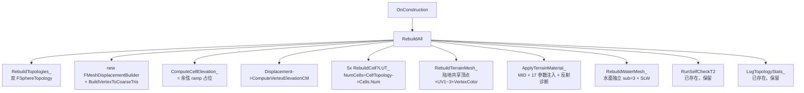

# T3：TerrainMesh + WaterMesh 双子组件 + 5 张 LUT 材质对接（子里程碑设计稿）

> 父稿：[TessellatedMeshDesign.md](TessellatedMeshDesign.md) §5.1 子里程碑切分中的 **T3** 行展开。
>
> **T3 定位**：在 T1（双拓扑骨架）/ T2（VertexToCoarseTris + dot 权重平均）已落地的基础上，让 [APlanetTessellatedMesh](../Source/TerraCivilization/Public/Render/PlanetTessellatedMesh.h) 在 Editor 中 Spawn 后**真正可见**——把 R8 [APlanetTopologyDebugMesh](../Source/TerraCivilization/Private/Render/PlanetTopologyDebugMesh.cpp) 的全套渲染骨架（5 LUT + 17 参数 MID + 水面 SLW）平移过来，但**几何**换成 T 阶段的"sub=4 共享顶点 mesh + 顶点位移"。
>
> **本稿与 R8 材质零绑定** —— 17 参数 Custom 节点、Triplanar、SLW 全部零改动复用。唯一的变化是顶点缓冲的填法（共享顶点 vs R8 的独立顶点）+ 顶点位移（Elevation 径向偏移）。
>
> **拍板时间**：2026-06-30。
>
> ---
>
> ⚠ **2026-06-30 修订（V2）**：本稿 V1 的"共享顶点路径 + D11 代表组挑选"模型**实际不可工作**——会让 T3 球面按 mesh 三角形粒度破碎。根因：R8 PS 端的 c0/c1/c2 是**三角形级常量**，光栅化后必须保持每个三角形内部 (c0, c1, c2) 不被插值；共享顶点路径下相邻三角形对同一个共享顶点写入不同的代表组，插值后 PS 解出乱码 cell ID。详见 [AgentWorkflow.md §3.17（修订版）](AgentWorkflow.md)。
>
> **V2 订正路径**：T3 实际采用 R8 同款"独立顶点 + 三角形级 c 一致"模型——每个 mesh 渲染三角形展开 3 个独立顶点，3 顶点写同一组 (HiC,LoC)/(HiA,LoA)/(HiB,LoB)。新增 helper `FindCoarseCellsForMeshTri_(MeshTriIdx, ...)` 通过 `MeshTopology->PrimalTriTreeNodes[T]` 沿 `Father` 爬升到粗 Cell 三角形拿 (cA, cB, cC)。**顶点位置 / 法线仍按共享 mesh 顶点 v 取值**（同一份 `PrimalVertsUnit[v]*(R+ElevCM[v])`），保证邻接三角形位置 / 法线连续，视觉无 flat shading 锯齿。详见下文 §3 末尾【V2 订正块】。
>
> 受订正影响的 V1 决策：**D11 已废弃**——无需"代表组挑选"，每个三角形直接拿粗 Cell 三角形的 (cA, cB, cC)。其余决策 D12~D17 不变。

---

## 0. 摘要

| 字段 | 值 |
| --- | --- |
| 上游验收前置 | T1（双拓扑骨架）✅ + T2（顶点位移算法 + 自检 PASS）✅ |
| 本里程碑产物 | `APlanetTessellatedMesh` 完整可视：`TerrainMeshComp`（陆地 sub=4 共享顶点）+ `WaterMeshComp`（水面独立 sub=3）+ 5 张动态 LUT + 17 参数 MID 注入 + PIE 退出材质恢复 |
| 视觉验收点 | Spawn 后看到 sub=4 多彩球皮（17 配方 placeholder）+ Elevation 赤道高两极低的 ramp test pattern 抬升明显 + 水面 SLW 反射 + 进出 PIE 材质不丢失 |
| 性能预算 | OnConstruction Rebuild < 50 ms（包括 5 张 LUT 重建 + 顶点位移 + 双 mesh 灌装） |
| 下游 | T4（接 `FCellGeoData.Elevation` 真实数据源）→ T5（验收清单 A~J） |

---

## 1. 关键设计决策（2026-06-30 拍板补丁）

T3 在父稿 §1.3 D1~D10 决策的基础上追加：

| # | 决策点 | 拍板值 | 理由 / 备忘 |
| --- | --- | --- | --- |
| **D11** | **顶点 UV 通道挑"权重最大的代表组"** | ✅ 简化路径 | mesh 顶点落入多个粗 Tri 时，从 `Displacement->VertexToCoarseTriIds[v]` 中挑"自身 dot 权重之和最大的那组"作为 UV1~3 写入。父稿 §4.2 已注：不同粗 Tri 内的"该顶点处 dot 权重最大者"通常都是同一个 cell，视觉差异控制在 1~2 像素亚像素级 → 肉眼不可见。 |
| **D12** | **placeholder elevation = 赤道高两极低的余弦 ramp** | `CellElev[c] = cos(lat) * 2 - 1`，归一化到 [-1, +1] | 比父稿 §6 风险点 5 提到的"按 cell 索引线性 ramp"更直观——直接看到一个赤道凸起、两极凹陷的可视化球皮。T4 接入 `FCellGeoData.Elevation` 后该 placeholder 自动失效。 |
| **D13** | **水面层使用独立 `WaterTopology(sub=3)` 实例** | ✅ 不复用 `MeshTopology` | R10 LOD 后 `MeshTopology` 可能升至 sub=5/6，水面层与之耦合无意义（水面 SLW 全部在 PS 端做扰动，几何细节零收益）。R8 [APlanetTopologyDebugMesh::RebuildWaterMesh_](../Source/TerraCivilization/Private/Render/PlanetTopologyDebugMesh.cpp#L1530) 已经是这个写法 → 直接整段复制。 |
| **D14** | **`RebuildCell*LUT_` 系列函数从 R8 整段复制粘贴到 T3** | ✅ 不抽公共工具函数 | 5 张 LUT 函数（`RebuildCellAttrLUT_` / `RebuildCellDirLUT_` / `RebuildCellTintLUT_` / `RebuildCellHSVRoughLUT_` / `RebuildCellNSpecLUT_`）逐字搬到 `APlanetTessellatedMesh`，把内部 `Topology->Cells` 的引用统一替换为 `CellTopology->Cells`。两个 actor 各自独立演化，T 阶段稳定后 R10/R11 LOD 再统一抽工具。 |
| **D15** | **PIE 退出材质恢复钩子（`OnPostWorldCleanup_`）必须复制** | ✅ 与 R8 一致 | 详见 [AgentWorkflow.md §3.11](AgentWorkflow.md) —— PIE 启动深拷贝 → 退出 PIE 后 Editor 端 MID 失效。Translucent SLW 路径下 fallback 到 DefaultMaterial 现象明显。T3 不带该钩子无法通过验收清单 I。 |
| **D16** | **R8 材质合规性反射诊断（17 inputs 检查）保留** | ✅ 与 R8 一致 | 帮助快速诊断"材质槽挂错、还是挂的是 R7/R5 旧材质"。T3 与 R8 的 Custom 节点 17 个 Inputs 完全一致，反射检查列表逐字复制。 |
| **D17** | **顶点法线 = `+MeshTopology->PrimalVertsUnit[v]`** | ✅ 朝外 | 父稿 D5 已拍板。共享顶点路径下，每个 mesh 顶点只有一个法线 —— 直接用单位方向，跨三角形天然光滑。**不调** `KismetTangents`（共享顶点路径下它会强制覆写为 flat shading）。Tangent 留空。 |

---

## 2. 总体执行序列



> **执行序列与 R8 [APlanetTopologyDebugMesh::Rebuild](../Source/TerraCivilization/Private/Render/PlanetTopologyDebugMesh.cpp#L201) 高度同构**——只有 R6（陆地 mesh 灌装）与 R3/R4（顶点位移）是 T 阶段独有的。其余步骤是 R8 函数的逐字搬运。

---

## 3. 陆地 Mesh 灌装算法（核心新增）

### 3.1 顶点缓冲格式（与 R8 的差异）

| 通道 | R8 独立顶点路径 | T3 共享顶点路径 |
| --- | --- | --- |
| 顶点数 | `NumCorners * 3 ≈ 3840` | `MeshTopology->PrimalVertsUnit.Num() = 2562`（sub=4） |
| 三角索引 | `[0,1,2, 3,4,5, ...]` 顺序 | `MeshTopology->PrimalTris[t].XYZ` 共享索引 |
| `Position` | `Cell[CornerCellId].UnitCenter * Radius` | **`PrimalVertsUnit[v] * (Radius + ElevCM[v])`** ⭐ 含位移 |
| `Normal` | `+UnitCenter`（每三角 3 顶点）| `+PrimalVertsUnit[v]`（每 mesh 顶点） |
| `UV0` | `(HiC, LoC)`（Corner.CellIds[2]）⭐ R8 把 UV0 借给 c2 | **代表组 c2** 的 `(HiC, LoC)` |
| `UV1.xy` | `(HiA, LoA)`（Corner.CellIds[0]）| **代表组 c0** 的 `(HiA, LoA)` |
| `UV2.xy` | `(HiB, LoB)`（Corner.CellIds[1]）| **代表组 c1** 的 `(HiB, LoB)` |
| `UV3.xy` | `(OneHotλ₀, OneHotλ₁)`，三顶点循环 (1,0)/(0,1)/(0,0) | **归一化 dot 权重** `(w0, w1)`，PS 自算 `w2 = 1 - w0 - w1` |
| `VertexColor` | LayerColor 预查（17 配方哈希）| LayerColor 预查（同公式）|
| `Tangent` | 留空 | 留空 |

> **关键观察**：UV0/UV1/UV2 的 cell ID 编码格式（Hi=CellId>>8, Lo=CellId&0xFF）与 R8 完全一致——PS 端 `int c_i = (int)round(UV_i.x) * 256 + (int)round(UV_i.y)` 解码不变。**3 个候选 cell 必须 3 个 UV 都写**——R8 PS 端的球面 Voronoi argmax(dot(dir, V_i)) 在 (c0, c1, c2) 三个候选间仲裁，任何一个漏写 → PS 把那个候选当成 cell 0 → 整球按 mesh 三角形粒度破碎（详见 [AgentWorkflow.md §3.17](AgentWorkflow.md) T3 经典踩坑）。共享顶点路径下，每个 mesh 顶点只能写一组 (c0, c1, c2) —— 这就是 D11 的"代表组"简化。

### 3.2 "代表组"的定义与挑选

```cpp
// 在 RebuildTerrainMesh_ 内部，对每个 mesh 顶点 v：
// 1. 取 Displacement->VertexToCoarseTriIds[v]（5 或 6 个粗 Tri 索引）
// 2. 对每个粗 Tri，算"该顶点处的 dot 权重之和"作为它的"代表力"分数
// 3. 选分数最高的那组 (c0, c1, c2) 写入 UV1/UV2 + (w0, w1) 写入 UV3

const TArray<int32>& CoarseTriIds = Displacement->VertexToCoarseTriIds[V];
int32 BestTriIdx = INDEX_NONE;
float BestScore  = -1.f;
FVector3f BestWeights;          // (w0, w1, w2) 已归一化

const FVector Dir = MeshTopology->PrimalVertsUnit[V];
for (int32 TriIdx : CoarseTriIds)
{
    const FIntVector& Tri = CellTopology->PrimalTris[TriIdx];
    float w0 = FMath::Max(0.f, FVector::DotProduct(Dir, CellTopology->Cells[Tri.X].UnitCenter));
    float w1 = FMath::Max(0.f, FVector::DotProduct(Dir, CellTopology->Cells[Tri.Y].UnitCenter));
    float w2 = FMath::Max(0.f, FVector::DotProduct(Dir, CellTopology->Cells[Tri.Z].UnitCenter));
    const float WSum = w0 + w1 + w2;
    if (WSum < KINDA_SMALL_NUMBER) continue;

    // 代表力 = 该粗 Tri 中"权重最大的那个分量"——挑得最"自信"的那个
    const float Score = FMath::Max3(w0, w1, w2);
    if (Score > BestScore)
    {
        BestScore  = Score;
        BestTriIdx = TriIdx;
        BestWeights = FVector3f(w0 / WSum, w1 / WSum, w2 / WSum);
    }
}

// BestTriIdx 的 (c0, c1, c2) 编码到 UV1/UV2，(w0, w1) 写到 UV3
```

> **不同粗 Tri 通常给出同一个"代表 cell"** —— 父稿 §4.2 注释的核心保证。例如 mesh 顶点处于 cell A 的内部（不是边界 / 顶点）时，它周围的 6 个粗 Tri 都是"A 邻接的某 3 个 Tri"，每个 Tri 中权重最大的总是 A → 选出来的代表组的 c0/c1/c2 都包含 A 且 A 的权重最高。1~2 像素亚像素级色阶在父稿 §6 风险点 3 中已标记为"目测才修"。

### 3.3 共享顶点 vs 法线连续性

R8 独立顶点路径下，每个三角形的 3 个顶点法线虽然都填 `+UnitCenter`，但由于顶点不共享，PS 端插值的 face normal 在三角形交界处会有 1~2° 的微小不连续——这是 R8 §3.14 修复的"昼夜分割线锯齿"问题的根源。

**T3 共享顶点路径天然光滑**：每个 mesh 顶点只有一个法线 = `PrimalVertsUnit[v]`，相邻三角形共享同一个法线值——无论 sub 多高，法线插值都是球面方向连续平滑。这是 T3 相比 R8 的**几何级视觉提升**。

### 3.4 完整伪代码

```cpp
void APlanetTessellatedMesh::RebuildTerrainMesh_()
{
    if (!TerrainMeshComp || !MeshTopology.IsValid() || !CellTopology.IsValid()) return;

    const int32 NumMeshVerts = MeshTopology->PrimalVertsUnit.Num();
    const int32 NumMeshTris  = MeshTopology->PrimalTris.Num();
    const int32 NumCells     = CellTopology->Cells.Num();

    // ---- 1) 计算 placeholder cell elevation（D12：余弦 ramp）----
    TArray<float> CellElev;
    ComputeCellElevation_(CellElev);   // size = NumCells

    // ---- 2) 顶点位移 ----
    TArray<float> VertexElevCM;
    Displacement->ComputeVertexElevationCM(CellElev, ElevationScaleCM, VertexElevCM);

    // ---- 3) 装填顶点缓冲（共享顶点）----
    TArray<FVector>          Vertices;       Vertices.SetNumUninitialized(NumMeshVerts);
    TArray<FVector>          Normals;        Normals.SetNumUninitialized(NumMeshVerts);
    TArray<FVector2D>        UV0, UV1, UV2, UV3;
    UV0.SetNumZeroed(NumMeshVerts);
    UV1.SetNumUninitialized(NumMeshVerts);
    UV2.SetNumUninitialized(NumMeshVerts);
    UV3.SetNumUninitialized(NumMeshVerts);
    TArray<FLinearColor>     VertexColors;   VertexColors.SetNumUninitialized(NumMeshVerts);
    TArray<FProcMeshTangent> Tangents;       // 留空，与 R8 主 mesh 一致

    for (int32 V = 0; V < NumMeshVerts; ++V)
    {
        const FVector Dir = MeshTopology->PrimalVertsUnit[V];
        Vertices[V] = Dir * (GlobeRadiusCM + VertexElevCM[V]);
        Normals[V]  = Dir;     // D17：径向法线，共享顶点天然光滑

        // ---- 挑代表组（§3.2）----
        int32 c0 = 0, c1 = 0, c2 = 0;
        FVector3f W(1.f, 0.f, 0.f);
        FindRepresentativeCoarseTri_(V, Dir, /*out*/ c0, c1, c2, /*out*/ W);

        // UV0/UV1/UV2：cell ID 拆 Hi/Lo 编码（与 R8 完全一致；3 个 UV 全部写）
        // ⚠ R8 PS 端把 UV0 借给 c2（详见 PlanetTopologyDebugMesh.cpp L505），
        //    漏写 UV0 → PS 把 c2 当成 cell 0 → 整球按 mesh 三角形粒度破碎。
        //    见 AgentWorkflow.md §3.17 经典踩坑。
        UV0[V] = FVector2D((float)((c2 >> 8) & 0xFF), (float)(c2 & 0xFF));
        UV1[V] = FVector2D((float)((c0 >> 8) & 0xFF), (float)(c0 & 0xFF));
        UV2[V] = FVector2D((float)((c1 >> 8) & 0xFF), (float)(c1 & 0xFF));
        // UV3：归一化 dot 权重 (w0, w1)，PS 自算 w2 = 1 - w0 - w1
        UV3[V] = FVector2D(W.X, W.Y);

        // VertexColor：LayerColor 预查（与 R8 公式完全一致，bUseR8PlaceholderRecipes 分支）
        VertexColors[V] = ComputeVertexLayerColor_(c0);
    }

    // ---- 4) 装填三角形索引（共享）----
    TArray<int32> Triangles;
    Triangles.Reserve(NumMeshTris * 3);
    for (const FIntVector& Tri : MeshTopology->PrimalTris)
    {
        Triangles.Add(Tri.X);
        Triangles.Add(Tri.Y);
        Triangles.Add(Tri.Z);
    }

    // ---- 5) 提交 PMC ----
    TerrainMeshComp->ClearAllMeshSections();
    TerrainMeshComp->CreateMeshSection_LinearColor(
        /*SectionIndex*/ 0,
        Vertices, Triangles, Normals,
        UV0, UV1, UV2, UV3,
        VertexColors, Tangents,
        /*bCreateCollision*/ false);

    // ---- 6) 应用材质（17 参数 MID）----
    ApplyTerrainMaterial_(NumCells);
}
```

### 3.5 placeholder Elevation：余弦 ramp（D12）

```cpp
void APlanetTessellatedMesh::ComputeCellElevation_(TArray<float>& OutElev) const
{
    const int32 NumCells = CellTopology->Cells.Num();
    OutElev.SetNumUninitialized(NumCells);
    for (int32 c = 0; c < NumCells; ++c)
    {
        const FVector& U = CellTopology->Cells[c].UnitCenter;
        // D12：赤道（|z| ≈ 0）抬高、两极（|z| ≈ 1）凹陷
        // 取值范围 [-1, +1]：赤道 = +1，两极 = -1
        const float AbsZ = FMath::Abs((float)U.Z);
        OutElev[c] = 1.0f - 2.0f * AbsZ;
    }
}
```

> 这个 placeholder 在 T4 接入 `FCellGeoData.Elevation` 后会**自动失效**——`RebuildAll_` 检测 Generator 已 ready 时优先用真实数据，否则走这个 placeholder。具体切换逻辑在 §6.3 的"T4 兼容口"中说明。

---

### 3.6【V2 订正块】R8 同款独立顶点 + 三角形级 c 一致路径（**实际落地版**）

> 本节是对 §3.1~§3.4 共享顶点路径（V1）的根本性订正。落地代码以本节为准，§3.1~§3.4 保留作历史对照。

#### 3.6.1 V1 共享顶点路径为何不工作

| 假设 | 是否成立 |
| --- | --- |
| R8 PS 端的球面 Voronoi `argmax(dot(dir, V_i))` 在 (c0, c1, c2) 三个候选间仲裁 | ✅ 成立 |
| **每个渲染三角形内部 (c0, c1, c2) 必须保持常量**（光栅化插值后 PS 仍解出同一组 cell ID）| ✅ 成立（R8 PS 端的核心隐含假设） |
| 共享顶点路径下，一个 mesh 顶点 V 被 5/6 个邻接三角形使用，每个三角形需要写"自己所属粗 Cell 三角形的 (c0, c1, c2)" | ❌ 不成立——5/6 个三角形要的 c 三元组通常不同，V 只能保留一组 |
| V1 用 D11"代表组挑选"挑权重最大的一组写入 V，光栅化后插值能给 PS 一个"近似正确"的 c | ❌ 不成立——光栅化器对 (Hi, Lo) 做线性插值后 round 出的 cell ID 是**毫无意义的随机值**（5/6 个不同代表组的 weighted blend round 不到任何真实 cell） |

V1 视觉症状（已实测）：每个 hex 形状还在，但内部按 mesh 三角形粒度破碎——这正是"PS 在三角形内部解出乱码 cell ID + argmax 选错"的特征。

#### 3.6.2 V2 订正路径

**核心思路**：保留 R8 一直以来的"独立顶点 + 三角形 3 顶点写同一组 (cA, cB, cC)"模式，让 R8 PS 端的 c 三角形级常量假设自然成立。**位置 / 法线**仍按 mesh 顶点共享取值，保证视觉光滑。

```
对每个 mesh 渲染三角形 T (T ∈ [0, NumMeshTris))：
    1. 通过 MeshTopology->PrimalTriTreeNodes[T] 沿 Father 爬升 (MeshSub - CellSub) 步
       → 得到所属粗 Cell 三角形的 (cA, cB, cC)
    2. 三角形 T 的 3 个顶点对应 mesh 顶点 V0/V1/V2 = MeshTopology->PrimalTris[T].XYZ
    3. 展开成 3 个独立顶点：
       Role 0: Position = PrimalVertsUnit[V0] * (R + ElevCM[V0])
               Normal   = PrimalVertsUnit[V0]
               UV0=(HiC,LoC)  UV1=(HiA,LoA)  UV2=(HiB,LoB)  UV3=(1,0)
               VertexColor = hash(cA)
       Role 1: Position = PrimalVertsUnit[V1] * (R + ElevCM[V1])
               Normal   = PrimalVertsUnit[V1]
               UV0=(HiC,LoC)  UV1=(HiA,LoA)  UV2=(HiB,LoB)  UV3=(0,1)
               VertexColor = hash(cB)
       Role 2: Position = PrimalVertsUnit[V2] * (R + ElevCM[V2])
               Normal   = PrimalVertsUnit[V2]
               UV0=(HiC,LoC)  UV1=(HiA,LoA)  UV2=(HiB,LoB)  UV3=(0,0)
               VertexColor = hash(cC)
    4. 三角索引：BaseIdx + 0/1/2（与 R8 一致）
```

#### 3.6.3 顶点缓冲尺寸对比

| 路径 | 顶点数 | 三角索引 | 三角形内部 c 是常量？ |
| --- | --- | --- | --- |
| R8 独立顶点 | NumCorners × 3 = 3840（sub=3）| 顺序 0,1,2,3,... | ✅ |
| T3 V1 共享顶点 | NumMeshVerts = 2562（sub=4）| `MeshTopology->PrimalTris[T].XYZ` | ❌ 破碎根因 |
| **T3 V2 独立顶点** | NumMeshTris × 3 = 15360（sub=4）| BaseIdx + 0/1/2 | ✅ |

T3 V2 顶点数比 R8 多 4 倍（5120 vs 1280 三角形 × 3）——但球面渲染量级下完全不重要。

#### 3.6.4 视觉光滑性保证

虽然 V2 把每个三角形展开 3 独立顶点，但**位置 / 法线**仍按 mesh 顶点 v 取值：

- 三角形 T 的 Role 0 顶点的 Position = `PrimalVertsUnit[V0] * (R + ElevCM[V0])`
- 邻接三角形 T' 共享 mesh 顶点 V0，T' 的 Role-? 顶点的 Position 也 = `PrimalVertsUnit[V0] * (R + ElevCM[V0])`

两个独立顶点的 Position **完全相等**，两个独立顶点的 Normal 也完全相等。GPU 光栅化器把它们视作不同顶点，但视觉上和共享顶点完全等价——**没有 flat shading 锯齿，没有顶点位移撕裂**。

V2 仅在"语义属性"（UV0~3 + VertexColor）上让独立顶点各自承载该三角形的 (cA, cB, cC)，这是 R8 一贯的"位置共享 + UV 不共享"设计——T 阶段沿用即可。

#### 3.6.5 V2 关键 helper：`FindCoarseCellsForMeshTri_`

```cpp
bool APlanetTessellatedMesh::FindCoarseCellsForMeshTri_(int32 MeshTriIdx,
    int32& OutCA, int32& OutCB, int32& OutCC) const
{
    if (!MeshTopology->PrimalTriTreeNodes.IsValidIndex(MeshTriIdx)) return false;
    FTriTreeNode* Node = MeshTopology->PrimalTriTreeNodes[MeshTriIdx];
    if (!Node) return false;

    const int32 ClimbSteps = MeshTopology->SubdivisionLevel - CellTopology->SubdivisionLevel;
    for (int K = 0; K < ClimbSteps && Node && Node->Father; ++K) Node = Node->Father;

    if (!Node) return false;
    OutCA = Node->CellIds[0];
    OutCB = Node->CellIds[1];
    OutCC = Node->CellIds[2];
    return CellTopology->Cells.IsValidIndex(OutCA)
        && CellTopology->Cells.IsValidIndex(OutCB)
        && CellTopology->Cells.IsValidIndex(OutCC);
}
```

依赖 T2 已经验证过的同构性约束（[TessellatedMeshDesign.md §3.3](TessellatedMeshDesign.md)）：sub=N 与 sub=M（M>N）的 FSphereTopology 是子图同构的——爬升后 `Node->CellIds[0..2]` 直接是 CellTopology 的 cell 索引。

#### 3.6.6 与 V1 决策的兼容性

| V1 决策 | V2 处理 |
| --- | --- |
| **D11**（代表组挑选）| ❌ **废弃**——V2 直接用粗 Cell 三角形的 (cA, cB, cC)，无需挑选 |
| **D12**（余弦 ramp elevation）| ✅ 保留 |
| **D13**（水面独立 sub=3）| ✅ 保留 |
| **D14**（5 张 LUT 整段搬运）| ✅ 保留 |
| **D15**（PIE 退出钩子）| ✅ 保留 |
| **D16**（17 inputs 反射诊断）| ✅ 保留 |
| **D17**（顶点法线 = `+UnitCenter`）| ✅ 保留——V2 仍然每独立顶点的 Normal = 该 mesh 顶点的 PrimalVertsUnit |

#### 3.6.7 V2 顶点缓冲完整伪代码

```cpp
void APlanetTessellatedMesh::RebuildTerrainMesh_()  // V2
{
    const int32 NumMeshTris = MeshTopology->PrimalTris.Num();
    const int32 NumOutVerts = NumMeshTris * 3;     // 独立顶点（不再 = NumMeshVerts）

    // VertexElevCM 仍按 mesh 顶点 v 索引取值（T2 计算结果）
    TArray<float> CellElev;       ComputeCellElevation_(CellElev);
    TArray<float> VertexElevCM;   Displacement->ComputeVertexElevationCM(CellElev, ElevationScaleCM, VertexElevCM);

    TArray<FVector> Vertices;     Vertices.Reserve(NumOutVerts);
    TArray<int32>   Triangles;    Triangles.Reserve(NumOutVerts);
    TArray<FVector> Normals;      Normals.Reserve(NumOutVerts);
    TArray<FVector2D> UV0, UV1, UV2, UV3;
    TArray<FLinearColor> VertexColors;
    TArray<FProcMeshTangent> Tangents;   // 留空

    for (int32 T = 0; T < NumMeshTris; ++T)
    {
        int32 cA, cB, cC;
        FindCoarseCellsForMeshTri_(T, cA, cB, cC);

        const FVector2D EncA(static_cast<float>((cA>>8)&0xFF), static_cast<float>(cA&0xFF));
        const FVector2D EncB(static_cast<float>((cB>>8)&0xFF), static_cast<float>(cB&0xFF));
        const FVector2D EncC(static_cast<float>((cC>>8)&0xFF), static_cast<float>(cC&0xFF));

        const FIntVector& Tri = MeshTopology->PrimalTris[T];
        const FVector D0 = MeshTopology->PrimalVertsUnit[Tri.X];
        const FVector D1 = MeshTopology->PrimalVertsUnit[Tri.Y];
        const FVector D2 = MeshTopology->PrimalVertsUnit[Tri.Z];

        const FVector P0 = D0 * (GlobeRadiusCM + VertexElevCM[Tri.X]);
        const FVector P1 = D1 * (GlobeRadiusCM + VertexElevCM[Tri.Y]);
        const FVector P2 = D2 * (GlobeRadiusCM + VertexElevCM[Tri.Z]);

        const int32 BaseIdx = Vertices.Num();

        // Role 0
        Vertices.Add(P0); Normals.Add(D0);
        UV0.Add(EncC); UV1.Add(EncA); UV2.Add(EncB); UV3.Add(FVector2D(1,0));
        VertexColors.Add(ComputeVertexLayerColor_(cA));
        // Role 1
        Vertices.Add(P1); Normals.Add(D1);
        UV0.Add(EncC); UV1.Add(EncA); UV2.Add(EncB); UV3.Add(FVector2D(0,1));
        VertexColors.Add(ComputeVertexLayerColor_(cB));
        // Role 2
        Vertices.Add(P2); Normals.Add(D2);
        UV0.Add(EncC); UV1.Add(EncA); UV2.Add(EncB); UV3.Add(FVector2D(0,0));
        VertexColors.Add(ComputeVertexLayerColor_(cC));

        Triangles.Add(BaseIdx + 0);
        Triangles.Add(BaseIdx + 1);
        Triangles.Add(BaseIdx + 2);
    }

    TerrainMeshComp->ClearAllMeshSections();
    TerrainMeshComp->CreateMeshSection_LinearColor(0, Vertices, Triangles, Normals,
        UV0, UV1, UV2, UV3, VertexColors, Tangents, /*bCreateCollision*/false);
}
```

---

## 4. 5 张 LUT 重建（D14：从 R8 整段搬运）

### 4.1 函数清单

T3 的 `APlanetTessellatedMesh` 类中**新增 5 个私有方法**，函数体逐字复制 [PlanetTopologyDebugMesh.cpp](../Source/TerraCivilization/Private/Render/PlanetTopologyDebugMesh.cpp) 的同名函数，仅做 1 处机械替换：

| 函数 | R8 行号 | 复制后唯一改动 |
| --- | --- | --- |
| `RebuildCellAttrLUT_(int32 NumCells)` | L915~L1100 | 把内部 `Topology->Cells[*]` 改为 `CellTopology->Cells[*]`；`Generator` 字段重命名为 `WorldGenerator`（避免与 W4 时序耦合，保留独立路径） |
| `RebuildCellDirLUT_(int32 NumCells)` | L1186~L1280 | 同上 `Topology` → `CellTopology` |
| `RebuildCellTintLUT_(int32 NumCells)` | L1332~L1410 | 仅 NumCells 维度，不读 Topology——零改动复制 |
| `RebuildCellHSVRoughLUT_(int32 NumCells)` | L1413~L1455 | 同上 |
| `RebuildCellNSpecLUT_(int32 NumCells)` | L1459~L1525 | 同上 |

### 4.2 共用 helper（三角形列表）

R8 的两个内部 helper 也需要随附：

```cpp
// 1) static const FR8Recipe& R8_PickRecipe(bool bUsePlaceholder, int32 CellId);
// 2) static UTexture2D* R8_CreateFloatRGBALUT(int32 NumCells, const TCHAR* DebugName);
// 3) static int32 R8_PlaceholderRecipeIndex(int32 CellId);   // 17 配方哈希
```

这 3 个 static 函数已经在 R8 .cpp 中定义为 file-static —— T3 .cpp 中需要**再次粘贴一份**（cpp file 内部 linkage，不冲突）。**不抽到公共头文件**——D14 的"两个 actor 各自独立演化"原则。

### 4.3 17 配方表 `GR8Recipes` 的处理

R8 .cpp 中有一个 file-static `static const FR8Recipe GR8Recipes[17] = { ... }` 配方表。两个 actor 都需要它 —— 如果两个 cpp 都各自定义同名 static，C++ 链接没问题（file 内部 linkage），但**维护成本翻倍**。

**T3 拍板**：把 `GR8Recipes[17]` + `R8_PlaceholderRecipeIndex` + `FR8Recipe` 结构体抽到公共头 `Source/TerraCivilization/Private/Render/R8RecipeTable.h`（**仅这 1 个例外**——配方数据是"R8 阶段拍死的常量表"，与 actor 解耦）。`R8_PickRecipe` / `R8_CreateFloatRGBALUT` 仍各自 static 不抽。

> 这是对 D14 的**唯一例外**——拍板理由：17 配方表是 R8 设计阶段的"产品级常量"，两个 actor 都消费但不修改。把它抽到公共头比让两份各自维护更稳——后续若 W4 调整任一配方的 RGB tint，只需改一处。

---

## 5. MID 注入（17 参数）+ 反射诊断（D16）

### 5.1 ApplyTerrainMaterial_ 实现

完全平移 R8 [Rebuild() L633~L759](../Source/TerraCivilization/Private/Render/PlanetTopologyDebugMesh.cpp#L633) 的 MID 注入段，包括：

```cpp
void APlanetTessellatedMesh::ApplyTerrainMaterial_(int32 NumCells)
{
    if (!TerrainMaterial)
    {
        TerrainMeshComp->SetMaterial(0, nullptr);
        return;
    }

    UMaterialInstanceDynamic* NewMID = UMaterialInstanceDynamic::Create(TerrainMaterial, this);
    if (NewMID)
    {
        // R3 注入
        if (CellAttrLUT)  NewMID->SetTextureParameterValue(TEXT("CellAttrLUT"), CellAttrLUT);
        NewMID->SetScalarParameterValue(TEXT("NumLayersHint"), (float)NumLayersHint);
        NewMID->SetScalarParameterValue(TEXT("NumCells"),      (float)NumCells);

        // R4 注入：CellDirLUT + PlanetCenter
        if (CellDirLUT)   NewMID->SetTextureParameterValue(TEXT("CellDirLUT"), CellDirLUT);
        const FVector ActorLoc = GetActorLocation();
        NewMID->SetVectorParameterValue(TEXT("PlanetCenter"),
            FLinearColor((float)ActorLoc.X, (float)ActorLoc.Y, (float)ActorLoc.Z, 0.0f));

        // R5/R6 注入
        NewMID->SetScalarParameterValue(TEXT("EdgeWidth"),      EdgeWidth);
        NewMID->SetScalarParameterValue(TEXT("NoiseAmplitude"), NoiseAmplitude);
        NewMID->SetScalarParameterValue(TEXT("NoiseScale"),     NoiseScale);

        // R7 注入：Triplanar
        if (TerrainAlbedoArray) NewMID->SetTextureParameterValue(TEXT("TerrainAlbedoArray"), TerrainAlbedoArray);
        if (TerrainNormalArray) NewMID->SetTextureParameterValue(TEXT("TerrainNormalArray"), TerrainNormalArray);
        NewMID->SetScalarParameterValue(TEXT("TriplanarSharpness"), TriplanarSharpness);
        NewMID->SetScalarParameterValue(TEXT("TileScale"),         TileScale);

        // R8 注入：3 PBR base + 3 LUT
        if (PBRBaseAlbedo)    NewMID->SetTextureParameterValue(TEXT("PBRBaseAlbedo"),    PBRBaseAlbedo);
        if (PBRBaseNormal)    NewMID->SetTextureParameterValue(TEXT("PBRBaseNormal"),    PBRBaseNormal);
        if (PBRBaseRoughness) NewMID->SetTextureParameterValue(TEXT("PBRBaseRoughness"), PBRBaseRoughness);
        if (PBRBaseHeight)    NewMID->SetTextureParameterValue(TEXT("PBRBaseHeight"),    PBRBaseHeight);
        if (CellTintLUT)      NewMID->SetTextureParameterValue(TEXT("CellTintLUT"),      CellTintLUT);
        if (CellHSVRoughLUT)  NewMID->SetTextureParameterValue(TEXT("CellHSVRoughLUT"),  CellHSVRoughLUT);
        if (CellNSpecLUT)     NewMID->SetTextureParameterValue(TEXT("CellNSpecLUT"),     CellNSpecLUT);
    }

    TerrainMID = NewMID;
    TerrainMeshComp->SetMaterial(0,
        TerrainMID ? static_cast<UMaterialInterface*>(TerrainMID) : TerrainMaterial.Get());

    // ---- D16：R8 合规性反射诊断（17 inputs 检查）----
    DiagnoseR8Material_();
}
```

### 5.2 反射诊断（D16）

`DiagnoseR8Material_` 函数体逐字复制 R8 [L661~L750](../Source/TerraCivilization/Private/Render/PlanetTopologyDebugMesh.cpp#L661) 的 `#if WITH_EDITORONLY_DATA` 块（17 inputs 期望表 + Custom 节点反射 + missing/disconnected 报告）。期望 inputs 列表与 R8 一致：

```cpp
const TArray<FString> ExpectedR8Inputs = {
    TEXT("uv0"), TEXT("uv1"), TEXT("uv2"), TEXT("uv3"),
    TEXT("worldpos"), TEXT("planetcenter"),
    TEXT("cellattrlut"), TEXT("celldirlut"),
    TEXT("edgewidth"),
    TEXT("noiseamplitude"), TEXT("noisescale"),
    TEXT("triplanarsharpness"), TEXT("tilescale"),
    TEXT("pbrbasealbedo"),
    TEXT("celltintlut"), TEXT("cellhsvroughlut"), TEXT("cellnspeclut"),
};
```

> T3 用户挂的材质若不是 R8 合规材质（缺 input / 未连线），Output Log 会输出红色 Error 行 —— 与 R8 验收期同款诊断体验。

---

## 6. 水面 Mesh（D13：独立 sub=3）

### 6.1 RebuildWaterMesh_ 实现

**整段从 R8 [L1530~L1700](../Source/TerraCivilization/Private/Render/PlanetTopologyDebugMesh.cpp#L1530) 复制粘贴**——它本来就用了 `WaterTopology(sub=3)` 独立实例，与 `MeshTopology` 完全无关，零改动可用。

唯一的字段重命名：
- R8 中 `bEnableWaterShell` → T3 同名，已存在
- R8 中 `WaterSurfaceOffset` 字段语义 = `WaterRadius - GlobeRadius`，T3 改为直接读 `WaterRadiusCM`，内部计算 `Offset = WaterRadiusCM - GlobeRadiusCM`

### 6.2 PIE 退出材质恢复（D15）

**整段复制 R8 [OnPostWorldCleanup_ L1730~](../Source/TerraCivilization/Private/Render/PlanetTopologyDebugMesh.cpp#L1730)** —— 包括：

1. `BeginPlay` 中绑定 `FWorldDelegates::OnPostWorldCleanup.AddUObject(this, &APlanetTessellatedMesh::OnPostWorldCleanup_)`
2. `BeginDestroy` 中解绑（注意：`APlanetTessellatedMesh::BeginDestroy` 当前不 override —— D15 要求新增 override，但**只做 delegate 解绑**，不动 TUniquePtr 字段，避免触发 [AgentWorkflow.md §3.9](AgentWorkflow.md) 的崩溃）
3. `OnPostWorldCleanup_` 内部判断"被 cleanup 的不是本 actor 所在 World"才调 `RebuildAll_()`

> ⚠ **D15 + AgentWorkflow §3.9 的精细平衡**：T1 已经讨论过 `BeginDestroy` 不能 Reset TUniquePtr（崩溃 case）。T3 引入 `OnPostWorldCleanup_` delegate 后必须解绑——若不在 `BeginDestroy` 解绑，Editor 关闭时 delegate 会持有悬挂指针。**正确做法**：T3 重新引入 `BeginDestroy` override，**只调 `FWorldDelegates::OnPostWorldCleanup.RemoveAll(this)`**，不 Reset 任何 TUniquePtr 字段。

### 6.3 T4 兼容口

为 T4 接入 `FCellGeoData.Elevation` 预留切换分支：

```cpp
void APlanetTessellatedMesh::ComputeCellElevation_(TArray<float>& OutElev) const
{
    const int32 NumCells = CellTopology->Cells.Num();
    OutElev.SetNumUninitialized(NumCells);

    // T4 接入路径：若 WorldGenerator 已 ready 且 NumCells 匹配，用真实数据
    if (WorldGenerator.IsValid() && WorldGenerator->GetCellData().Num() == NumCells)
    {
        const TArray<FCellGeoData>& CellsData = WorldGenerator->GetCellData();
        for (int32 c = 0; c < NumCells; ++c)
            OutElev[c] = CellsData[c].Elevation;
        return;
    }

    // T3 placeholder：D12 余弦 ramp（赤道高、两极低）
    for (int32 c = 0; c < NumCells; ++c)
    {
        const FVector& U = CellTopology->Cells[c].UnitCenter;
        const float AbsZ = FMath::Abs((float)U.Z);
        OutElev[c] = 1.0f - 2.0f * AbsZ;
    }
}
```

T3 阶段 `WorldGenerator` 字段保持为空 → 永远走 placeholder 分支。T4 中 `RebuildAll_` 在 LUT 重建前 `MakeUnique<FWorldGenerator>(...)` 并 `Generate()`，自然切换到真实数据。

---

## 7. 头文件增量（[PlanetTessellatedMesh.h](../Source/TerraCivilization/Public/Render/PlanetTessellatedMesh.h)）

T3 在 T1 已有头文件之上**新增**（保留 T1 已有字段，不删任何东西）：

```cpp
// ---- §1.3 / §3 R8 全套材质参数（与 R8 actor 完全对齐）----
UPROPERTY(EditAnywhere, Category = "PlanetTopology|Tess|R8")
float EdgeWidth = 0.005f;     // R5 软边过渡（弧度）
UPROPERTY(EditAnywhere, Category = "PlanetTopology|Tess|R8")
float NoiseAmplitude = 0.0f;  // R6 边界噪声振幅（弧度）
UPROPERTY(EditAnywhere, Category = "PlanetTopology|Tess|R8")
float NoiseScale = 25.0f;     // R6 边界噪声频率（/rad）
UPROPERTY(EditAnywhere, Category = "PlanetTopology|Tess|R8")
float TriplanarSharpness = 4.0f;
UPROPERTY(EditAnywhere, Category = "PlanetTopology|Tess|R8")
float TileScale = 200.0f;     // cm/周期
UPROPERTY(EditAnywhere, Category = "PlanetTopology|Tess|R8")
int32 NumLayersHint = 17;     // 配方数量（17）
UPROPERTY(EditAnywhere, Category = "PlanetTopology|Tess|R8")
bool bUseR8PlaceholderRecipes = true;

// 3 张 PBR base
UPROPERTY(EditAnywhere, Category = "PlanetTopology|Tess|R8")
TObjectPtr<UTexture2DArray> PBRBaseAlbedo;
UPROPERTY(EditAnywhere, Category = "PlanetTopology|Tess|R8")
TObjectPtr<UTexture2DArray> PBRBaseNormal;
UPROPERTY(EditAnywhere, Category = "PlanetTopology|Tess|R8")
TObjectPtr<UTexture2DArray> PBRBaseRoughness;
UPROPERTY(EditAnywhere, Category = "PlanetTopology|Tess|R8")
TObjectPtr<UTexture2DArray> PBRBaseHeight;

// R7 旧路径（向后兼容，不再首选）
UPROPERTY(EditAnywhere, Category = "PlanetTopology|Tess|R8")
TObjectPtr<UTexture2DArray> TerrainAlbedoArray;
UPROPERTY(EditAnywhere, Category = "PlanetTopology|Tess|R8")
TObjectPtr<UTexture2DArray> TerrainNormalArray;

// ---- 5 张动态 LUT（运行期重建）----
UPROPERTY(Transient) TObjectPtr<UTexture2D> CellAttrLUT;
UPROPERTY(Transient) TObjectPtr<UTexture2D> CellDirLUT;
UPROPERTY(Transient) TObjectPtr<UTexture2D> CellTintLUT;
UPROPERTY(Transient) TObjectPtr<UTexture2D> CellHSVRoughLUT;
UPROPERTY(Transient) TObjectPtr<UTexture2D> CellNSpecLUT;

// ---- MID（运行期重建，每次 Rebuild 重新 Create）----
UPROPERTY(Transient) TObjectPtr<UMaterialInstanceDynamic> TerrainMID;

// ---- 水面层独立拓扑（D13）----
TUniquePtr<FSphereTopology> WaterTopology;

// ---- T4 接入口：WorldGen ----
TUniquePtr<FWorldGenerator> WorldGenerator;   // T3 始终为空；T4 起 MakeUnique + Generate

// ---- 新增私有方法 ----
private:
    void ComputeCellElevation_(TArray<float>& OutElev) const;
    void FindRepresentativeCoarseTri_(int32 V, const FVector& Dir,
        int32& OutC0, int32& OutC1, int32& OutC2, FVector3f& OutWeights) const;
    FLinearColor ComputeVertexLayerColor_(int32 CellId) const;

    void RebuildCellAttrLUT_(int32 NumCells);
    void RebuildCellDirLUT_(int32 NumCells);
    void RebuildCellTintLUT_(int32 NumCells);
    void RebuildCellHSVRoughLUT_(int32 NumCells);
    void RebuildCellNSpecLUT_(int32 NumCells);

    void RebuildTerrainMesh_();
    void RebuildWaterMesh_();

    void ApplyTerrainMaterial_(int32 NumCells);
    void DiagnoseR8Material_() const;

    // D15：PIE 退出材质恢复
    void OnPostWorldCleanup_(UWorld* World, bool bSessionEnded, bool bCleanupResources);

protected:
    // D15 重新引入：仅做 delegate 解绑，不动 TUniquePtr
    virtual void BeginPlay() override;
    virtual void BeginDestroy() override;
```

> **新增 UPROPERTY 数量**：约 12 个（与 R8 [PlanetTopologyDebugMesh.h](../Source/TerraCivilization/Public/Render/PlanetTopologyDebugMesh.h) 一致）。  
> **新增私有方法数量**：14 个（5 LUT + 3 mesh helper + 3 算法 helper + 2 材质 + 1 PIE 钩子）。

---

## 8. R8 → T3 文件搬运清单

| R8 函数 / 数据 | R8 行号 | T3 处理方式 | 备注 |
| --- | --- | --- | --- |
| `RebuildCellAttrLUT_` | L915 | **整段复制** + `Topology->Cells` → `CellTopology->Cells` | W4 路径暂行 placeholder（`bUseR8PlaceholderRecipes=true`） |
| `RebuildCellDirLUT_` | L1186 | **整段复制** + 同上 | |
| `RebuildCellTintLUT_` | L1332 | **整段复制**（不读 Topology，无替换） | |
| `RebuildCellHSVRoughLUT_` | L1413 | **整段复制** | |
| `RebuildCellNSpecLUT_` | L1459 | **整段复制** | |
| `RebuildWaterMesh_` | L1530 | **整段复制**（已是独立 `WaterTopology(sub=3)`） | `WaterSurfaceOffset` → `WaterRadiusCM - GlobeRadiusCM` |
| `OnPostWorldCleanup_` | L1730 | **整段复制** | D15 |
| `R8_PlaceholderRecipeIndex` | file-static | **抽到** `R8RecipeTable.h` | D14 唯一例外 |
| `GR8Recipes[17]` | file-static | **抽到** `R8RecipeTable.h` | 同上 |
| `GR8NeutralRecipe` | file-static | **抽到** `R8RecipeTable.h` | 同上 |
| `R8_PickRecipe` | file-static | **各 cpp 各自定义** | D14 |
| `R8_CreateFloatRGBALUT` | file-static | **各 cpp 各自定义** | D14 |
| `Rebuild()` 顶点装填段 | L201~L600 | **不复制**——T3 §3.4 共享顶点路径完全重写 | T3 与 R8 的核心差异即此处 |
| `Rebuild()` MID 注入段 | L633~L759 | **整段复制**到 `ApplyTerrainMaterial_` | 5 LUT 注入名称完全一致 |
| `Rebuild()` 反射诊断段 | L661~L750 | **整段复制**到 `DiagnoseR8Material_` | D16 |

> **新文件**：`Source/TerraCivilization/Private/Render/R8RecipeTable.h`（约 200 行，17 配方表 + 索引函数）。

---

## 9. 验收标准（T3 子里程碑）

依 [TessellatedMeshDesign.md §5.3 验收清单 A~J](TessellatedMeshDesign.md#53-验收清单-aj-依-agentworkflowmd-5-阶段验收清单模板) 的子集——T3 阶段需要满足以下**核心 5 项**（其余项延至 T5 整体验收）：

| # | 项 | 通过条件 |
| --- | --- | --- |
| **T3-A** | 编译通过 | `Build.bat TerraCivilizationEditor Win64 Development` 0 error / 0 warn |
| **T3-B** | OnConstruction Rebuild < 50 ms | `STAT FrameTime` 拖动 `MeshSubdivisionLevel` / `ElevationScaleCM` 不卡顿 |
| **T3-C** | Spawn 后看到 sub=4 多彩球皮 | Editor 中拖入 actor → 17 配方颜色随 cell 分布 |
| **T3-D** | placeholder Elevation 径向位移可见 | 默认 `ElevationScaleCM=500` → 赤道凸起约 5m，两极凹陷约 5m，肉眼可辨 |
| **T3-E** | 水面 SLW 反射正常 + 进出 PIE 不丢材质 | 勾 `bEnableWaterShell` 看到水面层；进 PIE 后退出 → Editor 中材质仍正常（D15 钩子生效） |
| **T3-F** | sub=3 视觉对照 R8 actor | `MeshSubdivisionLevel = 3` 时，在 Editor 中并排放置 `APlanetTopologyDebugMesh` 与 `APlanetTessellatedMesh`，两者**球皮颜色分布几乎一致**（粗 Tri 顶点处 1~2 像素亚像素色阶可接受） |
| **T3-G** | Output Log 反射诊断 PASS | `[PlanetTess] Material 'M_PlanetTessellated' is R8-compliant ✓`（用户挂 R8 合规材质时）|

> **T3 不验收项**（推迟到 T4 / T5）：
> - 真实 `FCellGeoData.Elevation` 接入（T4）
> - 整体 A~J 清单（T5）
> - sub=5 / sub=6 LOD 测试（R10）

---

## 10. 风险点与对策

| # | 风险 | 触发场景 | 对策 |
| --- | --- | --- | --- |
| 1 | "代表组"挑选在 cell 边界顶点上不稳定（5/6 个粗 Tri 各自的 BestScore 数值接近）| sub=4 mesh 顶点恰位于 CellTopology 顶点上 | 多重粗 Tri 中权重最大者通常是同一个 cell（父稿 §4.2）→ 视觉差异控制在 1~2 像素亚像素级；T3 验收期目测，若发现明显色阶则在 T5 后修 |
| 2 | `WorldGenerator` 字段在 T3 阶段为空，但 `RebuildCellAttrLUT_` 内部读 `Generator->GetCellData()` | R8 复制过来的 LUT 函数依赖 Generator | **重命名 R8 内部 `Generator` 为 `WorldGenerator`** + LUT 函数中加 `if (!WorldGenerator) → fallback to bUseR8PlaceholderRecipes` 分支，与 R8 行为一致 |
| 3 | 5 张 LUT 重建顺序错（CellAttrLUT 必须在 ApplyTerrainMaterial_ 之前）| T3 误把 LUT 放到 ApplyMaterial 之后 | §2 执行序列严格顺序：5 LUT → TerrainMesh → ApplyMaterial。R8 的 Rebuild() 也是这个顺序，照搬即可 |
| 4 | D15 `OnPostWorldCleanup_` 在 BeginDestroy 没解绑 → 编辑器关闭崩溃 | TerraCivilization 之前发生过同款崩溃（[AgentWorkflow.md §3.9](AgentWorkflow.md)）| BeginDestroy override 中**只调** `FWorldDelegates::OnPostWorldCleanup.RemoveAll(this)`，**绝不 Reset TUniquePtr 字段** |
| 5 | sub=3 的 R8 actor 视觉对照（T3-F）失败：T3 球皮颜色与 R8 完全不同 | UV1/UV2 的 cell ID 编码 Hi/Lo 算反了 / dot 权重未归一化 | T2 自检已覆盖 dot 权重 sum=1；T3 需补"Hi*256 + Lo == CellId" 的 cpp 端断言（在 RebuildTerrainMesh_ 末尾随机抽 10 个顶点验证） |
| 6 | `R8RecipeTable.h` 抽出后 R8 actor 的 `R8_PlaceholderRecipeIndex` 重定义 | R8 actor cpp 内还保留旧 file-static 实现 | T3 落地时**同步删除** R8 actor cpp 内的 file-static 定义，统一 include `R8RecipeTable.h`；这是对 R8 actor 的一次小手术——已在 §11 风险登记 |
| 7 | 打包后运行关卡只看到 `PlanetTessellatedMesh`，没有棋子 Actor；PIE 正常 | `CellTopology` / `MeshTopology` / `Generator` / `GameplayContainer` 都是纯 C++ `TUniquePtr` 运行态，不会随 cooked map 序列化；旧实现只依赖 Editor/PIE 的 `OnConstruction` 建好这些状态，GameWorld 启动时可能为 null，导致 Gameplay 未初始化、棋子表现层拿不到 snapshot | `APlanetTessellatedMesh::BeginPlay` 在 `World->IsGameWorld()` 下检测拓扑、生成器、Gameplay 容器是否缺失或未初始化；缺失时调用 `RebuildAll_()`，让打包运行时重新建立双拓扑、WorldGen、GameplayContainer 与棋子表现同步 |

---

## 11. 对 R8 actor 的反向影响（手术清单）

T3 落地时需要对 R8 [PlanetTopologyDebugMesh.cpp](../Source/TerraCivilization/Private/Render/PlanetTopologyDebugMesh.cpp) 做**最小化手术**——仅 1 处：

| 改动 | 位置 | 影响 |
| --- | --- | --- |
| 删除 file-static `GR8Recipes[17]` / `GR8NeutralRecipe` / `R8_PlaceholderRecipeIndex` | R8 .cpp 顶部 | 改为 `#include "Render/R8RecipeTable.h"` |

> **不动 R8 的任何函数体**——保证 R8 验收期的视觉零回归（设计稿 §5.2 末尾承诺）。

---

## 12. 文件落点

```
Source/TerraCivilization/Public/Render/
├── PlanetTopologyDebugMesh.h     # R8 主验收 actor，保留
└── PlanetTessellatedMesh.h       # 【T3 增量：12 UPROPERTY + 14 私有方法】

Source/TerraCivilization/Private/Render/
├── PlanetTopologyDebugMesh.cpp   # R8 验收 actor，做 1 处小手术（include R8RecipeTable）
├── PlanetTessellatedMesh.cpp     # 【T3 增量：~800 行；其中 ~600 行从 R8 复制】
├── MeshDisplacementBuilder.cpp   # T1/T2 已落地，T3 不动
└── R8RecipeTable.h               # 【T3 新增：17 配方表 + Knuth 哈希索引】

Docs/
├── TessellatedMeshDesign.md      # 父稿，§5.1 表格中 T3 行 → 跳转本稿
├── T3_TerrainMeshRender.md       # 本稿
└── ...
```

---

## 13. 跳转

- 父稿：[TessellatedMeshDesign.md](TessellatedMeshDesign.md) §5.1 子里程碑切分
- 上游 T1/T2 落地代码：[PlanetTessellatedMesh.h](../Source/TerraCivilization/Public/Render/PlanetTessellatedMesh.h) / [PlanetTessellatedMesh.cpp](../Source/TerraCivilization/Private/Render/PlanetTessellatedMesh.cpp) / [MeshDisplacementBuilder.cpp](../Source/TerraCivilization/Private/Render/MeshDisplacementBuilder.cpp)
- R8 复制源：[PlanetTopologyDebugMesh.cpp](../Source/TerraCivilization/Private/Render/PlanetTopologyDebugMesh.cpp) L201（Rebuild）/ L915（CellAttrLUT）/ L1186（CellDirLUT）/ L1530（WaterMesh）/ L1730（PIE 退出钩子）
- R8 子里程碑设计稿：[R8_ParametricTint.md](R8_ParametricTint.md)（17 配方 + 4 LUT 完整字段表）
- 关键防坑参考：[AgentWorkflow.md §3.9](AgentWorkflow.md)（BeginDestroy 不能 Reset TUniquePtr）/ §3.11（PIE 退出材质恢复）/ §3.13~§3.15（顶点法线 + SLW 锁齿）

---

## 结语

T3 的设计哲学：**让 T 阶段渲染主体在视觉上"先穿上 R8 的衣服"——用最少的几何手术、最大的代码复用，让玩家在 sub=3 时看到与 R8 几乎一致的画面，在 sub=4 时获得平滑共享顶点 + 径向位移的新质量**。落地后，T 阶段就完成了"逻辑/渲染解耦 + 顶点位移上球"两条核心承诺；W4 接入真实 Biome、T4 接入真实 Elevation 都将沿此 actor 演进，不再触碰 mesh 几何路径。

下一里程碑：**T4（接 `FCellGeoData.Elevation` 真实数据源）**——把 §6.3 的 fallback 切到真实路径，编辑器手动改单 cell 高度即可看到对应 mesh 顶点抬升。
