# T4：接入 FCellGeoData.Elevation 真实数据源（子里程碑设计稿）

> 父稿：[TessellatedMeshDesign.md](TessellatedMeshDesign.md) §5.1 子里程碑切分中的 **T4** 行展开。
>
> **T4 定位**：在 T3（材质对接 + 共享几何 + SLW 水面）已落地的基础上，把 [APlanetTessellatedMesh](../Source/TerraCivilization/Public/Render/PlanetTessellatedMesh.h) 中 cell elevation 的来源从 T3 的"余弦 ramp placeholder"切换为 [`FWorldGenerator::GetCellData()[c].Elevation`](../Source/WorldGen/Public/WorldGenerator.h) 真实数据，并在 Editor 中可调（修改 seed/PlateCount/MountainBoost 等参数立即看到山势重新分布）。
>
> **本稿与 R8 / T3 的关系**：纯接线工作——R8 主 actor [APlanetTopologyDebugMesh](../Source/TerraCivilization/Private/Render/PlanetTopologyDebugMesh.cpp) 已经在 [L597~L605](../Source/TerraCivilization/Private/Render/PlanetTopologyDebugMesh.cpp) 把 WorldGenerator 集成进 `RebuildAll_`，T4 只是把同套时序复制到 `APlanetTessellatedMesh`，并接 `Elevation` 字段而非 `bIsLand` / `PlateId` / `Biome` 等 W2/W3/W4 已经在用的 LUT 字段。
>
> **拍板时间**：2026-06-30。

---

## 0. 摘要

| 字段 | 值 |
| --- | --- |
| 上游验收前置 | T3 ✅（共享几何 + 17 参数 MID + SLW 水面 + PIE 退出钩子）+ W3 ✅（`Step_ComputeElevation` 实体化） |
| 本里程碑产物 | `APlanetTessellatedMesh` 持有 `TUniquePtr<FWorldGenerator>` + `FWorldGenSettings`；`ComputeCellElevation_` 切真实数据；编辑器中 `WorldGenSettings.RandomSeed` 改后 OnConstruction 自动重生成地形 |
| 视觉验收点 | 修改 `RandomSeed` → mesh 山脉重新分布；修改 `ElevationScaleCM` → 山势整体抬升/压低；勾选 `bUsePlaceholderElevation` 退回 T3 余弦 ramp（回归对照） |
| 性能预算 | OnConstruction Rebuild < 80 ms（含 W2/W3 流水线；W3 实测 ≈30 ms @sub=3） |
| 下游 | T5（整体验收 A~J）→ T6（LOD，原 R10） |

---

## 1. 关键设计决策（2026-06-30 拍板补丁）

T4 在父稿 §1.3 D7 决策（"直接消费 `FCellGeoData.Elevation`，不新增字段"）的基础上追加：

| # | 决策点 | 拍板值 | 理由 / 备忘 |
| --- | --- | --- | --- |
| **D18** | **WorldGenerator 持有方式** | **`TUniquePtr<FWorldGenerator>`，由 `APlanetTessellatedMesh` 独占** | 与 R8 actor 完全对齐（[PlanetTopologyDebugMesh.h L397](../Source/TerraCivilization/Public/Render/PlanetTopologyDebugMesh.h)）。两个 actor 各跑各自的 WorldGen 实例——seed 相同则数据相同（确定性生成），但生命周期独立、不共享 cache。 |
| **D19** | **WorldGenSettings 暴露方式** | **`UPROPERTY(EditAnywhere)` 直接暴露整个结构体** | 同 R8 actor。Settings 内部所有字段（RandomSeed / PlateCount / SeaLevel / MountainBoundaryStrength / TerrainSet / DebugView 等）由 WorldGen 主稿管控，本 actor 不二次包装。 |
| **D20** | **Generator Generate() 时机** | **在 `RebuildTopologies_` 之后、`ComputeCellElevation_` 之前** | 与 R8 actor 在 `RebuildAll_` 的相对位置一致（[PlanetTopologyDebugMesh.cpp L597~L605](../Source/TerraCivilization/Private/Render/PlanetTopologyDebugMesh.cpp)）。Generator 必须于 Topology 之后构造（构造参数即 `Topology.Get()`），且于任何依赖 cell 数据的步骤（`RebuildCellAttrLUT_` / `ComputeCellElevation_`）之前 `Generate()`。 |
| **D21** | **Elevation 数据源切换开关** | **`bUsePlaceholderElevation` UPROPERTY，默认 false** | 关闭后从 `Generator->GetCellData()[c].Elevation` 取值；开启后退回 T3 余弦 ramp。提供回归对照路径——若发现 mesh 形变异常可一键回到 T3 baseline 排查。 |
| **D22** | **Generator 数据 ready 检测** | **三段式：`Generator.IsValid() && Cells.Num() == NumCells && !bUsePlaceholderElevation`** | 任一条件不满足则 fallback 余弦 ramp。这是父稿 §6 风险点 5 的对应实现——保证 `bIsLand` 全 0 / Generator 失败 / 强制 placeholder 三种异常路径都不让 mesh 整体崩坏。 |
| **D23** | **WorldGen `TerrainSet` 字段是否复用 T3 的 17 配方哈希** | **复用——T4 期不切换 `bUseR8PlaceholderRecipes`** | T4 只换 `Elevation` 来源、不换 `CellAttrLUT` 来源。CellAttrLUT 仍走 R3 Knuth 哈希（17 配方 placeholder），等到 T 阶段全部完成后再走 W4 真实查表。这与父稿"R8/T 阶段不依赖 W4"的承诺一致。 |
| **D24** | **量纲转换公式** | **`H_cm = Elevation × ElevationScaleCM`**（无偏移、无非线性） | 与 T3 一致。`Elevation ∈ [-1, +1]`、`ElevationScaleCM` 默认 500.0。MountainBoost / SeaLevel 等高级量纲调节属于"水面层 / 高度配方"职责，留 T6+ 落地。 |

---

## 2. T4 与 T3 的差异速查

```mermaid
graph LR
    subgraph T3
        T3_OnC[OnConstruction] --> T3_RT[RebuildTopologies_]
        T3_RT --> T3_CCE[ComputeCellElevation_<br/>余弦 ramp]
        T3_CCE --> T3_RTM[RebuildTerrainMesh_]
    end

    subgraph T4
        T4_OnC[OnConstruction] --> T4_RT[RebuildTopologies_]
        T4_RT --> T4_GG[★ 新增：Generator.Reset+MakeUnique+Generate]
        T4_GG --> T4_CCE[ComputeCellElevation_<br/>★ 优先 Generator&#46;Elevation, fallback 余弦 ramp]
        T4_CCE --> T4_RTM[RebuildTerrainMesh_]
    end
```



唯一新增的执行节点是 `Generator Reset+MakeUnique+Generate`（图中 ★），其余顺序与 T3 完全一致。`ComputeCellElevation_` 内部加一个分支判断（图中 ★），优先消费 Generator 数据。

---

## 3. 头文件增量（[PlanetTessellatedMesh.h](../Source/TerraCivilization/Public/Render/PlanetTessellatedMesh.h)）

### 3.1 前向声明 + include

```cpp
// 头文件顶部增加（与 R8 actor 风格一致）
#include "WorldGenSettings.h"

class FWorldGenerator;   // 前向声明，避免在头文件 include "WorldGenerator.h"
```

### 3.2 新增 UPROPERTY

```cpp
// === T4 新增（详见 D18~D24）===

/** D19：WorldGen 流水线参数（RandomSeed / PlateCount / SeaLevel / TerrainSet 等都在内部）。
 *  改动后 OnConstruction 自动重跑流水线。 */
UPROPERTY(EditAnywhere, Category = "PlanetTopology|Tess|WorldGen")
FWorldGenSettings WorldGenSettings;

/** D21：true → 退回 T3 余弦 ramp（回归对照路径）；false（默认）→ 走 Generator 真实数据。 */
UPROPERTY(EditAnywhere, Category = "PlanetTopology|Tess|WorldGen")
bool bUsePlaceholderElevation = false;
```

### 3.3 新增私有运行时持有

```cpp
// === T4 新增（详见 D18 / D20）===

/** WorldGen 主类实例。Rebuild() 中按顺序：
 *    Topology Reset → Topology->Build() → Generator.Reset() → MakeUnique<FWorldGenerator>(...)
 *      → Generator->Generate() → ComputeCellElevation_（消费 Generator 数据）
 *
 *  生命周期必须于 CellTopology 之后、于 ComputeCellElevation_ 之前（详见 D20）。
 *  与 R8 actor 的 Generator 字段语义完全一致（PlanetTopologyDebugMesh.h L397）。 */
TUniquePtr<FWorldGenerator> Generator;
```

> 不需要修改 `ComputeCellElevation_` 的签名——分支逻辑在函数体内部判断。

---

## 4. cpp 增量（[PlanetTessellatedMesh.cpp](../Source/TerraCivilization/Private/Render/PlanetTessellatedMesh.cpp)）

### 4.1 Include 增量

```cpp
// 顶部 include 列表追加：
#include "WorldGenerator.h"
#include "CellGeoData.h"
```

### 4.2 `RebuildAll_` 时序追加

在 `RebuildTopologies_()` 之后、任何 `Rebuild*LUT_()` 之前插入 Generator 重建块：

```cpp
void APlanetTessellatedMesh::RebuildAll_()
{
    // ... T1: 双拓扑构建 ...
    RebuildTopologies_();
    LogTopologyStats_();

    // ... T2: VertexToCoarseTris 构建 ...
    if (Displacement.IsValid())
    {
        Displacement->BuildVertexToCoarseTris(/*...*/);
    }

    // ★ T4 新增：在所有 LUT / mesh 灌装之前先跑 WorldGen 流水线 ★
    //
    // 与 R8 actor 在 RebuildAll_ 中的同款时序（PlanetTopologyDebugMesh.cpp L597~L605）：
    //   Generator.Reset() → MakeUnique<FWorldGenerator>(CellTopology, Settings) → Generate()
    //
    // ⚠ 必须用 CellTopology（玩法层 sub=3 / 642 cells），不是 MeshTopology（渲染层 sub=4）。
    //    WorldGen 在 cell 拓扑上算板块/海陆/三标量场——cell 数 = 642 是 WorldGen 的契约
    //    （详见 WorldGenDesign.md §4.2）。FCellGeoData[].Elevation 也是 cell 级、不是顶点级。
    {
        Generator.Reset();
        if (CellTopology.IsValid())
        {
            Generator = MakeUnique<FWorldGenerator>(CellTopology.Get(), WorldGenSettings);
            Generator->Generate();
        }
    }

    // T3 已有：5 张 LUT
    const int32 NumCells = CellTopology ? CellTopology->Cells.Num() : 0;
    RebuildCellAttrLUT_(NumCells);    // 仍走 R3 Knuth + R8 17 配方哈希（D23 决策）
    RebuildCellDirLUT_(NumCells);
    RebuildCellTintLUT_(NumCells);
    RebuildCellHSVRoughLUT_(NumCells);
    RebuildCellNSpecLUT_(NumCells);

    // T3 已有：双 mesh 灌装（内部消费 ComputeCellElevation_ → T4 切换分支后取 Generator 数据）
    RebuildTerrainMesh_();
    RebuildWaterMesh_();

    // T3 已有：MID 注入 + 反射诊断
    ApplyTerrainMaterial_(NumCells);
    DiagnoseR8Material_();
}
```

### 4.3 `ComputeCellElevation_` 切换分支

```cpp
// ===================================================================
//  T3 §3.5 / T4 §4.3：ComputeCellElevation_ —— 优先 WorldGen Elevation，fallback 余弦 ramp
// ===================================================================
void APlanetTessellatedMesh::ComputeCellElevation_(TArray<float>& OutElev) const
{
    const int32 NumCells = CellTopology ? CellTopology->Cells.Num() : 0;
    OutElev.SetNumUninitialized(NumCells);

    // T4 D22：三段式数据源检测
    //   1) bUsePlaceholderElevation=true → 强制 placeholder（D21 回归对照）
    //   2) Generator 未 ready → fallback placeholder（父稿 §6 风险点 5）
    //   3) 否则走真实数据
    const bool bUseReal =
        !bUsePlaceholderElevation
        && Generator.IsValid()
        && Generator->GetCellData().Num() == NumCells;

    if (bUseReal)
    {
        // T4 主路径：直接消费 FCellGeoData.Elevation（[-1, +1]）
        const TArray<FCellGeoData>& Cells = Generator->GetCellData();
        for (int32 c = 0; c < NumCells; ++c)
        {
            OutElev[c] = Cells[c].Elevation;
        }
        UE_LOG(LogPlanetTess, Verbose,
            TEXT("[Tess] ComputeCellElevation: WorldGen real path (NumCells=%d)"), NumCells);
    }
    else
    {
        // Fallback：T3 placeholder（赤道 +1，两极 -1）
        // 触发条件：编辑器初次打开 / WorldGen 失败 / bUsePlaceholderElevation=true
        for (int32 c = 0; c < NumCells; ++c)
        {
            const FVector& U = CellTopology->Cells[c].UnitCenter;
            const float AbsZ = FMath::Abs(static_cast<float>(U.Z));
            OutElev[c] = 1.0f - 2.0f * AbsZ;
        }

        if (bUsePlaceholderElevation)
        {
            UE_LOG(LogPlanetTess, Log,
                TEXT("[Tess] ComputeCellElevation: PLACEHOLDER (bUsePlaceholderElevation=true)"));
        }
        else
        {
            UE_LOG(LogPlanetTess, Warning,
                TEXT("[Tess] ComputeCellElevation: PLACEHOLDER fallback "
                     "(Generator.IsValid=%d, GotCells=%d, Expected=%d)"),
                Generator.IsValid() ? 1 : 0,
                Generator.IsValid() ? Generator->GetCellData().Num() : -1,
                NumCells);
        }
    }
}
```

### 4.4 析构函数（无需修改）

`Generator` 是 `TUniquePtr<FWorldGenerator>`，与 `CellTopology` / `MeshTopology` / `Displacement` 一样依赖**编译器自动生成的析构函数**释放（`~APlanetTessellatedMesh()` 已在 .cpp 中显式定义、可见完整类型，参考 [AgentWorkflow §3.16](AgentWorkflow.md)）。**不要 override BeginDestroy 手动 Reset**——T2 阶段已踩过这个崩溃坑。

---

## 5. 工程落地步骤

### 5.1 子文件改动清单

```
Source/TerraCivilization/Public/Render/PlanetTessellatedMesh.h
  ↳ 顶部 include "WorldGenSettings.h"
  ↳ 顶部 class FWorldGenerator 前向声明
  ↳ 新增 UPROPERTY FWorldGenSettings WorldGenSettings
  ↳ 新增 UPROPERTY bool bUsePlaceholderElevation = false
  ↳ 新增 私有 TUniquePtr<FWorldGenerator> Generator

Source/TerraCivilization/Private/Render/PlanetTessellatedMesh.cpp
  ↳ 顶部 include "WorldGenerator.h" / "CellGeoData.h"
  ↳ RebuildAll_ 在 Topology 重建之后插入 Generator Reset+MakeUnique+Generate 块
  ↳ ComputeCellElevation_ 改为三段式分支（D22）
```

仅 **1 个头文件 + 1 个 cpp 文件**修改，0 新增源文件。

### 5.2 Build.cs 增量

[TerraCivilization.Build.cs](../Source/TerraCivilization/TerraCivilization.Build.cs) 已经在 R8 阶段 include 了 `WorldGen` 模块依赖（R8 actor 早就在用）——T4 **零模块依赖改动**。

### 5.3 验收清单（D 项落实细化）

父稿 §5.3 中 D 项原文：

> | D | mesh 顶点位移正确 | `FCellGeoData[0].Elevation = 1.0` → 该 cell 中心附近 mesh 顶点抬升 `ElevationScaleCM` cm |

T4 的 D 项落实流程：

| 步骤 | 操作 | 期望 |
| --- | --- | --- |
| D.1 | Spawn `APlanetTessellatedMesh` 默认参数 | 看到一颗 mesh 球，山脉按当前 RandomSeed 分布；不再是 T3 的"赤道凸两极凹"对称形状 |
| D.2 | 修改 `WorldGenSettings.RandomSeed = 42` | OnConstruction 自动重跑 → 山脉重新分布到新位置；总山脉数大致不变 |
| D.3 | 修改 `WorldGenSettings.PlateCount = 6` → `24` | 山脉走向从粗变细——板块越多，山脉越细碎 |
| D.4 | 修改 `ElevationScaleCM = 100` → `2000` | 整体山势按线性缩放（≈ 4cm 顶点位移 → 80cm） |
| D.5 | 勾选 `bUsePlaceholderElevation = true` | 立即退回 T3 余弦 ramp，赤道凸起两极凹陷；Output Log 输出 `PLACEHOLDER (bUsePlaceholderElevation=true)` |
| D.6 | 取消勾选 `bUsePlaceholderElevation` | 恢复 D.1 状态 |
| D.7 | 把 `WorldGenSettings.MountainBoundaryStrength` 从 1.0 调到 3.0 | 板块边界处的山脉显著增高（W3 算法的 `MountainBoundaryStrength` 直接放大边界 elevation） |

> 父稿 D 项原描述"`FCellGeoData[0].Elevation = 1.0`"是 T 阶段早期文字（设想用 cpp Set 单 cell 验证）——T4 实际验收时改通过 `RandomSeed / PlateCount` 等高级参数批量改动 elevation 字段。这种"参数→效果"的 black-box 验收更接近最终用户体验，且不需要在 actor 上额外暴露"逐 cell 改 elevation"的调试接口。

---

## 6. 风险点与对策

| # | 风险 | 触发场景 | 对策 |
| --- | --- | --- | --- |
| 1 | T4 与 R8 actor 各持一份 `FWorldGenerator` 实例 → 同 Seed 算两遍浪费 | 编辑器同时拖入 R8 + T 两个 actor 做对照（验收期常态） | 验收期允许；W4+ 把 Generator 抽到一个 GameInstance subsystem 单例。本里程碑不动 |
| 2 | `WorldGenSettings.TerrainSet` 为空时 W4 ScoreFor 失败 → `Cells[c].Elevation` 仍正常但 `TerrainTag` 全空 | 用户拖 actor 但没配 TerrainSet 资产 | 不影响 T4 主路径——T4 只读 `Elevation` 字段；`TerrainTag` 等其他字段在 W4 联调期才消费。Output Log 已由 W4 主稿处理（"sentinel count"日志）|
| 3 | `Generate()` 失败（Topology 半建好之类）→ `GetCellData().Num() != NumCells` | 极端情况：CellSubdivisionLevel 改到不合法值 | D22 三段式检测自动 fallback 到 placeholder ramp，mesh 不崩。Output Log 输出 Warning |
| 4 | OnConstruction 重跑流水线导致编辑器拖参数时卡顿 | 用户高频拖 `RandomSeed` slider | W3 实测 sub=3 流水线 ≈30 ms，加上 T3 5 LUT + 双 mesh 灌装 ≈50 ms，合计 < 80 ms。**接受现状**；T6 LOD 落地前不优化 |
| 5 | `bUsePlaceholderElevation` 被遗忘开着 → 误以为 W3 数据没接通 | 联调期某次切到 placeholder 排查后忘记切回 | Output Log 在 placeholder 路径上**永远输出**一行 Log/Warning（详见 §4.3 末尾），grep `PLACEHOLDER` 即可定位 |
| 6 | T 阶段 `ElevationScaleCM` 与水面 `WaterRadiusCM` 量纲不一致 → 海岸线视觉错位 | Elevation = 0 的 cell（海平面）vs `WaterRadiusCM = GlobeRadiusCM + 100` 之间不对齐 | T4 不动水面层逻辑——`WaterRadiusCM` 仍是编辑器参数。父稿已注 D 决策"水面 H 暂为定值，后续 WorldGen 传入"，此风险延后到 T6+ |

---

## 7. 验收锚点

| # | 锚点 | 检查方式 |
| --- | --- | --- |
| A | 编译通过 | `Build.bat TerraCivilizationEditor Win64 Development` 0 error / 0 warn |
| B | OnConstruction 完整跑通：Topology → Generator → LUT → Mesh | Output Log 顺序应为 `CellTopo: ... / MeshTopo: ...` → W2 Plates 日志 → W3 三标量场 min/max 日志 → W4 sentinel 日志（若 TerrainSet 配置）→ T3 mesh 重建日志 |
| C | Generator 真实路径生效 | Output Log 不出现 `PLACEHOLDER fallback` 警告（即便有 `Verbose` 日志输出"WorldGen real path"也可作为佐证）|
| D | Editor 验收 D.1 ~ D.7 全部通过 | 详见 §5.3 |
| E | 强制 placeholder 路径仍可用 | 勾选 `bUsePlaceholderElevation` 立即退回 T3 余弦 ramp；取消勾选立即恢复 |
| F | 与 R8 actor 数据一致 | 两个 actor 用相同 `WorldGenSettings` 时，T4 actor 的山脉位置应与 R8 actor 的 `DebugView=Elevation` 染色映射的高低 cell 在球面位置上**完全对应** |
| G | 文档同步 | 父稿 §5.1 / §5.3 / §6 风险点 5 三处文字仍准确，无矛盾；本稿被父稿 §5.1 表的 T4 行链接 |

---

## 8. 与下游 T5 / T6 的衔接

- **T5（整体验收清单 A~J）**：T4 落地后，父稿 §5.3 验收清单的 **D 项 / G 项**自动转绿；其它项（A 编译 / B 性能 / C 双拓扑构建 / E 顶点归属 / F 权重和 / H 法线朝外 / I 水面 SLW / J 文档同步）在 T4 期不动，T5 时统一勾选。
- **T6（LOD，原 R10）**：T4 接好真实数据后，T6 期的 fbm 高频细节（父稿 §5.4.5 方案 A）会**叠加**在本稿提供的 `Elevation` 之上——T6 不会改 `ComputeCellElevation_` 的契约，只在 mesh 顶点构造期**追加** `H_micro`。本稿的"三段式数据源检测"（D22）也保留，T6 仍然消费 `bUsePlaceholderElevation` 作为整 elevation 链路的总开关。

---

## 9. 参考与跳转

- 父稿：[TessellatedMeshDesign.md](TessellatedMeshDesign.md)（§1 D7 决策、§5.1 子里程碑切分、§6 风险点 5、§7 上下游接口）
- 上游 T3：[T3_TerrainMeshRender.md](T3_TerrainMeshRender.md)
- WorldGen 主稿：[WorldGenDesign.md](WorldGenDesign.md) §4.2（FCellGeoData 字段）/ §13.1（FWorldGenerator 接口）
- W3（Elevation 实体化）：[W3_ScalarFields.md](W3_ScalarFields.md)
- R8 actor 同款时序：[PlanetTopologyDebugMesh.cpp L597~L605](../Source/TerraCivilization/Private/Render/PlanetTopologyDebugMesh.cpp)
- TUniquePtr 析构踩坑回顾：[AgentWorkflow.md §3.9 / §3.16](AgentWorkflow.md)

---

## 结语

T4 是 T 阶段最简短的子里程碑——**1 头文件 + 1 cpp 文件，约 60 行净增量**。落地后 `APlanetTessellatedMesh` 与 R8 主验收 actor 在数据流意义上完全对齐，仅几何路径（共享独立顶点 + 渲染 sub=4）不同。

T5 期再做整体验收 A~J 的 black-box 测试，T6 期再叠加 LOD 与 fbm 细节。
