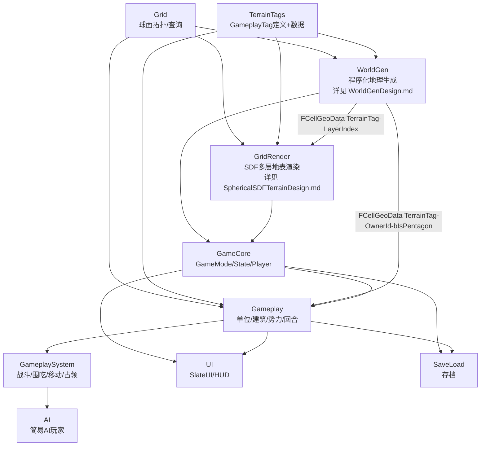
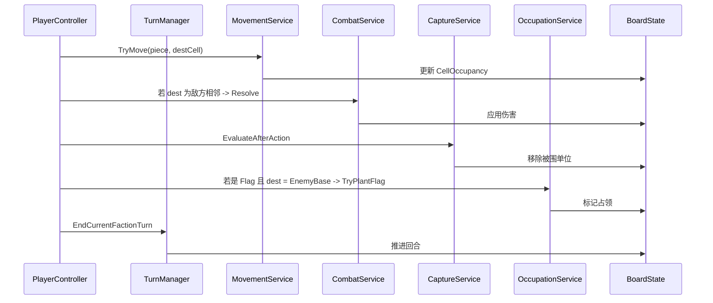
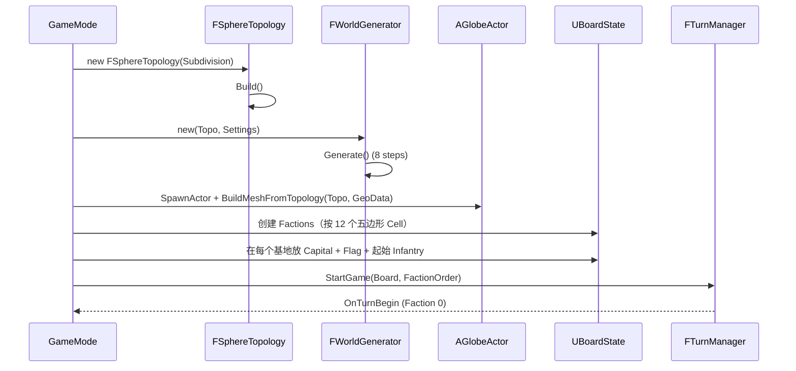

# TerraCivilization 技术设计稿

> 一个基于正二十面体细分球面网格的、回合制战棋类文明 Demo。
> 核心特征：**球面拓扑 + 程序化自然地理 + 回合制爆兵围吃 + SDF 多层地表渲染 + GameplayTag 驱动的玩法数据**。

---

## 0. 设计目标与总体思路

### 0.1 核心三件事
1. **世界**：基于 `FSphereTopology` 在球面上做程序化生成（板块 → 高程 → 气候 → 生物群系），每个 `FCell` 拥有一个**地形类型**（GameplayTag），不同地形拥有截然不同的玩法属性。
2. **玩法**：回合制战棋，融合了围棋（围吃）、跳棋（连续跳跃机动）、军棋（兵种克制 + 旗帜占领）。
   - 12 个五边形 Cell 自然作为 **12 个势力基地**。
   - 建筑产兵；兵把对方兵围住即"吃"；把"旗"插到对方基地中心 Cell 即"占领"。
3. **渲染**：每个 Cell 有自己的地形分类，使用 **SDF（Signed Distance Field）+ 多层地表贴图**做地表渲染，Cell 边界由 SDF 自然过渡。

### 0.2 数据驱动原则（重要）
- **玩法不写死在 C++ 代码里**。所有规则要素（地形性质、单位属性、建筑产出、势力特性、胜利条件等）通过 **GameplayTag + DataAsset** 拆出来，由设计师编辑。
- C++ 实现的是**机制内核（kernel）** 和**Tag 解释器**；Blueprint/DataAsset 配置的是**具体规则实例**。

### 0.3 模块约束
- 复用并扩展现有 `Grid` 模块（球面拓扑、查询、渲染骨架）。
- 引入 UE 标准插件：`GameplayTags`、`GameplayAbilities`（GAS）、`GameplayTasks`。
- 不引入第三方寻路库；A* 直接基于 `FCell.NeighborCellIds`。

---

## 1. 模块划分与依赖关系

> ⚠ **WorldGen 与 GridRender(SDF) 已分别拥有独立主设计稿**：
> - 程序化地理生成 → [WorldGenDesign.md](WorldGenDesign.md)（W1~W8 子阶段）
> - 球面 SDF 多层地表渲染（材质 / 着色公式） → [SphericalSDFTerrainDesign.md](SphericalSDFTerrainDesign.md)（R1~R13 子阶段）
> - 自研球面网格（几何 / 顶点位移 / 双拓扑解耦） → [TessellatedMeshDesign.md](TessellatedMeshDesign.md)（**T 阶段（TessellatedMesh）主稿**，三足鼎立的"几何域"代表，子里程碑 T1~T6 逐文件验收，T6=LOD 由原 SDF Roadmap R10 迁入）
> - 球面拓扑几何含义（FCell/FCorner/FCellEdge/FRenderTri 字段详解）→ [SphereTopologyReference.md](SphereTopologyReference.md)（基础设施参考稿）
>
> 三步走里程碑：`R8 (✅ 材质参数化 + SLW) → T (⏳ 自研球面网格 / TessellatedMesh) → W4 (⏳ Biome 真实查表)`。T 阶段主稿与 SDF 主稿通过"几何 / 材质"硬切分共存。
>
> 数据流契约：WorldGen 通过 `FCellGeoData[]` 单向输出，GridRender 经 `UTerrainDefinition::LayerIndex` 间接只读消费 + T 阶段直接消费 `Elevation` 字段做径向位移。本节仅维护**全模块拓扑视图**——具体设计思路、算法、HLSL 全部在子稿中。



> **解耦不变量**：
> - `WorldGen --> GridRender` / `WorldGen --> Gameplay` 两条新边只是**数据流**（POD 结构按 CellId 索引），不是 Build.cs 模块依赖——`WorldGen` 模块本身不依赖 `GridRender` / `Gameplay`，反向被它们读取。
> - SaveLoad 仅持久化 `(SubdivisionLevel, RandomSeed, FWorldGenSettings)` 三元组（约 100 字节），不序列化整张 `FCellGeoData[]`；详见 [WorldGenDesign.md §10.3](WorldGenDesign.md#103-saveload-只序列化-randomseed--subdivisionlevel)。

**模块清单：**

| 模块 | 类型 | 依赖（Build.cs） | 职责 | 主稿 |
|---|---|---|---|---|
| `Grid`（已存在） | Runtime | Core/CoreUObject/Engine | 球面拓扑、邻接、查询 | （本稿 §2） |
| `TerrainTags` | Runtime | Core/GameplayTags | GameplayTag 静态定义 + DataAsset 资产类型 | （本稿 §3） |
| `WorldGen` | Runtime | Grid/TerrainTags | 程序化地理：板块/高程/温湿度/生物群系/河流/基地 | [WorldGenDesign.md](WorldGenDesign.md) |
| `GridRender` | Runtime | Grid/TerrainTags/WorldGen/RHI/RenderCore | 球面 ProceduralMesh + SDF 材质参数注入；R8 起使用参数化 Tint（3-base + 4 通道 LUT），T 阶段（TessellatedMesh）起切到自研球面网格并消费 `FCellGeoData.Elevation` 做径向位移；W4 联调后读 `FCellGeoData → LayerIndex` 火 LUT | 材质 / 着色：[SphericalSDFTerrainDesign.md](SphericalSDFTerrainDesign.md)；几何 / 顶点位移：[TessellatedMeshDesign.md](TessellatedMeshDesign.md) |
| `Gameplay` | Runtime | Grid/TerrainTags/WorldGen/GAS | Unit/Building/Faction/Turn 数据模型；只读 `FCellGeoData.TerrainTag/OwnerId/bIsPentagon` | （本稿 §6） |
| `GameplaySystem` | Runtime | Gameplay/Grid | 移动、寻路、围吃判定、战斗、占领 | （本稿 §7） |
| `GameCore` | Runtime | Gameplay/WorldGen/GridRender | GameMode/GameState/PlayerController/Pawn | （本稿 §5） |
| `AI` | Runtime | Gameplay/GameplaySystem | 启发式 AI 玩家 | （本稿 §8） |
| `UI` | Runtime | GameCore/Gameplay/UMG/Slate | HUD、回合面板、单位面板 | （本稿 §9） |
| `SaveLoad` | Runtime | GameCore/Gameplay | USaveGame 存档；仅序列化 `RandomSeed + SubdivisionLevel + FWorldGenSettings` | （本稿 §11） |
| `TerraCivilizationEditor`（可选） | Editor | Gameplay/UnrealEd | 自定义资产、Tag 配置面板 | — |

> **依赖项更新说明**（vs WorldGen 独立化之前）：
> - `GridRender` 依赖列追加 `WorldGen`：T 阶段（自研球面网格）需消费 `FCellGeoData[].Elevation` 做径向位移；W4 联调后 `RebuildCellAttrLUT_()` 进一步读取 `FCellGeoData[].TerrainTag` 通过 `UTerrainDefinition` 查 `LayerIndex` + `FTerrainMaterialParams`。R8 阶段仍以 R3 Knuth 哈希 placeholder 驱动 BaseTexIdx，并不读 `FCellGeoData`。
> - `Gameplay` 依赖列追加 `WorldGen`：消费 `bIsPentagon`、`OwnerId`、`TerrainTag` 等字段。
> - `WorldGen` 依赖列**保持不变**（仅 `Grid/TerrainTags`）：WorldGen 是上游模块，不依赖任何下游——这是 [WorldGenDesign.md §14.3](WorldGenDesign.md#143-跨模块调用时序) 的硬承诺。

---

## 2. Grid 模块（已有）扩展点

现有：`FSphereTopology / FCell / FCellEdge / FCorner / FRenderTri / FSurfaceFrame / FSphereTopologyQuery`。

为支持后续模块，建议**渐进式补充**：

### 2.1 `FCell` 扩展
```cpp
class GRID_API FCell {
public:
    // ... 已有字段 ...
    int32 PentagonIndex = INDEX_NONE; // 0..11，仅五边形有效，非则 INDEX_NONE
    float SphericalArea = 0.f;        // 单位球上的面积，用于地理生成与产出归一化
};
```

### 2.2 `FSphereTopologyQuery` 扩展
```cpp
class GRID_API FSphereTopologyQuery {
public:
    // 已有
    FSurfaceQueryResult FindNearestCell(...) const;
    FSurfaceFrame BuildCellFrame(...) const;
    void CollectCellRing(...) const;
    void CollectCellDisk(...) const;

    // 新增
    void CollectCellsInGreatCircleArc(int32 FromCellId, int32 ToCellId, TArray<int32>& OutPath) const;
    float GreatCircleDistance(int32 A, int32 B) const;            // 球面距离（步数估计）
    int32 GraphDistance(int32 A, int32 B) const;                  // BFS 步数
    void FindPathAStar(int32 From, int32 To,
                       TFunctionRef<float(int32 EdgeId)> EdgeCost,
                       TArray<int32>& OutCellPath) const;         // A* 寻路
    void GetAllPentagonCellIds(TArray<int32>& OutIds) const;      // 12 个五边形
};
```

> A* 由 `Gameplay` 模块用，将地形 Tag → 移动消耗，注入 `EdgeCost`。

---

## 3. TerrainTags 模块（GameplayTag 定义 + 数据资产）

### 3.1 GameplayTag 命名空间

通过 `Config/Tags/*.ini` 与 `UGameplayTagsManager::AddNativeGameplayTag` 双轨注册：

```
Terrain.Ocean.Deep
Terrain.Ocean.Shallow
Terrain.Coast.Beach
Terrain.Plain.Grass
Terrain.Plain.Savanna
Terrain.Forest.Temperate
Terrain.Forest.Tropical
Terrain.Forest.Taiga
Terrain.Desert.Sand
Terrain.Desert.Rocky
Terrain.Mountain.Hill
Terrain.Mountain.Peak
Terrain.Tundra
Terrain.Glacier
Terrain.Volcano
Terrain.Wetland

Resource.Food.Wheat
Resource.Food.Fish
Resource.Strategic.Iron
Resource.Strategic.Horse
Resource.Luxury.Gold

Unit.Class.Infantry
Unit.Class.Cavalry
Unit.Class.Ranged
Unit.Class.Siege
Unit.Class.Flag

Unit.Movement.Walk
Unit.Movement.Jump      // 跳棋式连跳
Unit.Movement.Naval
Unit.Movement.Fly

Building.Producer.Barracks
Building.Producer.Stable
Building.Producer.Workshop
Building.Producer.FlagBearer
Building.Wonder.Capital   // 五边形基地中心建筑

Faction.Identity.Empire
Faction.Identity.Tribe
Faction.Trait.Naval
Faction.Trait.Mountaineer

Rule.Capture.Surround     // 围吃判定
Rule.Capture.FlagPlanted  // 旗占领
Rule.Win.OccupyAllBases
Rule.Win.OccupyMajority
```

### 3.2 关键 DataAsset

```cpp
// 地形定义：决定移动消耗、产出、可建筑性、防御加成、渲染层
UCLASS(BlueprintType)
class TERRAINTAGS_API UTerrainDefinition : public UPrimaryDataAsset {
    GENERATED_BODY()
public:
    UPROPERTY(EditAnywhere) FGameplayTag TerrainTag;          // Terrain.*
    UPROPERTY(EditAnywhere) float MoveCostBase = 1.f;
    UPROPERTY(EditAnywhere) FGameplayTagContainer ImpassableFor; // 不可通行的 Unit.Movement.*
    UPROPERTY(EditAnywhere) float DefenseBonus = 0.f;
    UPROPERTY(EditAnywhere) FGameplayTagContainer Yields;     // Resource.*
    UPROPERTY(EditAnywhere) bool bAllowBuilding = true;

    // 渲染相关
    UPROPERTY(EditAnywhere) int32 LayerIndex = 0;             // 多层贴图索引
    UPROPERTY(EditAnywhere) FLinearColor TintColor;
    UPROPERTY(EditAnywhere) TSoftObjectPtr<UTexture2D> AlbedoLayer;
    UPROPERTY(EditAnywhere) TSoftObjectPtr<UTexture2D> NormalLayer;
};

// 单位定义
UCLASS(BlueprintType)
class TERRAINTAGS_API UUnitDefinition : public UPrimaryDataAsset {
    GENERATED_BODY()
public:
    UPROPERTY(EditAnywhere) FGameplayTag UnitTag;             // Unit.Class.*
    UPROPERTY(EditAnywhere) FGameplayTagContainer MovementTags; // Unit.Movement.*
    UPROPERTY(EditAnywhere) int32 MaxHP = 10;
    UPROPERTY(EditAnywhere) int32 Attack = 3;
    UPROPERTY(EditAnywhere) int32 Defense = 2;
    UPROPERTY(EditAnywhere) int32 MoveRange = 2;
    UPROPERTY(EditAnywhere) int32 AttackRange = 1;
    UPROPERTY(EditAnywhere) bool bCanJumpOver = false;        // 跳棋式跳跃
    UPROPERTY(EditAnywhere) bool bIsFlag = false;             // 是否为"旗"
    UPROPERTY(EditAnywhere) FGameplayTagContainer Counters;   // 克制的 Unit.Class.*
    UPROPERTY(EditAnywhere) TSubclassOf<UGameplayAbility> AbilityClass;
};

// 建筑定义
UCLASS(BlueprintType)
class TERRAINTAGS_API UBuildingDefinition : public UPrimaryDataAsset {
    GENERATED_BODY()
public:
    UPROPERTY(EditAnywhere) FGameplayTag BuildingTag;
    UPROPERTY(EditAnywhere) FGameplayTagContainer AllowedTerrain;
    UPROPERTY(EditAnywhere) TArray<FGameplayTag> ProducibleUnits;
    UPROPERTY(EditAnywhere) int32 ProductionPerTurn = 1;
    UPROPERTY(EditAnywhere) int32 BuildCost = 5;
};

// 势力定义
UCLASS(BlueprintType)
class TERRAINTAGS_API UFactionDefinition : public UPrimaryDataAsset {
    GENERATED_BODY()
public:
    UPROPERTY(EditAnywhere) FGameplayTag FactionTag;
    UPROPERTY(EditAnywhere) FGameplayTagContainer Traits;     // Faction.Trait.*
    UPROPERTY(EditAnywhere) FLinearColor BannerColor;
    UPROPERTY(EditAnywhere) TArray<FGameplayTag> StartingUnits;
};

// 全局规则集（可被 GameMode 替换以做不同模式）
UCLASS(BlueprintType)
class TERRAINTAGS_API URuleSet : public UPrimaryDataAsset {
    GENERATED_BODY()
public:
    UPROPERTY(EditAnywhere) bool bEnableSurroundCapture = true;
    UPROPERTY(EditAnywhere) int32 SurroundMinNeighbors = 4;   // 围吃所需邻居数
    UPROPERTY(EditAnywhere) FGameplayTag WinConditionTag;     // Rule.Win.*
    UPROPERTY(EditAnywhere) int32 TurnLimit = 200;
};
```

### 3.3 Tag 解释器
单一入口，避免散落的字符串比较：
```cpp
class TERRAINTAGS_API FGameplayTagResolver {
public:
    static const UTerrainDefinition*  GetTerrain(FGameplayTag);
    static const UUnitDefinition*     GetUnit(FGameplayTag);
    static const UBuildingDefinition* GetBuilding(FGameplayTag);
    static const UFactionDefinition*  GetFaction(FGameplayTag);
    static void RegisterAll(UDataTable* Registry);            // 启动时灌库
};
```

---

## 4. WorldGen 模块（程序化地理）

> ⚠ **WorldGen 模块已拥有独立主设计稿**——详见 [WorldGenDesign.md](WorldGenDesign.md)。本节仅保留**类签名骨架**供全模块拓扑速查；设计思路、算法详解、Whittaker 表、19-Layer 映射、板块边界判定、河流追踪等**全部迁移至主稿**。W-step 子阶段路线图也仅在主稿 §11 中维护。

### 4.1 设计思路

WorldGen 以**自然地理流水线**（板块构造→高程场→海陆→湿度→温度→生物群系→河流→基地）产生 `TArray<FCellGeoData>`，作为上游模块输出供 GridRender / Gameplay / SaveLoad 只读消费。流水线 8 步详细设计见 [WorldGenDesign.md §5](WorldGenDesign.md#5-流水线总览-8-步)。

### 4.2 关键类（签名骨架）

```cpp
// 程序化生成参数（详细字段见 WorldGenDesign.md §4.1）
USTRUCT(BlueprintType)
struct WORLDGEN_API FWorldGenSettings {
    GENERATED_BODY()
    UPROPERTY(EditAnywhere) int32 RandomSeed = 0;
    UPROPERTY(EditAnywhere) int32 PlateCount = 12;
    UPROPERTY(EditAnywhere) float SeaLevel = 0.f;
    UPROPERTY(EditAnywhere) float MountainThreshold = 0.5f;
    UPROPERTY(EditAnywhere) float MountainBoundaryStrength = 1.f;
    UPROPERTY(EditAnywhere) float MoistureScale = 1.f;
    UPROPERTY(EditAnywhere) float TemperatureBias = 0.f;
    UPROPERTY(EditAnywhere) TArray<FGameplayTagContainer> ForcedBaseTraits;
    UPROPERTY(EditAnywhere) TSoftObjectPtr<class UBiomeTable> BiomeTable;
    // …其余参数见主稿
};

// 生成结果（每Cell一份；完整字段表见 WorldGenDesign.md §4.2 / §3.3）
USTRUCT(BlueprintType)
struct WORLDGEN_API FCellGeoData {
    GENERATED_BODY()
    UPROPERTY() int32 CellId         = INDEX_NONE;
    UPROPERTY() int32 PlateId        = INDEX_NONE;
    UPROPERTY() float Elevation      = 0.f;
    UPROPERTY() float Moisture       = 0.5f;
    UPROPERTY() float Temperature    = 0.f;
    UPROPERTY() uint8 bIsLand : 1, bIsCoast : 1, bIsMountain : 1, bIsRiver : 1, bIsLake : 1, bIsPentagon : 1;
    UPROPERTY() FGameplayTag           TerrainTag;
    UPROPERTY() FGameplayTagContainer  Resources;
    UPROPERTY() int32 BaseFactionId = INDEX_NONE;
    UPROPERTY() int32 OwnerId       = INDEX_NONE;
    UPROPERTY() int32 FlowTo        = INDEX_NONE;
};

// 生成器主类（详细实现、中间缓冲、算法伪代码见主稿§13）
class WORLDGEN_API FWorldGenerator {
public:
    explicit FWorldGenerator(const FSphereTopology* InTopology, const FWorldGenSettings& InSettings);
    void Generate();
    const TArray<FCellGeoData>& GetCellData() const;
    const TArray<int32>& GetBaseCellIds() const;
private:
    void Step_PartitionPlates();
    void Step_ComputeElevation();
    void Step_DetermineLandSea();
    void Step_SimulateMoisture();
    void Step_ComputeTemperature();
    void Step_ClassifyBiomes();
    void Step_TraceRivers();
    void Step_AssignBaseCells();
};
```

### 4.3 详细设计

板块构造算法、边界类型判定、湿度雨影、Whittaker 双轴表、D6/D5 河流追踪、五边形势力基地分配等详细算法与伪代码均在 [WorldGenDesign.md](WorldGenDesign.md) §2（理论基础）§ §5（流水线）§ §7（关键算法）§ §13（代码骨架）中维护。子阶段路线图 W1~W8 见主稿 §11 W-step Roadmap。

---

## 5. GridRender 模块（SDF + 多层地表渲染）

### 5.1 几何渲染
- 复用 `FSphereTopology::Tris/Corners`，构建 `UProceduralMeshComponent` 或自定义 `URealtimeMeshComponent`。
- 渲染顶点 = `Corners`（每 3 个 Cell 共享 1 个角），三角形 = `Tris`。
- 顶点属性：
  - `Position`：`Corner.UnitDir * GlobeRadius + ElevationOffset * Corner.UnitDir`
  - `UV0`：球面 UV（两套，处理接缝）
  - `Color/Custom0..N`：**3 个邻接 Cell 的 TerrainLayerIndex** 与权重（用于混合）

### 5.2 SDF 多层地表（材质侧）
原理：**Cell 边界用球面圆弧（GreatCircleArc）的 SDF 在像素着色器里求**，在 Cell 内部各 Tag 的图层做权重混合，跨边界用 `smoothstep(SDF)` 做软过渡。

```cpp
class GRIDRENDER_API UGlobeMeshComponent : public UProceduralMeshComponent {
    GENERATED_BODY()
public:
    void BuildMeshFromTopology(const FSphereTopology& Topo,
                               const TArray<FCellGeoData>& Geo);
    void UpdateCellTerrainTag(int32 CellId, FGameplayTag NewTag);

private:
    void PackPerCellAttributes_();       // 上传到 RT
    void RebuildSection_(int32 SectionIdx);

    // 每 Cell 数据 -> 纹理（CellId 作 UV index）
    UPROPERTY() UTexture2D* CellAttributeLUT;   // R=LayerIdx, G=Elevation, B=Moisture, A=Mask
};

// 全局参数集合（材质参数 / SceneViewExtension 注入）
UCLASS()
class GRIDRENDER_API UGlobeRenderParams : public UObject {
    GENERATED_BODY()
public:
    UPROPERTY(EditAnywhere) UTexture2DArray* TerrainAlbedoArray;
    UPROPERTY(EditAnywhere) UTexture2DArray* TerrainNormalArray;
    UPROPERTY(EditAnywhere) UTexture2DArray* TerrainRoughnessArray;
    UPROPERTY(EditAnywhere) float CellEdgeSoftness = 0.05f;  // SDF 软过渡宽度
    UPROPERTY(EditAnywhere) float TriplanarScale = 1.0f;
};

// 高亮/选择/路径预览层（独立绘制，不污染地形材质）
class GRIDRENDER_API UGlobeOverlayComponent : public UPrimitiveComponent {
public:
    void HighlightCells(const TArray<int32>& CellIds, FLinearColor Color);
    void DrawPath(const TArray<int32>& CellPath);
    void ClearAll();
};
```

### 5.3 SDF 计算要点（Material/Shader）
- 在 Pixel Shader 中：取当前 fragment 的球面位置 P（单位向量）。
- 由顶点插值得到三个最近 Cell 的 `(CellId, UnitCenter)`。
- `dist_i = acos(dot(P, UnitCenter_i))`（球面大圆距离）。
- 通过 `softmax(-dist_i / Softness)` 得到三 Cell 权重 → 拿 `LayerIndex` 采样 `Texture2DArray`。
- 边界细节：可叠加噪声扰动 SDF，得到不规则边缘（海岸线、山脚）。

---

## 6. Gameplay 模块（数据模型）

### 6.1 核心 UObject

```cpp
// 棋盘上的一颗"棋子"：可以是单位或建筑或旗子
UCLASS()
class GAMEPLAY_API UGridPiece : public UObject {
    GENERATED_BODY()
public:
    UPROPERTY() int32 OwnerFactionId = INDEX_NONE;
    UPROPERTY() int32 CellId = INDEX_NONE;
    UPROPERTY() FGameplayTagContainer Tags;     // Unit.Class.*, Unit.Movement.*
    UPROPERTY() int32 HP = 0;
    UPROPERTY() int32 MovesLeft = 0;
    UPROPERTY() bool bHasAttacked = false;
    UPROPERTY() bool bIsBuilding = false;
    UPROPERTY() bool bIsFlag = false;

    virtual void OnTurnBegin();
    virtual void OnTurnEnd();
};

// 势力
UCLASS()
class GAMEPLAY_API UFactionState : public UObject {
    GENERATED_BODY()
public:
    UPROPERTY() int32 FactionId;
    UPROPERTY() FGameplayTag FactionTag;
    UPROPERTY() int32 BaseCellId;            // 五边形 Cell
    UPROPERTY() int32 Resources[8] = {};     // 简化资源
    UPROPERTY() TArray<UGridPiece*> Pieces;
    UPROPERTY() bool bIsAlive = true;
    UPROPERTY() bool bBaseOccupied = false;
};

// 棋盘运行时状态（序列化目标）
UCLASS()
class GAMEPLAY_API UBoardState : public UObject {
    GENERATED_BODY()
public:
    UPROPERTY() TArray<UFactionState*> Factions;
    UPROPERTY() TMap<int32, UGridPiece*> CellOccupancy; // CellId -> Piece
    UPROPERTY() int32 CurrentTurn = 0;
    UPROPERTY() int32 CurrentFactionId = 0;

    UGridPiece* GetPieceAt(int32 CellId) const;
    bool IsEnemy(int32 FactionA, int32 FactionB) const;
};
```

### 6.2 GAS 集成
- 每个 `UGridPiece` 持有一个 `UAbilitySystemComponent`（Minimal）。
- 单位的"主动技能"（突击、远程、跳跃、占旗）实现为 `UGameplayAbility` 子类：
  - `UGA_Move`、`UGA_Attack`、`UGA_Jump`、`UGA_PlantFlag`、`UGA_Build`。
- 单位被动（地形减伤、克制加伤）由 `UGameplayEffect` + Tag 查询实现。

---

## 7. GameplaySystem 模块（机制核心）

### 7.1 移动 / 寻路
```cpp
class GAMEPLAYSYSTEM_API FMovementService {
public:
    void GetReachableCells(const UBoardState& Board, const UGridPiece& P, TArray<int32>& Out) const;
    bool TryMove(UBoardState& Board, UGridPiece& P, int32 DestCell, TArray<int32>& OutPath);

    // 跳棋式：邻居有友/敌单位时可"跳过"，并以同向再走一步落地
    void GetJumpChainCells(const UBoardState& Board, const UGridPiece& P, TArray<int32>& Out) const;

private:
    float GetEdgeCost(const UBoardState&, const UGridPiece&, int32 EdgeId) const;
};
```
- `EdgeCost` 基于两端 Cell 的 `TerrainTag → UTerrainDefinition::MoveCostBase`，并考虑单位 Movement Tag 与 `ImpassableFor`。

### 7.2 战斗
```cpp
class GAMEPLAYSYSTEM_API FCombatService {
public:
    struct FCombatResult { int32 AttackerDmg; int32 DefenderDmg; bool bAttackerDies; bool bDefenderDies; };
    FCombatResult Resolve(const UGridPiece& Attacker, const UGridPiece& Defender,
                          const UBoardState& Board) const;
};
```
- 公式：`Damage = max(1, Attack * CounterMul - Defense * (1 + TerrainDefBonus))`
- `CounterMul` 来自 `UUnitDefinition::Counters`（Tag 命中 → 1.5x）。

### 7.3 围吃判定（围棋融合）
```cpp
class GAMEPLAYSYSTEM_API FCaptureService {
public:
    // 玩家 P 行动结束后调用
    void EvaluateAfterAction(UBoardState& Board, int32 ActingFactionId, TArray<UGridPiece*>& OutCaptured);

private:
    // 任一连通的同势力单位"群"如果所有相邻可通行 Cell 都被敌方/障碍占据 → 全部被吃
    void FindGroups_(const UBoardState&, int32 FactionId, TArray<TArray<UGridPiece*>>& OutGroups);
    bool HasLiberty_(const UBoardState&, const TArray<UGridPiece*>& Group);
};
```

> 实现要点：用 `FCell.NeighborCellIds` 在 Cell 图上做 Flood-Fill；同势力相邻 Piece 视为一组；"气"=组的外邻 Cell 中存在"可通行且非敌方占据"的 Cell。

### 7.4 占领
```cpp
class GAMEPLAYSYSTEM_API FOccupationService {
public:
    bool TryPlantFlag(UBoardState& Board, UGridPiece& Flag, int32 EnemyBaseCellId);
    bool CheckWinCondition(const UBoardState& Board, const URuleSet& Rules, int32& OutWinnerFactionId);
};
```

### 7.5 回合管理
```cpp
class GAMEPLAYSYSTEM_API FTurnManager {
public:
    void StartGame(UBoardState& Board, const TArray<int32>& FactionOrder);
    void EndCurrentFactionTurn(UBoardState& Board);

    DECLARE_MULTICAST_DELEGATE_TwoParams(FOnTurnBegin, UBoardState&, int32 /*FactionId*/);
    DECLARE_MULTICAST_DELEGATE_TwoParams(FOnTurnEnd,   UBoardState&, int32 /*FactionId*/);
    FOnTurnBegin OnTurnBegin;
    FOnTurnEnd   OnTurnEnd;
};
```

### 7.6 行动事件流（一次"移动→吃→占"）


---

## 8. GameCore 模块（UE 框架层）

```cpp
UCLASS()
class GAMECORE_API ATerraGameMode : public AGameModeBase {
    GENERATED_BODY()
public:
    UPROPERTY(EditAnywhere) int32 SubdivisionLevel = 5;
    UPROPERTY(EditAnywhere) FWorldGenSettings WorldGenSettings;
    UPROPERTY(EditAnywhere) URuleSet* RuleSet;
    UPROPERTY(EditAnywhere) TArray<UFactionDefinition*> FactionDefs; // 长度 1..12

    virtual void InitGame(...) override;
    virtual void StartPlay() override;

protected:
    void InitializeWorld_();    // 1. 建拓扑 2. 跑 WorldGen 3. 建渲染 4. 初始化 BoardState 5. 启动 TurnManager
};

UCLASS()
class GAMECORE_API ATerraGameState : public AGameStateBase {
    GENERATED_BODY()
public:
    UPROPERTY() UBoardState* BoardState;
    TSharedPtr<FSphereTopology> Topology;
    TSharedPtr<FSphereTopologyQuery> Query;
    TSharedPtr<FWorldGenerator> Generator;
    TSharedPtr<FTurnManager> TurnManager;
};

UCLASS()
class GAMECORE_API ATerraPlayerController : public APlayerController {
    GENERATED_BODY()
public:
    void OnClickGlobe(const FVector& WorldPos);   // -> Query.FindNearestCell
    void OnHoverGlobe(const FVector& WorldPos);
    void OnEndTurnPressed();
private:
    int32 SelectedPieceCellId = INDEX_NONE;
};

UCLASS()
class GAMECORE_API ATerraSpectatorPawn : public ADefaultPawn {
    // 球体相机：经纬度 + 缩放，沿球面旋转
};

UCLASS()
class GAMECORE_API AGlobeActor : public AActor {
    UPROPERTY() UGlobeMeshComponent* GlobeMesh;
    UPROPERTY() UGlobeOverlayComponent* Overlay;
};
```

---

## 9. AI 模块（简易）

```cpp
class AI_API FAITurnPlanner {
public:
    void Plan(const UBoardState& Board, int32 FactionId, TArray<FAIAction>& OutActions);
};

struct FAIAction {
    enum class EType { Move, Attack, Build, Produce, PlantFlag, EndTurn } Type;
    int32 SrcCell = INDEX_NONE;
    int32 DstCell = INDEX_NONE;
    FGameplayTag UnitToProduce;
};
```
- 启发式：靠近敌方基地、避开高 MoveCost 区域、优先生产被克制了的兵种、围吃机会优先。
- 后续可替换为 MCTS / 行为树。

---

## 10. UI 模块

| 屏幕元素 | 类 | 备注 |
|---|---|---|
| 顶部资源条 | `UTopHUD : UUserWidget` | 当前资源、回合数 |
| 单位面板 | `UUnitPanel` | 选中单位的属性、可用技能 |
| 地形 Tooltip | `UCellTooltip` | hover 显示 Tag、产出 |
| 回合面板 | `UTurnPanel` | "结束回合"按钮、各势力概览 |
| 小地图 | `UMiniGlobe` | 球面缩略图 |
| 胜利/失败 | `UResultScreen` | 读取 `Rule.Win.*` |

---

## 11. SaveLoad 模块

- 唯一序列化目标：`UBoardState` + `FWorldGenSettings.RandomSeed + SubdivisionLevel`。
- 重启游戏时：用同样 Seed/Level **重生成**地理（确定性生成），再读回 `UBoardState`，避免存大量地形数据。

```cpp
UCLASS()
class SAVELOAD_API UTerraSaveGame : public USaveGame {
    UPROPERTY() int32 SubdivisionLevel;
    UPROPERTY() FWorldGenSettings WorldGenSettings;
    UPROPERTY() FBoardStateBlob BoardBlob;     // 自定义二进制压缩
};
```

---

## 12. 玩法规则细节（首版具体数值）

> 下表是**首版默认 DataAsset 内容**。所有数字都通过 GameplayTag + DataAsset 配置，不写死。

### 12.1 地形（节选）
| Tag | MoveCost | DefBonus | 产出 | 备注 |
|---|---|---|---|---|
| `Terrain.Plain.Grass` | 1 | 0 | Wheat | 默认走路区 |
| `Terrain.Forest.Temperate` | 2 | +1 | - | 步兵防御加成 |
| `Terrain.Mountain.Peak` | ∞（步兵） | +3 | - | 仅 Fly 可越 |
| `Terrain.Mountain.Hill` | 2 | +2 | Iron(几率) | |
| `Terrain.Desert.Sand` | 2 | -1 | - | 不可建筑 |
| `Terrain.Ocean.Shallow` | 1（仅 Naval） | 0 | Fish | |
| `Terrain.Ocean.Deep` | 2（仅 Naval） | 0 | - | |
| `Terrain.Coast.Beach` | 1 | 0 | - | 海陆登陆点 |
| `Terrain.Glacier` | 3 | 0 | - | 寒带屏障 |
| `Terrain.Volcano` | ∞ | - | Strategic.Lava | 不可通行 |

### 12.2 单位（节选）
| Tag | HP | Atk | Def | Mv | Range | 特性 |
|---|---|---|---|---|---|---|
| `Unit.Class.Infantry` | 10 | 3 | 3 | 2 | 1 | 克制 Cavalry 在 Forest |
| `Unit.Class.Cavalry` | 8 | 5 | 1 | 4 | 1 | 跳棋式跳跃 (`bCanJumpOver=true`) |
| `Unit.Class.Ranged` | 6 | 4 | 1 | 2 | 2 | 不近战反击 |
| `Unit.Class.Siege` | 6 | 6 | 1 | 1 | 2 | 对建筑双倍 |
| `Unit.Class.Flag` | 1 | 0 | 0 | 2 | 0 | 唯一可占领；插入敌方基地中心 Cell 即占领 |

### 12.3 建筑
- `Building.Producer.Barracks`: 在陆地任意 Cell 可建，每回合产出 Infantry 进度 1。
- `Building.Producer.Stable`: 仅 `Plain.*`，产出 Cavalry。
- `Building.Wonder.Capital`: 五边形基地预置，永远存在；被插旗即己方失败。

### 12.4 围吃判定（精确规则）
- 一个**势力连通群** = 同势力 Piece 在 Cell 邻接图上的连通分量。
- "气" = 群所有成员的外邻 Cell 中，**可通行且非敌方 Piece 占据**的 Cell 数量。
- 当己方刚结束动作后，**先扫描所有敌方群**，无气的群整组移除（吃掉）。
- 然后扫描自己的群，无气者也移除（禁自杀，可在 RuleSet 中开关）。

### 12.5 胜利条件
- `Rule.Win.OccupyAllBases`：插旗占领所有 11 个其他基地。
- `Rule.Win.OccupyMajority`：占领 ≥ ⌈12/2⌉ = 6 个基地。
- 默认采用 `OccupyMajority`。

---

## 13. 启动流程（运行时序）



---

## 14. 文件落点（建议目录）

```
Source/
├── Grid/                        (已存在，仅扩展)
├── TerrainTags/
│   ├── TerrainTags.Build.cs
│   ├── Public/
│   │   ├── TerrainTagsModule.h
│   │   ├── NativeGameplayTags.h
│   │   ├── TerrainDefinition.h
│   │   ├── UnitDefinition.h
│   │   ├── BuildingDefinition.h
│   │   ├── FactionDefinition.h
│   │   ├── RuleSet.h
│   │   └── GameplayTagResolver.h
│   └── Private/...
├── WorldGen/
│   ├── WorldGen.Build.cs
│   ├── Public/
│   │   ├── WorldGenSettings.h
│   │   ├── CellGeoData.h
│   │   ├── PlateInfo.h
│   │   └── WorldGenerator.h
│   └── Private/
│       ├── WorldGenerator.cpp
│       ├── Step_Plates.cpp
│       ├── Step_Elevation.cpp
│       ├── Step_LandSea.cpp
│       ├── Step_Moisture.cpp
│       ├── Step_Temperature.cpp
│       ├── Step_Biome.cpp
│       ├── Step_Rivers.cpp
│       └── Step_Bases.cpp
├── GridRender/
│   ├── GridRender.Build.cs
│   ├── Public/
│   │   ├── GlobeMeshComponent.h
│   │   ├── GlobeOverlayComponent.h
│   │   └── GlobeRenderParams.h
│   └── Private/...
├── Gameplay/
│   ├── Gameplay.Build.cs
│   ├── Public/
│   │   ├── GridPiece.h
│   │   ├── FactionState.h
│   │   ├── BoardState.h
│   │   └── Abilities/{GA_Move,GA_Attack,GA_Jump,GA_PlantFlag,GA_Build}.h
│   └── Private/...
├── GameplaySystem/
│   ├── Public/
│   │   ├── MovementService.h
│   │   ├── CombatService.h
│   │   ├── CaptureService.h
│   │   ├── OccupationService.h
│   │   └── TurnManager.h
│   └── Private/...
├── AI/
│   └── ...
├── GameCore/
│   ├── Public/
│   │   ├── TerraGameMode.h
│   │   ├── TerraGameState.h
│   │   ├── TerraPlayerController.h
│   │   ├── TerraSpectatorPawn.h
│   │   └── GlobeActor.h
│   └── Private/...
├── UI/
│   └── ...
├── SaveLoad/
│   └── ...
└── TerraCivilization/           (已存在，作为最终拼装层)
```

---

## 15. 实现里程碑

| 阶段 | 目标 | 涉及模块 |
|---|---|---|
| **M1 拓扑就绪** | Grid 模块补 A* / 距离查询；可视化每个 Cell ID | Grid |
| **M2 Tag 体系** | 全部 GameplayTag + DataAsset 注册并能在编辑器编辑 | TerrainTags |
| **M3 程序化地理** | 出第一张可玩星球：板块/海陆/生物群系 | WorldGen + Grid |
| **M4 球面渲染** | ProceduralMesh + 多层贴图 + SDF 边界过渡 | GridRender |
| **M5 棋盘核心** | BoardState、移动、寻路（无 GAS） | Gameplay + GameplaySystem |
| **M6 战斗 + 围吃** | CombatService + CaptureService 通过单元测试 | GameplaySystem |
| **M7 旗子占领 + 胜利** | OccupationService + RuleSet 切换 | GameplaySystem |
| **M8 完整回合制** | TurnManager + UI 选中/移动/结束回合 | UI + GameCore |
| **M9 AI** | 启发式 AI 能用 Flag 偷袭、围吃、建造 | AI |
| **M10 抛光** | SaveLoad、动画、音效、平衡 | SaveLoad + 全模块 |

---

## 16. 关键风险点与应对

| 风险 | 应对 |
|---|---|
| 球面接缝 UV 撕裂 | 已用 `UVToPrimalVert + PrimalUVTris` 双套 UV，渲染端按 UV 三角索引 |
| Cell 数量爆炸（高 Subdivision） | LOD：远距离改用 Cell 中心点采样 + 简化贴图层；战斗逻辑只看 Cell 邻接图 |
| GAS 学习曲线 | M5/M6 先用纯 Service 类；M7+ 视情况引入 GAS |
| 围吃在 Cell 图上歧义 | 用一致的 Flood-Fill + "气"定义；写单元测试覆盖死活角 |
| 数据驱动配置爆炸 | 用 `UPrimaryDataAsset` + AssetManager + GameplayTagQuery 做查询；避免 if/else |
| 基地是五边形（5 邻居）不公平 | 在 RuleSet 里允许按 PentagonIndex 给基地附加 Tag 加成补偿 |

---

## 17. 第一周可立刻做的事（落地步骤）

1. 在 `Grid` 模块加 `GraphDistance` / `FindPathAStar` / `GetAllPentagonCellIds`。
2. 新建 `TerrainTags` 模块，注册一组最小可用的 NativeTag（Plain/Forest/Mountain/Ocean）。
3. 新建 `WorldGen` 模块的 `FWorldGenerator` 骨架，先只跑 `Step_PartitionPlates + Step_DetermineLandSea`，把每个 Cell 染成蓝/绿色看效果。
4. 新建 `GridRender` 的 `UGlobeMeshComponent`，按上述顶点/三角组装 ProceduralMesh，材质先纯色按 LayerIndex 显示。
5. 新建 `Gameplay/UBoardState`、`UGridPiece`，在 12 个五边形上各放 1 个 Flag + 1 个 Infantry。
6. 新建 `GameplaySystem/FMovementService` 跑通 "点击 Cell → 高亮可达 Cell → 移动"。
7. 写 `TurnManager` + 简单 HUD 的"结束回合"按钮。
8. 完成 M1-M5 的最小闭环后，再依次启用 SDF 渲染、围吃、AI。

---

完。