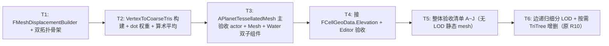

# 自研球面网格设计稿（TessellatedMesh）

> 三步走 `R8 → T → W4` 中 **T 阶段（Tessellation）主稿**。本稿与 [SphericalSDFTerrainDesign.md](SphericalSDFTerrainDesign.md)（地形材质 SDF 路线，R1~R10）、[WorldGenDesign.md](WorldGenDesign.md)（程序化地理流水线，W1~W8）**三足鼎立**，由 [TechnicalDesign.md](TechnicalDesign.md) §1 模块图引用。
>
> **T 阶段定位**：把 R8 阶段一直跑在 sub=3 的 IsoSphere 调试 mesh 上的渲染主体，切换到**逻辑 / 渲染拓扑解耦**的"自研球面网格"路径——**逻辑层 `CellTopology` 不变**（仍然是 sub=3 的 642 cells，被 WorldGen / Gameplay 共用），**渲染层新建独立 `MeshTopology`**（默认 sub=4，2562 顶点 / 5120 三角形），承载径向位移 + Cell 边界软过渡材质。
>
> **本稿不依赖 LOD**——sub=4 全球 5120 三角形对 UE5 来说是非常轻的负载，单 mesh 一次性渲染即可。LOD 推迟到 R10。
>
> **本稿与 R8 材质零绑定**——R8 阶段写的全部 HLSL Custom 节点（参数化 Tint、Triplanar 三平面采样、4 通道材质 LUT）在 T 阶段 mesh 切换后**零改动复用**，只需 cpp 端把"Cell Id + 三方权重"通过 Vertex Color / Custom UV 灌进顶点缓冲。
>
> **子里程碑命名风格**：与 [R4_VoronoiBoundary.md](R4_VoronoiBoundary.md) / [W1 系列] 一致，使用 `T1` ~ `T6` 逐文件验收（不再写 `R8.5.1` 这类冗长标题）。T6 = LOD（基于二十面体边递归细分 + 按需 TriTree 增删，详见 §5.4），由原 SDF Roadmap 的 R10 迁入。

---

## 0. 摘要

| 字段 | 值 |
| --- | --- |
| 上游验收前置 | R8（参数化 Tint + 水面层 + SLW），✅ 已完成（2026-06-29） |
| 下游验收前置依赖 | W3 完成 → `FCellGeoData[].Elevation` 可读；R8 完成 → 4 通道 LUT 与 SLW 水面层就绪 |
| 阶段产物 | `FCellTopology` / `FMeshTopology` 双拓扑实例；`MeshDisplacementBuilder`（顶点位移预计算）；自研 mesh 的 `APlanetTessellatedMesh`（接替 R8 阶段的 `APlanetTopologyDebugMesh` 主验收 actor） |
| 视觉验收点 | sub=4 mesh + Elevation 径向位移 + R8 三基底 Tint 渲染 + SLW 水面遮挡 ✓；昼夜分割线无三角棱面锯齿（继承 R8 §3.14 修复） |
| 性能预算 | OnConstruction Rebuild < 50 ms（含位移预计算）；运行期 GPU < 1 ms / frame（sub=4 仅 5120 tris） |
| 后续阶段 | W4（Biome 真实查表）→ R9（多 LUT）→ R10（LOD）→ R11（高亮 / 选择 / 路径预览） |

---

## 1. 设计目标与核心决策

### 1.1 为什么要"逻辑 / 渲染拓扑解耦"

R8 之前所有 R-阶段（R1~R8）都跑在**单一 sub=3 IsoSphere mesh** 上——既是逻辑 Cell 的载体（642 个 PrimalVerts ↔ 642 个 Cell 中心），也是渲染顶点的载体。这条路径走到 R8 末尾遇到三个相互独立的限制：

| # | 限制 | 触发场景 | R8 验收时的临时表现 |
| --- | --- | --- | --- |
| 1 | sub=3 全球只有 1280 个三角形 → 低多边形棱面感强 | 任何对地形起伏的视觉期待（哪怕只是 5% 的山脉抬升）都会让 mesh 三角形边在阴影边界裸露 | §3.13 / §3.14 修过法线锯齿，但视觉上球依然是低多边形几何体 |
| 2 | Cell 中心 = mesh 顶点 → 想做 Elevation 径向位移就只能在"Cell 粒度"上突变 | 邻接两个 Cell 的高度若不同，mesh 顶点会出现台阶——没有"山坡"的过渡 | R8 没做位移所以这个限制没暴露，但 T 阶段一旦做位移就会撞 |
| 3 | mesh 顶点密度直接跟玩法粒度耦合 → 想加细节就得加 Cell 数量，这又会让 WorldGen / Gameplay 的运算量翻倍 | 如果想在 sub=4（2562 cells）上获得 sub=5 的视觉细节，必须强行升 Cell 拓扑 | — |

**解耦后的目标**：

```
逻辑层 CellTopology (sub=3, 642 cells)
   · WorldGen 在此层跑 Generate()  → FCellGeoData[642]
   · Gameplay 在此层做 A* / 单位 / 围吃 / 占领
   · 玩家可见的"格子"语义停留在这层

渲染层 MeshTopology (sub=4, 2562 verts / 5120 tris) ⭐ 新增
   · 渲染管线消费的几何 mesh 顶点
   · 顶点位移在这层做（高度 = 父 CellTopology 三角形上三 Cell 高度按 dot 权重插值）
   · 不参与玩法逻辑——它只承载视觉细节
```

### 1.2 三步走与本稿的位置

```
[R8 ✓] 参数化 Tint + SLW 水面    →    [T ⏳] 自研球面网格    →    [W4 ⏳] Biome 真实查表
   ↑ 已完成                              ↑ 本稿                       ↑ 依赖本稿
```

> **T 阶段之前的旧路线（已废弃）**：原 SDF 主稿 §16.2 / §16.3 描述的"`FSphereTopology(SubdivisionLevel + 2)` 单实例 + acos 软权重"路径，与本稿的"双拓扑独立实例 + dot 权重线性插值 + 多重三角形平均"路径不兼容。原 §16 内容已折叠为 [SphericalSDFTerrainDesign.md §16](SphericalSDFTerrainDesign.md#16-自研球面网格生产路线) 占位 + 跳转链接，正文迁入本稿。

### 1.3 拍板决策列表（2026-06-30）

| # | 决策点 | 拍板值 | 备选 / 备忘 |
| --- | --- | --- | --- |
| D1 | **Mesh 细分层级 `MeshSubdivisionLevel`** | **默认 4**（独立参数，与 `CellSubdivisionLevel` 解耦） | 6 / 5 / 3 备选；R10 LOD 阶段会引入"近 sub=5、远 sub=3"的多档 |
| D2 | **顶点高度计算路径** | **CPU 顶点构建期**（每次 Rebuild 跑一次）| 不走 GPU WPO（顶点位移、collision 一致性、Lumen 友好性都是 cpp 端做更可控） |
| D3 | **三 Cell 重心权重函数** | **三点 dot 权重的线性插值**（`w_i = max(0, dot(Dir, UnitCenter_i))` 归一化）| 暂行；未来可换 acos / 高次方插值；签名预留扩展点 |
| D4 | **多重粗三角形归属处理** | **顶点可属五或六个粗三角形 → 各算一遍 → 简单算术平均**（mesh 顶点处于 cell 顶点重合时） | 简化路径：若该 mesh 顶点恰好只属 1 个粗三角形（顶点位于 Cell 内部）则直接用之 |
| D5 | **顶点法线** | **直接写 `+UnitCenter`**（朝外、归一化方向），Tangent 留空 | 继承 R8 §3.14 修订；位移仅沿径向 → 不改变法线方向 |
| D6 | **水面层 `WaterRadius`** | **编辑器可调常量**（默认 = `GlobeRadius + 100 cm`，对齐 R8 §3.15 锁齿补偿）；T 阶段不动 SLW 材质 | 后续 W3 阶段 WorldGen 加入"海陆比例 → 海平面"输出后，由 WorldGen 写入 |
| D7 | **Cell 高度数据源** | **直接消费 `FCellGeoData.Elevation`**（不新增字段） | 量纲转换函数（[-1,1] → cm）作为渲染端 `UPlanetMeshParams::ElevationScaleCM` 私有逻辑 |
| D8 | **`CellTopology` 与 `MeshTopology` 关系** | **两个完全独立的 `FSphereTopology` 实例** | 不通过 `FSphereTopology` 内部双层结构；调用方持有两份指针、互不干扰 |
| D9 | **fbm 高频细节** | **暂不接入**——T 阶段仅落地 `H_macro`（cell 高度插值结果）；`H_micro` 留作后续子里程碑 | 接口预留：`MeshDisplacementBuilder::ComputeMicroDetail()` 默认空 |
| D10 | **Lumen 兼容** | **暂不考虑**——继续用 SLW + SkyLight 反射 + LightMass 的 R8 路径 | R10+ 视情况引入 |

> **D3 / D4 是本稿与旧 SDF §16.3 的根本差异**——必须读懂这两条才能理解后面的伪代码。

---

## 2. 双拓扑数据模型

### 2.1 类型与持有者

```cpp
// 沿用现有 FSphereTopology（未改任何字段）
class GRID_API FSphereTopology {
    int32 SubdivisionLevel = 4;
    TArray<FVector>     PrimalVertsUnit;
    TArray<FIntVector>  PrimalTris;
    TArray<FCell>       Cells;
    TArray<FCorner>     Corners;
    TArray<FTriTreeNode*> TriTreeRoots;
    TArray<FTriTreeNode*> PrimalTriTreeNodes; // 叶子层节点列表（CornerId 一一对应）
    // ... 不变
};

// T 阶段新增：渲染主 actor，持有两个独立实例
UCLASS()
class TERRACIVILIZATION_API APlanetTessellatedMesh : public AActor {
    GENERATED_BODY()
public:
    /** Cell 拓扑（玩法 / WorldGen 用）；默认 sub=3 → 642 cells */
    UPROPERTY(EditAnywhere, Category = "PlanetTopology|Tess", meta = (ClampMin = "1", ClampMax = "5"))
    int32 CellSubdivisionLevel = 3;

    /** Mesh 渲染拓扑（仅渲染用）；默认 sub=4 → 2562 verts / 5120 tris */
    UPROPERTY(EditAnywhere, Category = "PlanetTopology|Tess", meta = (ClampMin = "1", ClampMax = "6"))
    int32 MeshSubdivisionLevel = 4;

    /** 球半径（cm） */
    UPROPERTY(EditAnywhere, Category = "PlanetTopology|Tess", meta = (ClampMin = "100.0"))
    float GlobeRadiusCM = 15000.0f;

    /** Elevation [-1,1] → cm 的缩放 */
    UPROPERTY(EditAnywhere, Category = "PlanetTopology|Tess", meta = (ClampMin = "0.0", ClampMax = "5000.0"))
    float ElevationScaleCM = 500.0f;

    /** 水面 mesh 半径（cm，相对球心），暂行常量；W3 后改由 WorldGen 注入 */
    UPROPERTY(EditAnywhere, Category = "PlanetTopology|Tess", meta = (ClampMin = "100.0"))
    float WaterRadiusCM = 15100.0f;

    /** 启用水面层（同 R8 接口） */
    UPROPERTY(EditAnywhere, Category = "PlanetTopology|Tess")
    bool bEnableWaterShell = true;

    UPROPERTY(EditAnywhere, Category = "PlanetTopology|Tess")
    TObjectPtr<UMaterialInterface> TerrainMaterial;

    UPROPERTY(EditAnywhere, Category = "PlanetTopology|Tess")
    TObjectPtr<UMaterialInterface> WaterMaterial;

    virtual void OnConstruction(const FTransform& Transform) override;

protected:
    virtual void BeginPlay() override;
    virtual void BeginDestroy() override;

private:
    // 两个独立 FSphereTopology 实例
    TUniquePtr<FSphereTopology> CellTopology;
    TUniquePtr<FSphereTopology> MeshTopology;

    // 单次 Build 后预计算的"Mesh 顶点 → 三 Cell 高度插值器"
    TUniquePtr<class FMeshDisplacementBuilder> Displacement;

    // ProceduralMesh 子组件
    UPROPERTY(VisibleAnywhere) TObjectPtr<UProceduralMeshComponent> TerrainMeshComp;
    UPROPERTY(VisibleAnywhere) TObjectPtr<UProceduralMeshComponent> WaterMeshComp;

    void RebuildAll_();
    void RebuildTerrainMesh_();
    void RebuildWaterMesh_();
};
```

### 2.2 `FMeshDisplacementBuilder`（关键新增类）

```cpp
class TERRACIVILIZATION_API FMeshDisplacementBuilder {
public:
    FMeshDisplacementBuilder(const FSphereTopology* InCellTopo,
                             const FSphereTopology* InMeshTopo);

    /** 一次性预计算：mesh 顶点 → 它所属的"全部粗 CellTopology 三角形索引列表" */
    void BuildVertexToCoarseTris();

    /** 给定 cell elevation 数组，算出 mesh 各顶点的最终径向偏移（cm） */
    void ComputeVertexElevationCM(
        const TArray<float>& CellElevation,    // size = NumCells
        float ElevationScaleCM,
        TArray<float>& OutVertexElevationCM);  // size = NumMeshVerts

    /** 暂未实现，后续子里程碑留白：fbm 高频细节叠加 */
    void ComputeMicroDetail(TArray<float>& InOutVertexElevationCM) {}

private:
    const FSphereTopology* CellTopo  = nullptr;  // sub=3
    const FSphereTopology* MeshTopo  = nullptr;  // sub=4

    /** 每个 mesh 顶点 v 所属的"粗 CellTopology 叶子三角形"列表（5 或 6 个） */
    TArray<TArray<int32>> VertexToCoarseTriIds;
};
```

### 2.3 内存预算

| 项 | 量级（默认参数）|
| --- | --- |
| CellTopology（sub=3） | ~150 KB（与 R8 完全相同）|
| MeshTopology（sub=4） | ~600 KB（4× sub=3）|
| `VertexToCoarseTriIds` | 2562 顶点 × 平均 5.7 个 triId × 4 bytes ≈ 60 KB |
| Mesh 顶点缓冲（位置 + 法线 + UV*4 + Color） | 2562 × ~64 B = 165 KB |
| **总计** | **~1 MB** —— 极轻 |

---

## 3. 顶点位移核心算法（D3 + D4 拍板路径）

### 3.1 算法总体

```
Step 1: 对每个 mesh 顶点 V_m （索引 v）：
        遍历 MeshTopology->Cells[v].CornerIds（5 或 6 个 Corner）
            → 通过 Corner ↔ Tri 对应取得 5 或 6 个粗 mesh 三角形
            → 每个粗 mesh 三角形通过 TriTreeNode->Father 链向上爬升
              直到爬升次数 = MeshSubdivisionLevel - CellSubdivisionLevel
              即得到该 mesh 三角形所属的"粗 CellTopology 叶子三角形"
            → 收集到 5 或 6 个 CellTopology 三角形索引（可能去重为 1 个）

Step 2: 对每个 mesh 顶点 V_m，对它落入的每个 CellTopology 三角形 T_c：
            T_c 的三个顶点 = (c0, c1, c2)，单位中心 = (UC_0, UC_1, UC_2)
            权重 w_i = max(0, dot(Dir_v, UC_i))    // D3：dot 线性插值
            归一化 w_i /= Σ w
            高度贡献 H_contrib = Σ_i w_i · CellElevation[c_i] · ElevationScaleCM

Step 3: V_m 的最终高度 = mean(各 H_contrib)        // D4：算术平均

Step 4: V_m 的最终位置 = Dir_v · (GlobeRadiusCM + V_m 的最终高度)
        V_m 的法线   = Dir_v                        // D5：径向位移不改法线方向
        V_m 的切线   = 留空（KismetTangents 不调用）
```

### 3.2 关键观察：Mesh 顶点 v 的"父 Corner"个数

```
正常 mesh 顶点（Cell 内部位置）：
    属于 6 个粗 mesh 三角形 ↔ 6 个父 Corner（Cell 三角形）
    → 这些粗 mesh 三角形上爬到 CellTopology 层后，可能落入 1~3 个不同的 CellTopology 三角形

恰位于 CellTopology 顶点上的 mesh 顶点（即与 CellTopology 顶点重合）：
    属于 5 或 6 个粗 mesh 三角形（5 = 五边形 Cell，6 = 六边形 Cell）
    → 爬升到 CellTopology 层后，落入 5 或 6 个不同的 CellTopology 三角形
    → 5/6 个三角形的"该顶点处的 dot 权重"非 0 的只会是它本身那个 Cell（其他两个 Cell dot < 0 或 < 阈值）
    → 算术平均的结果 = 该 Cell 的高度（符合直觉）

恰位于 CellTopology 边上的 mesh 顶点：
    属于 6 个粗 mesh 三角形（六边形 Cell 是 6，五边形对应位置是 5）
    → 这 6 个粗三角形分布在边两侧的两个 CellTopology 三角形上
    → 算术平均的结果 = 两侧三角形 dot 权重插值的均值（自然平滑过渡）
```

> **D4 决策的合理性**：之所以"取算术平均"而不是"加权平均"，是因为 mesh 顶点处于 Cell 边界 / 顶点时，它**逻辑上同时属于多个相邻的 Cell**——这正是 Goldberg 网格在球面上没有歧义的多重归属。算术平均给出的就是"对所有相邻 Cell 高度的等权重综合"，与"沿球面方向走过相邻 Cell 时高度连续平滑"的直觉一致。后续若发现某些位置过渡过于平滑（看起来像"被磨平"），可以改为按"父三角形面积"加权——但 D4 阶段先用最简的算术平均。

### 3.3 爬升 `FTriTreeNode` 的实现

```cpp
// MeshTopology 是 sub=4，CellTopology 是 sub=3 → 爬升次数 = 1
// 一般地 → 爬升次数 = MeshSub - CellSub
const int32 ClimbSteps = MeshTopo->SubdivisionLevel - CellTopo->SubdivisionLevel;

// Mesh 中 Corner c 对应叶子节点 PrimalTriTreeNodes[c]
FTriTreeNode* MeshLeaf = MeshTopo->PrimalTriTreeNodes[CornerId];

// 向上爬 ClimbSteps 次
FTriTreeNode* Ancestor = MeshLeaf;
for (int32 K = 0; K < ClimbSteps && Ancestor && Ancestor->Father; ++K)
    Ancestor = Ancestor->Father;

// Ancestor->CellIds[0..2] 应当是 CellTopology 中三个顶点 Cell 的索引
// 但 ⚠ 有一个隐含前提：MeshTopology 的细分起点（正二十面体）与 CellTopology 完全一致
// 这一前提在两个 FSphereTopology 都用同一个 BuildIcosahedronUnit() 时天然成立
// → Ancestor->CellIds[i] 直接就可以作为 CellTopology 的 cell 索引消费
```

> ⚠ **同构性强约束**：本路径**强依赖** `FSphereTopology(N)` 与 `FSphereTopology(M)` 在 N < M 时是**严格的子图同构关系**——也就是 sub=4 的前 642 个 PrimalVerts 顺序必须和 sub=3 完全一致。当前 [`FSphereTopology::BuildIcosahedronUnit + SubdividePrimalOnce`](../Source/Grid/Private/FSphereTopology.cpp) 的实现满足这一性质（每次细分只追加新顶点、不重排已有），但**任何对 `Build` 流程的改动都必须维持这一性质**——否则爬升后 `Ancestor->CellIds` 在 CellTopology 中的索引就乱了。详见 §6 风险点。

### 3.4 完整伪代码（落地参考）

```cpp
void FMeshDisplacementBuilder::BuildVertexToCoarseTris()
{
    const int32 NumMeshVerts = MeshTopo->PrimalVertsUnit.Num();
    VertexToCoarseTriIds.SetNum(NumMeshVerts);

    const int32 ClimbSteps = MeshTopo->SubdivisionLevel - CellTopo->SubdivisionLevel;
    check(ClimbSteps >= 0); // T 阶段必须 MeshSub >= CellSub；否则配置错误

    // 关键：mesh 顶点 v 在 MeshTopo->Cells[v] 上！（FCell.CornerIds 是该 Cell 的所有 Corner）
    // —— 这里"Cell"是 dual 层的概念，每个 PrimalVert v 对应一个 Cell v
    for (int32 V = 0; V < NumMeshVerts; ++V)
    {
        TArray<int32>& OutTriIds = VertexToCoarseTriIds[V];
        OutTriIds.Reset();

        // 遍历该 mesh 顶点上的 5 或 6 个 Corner
        for (int32 CornerId : MeshTopo->Cells[V].CornerIds)
        {
            if (CornerId == INDEX_NONE) continue;

            // 取该 Corner 对应的叶子 TriTreeNode
            FTriTreeNode* Node = MeshTopo->PrimalTriTreeNodes[CornerId];
            if (Node == nullptr) continue;

            // 向上爬 ClimbSteps 次（爬到 CellTopology 层级）
            for (int32 K = 0; K < ClimbSteps && Node->Father; ++K)
                Node = Node->Father;

            // Node->CellIds 现在是粗 CellTopology 三角形的 3 个 cell 索引
            // 我们存储 CellTopology 中对应粗 Tri 的索引（用 CellIds 三元组反查）
            // T 阶段先存粗 Tri 在 CellTopo 中的索引（FindCoarseTriIdByCells_）
            const int32 CoarseTriId = FindCoarseTriIdByCells_(
                Node->CellIds[0], Node->CellIds[1], Node->CellIds[2]);
            if (CoarseTriId != INDEX_NONE)
                OutTriIds.AddUnique(CoarseTriId); // 同一个粗 Tri 可能多次命中，去重
        }
    }
}

void FMeshDisplacementBuilder::ComputeVertexElevationCM(
    const TArray<float>& CellElevation, float ElevationScaleCM,
    TArray<float>& OutVertexElevationCM)
{
    const int32 NumMeshVerts = MeshTopo->PrimalVertsUnit.Num();
    OutVertexElevationCM.SetNum(NumMeshVerts);

    for (int32 V = 0; V < NumMeshVerts; ++V)
    {
        const FVector Dir = MeshTopo->PrimalVertsUnit[V];
        const TArray<int32>& TriIds = VertexToCoarseTriIds[V];

        if (TriIds.Num() == 0)
        {
            OutVertexElevationCM[V] = 0.f; // 异常 fallback
            continue;
        }

        float SumH = 0.f;
        for (int32 TriId : TriIds)
        {
            const FIntVector& Tri = CellTopo->PrimalTris[TriId];
            const int32 c0 = Tri.X, c1 = Tri.Y, c2 = Tri.Z;

            // D3：三点 dot 权重的线性插值（max(0, dot) 后归一化）
            float w0 = FMath::Max(0.f, FVector::DotProduct(Dir, CellTopo->Cells[c0].UnitCenter));
            float w1 = FMath::Max(0.f, FVector::DotProduct(Dir, CellTopo->Cells[c1].UnitCenter));
            float w2 = FMath::Max(0.f, FVector::DotProduct(Dir, CellTopo->Cells[c2].UnitCenter));
            const float WSum = w0 + w1 + w2;
            if (WSum > KINDA_SMALL_NUMBER) { w0 /= WSum; w1 /= WSum; w2 /= WSum; }

            const float HContrib =
                w0 * CellElevation[c0] + w1 * CellElevation[c1] + w2 * CellElevation[c2];
            SumH += HContrib;
        }

        // D4：算术平均
        const float AvgH = SumH / TriIds.Num();
        OutVertexElevationCM[V] = AvgH * ElevationScaleCM;
    }

    // 留白：H_micro fbm（D9 暂不实现）
    ComputeMicroDetail(OutVertexElevationCM);
}
```

> **关于 `FindCoarseTriIdByCells_`**：在 CellTopology 中找到三个 cell 索引为 `(c0, c1, c2)` 的 PrimalTri 的索引。最简实现是预建 `TMap<TStaticArray<int32,3>, int32>`（key 用排序后的三元组），构造一次 O(NumPrimalTris) ~ 1280 项；查询 O(log)。在 `BuildVertexToCoarseTris` 一次性完成后即可丢弃。

---

## 4. 与 R8 材质的对接

### 4.1 不变的部分

R8 阶段已落地的全部 HLSL Custom 节点（参数化 Tint、Triplanar 三平面采样、4 通道材质 LUT、SLW 水面层）**零改动复用**——本稿不动 [R8_ParametricTint.md §4.4](R8_ParametricTint.md) 的任何材质内容。

### 4.2 变化的部分：顶点 Vertex Buffer 通道

R8 阶段的顶点缓冲在 [`APlanetTopologyDebugMesh::Rebuild`](../Source/TerraCivilization/Private/Render/PlanetTopologyDebugMesh.cpp) 中按"每三角形展开为 3 独立顶点"组织——T 阶段改为"按 mesh 顶点共享"组织（`MeshTopology->PrimalVertsUnit` 直接当顶点缓冲），这就要求**每个 mesh 顶点带上"它所属的 3 个 Cell ID + 3 个权重"作为顶点属性**。

| 通道 | R8（独立顶点）| T 阶段（共享顶点）|
| --- | --- | --- |
| `Position` | 三角形顶点 | mesh 顶点（含 Elevation 位移）|
| `Normal` | `+UnitCenter`（每三角形 3 顶点）| `+UnitCenter`（每 mesh 顶点）|
| `UV0` | （沿用 R7 球面 UV）| （同）|
| `UV1` / `UV2` / `UV3` | OneHot 重心坐标 + 三角形 3 个 Cell ID 编码 | **预计算的 (c0, c1, c2) + (w0, w1, w2)**——每 mesh 顶点取它所属的某个粗 CellTopology 三角形的三 Cell ID 与 dot 权重 |
| `VertexColor` | 沿用 R7 | 同 |

> ⚠ **D4 决策的副作用**：mesh 顶点可能落入多个粗 CellTopology 三角形——但顶点缓冲的 UV 通道**只能放一组 (c0, c1, c2, w0, w1, w2)**。T 阶段的简化做法是"挑权重最大的那组写入"——这与 §3.4 顶点位移的"算术平均"在像素期略有歧义（位置与材质不共用同一组权重），**但视觉上不构成可见 bug**：因为不同粗 Tri 内的"该顶点处 dot 权重最大者"通常都是同一个 cell。
>
> 若后续验收发现 cell 边界上材质过渡有 1~2 像素的小色阶（极罕见），可在后续子里程碑补一个"PS 端按照三角形重心二次插值平滑"的小坑修复。T 阶段主验收期不触此问题。

### 4.3 输出端：3 个 PrimalTri 输出由"渲染层 mesh"提供

| R7~R8 | T 阶段 |
| --- | --- |
| `MeshTopo == CellTopo`（合一）| `MeshTopo != CellTopo`（解耦）|
| 渲染三角形 = `Tris.Num()` | 渲染三角形 = `MeshTopology->PrimalTris.Num()` |
| 三角形数 = 1280 | 三角形数 = 5120 |

材质 PS 端**完全不感知**这个变化——所有三角形顶点 UV1~3 灌装的是相同语义的"3 Cell ID + 3 权重"，PS 三平面 + Tint 公式不变。

---

## 5. 工程落地步骤

### 5.1 子里程碑切分（T1 ~ T6，逐文件验收）



| 里程碑 | 主体改动文件 | 验收特征 |
| --- | --- | --- |
| **T1** | 新增 `MeshDisplacementBuilder.h/.cpp`；`APlanetTessellatedMesh.h/.cpp` 雏形（仅持有双 `FSphereTopology` 实例 + 空 builder） | 编译通过；OnConstruction 时 Output Log 打印 `CellTopo: 642 cells / MeshTopo: 2562 verts / 5120 tris` |
| **T2** | 实现 `BuildVertexToCoarseTris` + `ComputeVertexElevationCM` + `FindCoarseTriIdByCells_` | 单元测试：随机 100 个 mesh 顶点权重和 (w0+w1+w2) ∈ [0.99, 1.01]；`VertexToCoarseTriIds[v].Num()` ∈ [1, 6] |
| **T3** | `APlanetTessellatedMesh` 主验收 actor 完整化：`TerrainMeshComp` + `WaterMeshComp` 两个 ProceduralMesh 子组件、`RebuildAll_/RebuildTerrainMesh_/RebuildWaterMesh_` 实现 + 5 张 LUT + 17 参数 MID 注入 + PIE 退出材质恢复钩子（详见 **[T3_TerrainMeshRender.md](T3_TerrainMeshRender.md)**） | Editor 中 Spawn actor → 看到 sub=4 的彩色球皮（placeholder elevation = 余弦 ramp，赤道凸起两极凹陷）；勾 `bEnableWaterShell` 看到水面层正常渲染 |
| **T4** | 接入 `FCellGeoData.Elevation` 真实数据源；Editor 中改 `WorldGenSettings.RandomSeed` / `PlateCount` 立即看到 mesh 山脉重新分布（详见 **[T4_RealElevation.md](T4_RealElevation.md)**） | `WorldGenSettings.RandomSeed = 42` → 山脉重新分布；`bUsePlaceholderElevation = true` 退回 T3 余弦 ramp；改 `ElevationScaleCM` 山势线性缩放 |
| **T5** | 验收清单 A~J 全部勾过；同步文档（本稿、SDF 主稿 §16 占位、AgentWorkflow） | 详见 §5.3 |
| **T6** | LOD：边递归细分 + 按需 TriTree 增删 + 高 sub fbm 实时顶点；原 SDF Roadmap R10 迁入本稿 | 详见 §5.4——具体实现细节落地时再讨论；本稿仅作初稿验收锚点 |

### 5.2 文件落点

```
Source/TerraCivilization/Public/Render/
├── PlanetTopologyDebugMesh.h        # R8 主验收 actor，保留作 W4 之前的对照基准
├── PlanetTessellatedMesh.h          # T 阶段主验收 actor 【T3 新增】
└── MeshDisplacementBuilder.h        # T 阶段顶点位移预计算 【T1 新增】

Source/TerraCivilization/Private/Render/
├── PlanetTopologyDebugMesh.cpp
├── PlanetTessellatedMesh.cpp        # 【T3 新增】
└── MeshDisplacementBuilder.cpp      # 【T1/T2 新增】

Docs/
├── TessellatedMeshDesign.md         # 本稿 【已新建，与 SDF / WorldGen 三足鼎立】
├── SphericalSDFTerrainDesign.md     # §16 折叠为占位
└── ...
```

> T 阶段**保留** `APlanetTopologyDebugMesh` 不删——它是 R8 验收的基准 actor，W4 联调期可用作"T 阶段修了什么 / 没修什么"的回归对照。T6 LOD 落地后再考虑统一下线。

### 5.3 验收清单 A~J（依 [AgentWorkflow.md §5](AgentWorkflow.md#5-阶段验收清单) 模板）

| # | 项 | 通过条件 |
| --- | --- | --- |
| A | 编译通过 | `Build.bat TerraCivilizationEditor Win64 Development` 0 error / 0 warn |
| B | OnConstruction Rebuild < 50 ms | `STAT FrameTime` 在 Editor 中拖动 `MeshSubdivisionLevel` 不出现明显卡顿 |
| C | sub=3 + sub=4 双拓扑独立构建成功 | Output Log 打印 `CellTopo: 642 cells / MeshTopo: 2562 verts / 5120 tris` |
| D | mesh 顶点位移正确 | 在 Editor 中手动给 `FCellGeoData[0].Elevation = 1.0` → 该 cell 中心附近 mesh 顶点抬升 `ElevationScaleCM` cm |
| E | 顶点 → 粗 Tri 归属正确 | 将 mesh 顶点的"所属粗 Tri 数量"输出到 VertexColor 可视化（顶点 1~6 个 Tri 应当显示 6 种颜色梯度）|
| F | 三 Cell 重心 dot 权重之和 = 1 | 单元测试：随机 100 个 mesh 顶点，每个的 (w0+w1+w2) ∈ [0.99, 1.01] |
| G | sub=3 之 R8 视觉零回归 | 把 `MeshSubdivisionLevel = 3` 时，与 R8 阶段 `APlanetTopologyDebugMesh` 视觉完全一致 |
| H | 顶点法线 = `+UnitCenter` 朝外、Lit 正常 | 继承 R8 §3.14 修复——昼夜分割线无三角棱面锯齿 |
| I | 水面层 SLW 反射不变 | 与 R8 阶段 `APlanetTopologyDebugMesh::WaterMeshComp` 视觉完全一致；进出 PIE 不丢材质 |
| J | 文档同步 | TechnicalDesign.md / AgentWorkflow.md / SphericalSDFTerrainDesign.md §16 占位 三处链接已更新指向本稿 |

### 5.4 T6：LOD 思路初稿（基于二十面体边递归细分 + 按需 TriTree 增删）

> 拍板时间：2026-06-30。本节是**思路验收锚点**，不构成实现合约——具体落地（CPU vs GPU、fbm vs Material Height 采样、skirt vs T 接缝处理等）等到真正动手时再分子里程碑讨论。
>
> **本节由原 SDF 设计稿 R10 迁入**——LOD 在功能职责上属于 mesh 构建（几何域），不属于 SDF 着色（材质域），与 T 阶段主稿的"自研球面网格"承诺天然一脉相承。SDF 主稿 §11.3 R10 行已折叠为指向本节的占位。

#### 5.4.1 设计目标

| 维度 | 目标 |
| --- | --- |
| **几何质量** | 镜头远离时整球退化为 LOD 0 静态 mesh；镜头拉近某地块时该地块沿"二十面体递归细分"路径细化，相邻地块自动出现"过渡三角形"消接缝 |
| **运行时成本** | **不维护**一份始终很细的 MeshTopology——按需 `new`/`delete` 局部 TriTree 节点，使内存占用与可见 LOD 范围相关而非整球 sub 等级相关 |
| **顶点位置** | 高 LOD 层级的新增顶点用 fbm（或其他高频源）实时生成，无需提前预算；T2/T3 的"父 cell 重心权重 + 三 Cell 高度插值"路径作为低频基底 |
| **与 R8 材质零绑定** | 仍走"独立顶点 + 三角形级 c 一致"模式（[T3 §3.6](T3_TerrainMeshRender.md)），LOD 不动 R8 PS 端的 c0/c1/c2 契约 |

#### 5.4.2 LOD 0 = MeshSub 与 CellSub 关系（重要拍板）

用户提问：「能不能做 `MeshSubdivisionLevel < CellSubdivisionLevel`？」

**答：不能**——这是 T 阶段建立的 c 三角形级常量契约的**硬约束**：

- T3 [§3.6.5](T3_TerrainMeshRender.md) 的 `FindCoarseCellsForMeshTri_(MeshTriIdx)` 通过 `MeshTopology->PrimalTriTreeNodes[T]->Father` 沿父链爬升 `MeshSub - CellSub` 步拿粗 Cell 三角形 (cA, cB, cC)
- 该路径前提是 mesh 渲染三角形 T 是 cell 三角形的**子三角形**（一个 mesh 三角形完全包含在一个粗 Cell 三角形内部），仅当 `MeshSub >= CellSub` 时成立
- 若 `MeshSub < CellSub`：一个 mesh 三角形会跨越**多个**粗 Cell 三角形，PS 端球面 Voronoi 仲裁需要的候选 cell 数量从 3 增长到 4/5/6，**超出 R8 PS 端 17-input Custom 节点的 c0/c1/c2 固定三候选契约**
- 这是契约级约束、不是性能权衡，绕不过去

**T6 拍板**：

```
LOD 0（最远视距）= MeshSub = CellSub，整球渲染（性能不会差太多——sub=3 仅 1280 三角形）
LOD 1+（视距拉近）= 在 LOD 0 基础上，对镜头视野内的部分 mesh 三角形递归细分
```

#### 5.4.3 边递归细分模型（核心 LOD 几何规则）

递归对象**是边、不是面**——这是消接缝的根本——任何一个三角形看到自己 3 条边的细分状态后，按下表展开成 1/2/4 个子三角形：

| 该三角形被细分边数 | 子三角形数 | 形状 | 用途 |
| --- | --- | --- | --- |
| **0**（3 边都不细分） | 1（自身） | 原三角形 | LOD 范围之外，整体不动 |
| **1**（仅一条边细分） | 2（近似直角三角形）| 把细分边的中点连到对面顶点 | **过渡三角形**——接到"邻居有细分但自己不细分"的位置 |
| **2**（两条边细分） | 3（一个三角形 + 一个四边形拆 2）| 四边形按对角线拆 | **过渡三角形**——接到"邻居正在细分一半"的位置 |
| **3**（三边都细分） | 4（4 个近似正三角形，与 `FSphereTopology::SubdividePrimalOnce` 拓扑一致） | 中点连成倒置内三角 + 3 个角三角 | **递归核心**——只有这个形态可以继续向下递归（因为子三角形也是"近似正三角形"，结构与父级同构） |

**关键性质**：

- 只有 "3 边都细分" 的近似正三角形可以**继续向下递归**——其余 1/2 边细分的三角形是**叶子级过渡三角形**，不能再分（强行分会破坏"近似正三角"形状，下一级递归就乱了）
- 这正是"递归对象是边"的物理含义：边的细分状态由 LOD 区域决定，三角形的细分形态是**边状态推导出的副产品**
- 由此自然消除接缝：相邻三角形共享同一条边，看到的边细分状态相同 → 两侧顶点位置一致

#### 5.4.4 按需 TriTree 增删

T 阶段当前 [§3](#3-顶点位移核心算法d3--d4-拍板路径) 用一个静态 sub=4 的 `FSphereTopology` 实例作为 MeshTopology——所有 5120 个三角形 + 2562 个共享顶点 + `PrimalTriTreeNodes` 都常驻内存。

T6 改为**懒分配**：

```
- LOD 0: MeshTopology 静态构建 sub=CellSub（如 sub=3，1280 个 Tri）的 root 层 TriTreeNodes
- LOD 1+: 对 LOD 0 中的每个被镜头"拉近"的根三角形 T_root，沿 T_root 的子树**按需 new** TriTreeNode：
    · 若 T_root 进入近距离 LOD 阈值 → 给 T_root 创建 4 个 Child（即调用一次 SubdividePrimalOnce 但只对单个三角形做）
    · 子三角形再进入更近 LOD 阈值 → 继续 new 子节点
- 当地块离开镜头视野 / LOD 退化时：**delete** 对应子树（保留 LOD 0 root 不变）
```

这样：

- 内存随**当前可见 LOD 范围**而非整球 sub 等级而增长
- LOD 切换时只 new/delete 局部树，**不需要 rebuild 整个 MeshTopology**——T 阶段当前的 `RebuildAll_` 整体重建路径在 T6 后改为"局部 patch"，避免高 sub 时全量重算 fbm 的卡顿
- TriTree 的父子结构与 LOD 拓扑结构**1:1 对应**——这正是 [FSphereTopology::SubdividePrimalOnce](#) 已有的 4 子结构的运行时化

#### 5.4.5 高 LOD 顶点的位置来源（待落地决策）

用户提到两个候选方案，都不在本稿拍板，记录为开放问题：

**方案 A：CPU 端 fbm 实时生成**

```
for 每个新创建的边中点顶点 V_mid：
    P_macro = (P_endpoint_a + P_endpoint_b) * 0.5
    Dir = normalize(P_macro - PlanetCenter)
    H_macro = T2 §3.4 dot 权重插值（基于 V_mid 所属的粗 Cell 三角形 cA/cB/cC）
    H_micro = fbm(Dir, frequency, octaves)   // 高频细节
    P_final = Dir * (R + H_macro + H_micro)
```

- ✅ 与 T2/T3 路径完全一致，新增顶点照样 fit 进"独立顶点 + 三角形级 c 一致"模式
- ✅ 法线 / 切向仍直取 `+UnitCenter`（D5 / D17 复用）
- ❓ fbm 在高 LOD（如 sub=8、165888 三角形）下 CPU 成本是否能在 OnConstruction 16 ms 内吃下

**方案 B：从 R8 PBR 材质的 Height 通道在 GPU 端采样**

- ✅ 与材质美术资产共源——LOD 形变和材质 POM/Normal 完全一致
- ❌ 走 GPU 后 mesh 顶点位置回传 CPU 不可行；要么改为 GPU compute shader 写 vertex buffer（巨大重构），要么放弃 CPU 碰撞 / Gameplay 查询（违反 [TechnicalDesign.md §1](TechnicalDesign.md) 中 Gameplay 直接读取 mesh 顶点的承诺）
- ❓ R8 R6_BoundaryNoise 已用过 fbm 类噪声做边缘扰动，材质 Height 通道也是基于 fbm；语义上方案 A 用 CPU 端的 fbm 等价代替 GPU 端的 fbm，差异主要是**采样点是否与材质完全锁相**

**T6 拍板期的初步倾向**：方案 A，原因是与 T 阶段已有 CPU 顶点位移路径一致、不引入 GPU compute 复杂度、保证 Gameplay 模块可读 mesh 顶点。但落地前需要做 fbm 性能预算。

#### 5.4.6 LOD 阈值与触发

（落地时讨论；本稿仅占位）

- 镜头 → 球心距离触发整球 LOD 等级（最远 = LOD 0、近 = LOD k）
- 单个根三角形 → 镜头距离触发该三角形子树细分等级
- 视锥剔除：球背面三角形不参与 LOD（节省树构建）
- LOD 滞后区（hysteresis）：避免镜头在阈值处来回时频繁 new/delete

#### 5.4.7 与 R8 材质 / T3 c 三角形级常量契约的兼容性

所有 T6 新增 / 细分出的 mesh 渲染三角形仍按 T3 [§3.6](T3_TerrainMeshRender.md) 的"独立顶点 + 三角形 3 顶点写同一组 (cA, cB, cC)"模式装填——`FindCoarseCellsForMeshTri_` 接受新创建的 TriTreeNode 同样能爬升找到所属粗 Cell 三角形（因为新节点的 `Father` 链一直延伸到 sub=3 的 root，root 的 `CellIds[0..2]` 即粗 Cell 三角形 (cA, cB, cC)）。

这意味着：

- T6 不动 R8 PS 端的任何 HLSL
- T6 不动 T3 的 `RebuildTerrainMesh_` 顶点装填语义
- T6 仅替换"MeshTopology 静态全量" → "MeshTopology 按 LOD 懒分配"，是几何域的纯增量

#### 5.4.8 风险与待解决问题（落地前需明确）

| # | 风险 / 问题 | 落地期处理 |
| --- | --- | --- |
| 1 | 过渡三角形（1/2 边细分）的 PrimalTriTreeNode 是否仍存在 `Father` 链？— 它们不是"二十面体严格 4 子结构"的产物 | 落地期：要么给过渡三角形特殊节点类型、要么仍按 4 子但其中部分子节点不分配位置 |
| 2 | LOD 切换瞬间的视觉跳变（顶点突然出现 / 消失）| 可选 morph：对新创建顶点在若干帧内从父位置 lerp 到 fbm 位置 |
| 3 | Gameplay 模块需要查询 cell 高度时使用哪个 LOD？| 不影响——Gameplay 查询的是 `FCellGeoData.Elevation`（cell 级），与 mesh LOD 无关 |
| 4 | 物理碰撞 mesh 是否随 LOD 切换？| 落地期决定：可走"碰撞用静态 LOD 0 mesh"的简化路径 |
| 5 | 跨 cell 边界的 fbm 是否会撕裂？— 不同 cell 的 fbm seed 若不同会产生缝 | 落地期：fbm 输入用 normalize(WorldPos)，整球共享 seed，跨 cell 自然连续 |

#### 5.4.9 验收锚点（本稿等到 T6 落地讨论时具化）

本稿到此为止——T6 实际落地时新建 [T6_LODTessellation.md](T6_LODTessellation.md) 子稿，按 T3 的格式（D-决策表 + §3 核心算法 + §5 子里程碑切分 + §6 风险点）重新拍板。

本节作为**思路存档**，确保 T 阶段的整体设计闭环包含 LOD（不会因为后续推迟到 W 阶段后再做而遗失架构连贯性）。

#### 5.4.10 附录：FTriTreeNode 索引代数公式（齐根快照模型）

> **背景**：T6 的 LOD 数据结构选型涉及"是否把 `FTriTreeNode*` 指针重构为代数下标"的工程决策（详见 §5.4.8 风险点 #1 与 [AgentWorkflow §3.16](AgentWorkflow.md)）。本节先把"齐根快照"（即 T 阶段当前 sub=N 静态 mesh）下的精确公式推导和验证记录下来；T6 真正落地时再评估这套公式能否扩展到"残缺树"（按需 new/delete 的 LOD 拓扑）。
>
> **拍板时间**：2026-06-30。**算法验证脚本**：[Scripts/verify_tritree_indexing.py](../Scripts/verify_tritree_indexing.py)，sub=0~5 全部 PASS。

##### 数据结构现状回顾

参考 [FSphereTopology.cpp](../Source/Grid/Private/FSphereTopology.cpp) 的填充流程：

```
BuildIcosahedronUnit:
    创建 20 个根 FTriTreeNode → 同时存入 TriTreeRoots[] 和 PrimalTriTreeNodes[]

SubdividePrimalOnce 每次调用：
    遍历当前 PrimalTriTreeNodes 旧叶子层
    对每个旧叶子 Parent（在数组中的下标 = Index）创建 4 子并赋 Parent->Children
    NewPrimalTriTreeNodes 按 (Index*4+0, Index*4+1, Index*4+2, Index*4+3) 顺序追加
    最后整体替换：PrimalTriTreeNodes = MoveTemp(NewPrimalTriTreeNodes)
        ← 旧叶子层被移出 PrimalTriTreeNodes（仍由 Parent->Children 指针持有）
```

**最终态**（sub=N 调用 SubdividePrimalOnce N 次后）：

| 节点类型 | 数量 | 存储位置 | 在 PrimalTriTreeNodes 的下标？ |
|---|---|---|---|
| 根（第 0 层）| 20 | `TriTreeRoots[0..19]` | ❌ 不在 |
| 中间层（第 1..N-1 层）| Σ 20·4ᵈ for d∈[1, N-1] | 仅由 `Father / Children` 指针持有 | ❌ 不在 |
| 最深叶子（第 N 层）| 20·4ⁿ | `PrimalTriTreeNodes[0..20·4ⁿ-1]` | ✅ 唯一在数组中的层 |

> **核心事实**：`FTriTreeNode` 不是单棵 4 叉树，而是 **20 棵独立的 4 叉树森林**。`PrimalTriTreeNodes` 数组只持有"森林所有最深叶子的扁平串联"。

##### 视角 A（实际实现）：森林根索引 + 子树局部 4 叉堆下标

给定 `PrimalTriTreeNodes` 中的下标 `idx`（`0 <= idx < 20 * 4^N`）：

```
LeavesPerRoot = 4^N
RootId        = idx / LeavesPerRoot         (∈ [0, 20)，对应 TriTreeRoots[RootId])
LocalLeafIdx  = idx % LeavesPerRoot         (在该 root 子树中是第几个叶子)
```

**爬升 K 步**（沿 Father 指针向上）：

```
K == 0       → 自身（PrimalTriTreeNodes[idx]）
K == N       → 根节点（TriTreeRoots[RootId]，**不在** PrimalTriTreeNodes）
0 < K < N    → 中间层节点，**不在任何数组里**——只能通过 Father 链访问
                其'在 root 子树第 (N-K) 层的局部 4 叉堆下标' = LocalLeafIdx / 4^K
```

**同层兄弟**（同父 4 子）：

```
SiblingBase = (idx / 4) * 4              (4 个 sibling 的起始下标)
LocalK      = idx % 4                    (该叶子是父的第 LocalK 个 child)
SiblingIdx[k] = SiblingBase + k          (k = 0..3)
```

##### 视角 B（用户洞察）：森林全局 BFS 编号 + 跳过上层

把森林**所有层节点**按 `(深度, 同层位置)` 字典序平铺到一个全局编号空间：

```
第 0 层（root 层）  : 全局编号 [0 .. 19]              (20 个根)
第 1 层             : 全局编号 [20 .. 99]              (80 = 20*4 个)
第 d 层             : 全局编号 [Offset(d) .. Offset(d+1) - 1]
                       其中 Offset(d) = Σ 20*4^i for i ∈ [0, d) = 20*(4^d - 1) / 3
第 N 层（叶子层）   : 全局编号 [Offset(N) .. Offset(N+1) - 1]，共 20*4^N 个
```

设第 `d` 层某节点的全局编号为 `G`，记 `LayerLocalIdx = G - Offset(d)`：

```
子节点（在第 d+1 层）全局编号:
    ChildG[k] = Offset(d+1) + LayerLocalIdx * 4 + k       (k = 0..3)
父节点（在第 d-1 层）全局编号:
    FatherG   = Offset(d-1) + LayerLocalIdx / 4
```

> **关键修正**：用户初稿描述"0 号节点（root 0）的 4 个子节点是 12, 13, 14, 15"——**记错了根数**。正二十面体实际有 **20 个根面**，所以正确的 4 子全局编号是 `Offset(1) + 0*4 + 0..3 = 20, 21, 22, 23`。这是用户公式表达正确但常数记错的典型——脚本验证已修正。

**与视角 A 的等价关系**：把第 N 层叶子的全局编号减去 `Offset(N)`，即得到它在 `PrimalTriTreeNodes` 中的下标——也就是说 `LayerLocalIdx[N层]` ≡ `PrimalTriTreeNodes 下标` ≡ `RootId * 4^N + LocalLeafIdx`。

##### sub=3 具体示例（来自验证脚本）

```
PrimalTriTreeNodes 长度  = 1280 = 20 * 4^3
TriTreeRoots 长度        = 20
LeavesPerRoot            = 64

视角 A：PrimalTriTreeNodes 数组分段
  [   0 ..   63]  = root 0 子树的 64 个叶子
  [  64 ..  127]  = root 1 子树的 64 个叶子
  [ 128 ..  191]  = root 2 子树的 64 个叶子
  ...
  [1216 .. 1279]  = root 19 子树的 64 个叶子

视角 B：森林全局 BFS 编号偏移
  第 0 层（depth=0）：偏移      0，节点数    20    全局 [0..19]
  第 1 层（depth=1）：偏移     20，节点数    80    全局 [20..99]
  第 2 层（depth=2）：偏移    100，节点数   320    全局 [100..419]
  第 3 层（depth=3）：偏移    420，节点数  1280    全局 [420..1699]

视角 A 爬升示例：idx = 130
  RootId       = 130 / 64 = 2          → TriTreeRoots[2] 是最终根
  LocalLeafIdx = 130 % 64 = 2
  K=1: 中间节点（不在数组里），root 2 子树第 2 层局部下标 = 2 / 4 = 0
  K=2: 中间节点（不在数组里），root 2 子树第 1 层局部下标 = 2 / 16 = 0
  K=3: 到达 TriTreeRoots[2]（局部下标 0 = root 自己）
```

##### 重要约束：跨 root 不能爬到公共父节点

视角 A / B 都隐含一条硬约束：

> 给定两个不同 root 的叶子（如 `idx_a = 0` 在 root 0 子树、`idx_b = 64` 在 root 1 子树），它们沿 Father 链爬升 N 步分别到达 `TriTreeRoots[0]` 和 `TriTreeRoots[1]` 后**就停止了**——不存在"根之上的虚拟父节点"，再爬一步会 `Father == nullptr`。

这意味着 [`FSphereTopologyQuery::FindNearestCell`](../Source/Grid/Private/FSphereTopologyQuery.cpp) 的根选择阶段**必须**遍历全部 20 个 `TriTreeRoots` 比较 `Center · UnitPos`——这一步无法用代数公式跳过。

##### T6 重构利弊总结

| 维度 | 评估 |
|---|---|
| 视角 A / B 在**齐根快照**下的数学正确性 | ✅ 严格成立（脚本验证 sub=0~5 PASS） |
| 把 `FTriTreeNode*` 指针替换为 `int32 Idx` 的可行性 | ✅ 齐根模型下完全可行——所有 Children/Father 关系都是 O(1) 代数公式 |
| 收益：消除 RAII 风险（new/delete + 拷贝构造浅拷贝隐患）| 🟢 中等——目前未爆，但 LOD 落地后会放大 |
| 收益：内存局部性 | 🟡 sub=3/4 下不可见，sub≥6 时显著 |
| 代价：`FCell.UnitCenter` 仍需独立存储（不能从下标推） | 🟢 不影响——`Center` 字段可在 `Build()` 时按数组顺序填充 |
| **致命约束**：T6 LOD"残缺树"（按需 new/delete 子树）会破坏"森林同层连续"假设 | 🔴 高——需要权衡三种方案 |

**T6 落地期需要拍板的三种数据结构方案**：

| 方案 | 数据结构 | 代数公式适用性 |
|---|---|---|
| A. 齐根 + 激活标记 | `TArray<FTriTreeNode>` 大小恒等于齐根 sub=Lmax | ✅ 视角 A/B 公式不变；牺牲内存换简单性 |
| B. 紧凑数组 + 显式 int32 下标字段 | `TArray<FTriTreeNode>` 大小 = 当前 active 节点数 | ⚠ 半适用——退化为"int32 下标版的指针"，公式仅在齐根快照内成立 |
| C. PathKey TMap | `TMap<uint64 PathKey, FTriTreeNode>`，PathKey = root_id × 4^N + local_idx | ✅ 视角 A 公式直接成为 PathKey 算法；hash 查找有 cache 损失 |

**当前结论**：本稿 §5.4.10 仅记录"齐根快照"的正确公式作为 T6 落地参考。**重构本身推迟到 T6 实施期一并讨论**——避免提前锁死设计空间。

---

## 6. 风险点与对策

| # | 风险 | 触发场景 | 对策 |
| --- | --- | --- | --- |
| 1 | `FSphereTopology(N)` 与 `FSphereTopology(M)` 子图同构性被破坏 | `BuildIcosahedronUnit` 修改顶点顺序 / `SubdividePrimalOnce` 改为"先构建后排序" | 在 `FSphereTopology` 加单元测试：`sub=4` 的前 642 个 PrimalVerts 必须与 `sub=3` 的 642 个完全一致（位置、索引）；任何破坏此性质的改动需要 §3.3 同步修订 |
| 2 | `D4 算术平均`在 Cell 边界产生过度平滑 | 玩家进入山区 / 海岸看到山脚被"磨平"了 | 验收期 review；若可见，后续子里程碑改为按"父粗 Tri 面积"加权（仍是线性插值）|
| 3 | mesh 顶点缓冲 UV1~3 灌装"权重最大粗 Tri"导致材质边缘细微色阶 | sub=4 + 17 配方测试场出现 1~2 像素的色阶 | 验收期目测；若可见，后续子里程碑修 |
| 4 | sub > 6 时 Mesh 顶点数飙升导致 OnConstruction 卡顿 | 用户手动设 `MeshSubdivisionLevel = 6` 测试 | UPROPERTY clamp 上限设 6；在 Output Log 警告"sub=6 仅供本地测试，不要进入回合制对战" |
| 5 | `FCellGeoData.Elevation` 默认值 0.0（W3 之前未跑流水线时）→ 顶点零位移 | 验收期未跑 WorldGen 直接 Spawn actor | 在 `RebuildAll_` 检测到 `CellElevation` 全 0 时给一个"ramp test pattern"（按 cell 索引线性 ramp），便于 mesh 形变可视化 |
| 6 | 水面 mesh 与陆地 mesh 在山顶处穿插（陆高 > 水位） | 高山 cell 被水面遮挡 | R8 已正确处理（SLW 写深度 + 不透明）；验收只需勾选 `bEnableWaterShell` 看高山仍可见即可 |
| 7 | 用户调 `MeshSubdivisionLevel` 后 `FMeshDisplacementBuilder::VertexToCoarseTriIds` 没重建 | OnConstruction 仅部分重建 | `RebuildAll_` 必须**整体重建**双拓扑 + Builder + mesh，不允许部分跳过 |

---

## 7. 与上下游模块的接口

### 7.1 上游：WorldGen → T 阶段

```cpp
// WorldGenDesign.md §4.2 已定义
struct FCellGeoData {
    int32  CellId;
    float  Elevation;          // [-1, 1]，T 阶段直接消费
    // ... 其他字段（不消费）
};

// T 阶段读取路径（伪代码）：
TArray<float> CellElev;
CellElev.SetNum(NumCells);
for (int32 c = 0; c < NumCells; ++c)
    CellElev[c] = WorldGenResult[c].Elevation;
Displacement->ComputeVertexElevationCM(CellElev, ElevationScaleCM, OutVertexCM);
```

### 7.2 下游：W4 / R9 / R10 → T 阶段

W4（Biome 真实查表）只关心 `CellAttrLUT[c]` 的写入路径，与本稿 mesh 几何**完全独立**。

R9（多 LUT）继续在 mesh 顶点 UV1~3 上加更多通道（如 OwnerId、PathPreviewMask）—— mesh 顶点缓冲格式扩展，不动 T 阶段几何路径。

R10（LOD）在本稿之上加多 `MeshTopology` 实例（远 sub=2、近 sub=5），由相机距离切换；本稿单实例路径作为"中景"挡位。

### 7.3 与 SDF 主稿的关系

[SphericalSDFTerrainDesign.md §16](SphericalSDFTerrainDesign.md#16-自研球面网格生产路线) 折叠为占位 + 跳转链接，**正文迁入本稿**。SDF 主稿其余章节（§1~§15、§17）保持不变——它们是材质 / 着色公式的真理来源，与 mesh 几何选择无关。

---

## 8. 参考与跳转

- [TechnicalDesign.md](TechnicalDesign.md) §1 模块图、§5 GridRender 模块——T 阶段的运行时框架
- [SphericalSDFTerrainDesign.md](SphericalSDFTerrainDesign.md) §11 法线写法、§16 占位 → 本稿
- [WorldGenDesign.md](WorldGenDesign.md) §4 `FCellGeoData.Elevation` 字段定义
- [R8_ParametricTint.md](R8_ParametricTint.md) §4 验收落地——本稿不重复
- [AgentWorkflow.md](AgentWorkflow.md) §3.6 / §3.13 / §3.14 / §3.15 法线 + SLW 锁齿 + 光程锁齿——T 阶段全部继承
- [SphereTopologyReference.md](SphereTopologyReference.md) §11 法线方向（已修订）
- [FSphereTopology.h](../Source/Grid/Public/FSphereTopology.h)、[FSphereTopology.cpp](../Source/Grid/Private/FSphereTopology.cpp)—— `FTriTreeNode->Father` 爬升、`Cells[v].CornerIds` 反查

---

## 结语

T 阶段的设计哲学：**让玩法粒度（Cell 拓扑）与视觉粒度（Mesh 拓扑）解耦——前者驱动战术，后者承载美感**。本稿落地后，"加视觉细节"（提升 `MeshSubdivisionLevel`）和"加战术容量"（提升 `CellSubdivisionLevel`）成为两个互不干扰的旋钮——这是把这款球面战棋从"原型"推向"可发布"的关键架构里程碑。

下一里程碑：**W4（Biome 真实查表）**——把 R3 的 Knuth 哈希 placeholder 换为 `Def->LayerIndex` + `Def->FTerrainMaterialParams`，这之后整个生产链路就走通了。
