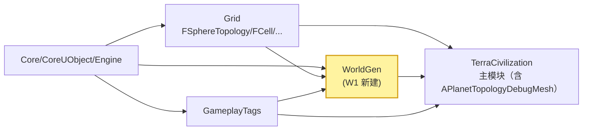
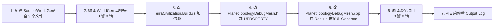
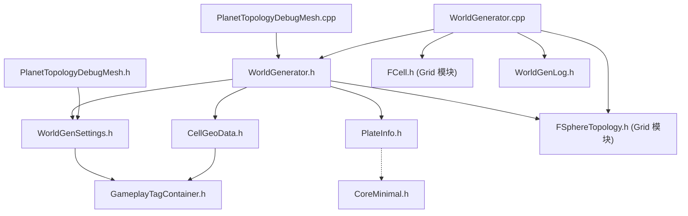

# W1：WorldGen 模块骨架（Source/WorldGen 新建 + 空 Generate 跑通）

> **状态**：✅ **已验收（2026-06）**——用户在 PIE 中确认 Output Log 命中 `[WorldGen] Skeleton OK, 642 cells, no-op generate`、R7 视觉像素级零回归、Editor `WorldGen` 折叠组可见可编辑；11 项验收清单全部通过。本稿**封档为参考**，后续 W-step 的"骨架对照基线"。
>
> **本文档定位**：W1 阶段的独立详细设计稿——提供从"零模块"到"`[WorldGen] Skeleton OK, 642 cells, no-op generate` 输出"的全套落地清单。
>
> 阅读对象：实现 W1 的 AI Agent 或人工开发者；要求一次性完成、编译 0 警 0 错、Output Log 命中目标日志。
>
> 关联：
> - 主稿：[WorldGenDesign.md](WorldGenDesign.md)（§4 数据结构 / §11 W-step Roadmap / §13 cpp 骨架 / §14 同构性约束）
> - 拓扑前置：[SphereTopologyReference.md](SphereTopologyReference.md)（FCell.bIsPentagon 含义）
> - 工作流：[AgentWorkflow.md](AgentWorkflow.md)（§1.3 单期详稿固定 8 章 + 附录结构）
> - 跨期同构：[SphericalSDFTerrainDesign.md](SphericalSDFTerrainDesign.md) §4.1 / §14.1（CellAttrLUT 字段表，W4 才真正接入；W1 不直接消费）
> - 上游模块：[Source/Grid/](../Source/Grid)（已存在）
> - 下游接入点：[PlanetTopologyDebugMesh.h](../Source/TerraCivilization/Public/Render/PlanetTopologyDebugMesh.h)（W1 仅加 1 个 UPROPERTY）

---

## 0. W1 一句话目标

**新建 `Source/WorldGen/` 模块、定义 `FCellGeoData/FWorldGenSettings/FPlateInfo/FWorldGenerator` 空骨架、`APlanetTopologyDebugMesh` 持有 `FWorldGenSettings` UPROPERTY、跑空 `Generate()` 不崩溃、Output Log 命中 `[WorldGen] Skeleton OK, 642 cells, no-op generate`。**

### 0.1 状态对比矩阵

| 项 | W0（当前） | W1（目标） |
| --- | --- | --- |
| `Source/WorldGen/` 模块 | ❌ 不存在 | ✅ 5 个文件（Build.cs + Module.h/.cpp + 4 个数据 .h + WorldGenerator.h/.cpp） |
| `FWorldGenSettings` USTRUCT | ❌ 无 | ✅ 13 个字段全部 UPROPERTY 暴露（W2~W6 各 step 参数预先就位） |
| `FCellGeoData` USTRUCT | ❌ 无 | ✅ 13 个字段（CellId/PlateId/Elevation/.../bIsPentagon），构造函数初始化默认值 |
| `FPlateInfo` USTRUCT | ❌ 无 | ✅ 6 字段（PlateId/SeedCellId/DriftAxis/...） |
| `FWorldGenerator` 类 | ❌ 无 | ✅ 完整骨架：构造函数 + `Generate()` + 8 个 `Step_*()` 空函数 + 私有缓冲 |
| `Generate()` 行为 | — | 仅做：拉 `Topology->Cells.Num()` → `CellData.SetNum(N)` → 填 `CellId/bIsPentagon` → 8 个 step **空调用** → 打印诊断日志 |
| `LogWorldGen` 日志通道 | ❌ 无 | ✅ 注册并输出 `[WorldGen] Skeleton OK, 642 cells, no-op generate` |
| `TerraCivilization.Build.cs` | 含 Grid 等 | ✅ 追加 `WorldGen` 依赖 |
| `APlanetTopologyDebugMesh` | 当前 R7 状态 | ✅ 加 1 个 `FWorldGenSettings WorldGenSettings` UPROPERTY；`Rebuild()` 末尾创建 `FWorldGenerator` 跑一次空 Generate（不影响渲染） |
| 编译 | — | ✅ 0 警 0 错 |
| 运行 | — | ✅ 拖一个 `APlanetTopologyDebugMesh` 进 Level，PIE 启动后 Output Log 命中目标行 |

### 0.2 W1 不做什么（明确边界）

- ❌ 不实现任何 8 step 中的真实算法（板块构造、高程、湿度…一概留空函数）
- ❌ 不引入 `TerrainTags` 模块（W4 才需要 GameplayTag 接入）
- ❌ 不动 `RebuildCellAttrLUT_()`（R7 当前的 Knuth 哈希 placeholder 保留至 W4）
- ❌ 不引入 `UBiomeTable` / `UTerrainDefinition` DataAsset（W7 才启用）
- ❌ 不影响 R1~R7 任何已有行为；W1 是**纯增量**

---

## 目录

- [1. 模块拓扑与边界](#1-模块拓扑与边界)
- [2. 数据结构与代码骨架](#2-数据结构与代码骨架)
- [3. cpp 落地清单](#3-cpp-落地清单)
- [4. 编辑器集成与运行验证](#4-编辑器集成与运行验证)
- [5. 验收清单](#5-验收清单)
- [6. 排错表](#6-排错表)
- [7. 与上下游的关系](#7-与上下游的关系)
- [附录 A：完整可粘贴文件全文](#附录-a完整可粘贴文件全文)
- [附录 B：依赖图与构建顺序](#附录-b依赖图与构建顺序)

---

## 1. 模块拓扑与边界

### 1.1 W1 后的模块依赖图



**新增依赖边**（W1 引入）：

| from → to | 类型 | 说明 |
| --- | --- | --- |
| `Core` → `WorldGen` | Public | 标配 |
| `Grid` → `WorldGen` | Public | `WorldGenerator` 持有 `const FSphereTopology*` |
| `GameplayTags` → `WorldGen` | Public | `FCellGeoData::TerrainTag/Resources` 字段使用 `FGameplayTag` / `FGameplayTagContainer` |
| `WorldGen` → `TerraCivilization` | Public | `APlanetTopologyDebugMesh` 用 `FWorldGenSettings` UPROPERTY |

> **不变量**（与主稿 §3.1 一致）：
> - `WorldGen` **不**依赖 `GridRender`、`Gameplay`、`TerrainTags`（后者 W4 才引入）。
> - `WorldGen` 是**上游**模块，被 `TerraCivilization`（含 `PlanetTopologyDebugMesh`）只读消费。
> - `Generate()` 内部不调用任何 GPU / 材质 / LUT API。

### 1.2 W1 文件落点（`Source/WorldGen/`）

```
Source/WorldGen/
├── WorldGen.Build.cs                  # 模块 Build.cs（24 行）
├── Public/
│   ├── WorldGen.h                     # 模块入口头（IMODULEINTERFACE）
│   ├── WorldGenLog.h                  # LogWorldGen 日志通道
│   ├── WorldGenSettings.h             # FWorldGenSettings USTRUCT（13 字段）
│   ├── CellGeoData.h                  # FCellGeoData USTRUCT（13 字段）
│   ├── PlateInfo.h                    # FPlateInfo USTRUCT（6 字段；W2 用，W1 仅声明）
│   └── WorldGenerator.h               # FWorldGenerator 类（含 8 个 Step_* 空函数）
└── Private/
    ├── WorldGen.cpp                   # IMPLEMENT_MODULE 实现 + LogWorldGen 定义
    └── WorldGenerator.cpp             # FWorldGenerator 全部成员实现（8 step 空体）
```

> 主稿 §11 W-step Roadmap 没有要求 W1 拆出 `Step_Plates.cpp` / `Step_Elevation.cpp` 等单独文件——**全 step 空函数集中在 `WorldGenerator.cpp` 一个文件**，W2 启动时再拆出 `Step_Plates.cpp` 等。

### 1.3 与现有 [PlanetTopologyDebugMesh](../Source/TerraCivilization/Public/Render/PlanetTopologyDebugMesh.h) 的最小化对接

仅做 3 件事：

1. **加 1 个 UPROPERTY**：`FWorldGenSettings WorldGenSettings`（Category="PlanetTopology|WorldGen"）
2. **`Rebuild()` 末尾追加调用**：构造 `FWorldGenerator(SphereTopo.Get(), WorldGenSettings)` → `Generate()` → 立即销毁（W1 阶段不持有；W2 起改为 `TUniquePtr<FWorldGenerator> Generator;`）
3. **不**改动 `RebuildCellAttrLUT_()` / 任何材质 MID 注入逻辑

> ⚠ **极重要**：W1 的 Generate() **不修改任何 LUT、不影响材质着色**。R7 的视觉效果在 W1 完成后**完全不变**——仅多出一行 Output Log。这是"零回归"承诺。

---

## 2. 数据结构与代码骨架

> 本节给出**核心字段语义**与**类签名**；完整可粘贴的 cpp 全文移到 [附录 A](#附录-a完整可粘贴文件全文)，避免本节过长。

### 2.1 `FWorldGenSettings`（参数面板，13 字段）

| 字段 | 类型 | 默认值 | 范围 | 启用阶段 | 含义 |
| --- | --- | --- | --- | --- | --- |
| `RandomSeed` | `int32` | 0 | — | W1（仅持有，不用） | 同 Seed + 同 Sub 决定唯一世界 |
| `PlateCount` | `int32` | 12 | [3, 32] | W2 | 板块数 |
| `OceanicPlateRatio` | `float` | 0.6 | [0, 1] | W2 | 海洋板块比例 |
| `PlateBoundaryThreshold` | `float` | 0.1 | [0, ∞) | W2 | 汇聚/张裂判定阈值 |
| `SeaLevel` | `float` | 0.0 | [-1, 1] | W2 | 海平面 |
| `MountainThreshold` | `float` | 0.5 | [0, 1] | W3 | 山脉阈值 |
| `MountainBoundaryStrength` | `float` | 1.0 | [0, ∞) | W3 | 边界抬升强度 |
| `ElevationNoiseAmplitude` | `float` | 0.3 | [0, ∞) | W3 | 高程 fbm 振幅 |
| `ElevationNoiseFrequency` | `float` | 2.0 | [0, ∞) | W3 | fbm 频率 |
| `MoistureScale` | `float` | 1.0 | [0, 1] | W3 | 湿度场最大值 |
| `MoistureCoastalFalloff` | `float` | 0.15 ⚡W3.5 | [0, ∞) | W3 | 上风 SSSP 累积距离衰减 |
| `RainShadowFactor` | `float` | 0.3 ⚠废弃 | [0, 1] | W3 | 原雨影衰减；W3.5 后雨影已内嵌到 SSSP 边权、字段保留但 W3 不读 |
| `TemperatureBias` | `float` | 0.0 | [-1, 1] | W3 | 全局温度偏移 |
| `TemperatureLapseRate` | `float` | 0.3 | [0, ∞) | W3 | 海拔温度递减率 |
| `AlphaElevation` ⚡W3.5 | `float` | 4.0 | [0, 10] | W3 | 上风 SSSP 高地加权（内嵌雨影）|
| `AlphaCoast` ⚡W3.5 | `float` | 0.5 | [0, 1] | W3 | 上风 SSSP 海岸边权减免 |
| `RiverDischargeThreshold` | `float` | 5.0 | [0, ∞) | W5 | 河流流量阈值 |
| `LakeDischargeThreshold` | `float` | 20.0 | [0, ∞) | W5 | 湖泊流量阈值 |
| `ForcedBaseTraits` | `TArray<FGameplayTagContainer>` | empty | — | W6 | 12 基地 Trait |
| `BiomeTable` | `TSoftObjectPtr<UBiomeTable>` | nullptr | — | W7 | DataAsset 化 |

> 字段总数 **18**（W1 验收时） · **20**（W3.5 修订后）——比主稿 §11 概数"13 字段"略多，因为参数表把 W2~W7 全 step 参数都预先就位。**W1 一律不读这些字段**（仅持有），但暴露 UPROPERTY 让 Editor 可调，避免 W2~W7 反复加字段触发 `FWorldGenSettings` 版本失配。
>
> **⚠ W3.5 破例（2026-06-28）**：原计划 W1 锁定后不再改 `FWorldGenSettings` 任何字段；但 W3 PIE 实测发现“各向同性海距 BFS + 独立雨影”方案下湿度梯度平缓、无东西岸差异。W3.5 修订为上风向 SSSP + 高程加权边权后，**新增** `AlphaElevation`(4.0) + `AlphaCoast`(0.5)；**调整默认** `MoistureCoastalFalloff: 0.05 → 0.15`；**废弃**（字段保留） `RainShadowFactor`。完整说明见 [W3_ScalarFields.md §0.2 / §4.0](W3_ScalarFields.md)。字段名 / 仅主加不减，W1 负责的“反反复复加字段触发版本失配”纪律仍未被破坏。

> 注：`UBiomeTable` 在 W7 才定义；W1 用 `TSoftObjectPtr<class UBiomeTable>` 前向声明软引用，**不**触发模块依赖。

### 2.2 `FCellGeoData`（每 Cell 输出，13 字段 / ~64B）

```cpp
USTRUCT(BlueprintType)
struct WORLDGEN_API FCellGeoData
{
    GENERATED_BODY()

    UPROPERTY() int32 CellId         = INDEX_NONE;
    UPROPERTY() int32 PlateId        = INDEX_NONE;

    UPROPERTY() float Elevation      = 0.f;     // [-1, 1]
    UPROPERTY() float Moisture       = 0.5f;    // [ 0, 1]
    UPROPERTY() float Temperature    = 0.f;     // [-1, 1]

    UPROPERTY() uint8 bIsLand     : 1;
    UPROPERTY() uint8 bIsCoast    : 1;
    UPROPERTY() uint8 bIsMountain : 1;
    UPROPERTY() uint8 bIsRiver    : 1;
    UPROPERTY() uint8 bIsLake     : 1;
    UPROPERTY() uint8 bIsPentagon : 1;

    UPROPERTY() FGameplayTag           TerrainTag;
    UPROPERTY() FGameplayTagContainer  Resources;

    UPROPERTY() int32 BaseFactionId = INDEX_NONE;
    UPROPERTY() int32 OwnerId       = INDEX_NONE;  // 运行时 Gameplay 写
    UPROPERTY() int32 FlowTo        = INDEX_NONE;  // W5 河流下游 cell

    FCellGeoData()
        : bIsLand(1), bIsCoast(0), bIsMountain(0), bIsRiver(0), bIsLake(0), bIsPentagon(0)
    {}
};
```

> **W1 仅写两个字段**：`CellId = i` 与 `bIsPentagon = Topology->Cells[i].bIsPentagon ? 1 : 0`。其余字段保持构造函数默认值，等 W2~W6 各 step 接力填充。

### 2.3 `FPlateInfo`（中间数据，6 字段；W1 仅声明）

```cpp
USTRUCT()
struct WORLDGEN_API FPlateInfo
{
    GENERATED_BODY()

    int32   PlateId       = INDEX_NONE;
    int32   SeedCellId    = INDEX_NONE;
    FVector DriftAxis     = FVector::ZeroVector;   // 球面切平面单位向量
    float   DriftSpeed    = 0.f;                   // [0, 1]
    bool    bIsOceanic    = false;
    float   BaseElevation = 0.f;                   // 海洋板块负、大陆板块正
};
```

> W1 不实例化 `Plates` 数组，仅头文件声明；W2 启动时再实际填充。

### 2.4 `FWorldGenerator` 类签名

```cpp
class WORLDGEN_API FWorldGenerator
{
public:
    explicit FWorldGenerator(const FSphereTopology* InTopology, const FWorldGenSettings& InSettings);

    /** 跑完整 8 步流水线；W1 阶段所有 step 都是空函数；执行后 GetCellData() 仅有 CellId + bIsPentagon */
    void Generate();

    const TArray<FCellGeoData>& GetCellData()    const { return CellData; }
    const TArray<FPlateInfo>&   GetPlates()      const { return Plates; }
    const TArray<int32>&        GetBaseCellIds() const { return BaseCellIds; }

    /** Debug：单步运行（W8 编辑器视图用，W1 阶段全部空体） */
    void Step_PartitionPlates();        // W2
    void Step_ComputeElevation();       // W3
    void Step_DetermineLandSea();       // W2
    void Step_SimulateMoisture();       // W3
    void Step_ComputeTemperature();     // W3
    void Step_ClassifyBiomes();         // W4
    void Step_TraceRivers();            // W5
    void Step_AssignBaseCells();        // W6

private:
    const FSphereTopology* Topology = nullptr;
    FWorldGenSettings      Settings;
    FRandomStream          Rng;

    TArray<FCellGeoData>   CellData;
    TArray<FPlateInfo>     Plates;
    TArray<int32>          BaseCellIds;

    // 中间标量场（详见主稿 §4.4；W1 仅 SetNumZeroed 不写入）
    TArray<float>          ElevationField;
    TArray<float>          MoistureField;
    TArray<float>          TemperatureField;
    TArray<int32>          PlateIdField;
    TArray<float>          DischargeField;
};
```

### 2.5 `Generate()` W1 实现（核心 30 行）

```cpp
void FWorldGenerator::Generate()
{
    check(Topology);

    const int32 N = Topology->Cells.Num();
    CellData.SetNum(N);
    PlateIdField.SetNumZeroed(N);
    ElevationField.SetNumZeroed(N);
    MoistureField.SetNumZeroed(N);
    TemperatureField.SetNumZeroed(N);
    DischargeField.SetNumZeroed(N);

    // W1 唯一实际写入：CellId + bIsPentagon
    for (int32 i = 0; i < N; ++i)
    {
        CellData[i].CellId      = i;
        CellData[i].bIsPentagon = Topology->Cells[i].bIsPentagon ? 1 : 0;
    }

    Rng.Initialize(Settings.RandomSeed);

    Step_PartitionPlates();       // W2  - W1 空体
    Step_ComputeElevation();      // W3  - W1 空体
    Step_DetermineLandSea();      // W2  - W1 空体
    Step_SimulateMoisture();      // W3  - W1 空体
    Step_ComputeTemperature();    // W3  - W1 空体
    Step_ClassifyBiomes();        // W4  - W1 空体
    Step_TraceRivers();           // W5  - W1 空体
    Step_AssignBaseCells();       // W6  - W1 空体

    UE_LOG(LogWorldGen, Log,
        TEXT("[WorldGen] Skeleton OK, %d cells, no-op generate"), N);
}
```

> **关键日志**：`[WorldGen] Skeleton OK, %d cells, no-op generate` 是 W1 的**唯一验收锚点**——主稿 §11 已锁死。任何字符增删都视为破坏验收契约。

### 2.6 8 个 Step_* 函数（全部空体）

```cpp
void FWorldGenerator::Step_PartitionPlates()     { /* W2 实现 */ }
void FWorldGenerator::Step_ComputeElevation()    { /* W3 实现 */ }
void FWorldGenerator::Step_DetermineLandSea()    { /* W2 实现 */ }
void FWorldGenerator::Step_SimulateMoisture()    { /* W3 实现 */ }
void FWorldGenerator::Step_ComputeTemperature()  { /* W3 实现 */ }
void FWorldGenerator::Step_ClassifyBiomes()      { /* W4 实现 */ }
void FWorldGenerator::Step_TraceRivers()         { /* W5 实现 */ }
void FWorldGenerator::Step_AssignBaseCells()     { /* W6 实现 */ }
```

---

## 3. cpp 落地清单

### 3.1 必须新建的文件（共 9 个）

| 序号 | 文件 | 行数估计 | 用途 |
| --- | --- | --- | --- |
| 1 | [WorldGen.Build.cs](../Source/WorldGen/WorldGen.Build.cs) | ~22 | 模块声明 + 依赖（Core/CoreUObject/Engine/Grid/GameplayTags） |
| 2 | [WorldGen.h](../Source/WorldGen/Public/WorldGen.h) | ~12 | 模块入口（IModuleInterface） |
| 3 | [WorldGenLog.h](../Source/WorldGen/Public/WorldGenLog.h) | ~10 | DECLARE_LOG_CATEGORY_EXTERN |
| 4 | [WorldGenSettings.h](../Source/WorldGen/Public/WorldGenSettings.h) | ~95 | FWorldGenSettings USTRUCT 全 18 字段 |
| 5 | [CellGeoData.h](../Source/WorldGen/Public/CellGeoData.h) | ~45 | FCellGeoData USTRUCT |
| 6 | [PlateInfo.h](../Source/WorldGen/Public/PlateInfo.h) | ~22 | FPlateInfo USTRUCT |
| 7 | [WorldGenerator.h](../Source/WorldGen/Public/WorldGenerator.h) | ~55 | FWorldGenerator 类 |
| 8 | [WorldGen.cpp](../Source/WorldGen/Private/WorldGen.cpp) | ~12 | IMPLEMENT_MODULE + LogWorldGen 定义 |
| 9 | [WorldGenerator.cpp](../Source/WorldGen/Private/WorldGenerator.cpp) | ~75 | FWorldGenerator 全部实现（含 8 个 Step_* 空体） |

> **行数总和 ≈ 350 行新代码**——其中 70% 是 USTRUCT 字段声明 + UPROPERTY 注释。

### 3.2 必须修改的文件（共 2 个）

| 序号 | 文件 | 改动 |
| --- | --- | --- |
| 1 | [TerraCivilization.Build.cs](../Source/TerraCivilization/TerraCivilization.Build.cs) | `PublicDependencyModuleNames` 追加 `"WorldGen"` 与 `"GameplayTags"`（GameplayTags 是 FWorldGenSettings.ForcedBaseTraits 字段反射所需） |
| 2 | [PlanetTopologyDebugMesh.h](../Source/TerraCivilization/Public/Render/PlanetTopologyDebugMesh.h) | (a) `#include "WorldGenSettings.h"`（含在 .h 是必须的，因为 UPROPERTY 反射要看到完整定义）；(b) 加 1 个 `UPROPERTY() FWorldGenSettings WorldGenSettings;` |
| 3 | [PlanetTopologyDebugMesh.cpp](../Source/TerraCivilization/Private/Render/PlanetTopologyDebugMesh.cpp) | (a) `#include "WorldGenerator.h"`；(b) `Rebuild()` 末尾追加 ~5 行：构造 `FWorldGenerator` 跑空 Generate；(c) 不做其他改动 |

### 3.3 改动顺序（避免链接错误）



> **绝不可**先改 `PlanetTopologyDebugMesh.h` 再建 `WorldGen` 模块——因为 `#include "WorldGenSettings.h"` 会立刻失败。严格按序号 1→7 推进。

---

## 4. 编辑器集成与运行验证

### 4.1 `APlanetTopologyDebugMesh` UPROPERTY 集成

#### 4.1.1 头文件改动（[PlanetTopologyDebugMesh.h](../Source/TerraCivilization/Public/Render/PlanetTopologyDebugMesh.h)）

```cpp
// 文件顶部 include 区追加：
#include "WorldGenSettings.h"          // ← W1 新增

// UCLASS() class APlanetTopologyDebugMesh 内部，找一个合理位置（建议放在 SubdivisionLevel 之后、Radius 之前），追加：
/** WorldGen 流水线参数。W1 阶段仅暴露 UPROPERTY，Generate() 跑空逻辑。W2 起逐 step 启用。 */
UPROPERTY(EditAnywhere, BlueprintReadOnly, Category = "PlanetTopology|WorldGen")
FWorldGenSettings WorldGenSettings;
```

> **Category 命名约定**：`PlanetTopology|WorldGen` —— 与现有 `PlanetTopology` 主分组同根，加子分组 `WorldGen` 便于 Editor 折叠。

#### 4.1.2 cpp 改动（[PlanetTopologyDebugMesh.cpp](../Source/TerraCivilization/Private/Render/PlanetTopologyDebugMesh.cpp)）

在 `Rebuild()` 函数的**末尾**（在所有 LUT 上传与材质 MID 注入之后），追加：

```cpp
// ===== W1: WorldGen 骨架接入 =====
// 目的：调通 Source/WorldGen 模块；运行时跑一次空 Generate 验证模块加载与日志通道。
// W1 阶段 Generate() 不修改任何渲染数据；R7 视觉效果保持不变。
// W2 起：把 Generator 持有为 TUniquePtr 成员，并把 GeoData 喂给 LUT。
if (SphereTopo.IsValid())
{
    FWorldGenerator TmpGen(SphereTopo.Get(), WorldGenSettings);
    TmpGen.Generate();
    // W1 不消费 TmpGen.GetCellData()；构造析构即弃。
}
```

> **极重要约束**：
> 1. **不要**改动 `RebuildCellAttrLUT_()`（R7 现行 Knuth 哈希 placeholder 保留至 W4）
> 2. **不要**把 `Generator` 提升为成员（W1 范围内不持有）
> 3. **不要**用返回的 `CellData[]` 替换 LUT 数据源（这是 W4 的事）

### 4.2 编译验证

```bash
# Windows 下用 UAT 或 Editor 命令行
# 期望：0 warning + 0 error
# 关键观察点：
#   - WorldGen.dll 链接成功
#   - TerraCivilization.dll 能找到 FWorldGenSettings / FWorldGenerator 符号
```

### 4.3 PIE 运行验证

1. 把 [PlanetTopologyDebugMesh](../Source/TerraCivilization/Public/Render/PlanetTopologyDebugMesh.h) 的 Actor 实例拖入 Level（或确认 Level 中已有的实例）
2. PIE 启动
3. 打开 Output Log，过滤 `[WorldGen]`
4. **期望命中**：

```
LogWorldGen: [WorldGen] Skeleton OK, 642 cells, no-op generate
```

> sub=3 时 `Cells.Num() = 642`；sub=4 时 `2562`。日志中的数字应与 `SubdivisionLevel` 对应：
>
> | SubdivisionLevel | 期望日志 |
> | --- | --- |
> | 3 | `Skeleton OK, 642 cells, no-op generate` |
> | 4 | `Skeleton OK, 2562 cells, no-op generate` |
> | 5 | `Skeleton OK, 10242 cells, no-op generate` |

### 4.4 视觉零回归验证

```
1. 在 W1 改动前 PIE 截图（命名：before_W1.png）
2. 在 W1 改动后 PIE 截图（命名：after_W1.png）
3. 期望：两张图像素级一致（仅 Output Log 多 1 行 [WorldGen] 日志）
```

> R7 Triplanar 真实地表的所有视觉特征（19 layer / 边软过渡 / 噪声扰动）必须**像素级保持**。如果发现颜色变化，说明 W1 改动意外踩到了 LUT/材质——立刻按 §6.1 排错。

---

## 5. 验收清单

> 全部 11 项必须 ✅ 才算 W1 完成。任何一项 ❌ 都不能提 W2。

| # | 项 | 验收标准 |
| --- | --- | --- |
| A | `Source/WorldGen/` 9 个新文件全部存在 | `ls Source/WorldGen/` 看到全部清单 |
| B | `WorldGen.Build.cs` 依赖正确 | `PublicDependencyModuleNames` 含 `Core/CoreUObject/Engine/Grid/GameplayTags` |
| C | 编译 0 警 0 错 | UBT 输出 `Result: Succeeded` + 无 `Warning:` 行 |
| D | `LogWorldGen` 通道注册成功 | `WorldGen.cpp` 含 `DEFINE_LOG_CATEGORY(LogWorldGen)` 且 `WorldGenLog.h` 含 `DECLARE_LOG_CATEGORY_EXTERN(LogWorldGen, Log, All)` |
| E | `FWorldGenSettings` 全 18 字段 UPROPERTY | Editor 选中 Actor 看到 `PlanetTopology > WorldGen` 折叠展开有 18 项 |
| F | `FCellGeoData` 构造函数初始化正确 | 单元测试或断言：`FCellGeoData c; check(c.bIsLand == 1 && c.bIsCoast == 0 && c.CellId == INDEX_NONE)` |
| G | `Generate()` 空跑不崩 | PIE 启动 30 秒，`APlanetTopologyDebugMesh` 实例在场景中，无 Crash |
| H | Output Log 命中 `[WorldGen] Skeleton OK, %d cells, no-op generate` | sub=3 时 N=642；sub=4 时 N=2562 |
| I | `CellData[i].CellId == i` 不变量 | 在 `Rebuild()` 接入处加临时 check 或断点 |
| J | `CellData[12 个 pent]` 的 `bIsPentagon == 1` | 对于 sub=3，CellId 0~11 应都是 pent（`Topology->Cells[i].bIsPentagon == true`） |
| K | R7 视觉零回归 | W1 前后 PIE 截图像素级一致（除 Log 行外） |

### 5.1 单元自检（手动跑）

打开 [PlanetTopologyDebugMesh.cpp](../Source/TerraCivilization/Private/Render/PlanetTopologyDebugMesh.cpp) 的 `Rebuild()` 末尾 W1 接入处，在 `TmpGen.Generate()` 之后临时加：

```cpp
#if WITH_EDITOR
const auto& Geo = TmpGen.GetCellData();
const int32 N = Geo.Num();
int32 PentCount = 0;
for (int32 i = 0; i < N; ++i)
{
    check(Geo[i].CellId == i);                // 不变量 I
    if (Geo[i].bIsPentagon) ++PentCount;
}
check(PentCount == 12);                       // 不变量 J（sub ≥ 1 时恒成立）
UE_LOG(LogWorldGen, Log, TEXT("[WorldGen] Self-check OK: PentCount=%d"), PentCount);
#endif
```

> 验收通过后**一定要删掉**这段临时自检——它在 Shipping 模式下编译不掉但耗时；W2 启动时再写正式的单元测试。

---

## 6. 排错表

| 症状 | 根因 | 修复 |
| --- | --- | --- |
| **6.1** 编译错误：`Cannot open include file: 'WorldGenSettings.h'` | TerraCivilization.Build.cs 没加 `"WorldGen"` 依赖 | §3.2 第 1 项；改完 Live Coding 不行就 Rebuild Editor |
| **6.2** 编译错误：`Cannot open include file: 'GameplayTagContainer.h'` | TerraCivilization.Build.cs 没加 `"GameplayTags"` 依赖 | §3.2 第 1 项；`FWorldGenSettings.ForcedBaseTraits` 字段需要 |
| **6.3** 链接错误：`unresolved external symbol "FWorldGenerator::Generate"` | `WorldGenerator.cpp` 缺失或编译被排除 | 检查 `Source/WorldGen/Private/WorldGenerator.cpp` 存在；UBT 应自动包含 |
| **6.4** 链接错误：`unresolved external symbol "LogWorldGen"` | `WorldGen.cpp` 没 `DEFINE_LOG_CATEGORY(LogWorldGen)` | 必须在 .cpp 中 DEFINE，不能只在 .h 中 DECLARE |
| **6.5** 编译错误：`Unrecognized type 'FWorldGenSettings' - type must be a UCLASS, USTRUCT, UENUM, or FProperty` | 头文件忘了 `#include "WorldGenSettings.generated.h"` | UHT 自动生成的 .generated.h 必须放在 USTRUCT 头文件最后一个 #include |
| **6.6** 编译错误：`'FCellGeoData::FCellGeoData()': member initializer list with bit-field is invalid` | bit-field 在初始化列表里写法错误 | 必须用 `: bIsLand(1), bIsCoast(0), ...` 而不是 `bIsLand = 1`（参见 §2.2） |
| **6.7** PIE 启动 Output Log 看不到 `[WorldGen]` | `Rebuild()` 没有在 PIE 时被调用，或 `SphereTopo.IsValid()` 为 false | 在 §4.1.2 接入处下断点；确认 `Rebuild()` 被 `OnConstruction` / `BeginPlay` 触发 |
| **6.8** PIE 立刻崩在 `Generate()` | `Topology` 指针无效 / Cells 数组空 | check(Topology) 已经覆盖；进一步检查 `SphereTopo->Build()` 是否在 W1 接入点之前调用 |
| **6.9** Output Log 数字与 SubdivisionLevel 不符（如 sub=3 看到 162） | 实例 `SubdivisionLevel` 字段被 Blueprint 默认值覆盖到 2 | Editor 选中 Actor 检查 `PlanetTopology > Subdivision Level` 字段 |
| **6.10** R7 视觉发生回归（颜色变白 / 出现条纹） | 误改了 `RebuildCellAttrLUT_()` 或材质 MID 注入逻辑 | 严格回退；W1 范围**不允许**改动 LUT 相关代码 |
| **6.11** Editor 选中 Actor 看不到 `WorldGen` 折叠组 | `FWorldGenSettings` 没标 `BlueprintType` 或 UPROPERTY 没标 EditAnywhere | 见 §2.1 与附录 A 范本 |
| **6.12** 编译警告：`unused variable 'Geo'` | 临时自检代码遗留 | §5.1 自检完后删除 |
| **6.13** Live Coding 后 Generate() 没生效 | 修改了 `WorldGen` 模块但 Live Coding 不重新加载该 dll | 关闭 Editor，Visual Studio 全量 Rebuild |
| **6.14** Output Log 行末有乱码 | 中文 / Unicode 截断 | 日志全英文，本稿日志锚点 `[WorldGen] Skeleton OK, %d cells, no-op generate` 全 ASCII，不会触发 |

---

## 7. 与上下游的关系

### 7.1 与 R1~R7 的关系（无侵入承诺）

W1 是**纯增量**模块：

- ✅ 不改 R1~R7 的任何 HLSL 代码
- ✅ 不改 R3 `RebuildCellAttrLUT_()` 的 Knuth 哈希 placeholder
- ✅ 不改 R4 `RebuildCellDirLUT_()`、R5 `EdgeWidth`、R6 噪声参数、R7 Triplanar 任何 MID 注入逻辑
- ✅ R7 视觉**像素级保持**

唯一影响：

- ➕ Output Log 多 1 行 `[WorldGen] Skeleton OK, ...`
- ➕ Editor 选中 `APlanetTopologyDebugMesh` Actor 时多 1 个 `WorldGen` 折叠组

### 7.2 与 W2 的衔接

W2 启动时的扩展点：

| W1 现状 | W2 改动 |
| --- | --- |
| `Step_PartitionPlates()` 空体 | 实现球面 Lloyd + BFS Voronoi（详见主稿 §7.1 / §13.3） |
| `Step_DetermineLandSea()` 空体 | 海陆判定 + 海岸标记（详见主稿 §5.3） |
| `Rebuild()` 末尾构造 `FWorldGenerator` 即弃 | 提升为 `TUniquePtr<FWorldGenerator> Generator;` 成员；只跑一次 |
| `RebuildCellAttrLUT_()` 用 Knuth 哈希 | 改为 `LayerIndex = bIsLand ? 4 : 0`（草地/海洋两色） |
| 自检日志用临时 #if WITH_EDITOR | 抽出 `RunWorldGenSelfCheck_()` 单独函数 |

W2 详稿命名：`W2_PlatesAndLandSea.md`。

### 7.3 与 R8 的同构性（远期）

主稿 §14.4 锁定的同构性纪律：

| 阶段 | SDF 渲染路径 | WorldGen 端是否需要适配 |
| --- | --- | --- |
| **R7（当前）** | IsoSphere primal + Knuth 哈希 LUT | ❌ 不接入；R7-compliance 不变 |
| **W1（本稿）** | IsoSphere primal + Knuth 哈希 LUT | ❌ 不接入；W1 Generate() 不写 LUT |
| **W4 接 R8** | IsoSphere primal + 19-Layer LUT（消费 `FCellGeoData.TerrainTag → UTerrainDefinition.LayerIndex`） | ✅ 这是 W4 的目标 |
| **R11~R13 PTG** | GPU FindNearestCell + 19-Layer LUT（消费同一份 `FCellGeoData`） | ❌ WorldGen 端不需任何改动 |

> **关键不变量**：`FCellGeoData[]` 永远以 `CellId` 为主键；从 W4 起，所有渲染路径都通过同一份 LUT 消费 WorldGen 输出，**WorldGen 模块对渲染路径选择完全无感知**。

### 7.4 与 [SphereTopologyReference.md](SphereTopologyReference.md) §8.1 契约一致

W1 严格遵守[拓扑稿 §8.1 WorldGen 写入契约](SphereTopologyReference.md#81-worldgenworldgendesignmd)：

| 字段 | W1 行为 |
| --- | --- |
| `FCell.*`、`FCorner.*`、`FRenderTri.*`、`FCellEdge.CellIds/CornerIds` | ✅ 只读 |
| `FCellEdge.bIsPlateBoundary` / `BoundaryStrength` | ❌ W1 不写（W2 才写） |
| 其他拓扑字段 | ❌ W1 不动 |

---

## 附录 A：完整可粘贴文件全文

> 本附录把 9 个新文件的完整内容平铺，实现时**直接复制粘贴**，避免再去拼。文件之间用 `---` 分隔。

### A.1 [WorldGen.Build.cs](../Source/WorldGen/WorldGen.Build.cs)

```csharp
// Copyright Epic Games, Inc. All Rights Reserved.

using UnrealBuildTool;

public class WorldGen : ModuleRules
{
    public WorldGen(ReadOnlyTargetRules Target) : base(Target)
    {
        PCHUsage = PCHUsageMode.UseExplicitOrSharedPCHs;

        PublicDependencyModuleNames.AddRange(new string[]
        {
            "Core",
            "CoreUObject",
            "Engine",
            "Grid",
            "GameplayTags"
        });

        PrivateDependencyModuleNames.AddRange(new string[] { });
    }
}
```

### A.2 [Source/WorldGen/Public/WorldGen.h](../Source/WorldGen/Public/WorldGen.h)

```cpp
// Copyright Epic Games, Inc. All Rights Reserved.

#pragma once

#include "CoreMinimal.h"
#include "Modules/ModuleManager.h"

class FWorldGenModule : public IModuleInterface
{
public:
    virtual void StartupModule() override {}
    virtual void ShutdownModule() override {}
};
```

### A.3 [Source/WorldGen/Public/WorldGenLog.h](../Source/WorldGen/Public/WorldGenLog.h)

```cpp
// Copyright Epic Games, Inc. All Rights Reserved.

#pragma once

#include "CoreMinimal.h"
#include "Logging/LogMacros.h"

WORLDGEN_API DECLARE_LOG_CATEGORY_EXTERN(LogWorldGen, Log, All);
```

### A.4 [Source/WorldGen/Public/WorldGenSettings.h](../Source/WorldGen/Public/WorldGenSettings.h)

```cpp
// Copyright Epic Games, Inc. All Rights Reserved.

#pragma once

#include "CoreMinimal.h"
#include "GameplayTagContainer.h"
#include "WorldGenSettings.generated.h"

class UBiomeTable;  // W7 启用 DataAsset 化时定义

/**
 * FWorldGenSettings
 *
 * WorldGen 流水线参数面板（W1~W7 全 step 参数集中地）。
 * 字段按 step 分组，每字段标注启用阶段；W1 阶段全部仅持有不消费。
 * 详见 Docs/WorldGenDesign.md §4.1。
 */
USTRUCT(BlueprintType)
struct WORLDGEN_API FWorldGenSettings
{
    GENERATED_BODY()

    // ───────────── General ─────────────

    /** 随机种子；同一种子 + 同 SubdivisionLevel 永远产生相同世界。W1 持有，W2 起消费。 */
    UPROPERTY(EditAnywhere, Category = "WorldGen|General")
    int32 RandomSeed = 0;

    // ───────────── Plates (W2) ─────────────

    /** 板块数量；推荐 8~16，与 12 五边形数量协调。 */
    UPROPERTY(EditAnywhere, Category = "WorldGen|Plates", meta = (ClampMin = "3", ClampMax = "32"))
    int32 PlateCount = 12;

    /** 海洋板块比例。 */
    UPROPERTY(EditAnywhere, Category = "WorldGen|Plates", meta = (ClampMin = "0.0", ClampMax = "1.0"))
    float OceanicPlateRatio = 0.6f;

    /** 板块边界类型判别阈值（汇聚/张裂/平移）。 */
    UPROPERTY(EditAnywhere, Category = "WorldGen|Plates", meta = (ClampMin = "0.0"))
    float PlateBoundaryThreshold = 0.1f;

    // ───────────── Elevation (W2 / W3) ─────────────

    /** 海平面阈值（Elevation 低于此值视为海洋）。 */
    UPROPERTY(EditAnywhere, Category = "WorldGen|Elevation", meta = (ClampMin = "-1.0", ClampMax = "1.0"))
    float SeaLevel = 0.0f;

    /** 山脉阈值（Elevation 高于此值视为山脉）。 */
    UPROPERTY(EditAnywhere, Category = "WorldGen|Elevation", meta = (ClampMin = "0.0", ClampMax = "1.0"))
    float MountainThreshold = 0.5f;

    /** 板块汇聚边界的山脉抬升强度。 */
    UPROPERTY(EditAnywhere, Category = "WorldGen|Elevation", meta = (ClampMin = "0.0"))
    float MountainBoundaryStrength = 1.0f;

    /** 高程噪声振幅（fbm）。 */
    UPROPERTY(EditAnywhere, Category = "WorldGen|Elevation", meta = (ClampMin = "0.0"))
    float ElevationNoiseAmplitude = 0.3f;

    /** 高程噪声频率。 */
    UPROPERTY(EditAnywhere, Category = "WorldGen|Elevation", meta = (ClampMin = "0.0"))
    float ElevationNoiseFrequency = 2.0f;

    // ───────────── Climate (W3) ─────────────

    /** 湿度场最大值（影响整体雨量）。 */
    UPROPERTY(EditAnywhere, Category = "WorldGen|Climate", meta = (ClampMin = "0.0", ClampMax = "1.0"))
    float MoistureScale = 1.0f;

    /** 海距湿度衰减系数。上风向 SSSP 中按累积距离衰减；W3.5 默认 0.15。 */
    UPROPERTY(EditAnywhere, Category = "WorldGen|Climate", meta = (ClampMin = "0.0"))
    float MoistureCoastalFalloff = 0.15f;

    /** [W3.5 deprecated] 原雨影衰减系数。雨影已内嵌到上风向 SSSP 边权中，本字段保留但 W3 不读；W4+ 可能重启用。 */
    UPROPERTY(EditAnywhere, Category = "WorldGen|Climate", meta = (ClampMin = "0.0", ClampMax = "1.0"))
    float RainShadowFactor = 0.3f;

    /** 全局温度偏移（暖期 = +0.2，冰期 = -0.3）。 */
    UPROPERTY(EditAnywhere, Category = "WorldGen|Climate", meta = (ClampMin = "-1.0", ClampMax = "1.0"))
    float TemperatureBias = 0.0f;

    /** 海拔每升高 0.1 单位，温度下降的量。 */
    UPROPERTY(EditAnywhere, Category = "WorldGen|Climate", meta = (ClampMin = "0.0"))
    float TemperatureLapseRate = 0.3f;

    /** [W3.5 新增] 高程衰减加权系数。上风向 SSSP 中高地 cell 边权 = 1 + AlphaElevation × max(0, Elev - SeaLevel)；默认 4.0。 */
    UPROPERTY(EditAnywhere, Category = "WorldGen|Climate", meta = (ClampMin = "0.0", ClampMax = "10.0"))
    float AlphaElevation = 4.0f;

    /** [W3.5 新增] 海岸边权减免系数。上风向 SSSP 中海岸 cell 为上风邻居时边权 = 1 - AlphaCoast；默认 0.5。 */
    UPROPERTY(EditAnywhere, Category = "WorldGen|Climate", meta = (ClampMin = "0.0", ClampMax = "1.0"))
    float AlphaCoast = 0.5f;

    // ───────────── Rivers (W5) ─────────────

    /** 河流流量阈值；汇流量大于此值的 cell 标为河流。 */
    UPROPERTY(EditAnywhere, Category = "WorldGen|Rivers", meta = (ClampMin = "0.0"))
    float RiverDischargeThreshold = 5.0f;

    /** 湖泊流量阈值。 */
    UPROPERTY(EditAnywhere, Category = "WorldGen|Rivers", meta = (ClampMin = "0.0"))
    float LakeDischargeThreshold = 20.0f;

    // ───────────── Bases (W6) ─────────────

    /** 12 个势力基地的 Trait（数量必须 == 5/12 五边形数）。W6 启用。 */
    UPROPERTY(EditAnywhere, Category = "WorldGen|Bases")
    TArray<FGameplayTagContainer> ForcedBaseTraits;

    // ───────────── Biomes (W4 / W7) ─────────────

    /** 生物群系查表（W7 启用 DataAsset 化）；W4 阶段先用 cpp 硬编码默认 5x5 表。 */
    UPROPERTY(EditAnywhere, Category = "WorldGen|Biomes")
    TSoftObjectPtr<UBiomeTable> BiomeTable;
};
```

### A.5 [Source/WorldGen/Public/CellGeoData.h](../Source/WorldGen/Public/CellGeoData.h)

```cpp
// Copyright Epic Games, Inc. All Rights Reserved.

#pragma once

#include "CoreMinimal.h"
#include "GameplayTagContainer.h"
#include "CellGeoData.generated.h"

/**
 * FCellGeoData
 *
 * WorldGen 流水线对每个 Cell 的输出。CellId == 数组下标。
 * 详见 Docs/WorldGenDesign.md §4.2。
 *
 * 字段写入阶段表：
 *   W1: CellId, bIsPentagon
 *   W2: PlateId, bIsLand, bIsCoast
 *   W3: Elevation, Moisture, Temperature, bIsMountain
 *   W4: TerrainTag, Resources
 *   W5: bIsRiver, bIsLake, FlowTo
 *   W6: BaseFactionId
 *   运行时（Gameplay）: OwnerId
 */
USTRUCT(BlueprintType)
struct WORLDGEN_API FCellGeoData
{
    GENERATED_BODY()

    UPROPERTY() int32 CellId          = INDEX_NONE;
    UPROPERTY() int32 PlateId         = INDEX_NONE;

    UPROPERTY() float Elevation       = 0.f;     // [-1, 1]
    UPROPERTY() float Moisture        = 0.5f;    // [ 0, 1]
    UPROPERTY() float Temperature     = 0.f;     // [-1, 1]

    UPROPERTY() uint8 bIsLand     : 1;
    UPROPERTY() uint8 bIsCoast    : 1;
    UPROPERTY() uint8 bIsMountain : 1;
    UPROPERTY() uint8 bIsRiver    : 1;
    UPROPERTY() uint8 bIsLake     : 1;
    UPROPERTY() uint8 bIsPentagon : 1;

    UPROPERTY() FGameplayTag           TerrainTag;
    UPROPERTY() FGameplayTagContainer  Resources;

    UPROPERTY() int32 BaseFactionId = INDEX_NONE;
    UPROPERTY() int32 OwnerId       = INDEX_NONE;  // 运行时 Gameplay 写
    UPROPERTY() int32 FlowTo        = INDEX_NONE;  // W5 河流下游 cell（局部最低点 = INDEX_NONE）

    FCellGeoData()
        : bIsLand(1)
        , bIsCoast(0)
        , bIsMountain(0)
        , bIsRiver(0)
        , bIsLake(0)
        , bIsPentagon(0)
    {}
};
```

### A.6 [Source/WorldGen/Public/PlateInfo.h](../Source/WorldGen/Public/PlateInfo.h)

```cpp
// Copyright Epic Games, Inc. All Rights Reserved.

#pragma once

#include "CoreMinimal.h"
#include "PlateInfo.generated.h"

/**
 * FPlateInfo
 *
 * 板块中间数据。W2 起填充；W1 仅声明。
 * 详见 Docs/WorldGenDesign.md §4.3。
 */
USTRUCT()
struct WORLDGEN_API FPlateInfo
{
    GENERATED_BODY()

    int32   PlateId       = INDEX_NONE;
    int32   SeedCellId    = INDEX_NONE;
    FVector DriftAxis     = FVector::ZeroVector;   // 球面切平面单位向量（垂直于 SeedCellId 的 UnitCenter）
    float   DriftSpeed    = 0.f;                   // [0, 1]
    bool    bIsOceanic    = false;
    float   BaseElevation = 0.f;                   // 海洋板块负、大陆板块正
};
```

### A.7 [Source/WorldGen/Public/WorldGenerator.h](../Source/WorldGen/Public/WorldGenerator.h)

```cpp
// Copyright Epic Games, Inc. All Rights Reserved.

#pragma once

#include "CoreMinimal.h"
#include "Math/RandomStream.h"
#include "WorldGenSettings.h"
#include "CellGeoData.h"
#include "PlateInfo.h"

class FSphereTopology;

/**
 * FWorldGenerator
 *
 * WorldGen 主类。一次构造，调一次 Generate() 跑完 8 步流水线。
 * W1 阶段：所有 Step_* 都是空体；Generate() 仅写 CellId + bIsPentagon，并打印诊断日志。
 * 详见 Docs/WorldGenDesign.md §13.1 / Docs/W1_ModuleSkeleton.md §2.4。
 */
class WORLDGEN_API FWorldGenerator
{
public:
    explicit FWorldGenerator(const FSphereTopology* InTopology, const FWorldGenSettings& InSettings);

    /** 跑完整 8 步流水线；W1 阶段所有 step 都是空函数；执行后 GetCellData() 仅有 CellId + bIsPentagon。 */
    void Generate();

    const TArray<FCellGeoData>& GetCellData()    const { return CellData; }
    const TArray<FPlateInfo>&   GetPlates()      const { return Plates; }
    const TArray<int32>&        GetBaseCellIds() const { return BaseCellIds; }

    /** Debug：单步运行（W8 编辑器视图用，W1 阶段全部空体）。 */
    void Step_PartitionPlates();        // W2
    void Step_ComputeElevation();       // W3
    void Step_DetermineLandSea();       // W2
    void Step_SimulateMoisture();       // W3
    void Step_ComputeTemperature();     // W3
    void Step_ClassifyBiomes();         // W4
    void Step_TraceRivers();            // W5
    void Step_AssignBaseCells();        // W6

private:
    const FSphereTopology* Topology = nullptr;
    FWorldGenSettings      Settings;
    FRandomStream          Rng;

    TArray<FCellGeoData>   CellData;
    TArray<FPlateInfo>     Plates;
    TArray<int32>          BaseCellIds;

    // 中间标量场（详见 Docs/WorldGenDesign.md §4.4）；W1 仅 SetNumZeroed 不写入。
    TArray<float>          ElevationField;
    TArray<float>          MoistureField;
    TArray<float>          TemperatureField;
    TArray<int32>          PlateIdField;
    TArray<float>          DischargeField;
};
```

### A.8 [Source/WorldGen/Private/WorldGen.cpp](../Source/WorldGen/Private/WorldGen.cpp)

```cpp
// Copyright Epic Games, Inc. All Rights Reserved.

#include "WorldGen.h"
#include "WorldGenLog.h"

DEFINE_LOG_CATEGORY(LogWorldGen);

IMPLEMENT_MODULE(FWorldGenModule, WorldGen);
```

### A.9 [Source/WorldGen/Private/WorldGenerator.cpp](../Source/WorldGen/Private/WorldGenerator.cpp)

```cpp
// Copyright Epic Games, Inc. All Rights Reserved.

#include "WorldGenerator.h"
#include "WorldGenLog.h"
#include "FSphereTopology.h"
#include "FCell.h"

FWorldGenerator::FWorldGenerator(const FSphereTopology* InTopology, const FWorldGenSettings& InSettings)
    : Topology(InTopology)
    , Settings(InSettings)
{
}

void FWorldGenerator::Generate()
{
    check(Topology);

    const int32 N = Topology->Cells.Num();
    CellData.SetNum(N);
    PlateIdField.SetNumZeroed(N);
    ElevationField.SetNumZeroed(N);
    MoistureField.SetNumZeroed(N);
    TemperatureField.SetNumZeroed(N);
    DischargeField.SetNumZeroed(N);

    // W1 唯一实际写入：CellId + bIsPentagon
    for (int32 i = 0; i < N; ++i)
    {
        CellData[i].CellId      = i;
        CellData[i].bIsPentagon = Topology->Cells[i].bIsPentagon ? 1 : 0;
    }

    Rng.Initialize(Settings.RandomSeed);

    Step_PartitionPlates();       // W2  - W1 空体
    Step_ComputeElevation();      // W3  - W1 空体
    Step_DetermineLandSea();      // W2  - W1 空体
    Step_SimulateMoisture();      // W3  - W1 空体
    Step_ComputeTemperature();    // W3  - W1 空体
    Step_ClassifyBiomes();        // W4  - W1 空体
    Step_TraceRivers();           // W5  - W1 空体
    Step_AssignBaseCells();       // W6  - W1 空体

    UE_LOG(LogWorldGen, Log,
        TEXT("[WorldGen] Skeleton OK, %d cells, no-op generate"), N);
}

// ─────────────────────────────────────────────────────────────
// W1 阶段：以下 8 个 Step_* 全部空体；后续阶段逐个填充实现。
// 实现路线见 Docs/WorldGenDesign.md §11 W-step Roadmap。
// ─────────────────────────────────────────────────────────────

void FWorldGenerator::Step_PartitionPlates()    { /* W2 实现：球面 Lloyd + BFS Voronoi */ }
void FWorldGenerator::Step_ComputeElevation()   { /* W3 实现：板块基础高程 + 边界抬升 + fbm */ }
void FWorldGenerator::Step_DetermineLandSea()   { /* W2 实现：海陆判定 + 海岸标记 */ }
void FWorldGenerator::Step_SimulateMoisture()   { /* W3 实现：风带 + 海距 + 雨影 */ }
void FWorldGenerator::Step_ComputeTemperature() { /* W3 实现：纬度 + 高程 + 全局偏移 */ }
void FWorldGenerator::Step_ClassifyBiomes()     { /* W4 实现：Whittaker 双轴查表 */ }
void FWorldGenerator::Step_TraceRivers()        { /* W5 实现：D6/D5 最陡下降 + 汇流 */ }
void FWorldGenerator::Step_AssignBaseCells()    { /* W6 实现：12 五边形势力基地分配 */ }
```

---

## 附录 B：依赖图与构建顺序

### B.1 模块构建顺序（UBT 自动决定，但人工可对照）

```
1. Core / CoreUObject / Engine     (UE 自带)
2. GameplayTags                    (UE 自带)
3. Grid                            (已存在)
4. WorldGen                        (W1 新建)
5. ProceduralMeshComponent         (UE 自带)
6. ProceduralTerrainGenerator      (现有依赖)
7. EnhancedInput                   (UE 自带)
8. TerraCivilization               (主模块；W1 改 Build.cs 加 WorldGen + GameplayTags 依赖)
```

### B.2 头文件 include 链



### B.3 `TerraCivilization.Build.cs` 修改前后对比

**前**（当前）：
```csharp
PublicDependencyModuleNames.AddRange(new string[] {
    "Core", "CoreUObject", "Engine", "InputCore", "EnhancedInput",
    "Grid", "ProceduralTerrainGenerator", "ProceduralMeshComponent"
});
```

**后**（W1 完成）：
```csharp
PublicDependencyModuleNames.AddRange(new string[] {
    "Core", "CoreUObject", "Engine", "InputCore", "EnhancedInput",
    "Grid", "ProceduralTerrainGenerator", "ProceduralMeshComponent",
    "WorldGen", "GameplayTags"      // ← W1 新增
});
```

> `GameplayTags` 必须加：因为 `PlanetTopologyDebugMesh.h` 间接 `#include "WorldGenSettings.h"`，后者引用 `FGameplayTagContainer`，UHT 反射要解析这些类型必须看到模块依赖。

---

## 结语

W1 的目标极小：**让一个新模块编译通过、跑空 Generate()、命中诊断日志、零回归 R7 视觉**。这是 WorldGen 8 步流水线的"地基浇筑"——所有字段、所有 step 函数签名、所有日志通道都按 W2~W7 的最终形态预先就位，避免后续每个 W-step 都要回头修改 USTRUCT 字段或重排函数签名。

**完成 W1 后**：进入 [W2_PlatesAndLandSea.md](W2_PlatesAndLandSea.md) 详稿（板块构造 + 海陆分离），届时 `Step_PartitionPlates / Step_DetermineLandSea` 两个空体被实化，`RebuildCellAttrLUT_()` 也将首次切换到 `bIsLand ? 4 : 0` 两色映射。
