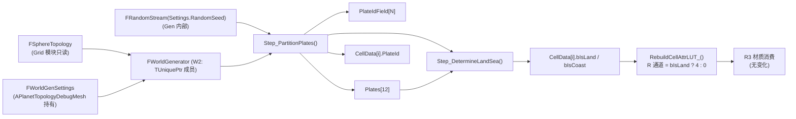

# W2：板块构造 + 海陆分离（Source/WorldGen 第一条真实流水线）

> **状态**：✅ **已验收（2026-06）**——用户在 PIE 中确认 Output Log 命中 `[WorldGen] W2 OK, 642 cells, 12 plates, ...`、12 板块色斑近似均等无飞地、海陆轮廓清晰、R7 视觉零回归；W2 阶段全部 12 项验收清单 ✅ 通过。本稿**封档为参考**，作为 W3+ 的"WorldGen 流水线 cpp 模板"基线（Generator 提升为 TUniquePtr 成员、DebugView 切换、LUT 写入分支等）。
>
> **本文档定位**：W2 阶段的独立详细设计稿——把 W1 留下的两个空函数 `Step_PartitionPlates()` / `Step_DetermineLandSea()` 真实化，并把 R3 LUT 从 Knuth 哈希切换为 `LayerIndex = bIsLand ? 4 : 0` 的两色（草地/海洋）渲染。
>
> 阅读对象：实现 W2 的 AI Agent 或人工开发者。
>
> 关联：
> - 主稿：[WorldGenDesign.md](WorldGenDesign.md)（§2.1 板块构造理论 / §5.1+§5.3 Step 简介 / §7.1~§7.3 算法详解 / §11 Roadmap / §13.3 cpp 骨架）
> - 上一阶段：[W1_ModuleSkeleton.md](W1_ModuleSkeleton.md)（已验收，提供 `FWorldGenerator` 骨架 + `FCellGeoData/FPlateInfo` USTRUCT + 空 step 函数）
> - 拓扑契约：[SphereTopologyReference.md](SphereTopologyReference.md)（§3.2 `FCell` / §3.3 `FCellEdge` / §8.1 WorldGen 写入清单 / §11 顶点法线约定）
> - 渲染衔接：[SphericalSDFTerrainDesign.md](SphericalSDFTerrainDesign.md) §4.1 / §14.1（CellAttrLUT 字段表）+ [R3_CellAttrLUTMaterial.md](R3_CellAttrLUTMaterial.md)（LUT 写入函数 `RebuildCellAttrLUT_()`）
> - 工作流：[AgentWorkflow.md](AgentWorkflow.md)（§1.3 单期详稿固定 8 章 + 附录结构 / §3.3 Pre-flight Sanity Check / §3.5 LUT R 通道写入纪律）

---

## 0. W2 一句话目标

**实现 `Step_PartitionPlates()`（球面 Lloyd 松弛 + 多源 BFS Voronoi + 板块漂移向量随机）与 `Step_DetermineLandSea()`（按 SeaLevel 二分 + 海岸 1-ring 标记）；为每 Cell 写入 `PlateId / bIsLand / bIsCoast`；把 `RebuildCellAttrLUT_()` 从 Knuth 哈希切换为 `LayerIndex = bIsLand ? 4 : 0`，球面看到 12 板块色块（debug 染色模式可切换）+ 海陆轮廓清晰（草地/海洋两色）。**

### 0.1 状态对比矩阵

| 项 | W1（当前已验收） | W2（目标） |
| --- | --- | --- |
| `Step_PartitionPlates()` | ✅ 空函数（仅签名 + `// W2 实现` 注释） | ✅ 完整实现：球面 Lloyd 5 次 + 多源 BFS + 漂移向量随机 |
| `Step_DetermineLandSea()` | ✅ 空函数 | ✅ 完整实现：`bIsLand = Elevation > SeaLevel`（W2 阶段 Elevation 由板块基础值给出，无 fbm）+ `bIsCoast = bIsLand && (∃邻居 !bIsLand)` |
| `FWorldGenerator::Plates` | 空 TArray | 12 项 `FPlateInfo`（PlateId / SeedCellId / DriftAxis / DriftSpeed / bIsOceanic / BaseElevation） |
| `FWorldGenerator::PlateIdField` | `SetNumZeroed(N)` 后保持 0 | 每 cell 写实际板块 ID ∈ [0, PlateCount) |
| `FCellGeoData[i].PlateId / bIsLand / bIsCoast` | 默认值（INDEX_NONE / true / false） | 实际值（PlateId 来自 BFS、bIsLand 来自 SeaLevel 二分、bIsCoast 1-ring 扫描） |
| `Rebuild()` 中的 `FWorldGenerator` 生命周期 | 局部变量、调用即销毁 | 提升为 `TUniquePtr<FWorldGenerator> Generator;` 成员；`Rebuild()` 重建一次 |
| `RebuildCellAttrLUT_()` 写入逻辑 | Knuth 哈希 placeholder（R3 阶段保留） | 改为 `LayerIndex = bIsLand ? 4 : 0`（4=`T_Grass_1` 草地、0=`T_MarbleAquaBlue` 海洋深） |
| Debug 视图（板块染色） | ❌ 无 | ✅ `EWorldGenDebugView::PlateId` 模式（GridRender 端按 `PlateId % 12` Knuth 哈希着色） |
| 验收日志 | `[WorldGen] Skeleton OK, 642 cells, no-op generate` | `[WorldGen] W2 OK, 642 cells, 12 plates, %d land / %d ocean (%.0f%%), %d coast` |

### 0.2 W2 不做什么（明确边界）

- ❌ 不实现 Step2 高程场（板块基础 Elevation 仅给一个常量；fbm 噪声留 W3）
- ❌ 不实现 Step4/5/6/7/8（湿度/温度/Whittaker/河流/基地一律保持 W1 空函数）
- ❌ 不写 `FCellEdge::bIsPlateBoundary` / `BoundaryStrength`（W3 计算高程时才需要这两个字段；W2 阶段板块边界仅由"两侧 PlateId 不同"动态判别即可）
- ❌ 不引入 `UTerrainDefinition` / `UBiomeTable` DataAsset（W7 才启用）
- ❌ 不动 R4/R5/R6/R7 任何 HLSL 代码或材质参数（仅改 R3 `RebuildCellAttrLUT_()` 一行写入逻辑）
- ❌ 不改 `FWorldGenSettings` 任何字段（W1 已把 W2 需要的参数 `PlateCount / OceanicPlateRatio / PlateBoundaryThreshold / SeaLevel` 全部就位）

---

## 目录

- [1. 设计依据](#1-设计依据)
- [2. 数据流与所有权](#2-数据流与所有权)
- [3. 算法详解](#3-算法详解)
  - [3.1 球面 Lloyd 松弛（Step1.a）](#31-球面-lloyd-松弛step1a)
  - [3.2 多源 BFS Voronoi 扩张（Step1.b）](#32-多源-bfs-voronoi-扩张step1b)
  - [3.3 板块漂移向量与海洋/大陆类型（Step1.c）](#33-板块漂移向量与海洋大陆类型step1c)
  - [3.4 板块基础高程 + 海陆判定（Step3）](#34-板块基础高程--海陆判定step3)
  - [3.5 海岸 1-ring 标记](#35-海岸-1-ring-标记)
- [4. 实施步骤（cpp 落地清单）](#4-实施步骤cpp-落地清单)
- [5. 验收清单](#5-验收清单)
- [6. 排错表](#6-排错表)
- [7. 路径预告与衔接](#7-路径预告与衔接)
- [附录 A：可粘贴 cpp 全文](#附录-a可粘贴-cpp-全文)

---

## 1. 设计依据

W2 涉及的设计决策**全部锁定在主稿**，本稿仅做 cpp 落地。三条关键依据：

| 决策点 | 锁定位置 | 本稿如何遵守 |
| --- | --- | --- |
| 板块数 = 12，海洋板块比例 = 0.6，边界阈值 τ = 0.1 | [WorldGenDesign.md §0 / §4.1](WorldGenDesign.md) `FWorldGenSettings::PlateCount/OceanicPlateRatio/PlateBoundaryThreshold` 默认值 | 直接读 `Settings.PlateCount` 等；不在 cpp 里硬编码 |
| 球面 Lloyd 松弛 5 次 + 多源 BFS（不带权） | [WorldGenDesign.md §7.1 / §7.2](WorldGenDesign.md) | §3.1 / §3.2 严格按主稿伪代码 cpp 化 |
| `bIsLand = Elevation > SeaLevel`，`bIsCoast = bIsLand && (∃ 邻居 !bIsLand)` | [WorldGenDesign.md §5.3](WorldGenDesign.md) | §3.4 / §3.5 一行 cpp 落地 |
| `FCellEdge` 的 `bIsPlateBoundary / BoundaryStrength` 由 W3 写入，W2 不写 | [SphereTopologyReference.md §8.1](SphereTopologyReference.md) WorldGen 写入清单 / [W1_ModuleSkeleton.md §7.4](W1_ModuleSkeleton.md) | §2 数据流明确不写；§7 路径预告说明 W3 才写 |
| LUT R 通道在 W4 之前不能写 19-Layer 真实索引——W2 期间用 `bIsLand ? 4 : 0` 占位 | [WorldGenDesign.md §11 W2 行](WorldGenDesign.md) Roadmap | §4 步骤④明确仅改 `RebuildCellAttrLUT_()` 一行 |
| 顶点法线 / Triplanar / 材质契约 | [AgentWorkflow.md §3.6](AgentWorkflow.md) UE5 CCW + 法线指向球心 | W2 不动 mesh，**继承 R7 通过 `KismetTangents` 自动法线 + 单位球心反向的最终方案**；不要在 W2 误改法线 |

> **跨期同构性**：W2 输出的 `PlateId / bIsLand / bIsCoast` 是 R3/R8/R11~R13 任何渲染路径都会消费的同一份 `FCellGeoData`——LUT 形态不变。W2 仅替换 LUT 写入函数内的取值表达式。

---

## 2. 数据流与所有权



### 2.1 W2 写入字段清单（与 W1 §7.4、SphereTopologyReference §8.1 对齐）

| 字段所属 | 字段 | W2 行为 |
| --- | --- | --- |
| `FCellGeoData[i]` | `PlateId` | ✅ 写入（Step1.b 输出） |
| `FCellGeoData[i]` | `bIsLand` | ✅ 写入（Step3 输出） |
| `FCellGeoData[i]` | `bIsCoast` | ✅ 写入（Step3 输出） |
| `FCellGeoData[i]` | `Elevation` | ⚠ **临时**写入（板块基础值，W3 真实化后会被覆盖；此举仅为让 Step3 的 `Elevation > SeaLevel` 比较有意义） |
| `FCellGeoData[i]` | `bIsMountain / bIsRiver / TerrainTag / Resources / BaseFactionId` | ❌ W2 不写（W3/W5/W4/W6） |
| `FPlateInfo[p]` | 全 6 字段 | ✅ 写入（Step1.a + Step1.c 输出） |
| `FCellEdge[e]` | `bIsPlateBoundary / BoundaryStrength` | ❌ **W2 不写**（W3 计算高程抬升时才写） |
| `FCell.* / FCorner.* / FRenderTri.*` | — | ❌ 严格只读 |

> **关键不变量**：W2 不在 `FCellEdge` 上做任何持久化标记；W3 启动时才会基于 W2 写入的 `PlateIdField` 一次性扫描 `Topology->Edges` 写入 `bIsPlateBoundary`。这避免了 W2/W3 间的"半填充态"。

### 2.2 内部缓冲生命周期

| 缓冲 | 生命周期 | 备注 |
| --- | --- | --- |
| `Plates: TArray<FPlateInfo>` | `Generate()` 内填充，作为 `FWorldGenerator` 成员保留 | W3 计算板块边界时读取漂移向量 |
| `PlateIdField: TArray<int32>` | `Generate()` 内填充，作为 `FWorldGenerator` 成员保留 | W3 扫描 `FCellEdge` 时读取两侧 PlateId |
| `Lloyd 内部的 Voronoi 分区数组` | Step1.a 内每次迭代重建，迭代结束后释放 | 不暴露 |
| `BFS 队列 + Visited 数组` | Step1.b 内本地变量 | 不暴露 |

### 2.3 `Generate()` 调用序与 W1 的差异

```cpp
void FWorldGenerator::Generate()
{
    // ... W1 已有部分（CellData.SetNum + CellId/bIsPentagon copy + Rng.Initialize） ...

    Step_PartitionPlates();        // W2 ✅ 真实化
    // Step_ComputeElevation();    // W3 - W2 阶段先写"板块基础 Elevation"到 ElevationField，详见 §3.4
    Step_DetermineLandSea();       // W2 ✅ 真实化
    Step_SimulateMoisture();       // W3 - 保持空体
    Step_ComputeTemperature();     // W3 - 保持空体
    Step_ClassifyBiomes();         // W4 - 保持空体
    Step_TraceRivers();            // W5 - 保持空体
    Step_AssignBaseCells();        // W6 - 保持空体

    UE_LOG(LogWorldGen, Log,
        TEXT("[WorldGen] W2 OK, %d cells, %d plates, %d land / %d ocean (%.0f%%), %d coast"),
        N, Plates.Num(), LandCount, N - LandCount, 100.0f * LandCount / N, CoastCount);
}
```

> ⚠ **W2 阶段把"板块基础 Elevation"暂时塞进 `ElevationField`**（不调 `Step_ComputeElevation`）：每板块一个常量，海洋板块取 `-0.3`、大陆板块取 `+0.2`；`Step_DetermineLandSea` 直接用此值与 `SeaLevel = 0.0` 比较。W3 启动时 `Step_ComputeElevation()` 会**完全覆写** `ElevationField`，此处的临时值不会污染 W3。

---

## 3. 算法详解

### 3.1 球面 Lloyd 松弛（Step1.a）

按 [WorldGenDesign.md §7.1](WorldGenDesign.md#71-球面-lloyd-松弛板块种子均匀化) 的伪代码 cpp 化。**关键正确性约束**：

- 种子初始化用 `Rng.FRandRange(-1, 1)` 三连后 `GetSafeNormal()`——直接 unit Gaussian 抽样的等价快速法（cube-to-sphere rejection 替代方案过严会浪费 RNG）
- 跳过零向量：若三连后 `Length() < 1e-4`，**重抽**（极少触发，但保证不出现退化种子）
- Lloyd 迭代次数：`K = 5`（主稿 §7.1 推荐）；不暴露为参数（避免 W2 期间用户调参导致世界不可重现）
- 质心计算：把当前 Voronoi 区内**所有 cell 的 UnitCenter 累加**后 `GetSafeNormal()`；空区（罕见）则保持原种子不动

```cpp
TArray<FVector> SeedDirs;
SeedDirs.Reserve(Settings.PlateCount);
for (int32 p = 0; p < Settings.PlateCount; ++p)
{
    FVector v;
    do
    {
        v = FVector(Rng.FRandRange(-1.0f, 1.0f),
                    Rng.FRandRange(-1.0f, 1.0f),
                    Rng.FRandRange(-1.0f, 1.0f));
    } while (v.SizeSquared() < 1e-8f);
    SeedDirs.Add(v.GetSafeNormal());
}

constexpr int32 LloydIters = 5;
TArray<int32> NearestSeed;  NearestSeed.SetNumUninitialized(N);
for (int32 Iter = 0; Iter < LloydIters; ++Iter)
{
    // a) 每 cell 找最近种子（球面 dot 最大）
    for (int32 i = 0; i < N; ++i)
    {
        const FVector& C = Topology->Cells[i].UnitCenter;
        int32 BestP = 0; float BestDot = -2.0f;
        for (int32 p = 0; p < SeedDirs.Num(); ++p)
        {
            const float D = FVector::DotProduct(C, SeedDirs[p]);
            if (D > BestDot) { BestDot = D; BestP = p; }
        }
        NearestSeed[i] = BestP;
    }
    // b) 区内质心 → 移种子
    TArray<FVector> NewSeeds; NewSeeds.SetNumZeroed(SeedDirs.Num());
    for (int32 i = 0; i < N; ++i)
    {
        NewSeeds[NearestSeed[i]] += Topology->Cells[i].UnitCenter;
    }
    for (int32 p = 0; p < SeedDirs.Num(); ++p)
    {
        if (NewSeeds[p].SizeSquared() > 1e-8f)
        {
            SeedDirs[p] = NewSeeds[p].GetSafeNormal();
        }
        // 否则保持原种子（空区保护）
    }
}
```

**复杂度**：`O(K × N × P)`，sub=3 时 `5 × 642 × 12 ≈ 38k` 点积 → < 1 ms。

### 3.2 多源 BFS Voronoi 扩张（Step1.b）

> ⚠ **设计决策**：本稿 W2 阶段的板块归属**直接复用 Lloyd 末轮的 `NearestSeed[]`**——它本身就是球面 Voronoi 的精确解（基于 `arccos(dot)` 距离），且 N=642/2562 规模下已经是 O(N×P) 计算，没必要再来一次"BFS 沿 hex 邻接"。
>
> 主稿 §7.2 提到的"BFS 多源扩张"是为了**与平面方案保持算法一致性的可选实现**（在 N >> P²、`Cells[i].UnitCenter` 不可用、需要严格走拓扑邻接的语境下成立）。本工程 sub=3/4 都满足"P=12 << N"，且 `UnitCenter` 始终可用，因此 §7.2 在 W2 落地时**等价于 §7.1 末轮的 `NearestSeed[]`**——产生完全相同的 PlateIdField。

```cpp
// 直接把 Lloyd 末轮 NearestSeed 当作 PlateIdField
PlateIdField = MoveTemp(NearestSeed);
for (int32 i = 0; i < N; ++i)
{
    CellData[i].PlateId = PlateIdField[i];
}
```

**飞地保护**：球面 Voronoi 在 N=642 规模下不会产生飞地（每板块平均 53 cells，远大于 hex 邻接 6）。若用户设了极端 `PlateCount`（如 32）导致小板块碎成 1~2 cells，**也允许**——视为合理的"群岛/孤峰"地貌。不做后处理合并。

**记录每板块的 SeedCellId**：取末轮 `SeedDirs[p]` 最近的 cell——

```cpp
for (int32 p = 0; p < Plates.Num(); ++p)
{
    int32 BestI = 0; float BestDot = -2.0f;
    for (int32 i = 0; i < N; ++i)
    {
        if (PlateIdField[i] != p) continue;
        const float D = FVector::DotProduct(Topology->Cells[i].UnitCenter, SeedDirs[p]);
        if (D > BestDot) { BestDot = D; BestI = i; }
    }
    Plates[p].SeedCellId = BestI;
}
```

### 3.3 板块漂移向量与海洋/大陆类型（Step1.c）

每板块需写 5 个字段：`PlateId / SeedCellId / DriftAxis / DriftSpeed / bIsOceanic`（外加 W2 引入的 `BaseElevation`，详见 §3.4）。

**漂移轴**：球面**切平面**单位向量。算法——

1. 在球面再随机取一个单位向量 `R`
2. 投影到种子点的切平面：`Tangent = R - (R · SeedDir) * SeedDir`
3. `DriftAxis = Tangent.GetSafeNormal()`（若退化则换种子重抽）

**漂移速率**：`Rng.FRandRange(0.3f, 1.0f)`——主稿 §2.1 表格"$v_i$"无固定单位，仅提供相对差用于边界类型判定。

**海洋/大陆**：按 `OceanicPlateRatio` 比例随机分配——

```cpp
TArray<int32> Indices;  // [0, 1, ..., PlateCount-1]
Indices.Reserve(Settings.PlateCount);
for (int32 p = 0; p < Settings.PlateCount; ++p) Indices.Add(p);
// Fisher-Yates 洗牌（用 Rng）
for (int32 i = Indices.Num() - 1; i > 0; --i)
{
    const int32 j = Rng.RandRange(0, i);
    Indices.Swap(i, j);
}
const int32 NumOceanic = FMath::RoundToInt(Settings.OceanicPlateRatio * Settings.PlateCount);
for (int32 k = 0; k < Indices.Num(); ++k)
{
    Plates[Indices[k]].bIsOceanic = (k < NumOceanic);
}
```

> **可重现性**：所有 RNG 调用都走 `Rng.FRandRange / Rng.RandRange`，全程基于 `Settings.RandomSeed`；同种子产生相同的板块漂移与海陆分配。

### 3.4 板块基础高程 + 海陆判定（Step3）

W2 阶段不实现完整 `Step_ComputeElevation`，但需要让 `bIsLand` 比较有意义——故采用"**板块基础高程**"占位：

```cpp
for (int32 p = 0; p < Plates.Num(); ++p)
{
    Plates[p].BaseElevation = Plates[p].bIsOceanic ? -0.3f : +0.2f;
}
for (int32 i = 0; i < N; ++i)
{
    ElevationField[i] = Plates[PlateIdField[i]].BaseElevation;
    CellData[i].Elevation = ElevationField[i];   // 临时；W3 会覆写
}
```

**海陆判定**（[WorldGenDesign.md §5.3](WorldGenDesign.md#53-step3-海陆判定)）：

```cpp
for (int32 i = 0; i < N; ++i)
{
    CellData[i].bIsLand = (ElevationField[i] > Settings.SeaLevel);
}
```

参数默认值 `SeaLevel = 0.0` 配合"海洋 -0.3 / 大陆 +0.2"，得到**陆地比例 = (1 - OceanicPlateRatio) = 40%**——满足主稿 §5.3 验收"陆地大致占 30~50%"。

> ⚠ W2 阶段陆地块按板块整块呈现（板块内部均匀），看起来会比较"几何"——这是临时观感，**W3 启动时 fbm 噪声 + 板块边界抬升会立刻打破板块=岛屿的硬边**。W2 验收时不要因此质疑算法。

### 3.5 海岸 1-ring 标记

```cpp
int32 CoastCount = 0;
for (int32 i = 0; i < N; ++i)
{
    if (!CellData[i].bIsLand) { CellData[i].bIsCoast = false; continue; }
    bool bAnyOceanNeighbor = false;
    for (const int32 NId : Topology->Cells[i].Neighbors)
    {
        if (NId != INDEX_NONE && !CellData[NId].bIsLand)
        {
            bAnyOceanNeighbor = true;
            break;
        }
    }
    CellData[i].bIsCoast = bAnyOceanNeighbor;
    if (bAnyOceanNeighbor) ++CoastCount;
}
```

> **复杂度**：O(N × 5/6) ≈ 4k 次访问，sub=3 < 0.1 ms。

> **海洋 cell 的 bIsCoast**：根据主稿 §5.3 定义，**仅陆地 cell 才标记 bIsCoast**——海洋一侧不标。这与 R8 之后的 `Coast.Beach`/`Coast.Rocky` Tag 写入语义一致（Beach 是陆地特化）。

---

## 4. 实施步骤（cpp 落地清单）

### 4.1 文件改动清单

| 文件 | 改动类型 | 内容 |
| --- | --- | --- |
| [Source/WorldGen/Public/WorldGenerator.h](../Source/WorldGen/Public/WorldGenerator.h) | 修改 | 暴露 `GetPlateIdField()` const 访问器（GridRender 端 Debug 染色用） |
| [Source/WorldGen/Private/WorldGenerator.cpp](../Source/WorldGen/Private/WorldGenerator.cpp) | 修改 | 把 `Step_PartitionPlates` / `Step_DetermineLandSea` 实体化（详见 §3 + 附录 A）；`Generate()` 末尾日志改为 `W2 OK` 行 |
| [Source/TerraCivilization/Public/Render/PlanetTopologyDebugMesh.h](../Source/TerraCivilization/Public/Render/PlanetTopologyDebugMesh.h) | 修改 | `FWorldGenerator` 局部变量 → `TUniquePtr<FWorldGenerator> Generator;` 成员；新增 `EWorldGenDebugView` 枚举 + `UPROPERTY` 切换 |
| [Source/TerraCivilization/Private/Render/PlanetTopologyDebugMesh.cpp](../Source/TerraCivilization/Private/Render/PlanetTopologyDebugMesh.cpp) | 修改 | `Rebuild()` 末尾构造 Generator 改为成员；`RebuildCellAttrLUT_()` 内 R 通道改为 `Generator->GetCellData()[i].bIsLand ? 4 : 0`（默认）/ `PlateId % 19`（Debug 模式） |

### 4.2 推荐执行顺序

1. **WorldGenerator.cpp 实现 Step1**（§3.1~§3.3）→ 编译；不必接 Mesh，先在 cpp 单元自检：`UE_LOG` 出"12 plates, sizes = [...]"
2. **WorldGenerator.cpp 实现 Step3**（§3.4~§3.5）→ 编译
3. **`Generate()` 日志切到 `W2 OK` 行**
4. **PlanetTopologyDebugMesh：`Generator` 提升为成员**——`Rebuild()` 中先 `Generator.Reset()` 再 `Generator = MakeUnique<FWorldGenerator>(...)` → 编译
5. **`RebuildCellAttrLUT_()` 切换写入逻辑**——`uint8 LayerIdx = Generator->GetCellData()[i].bIsLand ? 4 : 0;`（替换 W1 留下的 Knuth 哈希）→ 编译
6. **新增 Debug 视图枚举 + 切换** → PIE 验证（验收 §5）

### 4.3 与 R3 LUT 写入的契约

[R3_CellAttrLUTMaterial.md](R3_CellAttrLUTMaterial.md) 锁定的 RGBA 通道分配：

| 通道 | W2 阶段写入 | 用途 |
| --- | --- | --- |
| **R** | `bIsLand ? 4 : 0`（默认）/ `(uint8)(PlateId * 13 + 7) % 19`（Debug 染色） | LayerIndex（4=Grass、0=Ocean.Deep；对齐主稿 §6 19-Layer 表） |
| **G** | 0（保留 W3 写 `bIsCoast / bIsMountain` 等小标志位） | — |
| **B** | 0（保留 W5 写 `bIsRiver` 等） | — |
| **A** | 0（保留 W4 写 Decor 索引） | — |

> ⚠ **不要在 W2 把 `bIsCoast` 也写进 R 通道**——这会改变 R3 已锁的"R = LayerIndex"语义。`bIsCoast` 等到 W4 才需要影响 LayerIndex（通过 `Coast.Beach`/`Coast.Rocky` Tag），届时由 Whittaker 短路逻辑统一处理。

### 4.4 Debug 染色模式

新增枚举（W2 引入；W3/W4/W5 各自再扩展）：

```cpp
UENUM(BlueprintType)
enum class EWorldGenDebugView : uint8
{
    None        UMETA(DisplayName = "None (默认 LayerIndex)"),
    PlateId     UMETA(DisplayName = "PlateId 染色"),
    LandSea     UMETA(DisplayName = "海陆两色"),  // 与 None 等价，便于切换
};
```

`APlanetTopologyDebugMesh` 加 `UPROPERTY(EditAnywhere, Category = "WorldGen|Debug") EWorldGenDebugView DebugView = EWorldGenDebugView::None;`，`RebuildCellAttrLUT_()` 内按枚举分支写 R 通道。

> **设计选择**：不引入"独立 Debug LUT"——直接复用 `CellAttrLUT.R`，避免 GPU 端材质改动。代价是切换 Debug 视图必须重跑 `RebuildCellAttrLUT_()`（< 1 ms），可接受。

---

## 5. 验收清单

> 全部 12 项必须 ✅ 才算 W2 完成。任何一项 ❌ 都不能提 W3。

| # | 项 | 验收标准 |
| --- | --- | --- |
| 1 | 编译 | 0 警 0 错；UE Editor / Visual Studio Rebuild 全项目通过 |
| 2 | 启动日志 | PIE 启动后 Output Log 命中 `[WorldGen] W2 OK, 642 cells, 12 plates, %d land / %d ocean (%.0f%%), %d coast` |
| 3 | 板块数 | 日志中 `plates = 12`（与 `Settings.PlateCount` 默认值一致） |
| 4 | 陆地比例 | 日志中 land 占比 ∈ [30%, 50%]（默认 `OceanicPlateRatio = 0.6` 期望 ≈ 40%） |
| 5 | 海岸 cell | 日志中 `coast > 0`（典型 sub=3 应为 30~80） |
| 6 | 默认视图（LayerIndex / None） | 球面呈现两色：陆地淡绿（`T_Grass_1`）+ 海洋深蓝（`T_MarbleAquaBlue`）；轮廓清晰、无 R3 Knuth 哈希的彩色斑块 |
| 7 | Debug 视图（PlateId） | 切到 `EWorldGenDebugView::PlateId` 后球面呈现 12 块色斑；色斑大小近似均等（Lloyd 松弛保证）；无飞地（板块连通） |
| 8 | 12 五边形可识别 | 默认视图下 12 五边形仍可辨（顶点法线 / Wireframe 模式可验证） |
| 9 | 同种子可重现 | 同一 `RandomSeed` 下重启 PIE 两次，板块色斑布局**像素级一致** |
| 10 | 不同种子布局变化 | 改 `RandomSeed = 1` 后板块布局明显不同（陆地比例仍稳定 ~40%） |
| 11 | R7 视觉零回归 | 切回 `EWorldGenDebugView::None` 后，**R7 的 Triplanar / 边界软边 / 噪声扰动等所有材质参数**仍生效（仅 R 通道含义从"伪随机"变成"两色"——这是 W2 的设计目标） |
| 12 | 性能 | sub=3 下 `Rebuild()` 整体耗时 < 50 ms（W1 基线 + Step1/Step3 增量 < 5 ms） |

### 5.1 临时自检（仅 Editor 编译时启用）

```cpp
#if WITH_EDITOR
{
    int32 LandCount = 0, CoastCount = 0;
    TArray<int32> PlateSizes; PlateSizes.SetNumZeroed(Settings.PlateCount);
    for (int32 i = 0; i < N; ++i)
    {
        if (CellData[i].bIsLand)  ++LandCount;
        if (CellData[i].bIsCoast) ++CoastCount;
        const int32 Pid = CellData[i].PlateId;
        if (Pid >= 0 && Pid < PlateSizes.Num()) ++PlateSizes[Pid];
    }
    UE_LOG(LogWorldGen, Log, TEXT("[WorldGen][Self-Check] Plate sizes = %s"), *FString::JoinBy(PlateSizes, TEXT(","), [](int32 V){ return FString::FromInt(V); }));
    check(LandCount + (N - LandCount) == N);
    check(CoastCount <= LandCount);
    for (int32 p = 0; p < Plates.Num(); ++p)
    {
        check(Plates[p].SeedCellId >= 0 && Plates[p].SeedCellId < N);
        check(FMath::IsNearlyEqual(Plates[p].DriftAxis.Size(), 1.0f, 1e-3f));
    }
}
#endif
```

> 验收通过后**保留**这段自检（W3/W4 还会增补）；与 W1 的"验收后删除"不同，W2 自检是后续阶段的回归基线。

---

## 6. 排错表

| # | 症状 | 根因 | 修复 |
| --- | --- | --- | --- |
| 1 | 板块色斑严重不均（个别板块占 80% cells） | Lloyd 迭代次数太少 / 种子初始抽样退化 | 检查 `LloydIters = 5`；检查初始种子退化保护 `do { } while (v.SizeSquared() < 1e-8f)` |
| 2 | 同种子两次运行板块布局不同 | 调用了非 `Rng` 的随机源（`FMath::Rand` / `std::rand`） | grep `FMath::Rand\|std::rand` 全部改为 `Rng.FRandRange` |
| 3 | 陆地比例严重偏离 40% | Plate 的 `bIsOceanic` 分配错误（如全大陆） | 检查 §3.3 的 Fisher-Yates 洗牌；`NumOceanic` 计算 |
| 4 | 海岸 cell 数量为 0 | `Topology->Cells[i].Neighbors` 拓扑契约不符（W1 改过 SphereTopology？） | 验 [SphereTopologyReference.md §3.2](SphereTopologyReference.md) `FCell::Neighbors` 是否仍 5/6 邻接；不应该被 W2 改 |
| 5 | LUT 切回 None 后看到的是 R3 Knuth 哈希彩色（不是两色） | 没把 `RebuildCellAttrLUT_()` 内 R 通道写入逻辑切到 `bIsLand ? 4 : 0` | 检查 cpp 内是否还有残留的 `Knuth_Hash_LayerIdx_Placeholder` 调用 |
| 6 | Debug 视图切到 PlateId 后球面全黑 | `PlateId * 13 + 7) % 19` 落到了 LayerIndex=未导入的 slice | 改为 `PlateId % 19`；或确认 `T_TerrainAlbedoArray` 19 slice 全部就位 |
| 7 | R7 视觉回归（边界软边 / 噪声 / Triplanar 失效） | 误改了 R4/R5/R6/R7 的材质参数注入（不应该） | grep 工程内对 `EdgeWidth / NoiseAmp / TriplanarSharpness` 等 MID 注入是否被改 |
| 8 | 整球 Lit 模式漆黑（W2 无关回归） | 误改了 [APlanetTopologyDebugMesh::Rebuild](../Source/TerraCivilization/Private/Render/PlanetTopologyDebugMesh.cpp) 法线生成；R7 已锁定用 `KismetTangents` 自动法线 | 严禁 W2 修改法线代码；详见 [AgentWorkflow.md §3.6](AgentWorkflow.md) + [SphereTopologyReference.md §11](SphereTopologyReference.md) |
| 9 | 板块色斑相邻颜色相近难分辨 | Knuth 哈希常量太小 | 改大 multiplier（`PlateId * 2654435761u >> 24`）或换 `golden_ratio_hash` |
| 10 | `Plates[p].SeedCellId` 越界 / 为 -1 | 板块 p 在末轮 NearestSeed 中无任何 cell（理论上 Lloyd 收敛后不会发生） | §3.2 加 fallback：`if (BestI < 0) BestI = 第一个匹配 PlateId == p 的 cell`；并 `UE_LOG(Warning)` |
| 11 | Generator 提升为成员后崩 | `TUniquePtr` 在 `Rebuild()` 重建时未先 Reset，导致 `MakeUnique` 时旧 Generator 仍持有 Topology 引用，如果 Topology 已重建则悬挂 | `Rebuild()` 内顺序：`Generator.Reset() → 重建 Topology → Generator = MakeUnique<FWorldGenerator>(NewTopo, Settings) → Generator->Generate()` |
| 12 | sub=3 → sub=4 后板块布局完全不同 | 板块种子抽样未使用与 sub 解耦的 RNG 序列 | §3.1 的 RNG 调用顺序与 cell 数量无关（只与 `PlateCount` 相关）；若仍变化检查是否调了 N 相关的随机分支 |

---

## 7. 路径预告与衔接

### 7.1 W2 与下游（W3）的衔接

W3 启动时的扩展点：

| W2 现状 | W3 改动 |
| --- | --- |
| `ElevationField[i] = Plates[PlateId].BaseElevation`（板块基础值） | 完全覆写：基础值 + 板块边界抬升（`FCellEdge.bIsPlateBoundary` 写入 + `BoundaryStrength`）+ fbm 噪声叠加 |
| `Step_ComputeElevation()` 空体 | 实现完整高程场（详见主稿 §5.2 / §7.3） |
| `Step_SimulateMoisture()` / `Step_ComputeTemperature()` 空体 | 实现湿度/温度场（详见主稿 §5.4 / §5.5） |
| `RebuildCellAttrLUT_()` R 通道 = `bIsLand ? 4 : 0`（两色） | **不变**（W3 仅看标量场热图，不改 LUT；W4 才正式接 19-Layer） |
| Debug 视图：None / PlateId / LandSea | 追加 `Elevation` / `Moisture` / `Temperature` 三种热图模式 |

**W3 详稿命名**：`W3_ScalarFields.md`（高程 + 湿度 + 温度三场，主稿 §11 已锁）。

### 7.2 W2 与远期 R8 的同构性

| 阶段 | SDF 渲染路径 | LUT R 通道写入逻辑 |
| --- | --- | --- |
| **W1（已验收）** | IsoSphere primal | Knuth 哈希 placeholder（R3 阶段） |
| **W2（本稿）** | IsoSphere primal | `bIsLand ? 4 : 0`（两色） |
| **W3** | IsoSphere primal | **不变**（W2 两色） |
| **W4 接 R8** | IsoSphere primal | `Def->LayerIndex`（消费 `FCellGeoData.TerrainTag`） |
| **R11~R13 PTG** | GPU FindNearestCell | 同上（消费同一份 `FCellGeoData`） |

> **关键不变量**：W2 输出的 `PlateId / bIsLand / bIsCoast` 永远以 `CellId` 为主键存储；W4 的 `Coast.Beach`/`Coast.Rocky` 短路逻辑会**消费 W2 的 `bIsCoast`**，因此 W2 的标记必须严格按主稿 §5.3 的"陆地一侧"语义。

### 7.3 与 [SphereTopologyReference.md §8.1](SphereTopologyReference.md) 契约一致

W2 严格遵守拓扑稿 WorldGen 写入清单：

| 字段 | W2 行为 |
| --- | --- |
| `FCell.* / FCorner.* / FRenderTri.* / FCellEdge.CellIds/CornerIds` | ✅ 只读 |
| `FCellEdge.bIsPlateBoundary / BoundaryStrength` | ❌ W2 不写（W3 才写） |
| 其他拓扑字段 | ❌ W2 不动 |

---

## 附录 A：可粘贴 cpp 全文

> 本附录给出 W2 落地的两个核心函数全文（在 [Source/WorldGen/Private/WorldGenerator.cpp](../Source/WorldGen/Private/WorldGenerator.cpp) 内替换 W1 的空体），以及 [PlanetTopologyDebugMesh.cpp](../Source/TerraCivilization/Private/Render/PlanetTopologyDebugMesh.cpp) `RebuildCellAttrLUT_()` 内 R 通道写入分支的关键改动。

### A.1 `FWorldGenerator::Step_PartitionPlates()`

```cpp
void FWorldGenerator::Step_PartitionPlates()
{
    SCOPE_CYCLE_COUNTER(STAT_WorldGen_Plates);  // 可选；W2 期间宏不存在则注释

    const int32 N = Topology->Cells.Num();
    Plates.SetNum(Settings.PlateCount);
    PlateIdField.SetNumUninitialized(N);

    // ────── 1. 初始种子（unit Gaussian 等价快速法）──────
    TArray<FVector> SeedDirs;
    SeedDirs.Reserve(Settings.PlateCount);
    for (int32 p = 0; p < Settings.PlateCount; ++p)
    {
        FVector v;
        do
        {
            v = FVector(Rng.FRandRange(-1.0f, 1.0f),
                        Rng.FRandRange(-1.0f, 1.0f),
                        Rng.FRandRange(-1.0f, 1.0f));
        } while (v.SizeSquared() < 1e-8f);
        SeedDirs.Add(v.GetSafeNormal());
    }

    // ────── 2. 球面 Lloyd 松弛 ──────
    constexpr int32 LloydIters = 5;
    TArray<int32> NearestSeed;  NearestSeed.SetNumUninitialized(N);
    TArray<FVector> NewSeeds;
    for (int32 Iter = 0; Iter < LloydIters; ++Iter)
    {
        for (int32 i = 0; i < N; ++i)
        {
            const FVector& C = Topology->Cells[i].UnitCenter;
            int32 BestP = 0; float BestDot = -2.0f;
            for (int32 p = 0; p < SeedDirs.Num(); ++p)
            {
                const float D = FVector::DotProduct(C, SeedDirs[p]);
                if (D > BestDot) { BestDot = D; BestP = p; }
            }
            NearestSeed[i] = BestP;
        }
        NewSeeds.Reset(); NewSeeds.SetNumZeroed(SeedDirs.Num());
        for (int32 i = 0; i < N; ++i)
        {
            NewSeeds[NearestSeed[i]] += Topology->Cells[i].UnitCenter;
        }
        for (int32 p = 0; p < SeedDirs.Num(); ++p)
        {
            if (NewSeeds[p].SizeSquared() > 1e-8f)
            {
                SeedDirs[p] = NewSeeds[p].GetSafeNormal();
            }
        }
    }

    // ────── 3. PlateIdField = Lloyd 末轮 NearestSeed ──────
    PlateIdField = MoveTemp(NearestSeed);
    for (int32 i = 0; i < N; ++i)
    {
        CellData[i].PlateId = PlateIdField[i];
    }

    // ────── 4. 板块漂移向量 + 海洋/大陆类型 + 基础高程 ──────
    // 4.a 海洋/大陆 Fisher-Yates 洗牌
    TArray<int32> Indices;
    Indices.Reserve(Settings.PlateCount);
    for (int32 p = 0; p < Settings.PlateCount; ++p) Indices.Add(p);
    for (int32 i = Indices.Num() - 1; i > 0; --i)
    {
        const int32 j = Rng.RandRange(0, i);
        Indices.Swap(i, j);
    }
    const int32 NumOceanic = FMath::RoundToInt(Settings.OceanicPlateRatio * Settings.PlateCount);

    // 4.b 每板块填字段
    for (int32 p = 0; p < Plates.Num(); ++p)
    {
        Plates[p].PlateId = p;

        // SeedCellId：取最接近 SeedDirs[p] 的 cell
        int32 BestI = INDEX_NONE; float BestDot = -2.0f;
        for (int32 i = 0; i < N; ++i)
        {
            if (PlateIdField[i] != p) continue;
            const float D = FVector::DotProduct(Topology->Cells[i].UnitCenter, SeedDirs[p]);
            if (D > BestDot) { BestDot = D; BestI = i; }
        }
        if (BestI == INDEX_NONE)
        {
            UE_LOG(LogWorldGen, Warning, TEXT("[WorldGen] Plate %d has no cells (degenerate); falling back to seed cell 0"), p);
            BestI = 0;
        }
        Plates[p].SeedCellId = BestI;

        // DriftAxis：球面切平面单位向量
        FVector R;
        do
        {
            R = FVector(Rng.FRandRange(-1.0f, 1.0f),
                        Rng.FRandRange(-1.0f, 1.0f),
                        Rng.FRandRange(-1.0f, 1.0f));
        } while (R.SizeSquared() < 1e-8f);
        R = R.GetSafeNormal();
        const FVector& SeedDir = SeedDirs[p];
        FVector Tangent = R - FVector::DotProduct(R, SeedDir) * SeedDir;
        if (Tangent.SizeSquared() < 1e-6f)
        {
            // R 与 SeedDir 共线；用任意正交基重抽
            Tangent = FVector::CrossProduct(SeedDir, FVector::UpVector);
            if (Tangent.SizeSquared() < 1e-6f)
            {
                Tangent = FVector::CrossProduct(SeedDir, FVector::ForwardVector);
            }
        }
        Plates[p].DriftAxis = Tangent.GetSafeNormal();

        Plates[p].DriftSpeed = Rng.FRandRange(0.3f, 1.0f);
    }
    for (int32 k = 0; k < Indices.Num(); ++k)
    {
        Plates[Indices[k]].bIsOceanic = (k < NumOceanic);
        Plates[Indices[k]].BaseElevation = (k < NumOceanic) ? -0.3f : +0.2f;
    }

    // 4.c 把板块基础高程写到 ElevationField（W3 会覆写）
    for (int32 i = 0; i < N; ++i)
    {
        ElevationField[i] = Plates[PlateIdField[i]].BaseElevation;
        CellData[i].Elevation = ElevationField[i];
    }
}
```

### A.2 `FWorldGenerator::Step_DetermineLandSea()`

```cpp
void FWorldGenerator::Step_DetermineLandSea()
{
    const int32 N = Topology->Cells.Num();

    // 1. bIsLand = Elevation > SeaLevel
    int32 LandCount = 0;
    for (int32 i = 0; i < N; ++i)
    {
        const bool bLand = (ElevationField[i] > Settings.SeaLevel);
        CellData[i].bIsLand = bLand;
        if (bLand) ++LandCount;
    }

    // 2. bIsCoast = bIsLand && (∃ 邻居 !bIsLand)
    int32 CoastCount = 0;
    for (int32 i = 0; i < N; ++i)
    {
        if (!CellData[i].bIsLand) { CellData[i].bIsCoast = false; continue; }
        bool bAnyOceanNeighbor = false;
        for (const int32 NId : Topology->Cells[i].Neighbors)
        {
            if (NId != INDEX_NONE && !CellData[NId].bIsLand)
            {
                bAnyOceanNeighbor = true;
                break;
            }
        }
        CellData[i].bIsCoast = bAnyOceanNeighbor;
        if (bAnyOceanNeighbor) ++CoastCount;
    }

    // 3. 自检（仅 Editor）
#if WITH_EDITOR
    check(LandCount >= 0 && LandCount <= N);
    check(CoastCount <= LandCount);
#endif

    // 把数据带回 Generate() 用于日志（缓存为成员或返回值；此处用成员缓存）
    LastLandCount  = LandCount;
    LastCoastCount = CoastCount;
}
```

> ⚠ `LastLandCount / LastCoastCount` 是 W2 引入的 `FWorldGenerator` 私有成员，仅用于 `Generate()` 末尾日志。

### A.3 `RebuildCellAttrLUT_()` 内 R 通道改动（PlanetTopologyDebugMesh.cpp）

```cpp
// W1 旧：R = Knuth_Hash_Placeholder(i)
// W2 新：按 DebugView 切换
const TArray<FCellGeoData>& Cells = Generator->GetCellData();
for (int32 i = 0; i < N; ++i)
{
    uint8 LayerIdx = 0;
    switch (DebugView)
    {
        case EWorldGenDebugView::PlateId:
        {
            const int32 Pid = Cells[i].PlateId;
            // 把 PlateId 映射到 19 个 layer slice 之一（用 Knuth 黄金比哈希展开相邻色差）
            LayerIdx = (uint8)((static_cast<uint32>(Pid) * 2654435761u >> 24) % 19);
            break;
        }
        case EWorldGenDebugView::None:
        case EWorldGenDebugView::LandSea:
        default:
            LayerIdx = Cells[i].bIsLand ? 4 : 0;  // 4 = T_Grass_1, 0 = T_MarbleAquaBlue
            break;
    }
    LUTPixels[i] = FColor(LayerIdx, 0, 0, 0);
}
```

> **R3 通道契约**：与 [R3_CellAttrLUTMaterial.md](R3_CellAttrLUTMaterial.md) 锁定的"R = LayerIndex (uint8)"完全一致；G/B/A 通道保留为 0，等待 W3/W4/W5 启用。

---

> **完成 W2 后**：进入 [W3_ScalarFields.md](W3_ScalarFields.md) 详稿（高程 + 湿度 + 温度三场），届时 `Step_ComputeElevation / Step_SimulateMoisture / Step_ComputeTemperature` 三个空函数被实体化，并写入 `FCellEdge::bIsPlateBoundary / BoundaryStrength`。
