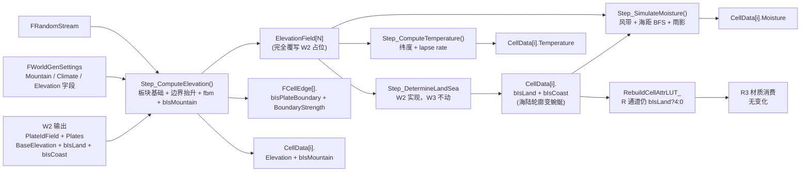

# W3：高程场 + 温湿度场（WorldGen 三标量场流水线）

> **状态**：📝 **设计期（2026-06）**——W2 已验收（[W2_PlatesAndLandSea.md](W2_PlatesAndLandSea.md) §0 状态徽章）；本稿落实 W3 三个标量场的设计，cpp 落地待用户启动。
>
> **本文档定位**：W3 阶段的独立详细设计稿——把 W1 留下的三个空函数 `Step_ComputeElevation()` / `Step_SimulateMoisture()` / `Step_ComputeTemperature()` 真实化，并写入 `FCellEdge.bIsPlateBoundary` + `BoundaryStrength`；扩展 Debug 视图增加 4 种标量场热图。
>
> 阅读对象：实现 W3 的 AI Agent 或人工开发者。
>
> 关联：
> - 主稿：[WorldGenDesign.md](WorldGenDesign.md)（§2.1 板块边界类型 / §5.2+§5.4+§5.5 三 Step 简介 / §7.3 边界判定 cpp 骨架 / §7.4 FastNoiseLite 包装 / §11 Roadmap）
> - 上一阶段：[W2_PlatesAndLandSea.md](W2_PlatesAndLandSea.md)（已验收，提供 `PlateIdField` + `Plates` + 板块基础 `BaseElevation` + 海陆判定）
> - 拓扑契约：[SphereTopologyReference.md §3](SphereTopologyReference.md)（`FCell.NeighborCellIds` / `FCellEdge.CellIds[2]` / `bIsPlateBoundary` / `BoundaryStrength` 真实字段名）
> - 渲染衔接：[R3_CellAttrLUTMaterial.md](R3_CellAttrLUTMaterial.md) §3 LUT 写入函数（W3 不改 R 通道写入逻辑——仍 `bIsLand?4:0`，本稿 §4.4 显式说明）
> - 工作流：[AgentWorkflow.md](AgentWorkflow.md)（§1.3 单期详稿固定 8 章 + 附录结构 / §1.4.0 字段名以源码为准 / §3.6 法线契约 / §5 调试方法论）
> - 噪声依赖：[FastNoiseLite.h](../Plugins/ProceduralTerrainGenerator/Source/ThirdParty/FastNoiseLite/Public/FastNoiseLite.h)（`class FastNoiseLite::GetNoise(x,y,z)` + `SetSeed/SetFrequency/SetFractalOctaves`，详见 §3.1.4）

---

## 0. W3 一句话目标

**实现 `Step_ComputeElevation()`（板块基础 Elevation + 边界 $\Delta v_n$ 抬升/俯冲 + fbm 噪声 + `bIsMountain` 阈值 + 写 `FCellEdge.bIsPlateBoundary / BoundaryStrength`）、`Step_SimulateMoisture()`（纬度风带基础 + 海距 BFS 衰减 + 雨影 lapse）、`Step_ComputeTemperature()`（纬度基础 + 高程 lapse rate）；为每 Cell 写入 `Elevation / Moisture / Temperature / bIsMountain`；扩展 `EWorldGenDebugView` 增加 `Elevation / Moisture / Temperature / Mountain` 四种热图视图；LUT R 通道写入逻辑保持 W2 不变（仍 `bIsLand ? 4 : 0`），R7 视觉零回归。**

### 0.1 状态对比矩阵

| 项 | W2（当前已验收） | W3（目标） |
| --- | --- | --- |
| `Step_ComputeElevation()` | ✅ 空函数（W2 已在 `Step_PartitionPlates` 末尾把板块 `BaseElevation` 写到 `ElevationField` 作为占位） | ✅ 完整实现：板块基础值 + 边界抬升 + fbm 噪声 → 完全覆写 `ElevationField` |
| `Step_SimulateMoisture()` | ✅ 空函数 | ✅ 完整实现：纬度风带 + 海距 BFS 衰减 + 山脉雨影 → 写 `MoistureField` |
| `Step_ComputeTemperature()` | ✅ 空函数 | ✅ 完整实现：`(1 - 2|UnitCenter.z|) + Bias - max(0, Elev-SeaLevel) * Lapse` → 写 `TemperatureField` |
| `FCellEdge.bIsPlateBoundary / BoundaryStrength` | 默认值（false / 0） | 实际值（板块边界扫描后写入；详见 §3.1.2） |
| `FCellGeoData[i].Elevation` | 板块基础常量（`-0.3` 海洋 / `+0.2` 大陆） | 实际值（基础 + 边界抬升 + fbm，clamp 到 [-1, 1]） |
| `FCellGeoData[i].Moisture` | 默认 0.5 | 实际值 ∈ [0, 1]（湿度场） |
| `FCellGeoData[i].Temperature` | 默认 0 | 实际值 ∈ [-1, 1]（温度场） |
| `FCellGeoData[i].bIsMountain` | 默认 false | `Elevation > Settings.MountainThreshold` |
| `Step_DetermineLandSea()` 输入语义 | 接消费板块基础 Elevation（板块整块=岛屿） | 接消费 fbm 高程（**海陆轮廓变蜿蜒**——用户验收点）|
| `EWorldGenDebugView` | None / PlateId / LandSea | + Elevation / Moisture / Temperature / Mountain（4 种热图）|
| `RebuildCellAttrLUT_()` R 通道写入 | None/LandSea: `bIsLand?4:0`；PlateId: 板块哈希 | **不变**（None/LandSea 仍 `bIsLand?4:0`）；新增 4 种 DebugView 走 GBA 通道渐变 fallback |
| `WorldGen.Build.cs` 依赖 | `Core / CoreUObject / Engine / GameplayTags / Grid` | + `FastNoiseLite`（噪声采样） |
| 验收日志 | `[WorldGen] W2 OK, 642 cells, 12 plates, %d land, %d coast` | `[WorldGen] W3 OK, 642 cells, 12 plates, %d land, %d coast, %d mountain (Elev∈[%.2f,%.2f], Moist∈[%.2f,%.2f], Temp∈[%.2f,%.2f])` |

### 0.2 W3 不做什么（明确边界）

- ❌ 不实现 Step6 Whittaker 生物群系分类（W4）；不写 `TerrainTag / Resources`
- ❌ 不实现 Step7/8（河流/基地）
- ❌ 不动 R3/R4/R5/R6/R7 任何 HLSL 代码或材质参数；W3 仅扩展 cpp 端 cpp 端 Debug 写入逻辑
- ❌ 不引入 `UTerrainDefinition` / `UBiomeTable` DataAsset（W7）
- ⚠ **W3.5 修订（2026-06-28）打破 W1 锁定**：原计划不修改 `FWorldGenSettings`，但 PIE 实测发现原 "各向同性海距 BFS + 独立雨影" 方案在 sub=3 几何下**湿度落差不平缓、无东西岸梯度**（根因：典型大陆距海岸≤7 跳，0.05 衰减表则陆地湿度集中于 [0.7, 1.0]）。修订后：**新增** `AlphaElevation`（4.0）、`AlphaCoast`（0.5）；**调整默认值**：`MoistureCoastalFalloff: 0.05 → 0.15`；**废弃** `RainShadowFactor`（保留字段不读）。完整交接发生于 §3.2 / §4.0。
- ❌ 不修改 `FWorldGenSettings` 其他原字段（W1 已把 `MountainThreshold / MountainBoundaryStrength / ElevationNoiseAmplitude / ElevationNoiseFrequency / MoistureScale / TemperatureBias / TemperatureLapseRate` 全部预留就位；MoistureCoastalFalloff 字段不变仅默认值调整、RainShadowFactor 废弃但字段保留）
- ❌ 不修改 `FCellGeoData` 字段（`Elevation / Moisture / Temperature / bIsMountain` 已就位）
- ❌ 不实现纬度风带（信风/西风/极地东风三段离散）：W3.5 采用**全球单一东风**简化模型，极区 `\|East\|<ε` 退化为各向同性；W4 Whittaker 验收中若“全干冷”/“全湿冷”违和明显再考虑加纬度风带

---

## 目录

- [1. 设计依据](#1-设计依据)
- [2. 数据流与所有权](#2-数据流与所有权)
- [3. 算法详解](#3-算法详解)
  - [3.1 Step2 高程场](#31-step2-高程场)
  - [3.2 Step4 湿度场](#32-step4-湿度场)
  - [3.3 Step5 温度场](#33-step5-温度场)
- [4. 实施步骤（cpp 落地清单）](#4-实施步骤cpp-落地清单)
  - [4.5 W3 调试材质（M_TopologyDebug_W3）](#45-w3-调试材质mtopologydebugw3)
- [5. 验收清单](#5-验收清单)
- [6. 排错表](#6-排错表)
- [7. 路径预告与衔接](#7-路径预告与衔接)
- [附录 A：可粘贴 cpp 全文](#附录-a可粘贴-cpp-全文)

---

## 1. 设计依据

W3 涉及的设计决策**全部锁定在主稿**，本稿仅做 cpp 落地。关键依据：

| 决策点 | 锁定位置 | 本稿如何遵守 |
| --- | --- | --- |
| 板块边界类型公式 $\Delta v_n = (\hat{a}_a v_a - \hat{a}_b v_b) \cdot \hat{n}_{AB}$ | [WorldGenDesign.md §2.1](WorldGenDesign.md) / §7.3 | §3.1.2 严格按主稿伪代码 cpp 化 |
| `MountainThreshold` 默认 0.5、`MountainBoundaryStrength` 默认 1.0、`SeaLevel` 默认 0.0 | [WorldGenSettings.h L48-58](../Source/WorldGen/Public/WorldGenSettings.h) UPROPERTY 默认值 | 直接读 `Settings.*`；不在 cpp 里硬编码 |
| fbm 用 `FastNoiseLite::GetNoise(x,y,z)` + `SetFractalOctaves(4)` | [FastNoiseLite.h](../Plugins/ProceduralTerrainGenerator/Source/ThirdParty/FastNoiseLite/Public/FastNoiseLite.h) | §3.1.4 给出包装类 `FWorldGenNoise`；`WorldGen.Build.cs` 加 `FastNoiseLite` 依赖 |
| **上风向 SSSP（东风模型 + 高程加权边权，¶2026-06 修订）**：从所有海岸 `bIsCoast` cell 多源出发，只向下风（西侧）邻居传播；边权 = `1 + AlphaElevation * max(0, Elev-SeaLevel) - AlphaCoast * (cur.bIsCoast?1:0)`（下限 0.1）；极区 `\|East\|<ε` 退化各向同性；湿度 = `MoistureScale * exp(-MoistureCoastalFalloff * AccumDist)` | [WorldGenDesign.md §5.4](WorldGenDesign.md) + 本稿 §3.2 | §3.2.2~3.2.4 SSSP 多轮松弛实现；**雨影自然内嵌**（高地边权更高 → 西侧更干）——不再需要独立雨影段 |
| 温度公式 `(1 - 2|UnitCenter.z|) + Bias - max(0, Elev - SeaLevel) * Lapse`，clamp 到 [-1, 1] | [WorldGenDesign.md §5.5](WorldGenDesign.md) | §3.3 一行 cpp 落地 |
| `FCellEdge` 的 `bIsPlateBoundary / BoundaryStrength` 由 W3 写入 | [SphereTopologyReference.md §8.1](SphereTopologyReference.md) WorldGen 写入清单 | §2 数据流明确写入；§7 路径预告说明 R8 不改边字段 |
| 顶点法线 / Triplanar / 材质契约 | [AgentWorkflow.md §3.6](AgentWorkflow.md) UE5 CCW + 法线指向球心 | W3 不动 mesh 法线；继承 W2/R7 的 `KismetTangents` 自动法线 |
| 字段名以源码为准 | [AgentWorkflow.md §1.4.0](AgentWorkflow.md) W2 沉淀的反模式 | §3 / 附录 A 所有字段引用都已 grep / 读 .h 核对（详见 §1.1 字段名核对表）|

### 1.1 字段名核对表（W3 cpp 落地前 grep / 读 .h 已核对）

| 用途 | 真实字段 | 类型 | 源码位置 |
| --- | --- | --- | --- |
| 球面 cell 邻接 | `Topology->Cells[i].NeighborCellIds` | `TStaticArray<int32, 6>`（pent 第 6 项=`INDEX_NONE`，迭代时必判）| [FCell.h:18](../Source/Grid/Public/FCell.h) |
| cell 单位中心方向 | `Topology->Cells[i].UnitCenter` | `FVector` | [FCell.h](../Source/Grid/Public/FCell.h) |
| cell 五边形标志 | `Topology->Cells[i].bIsPentagon` | `bool` | [FCell.h](../Source/Grid/Public/FCell.h) |
| 板块边集合 | `Topology->Edges` | `TArray<FCellEdge>` | [FSphereTopology.h:34](../Source/Grid/Public/FSphereTopology.h) |
| 边的两侧 cell | `Topology->Edges[e].CellIds[0/1]` | `TStaticArray<int32, 2>` | [FCellEdge.h:14](../Source/Grid/Public/FCellEdge.h) |
| 边的板块边界标志（W3 写）| `Topology->Edges[e].bIsPlateBoundary` | `bool` | [FCellEdge.h:17](../Source/Grid/Public/FCellEdge.h) |
| 边的板块边界强度（W3 写）| `Topology->Edges[e].BoundaryStrength` | `float` | [FCellEdge.h:18](../Source/Grid/Public/FCellEdge.h) |
| 板块漂移轴/速率 | `Plates[p].DriftAxis / DriftSpeed` | `FVector` / `float` | [PlateInfo.h](../Source/WorldGen/Public/PlateInfo.h) |
| 山脉标志（W3 写）| `CellData[i].bIsMountain` | `uint8 : 1`（位域；写时 `? 1 : 0`）| [CellGeoData.h:39](../Source/WorldGen/Public/CellGeoData.h) |

> **核对纪律**：本节是 [AgentWorkflow.md §1.4.0](AgentWorkflow.md) 的具体执行——任何 cpp 改动开始前先 grep / 读 .h。**绝不能**凭"应该叫 Neighbors / Edges 吧"的语义直觉写代码（W2 教训）。

---

## 2. 数据流与所有权



### 2.1 W3 写入字段清单（与 §1.4 拓扑稿 §8.1、AgentWorkflow §1.4.0 对齐）

| 字段所属 | 字段 | W3 行为 |
| --- | --- | --- |
| `FCellGeoData[i]` | `Elevation` | ✅ **覆写** W2 占位（板块基础常量 → 实际 fbm 高程）|
| `FCellGeoData[i]` | `Moisture` | ✅ 写入 ∈ [0, 1] |
| `FCellGeoData[i]` | `Temperature` | ✅ 写入 ∈ [-1, 1] |
| `FCellGeoData[i]` | `bIsMountain` | ✅ 写入（`Elevation > Settings.MountainThreshold`）|
| `FCellGeoData[i]` | `bIsLand / bIsCoast` | ⚠ **间接重算**（W3 高程更新后 `Step_DetermineLandSea` 重跑，结果与 W2 不同——海陆轮廓变蜿蜒）|
| `FCellGeoData[i]` | `PlateId` | ❌ 不动（W2 已写）|
| `FCellGeoData[i]` | `bIsPentagon` | ❌ 不动（W1 已写）|
| `FCellGeoData[i]` | `bIsRiver / bIsLake / FlowTo / TerrainTag / Resources / BaseFactionId` | ❌ W3 不写（W4/W5/W6）|
| `FCellEdge[e]` | `bIsPlateBoundary` | ✅ **W3 写入**（基于 `PlateIdField[Edge.CellIds[0/1]]` 比较）|
| `FCellEdge[e]` | `BoundaryStrength` | ✅ **W3 写入**（$\|\Delta v_n\|$）|
| `FCellEdge[e]` | `CellIds / CornerIds` | ❌ 严格只读（拓扑构建期已锁）|
| `FCell.* / FCorner.* / FRenderTri.*` | — | ❌ 严格只读 |

### 2.2 内部缓冲生命周期

| 缓冲 | 生命周期 | 备注 |
| --- | --- | --- |
| `ElevationField: TArray<float>` | W3 完全覆写 W2 占位；常驻 `FWorldGenerator` 成员 | W4 Whittaker 短路 + W5 河流追踪都消费此场 |
| `MoistureField: TArray<float>` | Step4 内填充；常驻成员 | W4/W5 消费 |
| `TemperatureField: TArray<float>` | Step5 内填充；常驻成员 | W4 消费 |
| `DistToCoastField: TArray<int32>`（W3 引入）| Step4 局部 BFS 工作变量；不暴露 | 海距 BFS 中间结果 |
| `BoundaryDeltaVn: TArray<float>`（W3 引入，可选）| Step2 局部，仅当需要 Debug 输出板块边界强度时持有 | sub=3 下 ~1920 条边 × 4B = 7.5 KB |

### 2.3 `Generate()` 调用序与 W2 的差异

```cpp
void FWorldGenerator::Generate()
{
    // ... W1/W2 已有部分（CellData.SetNum + CellId/bIsPentagon copy + Rng.Initialize） ...

    Step_PartitionPlates();        // W2 ✅ 不变
    Step_ComputeElevation();       // W3 ✅ 真实化（覆写 W2 在 Step_PartitionPlates 末尾写的占位）
    Step_DetermineLandSea();       // W2 ✅ 不变（输入从板块基础值变为 fbm 高程，行为自动变化）
    Step_SimulateMoisture();       // W3 ✅ 真实化
    Step_ComputeTemperature();     // W3 ✅ 真实化
    Step_ClassifyBiomes();         // W4 - 保持空体
    Step_TraceRivers();            // W5 - 保持空体
    Step_AssignBaseCells();        // W6 - 保持空体

    UE_LOG(LogWorldGen, Log,
        TEXT("[WorldGen] W3 OK, %d cells, %d plates, %d land, %d coast, %d mountain "
             "(Elev∈[%.2f,%.2f], Moist∈[%.2f,%.2f], Temp∈[%.2f,%.2f])"),
        N, Plates.Num(), LastLandCount, LastCoastCount, LastMountainCount,
        LastElevMin, LastElevMax,
        LastMoistMin, LastMoistMax,
        LastTempMin, LastTempMax);
}
```

> ⚠ **关键不变量**：`Step_PartitionPlates` 末尾的"板块基础 Elevation 占位"代码**不要删**——W3 的 `Step_ComputeElevation` 把它当作初始值起步（板块基础值 → 加边界抬升 → 加 fbm）。W2 详稿 §A.1 4.d 部分仍有效。

---

## 3. 算法详解

### 3.1 Step2 高程场

#### 3.1.1 总体流程（4 个子步骤，按顺序执行）

```
1) 用 W2 末尾写好的板块基础 Elevation 作为初始值（已在 Step_PartitionPlates 写入 ElevationField）
2) 扫描 Topology->Edges：判别 bIsPlateBoundary、计算 BoundaryStrength = |Δv_n|、
   按 §3.1.2 公式把抬升量加到两侧 cell 的 ElevationField
3) 对每 cell 叠加 fbm 噪声（基于 UnitCenter * NoiseFrequency 采样）
4) clamp ElevationField 到 [-1, 1]；写回 CellData[i].Elevation；按 MountainThreshold 设 bIsMountain
```

#### 3.1.2 板块边界扫描 + Δv_n 计算（核心）

按 [WorldGenDesign.md §2.1 / §7.3](WorldGenDesign.md) 的伪代码 cpp 化：

```cpp
const int32 NumEdges = Topology->Edges.Num();
for (int32 e = 0; e < NumEdges; ++e)
{
    FCellEdge& Edge = Topology->Edges[e];
    const int32 CA = Edge.CellIds[0];
    const int32 CB = Edge.CellIds[1];
    if (CA == INDEX_NONE || CB == INDEX_NONE) continue;   // 拓扑保险

    const int32 PA = PlateIdField[CA];
    const int32 PB = PlateIdField[CB];
    if (PA == PB)
    {
        Edge.bIsPlateBoundary = false;
        Edge.BoundaryStrength = 0.0f;
        continue;
    }
    Edge.bIsPlateBoundary = true;

    // 边界法向：A→B 方向的球面切向（用 UnitCenter 差归一化即可，无需精确投影到切平面）
    const FVector& UA = Topology->Cells[CA].UnitCenter;
    const FVector& UB = Topology->Cells[CB].UnitCenter;
    const FVector  Nab = (UB - UA).GetSafeNormal();

    const FVector Va = Plates[PA].DriftAxis * Plates[PA].DriftSpeed;
    const FVector Vb = Plates[PB].DriftAxis * Plates[PB].DriftSpeed;
    const float DeltaVn = FVector::DotProduct(Va - Vb, Nab);

    Edge.BoundaryStrength = FMath::Abs(DeltaVn);

    // 抬升/俯冲：DeltaVn > 0 = 汇聚（A 推 B，山脉抬升）；DeltaVn < 0 = 张裂（裂谷下沉）
    // 仅当 |DeltaVn| > Threshold 时才显著影响地形（小于阈值视为平移边界，不抬升）
    if (Edge.BoundaryStrength > Settings.PlateBoundaryThreshold)
    {
        // 抬升强度：归一化到 [0, 1]（Δv_n 范围约 [-2, 2]，因 v ∈ [0.3, 1.0] 两板块对冲最大 2.0）
        const float UpliftMagnitude = (DeltaVn > 0 ? +1.0f : -1.0f)
                                    * Edge.BoundaryStrength
                                    * Settings.MountainBoundaryStrength
                                    * 0.5f;   // 0.5 = 经验缩放，避免单条边主宰整个 Elevation 范围

        ElevationField[CA] += UpliftMagnitude;
        ElevationField[CB] += UpliftMagnitude;
    }
}
```

**关键设计点**：
- **抬升加到两侧**（不是只加到 A）——板块汇聚时两侧都被挤压抬升，物理一致
- **0.5 经验缩放**——避免高强度边界让 Elevation 远超 [-1, 1] 后被 clamp 削掉（多边相加几何问题）
- **板块边界字段一次性扫描写入**——不在每次海陆判定时动态计算（节省 W3+ 重复扫描）

#### 3.1.3 fbm 噪声叠加

```cpp
// 噪声坐标 = UnitCenter * Frequency（球面 3D 采样）
FWorldGenNoise DetailNoise(Settings.RandomSeed ^ 0x1A2B3C4Du,   // 与板块种子解耦
                           Settings.ElevationNoiseFrequency,
                           /*Octaves=*/4);
for (int32 i = 0; i < N; ++i)
{
    const FVector& U = Topology->Cells[i].UnitCenter;
    const float Noise = DetailNoise.Fbm(U);   // ∈ [-1, 1]
    ElevationField[i] += Noise * Settings.ElevationNoiseAmplitude;
}
```

> **种子解耦**：fbm 用 `RandomSeed ^ 0x1A2B3C4Du` 而非纯 `RandomSeed`——板块种子（Step_PartitionPlates 内部 RNG 序列）与噪声种子用不同的 hash 偏移，避免"调小 NoiseAmplitude 时板块种子也跟着变"的耦合。

#### 3.1.4 `FWorldGenNoise` 包装类（cpp 内联）

按 [WorldGenDesign.md §7.4](WorldGenDesign.md) 的设计：

```cpp
// WorldGenerator.cpp 文件作用域内（不暴露到头文件，避免主模块依赖 FastNoiseLite）
namespace
{
class FWorldGenNoise
{
public:
    FWorldGenNoise(int32 Seed, float Frequency, int32 Octaves = 4)
    {
        Noise.SetSeed(Seed);
        Noise.SetFrequency(Frequency);
        Noise.SetNoiseType(FastNoiseLite::NoiseType::NoiseType_OpenSimplex2);
        Noise.SetFractalType(FastNoiseLite::FractalType::FractalType_FBm);
        Noise.SetFractalOctaves(Octaves);
        Noise.SetFractalLacunarity(2.0f);
        Noise.SetFractalGain(0.5f);
    }
        /** 球面 3D 采样：dir 是单位向量，返回 [-1, 1]。⚠ 非 const：FastNoiseLite::GetNoise 本身是非 const。 */
        float Fbm(const FVector& Dir)
        {
            return Noise.GetNoise(Dir.X, Dir.Y, Dir.Z);
        }
private:
    FastNoiseLite Noise;
};
}
```

**为何不复用 [PtgFastNoiseLiteWrapper.h](../Plugins/ProceduralTerrainGenerator/Source/ProceduralTerrainGenerator/Public/PtgFastNoiseLiteWrapper.h)**：
- PTG 包装类是 `UObject`（含 `UCLASS`），引入会让 `WorldGen` 依赖 `ProceduralTerrainGenerator` 主模块——超出 W3 必要的最小依赖面
- 直接用 `FastNoiseLite` C++ 库（已是独立模块 `FastNoiseLite`）开销最低

#### 3.1.5 clamp + bIsMountain 标记

```cpp
int32 MountainCount = 0;
LastElevMin = +1e9f; LastElevMax = -1e9f;
for (int32 i = 0; i < N; ++i)
{
    ElevationField[i] = FMath::Clamp(ElevationField[i], -1.0f, 1.0f);
    CellData[i].Elevation = ElevationField[i];

    const bool bMountain = (ElevationField[i] > Settings.MountainThreshold);
    CellData[i].bIsMountain = bMountain ? 1 : 0;
    if (bMountain) ++MountainCount;

    LastElevMin = FMath::Min(LastElevMin, ElevationField[i]);
    LastElevMax = FMath::Max(LastElevMax, ElevationField[i]);
}
LastMountainCount = MountainCount;
```

### 3.2 Step4 湿度场（上风向 SSSP + 高程加权边权。¶2026-06 修订）

> **为什么从"各向同性海距 BFS + 独立雨影"改为本版本**：原版本下 sub=3 几何（典型大陆距海岸 ≤ 7 跳）加上 `MoistureCoastalFalloff=0.05` 太弱，造成"全球陆地湿度都冒0.7~1.0"、"雨影只能出现11 套山脉 cell 东供1 跳邻居"。本版本用东风 SSSP 从根上修复两个问题：**大陆东岸距东侧海洋近 → 湿；大陆西岸需要跨越整个大陆才到达 → 干**。高地加权边权让山脉、高原都是"费水节点"，雨影自然内嵌。

#### 3.2.1 四阶段（按顺序执行）

```
1) 初始化：所有 ocean cell + bIsCoast cell 的 AccumDist = 0，其余 = +inf
2) 上风向 SSSP（Bellman-Ford 多轮松弛）：
   反复扫描所有 cell，只从"上风邻居"取后续距离；收敛后停
   上风邻居定义：dot(nbr.UnitCenter - cur.UnitCenter, cur.East) > 0  （在东侧）
   边权：EdgeCost(nbr → cur) = max(0.1,
                                  1
                                  + AlphaElevation * max(0, ElevationField[nbr] - SeaLevel)
                                  - AlphaCoast * (CellData[nbr].bIsCoast ? 1 : 0))
   极区退化：若 cur.East 收敛为 0（越过极点）则所有邻居都作为"上风"取距离（退化为各向同性）
3) 基础湿度：MoistureField[i] = MoistureScale * exp(-MoistureCoastalFalloff * AccumDist[i])
4) clamp 到 [0, 1] + 写回 CellData + 统计 min/max
```

> **雨影不再独立出现**：山脉 cell 高程高 → AlphaElevation 加权后边权高 → 穿过山脉后累计距离额外增加、西侧更干。`bIsMountain` 不再参与湿度计算（仅供 W4 Whittaker / Debug 视图使用）。`Settings.RainShadowFactor` **废弃（保留字段但 W3 不读，W4 可能重新使用、代码中加 `// W3 deprecated` 注释）**。

#### 3.2.2 参数与上风向邻居判别

**W3 参数需要从 W1 设置中调整/新增**（仅限默认值，字段名不变，W1 锁定。§4.0 会给出设置变更详表）：

| 字段 | W3 调整后默认值 | 范围 | 效果 |
| --- | --- | --- | --- |
| `MoistureCoastalFalloff` | **0.15**（原 0.05）| [0.05, 0.40] | 控制渐变陡度；0.15 下设东岸湿 → 西岸 8 跳后限于 exp(-1.2)≈0.30、 14 跳后 exp(-2.1)≈0.12 |
| `AlphaElevation`⚡新增 | 4.0 | [0.0, 10.0] | 高地额外衰减系数；Elev=1、SeaLevel=0 时一个山脉 cell 边权 = 1 + 4×1 = 5（相当于 5 个平地 cell）|
| `AlphaCoast`⚡新增 | 0.5 | [0.0, 1.0] | 海岸 cell 边权减免；海岸为上风邻居时边权 = 1 − 0.5 = 0.5（海岸推进湿气更高效）|
| `RainShadowFactor` | **废弃**（保留字段 0.3、W3 不读）| — | 代码中加 `// W3 deprecated：雨影已内嵌到上风 SSSP 边权中` |

**上风向判别**（以当前 cell `cur` 为调度中心）：

> **⚠ 东向公式勿凭直觉写（UE5 左手系 + Z up 推导）**
>
> UE5 是左手系 + Z up；从 +Z 俯视看，+X→+Y 是顺时针。而地球北极俯视自转为逆时针（自西向东）——所以在 UE5：
> “自西向东”（= 经度递增方向）= **+X → −Y**，而非 +X → +Y。
>
> 取本初子午线穿过 +X，赤道上点 P = (cosλ, −sinλ, 0)（λ 为经度，λ=0 时 P=+X，向东转→-Y）。
> 东向切向量 dP/dλ = (−sinλ, −cosλ, 0) = **(P.y, −P.x, 0)**。
>
> 故代码里 `FVector East(U.Y, -U.X, 0.0f);`——而非凭“2D 逆时针旋转 90°”直觉的 `(-U.Y, U.X, 0)`（那是西向、反了）。这一点在 W3 第一版落地时踩过坑（表现为“东西岸湿度梯度反”），被沉淀到 [AgentWorkflow.md §3.7](AgentWorkflow.md)。

```cpp
const FVector& U = Topology->Cells[cur].UnitCenter;
FVector East(U.Y, -U.X, 0.0f);   // ⚠ UE5 左手系 + Z up：自西向东 = +X→-Y；详推导见 §3.2.2 注释框
const float EastLen2 = East.SizeSquared();
const bool bPolar = EastLen2 < 1e-6f;       // |East|<ε：极区，退化为各向同性
if (!bPolar) East = East.GetSafeNormal();

for (const int32 NId : Topology->Cells[cur].NeighborCellIds)
{
    if (NId == INDEX_NONE) continue;
    if (!bPolar)
    {
        // 上风邻居 = 位于 cur 东侧（从该邻居"吹过来"的风主动携带湿气到 cur）
        const FVector D = (Topology->Cells[NId].UnitCenter - U).GetSafeNormal();
        if (FVector::DotProduct(D, East) <= 0.0f) continue;   // 跳过下风邻居
    }
    // ... 对 NId 执行松弛（§3.2.3）
}
```

> **为什么上风邻居 = 东侧邻居**：东风表示"风从东向西吹"，湿气也则同脸传输。cur 的"湿气上游"是 cur 东侧的 cell。SSSP 从海岸出发向下风（西）传播，N 在 cur 东侧意味着"N 是 cur 的上游"——cur 从 N 取距离。

#### 3.2.3 上风向 SSSP（Bellman-Ford 多轮松弛）

```cpp
Float32 表示 AccumDist（使用 TArray<float>，初始 +inf）。
bIsLand 为 false 或 bIsCoast 为 true 的 cell 初始为 0.
反复走 V 轮（V = N）；每轮扶描所有 cell、如本轮有任一 cell 被附赋更小的 AccumDist 则 bChanged=true；bChanged=false 后提前退出。
sub=3、642 cell 下预计収敛 8~20 轮（跨极距离上限 17 跳 + 多源初始化加速）。
```

```cpp
// 1) 初始化
MoistureAccumDist.Init(TNumericLimits<float>::Max(), N);
for (int32 i = 0; i < N; ++i)
{
    if (!CellData[i].bIsLand || CellData[i].bIsCoast)
    {
        MoistureAccumDist[i] = 0.0f;
    }
}

// 2) 上风向 SSSP（多轮松弛）
bool bChanged = true;
int32 Round = 0;
while (bChanged && Round < N)   // V 轮上限 = N，实际远不需达到
{
    bChanged = false;
    for (int32 cur = 0; cur < N; ++cur)
    {
        const FVector& U = Topology->Cells[cur].UnitCenter;
FVector East(U.Y, -U.X, 0.0f);   // ⚠ 详 §3.2.2
const float EastLen2 = East.SizeSquared();
const bool bPolar = EastLen2 < 1e-6f;
if (!bPolar) East = East.GetSafeNormal();

        for (const int32 NId : Topology->Cells[cur].NeighborCellIds)
        {
            if (NId == INDEX_NONE) continue;

            // 上风邻居判别（§3.2.2）
            if (!bPolar)
            {
                const FVector D = (Topology->Cells[NId].UnitCenter - U).GetSafeNormal();
                if (FVector::DotProduct(D, East) <= 0.0f) continue;
            }

            // 边权：从上风邻居 NId 走到 cur 的成本
            //   注意：边权取决于"上游"节点（NId）的高程/海岸状态
            //   ——"湿气走过 NId 这块地"的成本
            const float ElevUp = ElevationField[NId];
            const float ExcessUp = FMath::Max(0.0f, ElevUp - Settings.SeaLevel);
            float EdgeCost = 1.0f
                + Settings.AlphaElevation * ExcessUp
                - Settings.AlphaCoast * (CellData[NId].bIsCoast ? 1.0f : 0.0f);
            EdgeCost = FMath::Max(EdgeCost, 0.1f);   // 下限，避免负/零

            const float NewDist = MoistureAccumDist[NId] + EdgeCost;
            if (NewDist < MoistureAccumDist[cur])
            {
                MoistureAccumDist[cur] = NewDist;
                bChanged = true;
            }
        }
    }
    ++Round;
}
```

> **为什么是 Bellman-Ford 而非 Dijkstra**：sub=3 只 642 cell，Bellman-Ford 约需 8~20 轮 × 642 × 6 = ~80k 操作，< 0.5 ms。Dijkstra 需要优先队列（UE 无现成 `TPriorityQueue`）、代码复杂度更高且对小规模优势不明显。Bellman-Ford 代码更短、无依赖、在当前规模下性能足够。

#### 3.2.4 基础湿度 + 写回 + 统计

```cpp
// 3) 基础湿度：海洋满湿、陆地按上风累积距离指数衰减
LastMoistMin = +1e9f; LastMoistMax = -1e9f;
for (int32 i = 0; i < N; ++i)
{
    if (!CellData[i].bIsLand)
    {
        // 海洋 cell 的湿度 = MoistureScale（满湿）
        MoistureField[i] = Settings.MoistureScale;
    }
    else
    {
        const float Dist = MoistureAccumDist[i];
        // SSSP 未覆盖（孤岛？极区退化不及？）的 cell 以默认干谷填补
        const float Safe = FMath::IsFinite(Dist) ? Dist : 50.0f;
        MoistureField[i] = Settings.MoistureScale * FMath::Exp(-Settings.MoistureCoastalFalloff * Safe);
    }
    MoistureField[i] = FMath::Clamp(MoistureField[i], 0.0f, 1.0f);
    CellData[i].Moisture = MoistureField[i];
    LastMoistMin = FMath::Min(LastMoistMin, MoistureField[i]);
    LastMoistMax = FMath::Max(LastMoistMax, MoistureField[i]);
}
```

> **预期视觉指纹**（sub=3 + RandomSeed=0 + 默认参数）：
> - 大陆东岸 → 鲜红（0.85+）
> - 大陆西岸 → 明显偏蓝（0.20～0.40）
> - 山脉东侧 → 紫（湿低 0.6）
> - 山脉西侧 → 深蓝（雨影，0.10～0.25）
> - 极区 1～2 个 cell 退化为各向同性 → 与周边同湿

> **W4 路径**：若 W4 Whittaker 表给出赤道"全干冷"或河谷"全湿冷"违和，则考虑："纬度风带"（信风/西风/极地东风三段离散） ·"随机风向扰动" ·或"高程作为温上邻"。由 W4 详稿给出。

### 3.3 Step5 温度场

按 [WorldGenDesign.md §5.5](WorldGenDesign.md) 公式直接 cpp 化：

```cpp
LastTempMin = +1e9f; LastTempMax = -1e9f;
for (int32 i = 0; i < N; ++i)
{
    const FVector& U = Topology->Cells[i].UnitCenter;
    // 1) 纬度基础：z=0（赤道）= 1，z=±1（极点）= -1
    //    公式 (1 - 2|z|)：赤道 1、极点 -1
    const float LatBase = 1.0f - 2.0f * FMath::Abs(U.Z);

    // 2) 全局偏移
    const float Biased = LatBase + Settings.TemperatureBias;

    // 3) 高程 lapse rate（仅陆地高于海平面才降温；海洋不衰减）
    const float ExcessElev = FMath::Max(0.0f, ElevationField[i] - Settings.SeaLevel);
    const float Final = Biased - ExcessElev * Settings.TemperatureLapseRate;

    TemperatureField[i] = FMath::Clamp(Final, -1.0f, 1.0f);
    CellData[i].Temperature = TemperatureField[i];

    LastTempMin = FMath::Min(LastTempMin, TemperatureField[i]);
    LastTempMax = FMath::Max(LastTempMax, TemperatureField[i]);
}
```

**复杂度**：单遍 O(N)，sub=3 下 < 0.1 ms。

---

## 4. 实施步骤（cpp 落地清单）

### 4.0 Settings 变更（W3.5 修订打破 W1 锁定）

> **根因**：详见 §0.2 警示条、§3.2 修订说明。此处仅列出要改动的 [WorldGenSettings.h](../Source/WorldGen/Public/WorldGenSettings.h) 字段。

#### 4.0.1 需新增的 UPROPERTY

```cpp
/** 高程衰减加权系数。上风向 SSSP 中高地 cell 边权 = 1 + AlphaElevation × (Elev - SeaLevel)。
  默认 4.0：Elev=1、SeaLevel=0 时山脉 cell 边权 = 5（= 5 个平地 cell）。
  调低 → 雨影减弱；调高 → 雨影加强、高原也变干。 */
UPROPERTY(EditAnywhere, BlueprintReadWrite, Category = "PlanetTopology|WorldGen|Climate",
          meta = (ClampMin = "0.0", ClampMax = "10.0"))
float AlphaElevation = 4.0f;

/** 海岸边权减免。上风向 SSSP 中海岸 cell 边权 = 1 - AlphaCoast。
  默认 0.5：海岸为上风邻居时边权 = 0.5（海岸推进湿气更高效）。
  调高 → 海岸 cell 湿度更鲜明；0.0 → 海岸与内陆同成本。下限 0、上限 1.0 （避免边权 ≤ 0）。 */
UPROPERTY(EditAnywhere, BlueprintReadWrite, Category = "PlanetTopology|WorldGen|Climate",
          meta = (ClampMin = "0.0", ClampMax = "1.0"))
float AlphaCoast = 0.5f;
```

#### 4.0.2 要调默认值的已有 UPROPERTY

| 字段 | 原默认 | W3.5 默认 | 说明 |
| --- | --- | --- | --- |
| `MoistureCoastalFalloff` | 0.05 | **0.15** | 原 0.05 下跨极 17 跳也只 exp(-0.85)≈0.43；0.15 下 8 跳后限于 exp(-1.2)≈0.30 |

#### 4.0.3 废弃的 UPROPERTY

| 字段 | 状态 | 说明 |
| --- | --- | --- |
| `RainShadowFactor` | **废弃**（保留字段默认 0.3）| W3.5 不读。`Step_SimulateMoisture` 内在 W3 deprecated 注释。W4+ 可能重启用（如加强雨影作为独立二次调节） |

#### 4.0.4 不变的 UPROPERTY

`MountainThreshold / MountainBoundaryStrength / ElevationNoiseAmplitude / ElevationNoiseFrequency / MoistureScale / TemperatureBias / TemperatureLapseRate / SeaLevel / RandomSeed` ——字段名与默认值**均不变**。

---

### 4.1 文件改动清单

| 文件 | 改动类型 | 内容 |
| --- | --- | --- |
| [Source/WorldGen/Public/WorldGenSettings.h](../Source/WorldGen/Public/WorldGenSettings.h) | 修改 | **新增** `AlphaElevation` (4.0) + `AlphaCoast` (0.5)；**调整** `MoistureCoastalFalloff` 默认 0.05→0.15；**废弃**。`RainShadowFactor`（保留字段但 cpp 不读、加 doxygen `// deprecated in W3.5` 标记）。详见 §4.0 |
| [Source/WorldGen/WorldGen.Build.cs](../Source/WorldGen/WorldGen.Build.cs) | 修改 | 在 `PrivateDependencyModuleNames` 加 `"FastNoiseLite"`（W3 唯一新增模块依赖）|
| [Source/WorldGen/Public/WorldGenerator.h](../Source/WorldGen/Public/WorldGenerator.h) | 修改 | 新增 `LastMountainCount / LastElev{Min,Max} / LastMoist{Min,Max} / LastTemp{Min,Max}` 私有成员（供 Generate 末尾日志使用）；可选：暴露 `GetElevationField() / GetMoistureField() / GetTemperatureField()` const 访问器供 Debug 视图染色用 |
| [Source/WorldGen/Private/WorldGenerator.cpp](../Source/WorldGen/Private/WorldGenerator.cpp) | 修改 | 文件作用域 anonymous namespace 加 `FWorldGenNoise` 包装类；`Step_ComputeElevation / Step_SimulateMoisture / Step_ComputeTemperature` 实体化（详见 §3 + 附录 A）；`Generate()` 末尾日志切到 `W3 OK` 行 + 三标量场 min/max |
| [Source/TerraCivilization/Public/Render/PlanetTopologyDebugMesh.h](../Source/TerraCivilization/Public/Render/PlanetTopologyDebugMesh.h) | 修改 | `EWorldGenDebugView` 枚举追加 4 个值：`Elevation / Moisture / Temperature / Mountain` |
| [Source/TerraCivilization/Private/Render/PlanetTopologyDebugMesh.cpp](../Source/TerraCivilization/Private/Render/PlanetTopologyDebugMesh.cpp) | 修改 | `RebuildCellAttrLUT_()` 内 R 通道 switch 追加 4 个 case（详见 §4.4 LUT 写入扩展）；diagnose dump 同步 |

### 4.2 推荐执行顺序

1. **WorldGen.Build.cs 加 FastNoiseLite 依赖** → 编译，确认 `#include "FastNoiseLite.h"` 可用
2. **WorldGenerator.cpp 内联 FWorldGenNoise + 实现 Step_ComputeElevation**（§3.1 全套）→ 编译；先单元自检：日志出 `Elev∈[-X.XX, +X.XX]`
3. **WorldGenerator.cpp 实现 Step_SimulateMoisture**（§3.2）→ 编译
4. **WorldGenerator.cpp 实现 Step_ComputeTemperature**（§3.3）→ 编译
5. **WorldGenerator.h + cpp 加 7 个 Last* 统计成员 + 升级日志为 W3 OK 行**
6. **PlanetTopologyDebugMesh.h 扩展 EWorldGenDebugView 枚举（4 新值）**
7. **PlanetTopologyDebugMesh.cpp 扩展 RebuildCellAttrLUT_ R 通道 switch**（4 新分支：标量场 → uint8 colormap）
8. **PIE 验证**：默认视图（None/LandSea）→ 海陆轮廓**变蜿蜒**（与 W2 板块整块=岛屿对比）；切到 Elevation/Moisture/Temperature/Mountain 看四种热图

### 4.3 W3 与 R3 LUT 通道契约

[R3_CellAttrLUTMaterial.md](R3_CellAttrLUTMaterial.md) 锁定的通道分配在 W3 阶段保持：

| 通道 | W3 阶段写入 | 用途 |
| --- | --- | --- |
| **R** | `bIsLand ? 4 : 0`（默认 None/LandSea）/ `(uint8)PlateHash % 19`（PlateId）/ **W3 新增 4 种标量场染色**（详见 §4.4） | LayerIndex（4=Grass、0=Ocean.Deep；W3 新增的 Debug 模式仅占用 R 通道，与 R3 语义"R = LayerIndex"兼容——LayerIndex 解释为"染色色板索引"即可）|
| **G/B/A** | 0 | 保留 W4/W5/W6 |

> ⚠ **R7 视觉零回归承诺**：`DebugView=None` 时 R 通道写入逻辑与 W2 完全相同（`bIsLand?4:0`）→ 默认进 PIE 看到的仍是两色草地/海洋（仅海陆轮廓蜿蜒）+ R7 Triplanar 主链路完全不受影响。

### 4.4 Debug 视图 LUT 写入扩展

W3 新增 4 种 DebugView 时，R 通道写入逻辑：

```cpp
case EWorldGenDebugView::Elevation:
{
    // [-1, 1] → [0, 18]（19 个 slice，避免 19 编号 fallback）
    const float Norm = FMath::Clamp((CD.Elevation + 1.0f) * 0.5f, 0.0f, 1.0f);
    Layer = (uint8)FMath::FloorToInt(Norm * 18.0f);
    break;
}
case EWorldGenDebugView::Moisture:
{
    Layer = (uint8)FMath::FloorToInt(FMath::Clamp(CD.Moisture, 0.0f, 1.0f) * 18.0f);
    break;
}
case EWorldGenDebugView::Temperature:
{
    const float Norm = FMath::Clamp((CD.Temperature + 1.0f) * 0.5f, 0.0f, 1.0f);
    Layer = (uint8)FMath::FloorToInt(Norm * 18.0f);
    break;
}
case EWorldGenDebugView::Mountain:
{
    // 山脉 = 红色 slice（11 = T_Stone_2 Mountain.Hill），平地 = 草地（4），海洋（0）
    Layer = CD.bIsMountain ? (uint8)11 : (CD.bIsLand ? (uint8)4 : (uint8)0);
    break;
}
```

> **设计选择（W3 落地后修订）**：cpp 端复用现有 19-Layer Texture2DArray 的 R 通道存储归一化整数（[0, 18]）——保持 "R = uint8 LayerIndex" 语义不变、cpp 端零材质改动。但若用 R7 Triplanar 主材质渲染，每个 cell 会按 LayerIndex 跳到完全不同的地形纹理上（19 个离散 slice），**无法直观感受标量场的连续分布**。因此 W3 配套提供专用调试材质 [M_TopologyDebug_W3](#45-w3-调试材质mtopologydebugw3) ——把 LUT.R 反归一化为 [0, 1] 后做"蓝→红"渐变。这样 cpp 端无需为 Debug 视图新建任何资源，只在 Material 端切换即可。

### 4.5 W3 调试材质（M_TopologyDebug_W3）

#### 4.5.1 设计目标

用户在 PIE 中切到 4 种 W3 Debug 视图（Elevation / Moisture / Temperature / Mountain）时，希望看到的是**连续的"蓝→红"渐变**，而非 R7 主材质把 LayerIndex 解读为 19 离散地形 slice 的视觉。本材质的设计目标：

- **蓝 = 小、红 = 大**（用户明确要求）
- 反归一化：cpp 端写入的 LUT.R 是 `FloorToInt(Norm * 18.0f)`，材质端反推 `Norm = LUT.r * 255.0 / 18.0`
- **几何形态与 R6 主链路一致**——保留球面 Voronoi 软边 + 噪声扰动，仅替换"hash 哈希色"为"蓝→红 lerp"，避免切换 DebugView 时同时看到几何变化（产生视觉割裂）
- 不引入任何新的 cpp 端资源（不新建 LUT、不改动 cpp 端 LUT 写入逻辑）

#### 4.5.2 创建步骤（编辑器手动操作）

1. **复制基础材质**：在 Content Browser 复制 [M_TopologyDebug_R6.uasset](../Content/Materials/M_TopologyDebug_R6.uasset)，重命名为 `M_TopologyDebug_W3.uasset`
2. 双击打开新材质，找到唯一的 `Custom` HLSL 节点
3. **保留**所有 11 个 Inputs（与 R6 完全一致，详见 [R6_BoundaryNoise.md §4.3.1](R6_BoundaryNoise.md#431-inputs)：UV0/UV1/UV2/UV3/WorldPos/PlanetCenter/CellAttrLUT/CellDirLUT/EdgeWidth/NoiseAmplitude/NoiseScale）
4. **替换 Code 内容**为 §4.5.3 给出的完整 HLSL（仅最后段从"hash 着色"改为"蓝→红 lerp"，前段球面 Voronoi 软边 + 噪声扰动完全保留）
5. **Apply + Save**
6. 选中场景中的 `APlanetTopologyDebugMesh` 实例 → Details → `PlanetTopology > Material` 槽位挂上 `M_TopologyDebug_W3`
7. PIE 启动 → Details 切换 `PlanetTopology|WorldGen > DebugView` 即可看到 4 种渐变

> ⚠ **材质切换不影响 cpp 端**：W3 调试材质与 R7 主材质共用同一份 LUT。在 PIE 中切换 Material 槽位 → OnConstruction 会重建 MID + 重新挂 LUT，立即生效。

#### 4.5.3 Custom 节点完整 Code（可粘贴）

```hlsl
// =====================================================================
// W3 调试材质：球面 Voronoi 软边（沿用 R6 几何）+ 标量场 "蓝→红" 渐变。
//
// 数学：
//   1. 沿用 R6：c0/c1/c2 → V_A/V_B/V_C → dirP（噪声扰动） → θ_i → δ_i → w_i = smoothstep(...)
//   2. W3 替换：从 LUT.R 取归一化标量值 vA/vB/vC ∈ [0,1]（cpp 端写的是 [0,18] 整数）
//   3. 加权混合后 lerp 蓝→红：return lerp(blue, red, vMix)
//
// 反归一化映射（与 cpp 端 W3_ScalarFields.md §4.4 严格对齐）：
//   cpp 写入：Layer = (uint8)FloorToInt(Norm * 18.0f)，Norm ∈ [0, 1]
//   材质读取：Norm = LUT.r * 255.0 / 18.0      （uint8/255 后再 *255 还原整数 → /18 归一化）
//
// 视图语义：
//   Elevation   ：Norm = (Elev + 1) / 2，蓝=低海拔深谷、红=高海拔山峰
//   Moisture    ：Norm = Moisture，蓝=干燥、红=湿润
//   Temperature ：Norm = (Temp + 1) / 2，蓝=极寒、红=酷热
//   Mountain    ：Norm = {0/18, 4/18, 11/18}，深蓝=海洋、紫蓝=平地、橙红=山脉
//   None/LandSea：Norm = {0/18, 4/18}，深蓝=海洋、紫蓝=陆地（仍可用，但 R7 主材质更直观）
//   PlateId     ：Norm = (Pid * KnuthHash >> 24) % 19 / 18，板块色失去"大小"语义但仍可区分
// =====================================================================

// ---- 沿用 R3/R4：8-bit 拆分还原 c0/c1/c2 ----
int c0 = (int)(UV1.x + 0.5) * 256 + (int)(UV1.y + 0.5);
int c1 = (int)(UV2.x + 0.5) * 256 + (int)(UV2.y + 0.5);
int c2 = (int)(UV0.x + 0.5) * 256 + (int)(UV0.y + 0.5);

// ---- 沿用 R4：从 CellDirLUT 取三 cell 单位中心方向 ----
float3 V_A = CellDirLUT.Load(int3(c0, 0, 0)).rgb;
float3 V_B = CellDirLUT.Load(int3(c1, 0, 0)).rgb;
float3 V_C = CellDirLUT.Load(int3(c2, 0, 0)).rgb;

// ---- 沿用 R4：球面方向 dir ----
float3 dir = normalize(WorldPos - PlanetCenter);

// ---- 沿用 R6：3 个独立 3D value noise 分量 nx/ny/nz ----
// 完整代码见 R6_BoundaryNoise.md §4.3.2，下面用三个 scoped block 内联（不允许函数定义）
float nx;
{
    float3 _p = dir * NoiseScale + float3(0.0, 0.0, 0.0);
    float3 _i = floor(_p);
    float3 _f = frac(_p);
    float3 _u = _f * _f * (3.0 - 2.0 * _f);
    float3 _q;
    _q = frac((_i + float3(0,0,0)) * 0.1031); _q += dot(_q, _q.yzx + 33.33); float n000 = frac((_q.x + _q.y) * _q.z) * 2.0 - 1.0;
    _q = frac((_i + float3(1,0,0)) * 0.1031); _q += dot(_q, _q.yzx + 33.33); float n100 = frac((_q.x + _q.y) * _q.z) * 2.0 - 1.0;
    _q = frac((_i + float3(0,1,0)) * 0.1031); _q += dot(_q, _q.yzx + 33.33); float n010 = frac((_q.x + _q.y) * _q.z) * 2.0 - 1.0;
    _q = frac((_i + float3(1,1,0)) * 0.1031); _q += dot(_q, _q.yzx + 33.33); float n110 = frac((_q.x + _q.y) * _q.z) * 2.0 - 1.0;
    _q = frac((_i + float3(0,0,1)) * 0.1031); _q += dot(_q, _q.yzx + 33.33); float n001 = frac((_q.x + _q.y) * _q.z) * 2.0 - 1.0;
    _q = frac((_i + float3(1,0,1)) * 0.1031); _q += dot(_q, _q.yzx + 33.33); float n101 = frac((_q.x + _q.y) * _q.z) * 2.0 - 1.0;
    _q = frac((_i + float3(0,1,1)) * 0.1031); _q += dot(_q, _q.yzx + 33.33); float n011 = frac((_q.x + _q.y) * _q.z) * 2.0 - 1.0;
    _q = frac((_i + float3(1,1,1)) * 0.1031); _q += dot(_q, _q.yzx + 33.33); float n111 = frac((_q.x + _q.y) * _q.z) * 2.0 - 1.0;
    nx = lerp(lerp(lerp(n000, n100, _u.x), lerp(n010, n110, _u.x), _u.y),
              lerp(lerp(n001, n101, _u.x), lerp(n011, n111, _u.x), _u.y), _u.z);
}
float ny;
{
    float3 _p = dir * NoiseScale + float3(17.13, 0.0, 0.0);
    float3 _i = floor(_p);
    float3 _f = frac(_p);
    float3 _u = _f * _f * (3.0 - 2.0 * _f);
    float3 _q;
    _q = frac((_i + float3(0,0,0)) * 0.1031); _q += dot(_q, _q.yzx + 33.33); float n000 = frac((_q.x + _q.y) * _q.z) * 2.0 - 1.0;
    _q = frac((_i + float3(1,0,0)) * 0.1031); _q += dot(_q, _q.yzx + 33.33); float n100 = frac((_q.x + _q.y) * _q.z) * 2.0 - 1.0;
    _q = frac((_i + float3(0,1,0)) * 0.1031); _q += dot(_q, _q.yzx + 33.33); float n010 = frac((_q.x + _q.y) * _q.z) * 2.0 - 1.0;
    _q = frac((_i + float3(1,1,0)) * 0.1031); _q += dot(_q, _q.yzx + 33.33); float n110 = frac((_q.x + _q.y) * _q.z) * 2.0 - 1.0;
    _q = frac((_i + float3(0,0,1)) * 0.1031); _q += dot(_q, _q.yzx + 33.33); float n001 = frac((_q.x + _q.y) * _q.z) * 2.0 - 1.0;
    _q = frac((_i + float3(1,0,1)) * 0.1031); _q += dot(_q, _q.yzx + 33.33); float n101 = frac((_q.x + _q.y) * _q.z) * 2.0 - 1.0;
    _q = frac((_i + float3(0,1,1)) * 0.1031); _q += dot(_q, _q.yzx + 33.33); float n011 = frac((_q.x + _q.y) * _q.z) * 2.0 - 1.0;
    _q = frac((_i + float3(1,1,1)) * 0.1031); _q += dot(_q, _q.yzx + 33.33); float n111 = frac((_q.x + _q.y) * _q.z) * 2.0 - 1.0;
    ny = lerp(lerp(lerp(n000, n100, _u.x), lerp(n010, n110, _u.x), _u.y),
              lerp(lerp(n001, n101, _u.x), lerp(n011, n111, _u.x), _u.y), _u.z);
}
float nz;
{
    float3 _p = dir * NoiseScale + float3(0.0, 31.41, 0.0);
    float3 _i = floor(_p);
    float3 _f = frac(_p);
    float3 _u = _f * _f * (3.0 - 2.0 * _f);
    float3 _q;
    _q = frac((_i + float3(0,0,0)) * 0.1031); _q += dot(_q, _q.yzx + 33.33); float n000 = frac((_q.x + _q.y) * _q.z) * 2.0 - 1.0;
    _q = frac((_i + float3(1,0,0)) * 0.1031); _q += dot(_q, _q.yzx + 33.33); float n100 = frac((_q.x + _q.y) * _q.z) * 2.0 - 1.0;
    _q = frac((_i + float3(0,1,0)) * 0.1031); _q += dot(_q, _q.yzx + 33.33); float n010 = frac((_q.x + _q.y) * _q.z) * 2.0 - 1.0;
    _q = frac((_i + float3(1,1,0)) * 0.1031); _q += dot(_q, _q.yzx + 33.33); float n110 = frac((_q.x + _q.y) * _q.z) * 2.0 - 1.0;
    _q = frac((_i + float3(0,0,1)) * 0.1031); _q += dot(_q, _q.yzx + 33.33); float n001 = frac((_q.x + _q.y) * _q.z) * 2.0 - 1.0;
    _q = frac((_i + float3(1,0,1)) * 0.1031); _q += dot(_q, _q.yzx + 33.33); float n101 = frac((_q.x + _q.y) * _q.z) * 2.0 - 1.0;
    _q = frac((_i + float3(0,1,1)) * 0.1031); _q += dot(_q, _q.yzx + 33.33); float n011 = frac((_q.x + _q.y) * _q.z) * 2.0 - 1.0;
    _q = frac((_i + float3(1,1,1)) * 0.1031); _q += dot(_q, _q.yzx + 33.33); float n111 = frac((_q.x + _q.y) * _q.z) * 2.0 - 1.0;
    nz = lerp(lerp(lerp(n000, n100, _u.x), lerp(n010, n110, _u.x), _u.y),
              lerp(lerp(n001, n101, _u.x), lerp(n011, n111, _u.x), _u.y), _u.z);
}

// ---- 沿用 R6：dir 切向偏移 + 球面归一化（保证零接缝零重叠） ----
float3 dirP = normalize(dir + float3(nx, ny, nz) * NoiseAmplitude);

// ---- 沿用 R5：球面角距离 θ_i ----
float thetaA = acos(saturate(dot(dirP, V_A) * 0.5 + 0.5) * 2.0 - 1.0);
float thetaB = acos(saturate(dot(dirP, V_B) * 0.5 + 0.5) * 2.0 - 1.0);
float thetaC = acos(saturate(dot(dirP, V_C) * 0.5 + 0.5) * 2.0 - 1.0);

// ---- 沿用 R5：到 Voronoi 边的有符号弧度距离 δ_i ----
float deltaA = thetaA - min(thetaB, thetaC);
float deltaB = thetaB - min(thetaA, thetaC);
float deltaC = thetaC - min(thetaA, thetaB);

// ---- 沿用 R5：smoothstep 软边权重 ----
float halfEW = EdgeWidth * 0.5;
float wA = smoothstep(halfEW, -halfEW, deltaA);
float wB = smoothstep(halfEW, -halfEW, deltaB);
float wC = smoothstep(halfEW, -halfEW, deltaC);

// ============== W3 替换段：从这里开始与 R6 不同 ==============

// ---- W3 Step A：Load LUT.R 反归一化为 [0, 1] 标量值 ----
// cpp 端写的是 FloorToInt(Norm * 18.0f) ∈ [0, 18]；HLSL 端 .Load(...).r 自动 / 255 后
// 还原整数需 *255，再 /18 即得归一化值。saturate 兜底超出 [0, 1] 的越界值（如 PlateId 哈希）
float vA = saturate(CellAttrLUT.Load(int3(c0, 0, 0)).r * 255.0 / 18.0);
float vB = saturate(CellAttrLUT.Load(int3(c1, 0, 0)).r * 255.0 / 18.0);
float vC = saturate(CellAttrLUT.Load(int3(c2, 0, 0)).r * 255.0 / 18.0);

// ---- W3 Step B：按软边权重加权平均 ----
float wsum = wA + wB + wC + 1e-6;
float vMix = (vA * wA + vB * wB + vC * wC) / wsum;
vMix = saturate(vMix);

// ---- W3 Step C：蓝→红渐变（中段自然过渡到品紫） ----
float3 colCold = float3(0.05, 0.20, 1.00);   // 深蓝（小值）
float3 colHot  = float3(1.00, 0.10, 0.10);   // 鲜红（大值）
return lerp(colCold, colHot, vMix);
```

#### 4.5.4 视觉验收说明

切换 `PlanetTopology|WorldGen > DebugView` 时：

| DebugView | 期望视觉 | 解读 |
| --- | --- | --- |
| **None / LandSea** | 球面只有 2 种色调：深蓝（海洋）+ 紫蓝（陆地，因 4/18 ≈ 0.22）| W3 调试材质下海陆区分清晰但偏冷调；想看 R7 真实地表请切回 [M_TopologyDebug_R7](../Content/Materials/M_TopologyDebug_R7.uasset) |
| **PlateId** | 球面呈现 12 种 "蓝→红" 区间内的伪随机色块 | 板块边界清晰；色相不再代表大小（PlateId 哈希后 % 19 没有大小语义）|
| **Elevation** ⭐ | 海平面（Elev=0）= 紫蓝中段、深谷（Elev=-1）= 深蓝、山峰（Elev=+1）= 鲜红 | 板块汇聚边界处可见连续"红色山脉链"|
| **Moisture** ⭐ | 海洋 cell = 鲜红（Moisture=1）、海岸 = 橙→品紫、内陆深处 = 深蓝 | 山脉东侧（雨影侧）局部偏蓝（湿度衰减）|
| **Temperature** ⭐ | 极地 = 深蓝（Temp=-1）、赤道 = 鲜红（Temp=+1）、温带 = 紫调 | 高山局部偏蓝（lapse rate 降温）|
| **Mountain** ⭐ | 海洋 = 深蓝、平地 = 紫蓝、山脉 = 橙红 | 与 Elevation 视图的高亮带对应；**离散三档**而非连续渐变 |

#### 4.5.5 与 R6/R7 主材质的关系

| 材质 | 用途 | 颜色源 | LUT.R 解释 |
| --- | --- | --- | --- |
| [M_TopologyDebug_R6](../Content/Materials/M_TopologyDebug_R6.uasset) | R6 几何验证（哈希色） | `hash(layer+1)` | 19 种独立伪随机色 |
| [M_TopologyDebug_R7](../Content/Materials/M_TopologyDebug_R7.uasset) | R7+ 主视图 | Triplanar(`TerrainAlbedoArray[layer]`, ...) | 19-Layer 真实地表纹理 slice |
| **M_TopologyDebug_W3**（本节）| W3 标量场调试 | `lerp(blue, red, vA/18)` | 归一化 [0, 1] 标量 |

三者共用同一份 LUT（cpp 端零改动），仅在 Material 层切换。W4 启动后此调试材质仍然可用——只是在 W4 默认视图（`DebugView=None`）下 LUT.R 改为 `Def->LayerIndex`，会把 W3 调试材质看成 "19 种 [0, 1] 范围内的某个比例" 的混乱色调，那时切回 M_TopologyDebug_R7 即可。

---

## 5. 验收清单

> 全部 14 项必须 ✅ 才算 W3 完成。任何一项 ❌ 都不能提 W4。

| # | 项 | 验收标准 |
| --- | --- | --- |
| 1 | 编译 | 0 警 0 错；UE Editor / Visual Studio Rebuild 全项目通过 |
| 2 | 启动日志 | PIE 启动后 Output Log 命中 `[WorldGen] W3 OK, 642 cells, 12 plates, %d land, %d coast, %d mountain (Elev∈[%.2f,%.2f], Moist∈[%.2f,%.2f], Temp∈[%.2f,%.2f])` |
| 3 | Elevation 范围合理 | 日志中 `Elev∈[-1.00, +1.00]` 约满量程；不出现 `[+0.20, +0.20]` 这种极窄范围（说明 fbm 没生效）|
| 4 | Mountain 数量合理 | 日志中 `mountain` 数 ∈ [10, 100]（sub=3 default 参数）；不为 0 也不接近 642 |
| 5 | Moisture 范围合理 | `Moist∈[~0.0, ~1.0]` 满量程；海洋一侧应近 1.0、远内陆应 < 0.3 |
| 6 | Temperature 范围合理 | `Temp∈[~-1.0, ~+1.0]` 满量程；极地附近 cell 应负、赤道附近应正 |
| 7 | 默认视图（DebugView=None）：海陆轮廓变蜿蜒 ⭐ | 与 W2 对比：W2 板块=岛屿（板块整块陆地或整块海洋），W3 后陆地内有海洋飞地、海洋内有陆地小岛——这是 fbm 高程生效的视觉指纹 |
| 8 | Debug 视图 Elevation（**用 [M_TopologyDebug_W3](#45-w3-调试材质mtopologydebugw3) 验收**）| 切到 `EWorldGenDebugView::Elevation` 后球面呈现连续"蓝→红"渐变；板块汇聚边界处可见**红色山脉链**；深谷蓝、山峰红 |
| 9 | Debug 视图 Moisture（**用 M_TopologyDebug_W3 验收**）| 海洋鲜红 → 海岸橙紫 → 内陆深蓝；山脉东侧（雨影侧）局部偏蓝 |
| 10 | Debug 视图 Temperature（**用 M_TopologyDebug_W3 验收**）| 极地深蓝 → 赤道鲜红的纬度带分布；高山局部偏蓝 |
| 11 | Debug 视图 Mountain（**用 M_TopologyDebug_W3 验收**）| 板块汇聚边界处呈现"橙红链状山脉"（与 Elevation 视图的高亮带对应）；平地紫蓝、海洋深蓝 |
| 12 | 同种子可重现 | 同一 `RandomSeed` 下重启 PIE 两次，三标量场全部像素级一致 |
| 13 | 不同种子布局变化 | 改 `RandomSeed = 1` 后三场分布显著不同；但全局统计（Mountain 数 / Elev 范围 / Moist 范围）仍稳定 |
| 14 | R7 视觉零回归 | `DebugView=None` 时 R7 Triplanar / 软边 / 噪声扰动等所有 R4~R7 视觉表现保持；切换其他 DebugView 重置后再切回 None 仍正常 |

### 5.1 临时自检（仅 Editor 编译时启用）

```cpp
#if WITH_EDITOR
{
    int32 BoundaryEdges = 0;
    for (const FCellEdge& Edge : Topology->Edges)
    {
        if (Edge.bIsPlateBoundary) ++BoundaryEdges;
    }
    UE_LOG(LogWorldGen, Log,
        TEXT("[WorldGen][W3 Self-Check] PlateBoundary edges = %d / %d"),
        BoundaryEdges, Topology->Edges.Num());

    // 物理一致性：极地温度应低于赤道温度
    float TempAtPole = TemperatureField[0];   // 假设 cell 0 在极区
    float TempAtEqu  = 0.0f;
    int32 CountEqu = 0;
    for (int32 i = 0; i < N; ++i)
    {
        if (FMath::Abs(Topology->Cells[i].UnitCenter.Z) < 0.1f) {
            TempAtEqu += TemperatureField[i]; ++CountEqu;
        }
    }
    if (CountEqu > 0) TempAtEqu /= CountEqu;
    check(TempAtEqu > -1.0f);   // sanity
}
#endif
```

---

## 6. 排错表

| # | 症状 | 根因 | 修复 |
| --- | --- | --- | --- |
| 1 | 编译失败 `unresolved external 'FastNoiseLite'` | [WorldGen.Build.cs](../Source/WorldGen/WorldGen.Build.cs) 没加 `FastNoiseLite` 依赖 | `PrivateDependencyModuleNames.AddRange(new string[] { "FastNoiseLite" });` |
| 1b | 编译失败 `'NoiseType_OpenSimplex2': is not a member of 'FastNoiseLite'` | `enum class` 强类型枚举必须写完整三段 | `FastNoiseLite::NoiseType::NoiseType_OpenSimplex2` / `FastNoiseLite::FractalType::FractalType_FBm`（不是 `FastNoiseLite::NoiseType_OpenSimplex2`）|
| 1c | 编译失败 `C2662 不能将 'this' 指针从 'const FastNoiseLite' 转换为 'FastNoiseLite &'` | `FastNoiseLite::GetNoise(x,y,z)` 本身是非 const 方法（内部可变状态），不能在 const 成员函数中调用 | 去掉 `FWorldGenNoise::Fbm()` 的 `const` 限定符。调用点是局部变量 `FWorldGenNoise DetailNoise(...)` 本来就是非 const，无需任何调用方改动 |
| 2 | Elev 范围 `[-0.30, +0.20]`（W2 占位区间，没拓展） | `Step_ComputeElevation` 没真实运行 / 板块边界扫描没加抬升 / fbm 振幅过小 | grep `ElevationField[CA] +=` 与 `+ Noise * Settings.ElevationNoiseAmplitude` 都存在 |
| 3 | Mountain 数为 0 | `MountainThreshold` 太高（默认 0.5 配合默认 ElevationNoiseAmplitude=0.3 + 板块基础 0.2 不够）/ 板块抬升量太弱 | 调小 `MountainThreshold = 0.4`；或调大 `MountainBoundaryStrength = 1.5` |
| 4 | Mountain 数接近 642 | 抬升累加爆量 / clamp 没生效 / 多边对一个 cell 反复加 | 检查 §3.1.2 的 `0.5f` 经验缩放是否被改大；确认 §3.1.5 的 `FMath::Clamp(-1, 1)` |
| 5 | 默认视图陆地比例严重偏离 40% | W3 fbm 把过多 ocean cell 抬升过 SeaLevel / 把过多 land cell 压低 | 检查 `ElevationNoiseAmplitude` 是否过大（应 ≤ 0.3）；`SeaLevel` 是否仍 0.0 |
| 6 | Moist 全 0 或全 1 | `MoistureCoastalFalloff` 过大（→ 全 0）或过小（→ 全 1）| 默认 0.15；如果不同 sub 等级效果差调到 [0.05, 0.40] |
| 7 | Moist 视图平坦、没有东西岸渐变 | `AlphaElevation = 0` / `MoistureCoastalFalloff` 过小 / SSSP 未收敛 | 检查 `Settings.AlphaElevation ≥ 1.0`；检查 SSSP 循环 `Round` 是否达到 N（表示未收敛）；提高 `MoistureCoastalFalloff` 到 0.20 |
| 7b | Moist 视图山脉两侧湿度一致、看不到雨影 | `AlphaElevation` 过小或为 0 / SSSP 未按上风向过滤邻居 | 默认 4.0；检查 §3.2.2 "上风邻居"判别是否存在（`if (FVector::DotProduct(D, East) <= 0.0f) continue;`）|
| 7c | Moist 视图与预期反（所有大陆东岸干、西岸湿）| 东向公式凭直觉写成了东列 `(-U.Y, U.X, 0)`（那是西向，UE5 左手系 + Z up 下 +X→+Y 是顺时针即“自东向西”）| 东向 = `FVector(U.Y, -U.X, 0)`；详推导见 §3.2.2 / [AgentWorkflow.md §3.7](AgentWorkflow.md) |
| 7d | 极区 Moist 异常低或高 | `EastLen2 < 1e-6f` 退化分支使极区 cell 从所有邻居取距离 | sub=3 下极区 cell 仅 1~2 个（CellId 0~11 中 z≈±1 的 pent）；可接受；若不可接受，可为极区 cell 边权 +0.5（足以使极区与周边从同位置到"独立偏干"）|
| 8 | Temp 视图极地却很暖 | `TemperatureBias` 太大；或公式 z 系数错（应是 `1 - 2|z|`，不是 `1 - z`）| grep 公式精确一致：`(1.0f - 2.0f * FMath::Abs(U.Z))` |
| 9 | Debug 视图切换后球面全粉色（fallback）| 新 case 写错把 Layer 写到了 [19, 255] 范围 | 确认所有新 case 的 Layer 都 `% 19` 或 `floor(... * 18.0f)`，不会越界 |
| 10 | 切到 Elevation/Moisture/Temperature 视图后 Lit 模式漆黑 | 误改了顶点法线代码 | **W3 严禁修改法线生成**；详见 [AgentWorkflow.md §3.6](AgentWorkflow.md) + [SphereTopologyReference.md §11](SphereTopologyReference.md) |
| 11 | `FCellEdge.bIsPlateBoundary` 全 false | `Edge.CellIds[0]` / `Edge.CellIds[1]` 字段名误写为 `CellA / CellB` 或 `Cells[0]` | grep `Edges[e].CellIds` 严格存在；详见 §1.1 字段名核对表 |
| 12 | sub=3 → sub=4 后山脉布局完全不同 | fbm 噪声种子或 frequency 与 sub 无关地随机生成 / 没用 `Settings.RandomSeed` 衍生 | 确认 §3.1.3 的 fbm 用 `Settings.RandomSeed ^ 0x1A2B3C4D`，不依赖 cell 数 |
| 13 | 编译报 `'NeighborCellIds': is not a member of 'FCell'` | 字段名误写为 `Neighbors`（W2 教训） | 严格用 `NeighborCellIds`；详见 [AgentWorkflow.md §1.4.0](AgentWorkflow.md) 高频字段核对清单 |
| 14 | R7 视觉漆黑 / 米白 / 棋盘格 | W3 误改 R3/R4/R5/R6/R7 任何 HLSL 或材质参数注入 | 严禁 W3 修改这些；只动 cpp 端 LUT 写入函数（且仅扩展 switch 分支，不动 None/LandSea 分支）|

---

## 7. 路径预告与衔接

### 7.1 W3 与下游（W4）的衔接

W4 启动时的扩展点：

| W3 现状 | W4 改动 |
| --- | --- |
| `Step_ClassifyBiomes()` 空体 | 实现 Whittaker 双轴查表（详见主稿 §5.6 / §2.2）|
| LUT R 通道 = `bIsLand ? 4 : 0`（W2 锁定的两色）| **正式接 R8**：R 通道 = `Def->LayerIndex`（消费 `FCellGeoData.TerrainTag`）|
| `FCellGeoData[].TerrainTag` 默认 None | Whittaker 短路（海陆/海岸/山脉特例）+ 5×5 表查询写入 |
| `EWorldGenDebugView` 含 None / PlateId / LandSea / Elevation / Moisture / Temperature / Mountain | 追加 `Biome` 模式（按 TerrainTag 染色）|

**W4 详稿命名**：`W4_BiomeClassifier.md`（Whittaker 生物群系分类 + 19-Layer 映射，主稿 §11 已锁）。

### 7.2 W3 与远期 R8 的同构性

| 阶段 | SDF 渲染路径 | LUT R 通道写入逻辑 |
| --- | --- | --- |
| **W2（已验收）** | IsoSphere primal | `bIsLand ? 4 : 0`（两色）|
| **W3（本稿）** | IsoSphere primal | **不变**（默认仍两色；新增 4 种 Debug 视图 case）|
| **W4 接 R8** | IsoSphere primal | `Def->LayerIndex`（19-Layer Whittaker 真实地表）|
| **R11~R13 PTG** | GPU FindNearestCell | 同上（消费同一份 `FCellGeoData`）|

> **关键不变量**：W3 三个标量场（`Elevation / Moisture / Temperature`）永远以 `CellId` 为主键存储；W4 Whittaker 表会**消费这三场**，因此 W3 的写入精度 / 范围 / 物理一致性会直接决定 W4 视觉合理性。

### 7.3 与 [SphereTopologyReference.md §8.1](SphereTopologyReference.md) 契约一致

W3 严格遵守拓扑稿 WorldGen 写入清单：

| 字段 | W3 行为 |
| --- | --- |
| `FCell.* / FCorner.* / FRenderTri.* / FCellEdge.CellIds/CornerIds` | ✅ 只读 |
| `FCellEdge.bIsPlateBoundary / BoundaryStrength` | ✅ **W3 写入**（板块边界扫描后一次性写入）|
| 其他拓扑字段 | ❌ 不动 |

### 7.4 与 [AgentWorkflow.md §1.4.0](AgentWorkflow.md) 字段名纪律

W3 实施时已严格执行——本稿 §1.1 字段名核对表是写 cpp 之前的 grep / 读 .h 工作产物。**禁止再次出现 `Cells[i].Neighbors / Edges[e].Cells / Cells[i].Edges` 等凭直觉缩写的字段名**（W2 教训沉淀）。

---

## 附录 A：可粘贴 cpp 全文

> 本附录给出 W3 落地的三个核心 Step 函数全文（在 [Source/WorldGen/Private/WorldGenerator.cpp](../Source/WorldGen/Private/WorldGenerator.cpp) 内替换 W2 的空体），以及 [PlanetTopologyDebugMesh.cpp](../Source/TerraCivilization/Private/Render/PlanetTopologyDebugMesh.cpp) `RebuildCellAttrLUT_()` 内 R 通道写入分支的关键扩展。

### A.1 文件作用域 anonymous namespace（在 #include 之后、函数实现之前）

```cpp
#include "FastNoiseLite.h"   // W3 新增（需在 WorldGen.Build.cs 加 FastNoiseLite 依赖）

namespace
{
    /** W3 内部噪声包装：球面 3D fbm 采样。 */
    class FWorldGenNoise
    {
    public:
        FWorldGenNoise(int32 Seed, float Frequency, int32 Octaves = 4)
        {
            Noise.SetSeed(Seed);
            Noise.SetFrequency(Frequency);
            Noise.SetNoiseType(FastNoiseLite::NoiseType::NoiseType_OpenSimplex2);
            Noise.SetFractalType(FastNoiseLite::FractalType::FractalType_FBm);
            Noise.SetFractalOctaves(Octaves);
            Noise.SetFractalLacunarity(2.0f);
            Noise.SetFractalGain(0.5f);
        }
        /** 球面 3D 采样：dir 是单位向量；返回 ∈ [-1, 1]（FastNoiseLite 内部归一化）。
         *  ⚠ 故意非 const：FastNoiseLite::GetNoise(x,y,z) 自身不带 const 限定符（内部可变状态）。 */
        float Fbm(const FVector& Dir)
        {
            return Noise.GetNoise(static_cast<float>(Dir.X),
                                   static_cast<float>(Dir.Y),
                                   static_cast<float>(Dir.Z));
        }
    private:
        FastNoiseLite Noise;
    };
}
```

### A.2 `FWorldGenerator::Step_ComputeElevation()`

```cpp
void FWorldGenerator::Step_ComputeElevation()
{
    const int32 N        = Topology->Cells.Num();
    const int32 NumEdges = Topology->Edges.Num();

    // 1) 注：板块基础值已在 Step_PartitionPlates 末尾写到 ElevationField（W2 占位）；
    //    本函数把它当作初始值起步，**不重置**。

    // 2) 扫描边：判别板块边界，计算 Δv_n，按强度抬升/俯冲两侧 cell
    for (int32 e = 0; e < NumEdges; ++e)
    {
        FCellEdge& Edge = Topology->Edges[e];
        const int32 CA = Edge.CellIds[0];
        const int32 CB = Edge.CellIds[1];
        if (CA == INDEX_NONE || CB == INDEX_NONE) continue;

        const int32 PA = PlateIdField[CA];
        const int32 PB = PlateIdField[CB];
        if (PA == PB)
        {
            Edge.bIsPlateBoundary = false;
            Edge.BoundaryStrength = 0.0f;
            continue;
        }
        Edge.bIsPlateBoundary = true;

        const FVector& UA = Topology->Cells[CA].UnitCenter;
        const FVector& UB = Topology->Cells[CB].UnitCenter;
        const FVector  Nab = (UB - UA).GetSafeNormal();

        const FVector Va = Plates[PA].DriftAxis * Plates[PA].DriftSpeed;
        const FVector Vb = Plates[PB].DriftAxis * Plates[PB].DriftSpeed;
        const float DeltaVn = FVector::DotProduct(Va - Vb, Nab);

        Edge.BoundaryStrength = FMath::Abs(DeltaVn);

        if (Edge.BoundaryStrength > Settings.PlateBoundaryThreshold)
        {
            const float UpliftMagnitude = (DeltaVn > 0.0f ? +1.0f : -1.0f)
                                        * Edge.BoundaryStrength
                                        * Settings.MountainBoundaryStrength
                                        * 0.5f;
            ElevationField[CA] += UpliftMagnitude;
            ElevationField[CB] += UpliftMagnitude;
        }
    }

    // 3) fbm 噪声（种子与板块种子解耦）
    {
        FWorldGenNoise DetailNoise(
            Settings.RandomSeed ^ 0x1A2B3C4D,
            Settings.ElevationNoiseFrequency,
            /*Octaves=*/4);
        for (int32 i = 0; i < N; ++i)
        {
            const FVector& U = Topology->Cells[i].UnitCenter;
            const float Noise = DetailNoise.Fbm(U);
            ElevationField[i] += Noise * Settings.ElevationNoiseAmplitude;
        }
    }

    // 4) clamp + 写回 CellData + bIsMountain 标记 + 统计
    int32 MountainCount = 0;
    LastElevMin = +1e9f; LastElevMax = -1e9f;
    for (int32 i = 0; i < N; ++i)
    {
        ElevationField[i] = FMath::Clamp(ElevationField[i], -1.0f, 1.0f);
        CellData[i].Elevation = ElevationField[i];

        const bool bMountain = (ElevationField[i] > Settings.MountainThreshold);
        CellData[i].bIsMountain = bMountain ? 1 : 0;
        if (bMountain) ++MountainCount;

        LastElevMin = FMath::Min(LastElevMin, ElevationField[i]);
        LastElevMax = FMath::Max(LastElevMax, ElevationField[i]);
    }
    LastMountainCount = MountainCount;
}
```

### A.3 `FWorldGenerator::Step_SimulateMoisture()`

```cpp
void FWorldGenerator::Step_SimulateMoisture()
{
    const int32 N = Topology->Cells.Num();

    // ¶2026-06 修订：上风向 SSSP（Bellman-Ford 多轮松弛）+ 高程加权边权
    // 雨影不再独立处理——高地 cell 边权 ×AlphaElevation 后跨过后西侧自然更干。
    // RainShadowFactor 废弃（保留字段但不读）。完整详见 §3.2.2 / §3.2.3。

    // 1) 上风 SSSP 初始化（多源：所有 ocean + bIsCoast cell 距离 = 0）
    TArray<float> AccumDist;
    AccumDist.Init(TNumericLimits<float>::Max(), N);
    for (int32 i = 0; i < N; ++i)
    {
        if (!CellData[i].bIsLand || CellData[i].bIsCoast)
        {
            AccumDist[i] = 0.0f;
        }
    }

    // 2) Bellman-Ford 多轮松弛
    bool bChanged = true;
    int32 Round = 0;
    while (bChanged && Round < N)   // V 轮上限 = N，实际远不需达到
    {
        bChanged = false;
        for (int32 cur = 0; cur < N; ++cur)
        {
            const FVector& U = Topology->Cells[cur].UnitCenter;
FVector East(U.Y, -U.X, 0.0f);   // ⚠ 详 §3.2.2
const float EastLen2 = East.SizeSquared();
const bool bPolar = EastLen2 < 1e-6f;
if (!bPolar) East = East.GetSafeNormal();

            for (const int32 NId : Topology->Cells[cur].NeighborCellIds)
            {
                if (NId == INDEX_NONE) continue;

                // 上风邻居判别（§3.2.2）
                if (!bPolar)
                {
                    const FVector D = (Topology->Cells[NId].UnitCenter - U).GetSafeNormal();
                    if (FVector::DotProduct(D, East) <= 0.0f) continue;
                }

                // 边权：从上风邻居 NId 走到 cur 的成本
                //   注意：边权取决于"上游"节点（NId）的高程/海岸状态
                //   ——"湿气走过 NId 这块地"的成本
                const float ElevUp = ElevationField[NId];
                const float ExcessUp = FMath::Max(0.0f, ElevUp - Settings.SeaLevel);
                float EdgeCost = 1.0f
                    + Settings.AlphaElevation * ExcessUp
                    - Settings.AlphaCoast * (CellData[NId].bIsCoast ? 1.0f : 0.0f);
                EdgeCost = FMath::Max(EdgeCost, 0.1f);   // 下限，避免负/零

                const float NewDist = AccumDist[NId] + EdgeCost;
                if (NewDist < AccumDist[cur])
                {
                    AccumDist[cur] = NewDist;
                    bChanged = true;
                }
            }
        }
        ++Round;
    }

    // 3) 基础湿度：海洋满湿、陆地按上风累积距离指数衰减
    LastMoistMin = +1e9f; LastMoistMax = -1e9f;
    for (int32 i = 0; i < N; ++i)
    {
        if (!CellData[i].bIsLand)
        {
            // 海洋 cell 的湿度 = MoistureScale（满湿）
            MoistureField[i] = Settings.MoistureScale;
        }
        else
        {
            const float Dist = AccumDist[i];
            // SSSP 未覆盖（孤岛？极区退化不及？）的 cell 以默认干谷填补
            const float Safe = FMath::IsFinite(Dist) ? Dist : 50.0f;
            MoistureField[i] = Settings.MoistureScale * FMath::Exp(-Settings.MoistureCoastalFalloff * Safe);
        }
        MoistureField[i] = FMath::Clamp(MoistureField[i], 0.0f, 1.0f);
        CellData[i].Moisture = MoistureField[i];
        LastMoistMin = FMath::Min(LastMoistMin, MoistureField[i]);
        LastMoistMax = FMath::Max(LastMoistMax, MoistureField[i]);
    }
}
```

### A.4 `FWorldGenerator::Step_ComputeTemperature()`

```cpp
void FWorldGenerator::Step_ComputeTemperature()
{
    const int32 N = Topology->Cells.Num();

    LastTempMin = +1e9f; LastTempMax = -1e9f;
    for (int32 i = 0; i < N; ++i)
    {
        const FVector& U = Topology->Cells[i].UnitCenter;
        const float LatBase     = 1.0f - 2.0f * FMath::Abs(static_cast<float>(U.Z));
        const float Biased      = LatBase + Settings.TemperatureBias;
        const float ExcessElev  = FMath::Max(0.0f, ElevationField[i] - Settings.SeaLevel);
        const float Final       = Biased - ExcessElev * Settings.TemperatureLapseRate;

        TemperatureField[i] = FMath::Clamp(Final, -1.0f, 1.0f);
        CellData[i].Temperature = TemperatureField[i];

        LastTempMin = FMath::Min(LastTempMin, TemperatureField[i]);
        LastTempMax = FMath::Max(LastTempMax, TemperatureField[i]);
    }
}
```

### A.5 `EWorldGenDebugView` 枚举扩展（PlanetTopologyDebugMesh.h）

```cpp
UENUM(BlueprintType)
enum class EWorldGenDebugView : uint8
{
    None         UMETA(DisplayName = "None (默认 LayerIndex / 与 LandSea 等价)"),
    PlateId      UMETA(DisplayName = "PlateId 染色"),
    LandSea      UMETA(DisplayName = "海陆两色"),
    Elevation    UMETA(DisplayName = "Elevation 热图"),    // W3 新增
    Moisture     UMETA(DisplayName = "Moisture 热图"),     // W3 新增
    Temperature  UMETA(DisplayName = "Temperature 热图"),  // W3 新增
    Mountain     UMETA(DisplayName = "Mountain 高亮"),     // W3 新增
};
```

### A.6 `RebuildCellAttrLUT_()` R 通道 switch 扩展（PlanetTopologyDebugMesh.cpp）

在 W2 现有 switch 内追加 4 个 case：

```cpp
switch (DebugView)
{
    case EWorldGenDebugView::PlateId:
        // ... W2 已有 ...
        break;

    case EWorldGenDebugView::Elevation:
    {
        const float Norm = FMath::Clamp((CD.Elevation + 1.0f) * 0.5f, 0.0f, 1.0f);
        Layer = (uint8)FMath::FloorToInt(Norm * 18.0f);
        break;
    }
    case EWorldGenDebugView::Moisture:
    {
        Layer = (uint8)FMath::FloorToInt(FMath::Clamp(CD.Moisture, 0.0f, 1.0f) * 18.0f);
        break;
    }
    case EWorldGenDebugView::Temperature:
    {
        const float Norm = FMath::Clamp((CD.Temperature + 1.0f) * 0.5f, 0.0f, 1.0f);
        Layer = (uint8)FMath::FloorToInt(Norm * 18.0f);
        break;
    }
    case EWorldGenDebugView::Mountain:
    {
        Layer = CD.bIsMountain ? (uint8)11 : (CD.bIsLand ? (uint8)4 : (uint8)0);
        break;
    }

    case EWorldGenDebugView::None:
    case EWorldGenDebugView::LandSea:
    default:
        Layer = CD.bIsLand ? (uint8)4 : (uint8)0;   // W2 不变
        break;
}
```

### A.7 `WorldGen.Build.cs` 加 FastNoiseLite 依赖

```csharp
// PrivateDependencyModuleNames（W3 新增）
PrivateDependencyModuleNames.AddRange(new string[]
{
    "FastNoiseLite",
});
```

### A.8 `FWorldGenerator.h` 私有成员扩展

```cpp
// W3 引入：标量场统计 + 山脉计数（供 Generate() 末尾日志使用）
int32 LastMountainCount = 0;
float LastElevMin  = 0.f, LastElevMax  = 0.f;
float LastMoistMin = 0.f, LastMoistMax = 0.f;
float LastTempMin  = 0.f, LastTempMax  = 0.f;
```

### A.9 `Generate()` 末尾日志（替换 W2 OK 行）

```cpp
UE_LOG(LogWorldGen, Log,
    TEXT("[WorldGen] W3 OK, %d cells, %d plates, %d land, %d coast, %d mountain "
         "(Elev∈[%.2f,%.2f], Moist∈[%.2f,%.2f], Temp∈[%.2f,%.2f])"),
    N, Plates.Num(), LastLandCount, LastCoastCount, LastMountainCount,
    LastElevMin, LastElevMax,
    LastMoistMin, LastMoistMax,
    LastTempMin, LastTempMax);
```

---

> **完成 W3 后**：进入 [W4_BiomeClassifier.md](W4_BiomeClassifier.md) 详稿（Whittaker 生物群系分类 + 19-Layer 映射 + **正式接 R8**），届时 `Step_ClassifyBiomes` 空函数被实体化，`RebuildCellAttrLUT_()` R 通道改为按 `Def->LayerIndex` 写入——这是 WorldGen 真正接入渲染管线的里程碑。