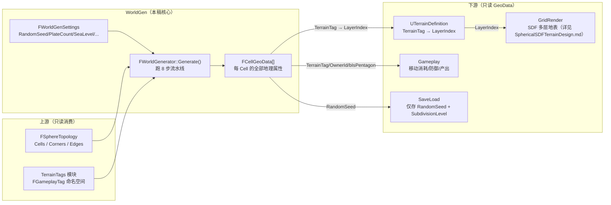
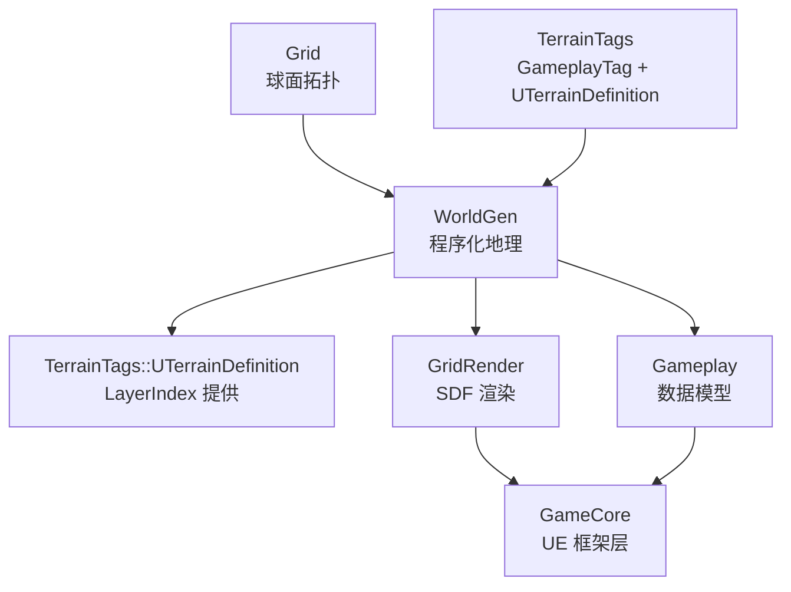
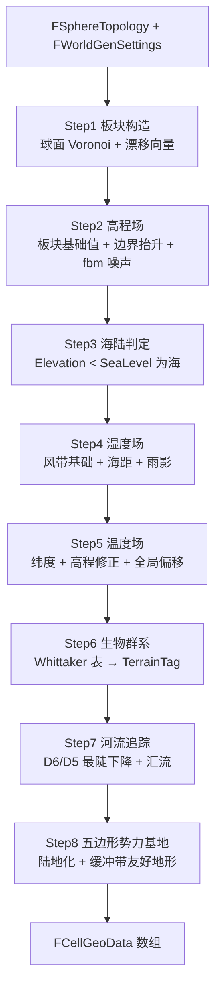
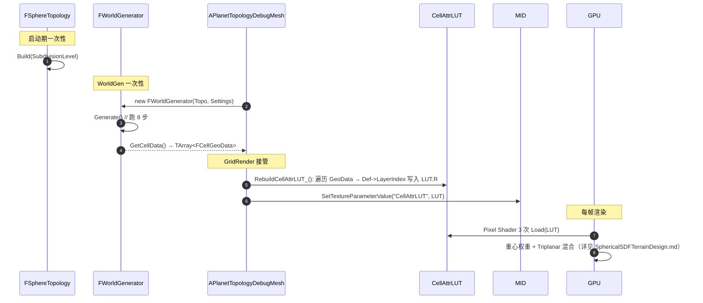

# 球面世界程序化生成（WorldGen）设计稿

> 目标：在 [`FSphereTopology`](../Source/Grid/Public/FSphereTopology.h) 球面拓扑（Goldberg 多面体 / IsoSphere primal mesh）上，以**自然地理流水线**生成每 `FCell` 的地形分类、高程、温湿度、板块、河流、势力基地等属性，输出一份 `TArray<FCellGeoData>` 数据契约，供下游 `GridRender`（SDF 多层地表渲染）、`Gameplay`（移动/战斗/占领）、`SaveLoad`（存档）等模块**纯只读**消费。
>
> WorldGen 是 [TechnicalDesign.md](TechnicalDesign.md) 全模块图中的 **`WorldGen` 节点**，本文是其完整细化设计稿。
>
> 关联：
> - 上游：[FSphereTopology.h](../Source/Grid/Public/FSphereTopology.h)、[FCell.h](../Source/Grid/Public/FCell.h)、[FCorner.h](../Source/Grid/Public/FCorner.h)、[FCellEdge.h](../Source/Grid/Public/FCellEdge.h)
> - 下游：[SphericalSDFTerrainDesign.md](SphericalSDFTerrainDesign.md)（消费 `FCellGeoData → LayerIndex`）、[TechnicalDesign.md](TechnicalDesign.md) §6 Gameplay（消费 `TerrainTag`、`OwnerId`、`bIsPentagon`）、[TechnicalDesign.md](TechnicalDesign.md) §11 SaveLoad（仅序列化 `RandomSeed + SubdivisionLevel`）
> - 协同：[AgentWorkflow.md](AgentWorkflow.md)（W1~W8 子阶段沿用 R1~R7 的"段 ①~④"工作 Loop 与文档纪律）
>
> 📐 **拓扑几何含义参考**：本稿假设读者已理解 `FSphereTopology` 各字段（`FCell.NeighborCellIds` 邻接图、`FCellEdge.bIsPlateBoundary` 板块边界字段、12 五边形不变量、Corner 即球面外心等）的几何含义。如对拓扑细节有疑问，请先查阅 [SphereTopologyReference.md](SphereTopologyReference.md)（"真理之源"基础设施稿）。WorldGen 模块仅在 `FCellEdge.bIsPlateBoundary` / `BoundaryStrength` 两个字段上写入，其余拓扑字段全部只读——契约详见 [SphereTopologyReference.md §8.1](SphereTopologyReference.md#81-worldgenworldgendesignmd)。
>
> ---
>
> ## ⚠ 阅读指引：WorldGen 与 SDF 渲染层的解耦边界
>
> 本设计稿与 [SphericalSDFTerrainDesign.md](SphericalSDFTerrainDesign.md) **互为独立模块**，仅通过 `FCellGeoData` 一个 POD 结构作为单向契约耦合（WorldGen → GridRender）。两侧的核心承诺：
>
> | 边界 | WorldGen 端（本稿） | SDF/GridRender 端 |
> | --- | --- | --- |
> | 何时跑 | 启动一次 + 玩家事件触发增量 | 启动一次构建 mesh + 每帧 PS 着色 |
> | 写什么 | `FCellGeoData[].TerrainTag/Elevation/Moisture/Temperature/PlateId/...` | 不写；只 `Load(CellAttrLUT)` 读 |
> | 读什么 | 仅 `FSphereTopology`（拓扑只读） | `FCellGeoData[].LayerIndex` → `Texture2DArray` slice |
> | 改了不刷另一侧 | ✅ 算法/参数/Whittaker 表全部独立调整，渲染端无需改动 | ✅ HLSL/材质/Triplanar 全部独立调整，WorldGen 无需改动 |
>
> **核心承诺（2026-06-29 修订）**：从 W4 完成那一刻起 SDF 渲染端**已具备**把 BaseTexIdx 从 Knuth placeholder 切换为 `Def->LayerIndex` 真实查表的能力——但实际切换时机**推迟到 R8.5 联调阶段**（因为 R8 + R8.5 阶段需要先用 placeholder 观察 17 种地形配方与径向位移 + 水面层的视觉协调）。R8/R8.5/R9 SDF 端的核心算法（4 通道 LUT、参数化 tint、自研网格几何）的工作量与 WorldGen 完全无关。
>
> **跨期同构性**（2026-06-29 更新）：原 PTG 路线已废弃。当前生产路线是 SDF 主稿 §16 的**自研球面网格方案**——本稿数据结构与算法**对 IsoSphere（R1~R8）与自研球面网格（R8.5+）两条几何路径无差别**——`FCellGeoData` 永远以 `CellId` 作为主键，下游怎么渲染（IsoSphere primal mesh 还是自研 sub+2 渲染网格）、是否做径向位移、是否上 LOD，都不影响 WorldGen 的输出形态。

---

## 0. 摘要 + 当前阶段

**当前阶段**：**W4 cpp 完成，等待联调验收**。R1~R7 渲染管线已完成；W1 模块骨架 ✅、W2 板块构造 + 海陆分离 ✅、W3 三标量场（高程 + 湿度 + 温度）✅ 全部通过用户 PIE 验收；W4 cpp 已落地（`TerrainTags` 模块 + DataAsset 驱动的生物群系评分器）。

> **路线调整（2026-06-29）**：原计划 "W4 → R8" 的串行依赖**已松绑**。新路线 "R8 (Tint 参数化) → R8.5 (自研球面网格) → W4 联调验收"——R8 + R8.5 阶段 SDF 端继续沿用 R3 Knuth 哈希 placeholder 观察 17 种地形配方在径向位移 + 水面遮挡下的视觉效果，然后再回头联调 W4 的 Whittaker 区间。WorldGen 模块自身的开发进度不变（W4 cpp 已完成、W5/W6 仍按原计划），仅是 "W4 验收" 这一动作被推迟到 R8.5 联调阶段。

| 子阶段 | 状态 | 一句话目标 |
| --- | --- | --- |
| **W1** | ✅ 完成 | 模块骨架 + `FCellGeoData` + `FWorldGenSettings`，编译通过 |
| **W2** | ✅ 完成 | 板块构造（球面 Voronoi + 漂移向量）+ 海陆分离 |
| **W3** | ✅ 完成 | 高程场（板块边界抬升/俯冲）+ 温湿度场（纬度 + 上风 SSSP + 高程）+ W3 测试材质 |
| **W4**（合并 W7）| 🛠 cpp 完成（待 R8.5 联调验收）| `TerrainTags` 模块落地 + `UTerrainDefinition::ClimateRules` 评分器分类 + 写 `Def->LayerIndex` 入 LUT（联调时正式替换 R8 的 Knuth placeholder） |
| **W5** | ⏳ 待开始 | 河流/湖泊追踪（D8 on Hex/Pent 邻接） |
| **W6** | ⏳ 待开始 | 12 五边形势力基地分配 + 缓冲带友好地形 |
| ~~**W7**~~ | ✅ 合并入 W4 | （原计划：`UTerrainDefinition` / `UBiomeTable` DataAsset 化）——W4 一步到位后本阶段取消 |
| **W8** | ⏳ 待开始 | 编辑器调参面板 + 可视化 Debug（板块染色、高程热图、河流叠加） |

**对外承诺锚点**：W4 完成 = 第一张可玩星球的最小有效集（12 五边形 + 板块 + 海陆 + 19 layer 生物群系）；W5/W6 是丰富度增强；W8 是工具链与可维护性。

> **✨ W4 架构拍板（2026-06-28）**：原计划“W4 cpp 硬编码 Whittaker 表 + W7 后 DataAsset 化”两阶段连始为一阶段。原因：“E/M/T 如何映射为 TerrainTag”是设计师可调的游戏设定，**应归属于 `TerrainTags` 模块、以 DataAsset 存储**，不应烘焙在 WorldGen cpp 中（否则 GameplayTag 的数据驱动原则失效）。另外，“几何短路”（`bIsLand` / `bIsCoast` / `bIsMountain`）也并非不可变的物理事实，而是“这个星球上什么叫海”这个游戏语义的一部分，同样交由设计师通过 `ClimateRules.Placement` 字段表达。WorldGen 仅作为“评分器”：递归遍历全部 `UTerrainDefinition`，调用每个 Def 的 `ScoreFor(Sample)` 取最高分者。详见 [W4_BiomeClassification.md](W4_BiomeClassification.md) §1 与 §2。

---

## 目录

- [1. 设计目标](#1-设计目标)
- [2. 自然地理理论基础](#2-自然地理理论基础)
  - [2.1 球面板块构造（Plate Tectonics on Sphere）](#21-球面板块构造plate-tectonics-on-sphere)
  - [2.2 Whittaker 双轴生物群系矩阵](#22-whittaker-双轴生物群系矩阵)
  - [2.3 河流追踪（D8 / Steepest Descent on Hex）](#23-河流追踪d8--steepest-descent-on-hex)
  - [2.4 与传统 2D Civ 类生成的差异](#24-与传统-2d-civ-类生成的差异)
- [3. 总体架构](#3-总体架构)
  - [3.1 与 Grid / TerrainTags / GridRender / Gameplay 的关系](#31-与-grid--terraintags--gridrender--gameplay-的关系)
  - [3.2 模块依赖图](#32-模块依赖图)
  - [3.3 输入 / 输出契约（FCellGeoData 字段表）](#33-输入--输出契约fcellgeodata-字段表)
- [4. 数据结构](#4-数据结构)
  - [4.1 FWorldGenSettings（参数面板）](#41-fworldgensettings参数面板)
  - [4.2 FCellGeoData（每 Cell 输出）](#42-fcellgeodata每-cell-输出)
  - [4.3 FPlateInfo（中间数据）](#43-fplateinfo中间数据)
  - [4.4 内部缓冲（Elevation/Moisture/Temperature 标量场）](#44-内部缓冲elevationmoisturetemperature-标量场)
- [5. 流水线总览（8 步）](#5-流水线总览8-步)
  - [5.1 Step1 板块构造](#51-step1-板块构造)
  - [5.2 Step2 高程场](#52-step2-高程场)
  - [5.3 Step3 海陆分离](#53-step3-海陆分离)
  - [5.4 Step4 湿度场](#54-step4-湿度场)
  - [5.5 Step5 温度场（纬度 + 高度修正）](#55-step5-温度场纬度--高度修正)
  - [5.6 Step6 生物群系分类（Whittaker 查表）](#56-step6-生物群系分类whittaker-查表)
  - [5.7 Step7 河流追踪](#57-step7-河流追踪)
  - [5.8 Step8 五边形势力基地分配](#58-step8-五边形势力基地分配)
- [6. 19-Layer 生物群系映射（Whittaker × 已导入纹理）](#6-19-layer-生物群系映射whittaker--已导入纹理)
- [7. 关键算法详解](#7-关键算法详解)
- [8. 性能预算](#8-性能预算)
- [9. 已知风险与对策](#9-已知风险与对策)
- [10. 与 SDF / Gameplay / SaveLoad 的契约](#10-与-sdf--gameplay--saveload-的契约)
- [11. 实施 Roadmap（W-step）](#11-实施-roadmapw-step)
  - [11.1 当前进度记录](#111-当前进度记录)
- [12. 已知风险与对策表](#12-已知风险与对策表)
- [13. 附：核心代码骨架](#13-附核心代码骨架)
- [14. 与 SDF 主稿的同构性约束](#14-与-sdf-主稿的同构性约束)
- [结语](#结语)

---

## 1. 设计目标

| 项 | 目标 |
| --- | --- |
| **每 Cell 一条 GeoData** | `FCellGeoData[CellId]` 唯一索引，包含 `TerrainTag` + `Elevation` + `Moisture` + `Temperature` + `PlateId` + `bIsLand/Coast/Mountain/River` + `Resources` + `BaseFactionId` 等全部下游需要的字段。 |
| **完全数据驱动** | Whittaker 表、19-Layer 映射、板块数、风带等全部走 `FWorldGenSettings` UPROPERTY 或 `UDataAsset`；不在算法 cpp 里硬编码任何"游戏数值"。 |
| **可重现性** | 同一个 `(SubdivisionLevel, RandomSeed, FWorldGenSettings)` 三元组永远生成完全相同的世界；`SaveLoad` 仅序列化此三元组而非整张 `FCellGeoData[]`。 |
| **拓扑天然兼容** | 复用 `FCellEdge::bIsPlateBoundary / BoundaryStrength`、`FCorner::bIsPentagon`、`FCell::Neighbors` 等 Grid 模块已有字段，**不在 WorldGen 内部重建任何拓扑数据**。 |
| **与渲染层零耦合** | WorldGen 不依赖 GridRender / 材质 / LUT 任何资源；输出仅是 cpp POD 结构。GridRender 通过 `UTerrainDefinition::LayerIndex` 间接消费 `TerrainTag`。 |
| **跨 sub 一致** | sub=3（642 cells）与 sub=4（2562 cells）使用同一份算法与参数；高分辨率仅放大细节，不改变板块/海陆/生物群系大格局。 |
| **增量更新友好** | 玩家行为（建造、占领、季节）改变的是 `FCellGeoData[CellId]` 的局部字段；不需要重跑整套流水线。 |

---

## 2. 自然地理理论基础

WorldGen 的所有算法都基于**真实地理学的简化模型**，并在球面拓扑上落地。本节是后续 §5 流水线与 §7 算法的**理论锚点**。

### 2.1 球面板块构造（Plate Tectonics on Sphere）

地球岩石圈被分成约 7~15 个大板块 + 若干小板块，每个板块以**球面切平面单位向量**为漂移方向，在地幔对流驱动下相对运动。我们简化为：

| 真实地球 | 本方案简化 |
| --- | --- |
| ~15 大板块 + 多个小板块 | `PlateCount = 12`（默认，与 12 五边形数量一致——但**不要求一一对应**） |
| 板块以欧拉极旋转 | 每个板块仅一个**球面切平面漂移向量** $\hat{a}_i$ + 漂移速率 $v_i$ |
| 海洋板块 / 大陆板块密度差异 | `bIsOceanic` 二值；海洋板块基础 Elevation 偏低 |
| 汇聚 / 张裂 / 平移三类边界 | 由相邻板块漂移向量在边界法向上的投影差 $\Delta v_n$ 决定 |

**边界类型判别**（关键不变量）：

设 Cell A 属板块 $P_a$、Cell B 属板块 $P_b$，A-B 边界中点为 $\hat{m}$，边界球面法向（沿 A→B 方向的切向）为 $\hat{n}_{AB}$，则：

$$
\Delta v_n = (\hat{a}_a v_a - \hat{a}_b v_b) \cdot \hat{n}_{AB}
$$

| 判定 | 边界类型 | 地形效应 |
| --- | --- | --- |
| $\Delta v_n > +\tau$ | **汇聚边界**（Convergent） | 抬升山脉（强度 ∝ $\Delta v_n$）；若一侧海洋一侧大陆 → 海沟 + 火山弧 |
| $\Delta v_n < -\tau$ | **张裂边界**（Divergent） | 下沉裂谷；若中洋脊则海洋盆地 |
| $|\Delta v_n| \le \tau$ | **平移边界**（Transform） | 无明显地形抬升；标记为"地震带" |

阈值 $\tau$ 由 `FWorldGenSettings::PlateBoundaryThreshold` 控制（默认 0.1）。

### 2.2 Whittaker 双轴生物群系矩阵

Whittaker（1975）提出地球生物群系主要由**年均温度 T** 与**年均降水 M**两个轴决定。我们将其离散化为 5×5 网格：

|  | M ∈ [0, 0.2)<br/>极干 | M ∈ [0.2, 0.4)<br/>干 | M ∈ [0.4, 0.6)<br/>中等 | M ∈ [0.6, 0.8)<br/>湿 | M ∈ [0.8, 1.0]<br/>极湿 |
| --- | --- | --- | --- | --- | --- |
| **T ∈ [0.8, 1.0]<br/>炎热** | Desert.Sand | Desert.Sand | Plain.Savanna | Forest.Tropical | Wetland |
| **T ∈ [0.6, 0.8)<br/>暖** | Desert.Sand | Plain.Savanna | Plain.Grass | Forest.Temperate | Forest.Tropical |
| **T ∈ [0.4, 0.6)<br/>温和** | Desert.Rocky | Plain.Grass | Plain.Grass | Forest.Temperate | Forest.Temperate |
| **T ∈ [0.2, 0.4)<br/>凉** | Desert.Rocky | Plain.Grass | Forest.Taiga | Forest.Taiga | Forest.Taiga |
| **T ∈ [0.0, 0.2)<br/>寒** | Tundra | Tundra | Tundra | Glacier | Glacier |

> **海洋/海岸特例**：在 Step6 进入 Whittaker 表之前，先做"海陆 mask"短路——`bIsLand=false` 直接打 `Ocean.Deep`/`Ocean.Shallow`；陆地与海洋相邻的 cell 强制为 `Coast.Beach`/`Coast.Rocky`。
>
> **山脉特例**：`Elevation > MountainThreshold` 的 cell 直接打 `Mountain.Hill`/`Mountain.Peak`/`Mountain.Snow`，不进 Whittaker 表。

`UTerrainDefinition::ClimateRules`（DataAsset）形式见 [W4_BiomeClassification.md §2.1](W4_BiomeClassification.md)；本表仅作为 19 个 DataAsset 资产初始值的建议。

### 2.3 河流追踪（D8 / Steepest Descent on Hex）

平面 D8（八方向最陡下降）在球面 Goldberg 网格上自然推广为 **D6/D5**（hex 6 邻接、pent 5 邻接）：

```
对每个非海洋 cell c：
    next = argmin_{n ∈ Neighbors(c)} Elevation(n)
    if Elevation(next) < Elevation(c) - ε:
        c.FlowTo = next
    else:
        c.FlowTo = -1  // 局部最低点 → 形成湖泊
```

之后做一次**汇流量累加**（拓扑排序按 Elevation 降序）：

```
对每个 cell c（按 Elevation 从高到低）：
    Discharge(c) += Moisture(c)   // 自身降水
    if c.FlowTo != -1:
        Discharge(c.FlowTo) += Discharge(c)
```

`Discharge(c) > RiverThreshold` 的 cell 标记 `bIsRiver=true`；下游 SDF 渲染层可在 LUT.G/B 通道携带 `bIsRiver` 做特殊样式。

> **湖泊处理**：局部最低点 + `Discharge > LakeThreshold` 标记为 `bIsLake=true`，地形 Tag 改为 `Wetland` 或新增 `Terrain.Water.Lake`。详细规则放 W5 详稿。

### 2.4 与传统 2D Civ 类生成的差异

| 维度 | 传统 2D Civ（Civ4/5/6） | 本方案（球面 Goldberg） |
| --- | --- | --- |
| 拓扑 | 矩形/六边形平面 + 极地裁剪 | 球面 Goldberg 多面体（10·4^N + 2 cells） |
| 板块 | 通常没有板块概念（直接噪声生地形） | 有真实球面板块构造 + 边界判定 |
| 五边形 | 不存在 | 严格 12 个，作为势力基地天然锚点 |
| 风带 | 按行像素纬度带 | 按球面 dot(UnitCenter, NorthPole) 纬度 |
| 海平面 | 全局阈值 + 噪声 | 板块 Elevation + 噪声 + 全局阈值 |
| 极区接缝 | 矩形投影需特殊处理 | 球面无接缝、无极点歧义 |
| 河流 | 沿 hex 边追踪 | 沿 cell-cell 邻接（D6/D5）追踪 |

**核心差异**：12 五边形是球面 Goldberg 多面体的几何不变量，本方案直接利用此不变量作为"12 势力基地"的拓扑锚点——这是平面 Civ 完全没有的设计自由度。

---

## 3. 总体架构

### 3.1 与 Grid / TerrainTags / GridRender / Gameplay 的关系



**关键解耦点**：

- **GridRender 不依赖 WorldGen**：GridRender 只读 `UTerrainDefinition::LayerIndex`，并不知道某个 Cell 为什么是这个地形。
- **Gameplay 不依赖 WorldGen 算法**：Gameplay 只读 `FCellGeoData[].TerrainTag` 等字段，不关心生成过程。
- **WorldGen 不依赖下游**：WorldGen 只需要 `FSphereTopology` 与 `FGameplayTag` 命名空间。

### 3.2 模块依赖图



### 3.3 输入 / 输出契约（FCellGeoData 字段表）

WorldGen 与下游唯一的耦合点：

| 字段 | 类型 | 默认值 | 写入阶段 | 下游消费方 |
| --- | --- | --- | --- | --- |
| `CellId` | `int32` | INDEX_NONE | W1 | All |
| `PlateId` | `int32` | INDEX_NONE | W2 Step1 | GridRender（板块边界样式）/ AI（开局策略） |
| `Elevation` | `float [-1, 1]` | 0 | W3 Step2 | GridRender（WPO 位移，详见 SDF 主稿 §14.5）/ Gameplay（防御加成） |
| `Moisture` | `float [0, 1]` | 0.5 | W3 Step4 | Gameplay（资源产出修正）/ Whittaker 输入 |
| `Temperature` | `float [-1, 1]` | 0 | W3 Step5 | Whittaker 输入 / Gameplay（季节系统） |
| `bIsLand` | `bool` | true | W2 Step3 | Gameplay（移动 Walk 不可入海）/ GridRender（海陆 LUT） |
| `bIsCoast` | `bool` | false | W2 Step3 | GridRender（Coast.Beach 样式）/ Gameplay（登陆机制） |
| `bIsMountain` | `bool` | false | W3 Step2 | Gameplay（Walk 不可上山顶）/ GridRender（雪线样式） |
| `bIsRiver` | `bool` | false | W5 Step7 | GridRender（河流软边）/ Gameplay（移动惩罚） |
| `bIsPentagon` | `bool` | false | W1（直接 copy `FCorner::bIsPentagon`） | All（势力基地锚点） |
| `TerrainTag` | `FGameplayTag` | None | W4 Step6 | TerrainTags::UTerrainDefinition → LayerIndex |
| `Resources` | `FGameplayTagContainer` | empty | W4 Step6 | Gameplay（产出表） |
| `BaseFactionId` | `int32` | INDEX_NONE | W6 Step8 | Gameplay（势力归属） |
| `OwnerId` | `int32` | INDEX_NONE | 运行时（Gameplay 改） | GridRender（Owner LUT，R9） |

> **不变量**：`CellId == 数组下标`；`bIsPentagon` 在 sub=3 时恰好 12 个 cell 为 true（与 IsoSphere 12 顶点对齐）。

---

## 4. 数据结构

### 4.1 FWorldGenSettings（参数面板）

```cpp
USTRUCT(BlueprintType)
struct WORLDGEN_API FWorldGenSettings
{
    GENERATED_BODY()

    /** 随机种子；同一种子 + 同 SubdivisionLevel 永远产生相同世界 */
    UPROPERTY(EditAnywhere, Category="WorldGen|General")
    int32 RandomSeed = 0;

    /** 板块数量；推荐 8~16，与 12 五边形数量协调 */
    UPROPERTY(EditAnywhere, Category="WorldGen|Plates", meta=(ClampMin="3", ClampMax="32"))
    int32 PlateCount = 12;

    /** 海洋板块比例 */
    UPROPERTY(EditAnywhere, Category="WorldGen|Plates", meta=(ClampMin="0.0", ClampMax="1.0"))
    float OceanicPlateRatio = 0.6f;

    /** 板块边界类型判别阈值（汇聚/张裂/平移） */
    UPROPERTY(EditAnywhere, Category="WorldGen|Plates", meta=(ClampMin="0.0"))
    float PlateBoundaryThreshold = 0.1f;

    /** 海平面阈值（Elevation 低于此值视为海洋） */
    UPROPERTY(EditAnywhere, Category="WorldGen|Elevation", meta=(ClampMin="-1.0", ClampMax="1.0"))
    float SeaLevel = 0.0f;

    /** 山脉阈值（Elevation 高于此值视为山脉） */
    UPROPERTY(EditAnywhere, Category="WorldGen|Elevation", meta=(ClampMin="0.0", ClampMax="1.0"))
    float MountainThreshold = 0.5f;

    /** 板块汇聚边界的山脉抬升强度 */
    UPROPERTY(EditAnywhere, Category="WorldGen|Elevation", meta=(ClampMin="0.0"))
    float MountainBoundaryStrength = 1.0f;

    /** 高程噪声的振幅（fbm） */
    UPROPERTY(EditAnywhere, Category="WorldGen|Elevation", meta=(ClampMin="0.0"))
    float ElevationNoiseAmplitude = 0.3f;

    /** 高程噪声频率 */
    UPROPERTY(EditAnywhere, Category="WorldGen|Elevation", meta=(ClampMin="0.0"))
    float ElevationNoiseFrequency = 2.0f;

    /** 湿度场最大值（影响整体雨量） */
    UPROPERTY(EditAnywhere, Category="WorldGen|Climate", meta=(ClampMin="0.0", ClampMax="1.0"))
    float MoistureScale = 1.0f;

    /** 海距湿度衰减系数（上风向 SSSP 中按累积距离衰减）。W3.5 默认 0.15 */
    UPROPERTY(EditAnywhere, Category="WorldGen|Climate", meta=(ClampMin="0.0"))
    float MoistureCoastalFalloff = 0.15f;

    /** [W3.5 deprecated] 雨影已内嵌到上风向 SSSP 边权中，本字段保留但 W3 不读；W4+ 可能重启用 */
    UPROPERTY(EditAnywhere, Category="WorldGen|Climate", meta=(ClampMin="0.0", ClampMax="1.0"))
    float RainShadowFactor = 0.3f;

    /** 高程衰减加权系数。上风向 SSSP 中高地 cell 边权 = 1 + AlphaElevation × max(0, Elev - SeaLevel)；默认 4.0 */
    UPROPERTY(EditAnywhere, Category="WorldGen|Climate", meta=(ClampMin="0.0", ClampMax="10.0"))
    float AlphaElevation = 4.0f;

    /** 海岸边权减免系数。上风向 SSSP 中海岸 cell 为上风邻居时边权 = 1 - AlphaCoast；默认 0.5 */
    UPROPERTY(EditAnywhere, Category="WorldGen|Climate", meta=(ClampMin="0.0", ClampMax="1.0"))
    float AlphaCoast = 0.5f;

    /** 全局温度偏移（暖期 = +0.2，冰期 = -0.3） */
    UPROPERTY(EditAnywhere, Category="WorldGen|Climate", meta=(ClampMin="-1.0", ClampMax="1.0"))
    float TemperatureBias = 0.0f;

    /** 海拔每升高 0.1 单位，温度下降的量 */
    UPROPERTY(EditAnywhere, Category="WorldGen|Climate", meta=(ClampMin="0.0"))
    float TemperatureLapseRate = 0.3f;

    /** 河流流量阈值；汇流量 > 此值的 cell 标记为河流 */
    UPROPERTY(EditAnywhere, Category="WorldGen|Rivers", meta=(ClampMin="0.0"))
    float RiverDischargeThreshold = 5.0f;

    /** 湖泊流量阈值；局部最低点 + 汇流量 > 此值标为湖泊 */
    UPROPERTY(EditAnywhere, Category="WorldGen|Rivers", meta=(ClampMin="0.0"))
    float LakeDischargeThreshold = 20.0f;

    /** 12 个势力基地的 Trait（数量必须 == 5/12 五边形数）—— W6 启用 */
    UPROPERTY(EditAnywhere, Category="WorldGen|Bases")
    TArray<FGameplayTagContainer> ForcedBaseTraits;

    /**
     * ✨ W4 启用（原计划 W7）。`UTerrainSet` 是 `TerrainTags` 模块提供的
     * DataAsset，持有一组 `UTerrainDefinition*`（每个 Def 自带 `ClimateRules[]`、
     * `LayerIndex`、玩法属性）。WorldGen `Step_ClassifyBiomes` 不知道任何
     * Tag/Layer 语义，仅递归 `Set->TerrainDefs` 调用 `Def->ScoreFor(Sample)` 取最大者。
     *
     * 这是实现“数据驱动原则”（TechnicalDesign §0.2）的核心拍板：设计师能在
     * 编辑器里调整“某 (T,M,E) 区间是什么生物群系”而不需重编译 cpp。
     */
    UPROPERTY(EditAnywhere, Category="WorldGen|Biomes")
    TSoftObjectPtr<class UTerrainSet> TerrainSet;
};
```

### 4.2 FCellGeoData（每 Cell 输出）

```cpp
USTRUCT(BlueprintType)
struct WORLDGEN_API FCellGeoData
{
    GENERATED_BODY()

    UPROPERTY() int32 CellId         = INDEX_NONE;
    UPROPERTY() int32 PlateId        = INDEX_NONE;

    UPROPERTY() float Elevation      = 0.f;     // [-1, 1]
    UPROPERTY() float Moisture       = 0.5f;    // [ 0, 1]
    UPROPERTY() float Temperature    = 0.f;     // [-1, 1]

    UPROPERTY() uint8 bIsLand     : 1;
    UPROPERTY() uint8 bIsCoast    : 1;
    UPROPERTY() uint8 bIsMountain : 1;
    UPROPERTY() uint8 bIsRiver    : 1;
    UPROPERTY() uint8 bIsLake     : 1;
    UPROPERTY() uint8 bIsPentagon : 1;

    UPROPERTY() FGameplayTag           TerrainTag;
    UPROPERTY() FGameplayTagContainer  Resources;

    UPROPERTY() int32 BaseFactionId = INDEX_NONE;
    UPROPERTY() int32 OwnerId       = INDEX_NONE;  // 运行时 Gameplay 写
    UPROPERTY() int32 FlowTo        = INDEX_NONE;  // W5 河流下游 cell（局部最低点 = -1）

    FCellGeoData()
        : bIsLand(1), bIsCoast(0), bIsMountain(0), bIsRiver(0), bIsLake(0), bIsPentagon(0)
    {}
};
```

> **每 Cell ~64 字节**——sub=3（642 cells）≈ 40 KB，sub=4（2562 cells）≈ 160 KB，sub=5（10242 cells）≈ 640 KB。

### 4.3 FPlateInfo（中间数据）

```cpp
USTRUCT()
struct WORLDGEN_API FPlateInfo
{
    GENERATED_BODY()

    int32   PlateId      = INDEX_NONE;
    int32   SeedCellId   = INDEX_NONE;
    FVector DriftAxis    = FVector::ZeroVector;   // 球面切平面单位向量（垂直于 SeedCellId 的 UnitCenter）
    float   DriftSpeed   = 0.f;                   // [0, 1]
    bool    bIsOceanic   = false;
    float   BaseElevation = 0.f;                  // 板块基础高程（海洋板块负、大陆板块正）
};
```

### 4.4 内部缓冲（Elevation/Moisture/Temperature 标量场）

W2~W5 中间结果以 `TArray<float>` 形式按 CellId 索引在 `FWorldGenerator` 私有成员中持有；W4 终结时一次性写入 `FCellGeoData[].Elevation/Moisture/Temperature`。这样允许多步迭代（如雨影需要先建好 Elevation 才能算 Moisture）。

```cpp
class WORLDGEN_API FWorldGenerator
{
private:
    TArray<float>      ElevationField;   // 1:1 with CellData
    TArray<float>      MoistureField;
    TArray<float>      TemperatureField;
    TArray<int32>      PlateIdField;
    TArray<float>      DischargeField;   // W5
    TArray<FPlateInfo> Plates;
};
```

---

## 5. 流水线总览（8 步）



> **W4 验收锚点**：W1+W2+W3+S6 完成即可输出第一张可玩星球；W5/W6 是丰富度增强。**联调时机调整（2026-06-29）**：W4 完成后不立即接入 SDF 端 LayerIndex，而是等 R8（参数化 Tint）+ R8.5（自研球面网格）联调通过后再做最终接入——SDF 端在 R8/R8.5 阶段沿用 Knuth 哈希 placeholder 观察效果。

下面各 Step 仅给**简介 + 输入输出 + 验收**；详细算法/HLSL/cpp 落地放各 W-step 独立详稿（[W1_ModuleSkeleton.md](W1_ModuleSkeleton.md)、[W2_PlatesAndLandSea.md](W2_PlatesAndLandSea.md)、...）。

### 5.1 Step1 板块构造

- **输入**：`FSphereTopology`、`PlateCount`、`OceanicPlateRatio`、`RandomSeed`
- **算法**：球面 Lloyd 松弛取均匀种子（详见 §7.1）→ BFS 多源最短路按 `arccos(dot(UnitCenter_a, UnitCenter_b))` 距离扩张 → 得 `PlateIdField[CellId]`；为每板块随机生成 `DriftAxis`（球面切平面）+ `DriftSpeed`+ `bIsOceanic`。
- **输出**：`PlateIdField` + `Plates`
- **W2 验收**：可视化 Debug 染色 12 板块 → 板块大小近似均等、无飞地（除非种子相邻引发的合理噪声）

### 5.2 Step2 高程场

- **输入**：`PlateIdField`、`Plates`、`MountainBoundaryStrength`、`ElevationNoiseAmplitude/Frequency`
- **算法**：每 cell 基础 Elevation = 所属板块的 `BaseElevation`；遍历 `FCellEdge`，若 `bIsPlateBoundary` 则按 §2.1 的 $\Delta v_n$ 公式计算抬升量加到两侧 cell（汇聚带最强、张裂带为负）；最后叠加 fbm 噪声（FastNoiseLite，详见 §7.4）。
- **输出**：`ElevationField`、`bIsMountain`（高于 `MountainThreshold` 的 cell）
- **W3 验收**：高程热图 → 板块边界处可见连续山脉/裂谷链；fbm 提供细节但不破坏大格局

### 5.3 Step3 海陆判定

- **输入**：`ElevationField`、`SeaLevel`
- **算法**：`bIsLand = Elevation > SeaLevel`；`bIsCoast = bIsLand && (任一邻居 !bIsLand)`
- **输出**：`bIsLand`、`bIsCoast`
- **W2 验收**：陆地大致占 30~50%、12 五边形若有部分落入海洋是允许的（W6 会在 Step8 强制陆地化基地）

### 5.4 Step4 湿度场（W3.5 修订：上风向 SSSP + 高程加权边权）

- **输入**：`ElevationField`、`bIsLand`、`bIsCoast`、`MoistureScale`、`MoistureCoastalFalloff`、`AlphaElevation`、`AlphaCoast`
- **算法**（[W3_ScalarFields.md §3.2](W3_ScalarFields.md) 详稿）：
  1. 上风向 SSSP、多源初始化：所有 ocean cell + bIsCoast cell 的 AccumDist = 0
  2. Bellman-Ford 多轮松弛：只从上风邻居（东侧 = `dot(nbr - cur, East) > 0`）取后续距离；边权 = `1 + AlphaElevation * max(0, Elev_up - SeaLevel) - AlphaCoast * (cur_up.bIsCoast ? 1 : 0)`（下限 0.1）；极区 `\|East\|<ε` 退化各向同性
  3. 基础湿度：`MoistureField[i] = MoistureScale * exp(-MoistureCoastalFalloff * AccumDist[i])`；clamp 到 [0, 1]
- **输出**：`MoistureField`
- **雨影不再独立**：高地 cell 边权 × AlphaElevation 后，跨过山脉后西侧自然更干。`RainShadowFactor` 废弃（保留字段）
- **W3 验收**：可视化 → **大陆东岸湿润**、**大陆西岸干燥**（东风模型）、山脉背风侧明显沙漠化；海岸 cell 额外鲜湿。**不会出现**“陆地湿度集中于 [0.7, 1.0]”的平缓分布。

### 5.5 Step5 温度场（纬度 + 高度修正）

- **输入**：`ElevationField`、`TemperatureBias`、`TemperatureLapseRate`
- **算法**：`Temperature = (1 - 2|UnitCenter.z|) + TemperatureBias - max(0, Elevation - SeaLevel) * TemperatureLapseRate`，clamp 到 [-1, 1]
- **输出**：`TemperatureField`
- **W3 验收**：极地寒冷、赤道炎热、高山降温

### 5.6 Step6 生物群系分类（`UTerrainDefinition::ScoreFor` 评分器）

> ⚡ **W4 重要拍板（2026-06-28）**：原“hard-coded 海洋/海岸/山脉短路 + Whittaker 5×5 表”全部下沉为 `UTerrainDefinition::ClimateRules[]` DataAsset 字段。WorldGen 仅作为评分器，**不知道“什么是海洋/山脉”**，严格遵循 [TechnicalDesign.md §0.2](TechnicalDesign.md) 数据驱动原则。详见 [W4_BiomeClassification.md §2](W4_BiomeClassification.md)。

- **输入**：`ElevationField`、`MoistureField`、`TemperatureField`、`bIsLand`、`bIsCoast`、`bIsMountain`、`UTerrainSet`（DataAsset，持一组 `UTerrainDefinition*`）
- **算法（一句话）**：
  ```
  for each cell c:
      Sample = { Elev_c, Moist_c, Temp_c, bLand_c, bCoast_c, bMountain_c }
      Best = argmax_{Def ∈ Set->TerrainDefs} Def->ScoreFor(Sample)
      CellData[c].TerrainTag = Best->TerrainTag
  ```
  `Def->ScoreFor(Sample)` 递归遍历本 Def 的 `ClimateRules[]`（OR 语义），取最高得分。单条规则：`Placement 匹配` 且 `T/M/E 均落在区间内` → 返回 `Priority`；否则 0。包含“短路”语义的规则可设 `bIsShortCircuit=true`，命中后会折合到最高优先级（详见 W4 详稿）。
- **输出**：`CellData[].TerrainTag` + LUT.R 直读 `Best->LayerIndex`（渲染端 GridRender 直接从 Def 读，WorldGen 不负责中转）
- **资源**：`Resources` 可作为 `UTerrainDefinition::DefaultResources` 同步拷入（W4 仅拷贝，不阅读）
- **W4 验收锚点（R8.5 联调时触发）**：在 R8 + R8.5 通过后，把 SDF 端 BaseTexIdx 从 R3 Knuth 哈希切换为 `Def->LayerIndex` 真实查表，球面呈现合理的“赤道沙漠/温带森林/极地冰原 + 12 五边形 + 大陆东岸森林 vs 西岸沙漠”分布；调试师可在编辑器里改 `T_Forest_Tropical.uasset` 的 `ClimateRules[0].Temperature` 区间从 [0.7,1.0] 改为 [0.6,1.0] 看到热带雨林立刻扩张

### 5.7 Step7 河流追踪

- **输入**：`ElevationField`、`MoistureField`、`bIsLand`
- **算法**：见 §2.3——每 cell 选最低邻居作为 `FlowTo`；按 Elevation 降序拓扑排序累加 `Discharge`；阈值过滤标记 `bIsRiver`/`bIsLake`
- **输出**：`bIsRiver`、`bIsLake`、`FlowTo`
- **W5 验收**：可视化河流网 → 从山脉发源、汇入海洋、无环路、无悬空

### 5.8 Step8 五边形势力基地分配

- **输入**：`bIsPentagon`（12 个）、`bIsLand`、`ForcedBaseTraits`
- **算法**：
  1. 强制 12 五边形 cell 陆地化（若原本是海，把 Elevation 抬升至 `SeaLevel + 0.05`，触发 Step6 重判 → `Plain.Grass` 默认）
  2. 缓冲带：12 五边形的 1-ring 邻居（共 60 个 cell）若是 `Mountain.Peak` 则降级为 `Mountain.Hill`，若是 `Desert` 则降级为 `Plain.Savanna`
  3. 写 `BaseFactionId = 0..11`，按 `ForcedBaseTraits[i]` 写 `Resources` 加成
- **输出**：`BaseFactionId`（12 cell 写、其余 -1）
- **W6 验收**：12 五边形必为陆地、必有友好出生圈、势力 Trait 正确

---

## 6. 19-Layer 生物群系映射（DataAsset 资产初始值建议表）

> ⚡ **W4 拍板后**：本表不再是“cpp 中硬编码的 `if-else` 链”，而是“为 19 个 `UTerrainDefinition` DataAsset 初次创建时填入 `ClimateRules[]` 的建议值”；如需微调仅在编辑器中改资产、无需重编译 cpp。已导入资产见 [Content/Textures/](../Content/Textures)，已合成 `T_TerrainAlbedoArray`（92 MB）。完整的 `ScoreFor` 评分机制、`Placement` 枚举、`Priority` 处理优先级均见 [W4_BiomeClassification.md §2](W4_BiomeClassification.md)。

| Layer Idx | 资产前缀 | TerrainTag | 触发条件 |
| --- | --- | --- | --- |
| 0 | `T_MarbleAquaBlue` | `Terrain.Ocean.Deep` | `Elevation < SeaLevel - 0.2` |
| 1 | `T_MarbleAquaBlue`（浅色变体或复用 0） | `Terrain.Ocean.Shallow` | `SeaLevel - 0.2 ≤ Elevation < SeaLevel` |
| 2 | `T_Beach_Sand` | `Terrain.Coast.Beach` | `bIsCoast && !板块汇聚` |
| 3 | `T_Shoreline_Beach_Rocks` | `Terrain.Coast.Rocky` | `bIsCoast && 板块汇聚边界` |
| 4 | `T_Grass_1` | `Terrain.Plain.Grass` | T∈[0.2,0.6], M∈[0.4,0.6] |
| 5 | `T_Grass_2` | `Terrain.Plain.Savanna` | T∈[0.6,1.0], M∈[0.2,0.4] |
| 6 | `T_Grass_3` | `Terrain.Forest.Temperate` | T∈[0.4,0.7], M∈[0.6,0.8] |
| 7 | `T_Grass_4` | `Terrain.Forest.Tropical` | T∈[0.7,1.0], M∈[0.8,1.0] |
| 8 | `T_Lawn_Grass` | `Terrain.Wetland` | M=1 + 低海拔 |
| 9 | `T_Sand` | `Terrain.Desert.Sand` | T∈[0.6,1.0], M∈[0.0,0.2] |
| 10 | `T_Stone_1` | `Terrain.Desert.Rocky` | T∈[0.0,0.6], M∈[0.0,0.2] |
| 11 | `T_Stone_2` | `Terrain.Mountain.Hill` | `bIsMountain && Elevation < 0.7` |
| 12 | `T_Stone_3` | `Terrain.Mountain.Peak` | `bIsMountain && Elevation ≥ 0.7 && T > 0.3` |
| 13 | `T_SnowRock_1` | `Terrain.Mountain.Snow` | `bIsMountain && Elevation ≥ 0.7 && T ≤ 0.3` |
| 14 | `T_SnowRock_2` | `Terrain.Forest.Taiga` | T∈[0.2,0.4], M∈[0.4,0.8] |
| 15 | `T_SnowRock_3` | `Terrain.Tundra` | T∈[0.0,0.2], M∈[0.0,0.6] |
| 16 | `T_SnowRock_4` | （备用变体） | — |
| 17 | `T_SnowRock_5` | （备用变体） | — |
| 18 | `T_Snow` | `Terrain.Glacier` | T < 0 + (M ≥ 0.6 \|\| 极地) |
| 19（可选） | `T_Lava` | `Terrain.Volcano` | 板块汇聚边界 + 海洋一侧 + 高 Elevation |

> **Layer 索引规约**（与 SDF 主稿 §4.1 / §16.1.2 LUT 对齐）：R8 起 `CellAttrLUT` 升级为 4 张多通道 LUT；R 通道改为 BaseTexIdx (0~16，对应 17 种地形配方)，G 通道为 OverlayIdx。WorldGen 端只需在 `Def->LayerIndex` 字段填这 17 个索引，材质参数（Tint/HSV/Roughness/Triplanar 等）由 `UTerrainDefinition::FTerrainMaterialParams` DataAsset 字段携带（详见 SDF 主稿 §16.1.3 配方表）。

`UTerrainDefinition`（详见 [W4_BiomeClassification.md §2.1](W4_BiomeClassification.md)）按上表逐项创建 DataAsset：为每个 Tag 指定 `LayerIndex`、填 `ClimateRules[]`（一般 1~3 条）、填玩法属性。**不要在 cpp 中硬编码 `TMap<FGameplayTag, int32>`**——W4 已合并原 W7 的 DataAsset 化工作，该中转表从开始就不存在。

---

## 7. 关键算法详解

> ⚠ 本节按 C 渐进填充：W1 启动前留**算法清单 + 公式**；W1~W5 启动各子阶段时再补完整 cpp 实现到对应详稿。

### 7.1 球面 Lloyd 松弛（板块种子均匀化）

```
1. 在球面上随机生成 N 个种子（直接抽样 unit Gaussian → normalize）
2. 重复 K 次（推荐 K=5）：
    a. 对每个 cell，找最近种子（球面 dot 最大）→ 形成 Voronoi
    b. 每个 Voronoi 区的"质心" = 区内所有 cell.UnitCenter 之和 → normalize
    c. 把种子移到质心
3. 输出最终 N 个种子
```

跨平台一致性：`FRandomStream(Settings.RandomSeed)` 全程驱动；不调用 `FMath::Rand()` 避免线程态污染。

### 7.2 BFS 板块扩张

复用 `FSphereTopology::Cells[i].Neighbors`（hex 6 / pent 5）——多源 BFS，初始队列为所有种子 cell；每步把当前 cell 的所有未访问邻居标记为同 PlateId 并入队。**可选**：按 `arccos(dot)` 球面距离做带权 Dijkstra，避免 BFS 的"曼哈顿"形状偏差。

### 7.3 板块边界类型判定（汇聚/张裂/平移）

见 §2.1。具体地：

```cpp
for (FCellEdge& Edge : Topology->Edges)
{
    int32 PlateA = PlateIdField[Edge.CellA];
    int32 PlateB = PlateIdField[Edge.CellB];
    if (PlateA == PlateB)
    {
        Edge.bIsPlateBoundary = false;
        continue;
    }
    Edge.bIsPlateBoundary = true;

    FVector Mid = (Cells[Edge.CellA].UnitCenter + Cells[Edge.CellB].UnitCenter).GetSafeNormal();
    FVector Nab = (Cells[Edge.CellB].UnitCenter - Cells[Edge.CellA].UnitCenter).GetSafeNormal(); // 切平面近似

    float DeltaVn = FVector::DotProduct(
        Plates[PlateA].DriftAxis * Plates[PlateA].DriftSpeed
      - Plates[PlateB].DriftAxis * Plates[PlateB].DriftSpeed,
        Nab);

    Edge.BoundaryStrength = FMath::Abs(DeltaVn);
    Edge.BoundaryType = (DeltaVn > Tau) ? Convergent
                      : (DeltaVn < -Tau) ? Divergent
                      : Transform;
}
```

### 7.4 噪声分层（FastNoiseLite 包装）

复用 [Plugins/ProceduralTerrainGenerator/Source/ThirdParty/FastNoiseLite/Public/FastNoiseLite.h](../Plugins/ProceduralTerrainGenerator/Source/ThirdParty/FastNoiseLite/Public/FastNoiseLite.h)（已在工程内）。封装一个 `FWorldGenNoise` wrapper：

```cpp
class FWorldGenNoise
{
public:
    FWorldGenNoise(int32 Seed, float Frequency, int32 Octaves = 4);
    /** 球面 3D 采样：dir 是单位向量 */
    float Sample3D(const FVector& dir) const;
    /** fbm 多层叠加 */
    float Fbm(const FVector& dir, int32 Octaves) const;
private:
    FastNoiseLite Noise;
};
```

W2/W3 在 cpp 内显式实例化两个：`PlateNoise`（low-freq, 板块大格局扰动）与 `DetailNoise`（high-freq, fbm 细节）。

### 7.5 D6/D5 河流流向 in Hex/Pent 邻接

见 §2.3。注意：球面 Goldberg 网格上 5/6 邻接已由 `FCell::Neighbors` 直接给出，无需自己算 D8 八方向。

---

## 8. 性能预算

> 基准：sub=3（642 cells）单线程 Generate()。

| 步骤 | 复杂度 | sub=3 估算 | sub=4 估算 | 备注 |
| --- | --- | --- | --- | --- |
| Step1 板块构造 | O(NumCells × log + Lloyd × 5) | < 1 ms | < 4 ms | BFS 主要开销 |
| Step2 高程场 | O(NumEdges + NumCells × Octaves) | < 2 ms | < 8 ms | fbm 噪声采样 |
| Step3 海陆判定 | O(NumCells) | < 0.1 ms | < 0.4 ms | 单遍 |
| Step4 湿度场 | O(NumCells × BFS_radius) | < 3 ms | < 12 ms | 海距 BFS |
| Step5 温度场 | O(NumCells) | < 0.1 ms | < 0.4 ms | 单遍 |
| Step6 生物群系分类 | O(NumCells) | < 0.5 ms | < 2 ms | Whittaker 查表 |
| Step7 河流追踪 | O(NumCells × log) | < 1 ms | < 4 ms | 拓扑排序 |
| Step8 基地分配 | O(12 × ring1) | < 0.1 ms | < 0.1 ms | 12 个 cell |
| **合计 Generate()** | — | **< 10 ms** | **< 40 ms** | 启动期一次性可接受 |

**显存**：纯 cpp POD，不占显存。下游 `CellAttrLUT` 显存由 GridRender 端核算（详见 SDF 主稿 §10）。

---

## 9. 已知风险与对策

详见 §12。本节仅列**最关键的 3 条**：

1. **板块种子聚集** → 球面 Lloyd 松弛 5 次解决（§7.1）
2. **覆盖盲区跳变** → W4 `Step_ClassifyBiomes` 使用 Sentinel fallback `Plain.Grass`；W4.5+ 可在 `UTerrainDefinition::ScoreFor` 升级为 smoothstep 软匹配 + 邻域平滑（详见 [W4_BiomeClassification.md §2.2](W4_BiomeClassification.md)）
3. **12 五边形落海/落山** → Step8 强制陆地化 + 缓冲带改写（§5.8）

---

## 10. 与 SDF / Gameplay / SaveLoad 的契约

### 10.1 SDF 渲染层只读 LayerIndex / Elevation

- GridRender 通过 `UTerrainDefinition* Def = Tag.GetDefinition(); int LayerIdx = Def->LayerIndex;` 间接消费 `TerrainTag`
- WPO 顶点位移（SDF 主稿 §14.5、R12）按径向方向 × `Elevation × ElevationScale` 外推
- **WorldGen 不知道 LayerIndex 的具体数值**——它只输出 `TerrainTag`，由 `UTerrainDefinition` 完成 Tag → Layer 的映射

### 10.2 Gameplay 只读 TerrainTag / OwnerId / bIsPentagon

- Gameplay 模块（详见 [TechnicalDesign.md](TechnicalDesign.md) §6）按 `TerrainTag` 查 `UTerrainDefinition` 拿移动消耗、防御加成、产出
- 12 五边形 cell 由 Gameplay 在 GameStart 时按 `bIsPentagon == true && BaseFactionId >= 0` 创建 `UBaseActor`
- `OwnerId` 是运行时字段，由 Gameplay 在玩家占领时写回 `FCellGeoData`

### 10.3 SaveLoad 只序列化 RandomSeed + SubdivisionLevel

- 保存：`(SubdivisionLevel, RandomSeed, FWorldGenSettings)`（约 100 字节）
- 加载：`FSphereTopology::Build(SubdivisionLevel)` → `FWorldGenerator(Topo, Settings).Generate()` → 完全还原 `FCellGeoData[]`
- **运行时 mutate**（OwnerId/Building/Decor）单独序列化 `UBoardState`，与 WorldGen 输出**不混合**

> **跨期不变量**：同一 `(Sub, Seed, Settings)` 三元组在 R8 / R8.5 / R9 / R10 / R11 任何阶段都生成完全相同的世界——这是回放、调试、玩家分享种子的基础。

---

## 11. 实施 Roadmap（W-step）

| 阶段 | 状态 | 目标 | 验证 |
| --- | --- | --- | --- |
| **W1** | ✅ 完成（用户已验收） | 新建 `Source/WorldGen/` 模块；`FCellGeoData`、`FWorldGenSettings`、`FWorldGenerator` 空骨架；TerraCivilization 主模块 Build.cs 加依赖；`APlanetTopologyDebugMesh` 持有 `FWorldGenSettings` UPROPERTY；编译通过、跑空 `Generate()` 无崩溃 | Output Log 输出 `[WorldGen] Skeleton OK, 642 cells, no-op generate`；详稿见 [W1_ModuleSkeleton.md](W1_ModuleSkeleton.md) |
| **W2** | ✅ 完成（用户已验收） | Step1（板块构造） + Step3（海陆分离）；为每 cell 写 `PlateId / bIsLand / bIsCoast`；接 R3 LUT —— `LayerIndex = bIsLand ? 4 : 0`（草地/海洋两色） | 球面看到 12 板块色块（debug 染色模式） + 海陆轮廓清晰（草地/海洋两色）；详稿见 [W2_PlatesAndLandSea.md](W2_PlatesAndLandSea.md) |
| **W3** | ✅ 完成（用户已验收） | Step2（高程场） + Step4（湿度场，含 W3.5 上风 SSSP 修订） + Step5（温度场）；写 `Elevation/Moisture/Temperature/bIsMountain`；同时写 `FCellEdge.bIsPlateBoundary / BoundaryStrength`；新增 `M_TopologyDebug_W3` 测试材质（红蓝归一化热图）；LUT 仍用 W2 的两色（仅看标量场，不影响 R7 渲染） | Debug 四种热图（Elevation/Moisture/Temperature/Mountain）分别显示合理分布；山脉沿板块汇聚边界、东风模型下大陆东岸湿润西岸干燥、极地寒冷赤道炎热；详稿见 [W3_ScalarFields.md](W3_ScalarFields.md) |
| **W4**（合并 W7）| 🛠 cpp 完成（待验收）| `TerrainTags` 模块落地 + `UTerrainDefinition::ClimateRules` 评分器分类 + 写 `Def->LayerIndex` 入 LUT（正式接 R8） | 球面呈现：12 五边形可见、12 板块边界山脉链、海陆 + 19 layer 生物群系合理分布；在编辑器里改某 `UTerrainDefinition.uasset` 的 `ClimateRules[0].Temperature` 区间 → 下次 PIE 看到该生物群系范围变化（DataAsset 驱动御底验收） |
| **W5** | ⏳ 待开始 | Step7（河流追踪）；写 `bIsRiver/bIsLake/FlowTo`；GridRender 在 LUT.B 通道携带 `bIsRiver` 做软边特殊样式 | 球面看到从山脉发源、汇入海洋的河流网，无环路无悬空 |
| **W6** | ⏳ 待开始 | Step8（势力基地分配）；12 五边形强制陆地化 + 缓冲带；写 `BaseFactionId`；GridRender 在 Owner LUT（R9）显示 12 势力出生圈 | 12 五边形必为陆地、出生圈友好（无沙漠/雪山）、12 不同势力色 |
| ~~**W7**~~ | ✅ 合并入 W4 | （原计划：`UTerrainDefinition` / `UBiomeTable` DataAsset 化）——`UTerrainDefinition` 在 W4 已 DataAsset 化并携带 `ClimateRules[]`；`UPlateProfile` 推到 W6 随势力基地调优阶段处理（如需要） |
| **W8** | ⏳ 待开始 | 编辑器调参面板（PropertyCustomization）+ 可视化 Debug 模式（板块染色 / 高程热图 / 河流叠加 / 风带箭头） | 在 Editor Viewport 一键切换 6 种 Debug 视图 |

每阶段单独可验证，不会卡死。W1~W4 是 R8.5 联调验收的最小有效集（R8 自身只需 R3 Knuth placeholder 即可）；W5~W6 是丰富度；W8 是工具链（原 W7 DataAsset 化已合并进 W4）。

### 11.1 当前进度记录

- **W0（✅ 2026-06）**：本设计稿创建。WorldGen 从 [SphericalSDFTerrainDesign.md](SphericalSDFTerrainDesign.md) 中独立出来，明确解耦边界（仅 `FCellGeoData` 单向契约）；19-Layer Whittaker 映射建议表完成；W1~W8 子阶段计划锁定。
- **W1（📝 2026-06）**：[W1_ModuleSkeleton.md](W1_ModuleSkeleton.md) 详稿完成——含 9 个新文件可粘贴全文 + `TerraCivilization` 主模块对接清单 + 11 项验收清单 + 14 条排错表。
- **W1（🛠 2026-06）**：W1 cpp 落地完成——`Source/WorldGen/` 9 个新文件全部创建、`TerraCivilization.Build.cs` 追加 `WorldGen + GameplayTags` 依赖、`APlanetTopologyDebugMesh.h` 加 `FWorldGenSettings WorldGenSettings` UPROPERTY、`Rebuild()` 末尾接入 `FWorldGenerator` 空 Generate 调用。
- **W1（✅ 2026-06 用户验收）**：用户在 PIE 中确认 Output Log 命中 `[WorldGen] Skeleton OK, 642 cells, no-op generate`、R7 视觉零回归（像素级保持）、Editor `WorldGen` 折叠组可见可编辑。W1 阶段全部 11 项验收清单 ✅ 通过。
- **W2（📝 2026-06 启动）**：[W2_PlatesAndLandSea.md](W2_PlatesAndLandSea.md) 详稿撰写中。目标——Step1 板块构造（球面 Lloyd + 多源 BFS Voronoi + 板块漂移向量）+ Step3 海陆分离（按 SeaLevel 二分 + 海岸 1-ring 标记）；GridRender 端 LUT 切换为 `LayerIndex = bIsLand ? 4 : 0` 两色。
- **W2（🛠 2026-06 cpp 落地）**：W2 cpp 落地完成——`FWorldGenerator::Step_PartitionPlates / Step_DetermineLandSea` 实体化（球面 Lloyd 5 次 + 板块漂移 + Fisher-Yates 海陆分配 + 1-ring 海岸标记）；`APlanetTopologyDebugMesh::Generator` 提升为 `TUniquePtr` 成员；`RebuildCellAttrLUT_()` R 通道按 `EWorldGenDebugView`（None / PlateId / LandSea）切换写入；过程中踩字段名坑 `Cells[i].Neighbors → NeighborCellIds`，已沉淀到 [AgentWorkflow.md §1.4.0](AgentWorkflow.md)。
- **W2（✅ 2026-06 用户验收）**：用户在 PIE 中确认 Output Log 命中 `[WorldGen] W2 OK, 642 cells, 12 plates, ~257 land / ~385 ocean (~40%), ~50~80 coast`、12 板块色斑近似均等无飞地、海陆轮廓清晰、R7 视觉零回归。W2 阶段全部 12 项验收清单 ✅ 通过。
- **W3（📝 2026-06 启动）**：[W3_ScalarFields.md](W3_ScalarFields.md) 详稿撰写中。目标——Step2 高程场（板块基础值 + 边界 $\Delta v_n$ 抬升 + fbm 噪声 + `bIsMountain` 阈值标记 + 写 `FCellEdge.bIsPlateBoundary / BoundaryStrength`）+ Step4 湿度场（风带 + 海距 BFS + 雨影）+ Step5 温度场（纬度 + 高程 lapse rate）；新增 Debug 视图 `Elevation / Moisture / Temperature / Mountain` 四种热图；LUT 仍维持 W2 两色（W4 才正式接 19-Layer）。
- **W3（🛠 2026-06 cpp 落地）**：W3 cpp 落地完成——`WorldGen.Build.cs` 加 `FastNoiseLite` 私有依赖；`WorldGenerator.cpp` 内嵌 `FWorldGenNoise` （OpenSimplex2 + FBm 4 octaves） + 实体化 `Step_ComputeElevation`（抬升 0.5× 经验缩放 + fbm 种子 `Seed^0x1A2B3C4D` 解耦） / `Step_SimulateMoisture`（多源 BFS 海距 + 东向雨影） / `Step_ComputeTemperature`（纬度 `1-2|z|` + lapse rate）；`FWorldGenerator` 持有 `Topology` 升级为非 const（以写 `FCellEdge.bIsPlateBoundary/BoundaryStrength`）；`EWorldGenDebugView` 扩展 4 种热图 + `RebuildCellAttrLUT_` 两个 switch 同步；过程中还发现了 FastNoiseLite `enum class` 必须写完整三段 `FastNoiseLite::NoiseType::NoiseType_OpenSimplex2` 的坑，已沉淀到 [W3_ScalarFields.md §6](W3_ScalarFields.md) 排错表。
- **W3.5（🔧 2026-06-28 修订）**：PIE 实测发现湿度梯度过弱、海陆差不显著、未体现风向；将 `Step_SimulateMoisture` 从"BFS 海距 + 东向雨影衰减"改为"上风向 SSSP 可变边权"——边权 `w(u→v) = 1 + AlphaElevation × max(0, Elev_v - SeaLevel) - AlphaCoast × bIsCoast(u)`，雨影内嵌为高地额外加权，海岸优先扩散；新增 `AlphaElevation / AlphaCoast` 两参数，`RainShadowFactor` 字段保留但 W3 不读。同期发现并修复"自西向东方向反"踩坑：UE5 是左手系 + Z up，正确东向公式是 `FVector(U.Y, -U.X, 0)` 而非凭 2D 直觉的 `(-U.Y, U.X, 0)`；已沉淀到 [AgentWorkflow.md §3.7](AgentWorkflow.md)。同步新增 `M_TopologyDebug_W3` 测试材质（Custom HLSL 把 `[0,1]` LUT 标量做红蓝归一化热图，便于直观观察 Elevation/Moisture/Temperature 的相对大小）。
- **W3（✅ 2026-06-28 用户验收）**：用户在 PIE 中确认上风 SSSP 修订后湿度场出现合理梯度（东风模型下大陆东岸湿润、西岸干燥，山脉背风面进一步干燥）、高程/温度热图分布合理、12 板块边界山脉链清晰、海陆轮廓蜔蜒、R7 视觉零回归。W3 阶段全部验收清单 ✅ 通过；详稿见 [W3_ScalarFields.md](W3_ScalarFields.md)。
- **W4（🏗 2026-06-28 架构拍板）**：用户提出关键架构质疑——“E/M/T → TerrainTag”的分类规则如果硬编码在 WorldGen，TerrainTags 将沉为字符串别名，违反 [TechnicalDesign §0.2](TechnicalDesign.md) 数据驱动原则。拍板结果：合并 W4 + W7，一步落地 `TerrainTags` 模块 + DataAsset 驱动；WorldGen 仅作为评分器、不知道任何具体生物群系语义；连“海洋/海岸/山脉”几何短路都归于 `ClimateRules.Placement` 设计师可调。Q1=A、Q2=`FWorldGenSettings::TerrainSet` 显式指向、Q3=硬区间 ScoreFor 起步、Q5=渲染端直读 `Def->LayerIndex`（不在 `FCellGeoData` 中转）。
- **W4（🛠 2026-06-28 cpp 落地）**：W4 cpp 落地完成——新建 `Source/TerrainTags/` 模块（8 个文件：`TerrainTags.Build.cs`/`.h`/`.cpp` + `TerrainPlacementMask.h` + `TerrainClimateRule.h` + `TerrainDefinition.h/.cpp` + `TerrainSet.h/.cpp`）；创建 [`Config/Tags/Terrain.ini`](../Config/Tags/Terrain.ini) 注册 17 个 `Terrain.*` Tag；`.uproject` 添加 `Grid` / `WorldGen` / `TerrainTags` 三个 Modules 项；`WorldGen.Build.cs` 与 `TerraCivilization.Build.cs` 追加 `TerrainTags` 依赖；`FWorldGenSettings` 字段 `BiomeTable → TerrainSet : TSoftObjectPtr<UTerrainSet>` + `SentinelTerrainTag : FGameplayTag`；`FWorldGenerator::Step_ClassifyBiomes` 实体化为双层 for + `Def->ScoreFor(Sample)` argmax + `LastBiomeSentinelCount` 计数 + `[WorldGen] W4 OK ... biome-sentinel=N` 末尾日志；`EWorldGenDebugView` 末尾追加 `Biome` 项，`DebugView` 默认值从 `None` 改为 `Biome`；`RebuildCellAttrLUT_()` 顶部预构建 `TagToDefMap`，主写入与诊断 switch 统一调用 `ComputeLayerForCell` lambda（Biome / None 默认分支走 `Def->LayerIndex`）。cpp 端零 Tag 字符串句柄消费（Sentinel 走 `Settings.SentinelTerrainTag` 字段）。待用户在编辑器中创建 17 个 `DA_Terrain_*.uasset` + `DA_TerrainSet_Default.uasset` + 在 Actor 面板挂 `TerrainSet` 与 `SentinelTerrainTag = Terrain.Plain.Grass`，然后编译 + PIE 验收。

---

## 12. 已知风险与对策表

| 风险 | 触发场景 | 对策 |
| --- | --- | --- |
| **板块种子聚集** | `RandomSeed` 落入坏种子，10 个种子集中在一个半球 | 球面 Lloyd 松弛 5 次（§7.1）；UI 暴露 `LloydIterations` 参数 |
| **板块边界飞地** | BFS 扩张时一个 cell 同时被两板块争抢 | 多源 BFS 严格按入队序，第一个到达者胜；不允许覆盖 |
| **12 五边形落海/落山** | 板块基础 Elevation 太低导致五边形 cell 落入海洋 | Step8 强制陆地化（抬升至 SeaLevel + 0.05）+ 缓冲带改写（§5.8） |
| **Whittaker 边界跳变** | T/M 在区间边界上 cell 看起来突变（砬克式）| W4.5+ 为 `UTerrainDefinition::ScoreFor` 升级为 smoothstep 软匹配 + 邻域多数表决平滑（详 [W4_BiomeClassification.md §6](W4_BiomeClassification.md)） |
| **山脉过多/过少** | `MountainBoundaryStrength` 调过头或过小 | 暴露 `MountainThreshold` + `MountainBoundaryStrength` 双参数；W8 Debug 视图实时反馈 |
| **湿度场全 0 或全 1** | 风带计算公式错误 / `MoistureScale` 过小 | W3 详稿单独给出测试用例：纯陆球（无海）应得全干；纯海球应得全湿 |
| **河流环路** | Elevation 在数值精度下出现等值环 | 拓扑排序前用 `Elevation += tiny_jitter(CellId)` 打破 ties |
| **河流悬空** | `bIsRiver` cell 不连续（中间断开） | 拓扑排序保证：若 A.FlowTo == B 且 A 是 river，则 B 也是 river（除非 B 是海洋汇入点） |
| **跨 sub 行为不一致** | sub=3 → sub=4 时同种子产生完全不同的世界 | 把所有"按 cell 数量缩放"的参数改为"按球面立体角缩放"；详稿 W2 跨 sub 一致性测试 |
| **`FWorldGenSettings` 字段加错触发存档失效** | 加新字段后旧存档读取错版本 | 给 `FWorldGenSettings` 加 `int32 Version` 字段；SaveLoad 模块按版本号迁移 |
| **板块汇聚边界判定数值不稳** | `Δv_n` 接近 `±τ` 时分类抖动 | 对 `BoundaryStrength` 做 hysteresis（双阈值），避免 sub 微变时分类翻转 |
| **WorldGen 与 Gameplay 数据竞争** | 玩家占领时 Gameplay 写 `OwnerId`，同时 W6 在跑 Step8 重分配 | `OwnerId` 仅运行时改、`Generate()` 后永不重跑 Step8；存档加载时 Gameplay 在 WorldGen 后跑 |

---

## 13. 附：核心代码骨架

> 仅展示与本方案直接相关的关键部分；命名空间/include 省略。完整可粘贴的 cpp 代码放各 W-step 详稿。

### 13.1 `FWorldGenerator` 头文件

```cpp
// Public/WorldGenerator.h
class WORLDGEN_API FWorldGenerator
{
public:
    explicit FWorldGenerator(const FSphereTopology* InTopology, const FWorldGenSettings& InSettings);

    /** 跑完整 8 步流水线；执行后 GetCellData() 可用 */
    void Generate();

    const TArray<FCellGeoData>& GetCellData() const   { return CellData; }
    const TArray<FPlateInfo>&   GetPlates()   const   { return Plates; }
    const TArray<int32>&        GetBaseCellIds() const { return BaseCellIds; }

    /** Debug：单步运行（W8 编辑器视图用） */
    void Step_PartitionPlates();        // W2
    void Step_ComputeElevation();       // W3
    void Step_DetermineLandSea();       // W2
    void Step_SimulateMoisture();       // W3
    void Step_ComputeTemperature();     // W3
    void Step_ClassifyBiomes();         // W4
    void Step_TraceRivers();            // W5
    void Step_AssignBaseCells();        // W6

private:
    const FSphereTopology* Topology = nullptr;
    FWorldGenSettings      Settings;
    FRandomStream          Rng;

    TArray<FCellGeoData>   CellData;
    TArray<FPlateInfo>     Plates;
    TArray<int32>          BaseCellIds;

    // 中间标量场（详见 §4.4）
    TArray<float>          ElevationField;
    TArray<float>          MoistureField;
    TArray<float>          TemperatureField;
    TArray<int32>          PlateIdField;
    TArray<float>          DischargeField;
};
```

### 13.2 `Generate()` 主循环

```cpp
void FWorldGenerator::Generate()
{
    SCOPE_CYCLE_COUNTER(STAT_WorldGen_Generate);
    check(Topology);

    const int32 N = Topology->Cells.Num();
    CellData.SetNum(N);
    PlateIdField.SetNumZeroed(N);
    ElevationField.SetNumZeroed(N);
    MoistureField.SetNumZeroed(N);
    TemperatureField.SetNumZeroed(N);
    DischargeField.SetNumZeroed(N);

    // CellId / bIsPentagon 可在 W1 阶段就 copy
    for (int32 i = 0; i < N; ++i)
    {
        CellData[i].CellId      = i;
        CellData[i].bIsPentagon = Topology->Cells[i].bIsPentagon ? 1 : 0;
    }

    Rng.Initialize(Settings.RandomSeed);

    Step_PartitionPlates();        // W2
    Step_ComputeElevation();       // W3
    Step_DetermineLandSea();       // W2
    Step_SimulateMoisture();       // W3
    Step_ComputeTemperature();     // W3
    Step_ClassifyBiomes();         // W4
    Step_TraceRivers();            // W5
    Step_AssignBaseCells();        // W6

    UE_LOG(LogWorldGen, Log,
        TEXT("[WorldGen] Generate done. Cells=%d Plates=%d Bases=%d Seed=%d"),
        N, Plates.Num(), BaseCellIds.Num(), Settings.RandomSeed);
}
```

### 13.3 板块构造代码骨架（W2）

```cpp
void FWorldGenerator::Step_PartitionPlates()
{
    Plates.SetNum(Settings.PlateCount);

    // 1. 在球面随机生成种子（unit Gaussian normalize）
    TArray<FVector> Seeds;
    Seeds.Reserve(Settings.PlateCount);
    for (int32 i = 0; i < Settings.PlateCount; ++i)
    {
        FVector v(Rng.FRandRange(-1, 1), Rng.FRandRange(-1, 1), Rng.FRandRange(-1, 1));
        Seeds.Add(v.GetSafeNormal());
    }

    // 2. 球面 Lloyd 松弛 5 次（详见 §7.1）
    for (int32 Iter = 0; Iter < 5; ++Iter)
    {
        // ... BFS Voronoi → 区内质心 → 移种子 ...
    }

    // 3. 多源 BFS 扩张到所有 cell（详见 §7.2）
    // ... 写入 PlateIdField[CellId] ...

    // 4. 为每板块生成 DriftAxis / DriftSpeed / bIsOceanic
    for (int32 i = 0; i < Settings.PlateCount; ++i)
    {
        Plates[i].PlateId    = i;
        Plates[i].SeedCellId = /* nearest cell to Seeds[i] */;
        // 球面切平面：随机轴 - 投影到法向
        FVector RandAxis(Rng.FRandRange(-1,1), Rng.FRandRange(-1,1), Rng.FRandRange(-1,1));
        Plates[i].DriftAxis  = (RandAxis - FVector::DotProduct(RandAxis, Seeds[i]) * Seeds[i]).GetSafeNormal();
        Plates[i].DriftSpeed = Rng.FRandRange(0.3f, 1.f);
        Plates[i].bIsOceanic = Rng.FRand() < Settings.OceanicPlateRatio;
        Plates[i].BaseElevation = Plates[i].bIsOceanic ? -0.4f : +0.3f;
    }

    // 5. 写回 CellData
    for (int32 c = 0; c < CellData.Num(); ++c)
    {
        CellData[c].PlateId = PlateIdField[c];
    }
}
```

> 完整 cpp 实现 + 单元测试放 [W2_PlatesAndLandSea.md](W2_PlatesAndLandSea.md) 详稿。

---

## 14. 与 SDF 主稿的同构性约束

> 这是与 [AgentWorkflow.md](AgentWorkflow.md) §6 "跨期同构性约束" 平行的、WorldGen 内部的同构性纪律。本章必须严格遵守，否则会破坏 SDF 端的核心承诺。

### 14.1 LUT 字段对齐

`CellAttrLUT` 是 SDF 主稿 §4.1 / §5.2 定义的 1×NumCells、PF_R8G8B8A8 纹理。WorldGen 写入侧规约：

| 通道 | 含义 | 写入阶段 | 范围 |
| --- | --- | --- | --- |
| **R** | LayerIndexBase（→ Texture2DArray slice） | W4 | [0, 19] 推荐；预留 [20, 255] 给扩展 |
| **G** | LayerIndexDecor（雪覆盖、焦土、政治版图） | W6/R9 | 0 = 无 |
| **B** | Variant（同地形随机变体） | W4/W6 | 由 `FCellGeoData::CellId` 哈希派生 |
| **A** | Mask（bit0=bIsCoast, bit1=bIsRiver, bit2=bIsBaseCity, ...） | W2/W5/W6 | 位掩码 |

> 任何字段语义变更必须**同步**修改 SDF 主稿 §4.1 与本稿 §6/§14.1 两处。

### 14.2 LayerIndex 规约

- 0~19 = 19 已导入纹理（详见 §6 表）
- 20~127 = 预留扩展（季节变体、文明建筑覆盖）
- 128~255 = Decor / Owner / Fog 三套独立 LUT 的子集（R9）

### 14.3 跨模块调用时序



**关键不变量**：

- `WG.Generate()` 必须在 `RebuildCellAttrLUT_()` 之前完成
- 任何 `CellId → LayerIndex` 的查询必须经过 `UTerrainDefinition`（W4 起严禁在 cpp 中硬编码 Tag→Layer 映射）
- WorldGen 内部不得调用 GridRender / 材质 / LUT 任何 API；**WorldGen 模块的 Build.cs 不依赖 GridRender**

### 14.4 跨期路径的同构性

与 SDF 主稿 §16 一致：WorldGen 输出 `FCellGeoData` 永远以 `CellId` 为主键；SDF 端无论是 R1~R8 的 IsoSphere 还是 R8.5+ 的自研球面网格路线，**都通过同一份 LUT 消费 WorldGen 的输出**。

具体而言：

| 阶段 | SDF 渲染路径 | WorldGen 端是否需要适配 |
| --- | --- | --- |
| R8（Tint 参数化）| IsoSphere primal + 4 通道 LUT + 17 种 tint 配方（仍用 Knuth placeholder） | ❌ 不需要——R8 不消费 WorldGen，验收时 Knuth 哈希派生 BaseTexIdx |
| R8.5（自研球面网格）| 自研 sub+2 渲染网格 + cpp 端径向位移（消费 `Elevation`）| ⚠ 仅消费 `Elevation` 字段——W3 已就绪，无需新增 |
| W4 联调验收 | 在 R8.5 上把 BaseTexIdx 从 Knuth placeholder 切换为 `Def->LayerIndex` | ❌ 不需要——这就是 W4 的原始目标 |
| R9 多 LUT | 加 Decor/Owner/Fog 三 LUT | ❌ 不需要——多 LUT 是 SDF 端的事；WorldGen 只需在 W6 写 BaseFactionId |
| R10 LOD | 自研球面网格 LOD（远 sub+0、近 sub+2、超近 sub+3） | ❌ 不需要——LOD 是 SDF 端的事 |
| R11 高亮 | 接入 §15 高亮描边 + SelectLUT | ❌ 不需要——LUT 通道含义不变 |
| ~~原 R11 PTG 路线~~ | ❌ 已废弃 | — |
| ~~原 R12 WPO 顶点位移~~ | ❌ 已废弃（被 R8.5 cpp 端径向位移取代）| — |
| ~~原 R13 高亮~~ | ❌ 已废弃（编号改为 R11） | — |

**结论**：从 W4 锁定 `FCellGeoData` 字段集那一刻起，**WorldGen 端永不为 SDF 端的迭代而改动**——这是双方解耦的硬承诺。

---

## 结语

WorldGen 是 TerraCivilization 的"自然地理引擎"：**只对 `FSphereTopology` 与 `FWorldGenSettings` 负责，只输出 `FCellGeoData[]`**。

它与 [SphericalSDFTerrainDesign.md](SphericalSDFTerrainDesign.md) 通过单向契约解耦，与 [TechnicalDesign.md](TechnicalDesign.md) §6 Gameplay 通过 `TerrainTag/OwnerId/bIsPentagon` 三字段解耦，与 SaveLoad 通过 `RandomSeed + SubdivisionLevel` 二元组解耦——这种"窄接口、宽内涵"的设计，正是项目能在 R8~R11 多个阶段保持低耦合、高可演化性的关键。

W1 启动时的第一份详稿是 [W1_ModuleSkeleton.md](W1_ModuleSkeleton.md)；后续 W2~W8 每个子阶段独立成稿，命名规则 `W<N>_<Topic>.md`，结构对齐 [AgentWorkflow.md](AgentWorkflow.md) §1.3 的 8 章 + 附录。

> **致后续维护者**：如果 SDF 端要新增字段（如 R8.5 自研网格需要某个新 LUT 通道、或 R9 多 LUT 扩展），先回到 §14.1 LUT 字段对齐表里加一行；不要在 cpp 里"顺手"加。窄接口的承诺一旦破坏，下次重构会跨 5 个模块。
